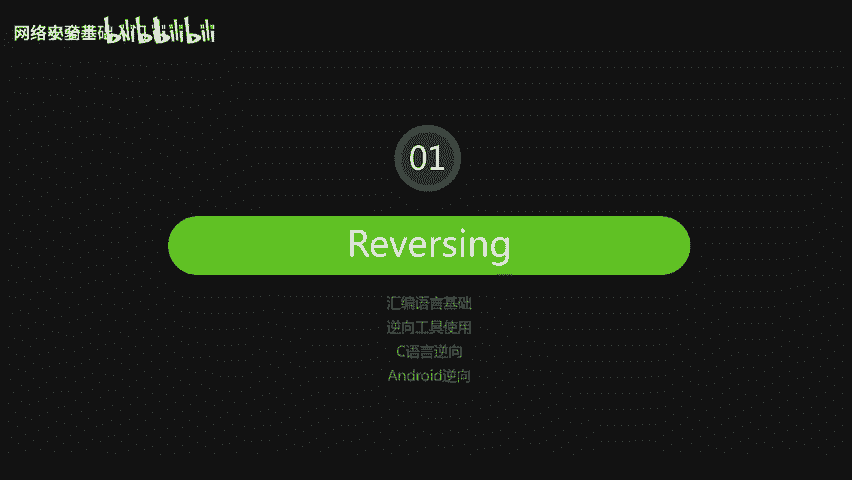
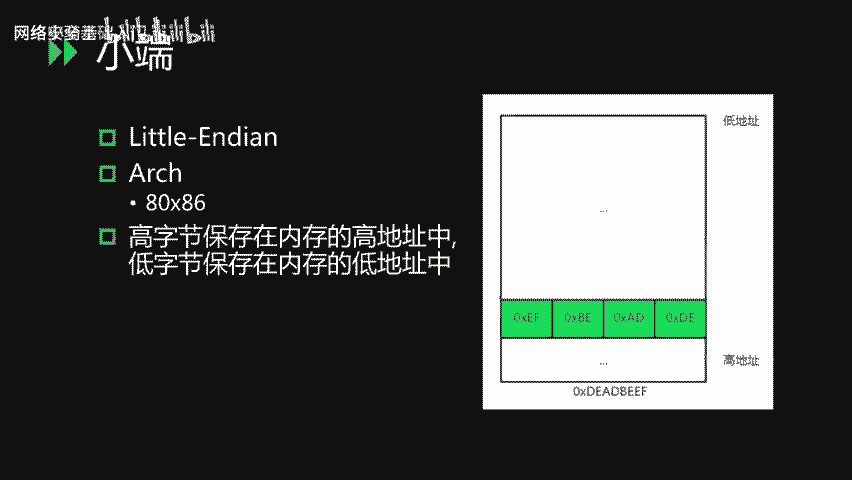
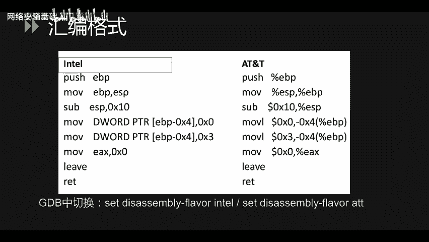
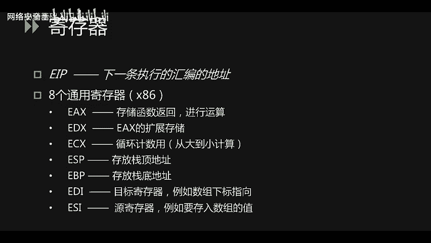
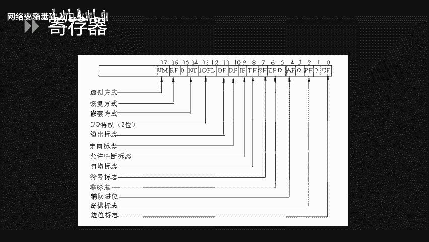
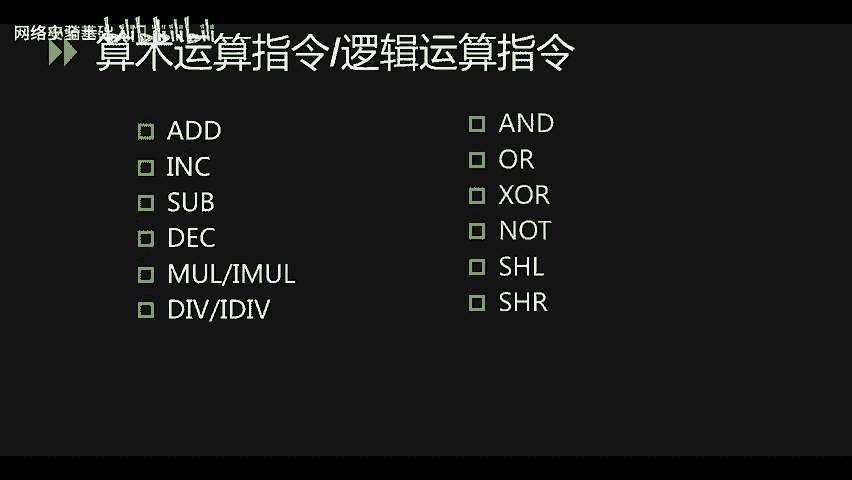
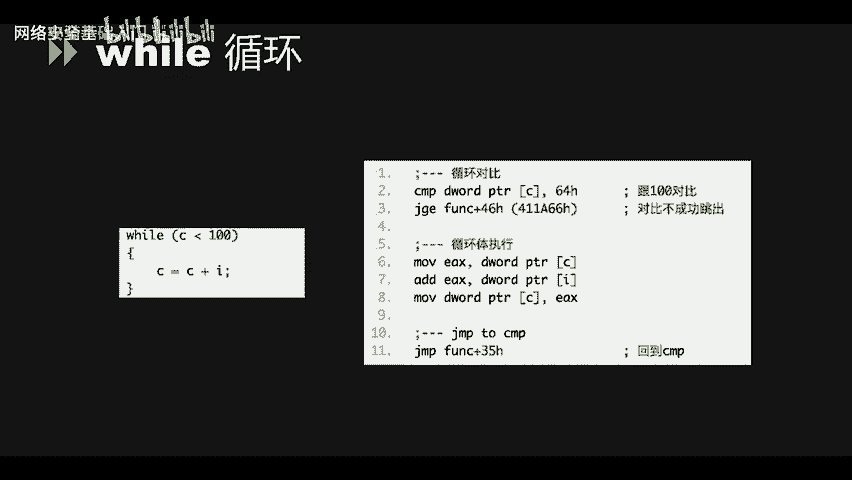
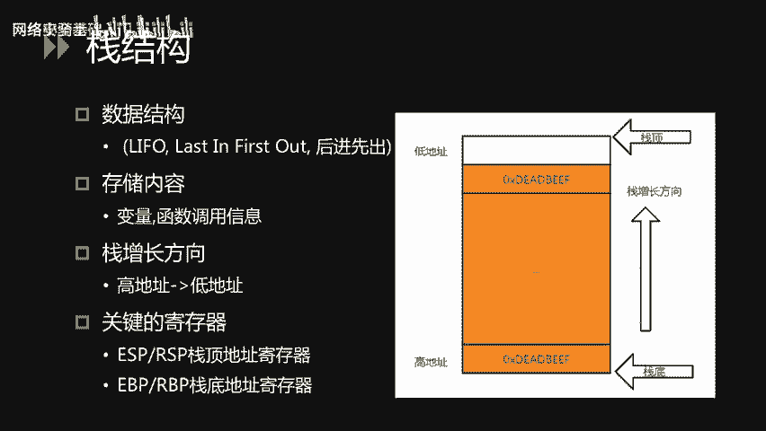
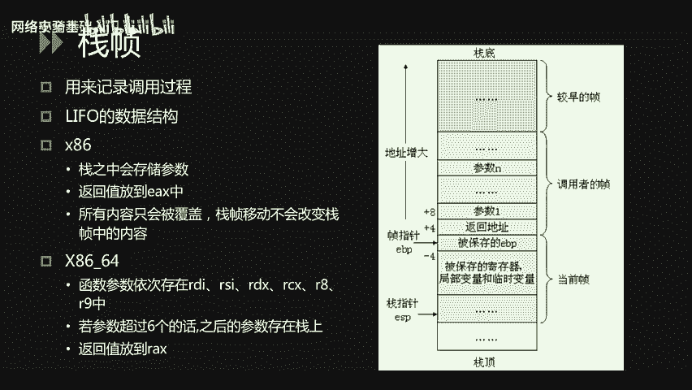
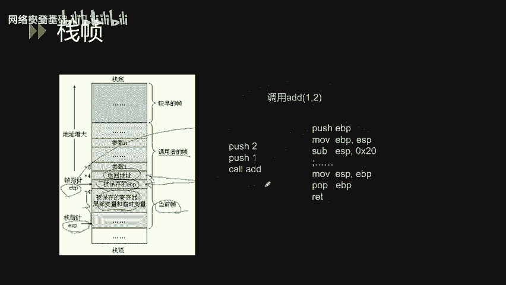

# CTF入门课程：P60：二进制_1 - 网络安全基础入门

在本节课中，我们将学习CTF逆向工程相关的两个核心知识：逆向工程（Reversing）与漏洞利用（Pwning）。逆向工程主要涉及对软件二进制文件的分析，以理解其算法和逻辑，从而获取关键信息或发现漏洞。

整个课程分为两部分，第一部分是逆向工程。逆向工程部分包含四个小节：汇编语言基础、逆向工程工具的使用、C语言逆向以及安全逆向。第二部分是漏洞利用，包含一个小节。

我们首先来介绍逆向工程。逆向工程涉及对Windows、Linux、安卓等多个平台的二进制文件进行分析，目标是理解其源代码或算法，并从中获取Flag。逆向工程的难点主要在于：汇编语言比高级语言复杂难懂；加密算法可能很复杂，包括Base64、XOR、AES对称加密、RSA非对称加密等；此外，反调试技术和代码混淆也会阻碍分析过程；最后，面对复杂内容时，耐心不足也可能影响分析效果。

上一节我们概述了逆向工程，本节中我们来看看汇编语言基础。

## 汇编语言基础

### 字节序：小端序

我们平常使用的电脑基本上都属于小端序架构。在小端序中，数据的高字节保存在内存的高地址中，低字节保存在内存的低地址中。

请看右侧图示。数据 `0xDEADBEEF` 在内存中的存储顺序是：低地址存储最低有效字节 `0xEF`，然后依次是 `0xBE`、`0xAD`，高地址存储最高有效字节 `0xDE`。这看起来像是字节顺序被倒过来了。

### 汇编格式：Intel与AT&T

汇编语言主要有两种格式：Intel格式和AT&T格式。这两种格式的主要区别在于：AT&T格式的操作数前带有`%`符号，并且指令通常带有后缀以指明操作数大小；而Intel格式则没有这些特征。

例如，对比以下两条指令：
*   Intel: `mov EBP, ESP`
*   AT&T: `mov %esp, %ebp`

这两条语句功能相同，都是将ESP寄存器的值赋给EBP寄存器。但在Intel格式中，目标操作数在前，源操作数在后；而在AT&T格式中，顺序恰好相反。

在Linux环境中通常使用AT&T格式。在使用GDB调试时，可以通过命令 `set disassembly-flavor intel` 切换到Intel格式以便查看。在Windows环境中，则更常接触到Intel格式。接下来的讲解我们将使用Intel格式。

### 常见寄存器

汇编语言中有很多寄存器，我们无需全部记住，以下是一些常见的寄存器（以32位x86系统为例）：
*   **EIP**: 指令指针寄存器，保存下一条要执行的指令地址。
*   **8个通用寄存器**:
    *   **EAX**: 累加器，常用于存储函数返回值或运算结果。
    *   **EDX**: 在EAX用于运算时，常作为扩展存储。
    *   **ECX**: 计数器，常用于循环计数。例如循环12次，就会将`0xC`（12的十六进制）存入ECX，每次循环递减。
    *   **ESP**: 栈指针寄存器，存放当前栈顶的位置。
    *   **EBP**: 基址指针寄存器，存放当前栈帧的底部位置。
    *   **EBX**: 基址寄存器，可作为内存寻址的基址。
    *   **ESI**: 源变址寄存器，常用于指向要读取的数据源。
    *   **EDI**: 目的变址寄存器，常用于指向要写入数据的目标地址。

### 标志寄存器

标志寄存器（EFLAGS）的各个位用于记录CPU运算的状态。我们常用的标志位包括：
*   **溢出标志 (OF)**
*   **零标志 (ZF)**: 运算结果为零时置位。
*   **进位标志 (CF)**

### 数据传输指令

数据传输指令用于在寄存器和内存之间移动数据。以下是常见指令：
*   **MOV**: 最常见的移动指令。例如 `MOV EAX, DWORD PTR [EBP+8]` 表示将 `EBP+8` 地址处的一个双字（4字节）数据移动到EAX寄存器。
    *   `BYTE PTR`, `WORD PTR`, `DWORD PTR`, `QWORD PTR` 分别代表1字节、2字节、4字节和8字节操作。32位系统中常见前三种，64位系统中`QWORD`也常见。
*   **PUSH**: 将值压入栈中。
*   **PUSHAD**: 将所有通用寄存器的值压入栈中。
*   **POP**: 将栈顶的值弹出到指定寄存器。
*   **POPAD**: 将栈中的一系列值弹出并恢复到通用寄存器中。
*   **TEST / CMP**: 比较指令。用于比较两个操作数，结果会影响标志寄存器（特别是零标志位ZF），常用于条件判断。
*   **LEA**: 加载有效地址指令。例如 `LEA EAX, [0xABCD]` 是将地址 `0xABCD` 本身（而非该地址处的数据）加载到EAX寄存器中。

### 程序跳转指令

程序跳转指令控制代码的执行流程，分为无条件转移和条件转移。
*   **无条件转移**:
    *   **JMP**: 无条件跳转。
    *   **CALL**: 调用函数。它会将下一条指令的地址（返回地址）压栈，然后跳转到目标函数。
    *   **RET / RETN**: 从函数返回。相当于 `POP EIP`，将栈顶的返回地址弹出到EIP寄存器中。通常在`RET`指令前会有 `LEAVE` 指令，它等价于 `MOV ESP, EBP` 和 `POP EBP` 两条指令，用于恢复调用者的栈帧。
*   **条件转移**:
    *   例如 `JG` (大于跳转)、`JNL` (不小于跳转)、`JE` (等于跳转)等。这些指令根据标志寄存器的状态决定是否跳转。可以通过助记符理解：`G`=Greater, `L`=Less, `E`=Equal, `N`=Not。

### 算术与逻辑运算指令

汇编指令也包含算术和逻辑运算。
*   **算术运算指令**: 包括加(`ADD`)、减(`SUB`)、乘(`MUL`)、除(`DIV`)等。
    *   **INC / DEC**: 递增(`INC`)和递减(`DEC`)指令，相当于加1和减1。
*   **逻辑运算指令**: 包括与(`AND`)、或(`OR`)、异或(`XOR`)、非(`NOT`)，以及逻辑左移(`SHL`)、逻辑右移(`SHR`)等。这些运算在加解密算法中很常见。

了解了基本指令后，我们来看看高级语言中的逻辑结构在汇编中是如何表现的。

### 程序逻辑的汇编表现形式

#### IF 条件判断
考虑以下C代码：如果 `c > 0 && c < 10`，则打印字符串。
对应的汇编代码会先将 `c` 与 `0` 比较，如果小于等于0则跳转到条件不成立的代码块（地址 `0x411A81`）。接着再将 `c` 与 `10` 比较，如果大于等于10，同样跳转到 `0x411A81`。只有两个条件都不满足（即 `c` 在0到10之间），才会继续执行打印字符串的指令（`PUSH` 字符串地址，然后 `CALL` 打印函数）。最后，`ADD ESP, 4` 用于平衡栈指针，清理刚才压入的参数。

#### FOR 循环
考虑循环50次的C代码。汇编中，首先将计数器 `I` 赋值为0，然后跳转到循环体开始处。循环体内执行加法操作。循环体执行完毕后，回到上方进行 `I++` 操作，然后判断 `I` 是否小于50。如果小于，则跳回循环体继续执行；否则，跳转到循环结束后的地址继续执行。

#### DO-WHILE 循环
在do-while循环中，汇编代码会先执行一次循环体内的操作，然后判断条件是否满足（例如 `C < 100`）。如果满足，则跳转回循环体开头继续执行；否则，顺序执行后续代码。

#### WHILE 循环
while循环则先进行条件判断（例如 `C < 100`）。如果条件不满足（`C >= 100`），则通过 `JGE` 指令跳出循环。如果条件满足，则执行循环体，执行完毕后通过 `JMP` 指令跳转回条件判断处，开始下一次循环。

理解了程序逻辑，我们还需要掌握一个关键的内存结构：栈。

### 栈结构

栈是内存中的一种数据结构，遵循后进先出（LIFO）原则，用于存储局部变量、函数调用信息等。栈的生长方向是从高地址向低地址扩展。关键的栈相关寄存器有：
*   **ESP (RSP in 64-bit)**: 栈指针寄存器，始终指向栈顶。
*   **EBP (RBP in 64-bit)**: 基址指针寄存器，通常指向当前栈帧的底部。

与栈相关的两个基本操作是`POP`和`PUSH`：
*   **POP EAX**: 等效于两条指令：
    1.  `MOV EAX, DWORD PTR [ESP]` ; 将栈顶值存入EAX
    2.  `ADD ESP, 4` ; 栈顶指针下移4字节（释放空间）
*   **PUSH EAX**: 也等效于两条指令：
    1.  `SUB ESP, 4` ; 栈顶指针上移4字节（开辟空间）
    2.  `MOV DWORD PTR [ESP], EAX` ; 将EAX值存入新的栈顶位置

栈在函数调用中扮演着核心角色，这引出了“栈帧”的概念。

### 栈帧与函数调用

栈帧用于记录一次函数调用的上下文信息，同样遵循后进先出原则。
*   在 **x86 (32位)** 系统中，函数参数通过栈传递，返回值通常存放在EAX寄存器中。
*   在 **x86-64 (64位)** 系统中，前6个参数依次通过寄存器 `RDI`, `RSI`, `RDX`, `RCX`, `R8`, `R9` 传递，超过6个的参数才通过栈传递。返回值存放在RAX寄存器中。

栈帧中通常保存以下信息（从高地址到低地址）：
1.  调用者栈帧的EBP（保存的EBP）
2.  返回地址（调用`CALL`指令时压入）
3.  函数参数（从右向左压栈）
4.  当前函数的局部变量和临时数据

让我们通过一个函数调用 `add(1, 2)` 的例子来说明栈帧的变化：
1.  **参数入栈**：先将参数从右向左压栈，即 `PUSH 2`, `PUSH 1`。此时`2`在较低地址（离原栈顶近），`1`在较高地址。
2.  **调用函数**：执行 `CALL add`。`CALL`指令将下一条指令的地址（返回地址）压入栈中。
3.  **进入函数**：函数开头通常有标准序言：
    *   `PUSH EBP`：保存调用者的EBP。
    *   `MOV EBP, ESP`：设置当前函数的栈帧基址（EBP指向保存的EBP）。
    *   `SUB ESP, 0x20`：在栈上为局部变量开辟空间（ESP上移）。
4.  **函数执行**：在此空间内操作局部变量等。
5.  **退出函数**：函数结尾有标准尾声：
    *   `MOV ESP, EBP`：恢复栈顶到当前栈帧底部（释放局部变量空间）。
    *   `POP EBP`：恢复调用者的EBP。
    *   `RET`：从栈顶弹出返回地址到EIP，从而跳回调用者代码继续执行。

本节课中我们一起学习了CTF逆向工程的基础，包括逆向工程的概念与难点、汇编语言的基础知识（如字节序、格式、寄存器、常用指令）、高级语言逻辑在汇编中的体现，以及至关重要的栈结构与函数调用机制。理解这些内容是进行二进制漏洞分析和利用的基石。