# CTF入门课程：P61：二进制2 - 网络安全基础入门 🛡️💻


在本节课中，我们将学习CTF逆向工程和二进制漏洞利用的基础知识。课程将分为两个主要部分：第一部分介绍逆向工程的基本工具和流程，第二部分讲解栈溢出漏洞的原理与利用方法。

## 逆向工程基础 🔍

上一节我们介绍了二进制的基础概念，本节中我们来看看逆向工程中常用的工具。

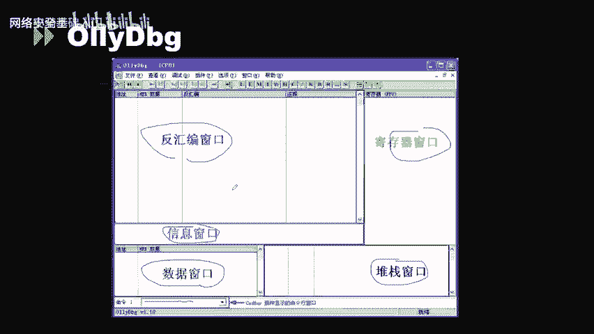

### 常用工具介绍

以下是逆向工程中两个核心工具的功能说明。

*   **PEiD**：用于检测程序是用何种语言或编译器编写的，例如VC++、Delphi等。它也会显示程序是否加壳，以及入口点（Entry Point）信息。
*   **IDA Pro**：一款功能强大的反汇编和静态分析工具。
    *   **工具栏**：提供各种分析功能。
    *   **导航栏**：可以快速跳转到文件的任意地址。
    *   **函数窗口**：列出程序中的所有函数。
    *   **IDA View**：默认显示反汇编代码的流程图视图，按空格键可切换为文本视图。
    *   **伪代码窗口（F5）**：将汇编代码转换为更易读的类C语言伪代码，极大方便了逻辑分析。
    *   **输出窗口**：显示分析过程中的各种信息。
    *   **脚本窗口**：支持使用Python或IDC语言编写脚本，辅助自动化分析。
*   **OllyDbg (OD)**：一款动态调试工具，专门用于调试Windows平台下的程序。
    *   **反汇编窗口**：显示程序的汇编指令。
    *   **信息窗口**：显示与当前指令相关的信息。
    *   **寄存器窗口**：显示CPU寄存器的当前值。
    *   **栈窗口**：显示当前栈内存的内容。
    *   **内存窗口**：查看或修改进程的内存数据。
    *   **命令窗口**：可以通过输入命令来执行调试操作，对于高效调试非常有用。

### 逆向工程基本流程

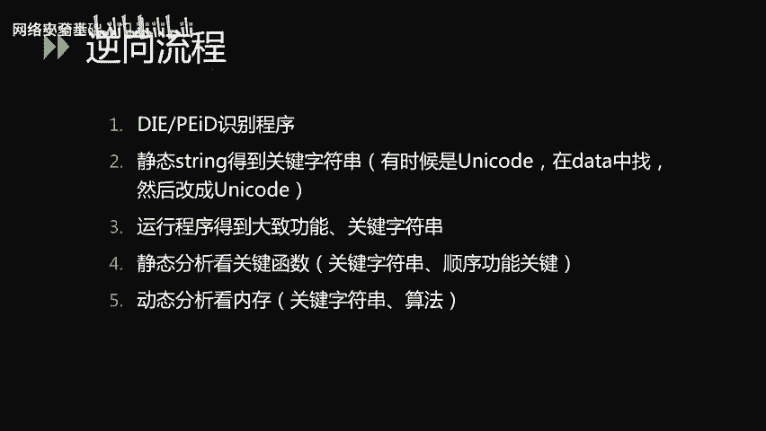

了解工具后，我们来看看一个典型的逆向分析流程是怎样的。

以下是逆向分析通常遵循的步骤：

1.  **识别程序**：判断目标程序是使用C、C++、.NET还是VB等语言编写，不同的程序类型对应不同的分析方法和工具。
2.  **静态分析获取关键字符串**：程序运行时通常会输出提示信息，如“input your key”、“success”、“fail”等。这些字符串是定位关键代码的重要线索。
3.  **定位关键函数**：通过关键字符串，在反汇编代码中定位到进行核心判断或处理的函数。
4.  **分析程序逻辑**：按照程序的执行顺序，逐步分析关键函数的算法和逻辑。
5.  **动态调试**：如果静态分析无法理清复杂逻辑，则使用调试器（如OD或IDA的动态调试功能）运行程序，观察内存和寄存器的实时变化。
6.  **验证算法**：结合静态分析和动态调试的结果，推测出程序验证flag的完整算法。
7.  **编写求解程序**：根据逆向得到的算法，编写脚本或程序计算出正确的flag。

### 逆向实例分析

现在，我们通过一个具体的例子来实践上述流程。

首先运行示例程序`sample1`，它会提示“give me the flag”，输入错误内容会返回错误信息。我们将程序载入IDA进行分析。

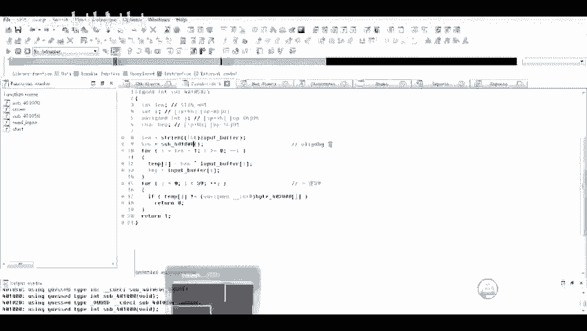

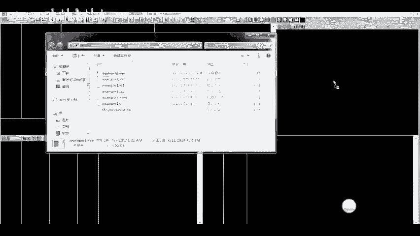

在IDA中，我们能看到打印“good job”和错误信息的代码块，中间有一个条件判断（`test eax, eax`）。判断上方的函数很可能就是关键函数。按F5查看该函数的伪代码。

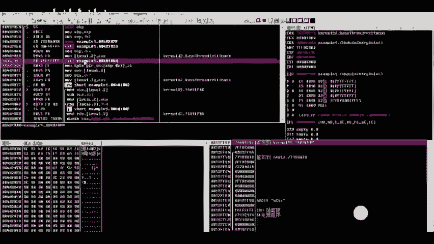

伪代码显示，程序首先读取用户输入，然后调用一个函数获取输入长度，接着进行核心运算：将输入缓冲区（`buffer`）的每个字节与一个密钥（`key`）进行异或（`^`）操作，结果存入临时数组（`temp`）。最后，将`temp`与一个预设的数组（`encoded`）进行比较。

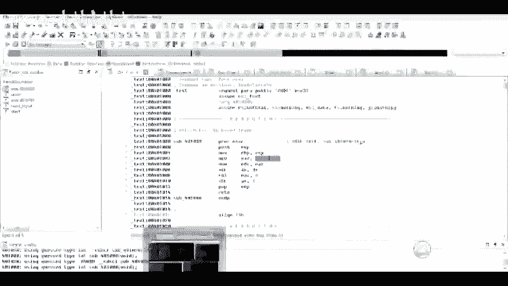

**核心运算逻辑**可以用以下伪代码表示：
```c
for (i = 0; i < length; i++) {
    temp[i] = buffer[i] ^ key;
    key = temp[i]; // 密钥动态更新
}
if (memcmp(temp, encoded, length) == 0) {
    // 验证成功
}
```

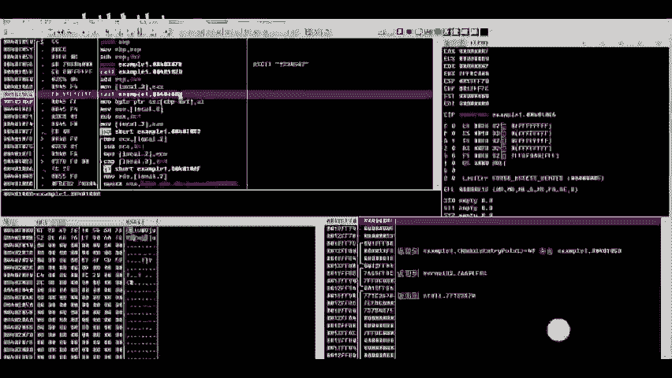

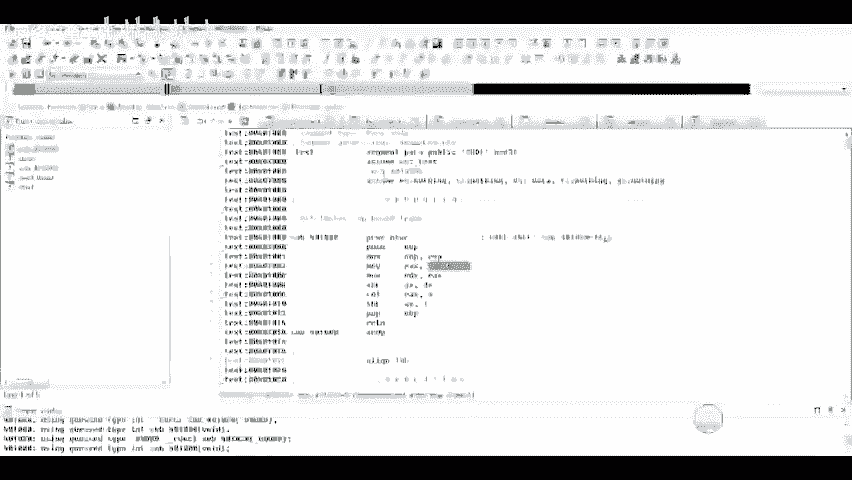

我们需要找到`key`的初始值。通过动态调试（OD），我们在调用`0x401000`函数的地址下断点，单步执行后发现返回值（存储在`AL`寄存器中）为`0x4`。因此，`key = 4`。

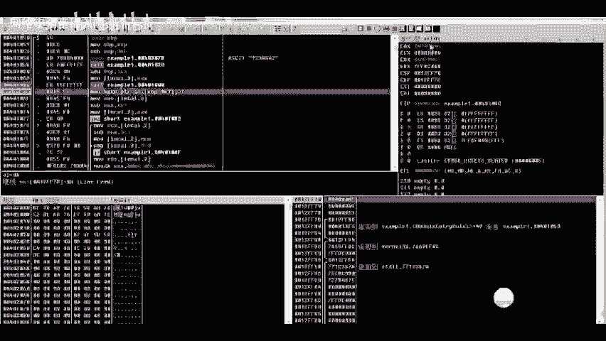

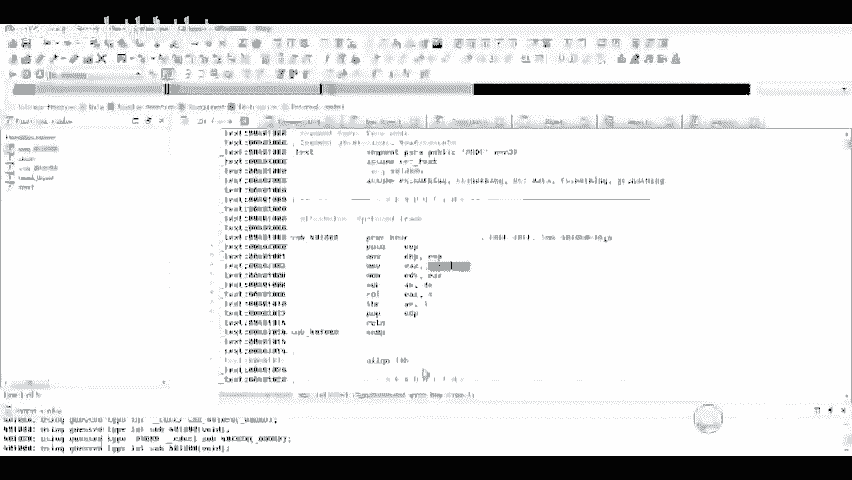

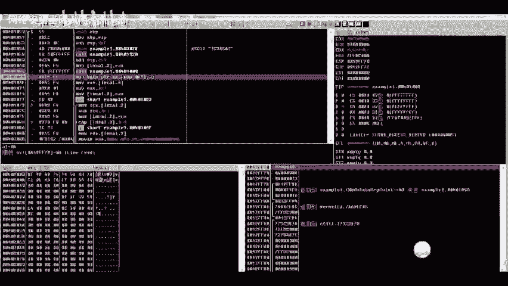

已知`encoded`数组和`key`的初始值，我们可以编写Python脚本逆向求解flag。算法是上述加密过程的逆过程。

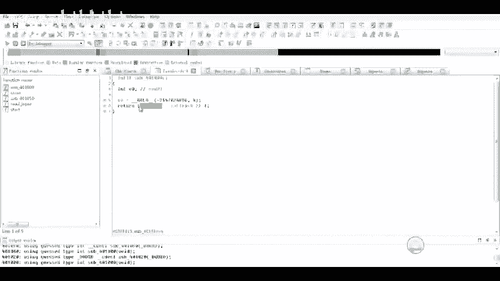

**求解脚本核心逻辑**：
```python
encoded = [0xXX, 0xYY, ...] # 从IDA中获取的数组
key = 4
decoded = []
for c in reversed(encoded): # 注意可能需要逆序
    decoded.append(c ^ key)
    key = c ^ key # 逆向更新密钥
flag = ''.join(chr(b) for b in reversed(decoded)) # 再次逆序得到原始输入
print(flag)
```
运行脚本即可得到正确的flag，输入程序验证通过。

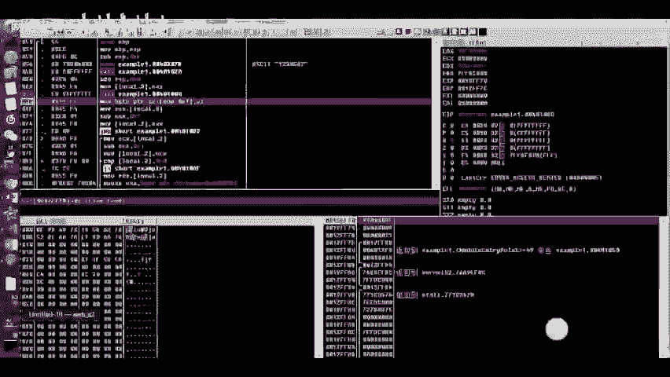

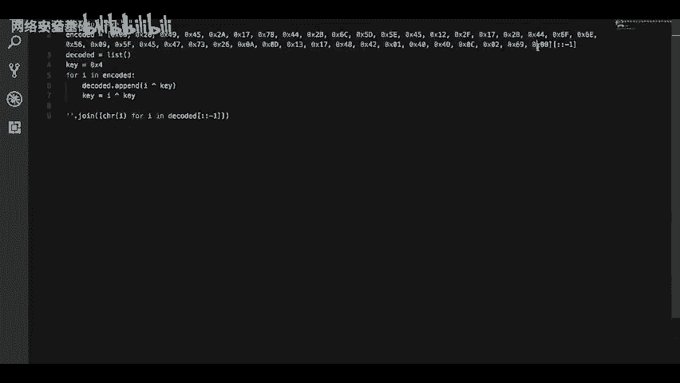

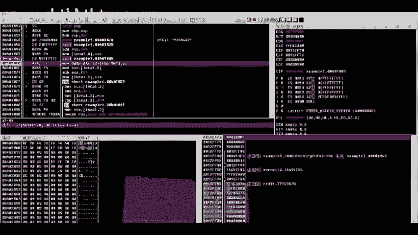

本节课中我们一起学习了逆向工程的基本工具、分析流程，并通过一个实例掌握了静态分析与动态调试结合破解简单加密算法的方法。

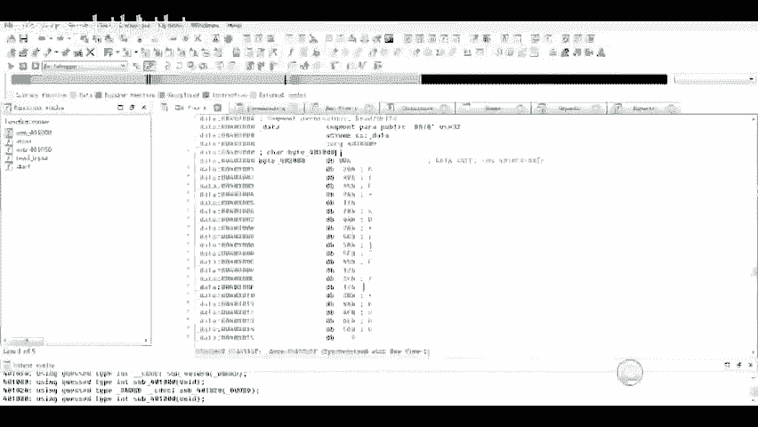

---

## 栈溢出漏洞利用 🚨

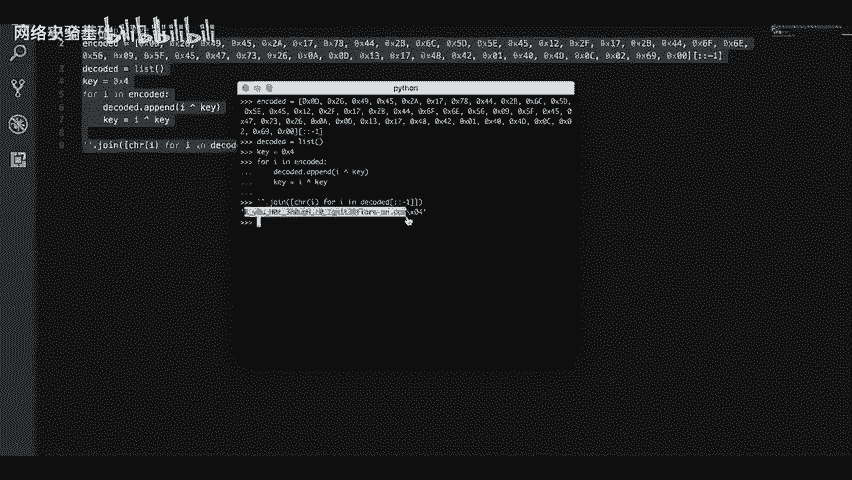

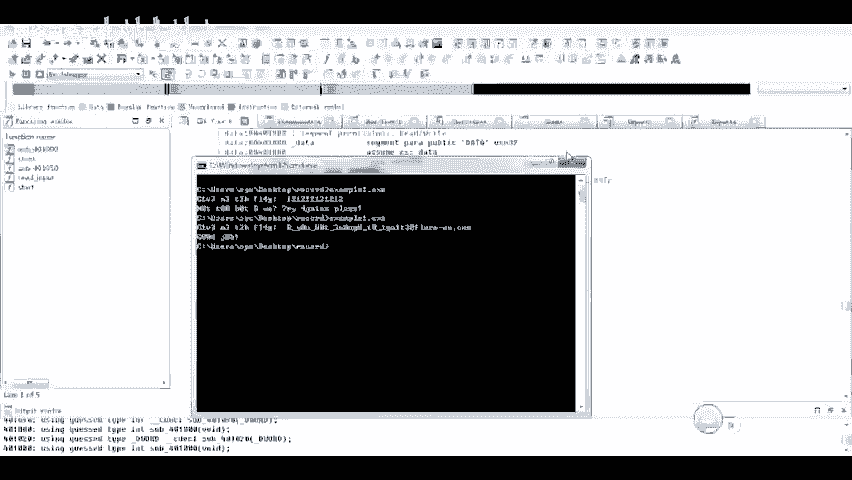

上一节我们完成了逆向分析的学习，本节中我们来看看二进制中常见的漏洞类型——栈溢出。

### 栈溢出原理

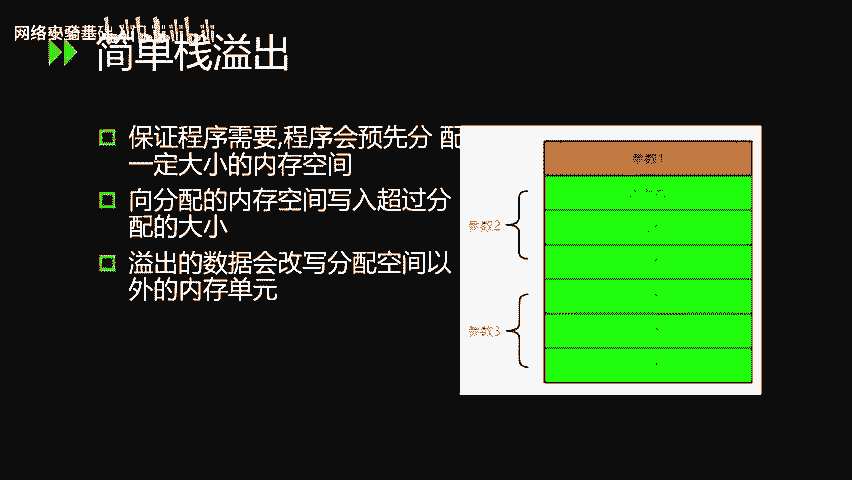

程序运行时，函数调用会在栈上分配内存空间用于存储局部变量、返回地址等信息。如果向局部变量（尤其是数组）写入的数据超过了其分配的空间大小，多余的数据就会覆盖栈上的其他内容，造成栈缓冲区溢出。

**漏洞示例**：
```c
void vulnerable() {
    char buffer[128];
    gets(buffer); // 危险函数，输入超过128字节会导致溢出
}
```
当输入超过128字节时，多出的数据会覆盖栈上的帧指针（`EBP`）和函数返回地址（`Return Address`）。攻击者可以精心构造输入数据，用特定的地址覆盖返回地址，从而控制程序执行流，跳转到恶意代码（Shellcode）或程序本身的特定函数。

### Linux平台保护机制

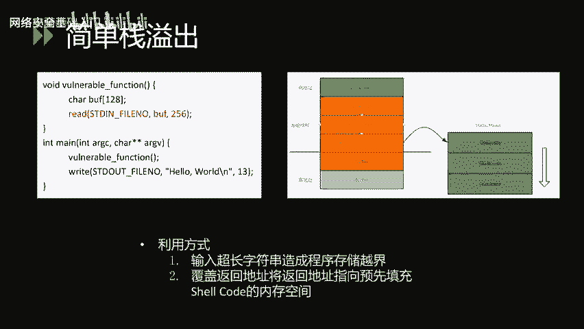

现代Linux系统通常对程序启用了安全保护机制，增加了利用难度。

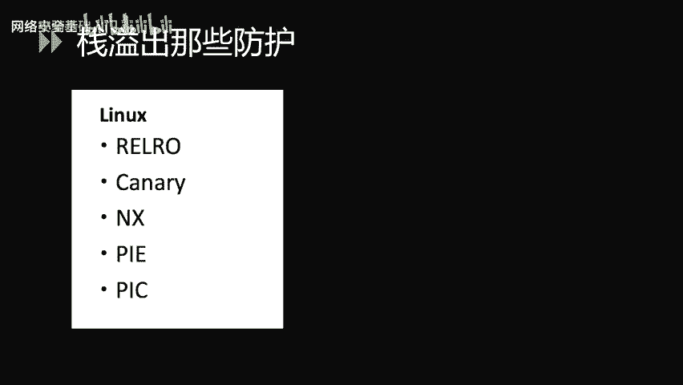

*   **NX/DEP**：数据执行保护。将内存页标记为**可写**或**可执行**，二者不可兼得。这防止了攻击者将Shellcode写入栈（可写）后直接执行（不可执行）。
*   **PIE/ASLR**：地址空间布局随机化。程序每次运行时，其基地址和库函数地址都会随机变化，使攻击者难以准确预测跳转地址。

### 绕过技术：Return-Oriented Programming (ROP)

为了绕过NX和PIE，攻击者发展出了ROP技术。其核心思想是：**利用程序中已有的代码片段（gadgets）来拼凑出所需的操作逻辑**，而不是注入新的可执行代码。这些gadgets通常以`ret`指令结尾。

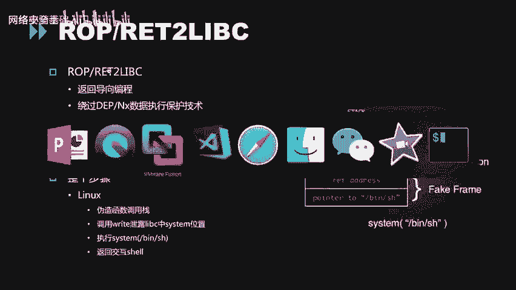

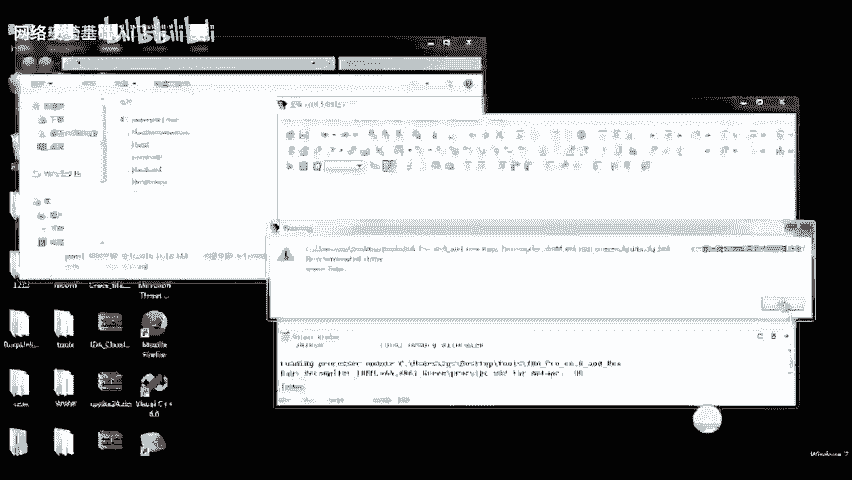

一个经典的利用目标是调用`system(“/bin/sh”)`来获取shell。即使程序本身没有这样的调用，我们也可以组合gadgets来伪造函数调用栈。

**伪造调用栈示例**（32位系统）：
```
[填充字符 * offset] + [system函数地址] + [返回地址（可随意）] + [“/bin/sh”字符串地址]
```
当 vulnerable 函数返回时，会跳转到`system`函数，并将栈顶的下一个值（我们填充的“返回地址”）作为`system`的返回地址，再下一个值作为其第一个参数。这样，`system`就会执行`/bin/sh`。

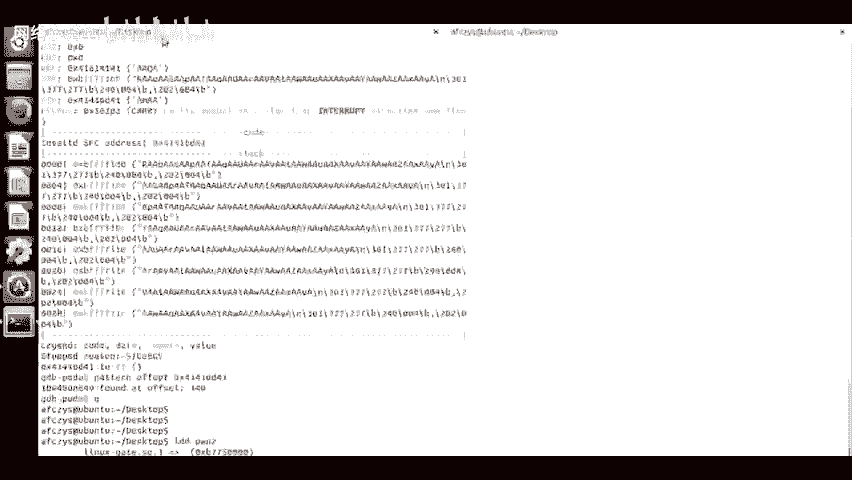

### 栈溢出实例分析

现在，我们分析一个简单的栈溢出漏洞程序`pwn1`。

用IDA打开`pwn1`，查看`main`函数中的`vulnerable`函数。发现它使用不安全的`gets`函数读取输入到一个大小为`0x1c`（28）字节的缓冲区中，而`gets`允许输入任意长度，存在明显的栈溢出。

此外，程序还提供了一个`shell`函数，其内部直接调用了`system(“/bin/sh”)`。这极大地简化了利用过程，我们的目标就是将返回地址覆盖为`shell`函数的地址。

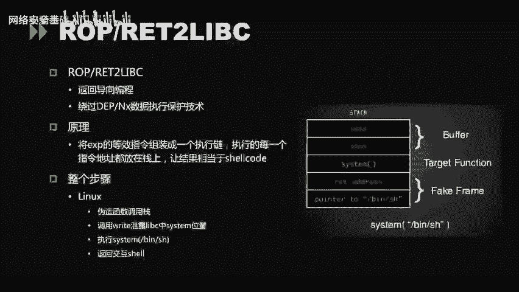

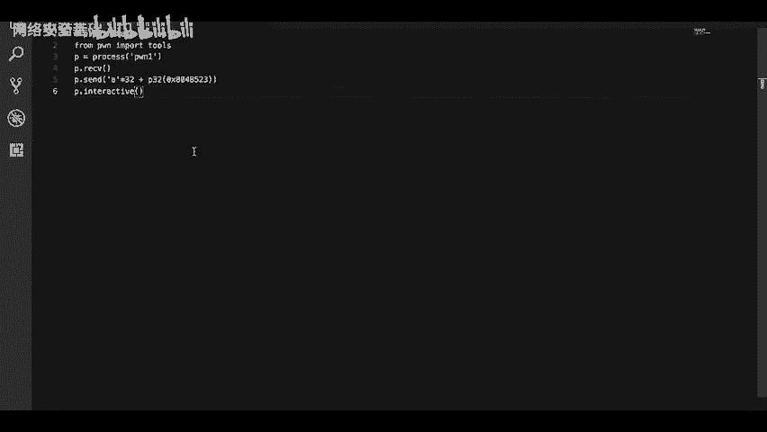

首先，我们需要确定覆盖返回地址前需要填充多少字节。可以使用`pattern_create`生成测试字符串，在调试器（如GDB）中运行程序并触发崩溃，观察覆盖指令指针（`EIP`）的值，进而计算出偏移量（offset）。本例中，偏移量为32字节。

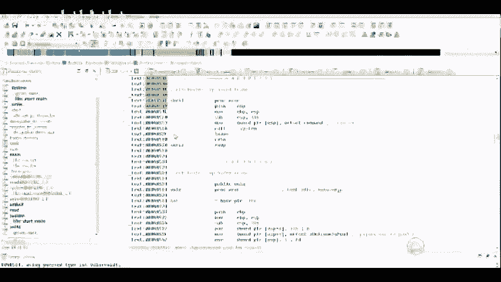

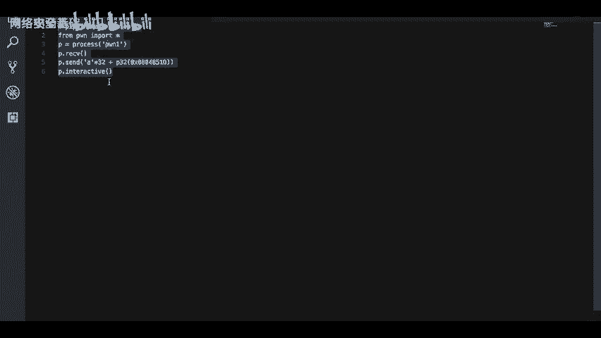

因此，我们的攻击载荷构造如下：
```
payload = b'A' * 32 + p32(shell_function_address)
```
使用Python的`pwntools`库可以方便地编写利用脚本，连接本地或远程程序，发送payload，从而获得一个shell。

**利用脚本示例**：
```python
from pwn import *
context(arch='i386', os='linux')
p = process('./pwn1') # 本地程序，远程使用 remote('host', port)
shell_addr = 0x0804851D # 从IDA中获取的shell函数地址
payload = b'A'*32 + p32(shell_addr)
p.sendline(payload)
p.interactive() # 进入交互模式，执行命令
```
运行脚本后，成功获得shell，可以执行`cat flag`等命令读取flag。

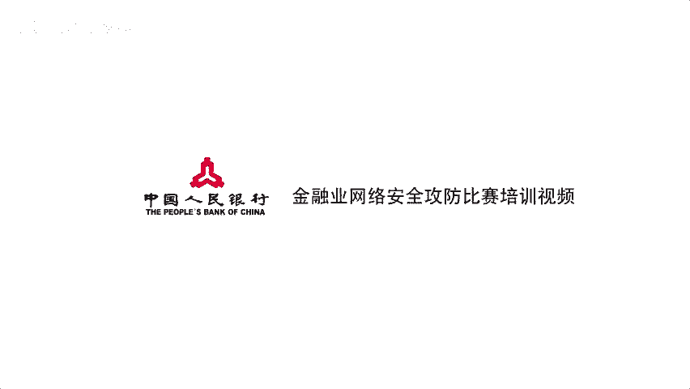

本节课中我们一起学习了栈溢出漏洞的基本原理、系统保护机制（NX、PIE）以及基础的绕过技术（ROP思想）。并通过一个简单实例，掌握了利用现有函数获取shell的完整流程。