# CTF入门课程：P62：移动安全_1 - 安卓逆向基础

在本节课中，我们将学习CTF比赛中安卓逆向的基础知识。课程将涵盖安卓开发的基本概念、逆向分析所需的工具、CTF常见考点，并通过两道实战题目演示静态分析的基本流程。

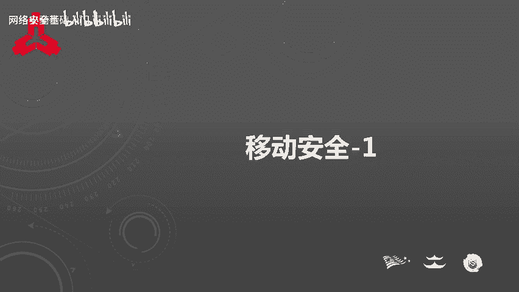

## 概述

安卓逆向在实际生产生活中应用广泛，例如VIP功能破解、协议分析和广告去除等功能都基于此技术。因此，CTF比赛也将安卓逆向作为逆向工程的一个重要方向。

下面将从三个方面展开介绍：安卓开发基础、逆向工具与CTF考点、以及安卓逆向实战分析。

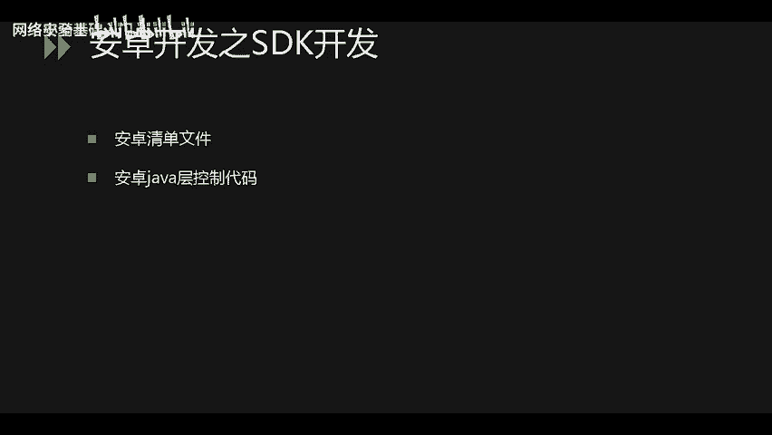

## 安卓开发基础

在开始逆向分析之前，了解安卓开发的基本结构至关重要。反编译APK文件后会生成多种文件，包括资源文件、清单文件和代码文件。为了定位分析重点，需要知道这些文件的来源和作用。本节主要介绍SDK（Java）开发和NDK（C/C++）开发。

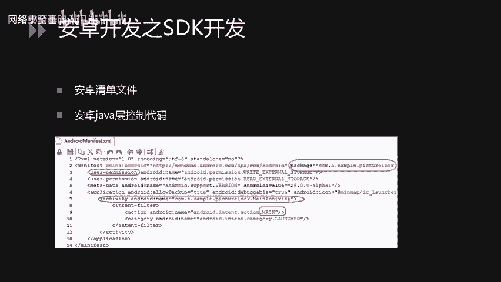

### SDK开发（Java开发）

SDK开发中，最重要的两个文件是 **AndroidManifest.xml**（清单文件）和 **.dex**（Java代码编译后的可执行文件）。

**AndroidManifest.xml** 是安卓应用的核心配置文件，它定义了应用的基本信息。
以下是其包含的关键内容：
*   **包名信息**：应用的唯一标识。
*   **权限声明**：应用安装时向用户申请的权限。
*   **代码入口**：指定应用启动时首先运行的Activity。

在开发阶段，此文件以可读的XML格式存放在项目根目录。编译后，它会被打包进APK，逆向时需要解析其二进制格式以恢复原貌。

**Java代码** 在编译后会生成 **.dex** 可执行文件。逆向时，工具会解析.dex文件并生成 **smali** 文件夹，其中存放的是逆向出来的中间代码。可以使用特定工具将smali代码转换为更易读的Java伪代码进行查看。

### APK文件结构

APK文件本质上是一种压缩包格式。使用解压软件打开后，可以看到以下主要目录和文件：
*   **assets/**：存放数据文件，不参与编译，通常用于存放数据库或其它重要资源。
*   **lib/**：存放NDK开发中使用C/C++编写的原生代码编译生成的 **.so** 动态库文件。
*   **META-INF/**：存放APK的签名文件，包含应用的签名信息。
*   **res/** 和 **resources.arsc**：都是资源文件，包含字符串、图片、布局等控件声明信息，需要解析后才能读取。
*   **AndroidManifest.xml**：即上文提到的清单文件。
*   **classes.dex**：Java代码编译后生成的可执行文件，需要逆向解析。

### NDK开发（C/C++开发）

NDK开发主要用于保护核心代码逻辑。因为SDK的Java代码逆向相对容易，而C/C++代码逆向后得到的是汇编代码，理解难度更大，从而增加了逆向的门槛。

NDK开发使用C或C++进行编程，并在Java层进行声明和调用。典型的调用过程如下：
1.  在Java代码中使用 `System.loadLibrary(“库名”)` 加载.so文件。
2.  声明带有 `native` 关键字的本地方法。
3.  在Java层调用该本地方法。

加载库时，参数“库名”不包含前缀“lib”和后缀“.so”，但.so文件实际存放在 `lib/` 目录下，且文件名是完整的（如 `libxxx.so`）。

上一节我们介绍了安卓开发的基础知识，本节中我们来看看进行安卓逆向需要哪些工具，以及CTF比赛中常见的考点。

## 逆向工具与CTF考点

### 常用逆向工具

以下是安卓逆向中几种重要的工具：

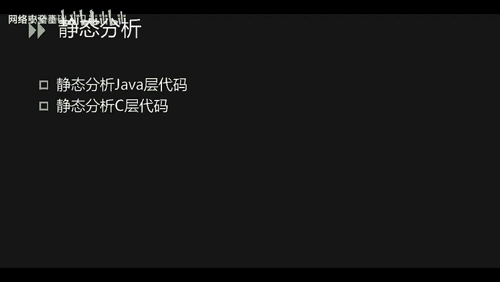

**反编译工具**
*   **Android Killer**：功能强大的集成化逆向工具。
*   **APKIDE**：另一款集成了反编译、编辑、重打包等功能的工具。
*   **JADX**：专注于将.dex文件反编译为Java源代码的工具，查看代码非常方便，但不提供重打包功能。

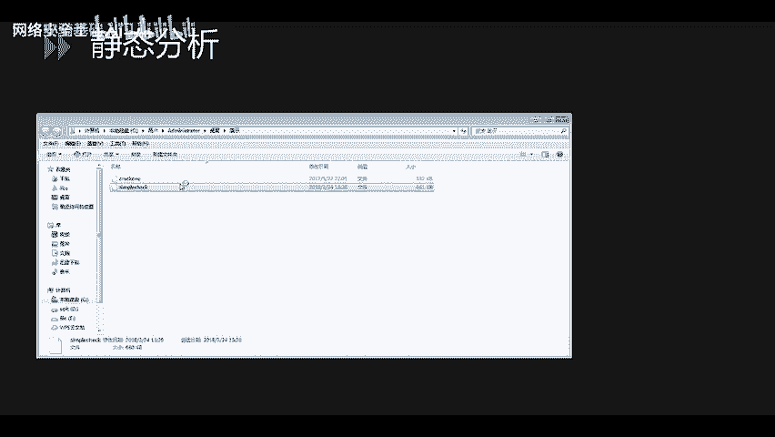

**逆向分析工具**
*   **IDA Pro**：逆向分析的标杆工具，尤其适用于分析NDK开发产生的.so文件。
*   **十六进制编辑器**（如010 Editor, WinHex, HxD）：用于查看文件头，快速判断文件类型（如APK、ELF等），确定逆向方向。

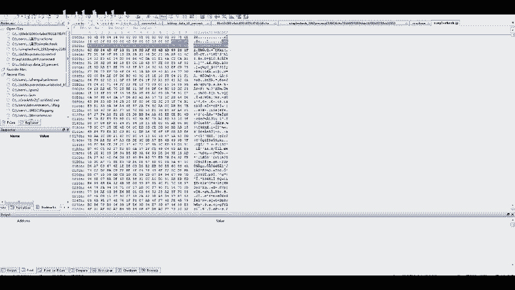

**动态调试环境**
*   **具备Root权限的安卓手机或模拟器**：用于对应用进行动态调试，观察运行时的内存数据和函数调用。

### CTF安卓逆向常见考点

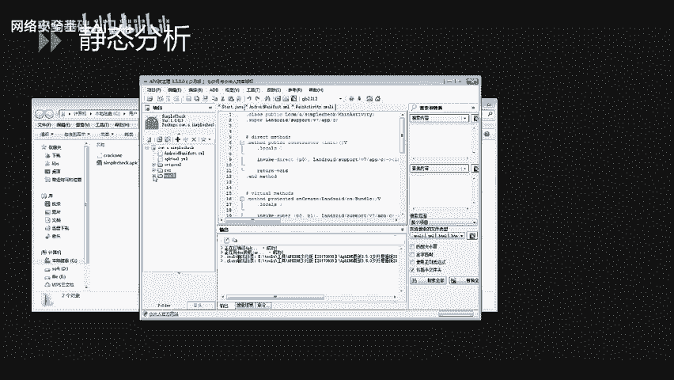

CTF比赛的安卓逆向题目难度通常由易到难，主要考点包括：

**初级**
*   考察对资源文件或备份文件的查找，Flag可能直接存放在这些文件中。

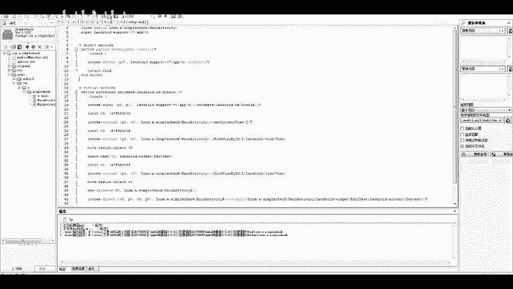

**中级**
*   **Java层代码逆向**：需要分析Java代码逻辑，编写解题程序获取Flag。
*   **C层代码逆向**：需要阅读汇编或反编译的C代码，分析算法并写出逆算法获取Flag。

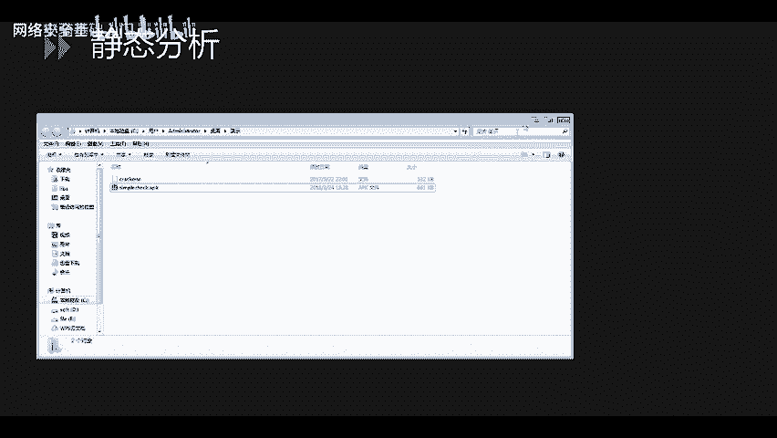

**高级**
*   **动态调试**：某些关键值（如密钥）只在运行时存在于内存中，必须通过动态调试才能获取。
*   **加壳与脱壳**：应用使用了商业壳进行保护，逆向的第一步是需要先完成脱壳，才能看到原始代码。
*   **虚拟机混淆技术**：即使脱壳后，核心代码仍经过虚拟机保护技术混淆，极大地增加了分析和理解的难度。

掌握了工具和考点后，接下来我们进入实战环节，通过静态分析解决两道CTF题目。

## 安卓逆向实战：静态分析

本节将演示两道题目的静态分析过程。第一道题仅需分析Java层代码；第二道题则需要结合分析Java层和C层（Native层）代码。

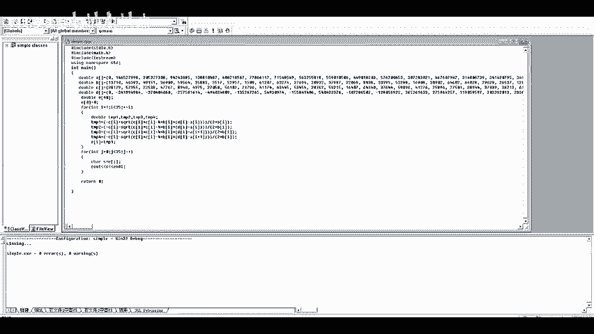

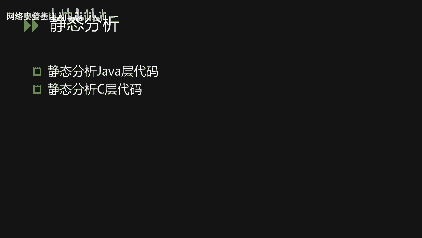

### 题目一：纯Java层逆向

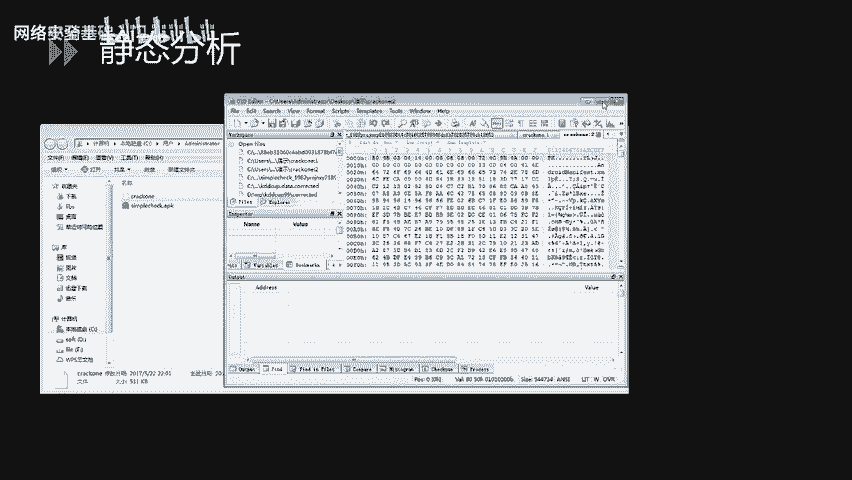

首先，使用十六进制编辑器查看题目文件。文件开头为“PK”，并且包含“AndroidManifest”字符串，可以确定这是一个APK文件。

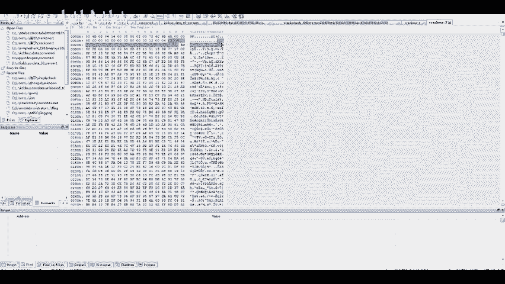

将文件后缀改为 `.apk`，然后使用APKIDE工具打开。工具会反编译APK，生成 `smali` 文件夹和清单文件等。

分析程序结构：包名为 `com.a.simplecheck`，入口为 `MainActivity`。在 `smali` 文件夹下找到对应的包和类。

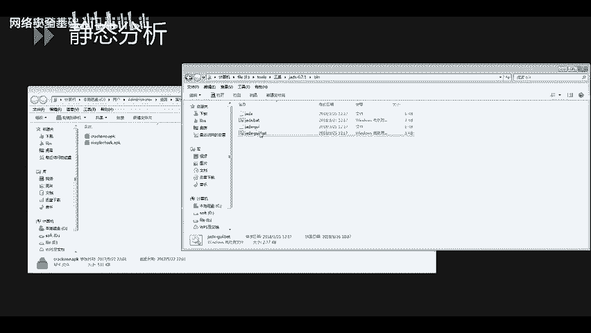

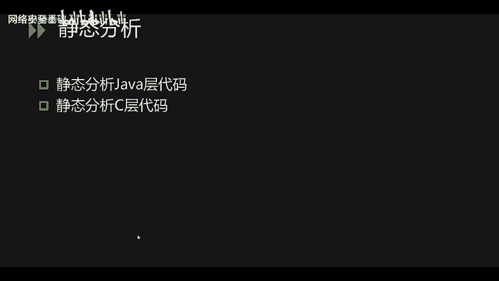

如果想查看Java源码，可以使用工具内的反编译功能查看。在 `MainActivity` 的 `onCreate` 方法中，发现一个关键的if判断：如果某个条件成立，则显示Flag，否则提示失败。核心逻辑在一个名为 `a()` 的函数中。

点进 `a()` 函数分析，发现其返回值决定了判断结果。经过分析，该函数实现了解一个一元二次方程的逻辑。解题步骤如下：
1.  从代码中提取出方程系数（一个double类型数组）。
2.  编写C++或Python程序求解该方程。
3.  运行程序，输出结果即为Flag。

**解题核心代码（概念）**
```cpp
// 假设从逆向代码中得到系数 a, b, c
double a = ...;
double b = ...;
double c = ...;
// 解一元二次方程并输出
```
运行解密程序后，即可得到格式为 `flag{...}` 的字符串。

### 题目二：Java与Native层结合逆向

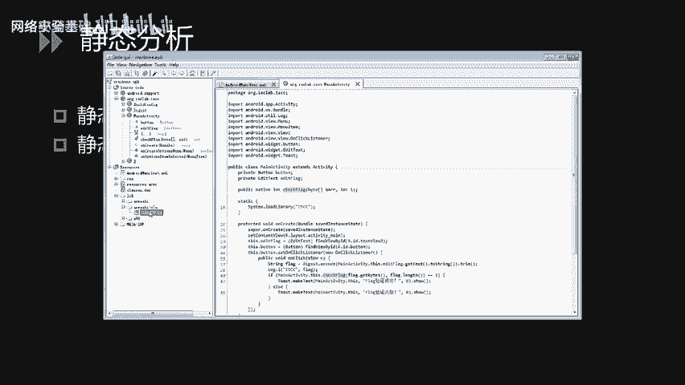

同样，先用十六进制编辑器确认文件为APK格式。

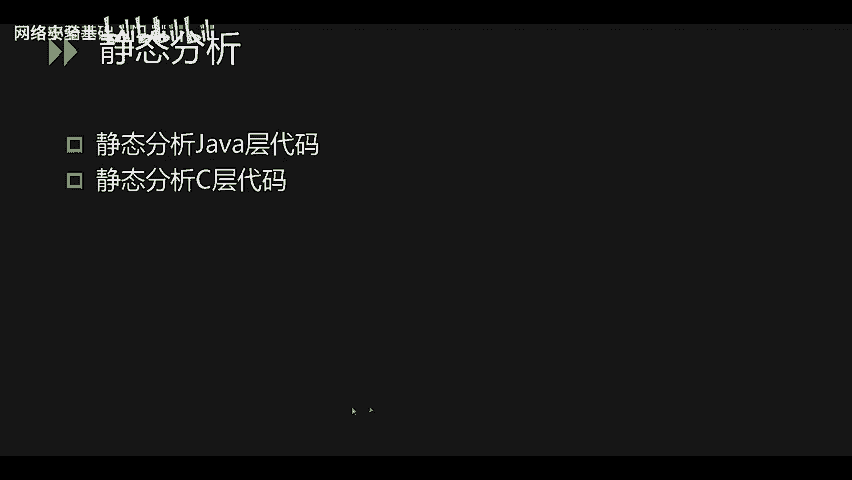

这次使用JADX工具打开APK文件。找到入口 `MainActivity`，其 `onCreate` 方法是分析的起点。

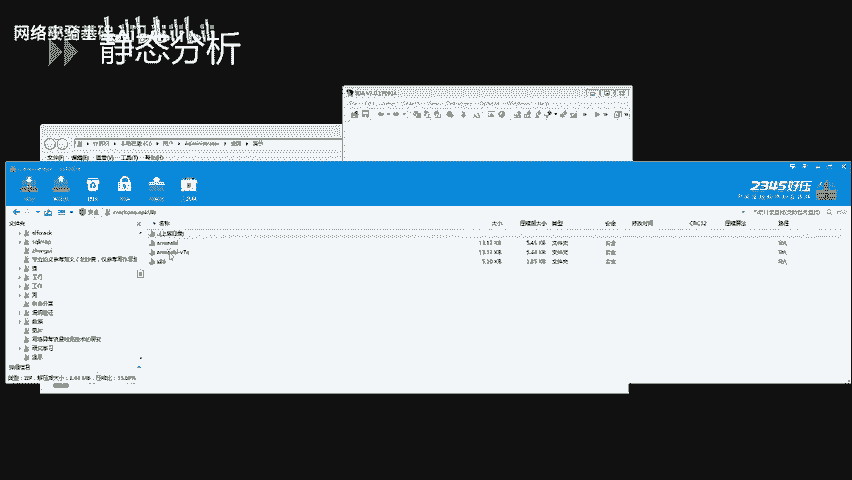

分析Java代码发现：
1.  程序使用 `System.loadLibrary(“iscc”)` 加载了一个名为 `libiscc.so` 的Native库。
2.  用户输入先经过Base64编码。
3.  编码后的字符串被传入一个 `native` 方法 `checkFlag` 进行校验。

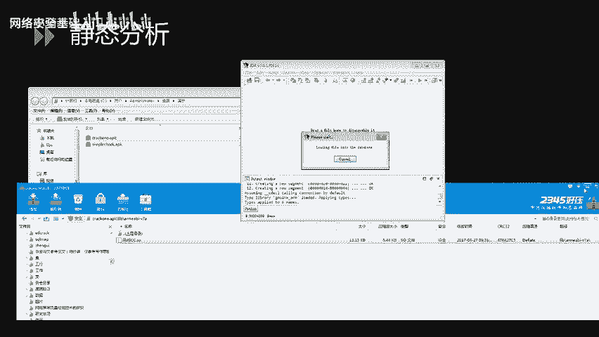

因此，关键逻辑在Native层的 `checkFlag` 函数中。接下来需要分析 `.so` 文件。

从APK的 `lib/` 目录下提取出 `libiscc.so` 文件，用IDA Pro打开。在函数列表中寻找 `Java_com_xxx_MainActivity_checkFlag` 类似的函数名（即JNI函数），或直接搜索 `checkFlag`。

找到目标函数后，按 `F5` 键使用IDA的插件将汇编代码反编译为伪C代码。分析伪C代码，核心逻辑是一个循环操作：
1.  对输入的Base64字符串进行前后字符位置调换（例如，第1位和最后1位交换）。
2.  将每个字符的ASCII码值减5。
3.  将处理后的结果与一个硬编码的字符串进行比较。

分析出算法后，编写逆向程序：
1.  获取硬编码的对比字符串。
2.  将其每个字符的ASCII码值 **加5**（逆向减操作）。
3.  将字符串 **再次进行前后调换**（逆向交换操作，因为两次相同的交换操作会恢复原状）。
4.  对结果进行Base64解码，即可得到原始Flag。

**解题核心代码（概念）**
```python
encoded_str = "从IDA中复制的硬编码字符串"
# 步骤1: 每个字符ASCII值加5
decoded_list = [chr(ord(c) + 5) for c in encoded_str]
# 步骤2: 前后字符交换（逆转交换操作）
# ... 执行交换逻辑 ...
# 步骤3: Base64解码
import base64
flag = base64.b64decode(‘交换后的字符串‘)
print(flag)
```
运行此程序，即可获得本题的Flag。

## 总结

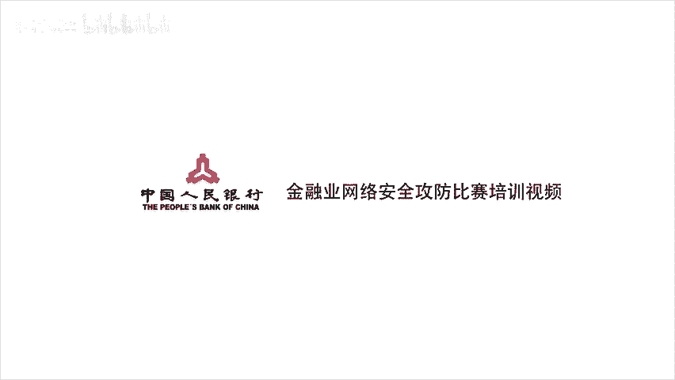

本节课我们一起学习了CTF安卓逆向的基础知识。我们首先了解了安卓应用的基本结构，包括SDK和NDK开发的区别。然后，介绍了逆向分析所需的工具链和CTF比赛中从易到难的常见考点。最后，通过两道实战题目，演示了如何对Java层代码进行静态分析，以及如何结合使用IDA Pro分析Native层（C/C++）代码来解题。掌握这些基础技能是步入安卓逆向领域的第一步。