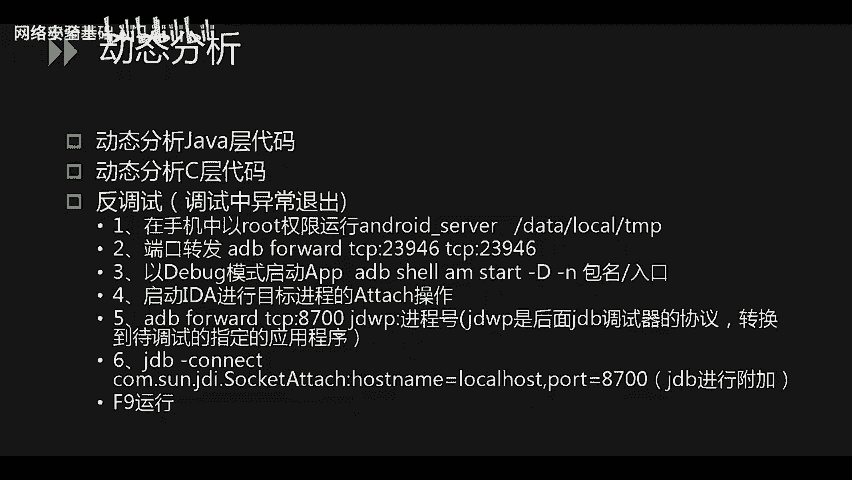
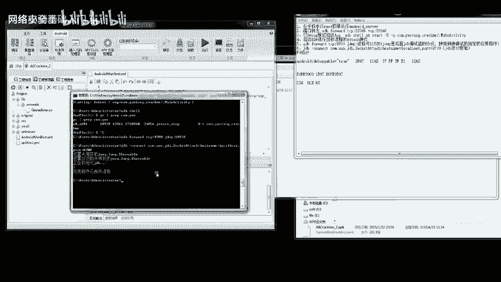
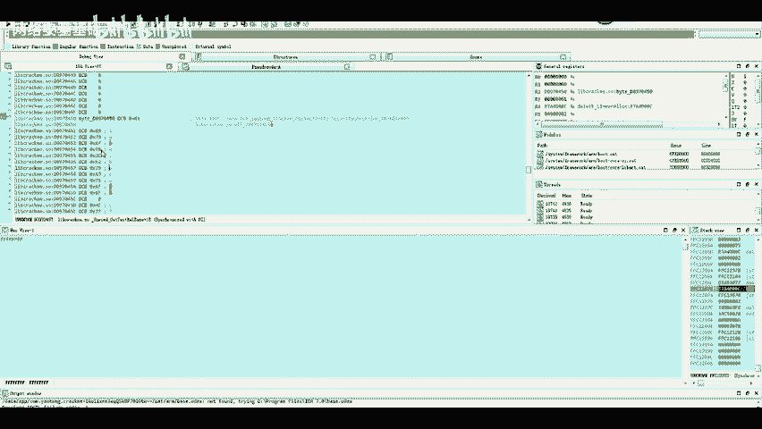
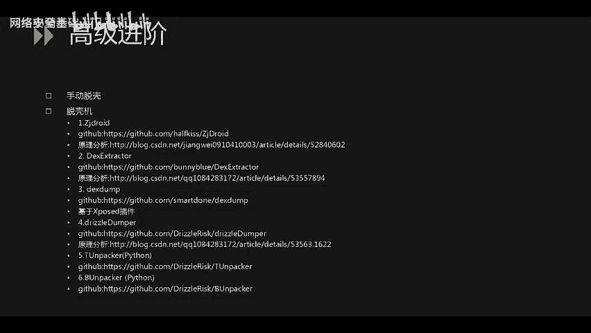

# CTF入门课程：P63：移动安全_2 - 安卓逆向与动态调试

在本节课中，我们将学习CTF比赛中安卓逆向的核心内容，特别是如何通过动态调试技术来分析应用程序，从而获取关键的flag信息。我们将从基础概念入手，逐步深入到具体的调试步骤和实战演示。

## 概述

上一节我们介绍了安卓逆向的静态分析方法。本节中，我们将重点讲解动态分析技术。动态分析是指在程序运行时进行调试和分析，这对于处理复杂的加密算法、绕过反调试机制以及直接从内存中提取关键数据至关重要。

## 算法复杂度与实战

之前演示的题目算法相对简单，是为了便于理解。在实际的CTF比赛中，题目难度会显著增加，可能会涉及**AES**、**DES**等对称加密算法。解题的关键通常在于获取加密使用的**密钥**，并编写或逆向出对应的解密算法。此外，出题人还可能在这些算法的中间或最后步骤加入额外的操作来增加难度，只有完整分析整个流程才能获得最终的flag。

## 动态分析技术

接下来，我们来看看动态分析。动态分析需要调试运行中的代码，这包括两个层面：**Java层代码**和**C/C++语言层（Native层）的代码**。在调试过程中，你可能会遇到**反调试**机制，导致程序异常退出，这是因为程序检测到了调试器的存在。解决这个问题通常需要绕过或挂起这些检测机制。

以下是进行动态调试的核心步骤，我们将在后续的演示视频中一一对应讲解。

## 动态调试步骤详解

以下是进行安卓应用动态调试的六个关键步骤：

1.  **部署调试服务器**：将IDA工具目录下的 `android_server` 调试服务器文件传输到安卓设备的指定目录（例如 `/data/local/tmp`），并赋予其可执行权限。
    *   命令示例：`adb push android_server /data/local/tmp/`
    *   命令示例：`adb shell chmod 755 /data/local/tmp/android_server`

2.  **建立端口转发**：在电脑端执行命令，将安卓设备的23946端口转发到本地，以便调试器通信。
    *   命令示例：`adb forward tcp:23946 tcp:23946`

3.  **以调试模式启动目标应用**：使用ADB命令以调试模式启动目标APP。
    *   命令示例：`adb shell am start -D -n com.example.package/.MainActivity`

4.  **附加目标进程**：启动IDA Pro，选择 `Debugger` -> `Attach` -> `Remote ARM Linux/Android debugger`，附加到目标进程。

5.  **配置调试选项**：附加成功后，在调试器设置中勾选 `Suspend on library load/unload` 等选项，以便在关键库（如.so文件）加载时暂停。

6.  **定位与下断点**：结合静态分析得到的函数偏移地址和动态加载的基地址，计算出函数在内存中的实际地址，并在此地址设置断点。
    *   公式：**内存中的函数地址 = SO库加载基地址 + 函数在文件内的偏移地址**

## 实战演示：使用动态调试获取Flag

在最后一个例题的演示中，我们使用了安卓Killer工具。至此，我们已经展示了三种常用的逆向工具。将APK文件直接拖入这些工具即可开始分析。

首先，我们需要让目标应用可调试。使用工具（如安卓Killer）反编译APK，在 `AndroidManifest.xml` 文件中为 `<application>` 标签添加 `android:debuggable="true"` 属性，然后重新编译并签名生成新的APK文件。

接下来，将修改后的APK安装到已获取root权限的测试设备上。
*   命令示例：`adb install modified_app.apk`

安装成功后，在设备上启动调试服务器，并以调试模式运行目标APP。此时手机界面会显示“等待调试器连接”。在IDA中附加到该进程，并按照前述步骤配置，使程序在加载自定义的 `.so` 库时暂停。

通过 `Ctrl+S` 查看所有已加载的模块，找到我们自己的 `.so` 库及其在内存中的基地址。同时，在另一个IDA实例中静态分析同一个 `.so` 文件，找到关键函数（例如进行比对的函数）在文件内的偏移量。

根据公式计算出该函数在运行时的内存地址，跳转到该地址并设置断点。运行程序，当断点命中时，即可开始单步调试。

在调试过程中，可以按 `F5` 键将汇编代码反编译为更易读的C代码，便于理解逻辑。我们关注的核心是一个比对循环，它会从内存中提取预设的值与用户输入进行逐位比较。通过单步执行并观察寄存器和内存的变化，在关键指令执行后，查看相关寄存器（如R3）或跳转到寄存器指向的内存地址，即可直接找到存储在内存中的原始flag值。

本题的解题核心就在于通过动态调试，绕过算法分析，直接从内存中提取出用于比对的正确数据。

## 拓展：安卓应用脱壳思路

最后，我们为大家提供一些安卓应用**脱壳**的思路。脱壳是指去除应用程序的加固保护，还原出原始的代码。

1.  **手动脱壳**：这通常需要动态调试，绕过多种反调试机制，等待原始程序在内存中完全解密后，再从内存中 dump（转储）出解密后的代码。
2.  **使用脱壳工具**：存在多种自动化或半自动化的脱壳工具。
    *   **ZZDroid**：一种较老的基于内存Dump的脱壳工具。
    *   **模拟器脱壳**：通过修改模拟器内核中加载模块的逻辑来实现脱壳。
    *   **基于Xposed的脱壳模块**：利用Xposed框架Hook关键函数来Dump内存。
    *   **针对特定加固的工具**：例如，存在专门用于脱360加固、腾讯加固（旧版本）、邦邦加固等商业壳的工具。在CTF比赛中，一般不会使用最新的商业壳来增加难度。

## 总结

本节课中，我们一起学习了安卓逆向中的动态调试技术。我们从动态分析的概念和必要性讲起，详细介绍了建立调试环境、附加进程、下断点等具体步骤，并通过实战演示了如何利用动态调试绕过复杂逻辑，直接从内存中提取flag。最后，我们还简要探讨了安卓应用脱壳的几种常见思路。掌握这些技能，将帮助你更有效地解决CTF移动安全方向的逆向题目。