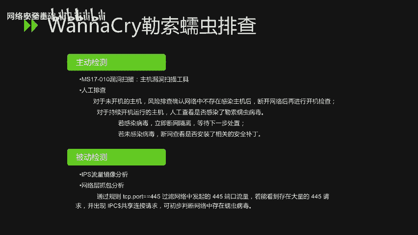
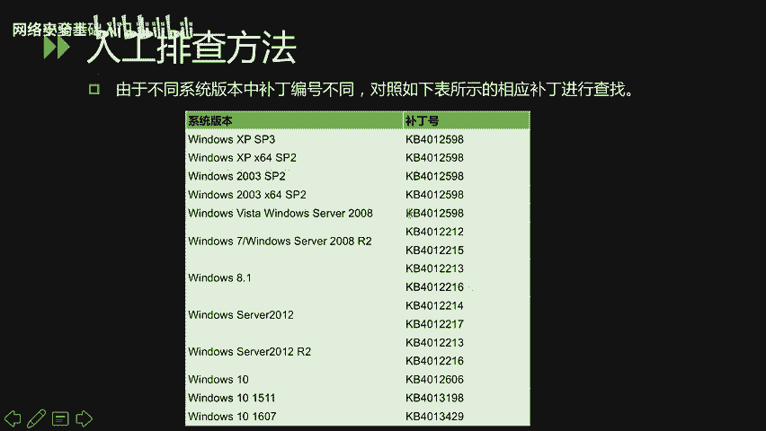
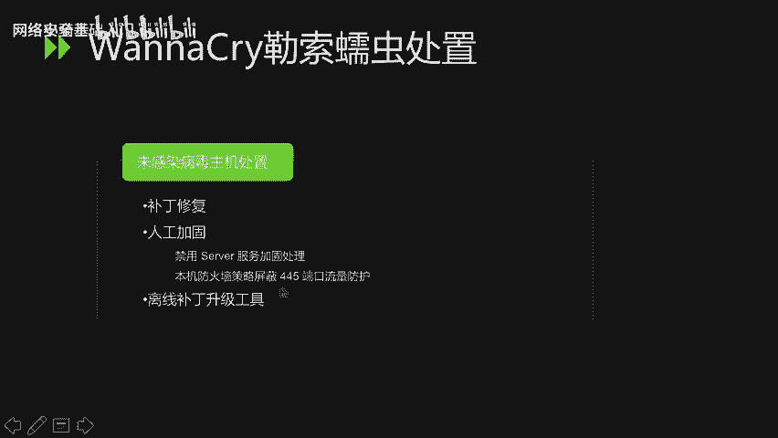

# CTF入门课程：P65：重点漏洞分析_2 🔍


在本节课中，我们将学习两个历史上影响深远的重大安全漏洞：Shellshock（破壳漏洞）与 EternalBlue（永恒之蓝）。我们将分析它们的原理、影响范围以及修复和处置方法。

## Shellshock（破壳漏洞）分析 🐚

上一节我们介绍了漏洞分析的基本概念，本节中我们首先来看一个经典的Shell漏洞。Shellshock，又称破壳漏洞，是Bash shell中的一个严重安全缺陷。Bash是大多数Linux系统和macOS的默认命令行解释器。

该漏洞主要涉及两个CVE编号：CVE-2014-6271和CVE-2014-7169。

### CVE-2014-6271漏洞原理

该漏洞源于Bash处理环境变量的方式。攻击者可以构造特殊的环境变量值，其中包含恶意代码。当Bash对这些环境变量进行求值时，这些代码将被执行。某些服务和应用会接受未经身份验证的用户提供的环境变量，这使得攻击者能够利用此漏洞在目标系统上执行任意命令。

其核心问题在于，Bash在处理以函数定义形式（`(){`开头）的环境变量时，没有以正确的结束符（`}`）来终止，而是继续执行了其后的命令。

**验证命令示例：**
```bash
env x='() { :;}; echo vulnerable' bash -c "echo this is a test"
```
如果输出中包含“vulnerable”，则证明系统存在此漏洞。

### CVE-2014-7169漏洞原理

此漏洞是CVE-2014-6271补丁不完善导致的绕过情况。它允许在环境变量的值中进行函数定义后，附加额外的字符串。攻击者可利用此特性执行写入文件等影响系统的操作。

**验证命令示例：**
```bash
env X='() { (a)=>\' bash -c "echo date"; cat echo
```
此命令通过构造特殊变量使Bash解释器出错，从而将后续命令（如`echo date`）放入缓冲区并执行。如果输出了当前日期，则证明漏洞存在。

### 漏洞修复方法

以下是针对不同Linux系统的修复方案：

*   **RedHat/CentOS系列系统**：使用命令 `yum update bash` 更新Bash。
*   **Debian/Ubuntu系列系统**：先运行 `apt-get update`，然后执行 `apt-get install --only-upgrade bash`。

**漏洞严重性**：Shellshock的CVSS评分为10.0（最高级别）。作为对比，2014年爆发的“心脏滴血”（Heartbleed）漏洞评级为5.0，可见破壳漏洞的严重性极高。

## EternalBlue（永恒之蓝）与WannaCry分析 💀

了解了Shell层面的漏洞后，我们转向一个影响Windows系统的著名漏洞。由永恒之蓝漏洞传播的WannaCry勒索蠕虫在2017年造成了全球性的大规模安全事件。

### 漏洞与事件概述

WannaCry是一种蠕虫式勒索病毒，不法分子利用美国国家安全局（NSA）泄露的“永恒之蓝”（EternalBlue）漏洞工具进行传播。该漏洞存在于微软的服务器消息块协议中，攻击者利用它可以远程执行代码。

**影响范围**：所有未安装MS17-010安全补丁的Windows操作系统均受影响，范围极其广泛。

### 排查方法

对于WannaCry蠕虫的排查，可以从主动和被动两个方向进行。



**主动检测**：
*   使用主机漏洞扫描工具。
*   进行人工排查：对于未开机的主机，确认网络环境安全后再开机检查；对于已开机的主机，直接检查是否感染病毒。

**被动检测**：
*   通过IPS进行流量镜像分析。
*   进行网络层抓包分析：使用过滤规则 `tcp.port == 445` 检查是否有大量445端口流量及IPC$共享连接请求，可初步判断蠕虫存在。

### 人工补丁排查示例

以下是通过查看系统已安装更新来排查的方法：



*   **Windows Server 2003**：在“添加或删除程序”面板中开启“显示更新”，查找是否存在 **KB4012596** 补丁。
*   **Windows 7**：在“控制面板”->“程序和功能”->“查看已安装的更新”中，查找 **KB4012212** 补丁。

不同系统版本对应的补丁编号不同，需根据微软官方公告进行准确查询。

### 处置方法

**对于已感染病毒的主机**：
1.  立即断网隔离。
2.  评估加密文件的重要性，决定是否格式化磁盘并重装系统。
3.  如果内网主机无法访问外网，需在内网DNS中将病毒尝试连接的特定域名（如 `www.iuqerfsodp9ifjaposdfjhgosurijfaewrwergwea.com`）解析到一台可控的内网主机，以阻断传播。
4.  进行病毒清除：
    *   结束 `tasksche.exe` 进程。
    *   删除病毒创建的服务（服务名随机）。
    *   删除磁盘中的病毒文件（文件名随机）。
    *   清理相关的注册表项。

**对于未感染病毒的主机**：
1.  **补丁修复**：立即安装MS17-010安全补丁，可使用离线补丁升级工具。
2.  **人工加固**：
    *   禁用Server服务。
    *   通过本机防火墙策略屏蔽445端口的入站流量。



---


本节课中我们一起学习了Shellshock和EternalBlue两大重点漏洞。我们分析了它们的原理、验证方式、巨大的危害性以及具体的修复和应急响应步骤。理解这些历史重大漏洞，有助于我们建立基本的安全风险意识，并掌握一些基础的系统安全加固与排查方法。