# CTF入门课程：6：杂项的基本解题思路（下半部分）

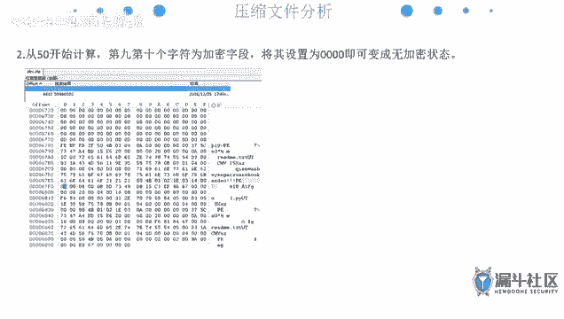

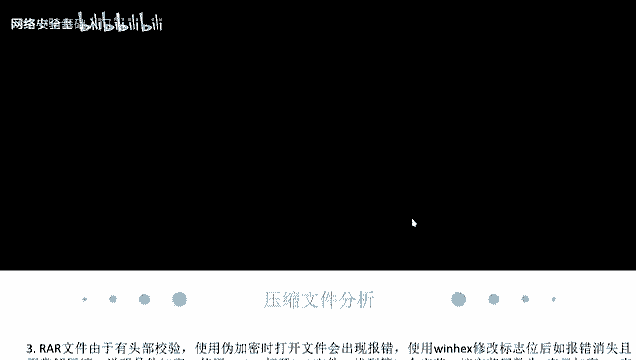

## 概述
在本节课中，我们将继续学习CTF杂项题目的解题思路，重点聚焦于压缩文件处理和流量分析取证技术。我们将学习如何识别和处理伪加密、暴力破解压缩包、修复损坏的压缩文件，以及使用Wireshark等工具分析网络流量包，从中提取关键信息或文件。

---

## 压缩文件处理

上一节我们介绍了文件和图片隐写，本节中我们来看看如何处理压缩文件。压缩文件通常作为题目的载体，考察点包括伪加密、暴力破解和文件修复。

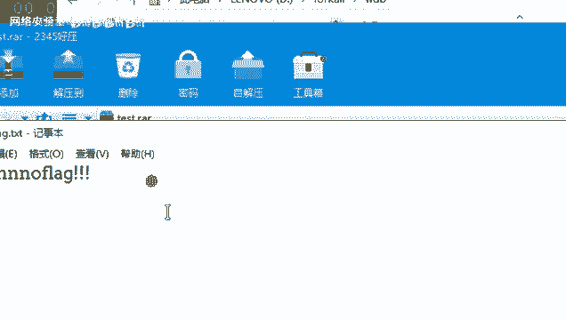

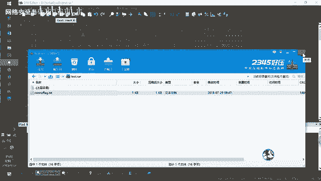

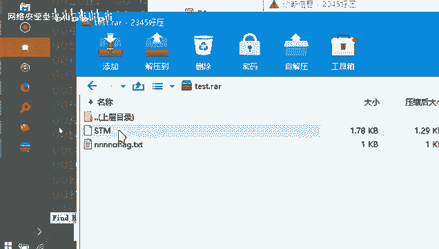

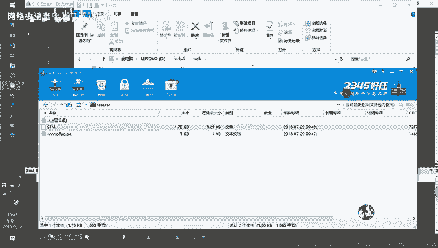

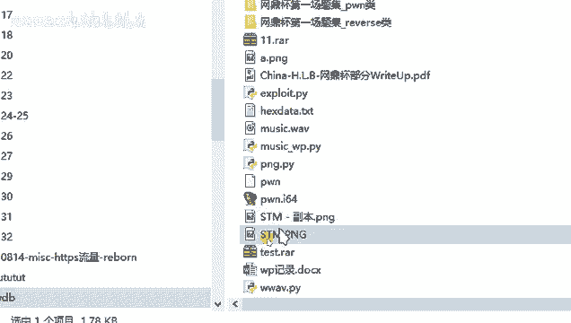

### 伪加密识别与修复
压缩文件（如ZIP、RAR）有时会使用“伪加密”技术。它并非真正用密码加密，而是通过修改文件头部的特定标志位，让解压软件误以为文件已加密。

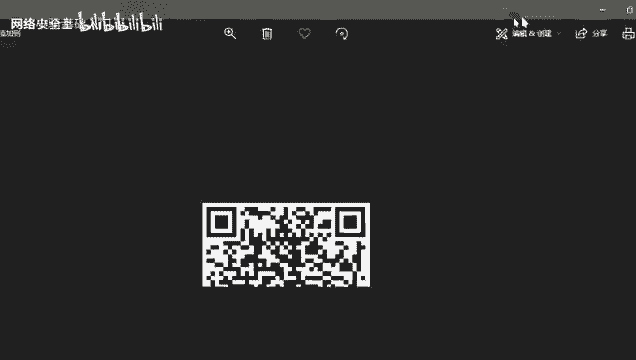

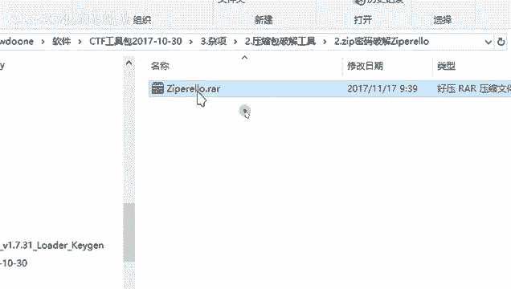

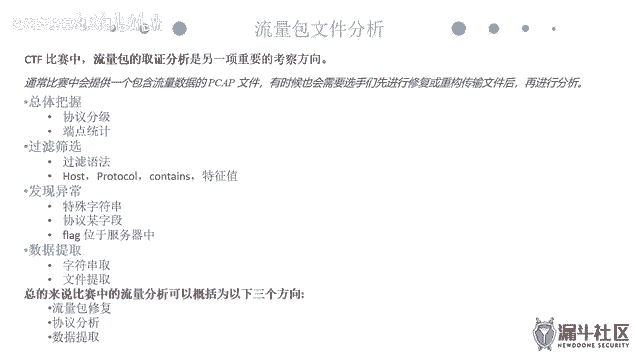

**核心操作**是使用十六进制编辑器（如WinHex、010Editor）修改标志位。

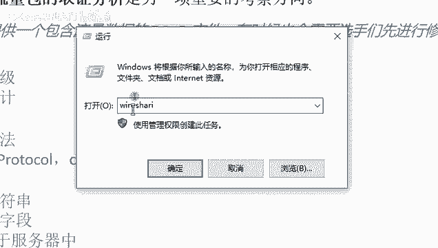

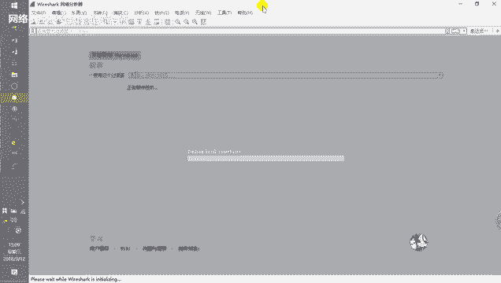

*   **ZIP文件**：搜索十六进制值 `504B0102`，从该位置开始数，第9和第10个字节是加密标志位。将其改为 `0000` 即可去除伪加密。
*   **RAR文件**：从文件头开始，第24个字节是加密标志位。将其改为 `00` 即可。

> **注意**：现代压缩软件（如360压缩、2345好压）可能自动修复伪加密，直接解压。但在CTF比赛中，仍需掌握手动修复方法。

### 暴力破解与字典攻击
如果压缩包是真正加密的，且密码强度不高，我们可以尝试暴力破解或使用字典攻击。

以下是常用工具和方法：
*   **ARCHPR**：用于破解RAR压缩包密码。支持暴力破解、掩码攻击和字典攻击。
*   **ZIP密码破解工具**：工具包中提供了针对ZIP文件的专用破解工具。
*   **掩码攻击**：当已知密码部分字符时（如已知前三位是`ABC`），使用掩码模式（如`ABC???`）可以极大提高破解效率。
*   **明文攻击**：如果已知压缩包内某个文件的原始内容（明文），可以利用此已知文件对加密压缩包进行攻击，成功率较高。**注意**：用于攻击的明文文件必须使用与目标压缩包相同的压缩算法重新压缩。

### 压缩包修复
有时，题目提供的压缩包本身是损坏的，导致无法正常列出或解压所有文件。这需要我们对压缩文件格式有深入了解。

**核心思路**：一个压缩包内可能包含多个文件，每个文件都有一个特定的“文件头”标识（例如，在某种格式中，文件头类型为 `0x74`）。如果文件头标识被错误修改，解压软件就无法识别该文件。

**修复步骤**：
1.  用十六进制编辑器打开损坏的压缩包。
2.  在已知文件内容结束的位置之后，寻找应属于下一个文件头的区域。
3.  检查该区域的“文件头类型”字节是否正确（例如，应为`0x74`）。
4.  如果错误（如被改为`0x7A`），将其修正为正确的值。
5.  保存文件后，即可用压缩软件正常解压出隐藏的文件。

---

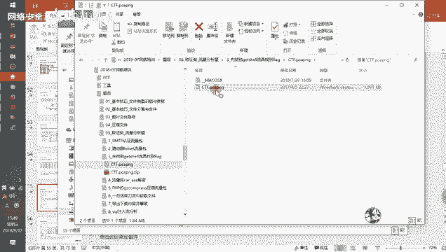

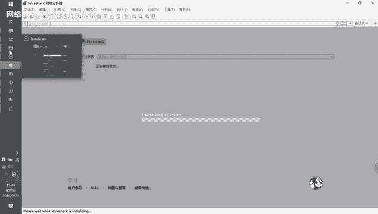

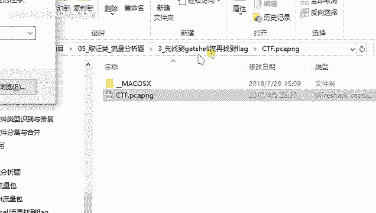

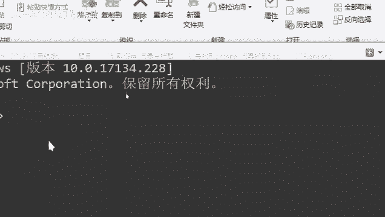

## 流量分析取证技术

处理完压缩文件，我们进入更复杂的流量分析领域。流量包记录了网络通信的所有数据，可能隐藏着聊天记录、传输的文件或攻击痕迹。

### 流量分析基础与Wireshark工具
**Wireshark** 是进行流量分析的核心工具。它能够捕获和展示网络数据包，并支持强大的过滤功能。

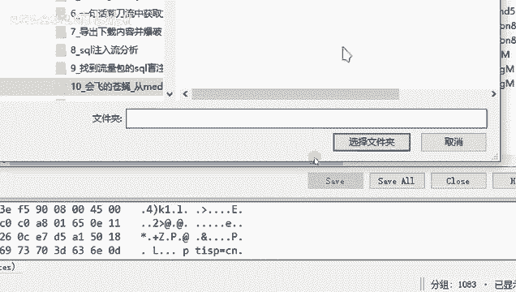

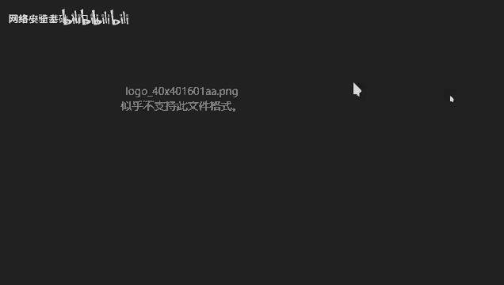

首先，我们需要掌握基本的过滤语法，以便从海量数据包中快速定位关键信息：

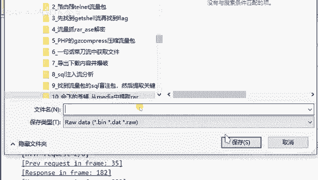

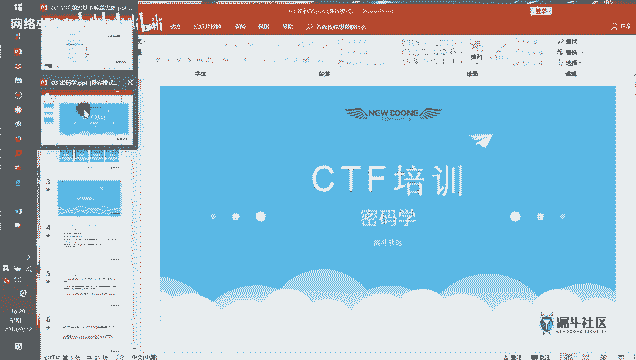

*   **过滤IP地址**：
    *   `ip.src == 192.168.1.1` （过滤源IP）
    *   `ip.dst == 192.168.1.100` （过滤目的IP）
*   **过滤端口**：
    *   `tcp.port == 80` （过滤TCP 80端口，常用于HTTP）
    *   `udp.port == 53` （过滤UDP 53端口，常用于DNS）
*   **过滤协议**：直接输入协议名，如 `http`, `tcp`, `dns`, `ssl`。
*   **过滤包长度**：`frame.len > 100` （过滤长度大于100字节的包）。
*   **HTTP协议过滤**（非常常用）：
    *   `http.request.method == GET`
    *   `http contains “flag”` （在HTTP协议中搜索包含“flag”字符串的包）

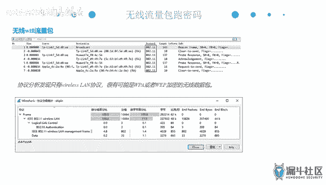

`contains` 语法非常强大，可以跨协议搜索任意关键字，如 `tcp contains “admin”`。

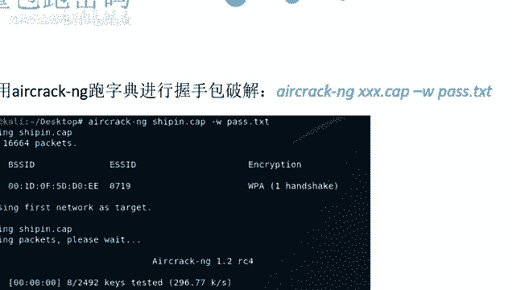

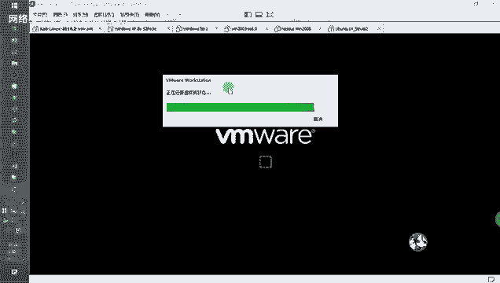

### 协议分析与数据提取技巧
面对一个庞大的流量包，我们可以按以下步骤高效分析：

1.  **协议分级统计**：点击 `统计` -> `协议分级`。这能直观展示流量包中各种协议的占比，帮助我们判断主要的数据流是什么（例如，是否主要是HTTP流量）。
2.  **追踪流**：右键某个数据包，选择 `追踪流` -> `TCP流/HTTP流/SSL流`。这会将一次完整的会话数据提取出来，便于查看完整的请求和响应，flag或关键信息常藏于此。
3.  **导出对象**：对于HTTP/FTP等协议，可以点击 `文件` -> `导出对象` -> `HTTP...`，直接导出通过该协议传输的所有文件（如图片、文档、压缩包）。
4.  **手动导出分组字节流**：对于非标准协议或Wireshark无法直接导出的数据，可以选中特定数据包，右键 `导出分组字节流`，将原始二进制数据保存到文件，再进行后续分析。

### 特殊流量包分析
有些题目会考察特定类型的流量包，需要特殊处理方法。

*   **无线流量包（WIFI握手包）**：
    *   此类包用于破解WIFI密码。核心是找到包含密码哈希的“握手包”。
    *   使用 `Aircrack-ng` 工具套件。首先用 `aircrack-ng` 检查包文件，确认是否为WPA/WPA2握手包。
    *   然后使用命令 `aircrack-ng -w 字典文件 流量包文件` 进行字典破解。
*   **USB流量包**：
    *   通常考察键盘击键记录或鼠标移动轨迹。
    *   **键盘流量**：数据包中第三个字节为键值。需要对照USB键值映射表，将捕获的键值序列还原为敲击的字符。可以使用提供的Python脚本自动化此过程。
    *   **鼠标流量**：数据包包含鼠标移动的X/Y轴偏移量。提取这些坐标数据后，使用绘图工具（如gnuplot）将坐标点连接起来，即可还原出鼠标移动轨迹，轨迹可能构成flag或二维码。
*   **HTTPS流量解密**：
    *   HTTPS流量默认是加密的。如果题目给出了解密的密钥（如RSA私钥），需要在Wireshark中导入：`编辑` -> `首选项` -> `Protocols` -> `TLS/SSL`，添加密钥文件。
    *   导入后，Wireshark会自动解密TLS流量，原本加密的HTTP数据就会显示出来，然后即可按常规HTTP流量进行分析。

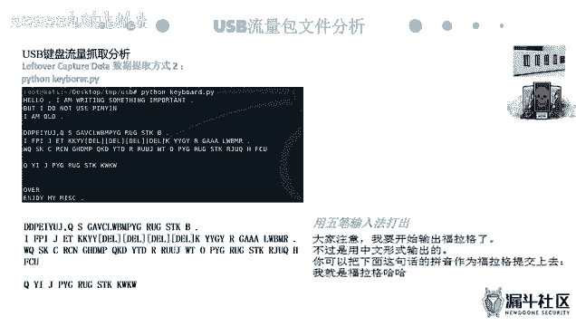

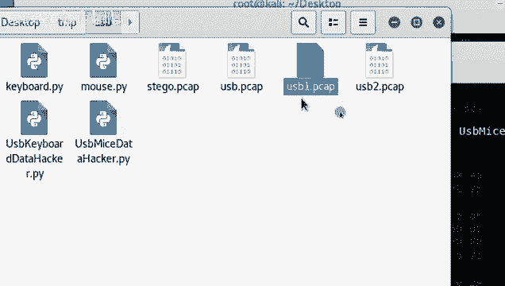

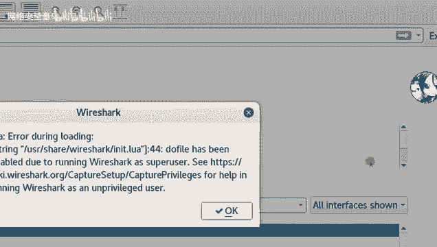

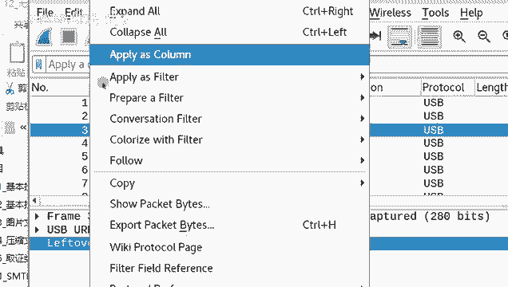

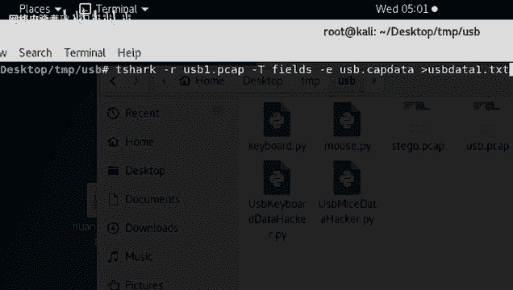

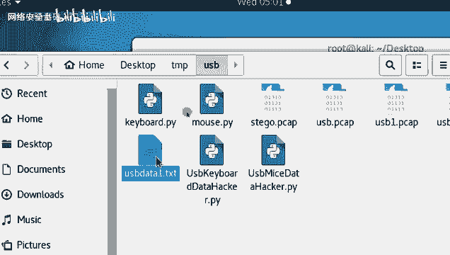

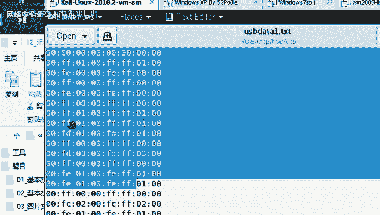

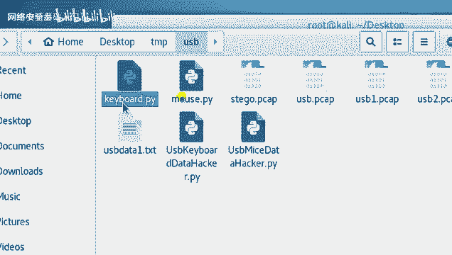

---

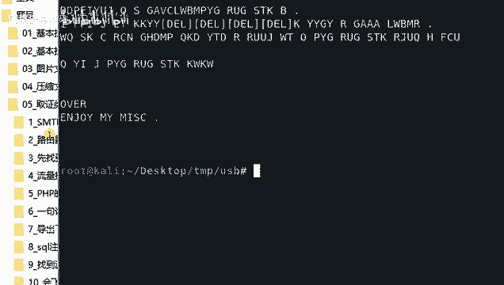

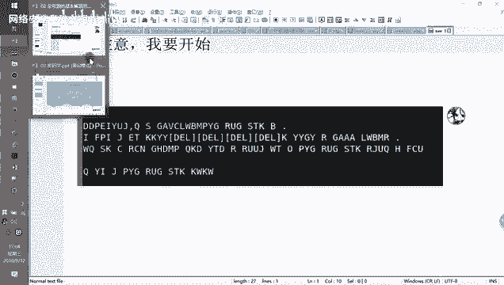

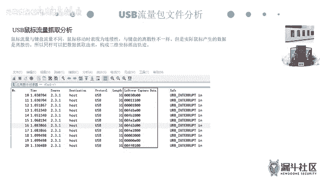

## 总结
本节课我们一起学习了CTF杂项中压缩文件处理和流量分析两大核心技能。

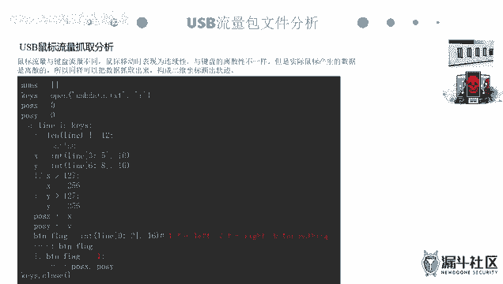

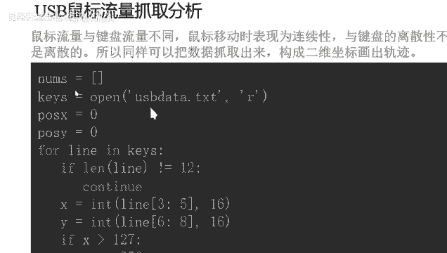

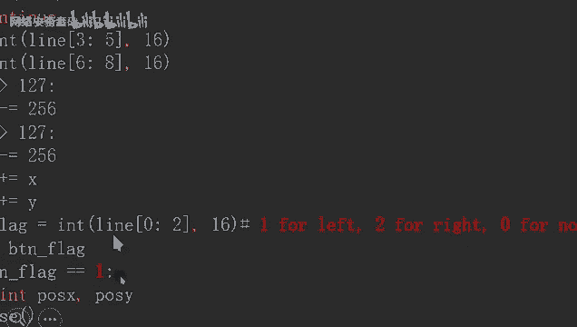

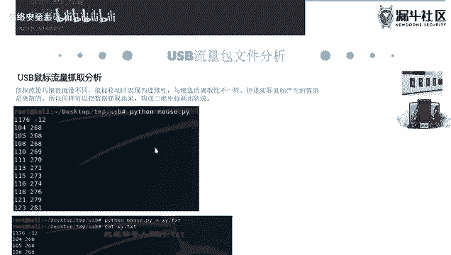

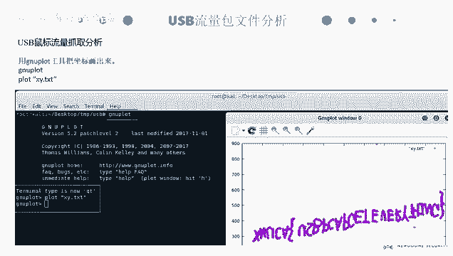

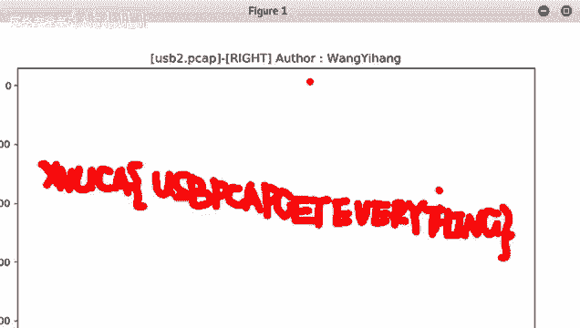

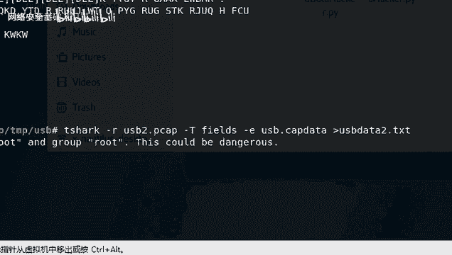

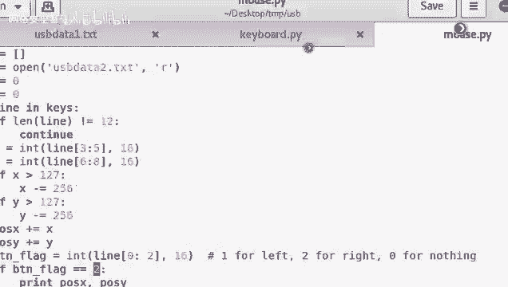

在压缩文件部分，我们掌握了**伪加密的识别与修复**、使用工具进行**暴力破解或字典攻击**，以及通过分析文件结构来**修复损坏的压缩包**。

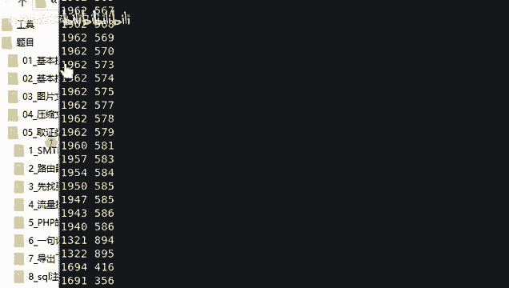

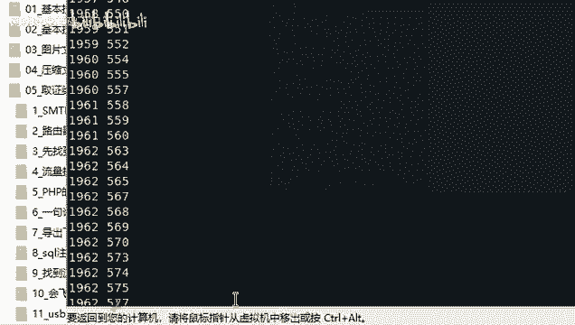

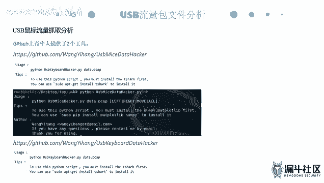

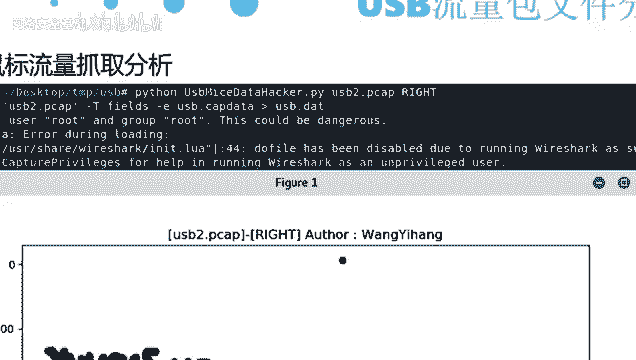

在流量分析部分，我们学习了使用 **Wireshark工具** 的基本技巧，包括**过滤语法**、**协议分级**、**追踪流**和**导出数据**。我们还探讨了针对**无线握手包**、**USB流量包**和**HTTPS加密流量**等特殊类型的分析方法与工具。

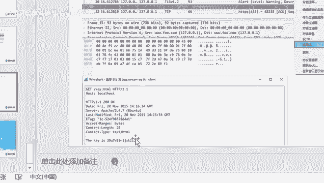

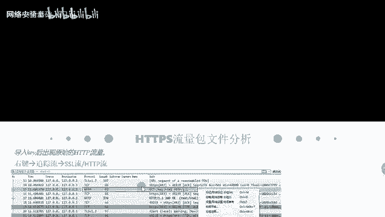

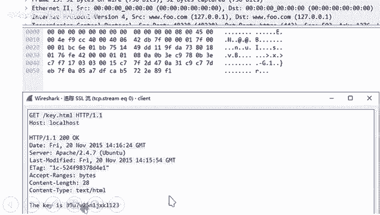

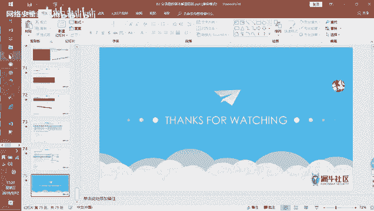

这些技能是CTF比赛中解决杂项题目的基础，需要通过不断练习来巩固和提升。接下来，我们将进入密码学部分的学习。