# CTF入门课程：7：密码学下半部分

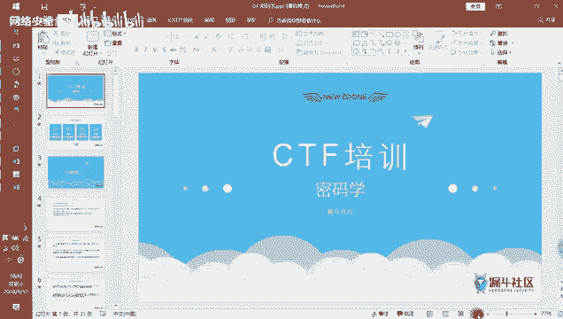

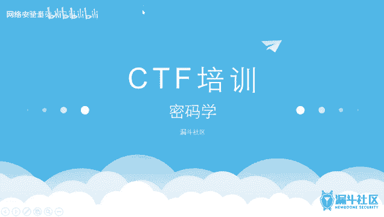

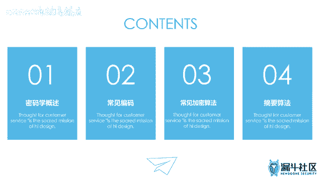


## 概述

在本节课中，我们将继续学习密码学的基础知识。我们将了解密码学的概述、常见编码方式、加密算法以及摘要算法。课程内容旨在帮助初学者理解这些概念，并掌握在CTF比赛中识别和处理相关题目的基本方法。

---

## 密码学概述

上一节我们介绍了密码学的基本概念，本节中我们来看看密码学的发展历程及其主要分类。

密码学的发展经历了古典、近代和现代三个阶段。CTF题目中常涉及古典密码学和近代密码学，这类题目相对基础。现代密码学题目则难度较大，因其加密强度高，具有不可逆性。

密码学主要包含两个概念：编码和加密。此外，还有一种称为摘要算法的技术。

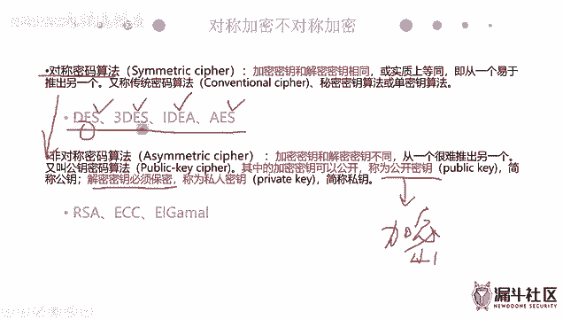

*   **编码**：更像是一种映射关系。例如，可以自定义一套符号系统，每个符号代表特定含义。这类似于给物品贴上标签。
*   **加密**：目的是混淆数据，使其难以区分原始信息。例如，将红豆和绿豆混合。加密过程涉及算法，比编码更复杂。
*   **摘要算法**：用于验证数据的完整性，确保数据在传输过程中未被篡改。它不属于编码或加密。

加密算法主要分为两类：

1.  **对称密钥算法**：加密和解密使用**同一个密钥**。公式表示为：`密文 = E(密钥, 明文)`，`明文 = D(密钥, 密文)`。其特点是加密效率高。
2.  **非对称密钥算法**：使用**一对密钥**，即公钥和私钥。公钥用于加密，私钥用于解密。公式表示为：`密文 = E(公钥, 明文)`，`明文 = D(私钥, 密文)`。公钥可以公开，私钥必须保密。其加密强度高，但效率低于对称加密。

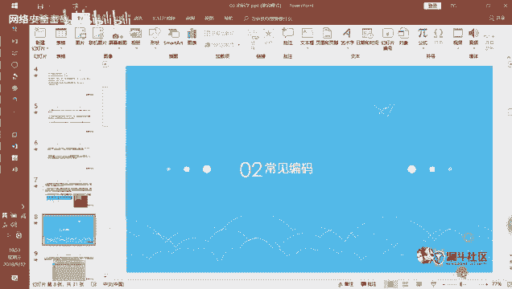

以下是常见的算法举例：

*   **对称密钥算法**：DES、3DES、IDEA、**AES**（目前公认最强的对称加密算法）。
*   **非对称密钥算法**：RSA（CTF中最常考）、ElGamal、椭圆曲线加密。
*   **摘要算法（哈希算法）**：**MD5**、**SHA**系列。其特点是输入微小改变会导致输出结果完全不同，且过程不可逆。常用于校验文件完整性。

---

## 常见编码

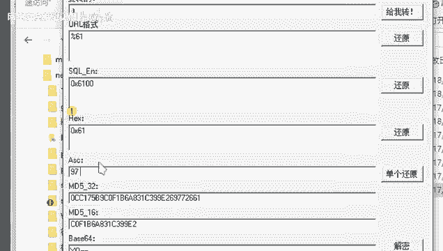

以下是CTF中常见的几种编码方式，了解其特征和识别方法对解题至关重要。

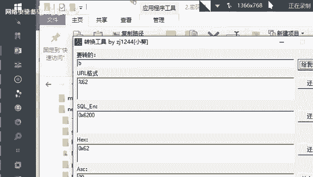

### ASCII编码

ASCII码是最早的计算机编码标准，主要用于英文字符、数字和常见符号。

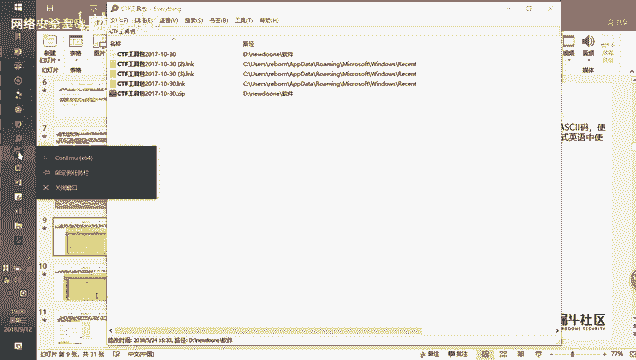

*   **标准ASCII码**：共128个字符（2^7）。
*   **扩展ASCII码**：共256个字符（2^8）。
*   **特征**：在解题或编写脚本时，需要知道可打印字符（如字母、数字）和不可打印字符（如控制字符）的对应关系。
*   **工具**：可以使用Python内置函数进行转换：
    ```python
    # 字符转ASCII码
    ascii_value = ord('A')  # 输出：97
    # ASCII码转字符
    character = chr(97)     # 输出：'A'
    ```
*   **在线工具**：可利用CTF工具包（如“小葵多功能转换工具”）或特定在线网站进行编解码。

### Base64编码

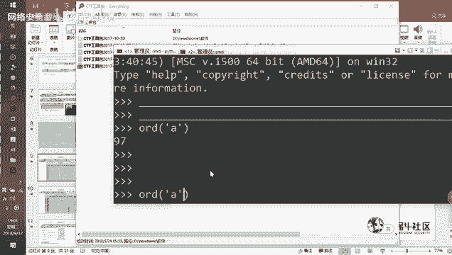

Base64编码基于64个可打印字符来表示二进制数据。

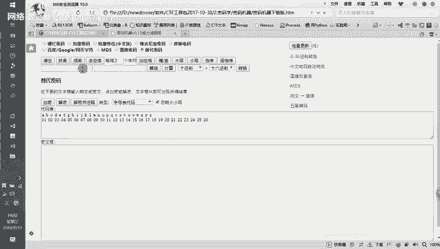

*   **原理**：将每3个8位字节（共24位）的数据，重新编码为4个6位字节（同样24位）的字符。每个6位字节前补两个0，形成4个8位字节，因此编码后数据长度会增加约1/3。
*   **特征**：编码后的字符串通常包含字母、数字、`+`、`/`，并可能以**一个或两个`=`** 作为填充结尾。这是识别Base64编码的重要标志。
*   **注意**：如果解码失败，可以尝试补上`=`再解码。
*   **工具**：浏览器开发者工具、在线解码网站、CTF工具包中的“密码机器”等。

### URL编码

URL编码（百分号编码）用于在URL中安全传输特殊字符。

*   **原理**：将字符转换为其ASCII码的十六进制形式，并在前面加上百分号`%`。例如，空格` `的ASCII码是32，十六进制是20，因此编码为`%20`。
*   **特征**：字符串中包含大量`%XX`形式的子串。
*   **工具**：浏览器地址栏会自动进行URL编解码，也可使用开发者工具或“小葵”等工具手动操作。

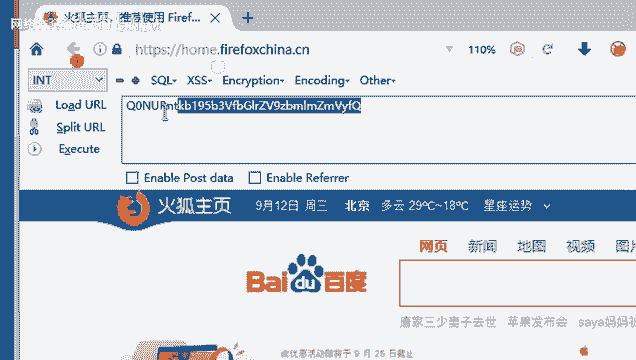

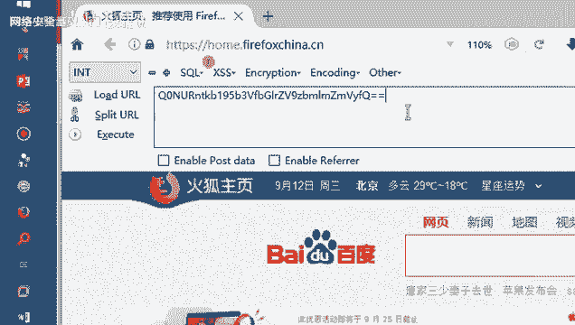

### Unicode编码

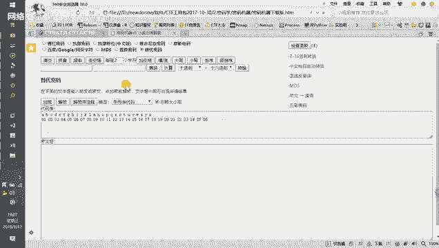

Unicode编码旨在为全世界所有字符提供统一的编码方案。

*   **原理**：使用16位（2字节）或更多位表示一个字符，能表示远超ASCII码范围的字符集。其前256个字符与扩展ASCII码兼容。
*   **特征**：编码形式通常为`\uXXXX`（其中XXXX为四位十六进制数）。在字符串中看到这种格式，很可能是Unicode编码。
*   **工具**：可使用在线解码器或编程语言的相关库进行转换。

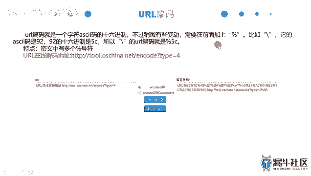

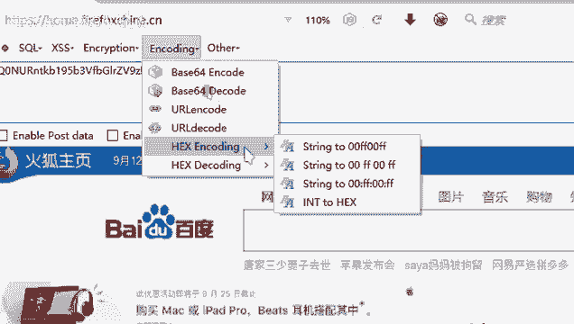

### JavaScript混淆

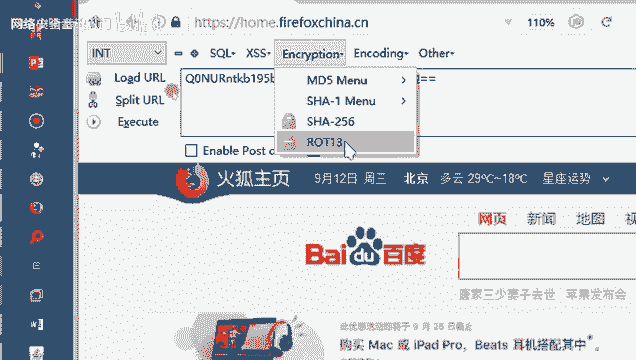

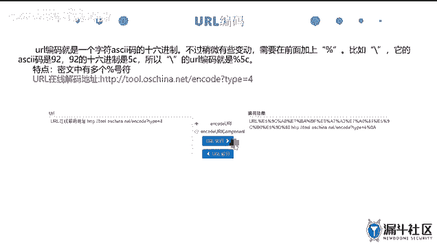

JavaScript混淆不是严格意义上的编码，而是一种保护前端代码的技术。

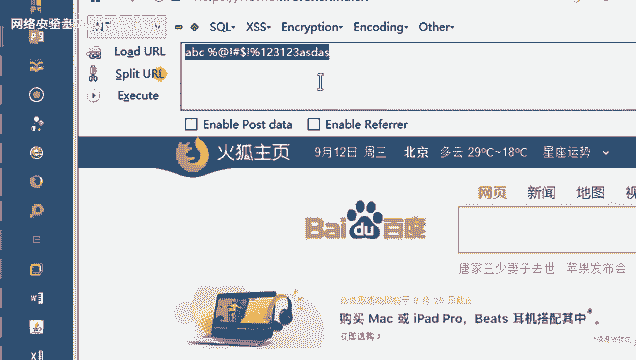

*   **原理**：将可读的JavaScript代码通过转义（如十六进制`\xXX`、Unicode`\uXXXX`）、变量名替换、代码压缩等方式变得难以阅读，但功能不变。
*   **特征**：代码中存在大量`\x`、`\u`、无意义的变量名或极度紧凑的格式。
*   **解密**：混淆后的代码**仍然可以在浏览器控制台中直接执行**。将混淆代码复制到浏览器控制台（按F12打开），回车运行即可看到执行结果（如弹窗）。这是判断其功能和获取原始信息的最直接方法。

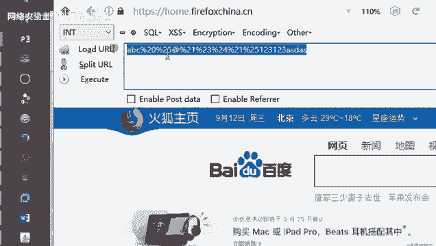

---

## 总结

本节课我们一起学习了密码学的核心分类，并详细探讨了几种CTF中常见的编码方式。

我们了解到：
1.  密码学包括编码、加密和摘要算法。
2.  加密分为对称加密（如AES）和非对称加密（如RSA）。
3.  摘要算法（如MD5）用于验证数据完整性。
4.  对于ASCII、Base64、URL、Unicode等编码，关键掌握其**识别特征**和**解码工具**。
5.  遇到JavaScript混淆代码，可尝试在浏览器控制台中直接执行来观察其行为。

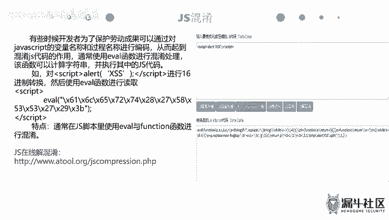

掌握这些基础知识，是解决CTF密码学相关题目的第一步。接下来，你需要多利用提供的工具进行练习，熟悉各种编码和加密方式的外在表现。