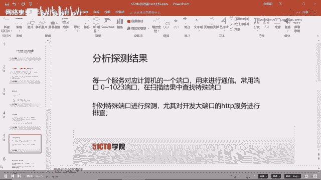
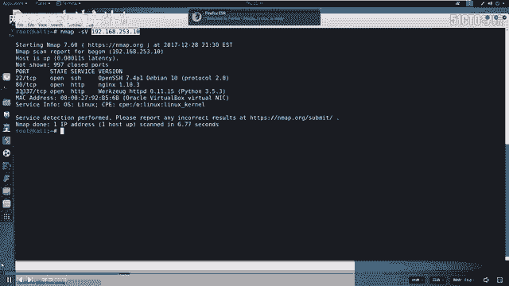
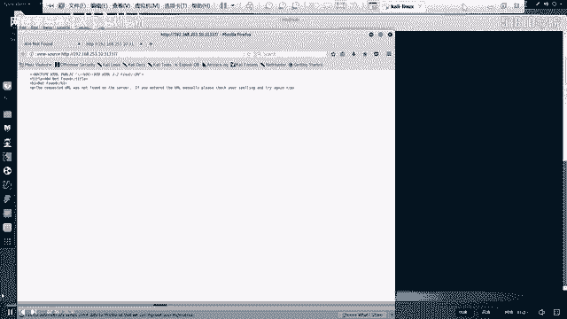
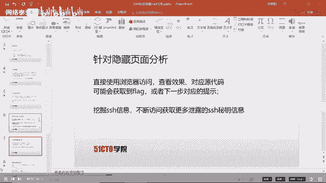
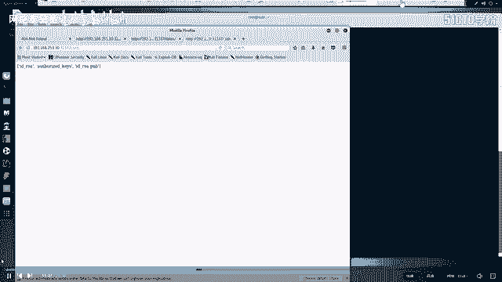
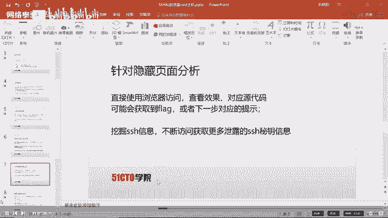
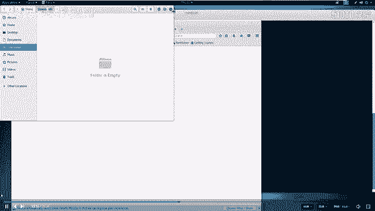
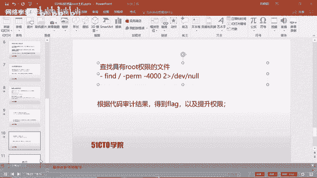
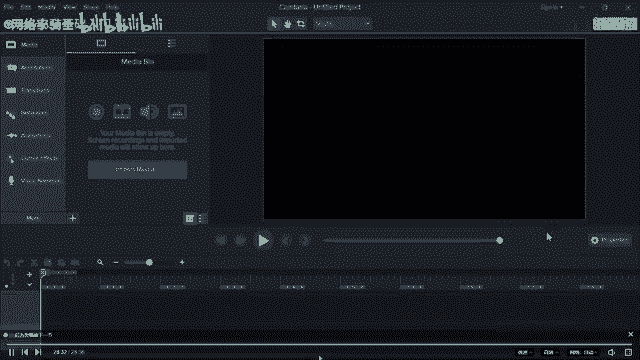

# CTF入门课程：8：SSH私钥泄露与权限提升实战 🚩

在本节课中，我们将学习CTF比赛中一个常见场景：SSH私钥泄露。我们将从信息收集开始，通过泄露的私钥文件，逐步渗透进入靶场主机，并最终获取root权限以取得flag。整个过程将涵盖端口扫描、Web目录探测、私钥破解以及权限提升等核心技能。

## 比赛环境介绍

在深入学习具体技术之前，我们先了解一下CTF比赛的常见环境设置。这有助于我们理解攻击的起点和边界。

CTF比赛环境主要分为两种模式：

*   **集中式环境**：攻击机和靶场机器通常部署在同一局域网中。选手通过Web方式访问一台预置的攻击机（通常是Kali Linux），并使用这台攻击机对靶场进行测试。选手一般无需自带设备。
*   **自带设备环境**：比赛方仅提供一个网络接口。选手需要自带个人电脑（PC）以及所有必要的渗透测试工具。选手的设备通常可以接入互联网查询资料，其目标是直接攻击举办方提供的靶场IP地址。

无论哪种环境，最终目标都是渗透靶场机器，获取存储在其中的flag值。

## 实验环境与目标 🎯



上一节我们介绍了比赛环境，本节我们来看看本次课程的具体实验设置。



*   **攻击机 (Kali Linux) IP**: `192.168.253.12`
*   **靶场机器 IP**: `192.168.253.10`

我们的目标是获取靶场机器上的flag。



## 信息收集：端口与服务探测

拿到目标IP后，第一步永远是信息收集。我们需要知道目标开放了哪些服务，这些服务就是潜在的入口点。



我们使用 `nmap` 工具进行端口扫描和服务识别。命令如下：
```bash
nmap -sV 192.168.253.10
```
扫描结果显示靶机开放了SSH服务（端口22）和两个HTTP服务（端口80和31337）。渗透测试的本质就是对目标服务进行漏洞探测。

## Web服务深入探测

在发现开放服务后，我们需要对它们进行深入分析。首先从非常规的大端口HTTP服务（31337）开始。



我们通过浏览器访问 `http://192.168.253.10:31337`。页面上没有直接显示有用信息。一个常见的技巧是查看网页源代码，有时flag或提示会隐藏在其中。但本次查看源代码后仍未发现线索。



因此，我们需要探测该Web目录下是否存在隐藏文件或目录。以下是探测Web目录隐藏文件的常用方法：

我们使用 `dirb` 工具进行目录爆破。
```bash
dirb http://192.168.253.10:31337/
```
扫描结果中，`/robots.txt` 和 `/.ssh/` 两个目录引起了我们的注意。



## 分析关键文件

`robots.txt` 文件通常用于指示搜索引擎哪些目录可以或不可以爬取。访问该文件后，发现它禁止爬取 `/taxes` 这个路径。这反而提示了我们这是一个敏感路径。

访问 `http://192.168.253.10:31337/taxes`，我们成功找到了第一个flag。

接下来分析 `/.ssh/` 目录。SSH是用于远程安全登录的服务，其认证通常基于公钥和私钥对。访问该目录，我们发现可以下载 `id_rsa`（私钥文件）和 `authorized_keys` 文件。

我们将私钥文件 `id_rsa` 下载到攻击机桌面。

## 利用泄露的SSH私钥

拿到私钥后，我们尝试用它登录靶场机器。首先需要给私钥文件设置正确的权限。
```bash
chmod 600 id_rsa
```
然后尝试登录。我们需要用户名，查看下载的 `authorized_keys` 文件，发现用户名为 `simon`。尝试登录命令：
```bash
ssh -i id_rsa simon@192.168.253.10
```
系统提示需要私钥的密码（passphrase），但我们并不知道。这意味着私钥被加密了，我们需要破解这个密码。

## 破解SSH私钥密码

我们使用 `ssh2john` 工具将私钥格式转换为 `john` 密码破解工具能识别的格式。
```bash
ssh2john id_rsa > rsa_crack
```
然后使用 `john` 配合密码字典进行破解。
```bash
zcat /usr/share/wordlists/rockyou.txt.gz | john --pipe --rules rsa_crack
```
破解成功，得到密码：`starwars`。

## 登录与初步权限

使用破解出的密码，我们成功以 `simon` 用户身份登录靶场机器。然而，在根目录 `/` 下找到的 `flag.txt` 文件，我们却没有权限读取。这说明 `simon` 只是一个普通用户，我们需要将权限提升至root。

## 权限提升

我们寻找系统中哪些文件设置了SUID权限（以文件所有者权限运行），这通常是提权的突破口。使用以下命令查找：
```bash
find / -perm -4000 2>/dev/null
```
在结果中，我们发现一个可疑的可执行文件 `/read_message`。查看其源代码 `/read_message.c`，进行代码审计。

分析代码逻辑发现：程序会询问用户名，如果输入的用户名与内置字符串前5个字符不匹配，则会用root权限执行一段来自 `message` 变量的代码。`message` 变量内容来自用户输入的用户名。

这存在一个缓冲区溢出漏洞。我们可以精心构造输入，在 `message` 中注入我们想要执行的命令。

## 获取Root权限与最终Flag

我们执行 `/read_message` 程序，并输入一个长用户名，使其溢出并覆盖 `message` 变量。例如，我们可以在用户名中嵌入 `/bin/sh` 命令来启动一个root shell。
```bash
/read_message
# 输入时，构造 payload
simonAAAAA/bin/sh
```
成功获得root权限的shell后，即可读取受保护的 `flag.txt` 文件。
```bash
cat /flag.txt
```
至此，我们获得了最终的flag。

## 课程总结 🏁

本节课中，我们一起完成了一次完整的CTF渗透流程：

1.  **信息收集**：使用 `nmap` 扫描目标，发现开放服务。
2.  **Web探测**：利用 `dirb` 发现敏感目录和文件（`robots.txt`, `/.ssh/`）。
3.  **利用漏洞**：下载泄露的SSH私钥，并使用 `john` 破解其密码。
4.  **初始访问**：通过SSH私钥登录靶机。
5.  **权限提升**：通过查找SUID文件并进行代码审计，利用缓冲区溢出漏洞获得root权限。
6.  **达成目标**：读取最终的flag文件。





整个流程强调了循序渐进、不放过任何细节的渗透测试思路。在CTF比赛中，耐心和细致的观察往往比单一漏洞利用更为重要。