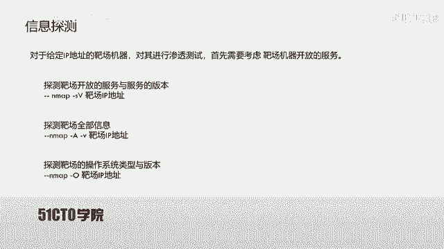
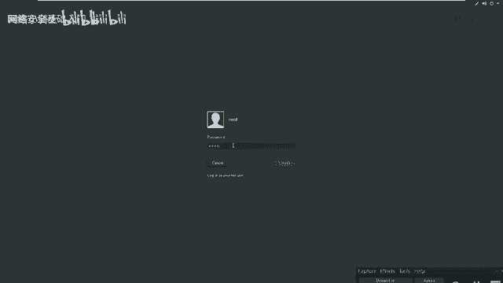
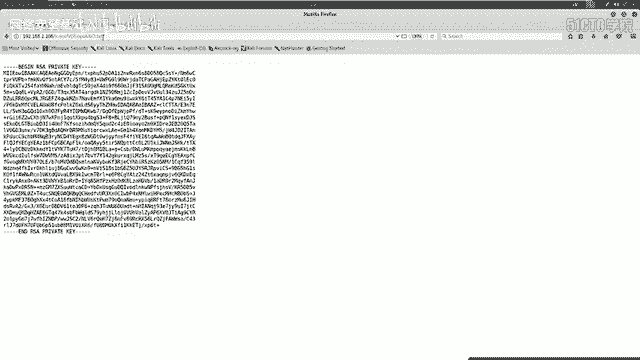
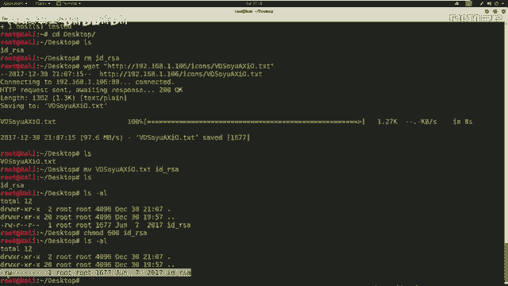
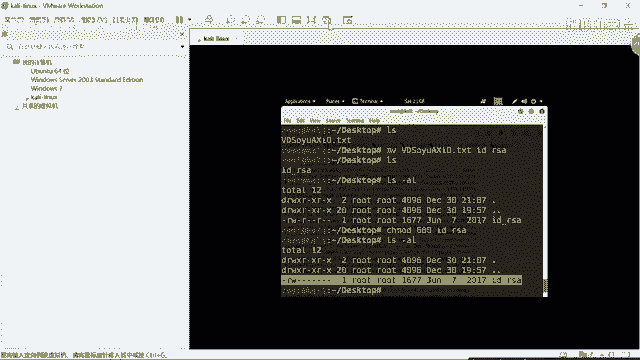
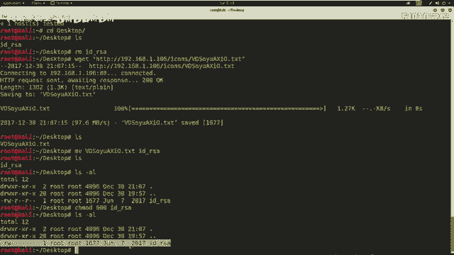
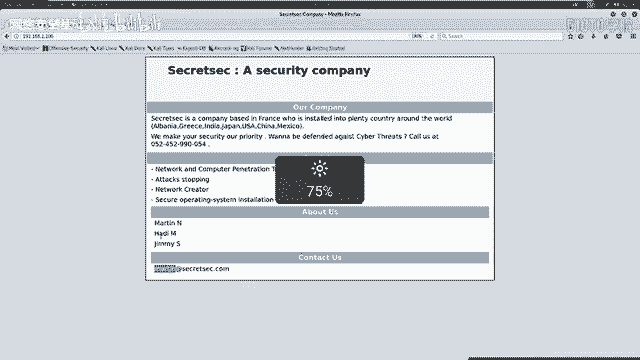
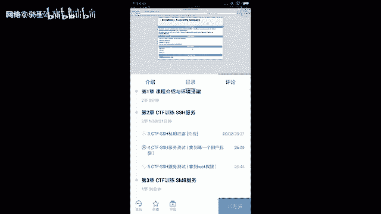
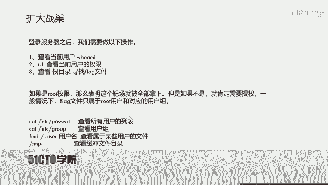

# CTF入门课程：9：SSH服务渗透

## 概述
在本节课中，我们将学习针对SSH服务的渗透测试方法。目标是掌握如何从外部主机进入靶场机器，最终获得root权限并取得flag。我们将从介绍SSH协议开始，逐步深入到信息收集、弱点分析和利用的完整流程。

## SSH协议介绍
上一节我们概述了课程目标，本节中我们来看看SSH协议本身。

SSH是Secure Shell的缩写，由IETF的网络小组制定。其目标是在应用层基础上建立安全协议。目前，SSH广泛运用于远程登录操作，提供安全性的协议。

这个安全性是因为SSH协议对用户名、密码以及发送到远程服务器的信息都进行了加密。因此在一定程度上避免了信息泄露问题。SSH协议最初是Linux上的一个程序，后来因为功能强大，又被移植到其他平台。在Windows以及各种Linux发行版上，都具有运行SSH的支持。

SSH服务基于**TCP 22端口**。

## SSH认证机制
以上我们介绍了SSH协议，本节中我们来了解它的两种主要认证机制。

### 基于口令的安全验证
只要你知道自己的账户和对应密码，就可以使用SSH客户端登录到开放SSH服务的远程主机。在这个过程中，你所发送的用户名、密码以及所有数据都是被加密的。因此从一定程度上避免了中间人攻击嗅探你的凭据。然而，这种验证机制并不能防止服务器被冒充的中间人攻击。

### 基于密钥的安全验证
这种验证方式需要依靠密钥。首先你需要自己创建一对密钥，并且把公钥放在你需要访问的服务器上。登录时，客户端使用私钥与服务器上的公钥进行匹配验证。如果匹配成功则登录，否则失败。

在CTF比赛中，私钥文件常命名为 **`id_rsa`**，公钥文件常命名为 **`id_rsa.pub`**。这也是常用密钥生成工具的默认命名规则。





## SSH认证机制的安全弱点
以上我们已经对SSH协议认证机制有了初步认识。下面我们来看看这两种认证机制具有哪些安全弱点。

### 基于口令验证的弱点
基于口令和密码的安全验证，无法避免暴力破解攻击。如果用户名存在弱口令，攻击者可以通过安全工具快速破解密码，然后通过SSH客户端连接服务器。通过此方式获取的服务器权限不一定是root权限，可能需要进一步提权。

### 基于密钥验证的弱点
我们需要通过对主机进行大量信息收集。如果可以获取到泄露的用户名和该用户名对应的私钥，就可以使用该用户名和私钥进行远程登录。这个过程可能不需要用户的密码。

利用过程如下：
1.  首先需要修改私钥文件的权限为可读写，使用 **`chmod 600`** 命令。
2.  之后使用SSH客户端软件，带上参数 **`-i`** 指定私钥文件进行登录。命令格式为：
    ```bash
    ssh -i [私钥文件] [用户名]@[主机地址]
    ```
通过此方式登录服务器获得的权限也不一定是root权限，如果不是，则可能需要进一步提升权限。

## 实验环境与信息探测
下面我们来介绍一下本次CTF的实验环境，并开始第一步：信息探测。

*   **攻击机**：Kali Linux， IP地址为 `192.168.1.105`。
*   **靶机**：Linux机器， IP地址为 `192.168.1.106`。

我们的目标是获取靶机上的flag并提升到root权限。所有操作都应围绕这个目的展开。

对于给定IP地址的靶机进行渗透，首先要考虑靶机开放的服务。我们使用Nmap进行信息探测。

以下是常用的Nmap扫描命令：
*   探测开放的服务及版本：**`nmap -sV [靶机IP]`**
*   探测靶机的全面信息：**`nmap -A -v [靶机IP]`**
*   探测操作系统类型及版本：**`nmap -O [靶机IP]`**

通过对靶机 `192.168.1.106` 的扫描，我们发现了以下关键信息：
*   开放了 **22端口**，运行SSH服务（协议版本1.2.0）。
*   开放了 **80端口**，运行HTTP服务（Apache 2.4.10）。
*   开放了111端口等其他服务。

## 信息分析与弱点挖掘
上一节我们对靶场进行了服务探测，接下来需要对收集到的信息进行分析，找出其中可能存在的敏感信息和安全弱点。

对于开放SSH服务（22端口）的靶机，可以考虑两点：
1.  是否可以通过暴力破解获得用户名和密码，从而直接登录。
2.  服务器是否存在私钥泄露。如果存在，则需考虑私钥是否被密码加密。若加密，则需先破解密码。同时，还需要找到对应私钥的用户名。

对于开放HTTP服务（80端口）的靶机，可以考虑以下两点：
1.  通过浏览器访问服务，获取内部展示的信息（如潜在的用户名）。
2.  使用目录探测工具，扫描可能存在的敏感文件或目录。

另外，需要注意大于1024的特殊端口，它们可能由用户自定义，例如8080端口，可能开放着HTTP服务。

接下来，我们对扫描结果进行深入挖掘。

### Web信息挖掘
使用浏览器访问靶机的HTTP服务（`http://192.168.1.106`）。在页面中，我们发现了一个公司介绍页面，其中包含“About Us”部分，列出了几个人名：`martin`、`jen`、`jim`。这些很可能就是系统上的用户名，特别是`martin`，可能是SSH服务的用户名。



### 目录探测与敏感文件发现
我们使用`dirb`工具扫描Web目录，寻找敏感文件。
```bash
dirb http://192.168.1.106
```
在扫描结果中，我们发现了一个名称奇特的文件。访问该文件，其内容包含“RSA PRIVATE KEY”，这正是SSH的私钥信息。我们成功挖掘到了SSH私钥。

此外，也可以使用`nikto`扫描器挖掘敏感信息。
```bash
nikto -host 192.168.1.106
```
`nikto`会扫描诸如`config`配置文件等可能包含敏感信息的文件。虽然本次靶场没有直接发现config文件，但在其他场景中值得关注。





## 利用私钥进行渗透
在挖掘到敏感信息（SSH私钥）之后，我们就可以利用它来渗透靶场。







### 利用步骤
1.  **下载并重命名私钥文件**：
    ```bash
    wget http://192.168.1.106/[路径]/[奇怪文件名] -O id_rsa
    ```
2.  **修改私钥文件权限**：
    ```bash
    chmod 600 id_rsa
    ```
3.  **使用私钥登录**：
    ```bash
    ssh -i id_rsa martin@192.168.1.106
    ```
    *注意：此命令假设我们通过Web信息收集确定用户名为`martin`。如果私钥有密码保护，则需要先使用`ssh2john`等工具转换格式并用`john`破解密码。*

### 登录后操作
成功登录后，我们获得了`martin`用户的权限。首先需要评估当前权限：
*   使用 **`id`** 命令查看当前用户权限，确认是否为root。
*   切换到根目录 **`cd /`** ，查看是否存在flag文件。
*   使用 **`ls -la /home`** 查看系统存在哪些用户，与之前收集的信息交叉验证。

执行`id`命令后，我们发现当前用户`martin`只是普通用户，并非root。这意味着我们成功进入了系统，但尚未完全控制靶机，需要进一步**提权**才能读取通常只属于root用户的flag文件。

## 总结
本节课我们一起学习了SSH服务渗透的基础知识。我们从SSH协议及其两种认证机制（口令和密钥）讲起，分析了它们各自的安全弱点。然后，我们搭建了实验环境，并演示了从信息收集（使用Nmap、浏览器、dirb、nikto）到发现敏感信息（Web页面中的用户名、泄露的SSH私钥），再到利用私钥登录靶机的完整流程。最后，我们成功以普通用户身份登录系统，为下一节课的提权操作奠定了基础。



下节课我们将介绍如何提升权限。