# CTF最强战队-蓝莲花内部培训教程，CTF入门课程及历年真题，全100集持续更新！ - P25：25.命令注入2 - 网络安全基础入门 - BV1vV411T7jY

工去上节课的学习。上节课呢哎我们成功的哎执行了对应的ID。然后在呃页面当中返回了我们当前用户的用户名为3W点。杠date这样一个用户，并且属于呃3W杠date这样一个用户组。

当然哎我们在搜索哎上节课这个漏洞的时候，是使用了 searchpo哎这样一个工具。其实呢哎我们还可以使用对应的网站来进行搜索。下面哎我们看一下哎，我们在网站当中搜索到的内容。这是我们的网站的链接。哎。

之后我们向下看会看到哎这些内容。这些内容呢实际上是和咱们这个。searchpo I搜索到的内容是一样的。哎，也希望哎大家以后哎能够经常使用这个网站，哎，搜索一些哎这个可以利用的哎这个漏洞。

咱们现在哎已经成功的哎知道了如何利用漏洞。下面哎我们就利用这个漏洞来获取靶场机器的哎这个访问权。首先呢哎这里啊因为我机器的原因，哎，我们把靶场地址调整为呃一。啊，这里是还是咱们6哎。

这是咱们公积金的地址。咱们把厂地址改为1。107。咱们再进行哎这个获取靶场权限的时候，哎，用到了一种方法，就是反弹向。让靶厂机器下载到哎我们的shall命shall命令，然后执行我们的shall命令。

反弹给哎我们它的控制权之后，哎，我们进行提升权限，哎，最终取得对应的flag值。在进行这样一个过程之前，首先我们需要准备事项。第一步呢哎是要启动mattterpo监听。

在某个固定端口哎监听反弹回来的hell。下面啊我们就在公积机当中来进行操作。首先打开mattterpo。使用MSFcon到这样一条命令。mattter bullet哎是一个哎集成语渗透测试啊。

几乎所有工具的这样一个安全框架。通过它可以完成渗透测试工作当中所有的哎几乎所有的。任务哎并且哎非常具有系统性，它也是哎漏洞挖掘的一款利器。我们可以通过它来挖掘我们想要探知的某些服务的漏洞。呃。

看我们现在打开了这样一个程序。首先哎使用use exploitpo mat handle，回车set payload，我们用linux。linux s86，然后mattter spot。哎。

咱们因为哎这里有些延迟，哎，咱们需要稍微等一下，然后接下来rewardse。revos杠TCP。🤧回车。呃， set payload，然后linux叉86。啊是这样。rebo TCP啊。

咱们这里应该是直接哎给它输下划线回撤。S the payload。呃，这里啊咱们把它复制过。哎，然后pa回撤。这时候哎咱们设置了mettropolite加这个反弹的这个TCP。的是payload的。

咱们下面啊查看一下对应的参数。在这里哎咱们需要哎设计咱们当前的IP地址。咱们这个笑哎所反弹过回来的这个IP地址。168。1点哎，我们查看一下哎，本机的IP地址IF confi是1。106。哎。

咱们在这里设置1。106回撤。哎，咱们设置完之后，哎，继续查看一下是否设置成功。之后哎咱们选择呃ispo开始监听。这时候咱们攻击者的这个机器唉设置就完成了。但是哎咱们忽然发现咱们设置完这个之后，哎。

并没有哎一个出现真正的一个sll。那么咱们这时候哎就需要执行下一步操作，就是生成一个sll。这里咱们使用到MSV norm这样一个工具杠P哎，代表它对应的平台。

之后呢哎是它对应的这个反弹的这个地址以及它的端口，这里的地址和端口和咱们启动监听的地址和端口是一一对应的之后哎设计文件的哎这个格式ELF哎，然后把它重新定向到这个阿帕奇哎的这样一个。🤧根目录下。

下面咱们操作。

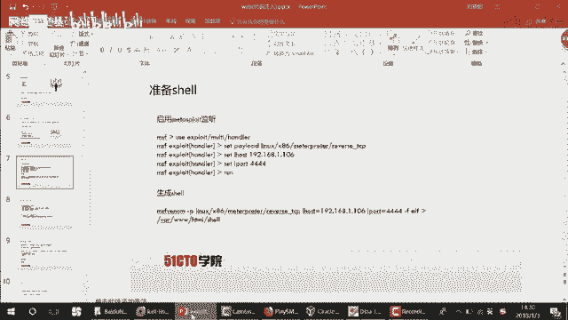

打开一个终端。MSF然后tab，然后vieno杠P。接下来是linux。S86。买车。Pre pretty。呃，接下来是。咱们reverse。港TCP。🤧嗯。接下来哎是low host。等于192。

168。1。106啊，接下来low port。等于444。接下来呃是杠F。LEF。LFE，然后重新定向到。把它定向到哎阿帕奇的根目录像。呃，shall文件。

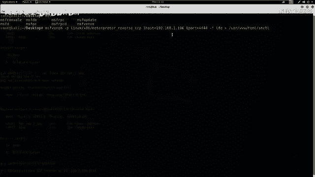

咱们看一下这条命令是否写对了。revo TCPlow host lowportEFELF哎正确。

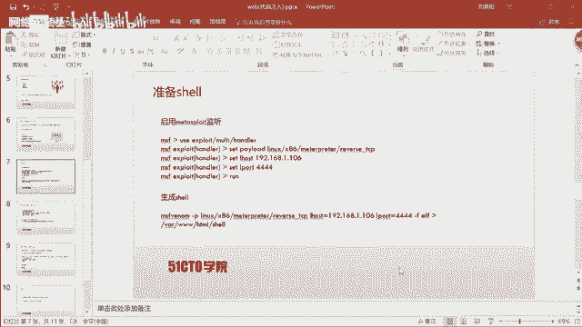

ELF。哎，这个是正确的啊回撤。这时候哎咱们这个工具会在咱们这个阿帕奇的根目录下哎生成一个hell哎这样一个文件。LEF。

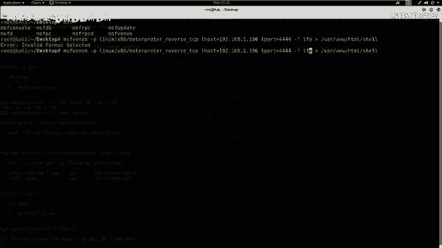

嗯，咱们看一下哎，这里出错了。

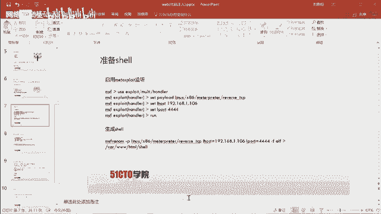

ELF2。ELF复回车。哎，这时候哎咱们这个。过程还是比较缓慢的。哎，咱们查看一下啊，这个根录下是否有这样一个 shell。呃，然后是目录。回撤哎，咱们可以看到下哎是在这里哎给生成了，哎。

并且哎赋予了一些权限。

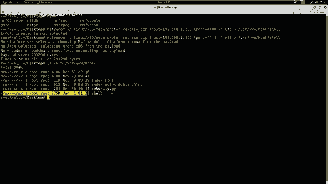

哎，咱们也可以哎，不用这个项，哎，咱们给它生成一个。S。这样一个文件回车。哎，这时候哎咱们查看一下对应的这个目录像。是否有个S，哎，这时候哎有咱们这个S。咱们接下来哎就把这个S哎要给它。

发送到哎这个客户端。也就是咱们靶场机器。咱们现在哎并没有哎任何直接的方式，可以直接把这个。呃，文件发送到靶场机器。咱们只能通过哎这个靶场机器来下载咱们这个文件，哎，然后来执行给咱们反弹一个seel。

那么咱们这里啊用到阿帕奇哎这服务器，让远程的靶厂机器执行下载哎这个S的这条命令。之后哎在靶场机器上修改S对应的权限，哎，然后执行获得对应的这个反弹项。咱们下面哎要启动一下阿帕奇。

service啊帕奇 to哎star不去。这时候哎咱们启动了阿帕奇，也可以查看一下咱们是否启动了阿帕奇。哎。STO。Start studios。回车哎，这时候可以看到他阿帕奇是启动来。

那么咱们接下来啊就需要哎给这个客户端来上传。哎，也就是让客户端就是咱们这个靶场机器下载咱们公积机卡利上啊，这个sell啊之后执行。咱们这个靶场机器上是开着防火墙的，咱们需要绕过防火墙。

并且在以后的哎大家做CTF哎以及日常工作渗透测试的时候，哎，一定要注意使用哎这个绕过防火墙的方式。希望大家在无论以后任何场合哎，都要考虑到使用Base64来绕过这个防火墙的检测机制。

咱们这里哎首先用到哎这个一条命令web get，也就we get，也就下载命令。然后哎下载靶场的hell，把这个hell重新定向到哎一个tamptamp，哎就相当于任何用户哎都有这样一个权限。

它是哎临时缓存的这样一个目录，给它定向到hell哎这样一个目文件当中。那么咱们这时候哎，如果在靶场机器执行这样一条命令，咱靶场机器上的这个tamp目录哎，就具有了这个咱们公积机的这个sell。

并且它的命名也是sell。咱们为了啊绕过防火墙，所以说哎把这条命令进行了贝斯64加密。下面哎咱们操作一下。

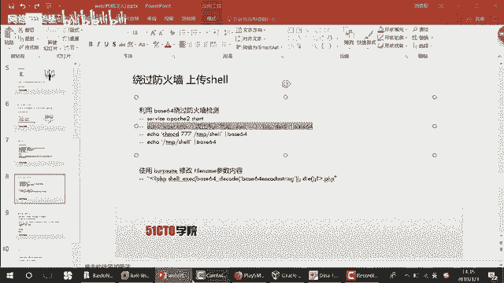

首先，eal。HTTP哎，首先是get HTTP。192。168。1点。106，然后是S哎，咱们下载的S。杠O把它重新定向到tempth。杠呃，然后咱们给它重启名字吧，叫A哎，然后。

对它哎进行加密face64回撤。那，咱们对它进行加密。咱们哎通过执行这条命令会发现。这个在靶场机器，太阳下有了A。那么咱们有了A哎，下载之后，这个A的权限是最低的。

那么咱们这时候哎就是需要使用到下一条命令，对这个下载的哎这条项哎给它赋值。

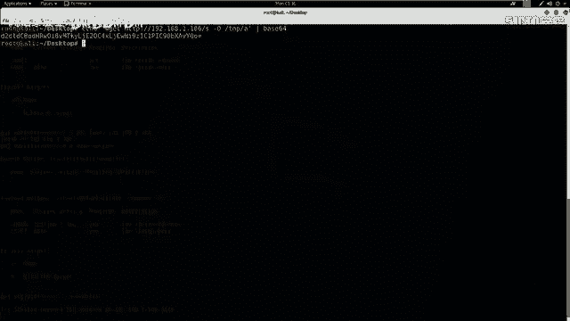

赋予哎特别大的权限，这里啊咱赋值给无线权限，也就是777哎，最大的权限。

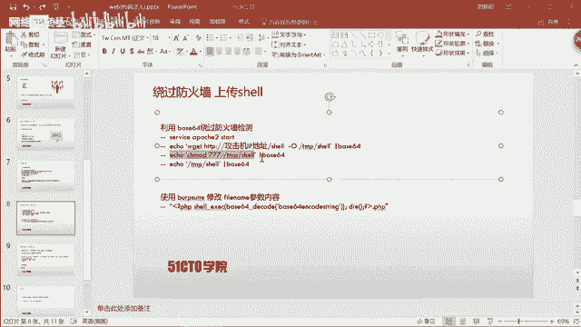

并且哎把它进行贝斯64加密。呃，咱们在卡里操作依靠。但是。干杯斯。Base。64。下载下载完之后，还是需要对它进行复制权限。沉mot777杠t杠A。然后咱们回撤，这时候咱们这个如果执行了这条命令，哎。

那么这个A就具有777权限，就具有执行的权限。

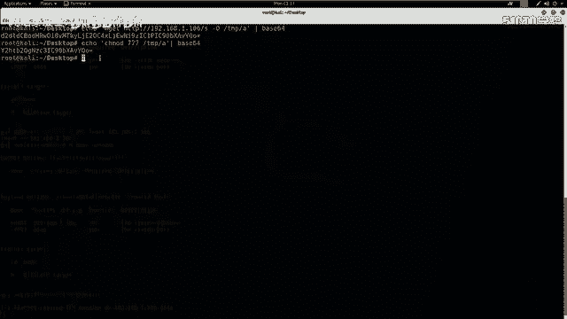

执行权限之后，哎，并不意味哎我们已经执行成功。这时候我们还需要哎使用对应的命令来执行。

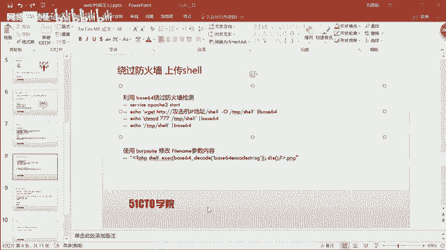

🤧这个笑。咱们这里来使用到。杠t杠10哎A，那么执行了这条线，哎，并把它进行base64加密回撤。这时候哎咱们如果在服务器上哎执行这样一条命令，啊，那么就获得了反弹效。

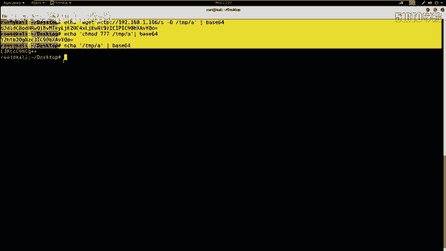

那么咱们这时候哎就利用咱们之前的哎这个安全弱点，也就是这个漏洞。来对哎这个fill name啊参数进行修改，最终获取哎对应的shall，也就是把咱们之前加密的三条命令哎进行执行。靶场执行完之后就会反弹。

metalpo需要。下面哎咱们在这个攻击机上来进行测试。首先呢啊咱们需要打开book stripped。呃，设置呃结账代理这里。Process。然后是network。Close nest。Start。

接下来是。At want。

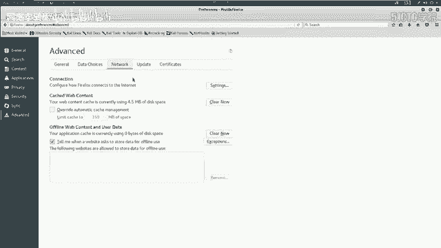

网络网络里咱们设置对应的这个HTTP代理。

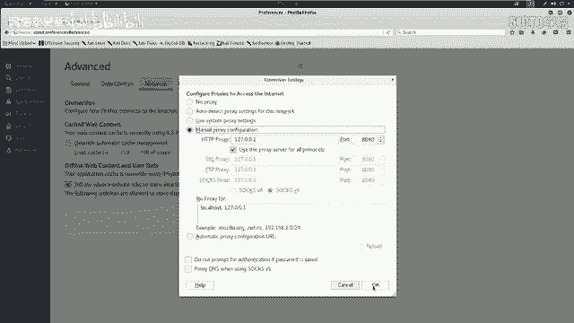

Okay。process啊，咱们已经开始截断。在这里哎，咱们把这个OK选上。选择一个文件，这里哎咱们选择一。Upload。这时候咱们bb stripped哎就会收到哎截货这样一段。文件上传的代码。

咱们把它哎发送到repeat。哎，咱们开始对包进行修改。这里哎首先咱们要执行第一条命令。使用到哎函数system。对。因为哎咱们命令是使用贝ase斯64加密的，咱们就把它哎进行贝ase64解密。

64杠D。Cold。呃，之后是双引号，哎，咱们把那条命令拷贝出来。

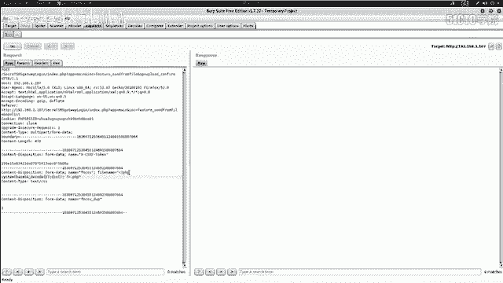

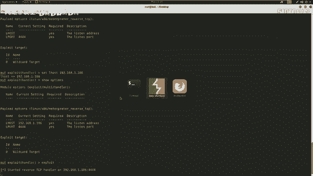

最。咱们把这条命令哎给它拷贝出来。

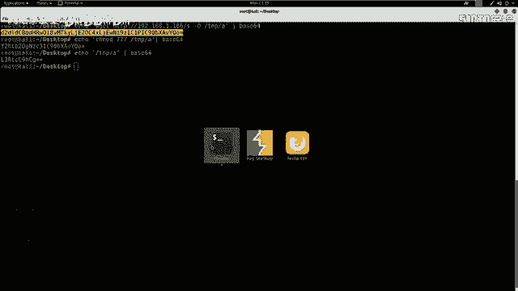

这里。走啲。conttrol位哎，拷贝出来。Fll name， PhP system。With Liu's deco。然后是两个引号，然后带，然后PHPI go。哎。

这时候哎咱们成功的把这条命令哎发送给服务器，服务器哎，并且并没有返回任何结果啊，因为咱们这条命令只是执行，哎，并不会返回任何结果。咱们执行完哎这条命令之后，哎，是需要重新截获对应的数据报。

stop啊咱们开始截获下一条数据包。哎，咱们先把这个关掉。哎，这里哎咱们继续发送下一个数据包选择。第二个哎，这里我因为方便操作，给大家建了三个文件。为了让大家可以清楚的看到。呃，咱们开始来发送。

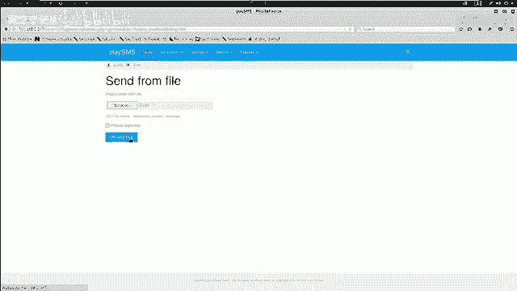

发送之后，哎，咱们首先要拷贝一下啊这条命令。可别出来。

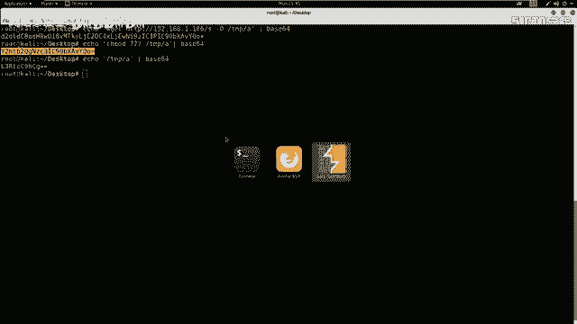

之后哎，咱们fo一下。呃，这里是咱们上传第二个文件的啊这样一个数据包，把它发送到repeat。repeat之后，啊，咱们修改哎这个fill name这个参数的值。固定的格式。点PHP。

之后哎是system。大系。呃，接下来使用B64。刚抵code。解密啊，然后把咱们刚才代码复制进来。这时候哎就是咱们要执行的下一条命令来，点击go。哎，这时候咱们这条命令哎也就执行成功。通过这两条命令。

哎，咱们现在服务器上啊已经哎具有了这个A的哎这个文件。咱们下面哎就需要执行这条文件。

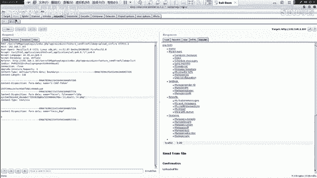

咱们继续哎把这个。呃，阶段关掉。

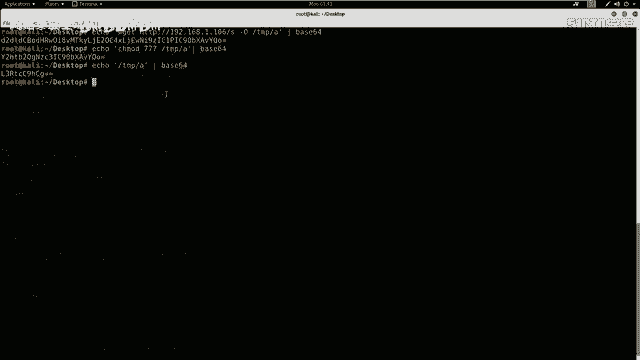

哎，怎么关掉哎，然后继续上传第三条命令。

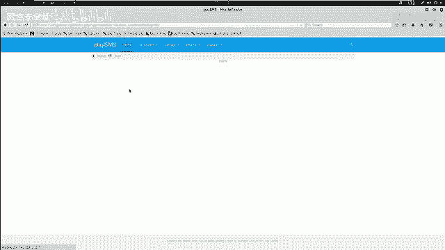

呃，这里我们选择3select。呃，之后哎把截段哎开启。

阶段开启之后，哎，咱们开始点击上传。呃，回到结论当中forward这时候哎这是咱们上传第三个文件，也就要执行第三条。命令的哎这样一个数据包。继续发送到repeater。接下来哎继续固定的格式。PHP哎。

然后问号点PHP。接下来是C侧，执行一条命令大。接下来啊是B斯64来进行解密。呃，是咱们对应的命令啊，要执行。tamp A啊这样一个命令。

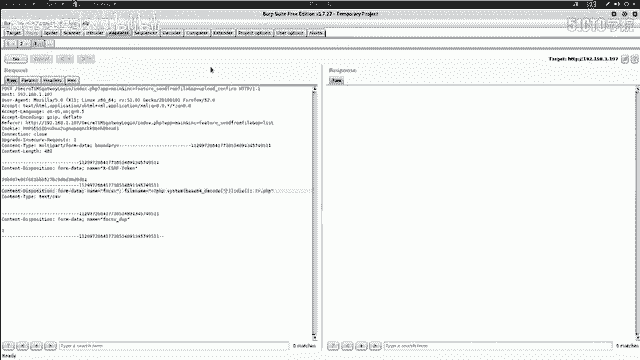

咱们开始哎执行。

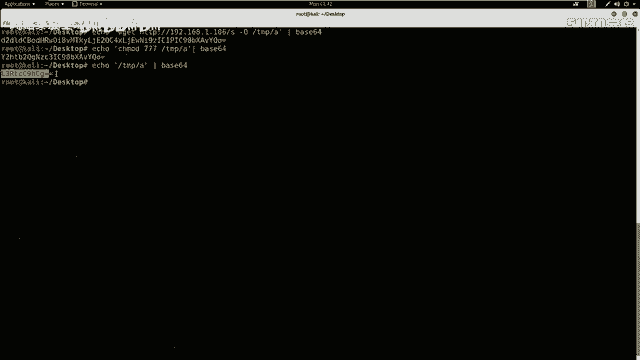

刮边，然后把它。复制金来。调杯之后来进行执行。哎，咱们这时候哎给夫妻哎发送这样一条命令。

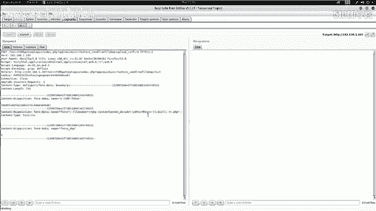

啊，咱们服务器现在正在接受这条命令，啊，咱们看一下反弹的 shellll，哎，会发现咱们现在啊这个之前啊监听的啊这个matalpo哎，返回来一个 shellll。

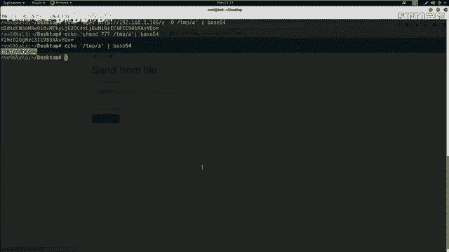

咱们syst cease in一下，看一下我们当前这个系统的版本信息，哎，这是咱们靶场机器的IP地址，以及它的操作系统，以及它的系统架构，哎，以及它的这个反弹的 shellll哎的这个版本信息。

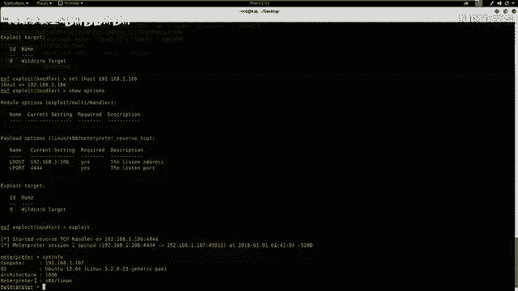

咱们现在哎已经完成了哎这个sell的反弹。那么接下来哎咱们就需要哎这个提升对应的权限。并且查看哎这个是否是root权限。如果是Iroot权限，那么咱们就不需要哎再提升权限了。

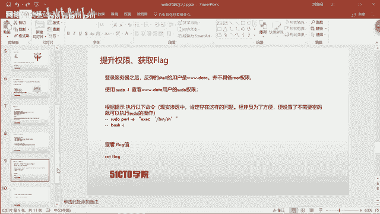

因为咱们之前还是看的ID命令，它是一个3Wd啊这样一个权限，不具备哎这个root权限。那么咱们哎也来执行一下，继续查看一下。首先使用个sll命令。ID回撤，这时候发现哎我们并不是root权限。

并且哎我们看一下我们SU do哎具有哪些SU do的命令。也就是以超级管理员运行这样一条命令。咱们可以看到啊，这里我们有一个呃3Wd啊，这样一个用户名还，可以不使用密码来运行。EXE并票哎这样一个。

程序哎的一个权限。

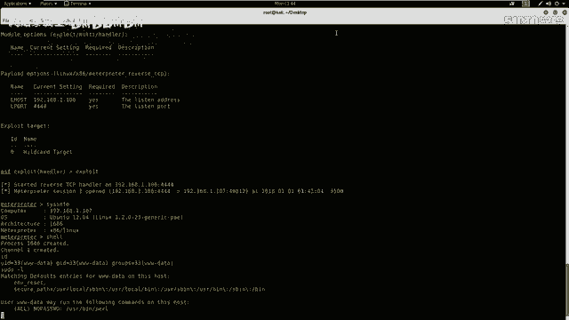

那么咱们就利用哎这一点来提升一下对应的权限。

首先哎使用SU度哎调用Pll哎之后哎选择使用杠E哎执行，然后ESEC哎，然后哎执行base哎，然后使用base杠I执行对应的这个交互模式的base。下面我们执行一下这条命令。首先要输入SU do。

然后是PERL。接下来啊是。双引号。ESEC。啊，这里我们写错了，S you do。Pill。应该是杠1。然后双引号ESEC。BSH啊，然后接下来是双引号回撤。base杠A回撤。

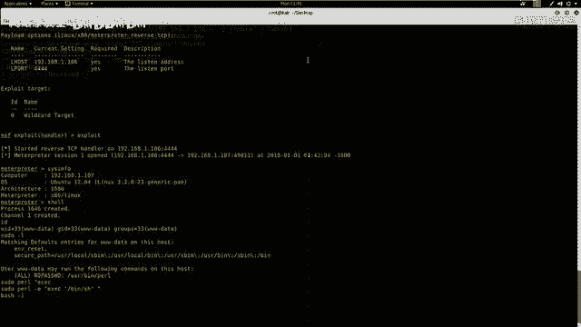

我们来参看一下这条命。

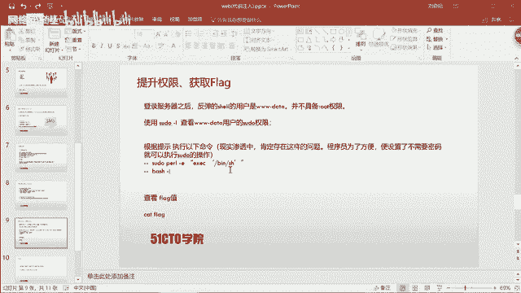

哎，这条命令是没有问题。哎，咱们因为哎已经执行了一次，哎，所以说。呃，我们继续呃重新来执行一下sll。然后ID啊，然后咱们执行一下刚才SU doPERL。杠E双引号ESEC。单一号。杠并。呃。

咱们看一下是不是。SH哦，对SH。SH。啊，这里又执行错了啊，咱们继续关掉。嗯，需。接下来哎SU doPERL接下来是杠E。双引号ESEC。单引号杠。并杠SH。单引号双引号回撤。这时候哎咱们。

执行了这样一条命令之后，哎，使用BASH杠I回撤。哎，这时候反弹回了哎这个root权限，咱们可以看到哎这里。井号哎就代表root权限。哎，咱们具有了反弹root权限的哎这样一个项。在反弹完sell之后。

哎，咱们下面还就需要进入最后一步，也就是获取fag值。我们也知道哎，这个flash值主要是存放在根目录下，咱们直接切换到root目录下。回车LS啊查看跟目录会发现flag点TST。

那么咱们这时候是用cat来查看一下flag点TST回车，咱们会发现啊fl值在这里，那么咱们这时候哎就已经拿下了哎这个整个靶场，并且获取了对应的flag值。

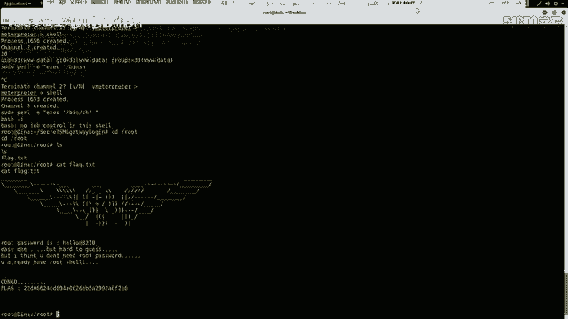

那么在课程的最后，哎，咱们需要哎总结一下今天的课程内容。首先哎这里给大家说明，就是咱们在信息收集的时候，哎，一定要充分收集信息，并且根据题目哎当中收集的信息的具体情况来逐步哎进行渗透测试。

来对靶机哎进行对应的操作。尤其哎是对于web系统来说，大家以后一定要注意，哎，我们如果可以立即用现成的E叉P。来对靶场进行渗透，大家就不需要哎挖掘一些零地漏洞。哎，这样一个情况。

所以说哎这两点大家一定要掌握。那么咱们哎今天的课程哎就到这里，哎，再见。

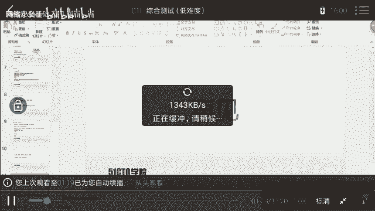

什么。把这个1点PHP哎给它重命名。命名称。Shell点GPG。G小一点GPG。