# CTF最强战队-蓝莲花内部培训教程，CTF入门课程及历年真题，全100集持续更新！ - P5：5.CTF培训-杂项的基本解题思路上半部分 - 网络安全基础入门 - BV1vV411T7jY

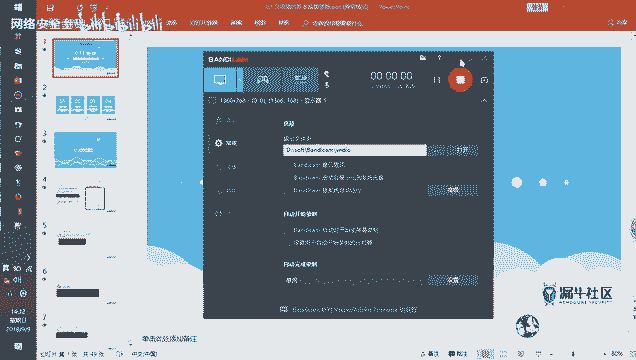

我们下午给大家讲这个杂酱题的一个基本解题思路。那这里面的话也是属于CTF解屏模块的一个题型啊，叫做。这个杂项题目。那我们CTF解题里面，其实它分了五大题型。第一个是web。

也就你们早上看到的这一个这个名单奖的这个web的题型。那第二个是这个杂项，第三个是属于这个密码学。那第四第五，一般我们属于临时培训是培训不来的，就是第一个叫做逆向逆向工程。那最后一个是叫做判。

也就是叫做破解。那也就说只后两个，其实上它是属于你短期内是没办法能够培训得来的那能够培训的就是我们前三个部分web。然后杂项还有密码学。那这三个基本的也是我们拿题的拿分数的一个关键点。

因为大部分选手你去参加比赛，大部分人也都不会逆下，也都不会这个怕。但我们说没有人不会肯定是有人会的，也有可能肯定是有这个大神在，那我们作为一个入门级的一个培训啊。所以我们的一个原则是什么呢？

我们能拿我们能拿到了分数，能做的题，我们尽量去拿和去做。那我这边讲的是这个砸象体。砸象体的话有一句话是这么说的，叫做。有句话这么说的啊，叫杂项和密码学是不分家的嘛。

那很多时候也提它不是单一的一个考察你单一的一个点。它很多时候都是一个组合的。你们刚刚做的这种小游戏啊，它很多时候考察了就是很简单的一个点。那有些题目它有点难，难到难到什么程度呢？就是说你可能既要砸项。

要引起要分析，要密码学要we好几个题型它杂在一起，你快去考。比如一道题你可能要过关斩六降，然后最终才能拿到那个fag，所以说难题是这么来的，就是说呃它可能考察的点非常的多。

那这是一个另外一个是说他考这个点，它考的不是说你没有积累，它考是你一个快速学习的能力。比如说我就是一个最全新的一个知识点。那这个点可能就是可能就是近一两年才提出来的一个知识。那你要在最短的时间内。

因为参加参加比赛人，可能大家都不知道，但你可能要这最短的时间内去把这个东西学会，然后去应用，这种这种是属。难题的第二个。那第三个就是属于那种劳洞非常大的。就是你你想方而子。

然后你也想不到他这个考点到底出在哪里了。啊，这种题让。实际意义上是并不是很大的。就是说如果你遇到这种题也不用气馁。因为它纯粹有些题就是为了出题而出题的，就是它那个flag格知，你可能已经得拿到flag。

但你可能因为一个格式的问题啊，你始终提交提交不对，这是有可能的那这种题的话就属于这种劳动题。那我今天讲的这个杂下午讲的这个杂项是属于这种稍微比较简单一点的一种题型哦。那么但是它要杂项，它虽然很简单。

它要杂项，杂项意思就是它很庞杂，那庞杂到什么样程度呢？每一种题每种点它可能有好几十种的一个方式。那这里面我们为什么说它简单呢？它简单在于你如果只要能够掌握基本的工具的使用。就可以了，但是它又很难。

为什么呢？因为工具实在太多了，有几十种二十几种工具能明白吗？你可能可能你要用到好几好几好几十种工具，然后用到各种脚本，这个脚准还不一定是一种语言写的，好几种语言去写的。所以它简单在于你只要会工具就行了。

但是它难在于它太多了，它太杂了。那我这里面的话分成四个部分。这个部分。那今天下午的话可能就讲这个一二两个部分，然后我们再找一个时间，我们把三四部分讲完，明白吗？这四个部分。那这四个部分的话。

呃难度上来讲的话是从一个。简单的到一个难的一个过程。也就越到后面可能它的它它的深深度可能会更高一点，然后前面可能更简单一点。那第一部分叫做文件操作引写啊。

也就是说你们刚刚做的那个看到有很多人做这个国旗啊，这国旗，然后你们是怎么做的呢？你们把这个国旗这个图片下载下来，然后用一个记事本把它打开。这种属于什么呢？动属于引写。你在引写数。

那他把这个答案或者是我们叫flag或者叫做K我们把这个这串这串纸把隐藏在这个图片里面，我们叫做引写数。那么最简单的引写数就是对文件去操作的。我这边说的文件是指通用性的文件就是所有文件。

比如说wordPPDFPPT等等的，就只要是一个文件的，我不具体指它是哪一个文件，我不指它是一张图片，如果说我说图片引写的话，我可能会考虑到它是不是PN它是JP它是不是GF它是不是动图。

但是如果我说文件的时候，我应该说的是一个通用性的。那么最简单的就是通用性的一个引写。最难的。然后调难点呢，等到第二部分就是我们这一个图片的一个引写。你想图片有多少种。

你们知道的你们知道的这个图片的格式有多少种。BNPJPGPNPPNG然后JPGJJF等等的那各种的图片，它只实际上一张图片的话，它的它的隐藏点是非常的多的，大到可能我一个图片，我可能我把这个图片。

因为头一张标准的图片，它是有头部，然后中间的内容和尾部的，我甚至可以把值藏在头部的某一个地方，我甚至你们如果你们有用这个美图秀息或者是PS的话，你们知道你们处理各种图片的时候，你们会各种渲染啊，对吧？

那后各种图片通道啊，那么很多时候这个它这个值也可能去藏在这个图片里面。那么这个属于图片引写数，那再往下呢这张我图片引写术这边只讲要图片，后面可能还会扩展两个。第一个是这个NP3NP4。

就是音频和视频的一个引写。就有时候我会把这个隐藏的值引写到音频里面，那如果是音频的话，我不知道大家有没有是通信工程的。就是有处理这种频谱图的啊啊频率图的啊，就很多时候一个频谱嘛。

它可能就是一串0101嘛。那有时候信息就是就是你可以把一个文件隐藏在这个频谱里面嘛，就属于音频频音频的一个音写或者是视频的音写。那另外一个第三部分是这个压缩文件。

就很多时候因为杂项题它是基本上就会给你一个文件，或者是给你几个文件。所以他不像为我提，可能给你一个地址。那咋样提交就给你一个文件。这个文件要么就是你看不出来它是什么文件，要么就是张图片。

要么就是一个压缩包。那么最常见的就是你拿到一个题目，这个题目下载下来是一个压缩包。那这时候压缩包拿到手了，这时候你有好几种考察方式。比如说它是不是加密的。它是真的加密还是假的加密。

怎么下真的加密还假加密啊，真的加密就是它真的是加密过有密码的，你要去破解密码。假的加密是叫做伪加密，它可能修改了这个文件的某一个字段，把这个字段改完之后，它也变成了加密状态，这叫伪加密。那再样往下呢。

它可能会有这个压缩包，我这个损坏掉了。我压缩包损坏掉。那我要去修复我要去修复这个压缩包，那我要知道这个压缩包的格式，我才能去修复它，就是压缩文件。第四个是取证技术，取证技术。实上它涉及的东能更多。

我这边只讲一个，一一个已经可以讲很多，就叫流量取证。因网我们不知道有没有学网络的，就是说网络流量，抓到一个包之后，这个网流量包里面实际上是隐藏了很多的这种信息的。包括我们数据通信中，你像所有的数据。

网络端所有数据都是通过流量来走的。所以流量就是代表了所有的数据。所以。分区流量也是一种这个杂项的一个考点。那再深层式一点呢，我这边还PPT上还没有列出来，在深层地，比如说磁盘取证内存取证。能明白吗？

就磁盘内存级别的这种取证。那这里面的话可能因为我们培训时间比较短，那磁盘和内存呢我们没有涉及，我这边涉及1234这4种。那这四种的话呃，你们听认真的听我讲，应该是能够有所收获的。

那我先看一下这个第一种第一种第一种也就是因为我是从简单到这个困难的来做一个讲解的那第开始这个文件操作与明显。也就是说其实你一开始拿到的是一张图片或者是一张一个传作包，不管是怎样子，反正它是一个文件。

那有时候他他就是给你一个文件嘛，让你去下载。有时候他是。有时候他给你了一个文件，但你还不知道他考点是在文件。比如说还是以那道国旗为例啊，因为你们做的比较多嘛，我看你们做的比较多。就是很多人说。

因为他提示说这个flag藏在这个图这个国旗里面，那你们你们其实上是因为没有接触到这个题，说你们可能不知道然，他可能是考的是一个图这个文件的一个影响。那我需要把这个文件把它下载下来，下载这然之后。

我去分析这个文件。那么们第一步让我们要去做文件操作。

那我们授权的话，如果你要对一个文件去做一个操作的话，你总要知道你操作的是一个什么样的一个文件。也就是文件类型，你要知道它是图片还是压缩包，还是流量包，还是word还是excel还是PPT还是PPF对吧？

那有时候比如说我给你一个文件呢，你们怎么你们你们你们怎么知道它是什么样一个类型的文件。比如说我给你一张图片，你怎么知道它是它就是一张图片呢？你们是怎么去判别的？

就是作为我们我们作为一个一个这个高级动物嘛，作为一个人，对不对？我们怎么知道他是一张图片呢？是不是他告诉我们他的后缀名是点JBG，他后缀名是点PNG对吧？他告诉我后缀名是这个，所以我我才知道哦。

原来他是一张图片，如果我不告诉你后缀名呢。😊，就是我给你一个文件，我把后续名删掉了，然后给你呢，你还知道这是一张图片吗？你还知道这是一个这个word或者是PST吗？你不知道，你可能不知道。

但有时候我们电脑很我们电脑很比较高级，它会自动识别出来。但是有时候它识别不出来，就是我们第一步就他给你一个文件的，你要去识别这个文件是什么样一的类型。很多时候它是有区变性的那怎么去识别呢。😊。

我们用一个命令，我这边呢说到的命令或者是说到工具啊，其实它都都是叫做工具。只不过命令只是说这个工具它没有图形化界面而已。所以我说它是个命令，它本身它就是一个工具而已。只是这个工具它是命令行的哎。

然上没有写一个图形化界面出来的那这边有第一个命令啊，你们接下来会接触到各种命令和一个工具。那第一个命令是这个叫做fire命令。那这个fi命令是一个linux下的一个命令，能明白吗？我看你们大部分用电脑。

我我刚刚还没看到一个人是linux的一个系统，应该大部分都是windows。所以说我刚刚在群里说嘛，你们第一个要安一个虚拟机嘛，叫Klinux。所以说这是你们的一个linux的一个环境嘛。

那这个fi命令就是属于这个inux下的一个文件识别的一个命令。那它使用简单吗？其实很简单，你只要输fi，然后加上这个文件，然后它就可以识别出这个文件的一个嗯个类型。那我先我来看一下啊，我这边的话。

我是没有我我打我不我是不打算用这个虚拟机的，但是我先给大家看一下虚拟机是长什么样的吧。就是一台K硬用的是，你们现在我现在确认一下，你们你们有都安上这个虚拟机了，没有是吗？没有是吗？

后面回需要先把这个你们头一件事情是要把这个虚拟机给它安上，不然没有另令个环境。你们反上平可有一半题。对我今天讲了一半。工都用不了，能明白吗？所以说你们回去的话。

第一件事情是把这个开ddylinux给它呃搭起来，拉起来。那这实际上就是一个虚拟机，主要是要安装这个win well。

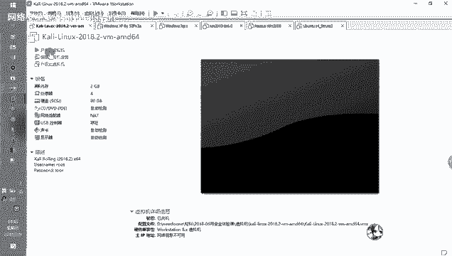

那第一个是把这个打开了，打开完之后，它际上就是一个linux。那我这里面的话，因为我是一个windows10的一个操作系统嘛，所以我安装了一个子系统，就是win10的话，现在是可以安装这个子系统。

所以我在我的win10上安装了一个KDins的一个子系统。所以我我自己本我不借助虚拟机的话，我实际上是既有windows环境，也有indows环境的。然后你们的话如果没有安装子系统的话。

你们就是要借助这一个虚拟机。这个虚景机的话，它的用户名是root，然后密码是root倒过来。叫我啊叫我啊。那打开它是一个虚拟机，但是这台虚拟机的话，它是比较有名的一个安全渗透测试的一个虚拟机啊。

里面集成的。

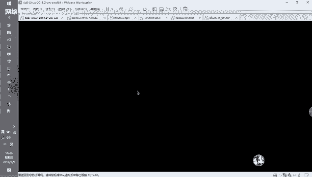

很多工具还有很多几百个吧，就是这里面集成了几百个工具。那我们来看一下这个fi命令。你输来之后，它能如果能体现出来，就专门说它是有这个有这个东西的那我这边的话为了方便我去演示嘛，所以我不使用这个虚拟机。

因为我还要把文件拷到虚拟机里面，然后再来演示嘛，所以会比较麻烦。我这边的话暂时我不用虚拟机。我用的是我仔细统下的lininux环境。那实际上是一样的，也就是命令行。那我讲的时候，我会告诉你。

我现在用的是我现在用的环境是imux的是windows。

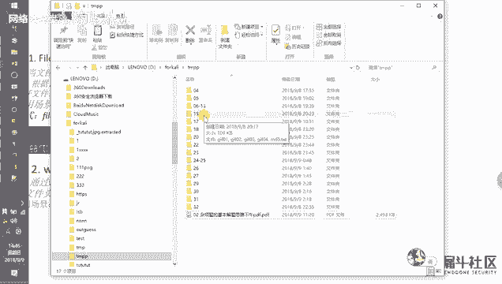

啊，这边的话。

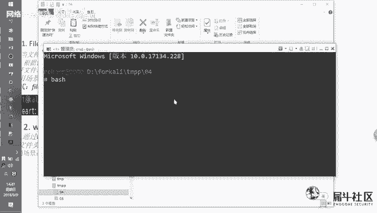

现在样的话，我现在这个这个环境啊就是一个呃limux的一个环境。那现在我是一个呃一个linux。

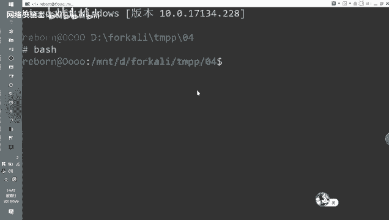

就发了一。那我实际上也是有这个命令的嘛，也是有这个命令嘛。那这里面的话，我在这个文件夹下，我放了三个文件。这三个文件它有一个特点是它都没有这个后缀名。他都没有后置名，但是我名字已经我已经标出来了。

它是一个什么样的文件。就是呃你们可以看一下我这边的。但是他这它这边是有三个文件，这三个文件。但是我电脑都没有识别出来它是什么样的文件，能看出来了吗？我电脑都没有识别出来他们是什么样的一个文件。点比如说。

这第一个第二个第三个三个文件都没有识别。那虽然说我已经给他命名了，可能第一章好像是这个JPG是我因为我为了把它区分开来，我把它命名了。如果我随便改个名字，你们是不是根本就不知道这个是什么文件。

那如果你连这个文件是什么文件都不知道的话，你就连打开它都打开不开了。那接下来可能就没办法去做了。所以第一件事情我们要用这个方R命令去来做做一个识别。🎼比如说我们识别下第一个叫个fi。接毕镜嘛是吧？😊。

往里打打完之后，回车告诉你说这个是一个。什么文件？JPE制的一个图片文件嘛，对吧？JPEG的一个图片的一个镜像文件嘛。也就是说这个文件它实际上是一个JPEG。

那其他的呢其他的比如说我们看一下这个间距的这一个。告诉我们这个什么，这是1个PNG嘛。那他一个是叫做什么ZRP。这我我为了区分开来，我来命名了，这个是1个ZIP。呃，输错了。F。这个是1个CIP嘛。

也就是说第一这个文件我们给了有三个文件。当你不知道它是什么样格式的时候，你可以用fi去识别。识别完之后，那它真的是JBG吗？比如说这个图这个文件我给它拷贝一个副本。我来看一下。

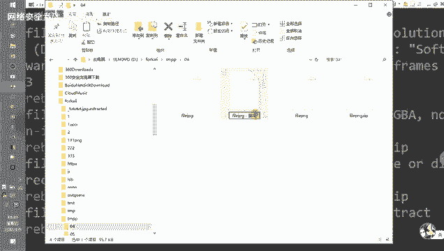

点觉PG。能看到吗？这时候这就是一张图片嘛，对吧？这是这时候就是是一张图片嘛。那第二个呢第二个也一样。第三个呢，我我改一下第三个。

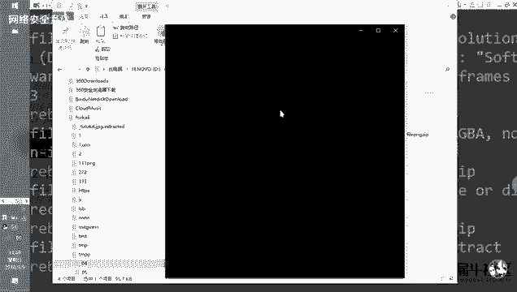

点ZIP。明白了了吗？这就是一张。他是里面是有一个这个。它里面是有一张图片的，但实际上是个压缩包嘛。那也说最简单的，如果是对文件处理的话，你我们知道咱样题，他会给你一个文件嘛。

如果他给你的一个出出题人想刁难你，他给你一个文件，他不告诉你这是一个什么格式，什么类型的，你要知道怎么去识别它，这是第一个。OK那第二个呢。第二个的话，我们来思考一下这个fa这个命ing它是怎么去识。

因为我们作为人类，我们是根据它的后缀名的嘛。那这个fa这个me它是怎么去识别它是一个JPG，或者是它是怎么识别，它是偏距，或者是它是怎么识别它是偏距呢？你们觉得你们觉得工具它是怎么去识别。

它这个文件是什么类型？几。你想啊一个文件上这说说的很复杂也很复杂，说的不复杂也不复杂。就是每一个文件它实际上都是有一个格式的。不同文件类型的文件，它的格式都是不一样的。那我这边的话。给出了一个图片。

这个图片告诉我们常见的一个文件头的图类型是什么样子。比如说这PE句，它的文件头叫做。可有点小，放大一点。你说这一句他的文件同是。加H是。然PNB是8。504147，然后接下来5是4。能白吗？

那就是不同的文件，它的一个文件头部是不一样的。那么我们的工具它是怎么去做的呢？就是如果用一个工具，它是怎么去做，它是去解析这个文件头。他去解析这样文件好。然后如果别方检测检测到了说。我我是案例。

我检测道504。他名字。我想知道504B030致，我就认为他是一个。我只道这个。49492A00，那我就认为它是一个这个TR就是我是根据它这个文件头的一个这个字段。

我去识别出它是什么样的一个文件的那这时候问题来了，工具他知道工具它能够去查看这个文件头嘛，他它可能是一个程序，我写了一个程序。那如果说。有一天我把这个文件头。破坏掉了，比如我我给你一个压缩包。

但是我把这个文件头给破坏掉了，或者我给你一个图片，我把文件头给破坏掉，你怎么去你怎么去识别它？这里面的话接下来就是又有几个工具了，又有几个工具。我们第一个叫做we。t是什么样一个工具呢？等in啊。婚音。

系す。啊。这个单词叫什么weha叫什么？知道吗？his是什么？只是十六进制嘛，十六进制嘛，十六进制也就是说这其实上它是一个十六进制文件的一个编辑器。什么叫十六进制的编辑器啊，就是正常情况下。

我们看一个文件，我们是以十进制去看它的嘛。但你可以看到这个文件用十六进制来表示的时候，因为我们这个文件不管任何数据，它实际上如果在计算机里面，它本质上是01010001嘛。那01001你给它变一个格式。

比如我转成从二进制转成16进制，我就可以用1六进制编辑去看它。那这里面的话先给它。介绍一下，首先第一个工具叫做winex。电工具。010。010edit就是010edit，它也是一个1别定制编辑器。

那还有一个。什么时派始？还有一个插件，还有一个黑插件。还有一个his插件，这能开压开，下面的有同学我推荐他去安装了。这个们开压家是一个顶好用的一个记事本，就是你们他有最最好用的一个功能人是。

他可以去高量代码，然后去帮我们去编辑。包括你们刚刚那个图片嘛，你们就用记事本打开的嘛。我告诉你们，你们用用家打开会更好用一点，就更方便一点。那这边有三个工具，三工具，第一个是pa，第二个是010ed。

第三个是run pad加加。比如说你们电脑要能够有这三个工具，它这工具在工具包里面都有嗯拿它工具包里面都有了。来，我们看一下啊，如果你们安了这个note派加加的话。你们身上是有一个这个。

比如说你拿了一个n加加，你这边的话，比如说你拿一个文件，任何一个文件，你右键你实际上是可以看到它有一个edit with not pad加加的这么一个选项。

也就是说你可以直接用右键去打开用n pad加加去打开这个图片，就相当于说比如说我右键我就可以点这个压缩文件了，或者是我右键就可以去做其他的一个操作了。那么我们来用n pad加加来打开看一下。

首先这是一张图片嘛。这是张图片，所以他你要么拍啪打开肯定是一算乱嘛，😡，就你用记事本去打开一个图片，那肯定是乱码。因为它本身不是一个图片编辑器，你用图片编辑看到是一张图片，你用记事本去打开它。

肯定是乱吧。那乱码的话，它这边有一个插件啊，有个插件。有个插件。这个插件里面你们可以去插件管理器去下载一个ps editor，然后你可以去看它的十六进制。能看得到吗？我们要听楚么？

这就是他的一个时间定制，不是说你看到这些字，你都你都已经眼都发花了嘛。但是我们只要看哪一部分呢？我们主要看最开头的这一部分FE06。就是这一段，我说的是文件头部嘛，FE06F5AA。

然后我们根据这个头部，我们去确认这个文件是什么样的一个类型。我们现在看到是啊先记录一下这个这个这个东西。那我们来看一下。这个和哪个很像呢？F一。呃，没有啊。啊。没有。😊，白色没有吗？

我换一个编辑器打开吧。这就比较尴尬了，我们来换一个换一个这个。呃，010艾D套。哎，这个就不一样了这个就不一样了。我再试一遍，再再试一遍这个呃龙派佳佳啊。能来压这个十六进制编辑器哦，原来刚刚不是第一行。

刚刚不是第一行啊。刚不在D行，还是这个FFD8FF1啊。嗯，把它截一下。我有一个我有一个好用的截图软件，我可把它定到桌面上来。我们来看一下是不是这个FFD8FF1。这回总总该有吧，好像是第一个吧。

没错吧。没错吧，就是这个FFD8FF1嘛，没错嘛，那就是说如果说我们不用工具的话，我们怎么去识别它是？类型我们可以用16进制编辑器去编辑它。那刚刚我用的是这个n派n派加加去编辑的那其上最好用的是两款。

就前面这两款win哪里面那我个人是强烈推荐你们用010。因为V的话，它过一段时间就过期了。

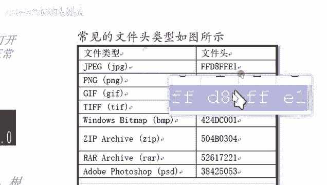

所以如果考给大家粉丝个破解版，它可能过一段时间就过期了，所以提议大家用010的地头。因为它破解一次就不用不用再破解了。那我刚刚打开用这个黑黑的这个东西啊，黑黑的这个东西。10。

那实际上它也是一个这个十六进制编辑器。那他这个文文件的一个格式是怎么样子的呢？就是。你可以从这边中间这个部分，中间这个部分就是16进制，然后这个地方是地址。

比如说我0000H00000000H0001H0002H这样子到这个FF就它有16位0到F是有16位的，这是16进制的。那这边这里还有一栏啊，这里还有一栏是什么呢？

中间这一栏这一栏你是像这边字符你是看得懂的，就是左边左边中间这个字符你是看不懂，因为它是16进制，右边这个字符你是看得懂的。因为它是阿克玛组成的一个用它是用阿克玛然后变成这个字符的。

就以这里面的这些字符，如果能够转成如果能够转成你可识别的可打印的字符，它就可以可以识别出来。比如说56789啊，拿CDEF符句啊，就这是可打印的。它有些阿克玛字符，它是不可打印的，不可打印。你看到了。

就是比如说是一些乱码或者是点点点点点，就就属于一些不可打印字符。那我我们来看一下这边的话文件。一个明显最简单的第一种就是它的一个bl。不知道怎么谈这一点，就说有可能。

有可能我在一开始这边中间这一串子是flag，或者是我把这个拉到最下面。

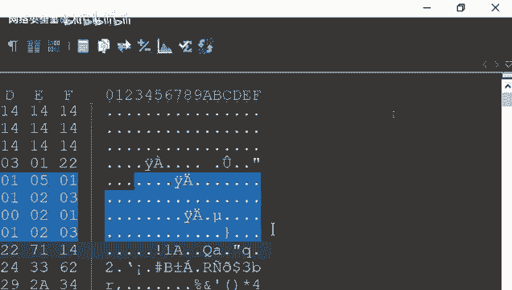

他可能藏在最后面。最后面有一串这个flag值，就可能查到最后面，这是最基本的一个文件引写的一个方式。就是我就把这个值写在这个地方，能明白吗？O。😊，那这里面哈这里面如果是这种做了很多题的，这种的。

因为他做了N道N道反向题。根对这几个常见的。前几个前几个常见的一个文件格式，它实上是很敏感的。就是比如我看到504B0304，我就隐约隐约的感觉到这可能就是一个压缩包，明白吗？

我看到这个呃89504147这就是一串这种值，它很像十六进制的。那我就隐约会感觉到这可能是一个文件，能明白吗？O。😊，🤧那。但随着这种考点的话，我们进一步去进一步去加深话，就是说他可能。给一个文件。

然后他文件头。被破坏掉了，或者是缺失了。所以我们刚刚说了，我们怎么去识别一个文件呢，或者是计算机怎么去识别一个文件呢？是因为它有一个文件头。但是如果说我我是一个初级的啊，我是一个初级的。

我故意就把这个文件头给它去掉了。我故意把文件头去掉之后，你用文，你你就识别不出来它是一个什么文件的，这种就是属于文件头缺失或者是文件头错误的一个考点。那这个时候我们怎么办呢？我们要去做一个修复。

因为你既然缺失了，或者是出错了，我就要给你补上去，或者是我做一个修复。那。首先这个定情这种文件它有什么特点呢？就是？你还用刚才的这个范尔命令去查看的时候，你查看不到数据了。

就是你查看不是说它它是一个什么样的一个文件类型的。就我们刚刚说的命令是可以帮我们去查看它的文件类型的。现在我把文件头部去掉了，已经查看不了，查看不到它会显示什么呢？它会显示这是一个data文件。

就是他会告诉你这是一个data文件，你查看他他会告诉这就是一串数据，他他也不知道他这是一个什么图片。但一般如果这种题的话，他可能在这个文件，比如说他会告诉你他这是一个stepep点片G。

但是你死活打不开，他会告诉你文件出错了。然后你用fi耳去识别，看到了是data。那个时候我们要去做一个修复，做个修复。那怎么去修复呢？就是要我们的编辑去做修复。

we have有的说是压一个it怎么去修复呢？还是一样的。如果你们安完的这个010edit，它会自动注册到这个右键菜单啊。所以我们可以用010edit去打开一个文件。那这边它是1个16进制编辑器。

说白了你就是可以直接去对16进制去做一个操作。比如说。我想在这里面我想在这个位置插入一算数据，比如说我插插入000102，这是可以的，能明白吗？那如果说它缺失了这个文件层，你就可以在这个地方。

比如说它这个FFD8FFF11它缺失了，那可能就没办法识别了，你就要在这里面去补充上。去补充上这一段正确的一个文件头，能明白吗？这是属于文件头缺失的一个考点。那这边编辑的话，其实上很很简单啊。

就是跟你记事本编辑一样，只不过你这时候编辑的是直接进制而已。这是第一个。叫做文件头的一个残缺或错误。那前面这一块都属于文件类型识别了，也就最基本的。因为答项题考的就是文件的一个类文件的一个类型。

那第二个就是我给你一个文件之后，你已经识别出来它是一个什么样的一个文件。就你已经知道它是一个压缩包了，或者是你已经知道它是一个。这个图片呢那这个时候。你忘引血是什么意思吗？就是隐藏的嘛隐藏的嘛。

那一张图片的话，它可能包含多少的信息呢？你们有没有听说过这个图片种子？普遍种子。就是一个图片，一个我们用这个迅雷去下载的时候，它下载它是提供这种种子的。普片种子的话就是你看你下载一张图片下一下。

它可能就是几百KB这样子。那其实它蕴藏的信息可能有一两个G。能明白白这个概念吗？这是叫就是叫图片装结。那么正常的一个引写就是你看到了可能是一张图片。他可能是好几张图片拼成一张图片的。明白？

就是图片他题目给你的是给你一张图片，实际上它可能有好几张图片，甚至你不只是图片，它可能一张图片里面还有压缩包，还有TST还有PTF还有其他文件。那这种是这种是怎么去做的呢？

重种是出题人把这个文件把它合成和融合成一张图片的，把很多文件融合成一张图片的。那我们要去解这种题的话，我们就是要自己涉及到就是文件分离了。既然你是把它合并的，那我就要去做一个分离。那分离的话。

这边还是工具哦。你们现在会看到听我一直讲各种关系怎么样怎么样怎么样。这里面的话还是这个limux下limux下了一命令啊，limux下的一个密叫做binwork。第一个第一个要冰墨。

那Bwork它是一个lin用下一个它可以去，比如你拿到一个文件之后，你经识别出来它是一个什么格式了。但是你发现这个图片什么信息都没有，你根本就不知道这信息隐藏了什么东西。

那么告诉你可能它可能隐藏了其他的一个文件信息。那这个时候我们要去识别到底这个文件是不是真的隐藏。所以我们要用工具去识别它。那这边的话我们可以用这个bework这个工具。

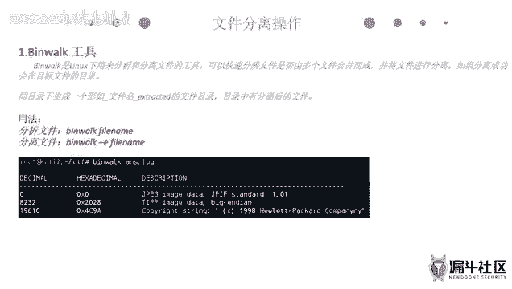

这个工具的话，它的用法有两个，第一个是直接加。那么他会告诉你这个文件，它可能隐藏着哪些信息。你比如说我这个binwork，然后加上一个图片，他告诉我这我这个文件。

Yeah。吧，我还有。ERX的一个数据，你说我这个文件。可能在。这个地方是就从零到这个地方，可能是一张JP句，从这个地方开始到结尾，可能是一个什么可能是另外一个文件。也就说我这个文件可能是嗯两个文件。

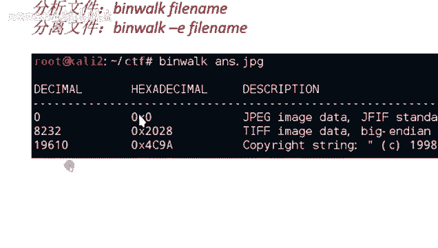

那么这时候我们想用工具去自动化的帮我们去做一个文件的一个剥离。就是我们帮我们做一个文件的分离。但我们可以用一个参数，就是样义这个参数。我们看上一个杠E，然后我们把这个文件做一个玻离。

我们可以来做一个看一下演示啊。我这边的话对每张PPT我多有一个例子，看这个是第六章的。第六章6到10。比如说我这边是一张图片嘛，这个是一张图片嘛，然后题目可能就给你一张。图片。你们就给一张图片。

那这张图片的话。

他有什么信息吗？你看不出来它有什么样的一个信息了。那这时候我们怎么办呢？你可以去看一下这张图片到底是不是有隐藏的其他的图片。所以我们可以怎么做？我们来看一下，我们可以用命令行的一个形式。来正常情况下。

你们要把这个文件复制到linux下，然后再用命令行去识别它嘛。那我这边因为我是有子系统的。

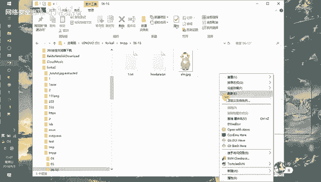

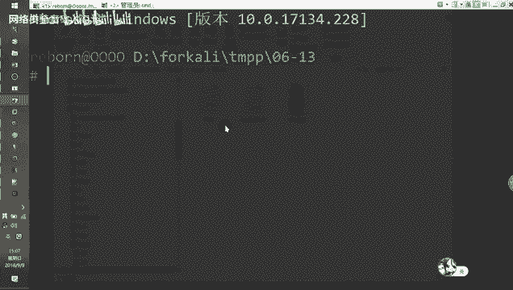

对。CD。没有。我这张文件叫做sim点GPG嘛，对吧？sim点GPG然后我现在。work去识别一下我这个性名PJPG到底有没有包含着其他的文件。所以我用bework。In work。然后是信点接PG。

没错。回车完装。他告诉我他告诉我什么呢？他告诉我，从0叉0开始，0差0就是16进制的。然后0差0开始到0叉596F往上，它是1个JPG。但是从0叉596F开始往后面，它是一个什么？能看得懂吗？

它是1个ZIP嘛，对吧？他告诉我这是个ZIP嘛，也就是说我这个图片实际上它里面包含了1个ZIP嘛，能明白吗？那我现在想把它我想把它分离出来嘛，你怎么做？我们加一个杠一参数嘛，加一个杠一参数车。

当一杠一插入回车之后，它会去自动生成一个文件夹，它把分析完的，它把这个inwork这个程序自己分析完的文件，把它装到这个文件夹下。我们现在看一下当前目录。

当前目录多了一个文件夹叫做下划线杠性点文件点多了一个这么一个文件夹，我们来看一下这个文件。这里面多了一个文件夹，有没有看到，然后我们把它打开，你发现当了。它实上是里面是一个压缩包了。

但是你这边发现他多了一个是吗？😡，多了一个屁点。能看到。binwork的一个特点，就是binwork他去帮我们去做文件玻璃的时候，如果他遇到压缩包了，他会帮我们去做一个解析。能帮我做一个解压。

那实际上我们刚刚看到这张图片实际上是一个压缩包嘛，ZIP嘛这个ZIP我们把它解压到单前文件。里面也是1个T点TST。那为什么我在前面还看到1个T点TST呢？我可说了嘛。

binwork它的一个特点是它遇到压缩包会帮我们自动解压，能明白吗？😡，那这个T点TSD是什么？就是我们的fag。有是道题，如果是。简单的一个。文件分离。

就是说我们可以用工具先识别看看它有没有其他的文件。然后我们直接把它剥离出来。当然了，很多时候并不是那么容易的，就是事情并不是那么容易的。你以为宾work就可以做A回型。

不可能的那接下来就是我要讲各种各样的工具，包括方法，有时候工具是没办法帮我们去做这件事情的。就是工具没办法准确的帮我们把两个文件把它分离出来。或者说有时候因为他出题人他动了一点小心思。

第一次考试可能是说哎我们我们用大家用宾work就可以做。第二次他出题的时候，发现大家都会冰work，然后就动了点小微心事，我让宾work做出来，然后他可能其他东西就可以做，然后可能过第三场之后。

他又出了一个，我让工具都做不出来，你只有手动手动分分离才能做出来。就是题目是越来越难的，明白啊？就是每一届比赛时后发现题目可能越来越为么呢？因为方法大家都会的，所以他觉得没什么意思的。

就考验大家不会的这是出题人的一个心理。

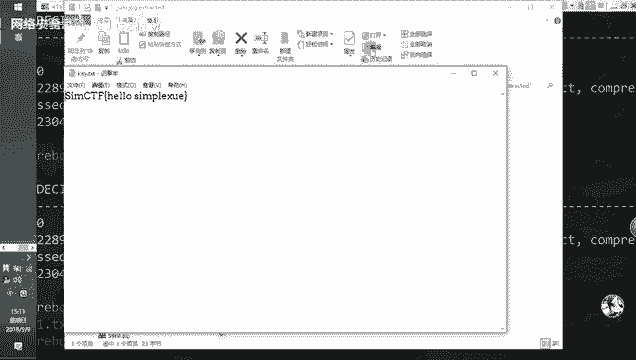

好，我们来看一下啊。这个是我介绍的第一个命令，你第一个文件分离的一个命令。那是不是很简单，我们去查看它是不是有其他的文件，然后去分离它。

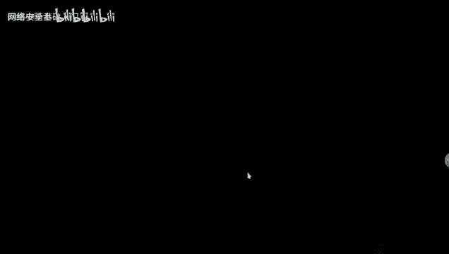

第二个呢第二个那它的用法，其实冰work也差不了多少。那为什么还有还要有它呢？既然它和兵work差不了多少，为什么还要有它？就是有时候你用binwork就是分离不出来。那你可以尝试一下。

用一下fomost，对吧？你可常下用fomost。那这时候你也用B已经识别出来了，它还有其他文件，就是bin，你发现用杠E是就是没办法啊分离的那你怎么办呢？

你可以用formmostmost也是命令行的那我们只要知道只要知道这上我提到命令行，你只要你只要知道这个命令行要怎么用就行了。你只要知道我如果要用这个工具，我要去哪里去查这个工具怎么用就行了。

那这时候这个工具怎么用呢？它很简单，就是formmost加一个文件名，然后我们把分离的文件输出到一个文件夹，也就是用杠O。杠O这个参数把它输出到一个目录项，那O就是outt曼，把它输出到一个目录项。

怎么用呢？我们来演示一下。还是这个还是这个图片啊，那我现在把这个这个是用刚刚用冰work分离出来的呀，我们把它删掉。还是这张图片，然后这个时候我用的是。我不想用binwork。

因为我刚刚发现了binwork已经这个是个fi出来了。那我现在想用这个formost。Formost。然后我要加上这个图片，然后我加上一个杠O参数，那后面是一个我要输出的一个文件夹。

这个文件夹你可以随便命名，比如说用123，那它就会生成一个名字叫做123的一个文件夹。没说。啊，所以说我们来看一下当前目录有一个文文件夹叫123。你可以看到。这边多了一个文件夹叫123。

这个文件夹formost是一个比较重规重矩的一个一个分离软件啊，它不像这个bwork宾work看到压缩包，它会帮你解压。但是formost不会，它会帮你分类，它会告诉你哪个文件夹是JPG。

哪个文件夹是JIP，它把它分类分的好好的，甚至它分离完之后还给你写了个日志，在这里面，这个是一个日志文件。那这边是一个JPG，就是原来有1张图片。这边是ZIP。

就是我们它分离出来了1个ZIP的一个压缩包。然后你把它解压之后。你看到这里面得到一个K点PST，然后这里面就是这个flag，这是第二种方式。就当你这个bework没办法工作的时候。

你用的是这个formost。O。😊，那第三个第三个第三个叫做。3个BD。然后一一一开始讲这个三一下子来了三个这个文件分离，我不知道你们吃不吃得消啊，反正我是有点吃不消啊。不是下子有三个嘛。

滴滴它是这样它也是一个命令行工具了，这个命令行工具，它是属于最难用的一个工具。它特别难用，但它也特别复杂。为什么还要做工具呢？你知道越复杂的工具就是专门解决这种越难的题目的。能明白吗？

越复杂的工具操作越复杂的工具，它就是要解决这种阅难的题目的。什么意思呢？当你前面的自动分离已经分离不出来了。像滴滴这个工具，它是属于一个半自动化的一个工具。它没有像前面那两个工具那么容易。

就是说我直接加图片，我就把它分离出来了。这个时候可能我不知道还有的人有做过一些打案题啊，比如说有一道题叫苍蝇。刚知道有没有没有同学做过苍蝇。然后这个苍蝇它实际上是一个流量包，然流量包里面有个压缩包。

但是它这个压缩包太大了，它分片，它分了好多片，然后有很多的这种碎片，然后你但是这个碎片又不是完整的，不是简单合并就行了，是它每每一个分片前面都有一个答脏的数据嘛，你要把这个脏的数据拿掉。

然后再把它合并合并成一个程序，然后点开这个程序，有跳出很多的这种苍蝇是吧？呃，你们后面可能会做到这么一道题哦。那什么意思呢？就是说。简单讲一下，比如说我有很多文文件。我有很多的这个文件。

比如说我文件一文件2，当然不一定很多文件就一个文件也行。那我们刚刚的一个，因为这是文件嘛，对吧？这1个A233个文件。那如果说是。呃，我们前面讲了做文件分离的话，很简单，就是可能前半部分是1个JPG嘛。

对吧后半部分可能是一个什么ZIP。就是这种这种题目就很单纯嘛，你前面就是一个呃图片，后面就是一个压缩包。让我看到的是一张图片，然后我直接过去把它分离出来，这种题目太单纯了。なきます。就这样。

我是我还是还是一个文件，是由两个东西组成的，还是由JPG和CIP组成的。但是我做图片，我没有那么单纯的就把它融合在一起的。我拿这个JPG的第一半，拿这个JPG的一半，也是123。是吗？

我把这个一把它放到这里这个地位置来，然后把三放到这个位置来，然后把二放到这个位置，把四放到这个位置。这时候就很变态了嘛，你会觉得他把一个文件这么变态的。现在就。

那这时候你用binwork或用form是没办法把它分离出来，为什么呢？因为这个一它本身就不是一个JPG嘛，它只是JPG的一半，能明白吧？这只是JPG的一半。然后三呢也不是JIP嘛，它只是JIP的一半。

所以你用Bwork forform的时候，它这时候就没办法完整的把这个文件分离出来。他也不知道，因为一个文件一个文件，它正常的情况下是从文件头开始到文件回就要完完整整的嘛。你现在不完整了嘛。

中间给我插一段进来了。所以这个时候你用前面两个工具是没办法做的，你要用滴D去做。那滴D是怎么去做的呢？我们先先不直接对文件做操作，因为直接用文件操作，这样讲起来太复杂。我们先用先讲一个小例子。

就大家这个例子可能大家都能够听懂的一个小例子。呃，先假设一下啊。😊，先假设一下，我有一个文件啊，1点PSP。然后这个文件呢里面的内容是1234189。や置。就这样子，然后现来我用我要去完成即项登务吧。

完成即箱任务。比如说。呃，这个我想把前面五个字符去掉，然后把后面的后面的文件。变成一个新的文件。我想把比如说我把想我想把12345去掉，然后把789后面开始到最后面，把它变成另外一个文件，我怎么做呢？

就是用这个命令。EDifTST if是什么意思呢？先介绍下参数，因为这个工具确实有点复杂，它参数太多了，然后。if是原文件嘛，我现在原文件是谁1点TST，所以我这里面是1点TSToff是什么？😡。

of是我要输出了这个文件，比如我要保存成2点TSP所以of是输出文件名。然后接下来BS是什么意思呢？BS是快大小，就是我要。😡，读多少块，我要读这个文件的多少块。比如说我刚刚说的12345嘛。

所以它的块是多少是5嘛，然后呢，com是多少？是一块，一个5嘛，一个5就是我居中是一个5嘛，也就是说来这明讲起来。😡，大家听起来可能有点累哦，就是我要把这一块这块的长度是5嘛，所以它数量是一嘛。

能明白吗？然后它的长度是5嘛。😡，然后我想把它把这一块变成什么？2。TST能看到吗？嗯，也就是说我想用这个工具把前面5块去掉，然后把后面的变成1个2点TST。那命令就是这么用的。😡。

你看一下这个工具确实有点复杂，这工具命明就这么样的。那其中。哦，不对哦，做错了，我只要前面这5块，只要前面这5块把它保存成12345。那接下来。😊，如果说我想要前面10块呢。

那我是不是把这个com的加一个一就行了，因为一个快是5嘛，所以加一个一是10嘛，所以最中保存的是10个嘛。那接下来。比如说我不想第一块，我不想不想要第一块，我只想要后面这一串。

所以呢我countt是三嘛，然后呢我跳过一块，跳过第一块skipsip是什么意思呢？从输出文件开始跳过多少个block框之后开始复制。那这边我先来演示一下啊，因为可能大家直接看这个例子也不是很直观。

这个是第八章GT。我这边有1个1点TST，这个1点TST里面是123456789。不去。

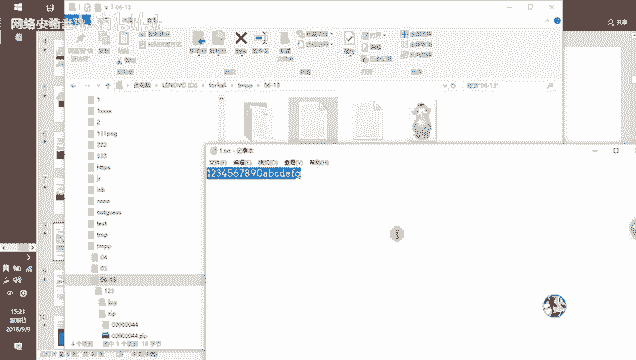

没错。那我们现在的话就是。

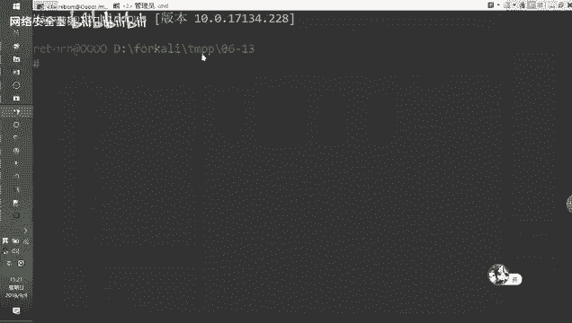

你们现在看一下这个1点TST。这个1点TST是这个值吗？我先要取它前五前五个字块嘛，前五个字块，所以我要用滴滴命令去分离滴滴，然后EF。是原文件of是什么？是输出文件嘛，把它保存成2。TST。

然后我要多少块嘛，我要取前面5个字符，所以块等于5，然后取多少块呢？一块。等于一。好，我说。那我们来看一下2点TST。是不是12345？那如果说我要取1234567890呢，是10个。

所以我这时候就是2块嘛，然后比如说把它保存成这个。3点TST嘛。off3点。TST。对吧往回车，咱们来看一下这个3点TST。嗯。看保存什么？刚刚保存错了，保存成这个文件。就是我刚刚保存错了。

忘了把它删掉了。🎼这个是2点TST3。PST就是1234567890嘛，对吧？那如果说。你再看一下1点TST，我只想要我要要跳过前5块。观键记住啊，这个这个是最关键的，这个是我们去分离文件。最关键的。

就是我想要去跳过前5块，然后我复制后面的。布制后面的那我怎么去做呢？同样的是滴滴不要保存保存成。if等于1点TSD。off等于比如说4点TST。然后接下来很关键就是。我怎么去设定跨account。

还有sip。那我现在这个例子很简单，我只要跳过前5块就行了，跳过前1个BS嘛。比如说我BS还是等于5吗？Acount。也就等于这个2。等于3吧，然后我跳因为3块嘛，我跳过前一块SKRD。等于一。

🎼那我们来看一下这个4点PST。这个是只有是不是把前面5块去掉了？😡，OK那我们现在啊如果你懂得这个你懂得用滴滴去对1点TSP去做操作，并且去做分离的话，那么你就可以用滴滴去对一张图片去做一个操作。

因为我们刚刚说你我们刚刚那张图片是前半部分是一个JBG，后半部分是1个JRP，对吧？那么。这个图片我们是不是只要跳过前半部分的JBG的部分，把后半部分拿出来，然后保存成什么，保存成ZRT就行了吗？

能懂吗？你懂我意思吗？但我这样说可能还有点复杂。因为你们还不知道我要取多少跨长度嘛，就这个图片因为我这个我这个1点PSD可能就这么十几个字符嘛，跨长度很好去确定。那我们怎么确认我这张图片。

它前多少块是这个图片呢，后多少块它是一个。ZIRP呢？所以说我们要借助bework。你们用binwork的时候，实际上前面有两个字符，一个字符这个单词叫做十进制。这个单词叫做十六进制。能看懂吗？

然后什么意思呢？😡，我刚刚说了。有看到。从零开始到0叉596F。它是一个什么？也就这么长，从零开始到0叉596F，也就是0叉596F是一个十六进制，你把它转成十进制是多少？228595嘛。

你就是说0到22895，它是一个。B从么2895到23046，它是一个。CRB那我说的对不对呢？就是说苹果家说的对不对呢？我们来验证一下，就是0叉596F到0叉5A06怎么去验证？

用16进制编辑器来看一下吧，因为16编辑器就是可以查看它这个多少进制。我来验证一下我我刚刚说的这个是不是对的。我们是。用随别定制编辑器打开这张图片。那我怎么定位到刚刚那个地址呢？

你可以看到开始的地址是多少。😡，0叉596F0叉596F怎么去找到0叉596S呢？刚刚介绍。😡，左边制这一栏叫做地址栏，中间这一栏是数据，这一栏是askcle改成字符的。所以我们要去干嘛？

我们要去地址栏去找地址栏，这里面走，这边是从什么？一开始是从0000开始的嘛，一直往下一直往下，那要到走到哪里？😡，这个是0叉596F嘛，也就是说我们要找到0叉5900嘛。来后我们看一下。

OK这个很很后面的很后面的，我把它拉到很后面呢。然后直观一点，是不是？那这边是什么呢？可能大家看不是很清楚，放大一点，0叉596A5960H码。5960H，然后5960F是哪里呢？F是这一列。

这一列是F嘛，所以0叉596F是从这里开始吗？😡，504B0304。明白了吗？这里看从这里到这一段，504B0304，这是个什么？这是1个ZIP嘛。所以我说了是没有错的嘛。就是这个到这个地方。

它就是1个ZIP嘛，因为它头部就是504B0304，你再去查一下ZIP的头部，你发现这就是1个ZIP没错吧，那接下来我们要去分离怎么分离呢？是不是要到这个字段，然后把它去掉。

接R就是要思考我这个快乐小要是多少呢。宽了是等一就行了。快乐网授权一。🤧啊，对。来，我们来看一下啊。我们要用滴滴这个命令。然后这边是if等于什么？SIN点JPG of等于什么？

就是随便1个ZIRP的名称嘛啊提个提个复杂一点一点ZIRP。然后接下来是这个BS，我把它设成一块。然后呢。countt等于多少啊？空调多少块？是不是2289？58还是这个啊。要多少块呢？啊。啊减一下。

要减一下啊。这个是一共多少块嘛，所以一共是多少块啊？23046嘛，要减吗？不需要减的，同志们不需要减的，就是一共要取23046块嘛，把前面2304话全部报报下来嘛？那是不是前半部分就是到22。

那我现在要加一个参数叫skip嘛，票货选多少呢？22895嘛，能看懂吗？😡，能看懂吗？能看懂我们回车。然后这时候应该有了多了1个ZIRP嘛，打开。是不是K点TSC？有密码有密码密码，这个是假的。

我把它解压一下。😊，点一下。然后看到这个是一个。对吧能看懂吗？就这个这个操作能看懂吗？它是一定是属于一个很复杂的一个命密。但是我们告诉你啊，越复杂的工具，它其实越能做一些解决一些困难的题目。

那刚刚讲的只是都是说都是用工具的嘛。就是我们要借助工具的力量去帮我们去做嘛。但是然呃。这个比较方便哦这个比较方便。很多时候我们是需要。怎么去分离的什么意思呢？就是它更复杂一点的，你根本就复杂话。

你根本就不想用滴滴去解决这个事情。😡，什么意思呢？因为DD杆你还要你还要去计算的，你知道吗？你要计算去多少块，后多少块，中间多少块。所滴滴是一个很复杂的工具，有时候你根本就不想去计算这个东西。

你怎么办呢？我们直接复制出来了嘛，因为我们知道哪一块是我们想要的数据嘛，所以你可以用VX，也可以用你用edit。把这一段词复制出来，那这里面我不推荐大家用win hack，因为010edit更简单一点。

就是我们把这。举重，然后把它找出来。怎么做啊？怎么做呢？刚刚这个是我们的JPG嘛，我们刚刚那个SIN点JPG对吧？那我们刚刚已经找查找了一遍了，它的一个开始是从这个096F哦596F开始的。

所以应该是从这里开始嘛，594B0304嘛，到后面这一段可能都是ZIP嘛，能看懂吗？我直接右键。然后找到这个selection。然后呢，CF写了一个选。能看得清楚吗？保存所选的这一块嘛，那是不是很简单。

这是010比winhead。高级的一点，就是他可以直接这么做保存。那保存成什么呢？肯定不是JJBG嘛，可能比如说叉叉叉叉叉点ZP嘛。对吧我们保存一下。然后我们打开。跟你讲啊。我们打开这个文件呃。T就这。

这个是6到10，这边有1个叉叉叉点ZIRP，我把打开。记在这里面啊，当然这个这个这个将军是假的，我告诉大家这个将韵假，还是要解压一下。然后。拿到这个。能看懂吗？我现在刚刚讲四种方式。

前两种方式是比较简单的bework和 for most。那么它直接可以帮我们把文件分析出来的。第三种是一种特别变态的工具，叫滴D就是第一点条计算开始还有结束，还要跳过多少个字段。

啊另外一个是手动的一个手动选择你要的数据，然后你把右键保存成一个文件，这四种方式，也就是文件分离的四种操作方式，能明白吗？四种方式OK。那接下来我要讲什么呢？好，再讲一个。这两个方式对16。我唱了一啊。

操作。啥意思呢？就是有时候你拿到一个文件，你把它打开。你把它打开。比如说。我怎么又把那文件关了？你拿到一个文件，我找一下这个文件啊。嗯，这样。OK你。比如说你拿到一个文件，比如说是这个东西太多了。

先删掉一些啊。比如说一个文件，他给你1个TST。他给你1个TSC是不是很简单，但是你打开你懵了。😡，就是你打开你了，发现里面自己算值，你根本就看不懂。那我告诉你这是算什么值吗？这自己算十六进制。

就这是按十六进制。那这是一个什么样的一个实续定制呢？你看一下头部5261。然后什么7221嘛，其实它是一个IR。它是1个II压缩包，你说朱迪人想给你一个压缩包，但他没有那么没有那么。没有那么善良。

对不对？他不会直接给你一个压缩包，他给你1个十六进制，难道你去把它变成一个压缩包。那这时候怎么做呢？这时候我们要把这个16进制导到我们的16进制编辑器，然后再把它另存成一个压缩包。那我们怎么去导呢？

我们用010edit去导就可以了。打开我们的010edit。然后这里面有一个fi， file里面有一个import。inport就是导入的意思，我们把这个文件导入，我们找到我们这一个文件。

然后这个时候你就可以发现这其实是一个I呀。其实你在这个。你在这个视图已经可以发现了，它其实是个IM。那这个时候我们就会把它另存为1个IR文件，然后才能得到我们的这个压缩包。所以我们可以点这个另存为。

另存为。然后比如说另存为。啊呀。华成。然后这时候你发现你多了一个IR。😡，然后你发现它是可以解压的，能明白吗？对吧所以你要你们要相信啊，处理的没那么善良的。就处理人就是围围绕善良的。

所以有时候你们打比赛打完之后，你人就想打找到处理人，然后把他打一顿，有时候就是这样子。那这个是这个关于文件分离的几个操作，文件分离几个操作。我们再讲一个，我们就休息一会儿啊休息一会儿。你看有文件分离。

那么与之相反的就是有什么？文件合并嘛，对吧？就是这种变态。既然有文件分离，那么就有文件合并不文件分文件合并没那么没那么困难。我一发合并就没那么困难。而后实际上还是比较简单的，最后我给你很多文件。

比如说我明明就是一张图片，我硬生生把它砍成4个文件，然后发给你，等了啊。这就是初级人的一个处题思路，是不是这样？是我们好的那的一个图片，我就是不给你一个图片，我把它砍成四段，然后再发给你。

然后这时候你要把它怎么去合并出来。因为你想。我分成4块了，你知道哪一块是第一个，哪个是第二个吗？你是不知道的。😡，所以有时候他会给你1个MD5值，让你去计算它这个文件的一个完整性。MD5大家知道吗？

MD5啊MD5是一种交易方式，它是一种我们说它是一种摘要算法。就是说我去校验这个文件的一个完整性的。他为什么要给你1个ND5呢？他把这个文件插成4个。

然后给你1个ND5告诉你完整你拼成就相相当于说说什么，他给你一个拼图软件，拼拼图，然后告诉你拼完图之后长这个这个样子哦，是这个意思。那这里面的话。呃，你可以分注两种场景。一种是你在linux场景下。

你要怎么去做一个文件合并。第二种是你在windows场景下，你怎么用命行去做一个文件合并。那这两种的话，它其实操作很像，就基本上呃没有太大的一个区别嗯，都比较简单。那我们先来看一下。

这个文件合并的一个我演示一下。我这个是12张PPT。然后我们找到我们这个12张。嗯，哦15张。我这边有一个有，就是这是案示要。原题就是咱样。就出天就这么件，他就给你4个，当然可能他没有没有排序。

我只是善良的把它排了一个序而已，那可能没有排序。那他他这这你们从名字看，他好像是。发一组图片呢。对吧我们从名字上看，他好像是个巨R图片，然后出题人还贴心的给你了1个MD5的值嘛。

那你去校验说你合并完之后计算这个MD5看看是不是等于这个值。如果是的话，你就合并成功了。然后我们来看一下，这里面的话，其实合并很简单啊，我们先先使用这一个。

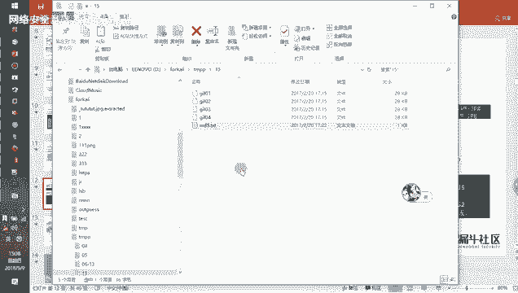

迷你好。首先我现在是limux下。这个文件有4个文件对吧？四个文件。然后我想把这四个文件组成一个文件，怎么做呢？用ca命令。看的是查看的一个意思。那我们不管我先比如说GRF01。

居如果如果这四个文件名字是不规范的话，你可能要一个写。如果它是规范的话，你这样写就行了，那个心。可能有点小字有点小。那我这边为了演示一下，比如01啊，GIF02GIF03GIF04。然后把它捣存成。哦。

04是吧。保存成1点GRF没错吧啊。嗯然后看一下有没有这个文件。有了1点GF，我先看一下原本的这个MD5值。是什么？799B4到什么316B嘛。那我现在在linux下去校验这个文件的MD5值怎么校验呢？

啊，想一想啊ND5。这 you问。

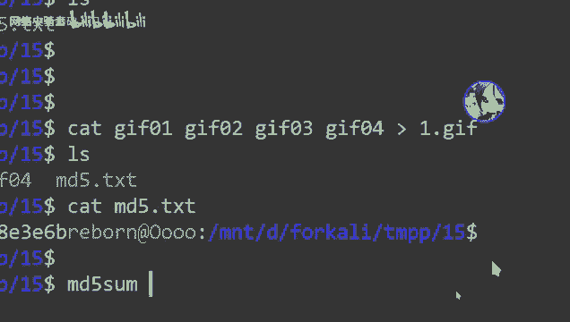

一点GIF。这是我校验出来的值，这是它其中的值。你们对比一下是不是一样的。应该是一样的，这肯定是一样的。所以说我这个GF是没错的。然后接下来我退到退到windows下，退到windows下。

我现在是windows下，windows下是windows下嘛，对吧？那windows下怎么去做呢？😊，用copy命令。copy杠大B，然后呢加F。01加上就是他就用加的。

用加号去把这个文件加起GF02，加上GF03，加上GF04，那不是2点GF。啥意思啊？嗯有问题啊，看一下，我有点记不住了。copy杠B，然后加起来。不到第三个。啊。😮，哦，路径出错了是吗？

怎么到了04了，应该要是15台，对吧？CD15。哦，不对，我看一下当前这个文件是哪里，我在04下啊退出，然后CD15，然后再执行上面这条命令。这次应该没错了吧。然后先看一下有没有这个2。TGF吧。

有了吗？然后我现在要计算这个ND5，那它计算有点不一样啊，这个命令稍微长一点点。我也有人记不住。说实话，我也等于说叫做呃CTYL，然后杠haush。你看一下。然后这里面是文件名2点PRF。

然后你你你这你还可以校验其他值，比如说HHA，那你我们这边只要校验MD5就行了，没车，然后得到这个值实际上是一样的。但是。我们来看一下我们得到的这个GF，你现在可确认的是我们这个GF是没有问题的嘛。

但是能打开吗？能打开吗？不管是一点加F。

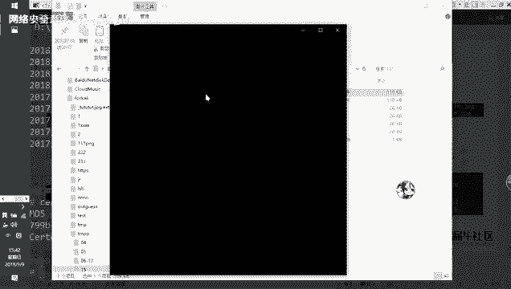

黑手。特点加F。其色。

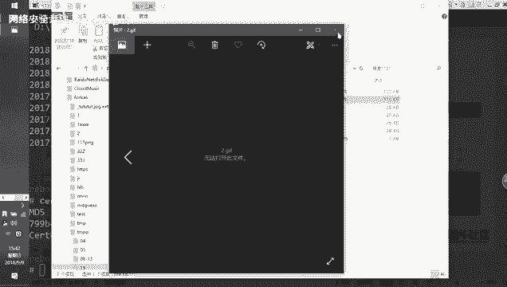

打不开，为什么打不开呢？我们现在识别一下，看看能不能识别出来。比如说范尔命令1点加F。告诉我是什么。😡，好，告诉我是什么。😡，但是我这个data根本就。样就是骗过。有可能是什么样子呢？

有可能是文件头残缺了。那我们来看一下它有没有GF的文件头。第二文内容是多少？嗯。查一下查一下，有点忘。47494638嘛，那我看一下他这个文件有没有这个GF文件头。你要的话去上面啊，有吗？保像并没有嘛。

所以我们要什么我们要手动添加47494638。然后保存。保存。啊，保存保存完之后我们再来看一下。它是一个动图嘛，key is什么东西？这是很变态，这个我们答案还没得到，还有三个路图，每个值还是在这里面。

这里面还是一串加密的值。然后再去解密，然后你还要把那个PRS把它。一张张拆一下啊，本家会介绍我们怎么去把GF的每一针把它拆出来。所以一道题就是。所以你可以发现，但这个还是比谁，你们不要不要感到绝望了。

我怕我讲完之后，你们感到绝望。😊，有啊。所以你要试好几遍啊，这就是变态啊。那一般一般情况下，书记人，你要看书记人善良不善良，他善良的话，他帮你编好了。他不善良的话，你要自己去找，能明白吗？这个时候就是。

这种题问就是你想为什么我说你想打出力人呢的意思就是这样子。😡，很变态啊。O。😊，那这个是多道题？我们先休息一下，先休息一个。5分钟还是10分钟。先休息5分钟啊，先休息5分钟。OK我们继续啊。

那这个是刚刚讲到这个文件引写啊，文件引写文件总解是属于我们要讲的第一部分。那这里面的话最后一步有定引写就是。比较简单一点，就是我们直接把我们的编辑器打开，然后我们去搜索里面是不是有flag值嘛？

这里面的话。常见的方式啊就是。你们去搜索，那搜索的话，我不推荐你们用记事本，就是电脑自带那个很low很low的记事本。那个记事本太low了，就是就真的看起来比较low。所以一般情况下，我们是用这个。

派加加或者是比如说我们这个我们用中pa要打开一个文件，然后这边有一个这边有一个搜索的一个功能嘛。其实你可以按快捷键，就是ctrl F。很F，然后去查找查找。然后比如说最正常的一个思路。

就当你没有任何思路的时候，你可以去查找key。你就查找key呀，然后他找要flag呀，看看有没有一些关键的信息。因为有时候简单的题目就是考点就是这样子而已。然后这是第一个是查找正常的字符串。

那有时候它这个不在，它不会隐藏在字符串里面，所以它有时候隐藏在1六进制里面。所以我们要用1六进制去查找随进去查找的话，同样也是它这边有一个社区，你去找它，啊那你这种工具它肯定都有查找功能。

你找到社取功能，然后这里面的话，你你找找可能还要需要替换什么的那这边都有都有都有这个相应的一个功能。就是一般软件它有查找功能，具有替换功能。所以我们可以去查找。

比如说去fin find the list等等。然后这边这个软件放呢是在这个位置，就是在最下面这边这个地方，然后你可以查找某一个字符串，然后去查到所有或者是怎么样直接查找，就是最基本的查找功能。

我们要去掌握，这是第一个。然后我们再看一下，这是呃最后一个这是第一部分的最后一个。

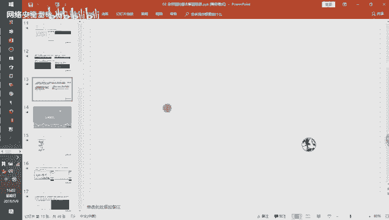

来看一下这个到了我们的第二个环节，就是图片示。你看才刚才好像讲图片，其实我刚家讲文件引写数。啊，我们正式进入到图片引显数。

那这边只是一个小小的一个总结而已，小的总结。就是常见的一个图片图片影显数的一个明显方式。那我们这边列了几点，比如说最简单的叫做细微的颜色差别。啥意思呢？就是一张图片，它有细微的颜色差别，你看得出来吗？

你是看不出来的。但作为一个正常的人都看不出来。所以呢我们肯定是要用各种奇怪的工具去做各种奇怪的题目的。那比如说GRFGRF它可能有各种，因为我们说了GRF它实然是很多灯很多这种分片的图片去。

整合起来了嘛，所以它可于是多帧的一个隐藏，可能藏在某一帧里面，可能藏在某一帧里面。再往下可能我说了，我们往深一点，就什么颜色通道啊。啊，怎么真的一个对比明显啊之类的那这种就是属于你要知道这个东西。

就是我一开始讲你可能完全不知道这说的什么。然后你实上掌握工具的使用，你就知道原来这个这个东西叫做颜色通道，这个东西叫做。怎么对比隐藏出来的。那再往下是这个E叉F。F的一个信息印藏。

你们有没有听说过这么一个东西，就是你在朋友圈发一张图片，然后我就可以知道你在哪个地方。有没有有没有听说过这种这种言论，就是你在朋友圈里发了一张图片嘛，你再拍张自拍。

然后我就可以定位到你这个人在地球上的哪一个点。知道吗？你没有去做这种言论吗？这种言论是存在的，那他怎么是怎么去实现的呢？我们手机或者是我们的摄像拍照设备啊，它实际上如果它有GPS功能的话。

那并且你把这个功能开起来了，然后也允许你的拍照软件去访问。比如说允许你的相机去访问。那么你去拍一张照片的时候，这张照片会记录下你当前的1个GPS信息。然后这个GPS信息就会泄露你的一个地址。

你的个人地址。那比如说。比如说一个人拍了一张照，一张照片嘛，他拍了一张照片，说他拍了一张自己家的自己家的照片，然后说我过几天要出去旅游。结果他回来之后，发现自己家有被被盗被盗窃了，那道为什么呢？

因为他过几天要出去旅游嘛，所以说明说什么？所以说他过几天不在家嘛，然后他又拍了张照片，所以呢？😡，不法分子就通过这张照片知道他家在哪里吗。那你这几天不在家，我是不是可以砸玻璃进去，然后干一些非法的事情。

是吧？那这种东西的话一般是在和我们正常生活可能。演离不是什么关系，但是他的犯罪和这个刑事甄别和这个调查取证和这个警察周小偷，他关系是很大的。就是我警察要抓一个换人，我用GPS去侦侦侦查到某一个人。

这上是很很准确的那这个信息叫什么呢？就是每张图片它都有1个E叉S信息，那这个等下会讲到等下给你们演示一下怎么用GPS去追踪到一个人的壁纸。好了，再往下。叫做图片修复。图片修复。那很简单嘛。

就是你要想这个突出盐不是那么善良的，所以他会把图片给它砍掉，头片头部砍掉啊，图片尾部砍掉啊。那图片它有一个C压RC校验，就是完整性校验。我把这个高度啊、长度啊、吸压RC值啊全部把它改掉。

那你要去修复这张图片。那再往下叫做。最低有价位。明显啊叫ASB明险，这个什么东西呢？我们知道图片是有各种颜色的，对吧？图片和其他文件的区别就是它有各种颜色。那颜色大家这个应该都是理科生啊，学个物理。

对不对？三基色是哪三种颜色呢？三基色三基色是不是这个？就是忘了。三基色是不是红？然后呢。呃，这个绿对吧？到蓝嘛。RGB嘛RGB嘛，那么RGB在这个你把它转成字符串的时候。

因为我们知道所有的信息都是可以用二进制来表示的，RGB也不一外不例外。那么正常情况下是巴比特。比如说010101010102，我把最后一位。最后一位就是我们什么呢？

RGB巴比特的最后一位就是我们所说的最低有效位。那比如说我把它改成零和改成一，这际样是对这个颜色是没有任何影响的。因为我只改了很小的一个数。我把这个RPP只改了一个很小的数据。

所以它实际上对图片本身看起来是没有任何影响。但是我可以通过这个影险，我把藏我把一些数据藏在这个最低有效位里面，这个叫做LSB引险。那这个是非常。非常爱考的一个点，就是爱考这个LSB零写的一个点。

那还有就是图片加密的，图片会做各种各样各种方式的一个加密。那我这边列了常见的4种，有可能。有可能因为题目一般都会有给一些提示，比如说题目就叫做什么out guess。会有这个ga。或者F5。

然后或者说你懂你懂你知道什么叫刷新键吗？刷新键就是F键M嘛，它会和隐和隐晦的，或者说很直接的提示你这边可能是有什么加密的那你可以根据这种提示，然后去猜测它是不是复应的加密。但是我们可以去识别出来。

有一个软件可以去识别出来这个图片是不是有做加密，然后识别出它的加密算法，然后我们根据相应的解密软件去解密。都是图片加密的。那我这边的话，我们先来看一些比较简单的一个工东西嘛。

就是你们平时都是怎么去处理图片的？美图秀秀。对吧会有美颜，你见美颜是吧？那。我一般是怎么去图片，我一般处理图片，我都是用电脑的那个画图软件，能听说吧，用用的比较low的。电脑我们电脑都有一个图画图软件。

叫画图，对吧？当然有时候我们你去处理一些图片的时候，你可能用到一些高级的图片。就有时候这个数据人他很变态，他给你一张二维码，但是二维码。是什么样子呢？就是被切了七87块7块78块这样子。

然后你要把它拼成一张嘛，你怎么拼呢？去考验你的这个美图的一个攻底了，对吧？有时候就是这种变态。那这里面的话我讲一个打到你像这个PSPS的一个就是讲打到影像一个photoshop的一个软件。

但是它可能功能没有photoshop那么好用。就没有那么强大，你fo秀毕竟是专业的，对不对？那这个工具的话叫做大word里们可以在引写工具里面杂向工具包，有个图片引写，你可以找到这个工具。

那它是绿色版的，就说它是棉方的。那这个软件的话。如果说他一般走的时候用呢，就是说如果说你去。你用16进制编辑器，你看到文件头可能有这个firearwork这个标识。你只用你刚看到有firework。

可以去用这个巴墨。啊忘了。长的信息。但有时候我们不一定不一定就是他一定要有这个标识，他也可以去做一些操作。比如说。呃，我们来找一下。这边的话你打开的话，比说你可能打不开哦，打不开是因为你还没有绿化一下。

你点击这个绿化，绿化完之后，然后你再把它打开。😊，绿化是什么意思呢？绿化的意思叫免安装，明白白？绿化其实它的意思就是我们说绿化实际上就说它免安装，你是不用再安装什么东西了，因它已经是一个安装包。

然后打开是长这个样。当然我这个可能调的有点不是很好。然后比如说我们去打开一张图片。我这边有一张GIF。我这边有1个GRF。它这题也是一道理解题，是你们先看一下它有几个东西吧。第一个是可以去看城。

可以去看城。第二个是可以看针，比如说第二针。放小一点。有第三针第四针，然后第五针第六针，你看每一帧的话，这个图它上是一张共图嘛，每一帧这个图都是不一样的。也这个软件你可以去看那个图层。

可以去看它的一个图帧，它有这一般是用这两个点了。那如果你们还有其他一些方式的话，你们就在这边用这个就各种什么套图软件，套图工具啊什么的，反正。我有点不太很懂啊，因为这个是。比较专业的。

就是这边有一个图形的一个处理。图行的处理。那这个是这个工具。那第二个呢第二个就是这个名最简单的。第二种。F也是我刚刚说的。你怎么去定位一个人定位一个人。那这边的话。

E叉F信息实实上它是我们在图片一张图片在制作被制作出来。这个时候，我们被制作出来。比如说你截了一张图，或是你拍了一张照片，就当他被制作出来的时候，他实际上会。

那个制作软件会往这张图片写录一些制作这张图片时保留的信息。比如这张图片的尺寸，这张图片的大小，这张图片的作者生产日期。包括如果说你是拍照有有定位功能，可能有GPS。

那这里面的话ES13F它是一个很简单的一个。不可能考你E叉F。那么他要去查找这个E叉F就很简单。怎么简单呢？就是我们直接去查看一个图片的属性就行了。在这里面的话，我们找到这个。比我举一个例子。

我们这边有有一张图片。哇，这共有好几张啊，有一两张是我实力拍摄的，开了GPS知道拍摄的，就是我一张在家里，一张是这张是国科，在国科拍了张这个黑板的。

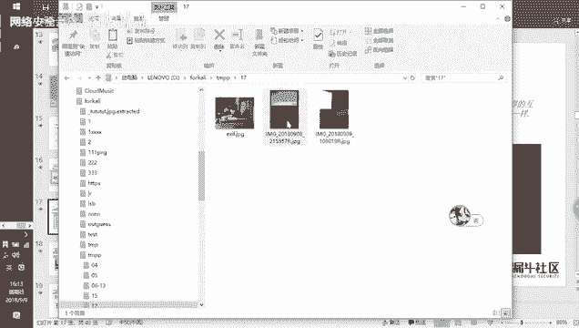

没有啊？这个是最黑板，也是我我开了GPS在这里拍了一张黑板，然后一一张是我在我家里面，我拍了，我昨天晚上拍的，我这两张还没过来之间，我拍了一张我自己电脑的的。😊。

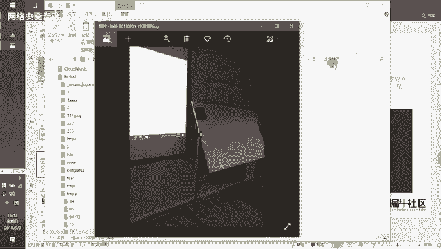

那这张是什么？这张是1个CTF屏目。应央是个CT屏幕。那这个CPF屏幕的话，正常的一个先给大家说下正常卡点，正常卡点是这样子的，就是你们右键，然后但然我右键可能有点多，你找到这个属性。打开。

然后这边有一个详细信息。假信信息这里面是可这边有一些值是可以写入数去的。那么这种提供简单方同审。我就可以看到这张图片发生面盘正据上。但我这边。有个密码密码。是样。有时候我我我要给你提示。

我不会直接在题目里面。我在E叉F里面告诉你一次，比如说我告诉你将密算码可能是某种算法，我再问你写。就这里面可能是有会隐藏一些信息，可能是一些提示，或者直接就是flag。如果它题目够简单的话。

就是flag。如果说想刁难你的话，可能就只只是一个个提示。那这里面的话我们来看一下啊这个呃我拍摄了，开了GPS拍摄来了解一下这个E叉RF。详细信息。如果说如果说我们是开GPS的话。就是你开定位功能呢。

事实上，你这张图片它是有1个GPPS的。是Yesすね。大家应该都学过地理。对，虽然说我也不是很懂啊，经纬度这个东西应该知道，所以说经纬度怎么表示，我还是不是很做。一般有一个经度，有一个纬度嘛，对吧？

那有精度和纬度就可以定位到你在地球上的任何一个点。比如说我这边是。什么26分5秒，然后是26度55分，然后52秒之类。那这个这个这个这个。怎么去尝啊？我下了一个软件叫做谷歌地球。那实际上就是一个地球。

然它长什么样子呢？它长这个样子。嗯，这实际上是一个地球，然后它是它是可以帮我们去。这个有点大。这上是个地球，然后我可以去输入我的GPS就输入这张图片的GPS。然后我去才看到，我去定位到。

地球的某一个点上面去。那这边怎么去增加这个标记呢？我可以添加一个标记点，比如新建一个坐标。那我家看已经添接好了，一张是我在我自己家里的，我们来看一下这个坐标是多少呢？我先看下图片的坐标吧。😊。

普变的坐标是。嗯。在这这是这是我这张图片应该是我自己加的。截个图。然后我们再看一下，我在国客拍了这张图片。我客拍的这个。主是这个，然这边是GPS。把它贴到这里面了。然后一般我们要添加我们的经纬度。

比如说我这个是2626度5分，然后52这边很精确啊，所以我不用那么精确，我只要取前面几位就行了。然后是119，是精度和纬纬度和精度。然后这个点的话，我把它标成汞汞。然后还有一个还有一个是这个叫国科。

国科的话。这个也是标好的，也是按照这个值序输进去的，把取名家广告退。那我说完之后，我就可以知道我在哪一个点了。比如说我现在是这个地球嘛，我还不知道我在哪个点。😡，然后我点击一下我这个点。

这个然是这在电脑有点卡，正常情况下它是很炫酷的对吧？还是很炫酷，你就可以定位到你当前在哪一个地图上的哪一个点。就你根据GPS你就可以去定位到。因为你能够清楚到你经到什州市，然后他们都清楚到什么样一个程。

这是明有道理是哪一条街道的？就是他能够定位到你是哪一个街道的。比如说我我家是在这里嘛，那国科在哪呢？国科在这个上街这这里嘛，所以缩小一点。😊，有点卡有点卡。就是隔了一个这个什么什么什么和。

然后应该在这个位置。对吧在这个位置嘛，我们在这个海西科技园嘛，这里面是这里面是海西科技园嘛，能白吗？嗯。Okay。最大能放到这么大。这个是什么？建平村嘛，建平村知道啊？就在隔壁。

那我们这边是海海西哥郡门啊，你你看看看不清楚这个海西哥郡吗，给你们看一个操场啊，知大操场在这。😊，能看懂吗？然后我们在这里面嘛，这个是那个海西科技园的大门嘛。然后这边是什么？这个地方是还西西客运站。

老师大操场在这嘛。能看到吗？所以这定位的还是非常清晰的。如果说你拍了一个照片，我可以定位到你究是在哪一个栋楼。所以为什么说你在朋友圈拍了一张照片，如果是没有关于GPS的话，你说我要出去旅游了。

你可能回来之后，你发现家里被偷了。就是因为这个原因。啊，这边只是做一个演示哦，那还有一个工具，还有一个工具叫做E叉I。在，这个工具因为我们可以直接，因为我们大家都是windows的。

所以我们可以直接用属性去查看。那如果你是linux，它也可以查看它linux，你去查看首性也能看到。然linux还提供了一个命令行的一个工具，叫做一叉I to。那可以直接把这个信息显示在命令卡界面上。

🤧这个。那这个我这个我就不愿示了，这个用法也很简单。直接是显示在硬R上面，这是属于这个嗯13M。OK那我们来看一下。比较我们常用的一些工具啊，常用的一些图片引写的一些方式。

首先如果你拿到然题幕有一种考点是他给你两张看起来完全一样的图片。他给你两张看起来完全一模一样图片，但是它其实是有细微的差别的那你要怎么去？你们有听说过异或吗？或者是加或者是减吗？什么意思呢？

就是两张图片去做异或，两张图片去做加，两张图片去做减，然后会得到。不同的信息。那么这个就是属于这是属于第一个考点。那这理念的话。我们需要用到一个工具，这个工具可能你们以后做所有的一解题目的时候。

你们可能第一件事你会想起它，因为它很好用。然后我们先来看一下。啊，我直接讲题吧，直接讲题吧。这边的话这个这边第一个好点是易货或是加或是呃，这个是减，这是加啊。

这个是加ADB是加SUB是减是单词的前三个字母。然后前提是什么？两张图片的信息是基本相通的。我们来看一下怎么个相同法，这个是当前18章。18我这边有有一个是这个叫做男神，这两张图片是一样的。

然后还有一个叫做女神，对吧？也是一样一样的。然后这两个考点是一样一模一样的哦。你们喜欢看男神还喜欢看女神？完了。其实都是一样的都是一样的。但是这样女神她还多了一个考点。这个女神她多了一个考点。

是多了一个图片引啊文件引写。就是这个女神她给的男神，她给的题目是一个压缩包，里面有两张一模一样的图片。女神不是这样子，女神就给一张图片，那你还要找到另外一张。那那给的是哪张呢？给的是这张。

这这张是我下载下来的，他给的是这张。😡，然后我们我看第一步是文件引写，怎么怎么个文件引写啊，你把它拉到最后面，然后这里面有一个什么下载链接。然后你点击这个下来，你就把这个图片下载下来，给到另外一张。😊。

所女人这张的话，他多了一个文件。你明白吗？okK那我们来看一下，我们要用这个工具。我们用这个工具，这个工具叫做stat。打下工具。实际上是一个java写的一个工具。

那么java写的工具就长得像你们用的DURP这种就很像，它就是一个花。拿就是个 job，那这种们可以直接打开，叫做stand。Po of。反正走了，反正这个。😊。

我再一种细节OK那大打开在在右在左上角有一个小小界面啊，然后你可以去打开我们的文件。😊，然后打开。至主要定位到我们这张图片在哪个位置。我这张图片在这里。嗯。因为文件比较多，刚刚是十8吧，女神，然后。

你们知道吗？所以我应该先也是忙。没事啊说一下。你们看一下，就是我们去做计货加码减？就是。你给是他啊。然后加CAPD嘛。点这HUB嘛。对吧。那么你们有没有想过疑惑可能不要紧。

疑或管我疑惑你疑惑我都是一样的，但是第二件能一样吗？不一样，我加你和和你加我哦，加应该是一样的，钱应该是不一样。😊，减直是不一样的嘛，减我觉你和你减果是两种两两个概念嘛，对吧？😊。

所以有时候这边涉及到一个顺序的问题，就是我比如我两张图片，第一张和第二张。我是拿第一张和第二章去做这三个操作哈？还是我拿第二张去对第一章做三做三个操作呢？它的结果是不一样的，能明白吗？

所以有时候你试一过一遍之后，你可能还要再试一遍，就是说没有主要信息的时候，你要试一遍。那我们现来演示一下啊，先演示一个错误的做法。我们先打开原本这张图片。哪怕长这个样子，对吧？哦，朱小叶。

然后我们怎么做呢？😡，他这边有一个分析，有个分析，点击这个什么。这个要做imagine combine呃。comp点点开，然后打开另外一张图片。来另外一张图片，然后这个时候这个操作是什么呢？😡，疑惑。

然后过来。货货运算，然后与运算，然后加运算减，然后什么RGP的各种各种运算。但这个得不到信息啊，得不到信息。流不到信息。还有什么？还有他其实不仅这三种，他这边这个软件提供了很多种操作。

但是我这边的话发现不对，就没有招信息了。但是我上次我操作顺序有误，高顺序有误。我们打开另外一张。我们先把下载的图片打开，然后我们去比较原来的这一张。那我们再来看一下。看到什么东西了吗？看到了一张二维码。

看看一张二维码，它是一个什么？它是一个简的操作嘛，所以减的操作是有区别的。我减你和你减我是两个回事。所以这边涉及到一个顺序的问题，就是可能加和订货都没有关系嘛。但是减的话，我减你和你减我是有区别的。

这张二维码是没办法扫出来的，为什么呢？为什么长这样子呢？为咪呀。应该是要相反的一个颜色吧，中间应该是黑的，外面是白的吧。所以等一下我们还有一个处理叫做反射处理，等一下会教给大家啊，这个放到下面。

我们现在已经得到二维码了。啊。😮，啊，这个可以没错。这个可以。这个要把这张保存下，等一下等一下等一下讲到不要急不要急。😊，那如果是男神的话，得到的是一张彩色的。彩色就更夸张了，你能明白吗？

彩色你根扫不出来，为什么？😡，维码你去手机去扫的时候，它必须是黑白两个颜色。有有时候这张图片扫不出来了。但有时候现在一些二维码做的很高级，就是它可以是彩色的，然后它也可以是动图的。

但是它关键的位置都没有被隐藏，都没有被隐藏掉嘛。但是这张图其实它关键位置都被已经都被彩色给占据了，所以你正常去识别就识别出来。我们有一个操作叫做取反，等下会讲到取反取反操作。那这是第一个。

就是两张图片去做各种相互的一个操作，基本上是这三个。但是这个软件它提供了更多的其他的一些操作。那再往下设这个GB有效位。最低有价位是它实上能够隐藏的信息并不是很多，就它能够隐藏的信息不是很多。

它只能把最低的一位拿出来比较。比如说。我们正常的一个图片，它是有3T摄影组的，你把它转成二进制。然后最第有就是我在这个颜色的最后一位去做一个去做一个隐藏。也就是说你们可以看到这张图片。我可以把这一个。

比如说我要去隐藏一个A字母A字母A，我先把它转成。这个2件4我能是。你样，然后把。每一个位。嗯，把这个位改成。要的这个安。继继续。啊可以得A。那这个是属于最低有效位。

那最低有效位是这1个CTF里面图片影响这一块，它非常喜样去考察了一个知识点。所以你见到很多题目，它可能就是最低有价位。那他考察方式也有很很多种。比如说我们去减最低有价位的时候。

其实它的解题方式也有好几种。但不止这么几种，我这边列了几个工具吧，有4个工具嘛，我今天就讲4个。这东西讲。ぜひの？4个这4个on脚本，en版你就要自己写个脚本。但我这本脚本都会给大家啊。

你们只要能够确保它能够运行起来就行了，明白吗？当然题目如果说他会题目是会有变化的嘛，我说什么出题处题人一开始可能就考你最简单的，后面他改了一个小变化，那你们可能就要知道就你用的是脚本。

你就知道我可能要他我要根据他这个题目，我改一下我的脚本。明白？所以这个是属于高级的一个高级的一个技能呢。那我们现在看下这个tistic，还是刚刚那个工具哦，对还是那样。

但只不过现在照片它来不是做这三个操作，而是让他拿去剪LSB减LSB那怎么去剪呢？比如说我们有一张图片，当片。你打开。然后点击分析，点击数据的一个这个单词叫什么？然后这里面的话我们要去。去分析他的一个。

种颜色的通道。然后把这个flag拿出来，但是这个过程你可能要点很多次，就是如果你用这个工具的话，你可能要点很多次flag才能出来。而且很多时候你还不确定它到底是不是考LSD。然后你点了很多次。

你就很绝望哇，点了好多次，然后还没出来，能明白吗？因为有时候你不确定你只是猜测它可能考的是LSS。然后又点了很多次，就说这这个层市比较痛苦的。我们现在看一下这张图片，这个是20张。20张。这次。熄熄灯。

然后这个实际上是一张就是这么一张图片。这个是之前我做那个有一个金融行业的1个CTL比赛。然后我做了一个题目，然后当时我。他就我就我我已经知道他是考了SB的，但是我没有把它点出来，我很感我很难受。

就这道题。😊，对我没有做出来啊，其实我已经知道他考什么了，我我就离成功差了一一步，我就已经离成功差一步，但是没有做出来，就很难受。那我们赶刚看看这道题怎么做呢？😊，他是个卡最低有效位。那么。

你看我刚刚那个软件有关了吗？啊，被我关了，我把它打开啊，我们再打开我们这个。St off。6是。然后打开这个这张这张图片，它实际上在这里面看到尺寸是非常大。那不用管它，我们看一下它这边有一个分析嘛。

还有一个da一次。然后然到是这么一个界面，那里面的话。因为我们知道这里有消微是藏在每一个。嗯你用软件，你用程序去，比如说你程序写的不够好去识别每一个最定位的。你这个过程是很复杂。那你用用工具的话。

他可以直接帮我们去把最低的一个月筛选出来。我们说了嘛，一个颜色它是有8位的。所以比如说红色它有8位。绿色有8位，然后蓝色有8位，最低有8位是哪一位？最后一位。但是这边涉及到一个顺序的问题。

你是RGB还是GBR还是BRG，对不对？所以这个时候就是。我们先来讲一下最简单的，比如说我就假设它是RGB，然后我点这个preview点下去。

来看看看这边可以根据这个playee you去生成相应的一个数据嘛，能明白吗？他把这个最最后一位提出来，然后生成相应的一个数据。你发现这是一堆案码。那当时我说了吗？这道题没有做出来，为什么呢？

我都没有想到他是点这一个，然后点点。因为当时还不是很了解啊。然后flag在哪里呢？你看得到吗？这个是flag，这就是提交的。这但这边还有好多个按钮，就比如说什么coon啊。

什么LSB first啊MSB first，然后你要点好多次嘛，就后面找了一个工具是不需要点的。你直接把所有的都给我拿出来的，明明白吗？就你知道为什么要找这么多工具吗？因为你你会发现。😊。

一个问具能解决问题吗，那有时候反会公视掉一些东西。这个工具叫LSD。那我们现在来看一下第二个第二个。第二个它是一个mini行的一个界面。密码。limmux下去运行。然后这里面的话。

这个也应该在里面工具包是没有的，因为它需要下线安装。他需要在线安装安装命令怎么样呢？你们在开里面输入这一条G installstore，然后je。就是按输入这一条命令就可以安装了。所以它需要在线安装的。

所以我们在工具端是没这个门令。杨波呢也没有这个秘密。然后这个是别人写的一个工具了，其实。然后我们要怎么去检测呢？这个时候它这个东具的好用之处就是我们不用去猜测它到底是RTP还是。他说每。

他会把所有可能隐藏的文本信息把它显示出来。比如说我这边对吧，还是多道题。那我输入jeestal加上这个文件名。然后他会把这边的所有的可能性全部列一遍。明白啊，他要把这边所有可能性练一遍。

然后中把有值的这一串。显示给我们。所以这里面的话就是方便我们去。他便我们去查看的。这边我稍微演示一下吧。

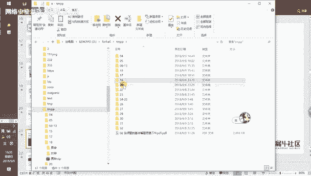

前提是你可以命个时要去安装这个命令了。JS第一句。Our model。

然后他会把这张图片的所有的这个有最低位的数据显示出来。比如说有这一串还有这一串，然后这里面就是flag。所以很多时候是这样子的，就是一道题你做不出来，不是因为你不会，而是因为你没有这个工具。

明拿这样子有时候就是。一道你你做不出来，不是因为你不会，而是因为你没有这个工具，或者你不知道这种方式。就是这样子。OK那我们来看一下下一个。下一个这个是属于。是一个工具哦，这工具很强大。

它不仅是针对图片的最低有价位。他可能还针对这个。那PDF的或者是其他一些文件格式的这些有效位。那它针对的文图片的GPG，它一般针对的是这个图片。叫做哎。BMP就点BMP的图片。没张。

就是如果你你这张图片它是。一张图片它是BLP的话，你可以用这个件去简密。大家其实用前面种工具也是可以的。前面其动工具可以，只是给它增能加一个工具而已。但是他还有一个就是他除了BMP以外。

如果是PDF的话。他也可以去做嘛。就PBF的就得有价位。他也可以去做PDF，所以他只是多了这么一个功能而已。那么在于就是说你不会做一道题，就是因为你没有一个工具的原则嘛，所以我们要讲一下这个工具。诶。

那这个工具的话用法其实很简单哦，就是它是一个图形化界面，那它可以去做加密，也可以去做简密。密把打开，然后直接演示了。这个在我们的工具包里面叫做we web store。嗯，找一下啊。嗯是。应该是要这个。

他没有没有像我们那个完整名字，应该是叫这。那照这个WBS43open在V32。🤧你这个往先讲打看。打开打开最后这1个ESE文件。然后我们打开打开就长这个界面。那这里面的话，你就按照他这个步骤。

步去做就行。那我们点击比如下一步，不好意思，点击要退出，点击cont6，然后你可以选择你是要去decode，还是要去decode。那一般我们是要去decode。然后decode之后。

这时候你可以看到它支持的一个软件类型。比如说支持的是这几种格式的，比如说BMP的。TST的HTR还有PDF的。所以他这个光机为什么信要工具呢？就是它支持的格式更多一点。它是这4种。

所以如果你遇到其他文件的，最低有效味的话，你可以使用一下，尝试用一下这个工具。那这里面的话，我们首先要导入我们张图片。那这个的话，我看一下我这张图片是。PPT啊PPT这个是22页。22页这。

这边还是有一张叫女神的一个图片。然后这张图片的话。这张图片它实际上它的一个格式是PBG的。如果你直接用op去处理，是没办法处理的。因为我们刚刚说了，op能处理DNP，那怎么办呢？

你把JVT转成DNP就行了，怎么转呢？我现在这张是什么就BG的吗。啊很简单，用到我们的最简单的一个工具，叫做画图工具。右键打开方式，然后选择画图。然后把这个图片另存为。应娠为应生。并存为一个。

你可以选择一个格式嘛，把选择BMP嘛，明白了？画图是很好的一个图片格式转换，但他还有等下还有其他的一些操作，比如的我说取法。或者是水平翻转呀，垂直翻转呀。基本的一些操作，我们用最简单的软件去实现它就行。

先把它转成BMP保存一下。然后这边又多一张BMP实际上它的打开并不影响哈打开，但是对这个软件去解密的时候是有影响。我们要打开这个软件。打导进来，然后点下一步，下一步的话。因有有时候。

如果他提示你就是用这个软件去加密，你说候。他可能还有一个密码。那密码可能在哪里呢？可能在其他地方，它会提他会隐隐隐约的去提示你。那如果没有密码去跳过，这个地方是写密码的。那接下来是我们要把这个。文件。

那个地方去。就是我们要把它保保存在另外一个地方。比如说我们保存成11吧。就是把这个文件解密之后，保存到另一另外一个位置。下一步。然后点这个继续。然后他告诉我解密完成。Okay。然后我们就可以退出来。

就说来我们看到这么一个图片嘛啊，这个有个文件，它是是它生成的，就它前面完之它生成的那这个文件怎么打？我一开始我也不知道，一开始我开始我打开的时候，我发现它是一串乱码。那遇到这种乱码的话。

我们就要用十六进制边机去打开，看看是不是。所以我们用随机进去打开。然后你会发现开头就是。这个fag。听到吗？这个是一个这个思路。那这张图片的话。也不是说一定非得要你非得要用这个工具去解。

我只能说这个工具他认识的是场。比如我们用刚刚的刚刚的这个介绍的工具去解它，比如说。

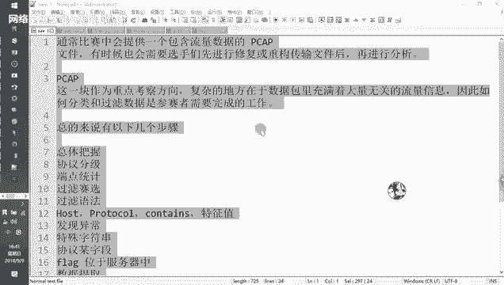

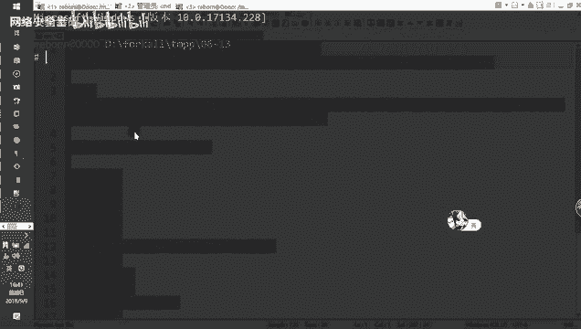

你先退出来。呃，这。刚共是多少。该是22吧。有这里面，如果我们用刚刚的比如说标ID考这个软件去解它。我们甚至都不用把它整成BMP的。我们只。🎼直接扫这1个JPG的。然后我们就可以得到这个flag。

明白啊，这是不是更更明显一点对吧？这更明显一点。这是一个。O。我看一下这边有没有其他的题。20okK没有，你们继续。完是这是地方。然后再看。就是你先这个大脑上。然后你写的是吧。他觉得用工具太low了。

他想用。其实也不一不是这样子的，就是说有时候处理人稍微改了一两个位置，结果导致你这个工具就识别不出来了，会解密不了。因为如果正正规正规中矩的，我们去解密嘛，它是解了出来的。但是出题人动了一个手效。

比如说我就是把某一个位置给它加了一个一减了一个一这样子的那这个时候你实际上用正规的工具，用工具就现成的工具，你是没办法去修改它的嘛。所以你没办法根据它的一个变化去变化，所以你得要要用这个PY脚本去实现。

那么。这里面这个这个甲本啊这个甲本。这两人后面。我等一下，刚刚那个我先讲，就是我的那个题库我一发给大家，嗯，大家回去可以去练习。另一外习惯很简单，就是。这面蓝字蓝在哪里呢？蓝色我这个脚本要怎么去写？

我们去用它的时候，其实并不难的。我们要改一下这个文件名。改下文件名，然后就行。所以这个地方这个步骤难在于如果它有变化，我们怎么去修改脚本而已。那这里面不同的脚本，你就要能够稍微有一点这个脚本的一个知识。

比如说我们要怎么去设一个变量，怎么去设一个循环，怎么去做一个简单的操作。这个部分属于比较高级的一个部分。那。我这在直接给个脚本直接给个脚本。我来看一下这道题，这道题它的解法有很多种方式。啊。

脚本只是其中一种，只告诉大家可以用脚本去来解。这边是23的。23。就这么一张图片。电脑。啊，这张图片的话，如果他要零1点01点BMP嘛，零1点BMP。如果你直接用你的脚本去跑的话。

就这是我我写了一个脚本，我们用n头派加加去编辑它。然后把你如果它是不同的文件，你就在这里打文件名改完就行。然后怎么用呢？用其实很简单。

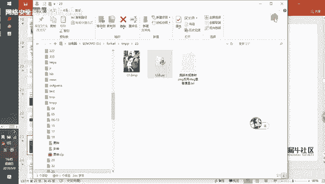

就是右键。然后你要确保你的电脑安了python的环境。比如说PY，然后这边是LB。

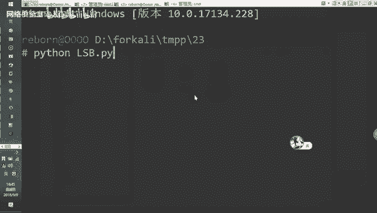

回家拿给大家一张图片。能难吗？我觉得很简单。那如果说我们不会写加本，我们怎么去解这道题？😡，这个是如果不会写脚本的话，这道题有点麻烦。我是后面还知道啊，就是我们要先把它转成PNG。

然后再用stat去查看通道。怎么转啊，还是要把这时候他是个BNP嘛。我们来用画图去把它转。嗯。要准要准这道题要准。我试过了。卡利自动有各种卡利，为什么要推下他卡呀？它自动各种环境是吗？

什么原影响到自源上都有。大部分都有的生这个。所以卡利它是一个很好的，因卡利是什么来的呢？它是以前他前身还不叫凯利，前身叫BT5。但是那是以前那些这个黑客，他们把自己用了很熟练的工具。

把它集成在一台linux上。然后后面发现这个工具这个些工具都很好用。所以把它变成一台虚拟机，然后把它放到这个自己网站上去推广。先把它另成为PNG啊，另存为。嗯。😊，我这个是23。然后保存成PNG。

然后我们用tatical去打开它。那这个时候我们去可以去查看它的一个通道。在在某一个通道里面有。嗯，找一下。我在镇。我看到是隐约可以看到，那这个通道还不对。Yeah。哦，对了是吗？哦，对对了。

就没拉上去啊，就是这样子查开它的通道，这样也行。那看一个，如果你很清楚它是怎么样一个方式的话，写脚本是最快的。这你改一下个老本用一下工具。OK那么这个是属于脚本的一个范畴。O那么。你继续啊继续。

然后这一个是属。对文件的一个。呃，怎么说呢？就是灯呢或者是那个连色通道啊去做一个处理。那接下来又回到了我们回到这个文件的一个类型的一个引写啊，实上它一样的套路就是说。我就是把你这个图片弄残缺了。

弄不齐了，然后给它弄错料了。然后也就你这时候去修复这张图片。那很多时候是这样子，就是取证类的话，比如说你电脑突然出现了什么问题。比比如说这个你去抓范人，然后换能出担那些删数据。

然你冲过去它已经数据已经删掉一半了，你要把这个图片它记录过来。差不多是这种场景。那这里面的话。第一个是这款叫做？一般这考点的话，如果要让我们去修复图片的话，很大程度上是他给了一张PNG的图片。

那他给了一张PNG图片之后，你发现它是没办法打开了，或者是打开出错了，或者是这张图片它只显示了一半，它一半没有没办法显示出来，因为它只显示了一半，拍一半没办法显示出来。那这个时候有两种原因。

第一种是一般是有两种。可能还有位知原因，他还没有出来。一种是这个吸安器酱液。可能是CR系教验呢，就是它一个头部。他一个文件的一个头部。比如说我这是一个文件。我可能这边是文件头，这个是长度，这个是宽度。

这个是高度，这个是CRC。什么意思呢？就是我根据你的头部长度、宽度、高度之类的一些信息，我计算出一个校验值。计算出一个校验值，我保存在这个文件的头部上面去。有时候是这样子的，就是我这个交验值是错的。

或者是我这个高度是错的，因为高度错了，也就也会导致校原值是错的，明白吗？高度错了也会导致值错的。那这个时候我们要去检测一下说我们这张PNG它的吸C到底有没有问题。所以我们要用一个工具叫做T位1个PNG。

我们去校验我这张PNG它是不是有没有问题。那这当然你可以用其他的一些，当你校验出来之后，你就可以去。把这个校验纸给它改回来，改回来就是用我们的随续定制编译器去修改。那这里面的话。

首先我们看一下这个TV课这个TV可PNG这个工具。T week。在这里TV是一个图形化的一个界面，然后看你电脑是多少位，我电脑是64位，我就打开64位。然后我们用TV去打开它。

然后比如说我们用我们用这个打开。打开，然后。先看下这个是24张PPT。诶，op。open，然后找到。找到我们那张图片。哦，好。地盘。这里面。这个。TMPP24。啊，这边有好多张哦，我。先打开随便一张嘛。

这边每一张都是。呃，大概这张吧。🎼它会是出错。还是出错，这这刚刚每一张都会出错，就是。是不是要告诉我们什么呢？😡，他说CIC交点错误了。CC算你错误，然后当前可能是CBD6DF8A。

那应该是这种C7什么58D77。这是属于C系校验错误的一个。那西安这错误有两种情况嘛。我刚刚说了，第一种就是真的话把它改错了。第二种是高度错误，导致他计算之后或者是宽度错误，导致他计算错。

这个CI下面是错的。那么这道题是属于真的真的就是但它两种题实都可以去做了，就是。我先来看一下。呃，我们要去改它嘛，改它也要用我们的情况是去打开。然后去把这个值，因为他说正确的是哪一个嘛，错的是哪一个。

所以我们它替换一下就可以去打。这是第一种。第二种是你发现T one还是没办法，还是不对，就是你T one过去还是不对，为什么？是因为。他的高度有问题。像刚刚这样这几张图片都是高度有问题的。呃。

先把它放下来。我们先来看下这几张图片的一个特点。

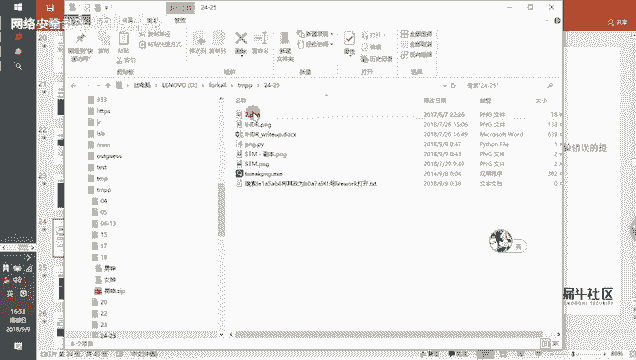

比如说爆点偏N距。他长得这样。然后如果你他的高度是正确的话，或者他现在这里的话。盖一张。比如说这张。就他如果说他的。高度是对的话，它在下面这一部分会显示在延长显示一段flag值。然后还有是。

这一张最明显的。你只看到半张的二维码，那还有半张在哪里，还有半张没有显示出？

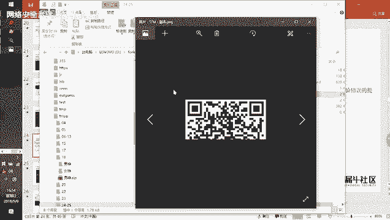

去讲完之后，然后才能得到另外半张的二维码。那这里面的话，我先把PPT讲完啊，我先把PPT讲完。😡，这是我刚刚讲的第一个思路，就是。他的加交案错误了，所以我要把其他性词给它改回来，这是第一个。第二个是。

它并不是CRRC错误，而CRRC错误的本质是因为它的高度或者是宽度错误了啊，致它计算出来得到的这个CRRC只是错误的。所以我们显示的看到是图片是产出来的。那这个时候我们要去计算。

我们要去计算这张图片的瑕息纸，那你们不用考虑，因为我已经帮你们。这个不用。那这个计算的角段已经把里面写好。我们先来看一下这个基本知识啊。就是一张图片，比如说这是编距的，他的头部是890。

然后他后面的几个字段，比如说有4个字节。有四高自己明。000Bcheck叫做强度检测。在后面4个检测检测类型，就check类型，这个都不用我们去考虑。我们要考虑的是接下来这8个字节，这8个字节。

这个是宽度。啊，四合字节4。每次都测是个宽度，做是高是也是个高度。那一般的情况下，就是他这边高速被篡岗。高度越上杆，所以它只能显示这么。如果感成正常，就正常显示这张图片。所以为什么奥米码会少？

只能看到钱那么大。那也就是说我们要去计算这个高度和宽度。然后把这个。你还没行吗。那这里面的话。再往下再往再往下这个地方，081C7E。DB这个是属于虾压系。也就如果你。直接去修改C压器的话，你来改那个。

发这四个字。打几万过来就行了。那我们先来看一下第一种。就是我直接去替 one这个C压细致的。嗯嗯。我们去我们去替换下这个2点PN去。那为了为了保证这张图片不会被我修改，我先创建个副本。对吧参加个副本。

我们对副本去做一个修改，让保留原文件嘛。那们又检啊先先检测一下，先检测一下这个图片的吸压细。O看。🎼恶点天剧。然后告诉我们是这个。对吧告诉我们这个。

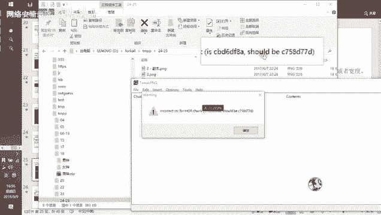

然后这时候用010的地头去打开它。按照我刚刚说的那个格式啊，那我们应该知道吸压系在哪个位置吧。是不是在这个位置？你可能看不是很清楚啊，你放大一点。CBD6DF8A嘛，是不是当前是CBD6DF8A？

然后应该被设置成什么C758D77D，能明白吗？那也是我们把这个TIRC给它替换过来，你可以一个位一个位去改。但我比较偷然的一个做法是我直接搜索替换，怎么搜索替换呢？就是我先选中它。

点search点replace，然后再往最下面。最下面这个位置。我把它换成怎么了？把它换成这个回。我把CBD6F8呃，DF8A把它改成。7758。T77D，然后我直接修改，把所有的修改掉了，我不较偷懒。

应该没事的，应该没有保保保守的做法是，你又有没有去修改，我不想修改，我直接替换掉了。啊，踢换掉之后呃，回回过来。

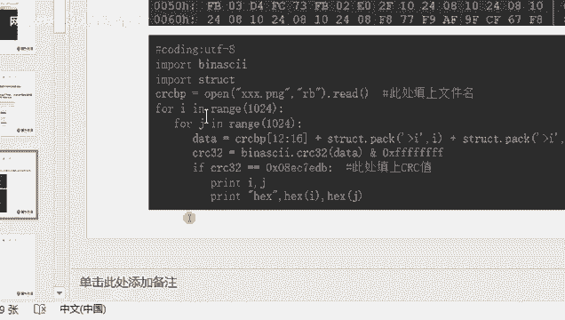

还没保存啊，还没保存。我点击保存。然后这个时候我们再去看一下我们这张图片，副本这张。

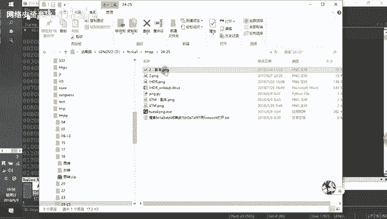

李真像。没参下。还正让黑用车是有问题。因为资央图边也没分效。那也就是说明说它不是西系的一个错误。那这个时候我们就是要去计算它的一个高度的，能明白吗？

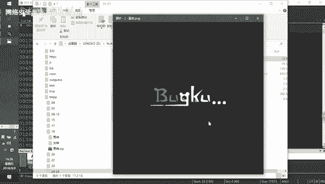

你把这个关了。不用我们来算一下高度，那高度的话就是要去用到这个python脚本。是不用到这个嗨心牙本。那。我这边放了三张图片啊，你们后面回去做的时候，它的做法可能两种方式都可以，咱只能用其中一种方式。

所以最方便你们去练习的。呃，我再我把这张图片删掉，我重做一张副本。然后我要去比如说把改个名字吧，改个3点PNG。然后我要去改这张副本副本哦改这个脚本。这个脚本的话。答两个。这个位置是文建名。

第二位置呢第二位置是西RRC值，当前的一个西RRC值，把它放在这个位置。然后他们根据这个西安。报错这个是压G值应该正确的一个高度啊。高高度和宽度是什么样子的，明吗？

也就他会根据这个吸压计是计算正确的高度和宽度。Now。看下方案还在不在。再打开一遍。我们现在是3点PMG。当前的一个CR细值应该是CBD6DF8A嘛。所以我们改成这个是不对的嘛，刚刚已验证过了。

所以我们改它改成。这个刚好就是了刚好就是CDDF。嗯，CBT6DF8A没错。我们运行一下这个脚本就行。我这边的话输了两个值，第一个是十进制的，第二个是十六进制的。为什么要显示十六进制呢？

因为我们去修改的时候是直接对十六进制做操作的。

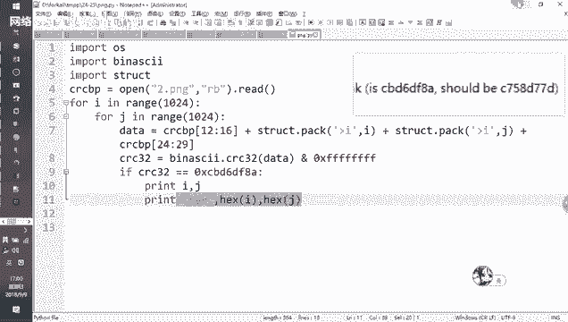

那我看一下。这个改成3。我声一下。然后运行一下这个pathon脚本。然后告诉我高度应该是500500，然后。沙EF403业。嘛，所以我们要把这个值改成名叉EF4。

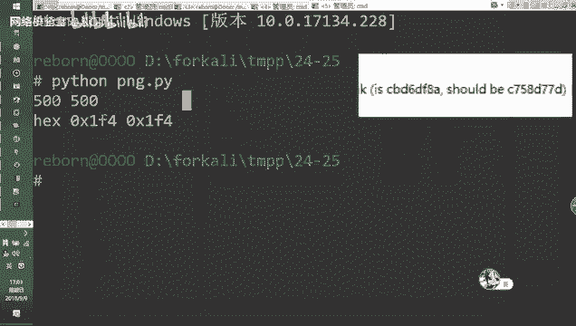

看看这个。那我再用我的020艾特。

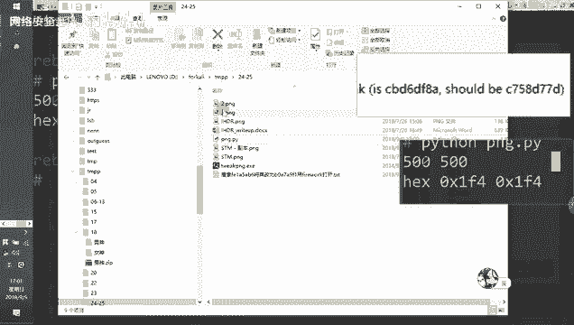

打开这个三点偏距。高度是在哪里呢？😡，是在这个位置。那我们看一下。我说的是什么？零叉EF4EFEF4嘛，你要一个数据在前面添加零是没有影响的。有0000001呃0001是同一个值吗？看一下。

前面这个是什么宽度宽度是多少？宽度是四字节的嘛，所以是000001F4嘛，没问题吧，高度呢？华路出错了，000001A4，这个A是错了。F4。你听到吗。把它改成F4OK。发生。那我们去把它打开。

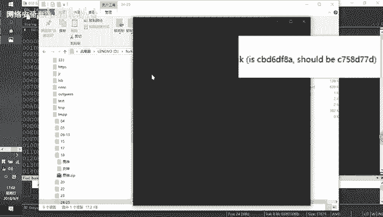

看到没有？怎么是不是看不到？你看到吗？第一款。嗯。因为有个flag可能看的不是很清楚，但是就是出来了。那其他的题目都是这样这两种方式，其他图片啊我放了好几张图片。其他同学同样是这种操作，要么感谢阿西。

要么改高度，这高度要去。如果你要改高度的话。你去看一下。别人写的一些答案嘛，他可能随便改了一个高度，那这个这样随便改是有风险的，是不一定改的对。一般要去校验一下。因为他会把高度调高嘛。

那以前我去看别人的答案的时候，他说把高度调高，我也不理解他为什么要调这么高呢？会用划线的，其实是可以去计算一个正确的值的。

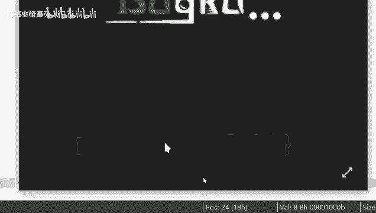

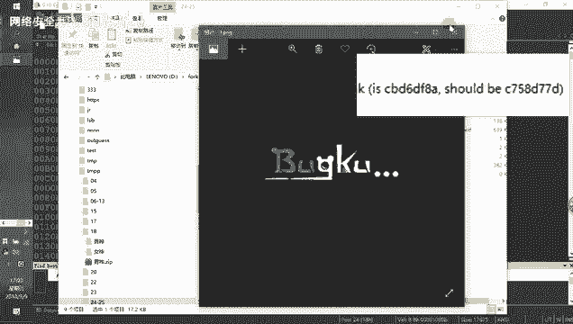

随便调不一定可以，比如说吸压是错误的，它就打不开了。OK那我们来继续啊，我们。你们几点下课，还有半小时。没事，我们慢慢讲慢慢讲。应该还有还还还不是很多了，还有一些接下是加密的这一块，接下来是图片加密的。

那这里面的话，普遍加密。补重新加4到5克了。那。他加密了，那我们最简单的一个想法就是你加密了，我就解密嘛。那我现在就要知道你我只要知道你是什么样的加密方式，我就可以用什么样的解密方式去解密。就这么简单。

那第一种叫做BF two。那这个时候你要看。屏幕有没有各种？小提示或者是隐晦的小提示，然后常常我会会的。告诉你这个图片可能是BF toolss。或者是你去尝试他的这间复讲你。然后你要不要付。

然后这里面的话解密的一个方式很简单哦，就是你猜到这个命令啊，它也是命令哈。接下来解密的这几种。应该有好几个都是咪密行的，咪密行和咪密行，你其实也不用怕，就是你知道怎么样就行？

然后这里面的话就是他这拉命密呢比较长一点。比如说我们去解密这个文件。然后把它输出出来，但输出出来之后，这个文件。就收到1个123，就123还不是，你要再去解一下这个文件。啊，我演示一下演示一下。

我们这个是26。26，等下我我等下会把。这个文件拷给大家嘛，你们就可以去根据某一张PPT的内容去做一个练习了，明白吗？啊，DF托是在这里我。为了方便啊，打卡在这里。把它拷到同一个目录下。

然后我去打开它写命令，命令有时候我也记不住。

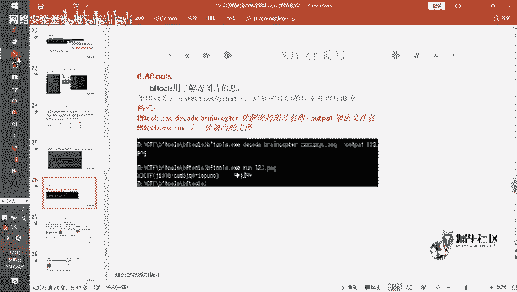

所以接一下命令。明令好像其实很多啊，有时候 meaning令命为记不住时没有没有什么关系的。

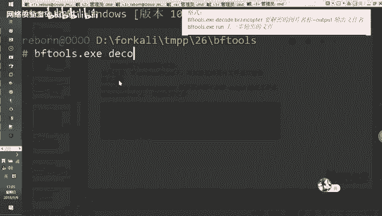

decoded，然后是。GPT1样。对对在。😔，广坡有123点PNG。啊，这个时候你在桌面上。你会看到有1个123点PNG。那接下来我们再用这个BF toolss。然后去乱一下这个123点PNG。

老椒我翻。所以这个是这个题目其实就这样子做的。听到吗？这时这题目很简单，就解密的话，其实南站在哪里吗？南站你不知道它是什么加密方式。第二个是你知道它是什么加密方式，你找不到解密工具。这是两点。

其他当你这两个都知道的时候，其实你去解它就很简单。这是第一个加密的，再往下叫做let Istar on。那这个是一个图形化的，这个是图形化的。我们我已经我已经提前打开了。哦不是这个。

反正就是就就是stand啊。然后刚然也是一个交易方式。对这种加密的话，用宝演示一遍就行了。我们打开。打开我们的文件。TMP然后是这个27的。然后我们直接去做一个解密。然后点击decode。

然后打开这个flag TST。保存在。我现在当前目录在在。🎼Tose O。那这个时候我们来去这个文件一下，应该已经解密成功了。在二期。所以解密方式都很简单啊，解密方式都很简单。然后有时候他可能需要密码。

有没有如果没有输密码，就没有密码，有需要密码就输入密码。然后再往下是专门针对JPG这种格式的图片去做加密的。其他可能是通用的。第二可能是专门针对JPG的图片的一个加密。那这个时候有4种。

然后我加了一个检测工具。就是第一个要检测工具。检测工具这工具叫stay。叫什么？taget啊 strategyt。那它会识别这么些加密方式。所以如果是这些加密方式的话，它都可以识别出来。

它识别的时候就是我们直接识别它，但是它有时候识别的时候，它可能不是那么准确。所以你要把它的敏感度调高一点，它有一个敏感度，比如说加个S。加个小S，然后把这个敏感度调高。你说候你识别是错误的。

就以他可能比如说它明明是第一个要做JPhead，结果它显示到第二个了。但你你发现解密不成功。这时候你要回来把敏感度调高一点，它可能识别率会更高一点。这个是首先要如果是JBG。

那你确认了它是JBG的加密方式，那你去识别它的一个解密方式。然后得到比如说F5或者是out，或是呃这个绝Bhead都有可能。然后解密完之后，我们接下来就是针对。软件去点两。那这种图形画的都很简单啊。

就是把它打开，然后把它去解密就行了。所以我这边就分讲。对工具就是把它打开解密。然后剩下这两个，一个是。按out的话，它可能需要编译一下，它需要编译一下。怎么是编译呢？你们有没有在大家该有学习语言吧。

对吧？你们学蜥语言的时候是用了什么软件？威胁的微信微信。67601那个。有没有人在利6时项？写写这个吸引人的。😊，没有，如果你们老师我们老师比较变态，他教你们在linlinkux下写细，不叫你们。

件的话，你们就会知道什么叫编译的，就是编译嘛。你们喜完西藏就要去编译嘛，对吧？😡，那这个工具给你们给到你们大家多设一堆的C文件，你们而且它是一个linux下的。所以你要要用这个文件的时候，你们要去编译。

能懂吗？能懂我的意思吧？那编译也是一条命令的事情啊，条命令的事你们知少是。先把自己提升到管理员权限，提升入口学限。就是你你是录入账号的时候拿去编译。编译的时候是一条命令，就是这条命令吧。

输到电脑听到干脆目录下去做一个。拼完之后这个工具才能去用，因为它是C吸盐具。然后接下来就解密解密的方式很简单啊，很简单，就是按照这个格式去解就行了。所接下来这两个。就是按照你的格式去解F5的话。

它是一个要用java去解。F5它解密解密的软件是一个java，所以你要有java的一个环境。那为什么会让你们安这么多环境？就是你可能各种语言都要。包有。那这个就是因为C的话一般都是有的。

就是不管windows还应ow。一般我们安各种软件的话，就会有各种C的一个环境，其他环境可能没有。F5也是这样子的一个方式。那这这两个我就不多讲，因为他雷他实际上就是就是当你要知道他怎么一回事就行。

那再往下，我们来讲一个小。就是。这个二维码的。能告诉你啊历尽千辛万苦得到一张二维码。然后结你发现二维码扫不出来了，为是我用二码上还这个人还在二维玛做了一些搜权。比如说。他可能把这个黑的变成大的了。

然后某一块马上去去掉价了。所以你要。他们说的是你要精通PS，所以并不需要你只要简单的掌握一下耗手工具就行了，不要那么夸张。那这里面的话，第一个就是截嘛，截一个软件，然后比如把这个黑文变成白的嘛。嗯。

这种是属于叫做什么股权二维码啊，补权二维码。有的这边是一条狗。它实上这边是一个一个这个方块嘛，黑嘛，它变成一条狗了，结果你识别不出来了。所以把这个狗P完成这个黑的，然后就可以识别出来了。

这是一种动要补全，这个很简单。第二种叫做取放。这张图这张图片它是识别不出来的，然后你去取反取反，然后它有一个反射的一个操作。我们来简单看一下。30。但是这这不管他。3一3一是这。So。嗯。

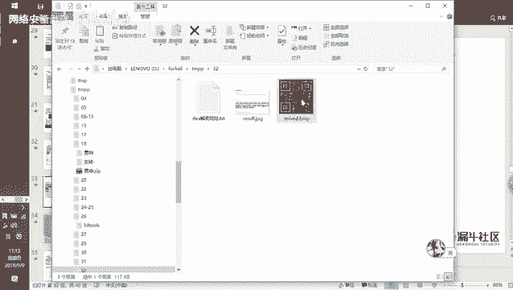

这个吧这个。这张图片嘛这张图片。

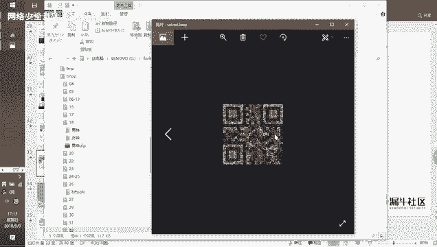

呃。怎么就没有一张好的图片呢？算了就这样吧。这张图片有两种方式啊，两种方式。我们先来看一下第一种。第一种是我们用画图去取反，但这张图应还是没办法去反的。只我先用我就因为我没有贴贴那个比较标准的一张哦。

我就先演示一下。就是我们用画图打开它。然后呃。我们去选择有一个反射。能看到我的操作吗？就是我先点了一下选择，我先点了一下选择，然后我再右键反射能看到吗？就是都时候你一进来是一个笔嘛，你是一个笔嘛。

你点进去是写的嘛，我先点了一下选择放大一点。😡，我已进来先点了一下选择，然后我右键。反射那这个时候黑的就变成白了，白的就变成黑的。但这然是一张彩色的，所以反射完之后就变成这样子。这个这个。最需要的。

为什么呢？我们先我先不不反射吧，我我先先。并全部去掉。那这张可能更复杂一点。这张图片是我们刚刚那个刚刚还没印象。就我们刚刚那个男神男神的图片嘛，嗯接下来还有好几个坑，反涉及到反射。

反射完之后要选择颜色通道，选择电动外照做一次DES的。他有3张二维码，三张二维码给你三个信息，一个是解密密钥，密钥本身，还有解密的算法。然后你根据这个去解密。那这个时候密码学我们还没讲下节课讲。

所以我们先先先放下下节课讲，因为我我这边有三次课，下一节课还是讲咋项的。然后下次课讲密码学，密码学还没讲。那我们先来看一下这个当头电啊。张图片的话，如果它是纯黑白的，我们反射一下就可以识别了。

那识别的话，对于二维码。对于二维码来说，我们。我这边有一个观注家有没有这个，你们可以有1个QR的，我这个更好用一点，我是可以直接扫描桌面上的二维码点击，然后他会去扫描，但现在没有扫描到嘛。

他说没有识别到二维码，因为他没有识别到这个是二维码。😊，这个时候这个图片是在还要去做一个处理。啊，因为它是彩色的。我想。如果你平时直况好的话。随便拍测。但是我PS不用乱好，所以我用了一个工具。

还是那个stgo。用可以去查看它的各种颜色通道，那么肯定有一个通道是纯黑纯黑白的，怎明白吗？然后这个时候我就打开。那个stistic。然后把这个图片打开。啊，我这个不是同一个目录像。

所以打开要时间有点久。32，然后。但是这个。应该这个。然后打开之后，我们去。我们去查看它的颜色通道了。他有他肯定有通道是原来他指这张，但是我去扫描的时候没有扫到，有这张。因他有好多张。

嗯连这张还就是另外一张这张二维码和这张二维码是两张二维码哦。😊，这是两张二维码，这张也扫不出来。😡，很多都扫不出来的那我要去做什么？我要取反之后才能够扫出来。呃，先点选择，然后反射。哦，直接保存了。

这先取消一下。我先弄个副本吧，不影响原图片的一个一个识别。就我单天晚上改完之后，你们到你们那边就没有练习环境了。画图。然后选择。白色，然后保存。okK然后我们再用再用这个statical。我天哪。

我这个哥那个完了。好吧。O。刚刚那路径是哪的？32。然后是个副本。来看一下有的通道。这个还不是。这个这个是一张二维码的，所以这个是可以识别出来的这是第一张。一张要什么呢？

叫DES也就是告诉我们这个加密是一种DES的一个加密。这是还是第一个第二个。好像有3张。三班是不是？

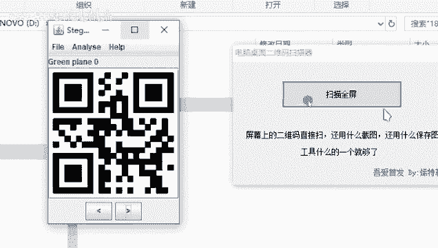

这张是一个。这个是一个密钥。这是一个秘钥。诶。

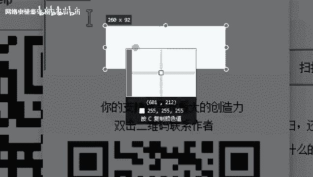

啊，截一下。我们得到一个密钥。那我们继续。

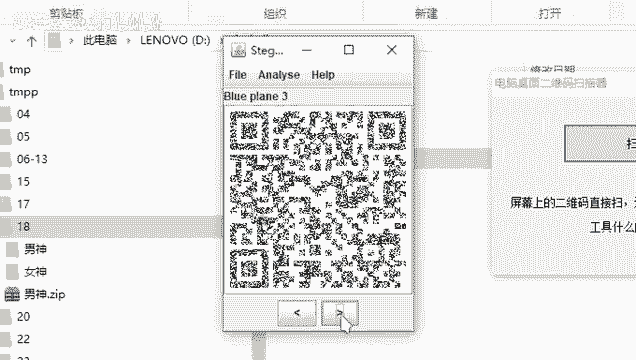

这张然后我们去扫。这个是密文。这个是密文。

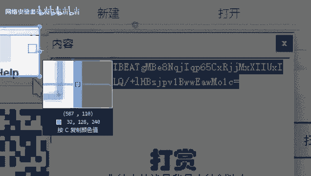

然后我们去一个网站，这个网站后面。我去有个网站解密，然后把它解出来了，那我这边就不解了。我已经我昨天晚上解完了，解密网站是这个。呃。诶，我不了。OK保问不了。我直接给他看看结果吧，因为加密加密简历。

我这边先不讲。

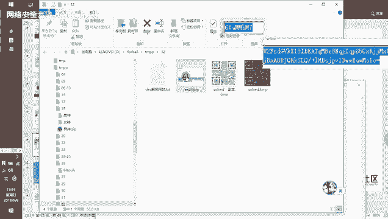

这是我昨天。🤧嗯。

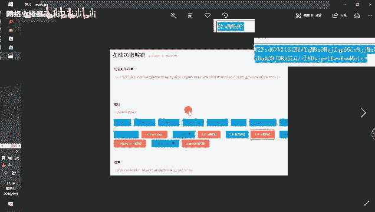

的一个结果就在这里面放上放上这一串密文。那这里面放上密钥，然后我们选择第一S加解密，然后得到这个flag值。

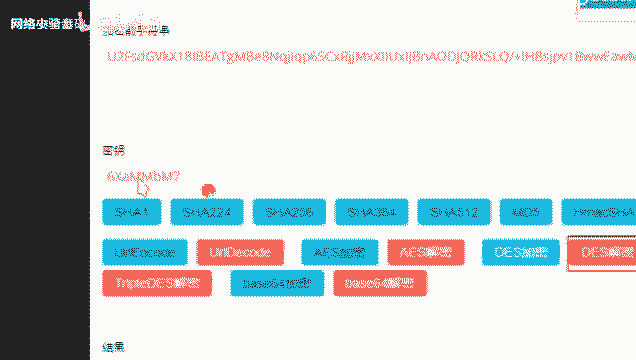

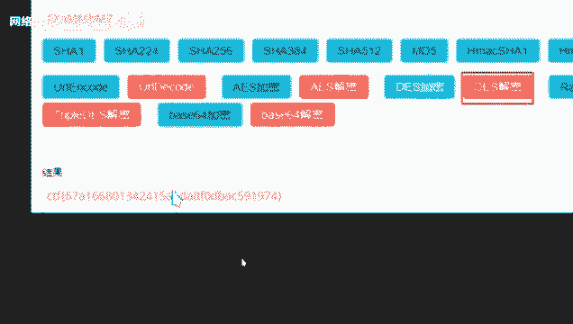

所这图题目是连完，他考察的。这连环的连起来的。那这是图片的一个取版的一个操作。那我们先到这里结束吧，因下一部分是压缩包了，第三部分有内容。我们今天下午就到这里结束了。然后大家回去的话。

就是我等下会把这个题目发出来。然后大家根据我这个PPT的页数去做一个相应的练习。

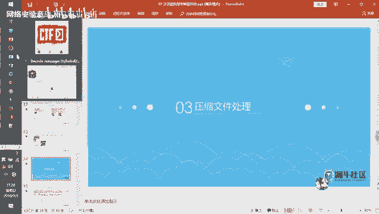

因我应该讲了很多题了。