# CTF入门教程：P12：13. CTF夺旗赛基础流程与信息收集实战 🚩

在本节课中，我们将学习CTF夺旗赛的基本概念，并通过一个完整的实战环境，演示如何从零开始进行信息收集，以发现并获取隐藏的Flag。我们将使用Kali Linux作为攻击机，对一个预设的靶场进行探测。

## 概述

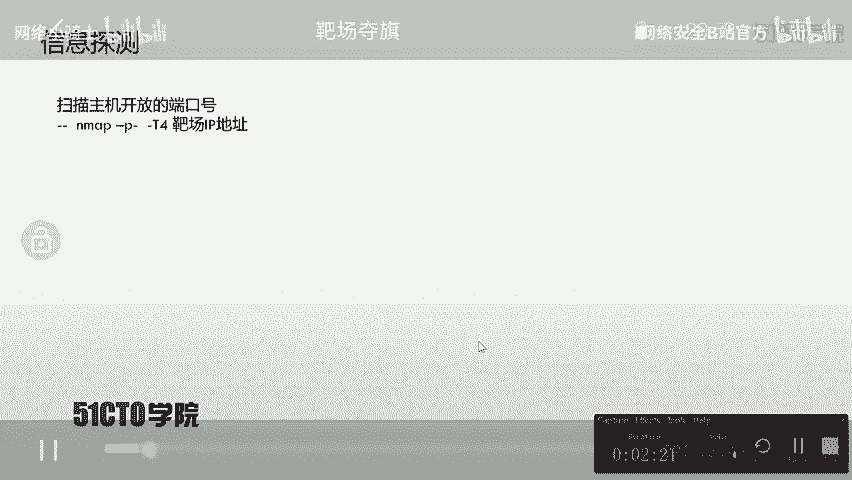

CTF是一种流行的信息安全竞赛形式。其英文名可直译为“夺得Flag”，也可意译为“夺旗赛”。其基本流程是：参赛团队之间通过进行信息对抗、程序分析等形式，率先从主办方给出的比赛环境中得到一串具有一定格式的字符串或其他内容，并将其提交给主办方，从而得到对应的分数。为了方便称呼，我们把这样的内容称之为**Flag**。

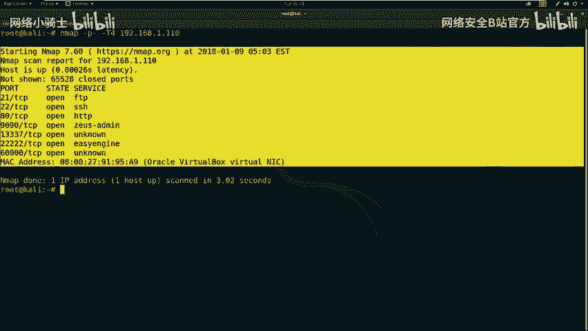

在CTF比赛中，涉及内容比较繁杂，我们需要利用所有可以利用的方法获得对应的Flag。

## 实验环境介绍

本次实验环境如下：
*   **攻击机**：Kali Linux，IP地址为 `192.168.1.111`。
*   **靶场机器**：Linux系统，IP地址为 `192.168.1.110`。

我们的所有操作都围绕一个核心目标：获得靶场机器上的Flag值。

## 第一步：信息探测

在获得靶场机器的IP地址之后，我们需要进行第一步操作：信息探测。目标是发现靶机开放了哪些服务，这些服务可能隐藏着Flag或漏洞入口。

### 端口扫描

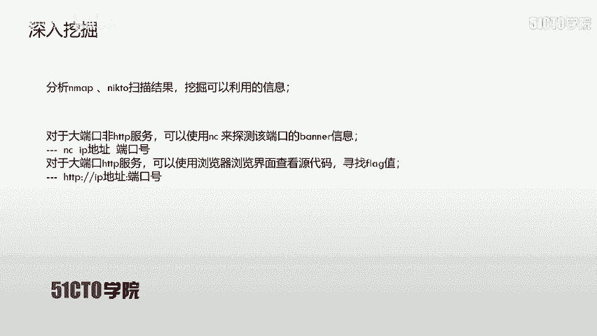

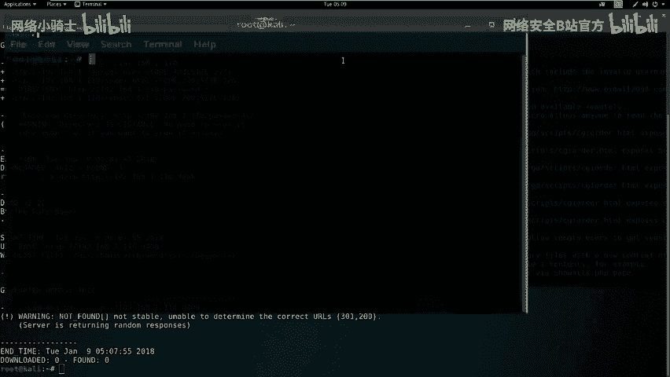

首先我们来探测一下靶场机器开放的端口号。这里我们可以使用Nmap工具。

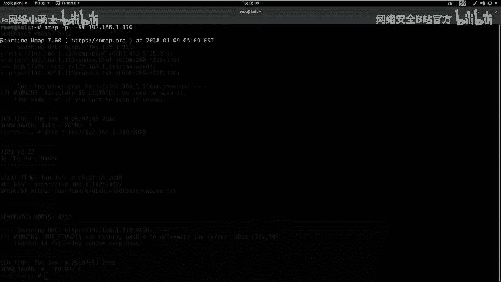

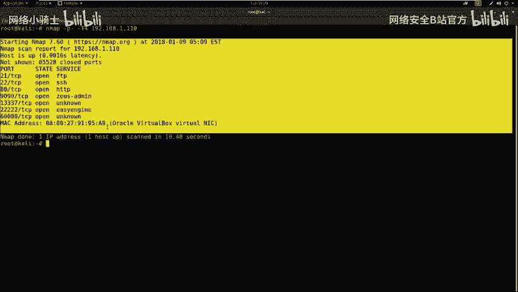

以下是进行端口扫描的核心命令：
*   **快速全端口扫描**：`nmap -p- -T4 192.168.1.110`
    *   `-p-` 表示扫描所有端口（0-65535）。
    *   `-T4` 表示使用较快的扫描速度。
*   **全面信息探测**：`nmap -T4 -A -v 192.168.1.110`
    *   `-A` 启用操作系统检测、版本检测、脚本扫描和路由跟踪。
    *   `-v` 显示详细输出。

**注意**：在实际探测中，建议结合使用以上两条命令。因为全面扫描（`-A`）有时会遗漏某些非常规端口，而快速全端口扫描能确保我们发现所有开放的端口。

### Web服务敏感信息探测

对于扫描结果中开放的HTTP服务（如80、8080、9090端口），我们可以使用专门工具探测其敏感目录和文件。

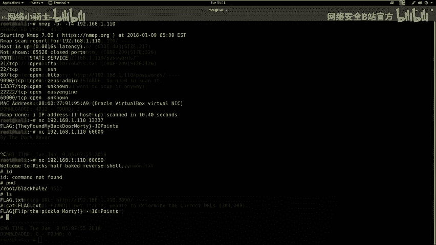

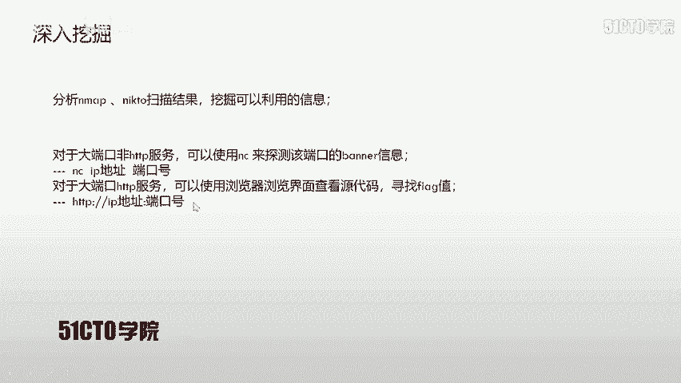

以下是两个常用工具及其命令：
*   **Nikto**：用于扫描Web服务器，寻找潜在的危险文件和配置。
    *   命令格式：`nikto -host http://<靶机IP>:<端口>`
    *   如果端口是80，可以省略`:80`。
*   **Dirb**：基于字典的Web目录扫描工具。
    *   命令格式：`dirb http://<靶机IP>:<端口>`

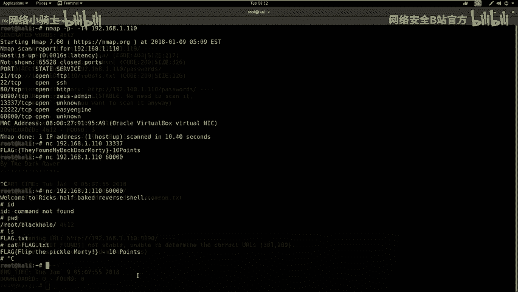

例如，针对靶机的80端口和9090端口，我们可以分别执行：
```
nikto -host http://192.168.1.110
nikto -host http://192.168.1.110:9090

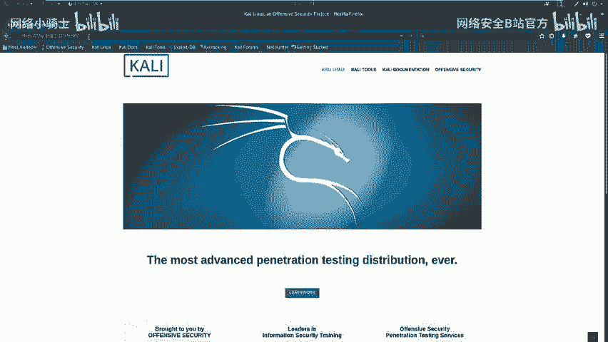

dirb http://192.168.1.110
dirb http://192.168.1.110:9090
```

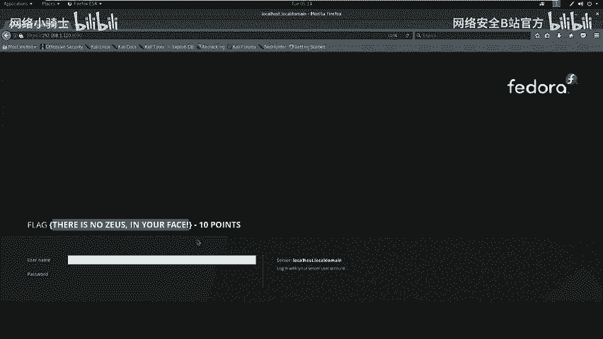

## 第二步：分析扫描结果并深入挖掘

在信息探测完毕之后，就可以对我们探测到的信息进行对应的深入挖掘。我们需要分析Nmap和Nikto的扫描结果，挖掘其中可以利用的信息。

### 探测未知服务的Banner信息

对于扫描到的大端口（非标准端口）且服务未知的情况，可以使用Netcat（`nc`）工具来连接并获取该服务的Banner信息，其中可能直接包含Flag。

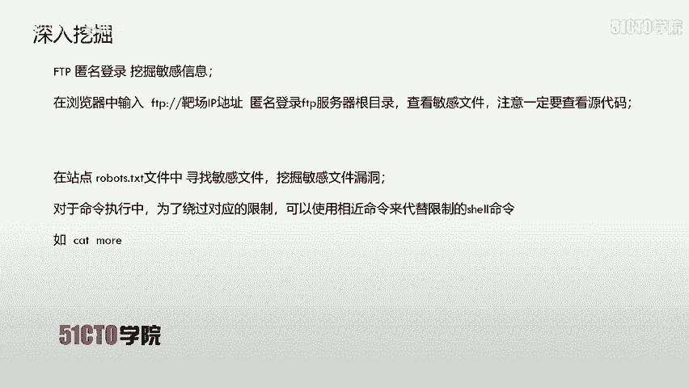

命令格式为：`nc <靶机IP> <端口号>`

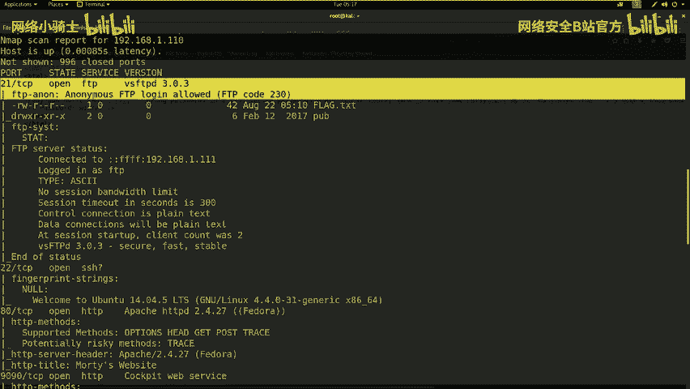

例如，扫描发现靶机开放了13337端口，执行 `nc 192.168.1.110 13337`。返回的Banner信息中可能直接包含第一个Flag。


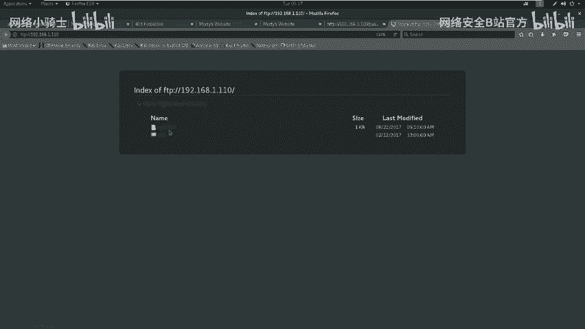

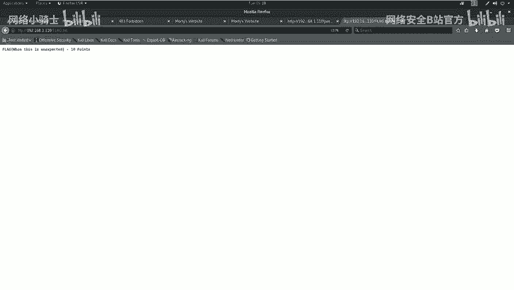

### 检查Web页面与源代码

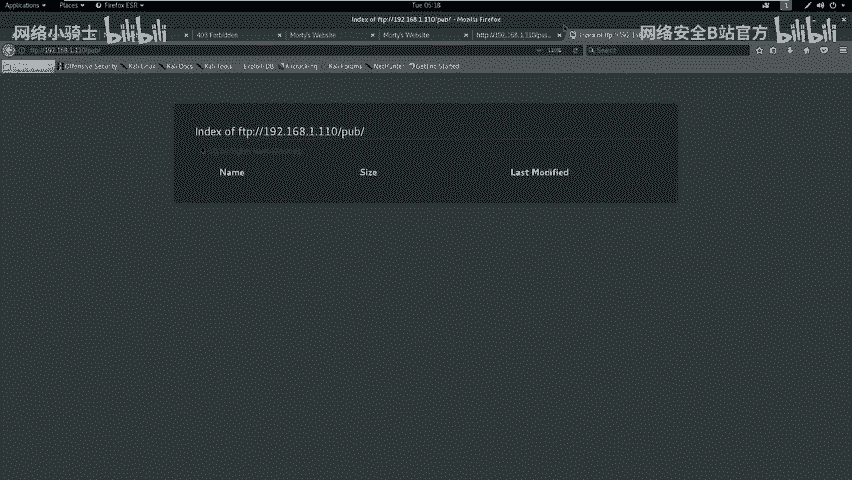

如果扫描结果中存在HTTP服务（无论是80端口还是像9090这样的大端口），我们都可以使用浏览器直接访问。查看页面内容，并**务必检查网页源代码**，因为Flag或提示信息可能隐藏在注释或JS代码中。

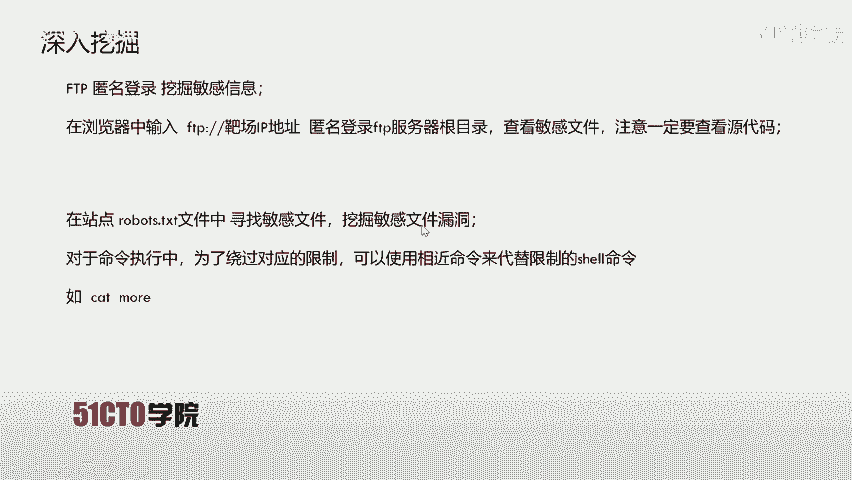

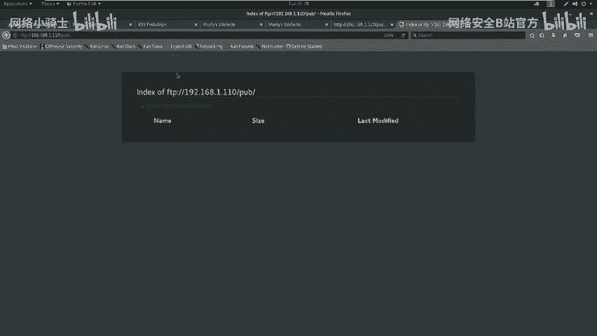

访问时，URL需要包含端口号，例如：`http://192.168.1.110:9090`

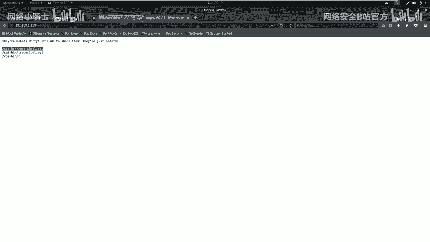

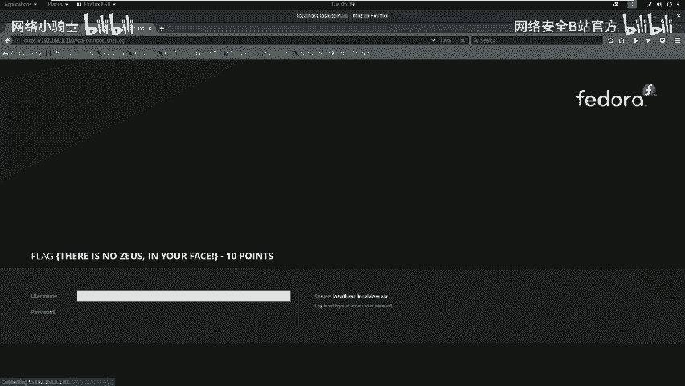

### 利用敏感目录和文件

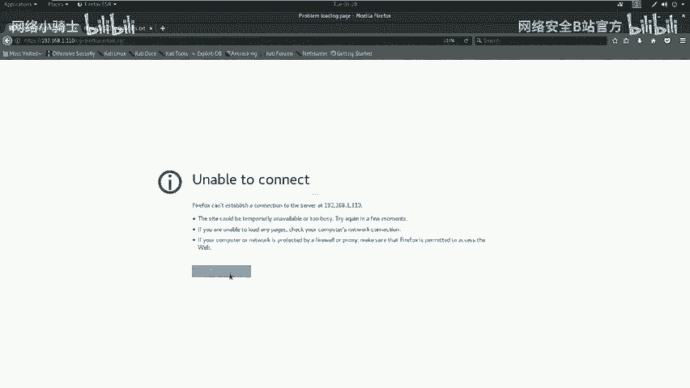

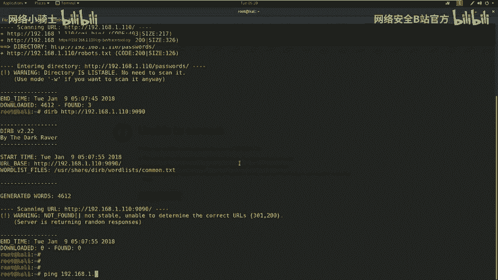

根据Dirb等工具的扫描结果，访问发现的敏感目录。例如，扫描可能发现 `/passwords/` 目录，访问后可能找到 `flag.txt` 文件。同时，检查该目录下其他文件（如 `passwords.html`）的源代码，可能发现有用的密码提示（例如密码是 `winter`）。

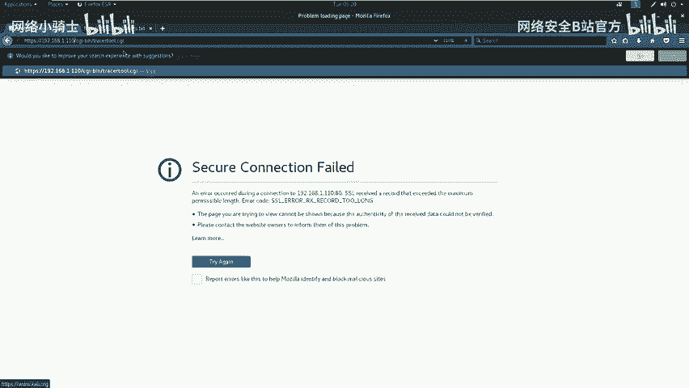

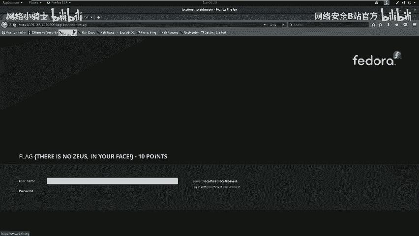

### 检查其他开放服务

不要忽略其他常见的服务端口。
*   **FTP匿名登录**：如果发现21端口FTP服务允许匿名登录（`Anonymous FTP login allowed`），可以在浏览器中输入 `ftp://192.168.1.110` 进行访问，检查根目录下是否有 `flag.txt` 等文件。
*   **Robots.txt文件**：对于Web服务，访问 `http://192.168.1.110/robots.txt`。这个文件可能列出网站不希望被爬取的目录，这些目录有时会包含敏感信息或测试接口。

## 第三步：漏洞利用与权限提升

通过以上步骤，我们可能已经收集到一些信息片段，例如一个用户名（`summer`）和一个密码（`winter`）。现在需要思考如何利用它们。

### 尝试远程登录

Linux系统通常使用SSH进行远程登录。查看Nmap扫描结果，确认SSH服务端口（通常是22）。尝试使用发现的凭据登录：
`ssh summer@192.168.1.110`

如果标准SSH端口被拒绝，注意扫描结果中是否有其他端口运行着SSH服务（例如52022端口）。尝试指定端口连接：
`ssh -p 52022 summer@192.168.1.110`
输入密码 `winter`，可能成功获得一个Shell。

### 绕过命令限制与寻找Flag

登录成功后，使用 `ls` 查看当前目录，可能会发现 `flag.txt`。尝试用 `cat` 命令查看时，系统可能返回一个猫的图案而不是文件内容，说明 `cat` 命令被过滤或替换了。

此时，可以尝试使用功能相近的命令来绕过限制，例如 `more` 命令：
`more flag.txt`
这样就能成功读取到Flag的内容。

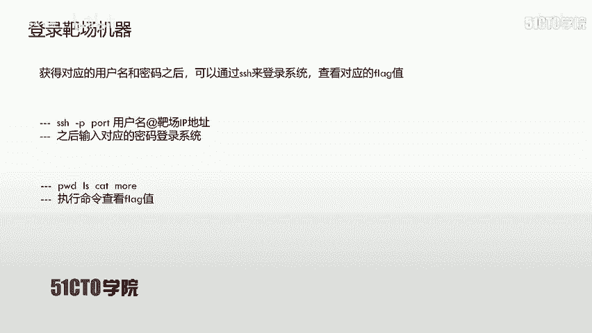

## 总结与核心要点

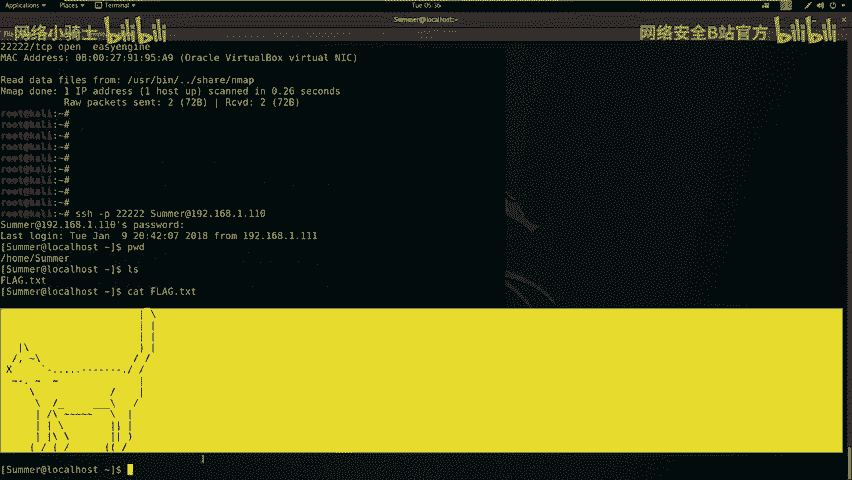

本节课我们一起学习了CTF夺旗赛的基本流程，并完成了一次完整的信息收集与简单漏洞利用实战。以下是需要牢记的核心要点：

1.  **全面探测**：对于未知服务的端口，务必使用 `nc` 获取Banner信息，这里可能直接暴露Flag。
2.  **深入挖掘**：对每个发现的服务（HTTP、FTP、SSH等）都要进行深入测试，不要放过任何细节，包括页面源代码、文件列表和默认配置文件。
3.  **灵活变通**：当遇到命令被过滤的情况时，尝试使用功能相近的命令（如用 `more` 替代 `cat`）来绕过限制。
4.  **信息关联**：将收集到的零散信息（如用户名、密码、隐藏端口）关联起来思考，它们可能是通往下一个Flag或更高权限的钥匙。

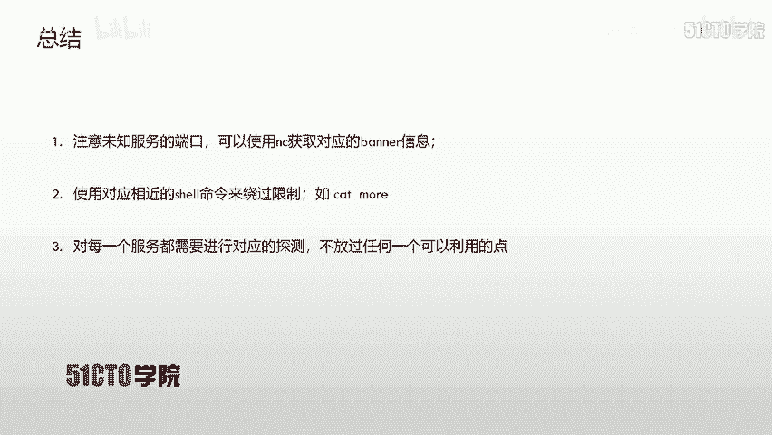

在真实的CTF比赛中，需要仔细认真地挖掘每一个服务当中的弱点信息，才能有效地获取对应的Flag值。