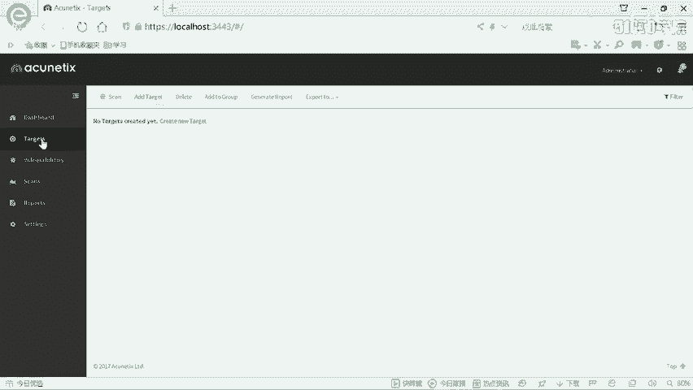
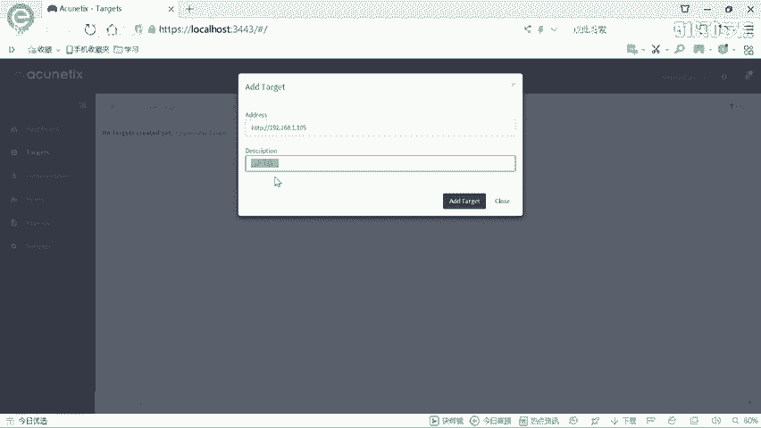
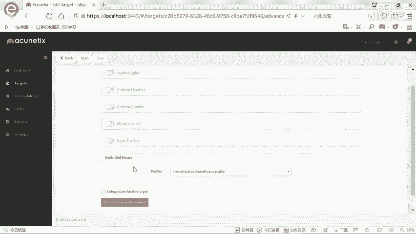
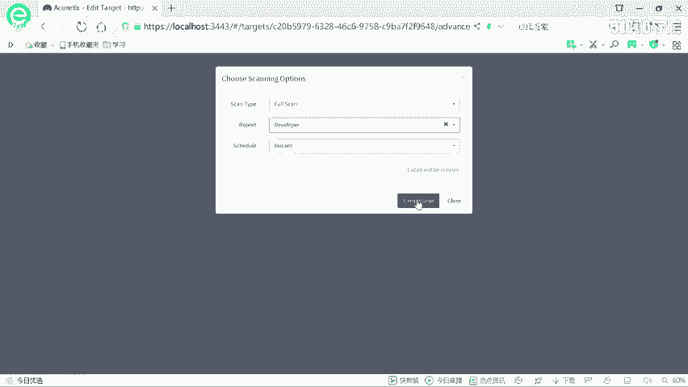
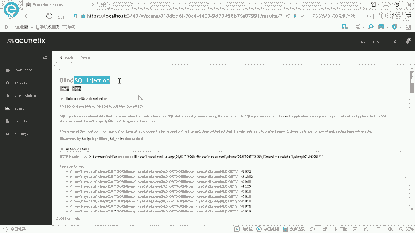
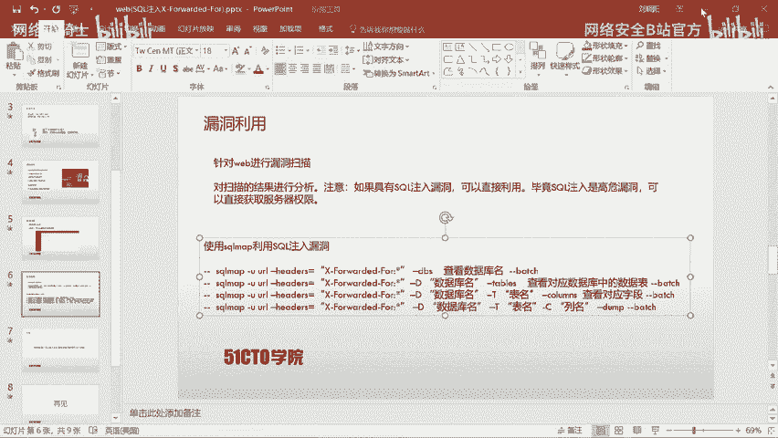
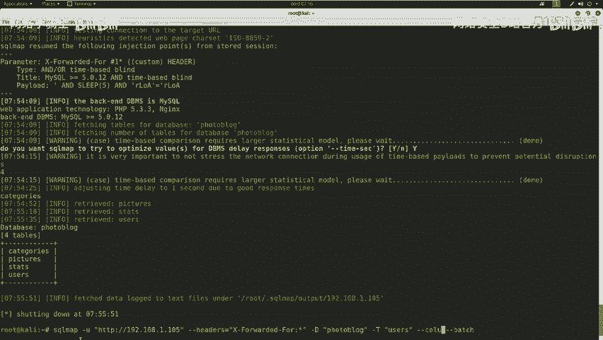
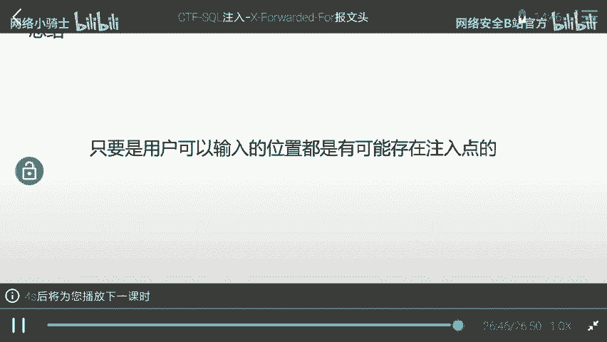

# CTF最强战队蓝莲花内部培训教程：P15：16.CTF夺旗SQL注入X-Forwarded-For

## 概述
在本节课中，我们将学习SQL注入漏洞的基本概念，并通过一个实战案例，演示如何利用HTTP头部（X-Forwarded-For）中的SQL注入漏洞，最终获取目标系统的后台登录权限。我们将使用Nmap、Nikto、AWVS和SQLmap等工具来完成信息收集、漏洞扫描和漏洞利用的全过程。

---

## SQL注入漏洞介绍
上一节我们概述了本节课的目标，本节中我们来详细了解一下SQL注入漏洞。

SQL注入漏洞是一种常见的安全漏洞。攻击者通过构建特殊的输入作为参数传入到Web应用程序中。Web应用程序执行了这些传入的参数，导致执行了未预期的SQL语句，从而使非法数据侵入系统。

需要强调的是，任何用户可以输入的位置都可能存在注入点。例如：
*   用户可以在URL（网址标识符）中输入任意内容。例如，一个以GET方式提交的`id`参数就可能存在注入点，攻击者可以在此构造恶意SQL语句。
*   在HTTP报文头部，也存在可以操作和输入的位置。构造相应的语句同样可以完成注入攻击。

---

## 实验环境搭建
了解了SQL注入的基本原理后，我们来看看本次实验的环境配置。

*   **攻击机**：IP地址为 `192.168.1.104`。
*   **靶场机器**：IP地址为 `192.168.1.105`。


我们拿到靶场IP地址后，目标是挖掘其Web漏洞，最终登录系统后台，获得操作权限。

---

## 信息探测
在开始攻击之前，我们首先需要对目标进行信息收集，了解其运行的系统和服务。

我们使用Nmap工具来探测靶场主机的服务信息及版本。在Kali中执行以下命令：
```bash
nmap -sS -sV 192.168.1.105
```
Nmap会向靶场发送数据包并分析返回结果，以标准形式输出服务信息。

为了获取更全面的信息，我们可以使用更强大的扫描参数：
```bash
nmap -T4 -A -v 192.168.1.105
```
*   `-T4`：以较快的速度进行扫描。
*   `-A`：启用操作系统检测、版本检测、脚本扫描和路由跟踪功能。
*   `-v`：显示详细的扫描过程。



执行扫描后，分析结果发现靶场只开放了80端口的HTTP服务，服务器是Nginx。



---



## 敏感信息扫描
在确定了HTTP服务后，我们需要进一步探索该服务的敏感目录或页面。



我们使用Nikto工具来扫描靶场机器的Web敏感信息。执行以下命令：
```bash
nikto -host http://192.168.1.105
```
因为目标开放的是80端口，所以可以省略端口号。Nikto会快速扫描并挖掘服务器内部的敏感信息。

扫描结果显示，找到了一个管理员登录界面（`/admin/login.php`）。我们通过浏览器访问该地址，发现是一个博客网站的后台登录页面。

---



## 漏洞扫描
面对登录页面，我们首先尝试了常见弱口令（如`admin/admin`, `admin/123456`），但均告失败。因此，我们需要检查网站是否存在其他安全漏洞。

我们使用AWVS（Acunetix Web Vulnerability Scanner）这款功能强大的Web漏洞扫描器。它更新迅速，能覆盖大多数Web安全漏洞。



1.  打开AWVS并登录。
2.  点击 `Targets` -> `Add Target`，添加目标地址 `192.168.1.105`，并添加描述。
3.  保持默认设置，选择 `Full Scan` 扫描类型，生成报告格式后开始扫描。

扫描需要一定时间。在扫描进度达到约32%时，AWVS报告了一个高危漏洞：**盲注（Blind SQL Injection）**。

查看漏洞详情，发现漏洞位于HTTP头部的 `X-Forwarded-For` 字段中。AWVS提供了攻击脚本和验证详情，确认这是一个可利用的SQL注入点。

---

## 漏洞利用
扫描到SQL注入漏洞后，我们使用SQLmap工具进行自动化利用。

根据AWVS的扫描结果，注入点在HTTP头部。我们使用以下命令进行利用：
```bash
sqlmap -u "http://192.168.1.105" --headers="X-Forwarded-For: *" --dbs --batch
```
*   `-u`：指定目标URL。
*   `--headers`：指定存在注入点的HTTP头部，`*` 号表示注入位置。
*   `--dbs`：枚举数据库。
*   `--batch`：以非交互模式运行，所有提示都选择默认。

SQLmap开始基于时间盲注进行探测，并逐个字符地返回数据库名称。我们得到了两个数据库：`information_schema`（系统库）和 `photoblog`（用户库）。

接下来，我们探测 `photoblog` 数据库中的表：
```bash
sqlmap -u "http://192.168.1.105" --headers="X-Forwarded-For: *" -D photoblog --tables --batch
```
命令返回了4张表，其中 `users` 表很可能存放着用户凭证。



然后，我们探测 `users` 表的字段：
```bash
sqlmap -u "http://192.168.1.105" --headers="X-Forwarded-For: *" -D photoblog -T users --columns --batch
```
探测出 `id`, `login`, `password` 等字段。

最后，我们导出 `login` 和 `password` 字段的数据：
```bash
sqlmap -u "http://192.168.1.105" --headers="X-Forwarded-For: *" -D photoblog -T users -C "login,password" --dump --batch
```
SQLmap成功破解出数据：
*   `login`: **admin**
*   `password`: **P4SSW0RD** (此处为明文，实战中可能是哈希值，需进一步破解)

---

## 登录系统
获得凭证后，我们返回之前发现的登录页面 (`/admin/login.php`)。

使用用户名 **admin** 和密码 **P4SSW0RD** 进行登录，成功进入系统后台。在后台中，我们可以执行多种操作，例如文件上传等。

---

## 总结
本节课我们一起学习了SQL注入漏洞的利用全过程。

1.  **信息收集**：使用Nmap扫描端口和服务，使用Nikto发现敏感路径。
2.  **漏洞发现**：使用AWVS进行自动化漏洞扫描，发现HTTP头部 `X-Forwarded-For` 字段存在SQL注入漏洞。
3.  **漏洞利用**：使用SQLmap工具自动化利用该注入点，逐步获取数据库名、表名、字段名，最终导出管理员账号和密码。
4.  **获取权限**：使用获得的凭证成功登录系统后台。



通过这个案例，我们可以深刻理解：**SQL注入可以发生在任何用户可输入的位置**，包括URL参数和HTTP报文头部。在实际的CTF比赛或渗透测试工作中，合理利用自动化工具（如SQLmap）可以极大地提高效率，快速完成任务。