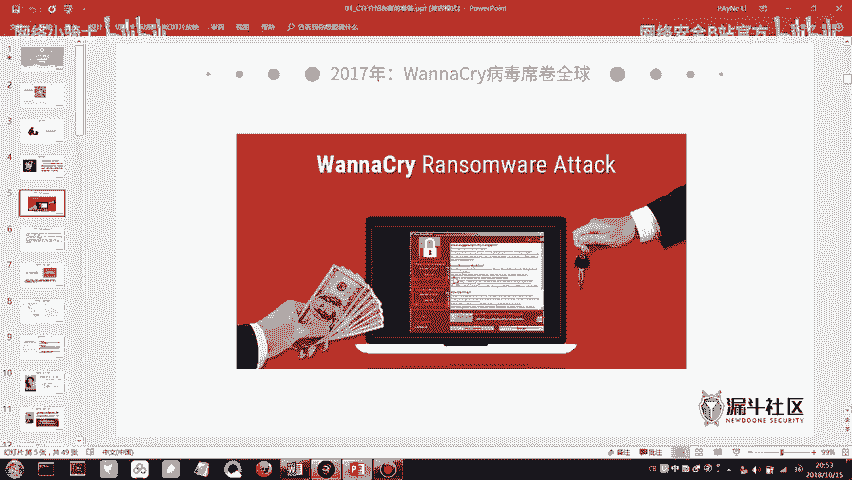
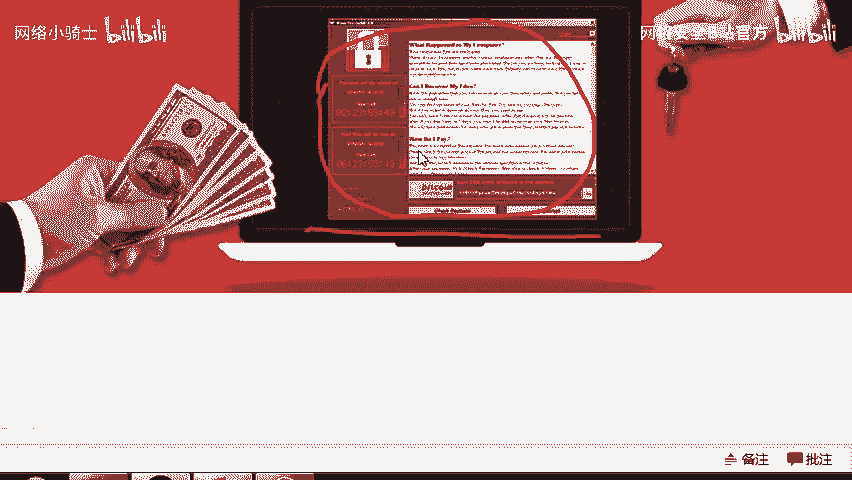
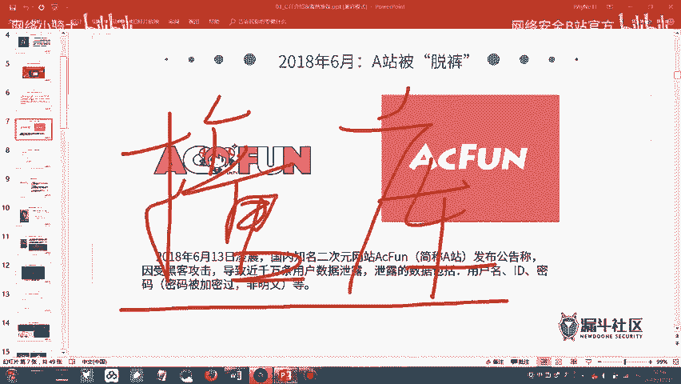
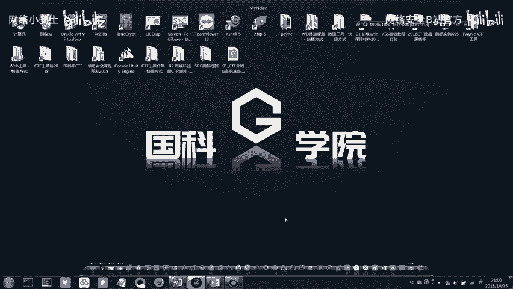
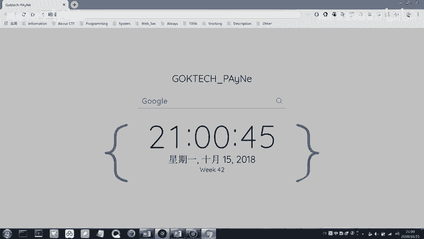
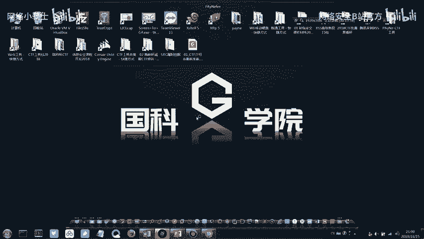
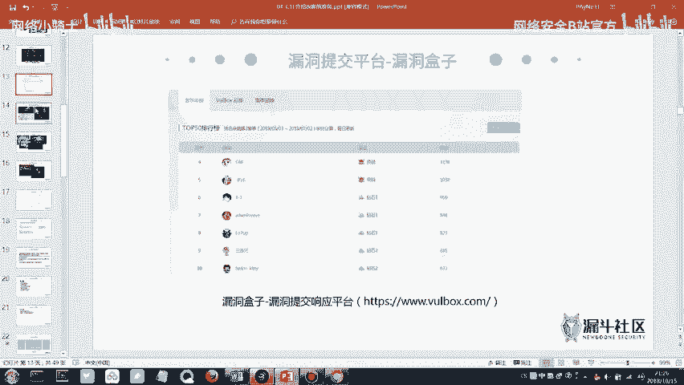
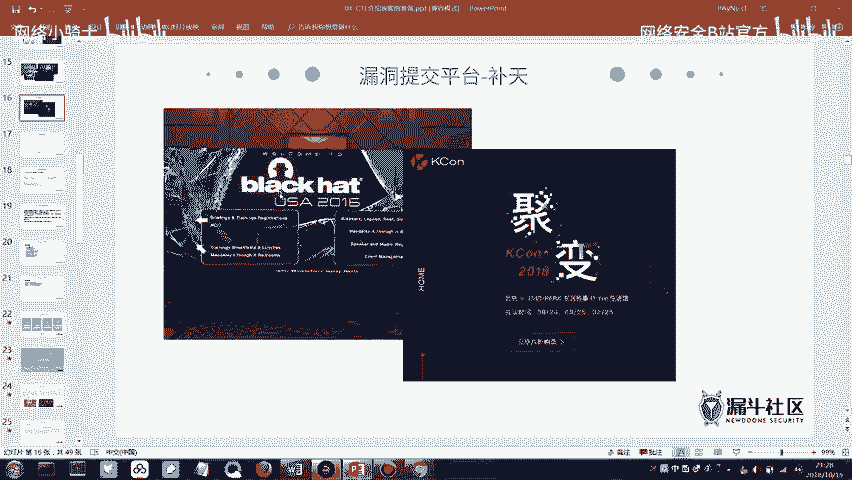
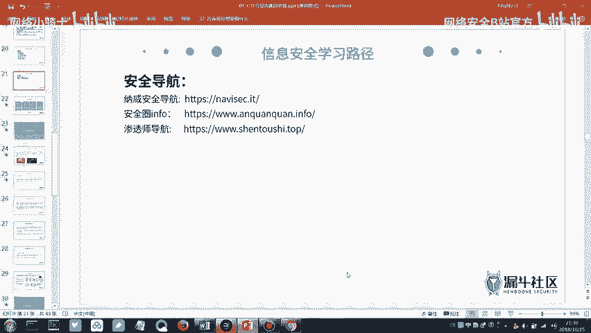

# CTF最强战队蓝莲花内部培训教程：P1：1.第一节：CTF赛制与信息安全概述 🔐

在本节课中，我们将要学习CTF比赛的基本概念，并了解其所属的信息安全领域。我们将从信息安全的基本定义出发，通过实际案例理解其重要性，并探讨学习信息安全后可以从事的方向。

## 什么是信息安全？

上一节我们提到了CTF比赛属于信息安全范畴。那么，我们首先要明白一个概念：什么是信息安全？



国际标准化组织ISO对信息安全的官方定义是：为保护数据处理系统而采取的技术和管理的安全措施，以保护计算机硬件、软件和数据不因偶然和恶意的原因而遭到破坏、更改和泄露。



这段定义可能比较枯燥。接下来我们通过两个真实的安全事件，来更直观地理解什么是信息安全。

### 案例一：WannaCry勒索病毒

2017年，一个名为WannaCry的勒索病毒在全球爆发。该病毒会加密感染计算机上的所有文档文件，并显示如下勒索界面：

```
你的文件已被加密！
若想解锁，请在规定时间内支付XXX比特币。
```



受害者被要求支付比特币来换取解密密钥。事实上，即使支付了赎金，文件也未必能恢复。这个病毒对许多政企单位造成了严重损失，因为它们电脑中存储的往往是机密或重要文件。当时，甚至有一些高校的学生因此丢失了毕业论文的多个版本。

### 案例二：A站（AcFun）数据库泄露

二次元视频网站A站曾发生数据库被盗事件。数据库对于一个网站或企业至关重要，它存储了多年积累的所有用户数据。一旦数据库泄露，意味着所有用户的账号、密码等信息都可能被盗取。








黑客获取数据库后，常进行一种名为“撞库”的攻击。以下是撞库攻击的基本逻辑：

```python
# 伪代码示例：撞库攻击原理
stolen_user_data = get_from_leaked_database() # 从泄露库获取用户名密码
for user in stolen_user_data:
    for popular_website in ["wechat.com", "qq.com", "163.com"]:
        if try_login(user.name, user.password, popular_website):
            # 登录成功，账号被盗用
            hijack_account(user.name, popular_website)
```

因为许多用户在不同网站使用相同的密码，黑客就可以用泄露的密码去尝试登录其他网站，盗取更多账号。A站当时约有800万条用户数据在暗网中以40万人民币的价格售卖。

**暗网**是一个具有高度隐匿性的网络空间，常被用于非法交易。它使用“洋葱路由”等技术使得流量难以追踪。暗网中的网站域名通常以 `.onion` 结尾。但请注意，暗网内容复杂，不建议深入探索。

通过这些案例，我们可以理解，信息安全的核心是 **攻击** 与 **防御** 的持续对抗。道高一尺，魔高一丈，正是这种对抗推动了信息安全技术的发展。

## 信息安全的重要性与国家战略

信息安全是网络空间安全的核心内容。我们可以将海、陆、空、天之外的网络世界，称为“第五空间”。

国家领导人曾指出：“没有网络安全就没有国家安全。” 信息安全已上升到国家战略高度。例如，历史上美国和以色列曾利用名为“震网”的病毒，攻击了伊朗的核设施工业控制系统，破坏了其用于浓缩铀的离心机，严重迟滞了伊朗的核计划。

这预示着未来的国家间较量，可能很大程度上会在网络空间展开。因此，国家越来越重视网络安全人才培养和选拔。

例如，由公安部主办的“网鼎杯”网络安全大赛，是中国规模最大的CTF赛事之一。在该比赛中取得优异成绩的选手，有机会被公安部特招，或受到阿里、腾讯等顶尖科技公司的青睐。

我们的培训课程主要针对**省级CTF比赛**。与国赛相比，省赛难度更适合初学者。只要认真学习准备，完全有机会在省赛中取得好成绩。

## 白帽子与黑帽子

在信息安全领域，从业者有不同的称呼：
*   **白帽子**：指站在防御一方，通过合法手段发现并帮助修复安全漏洞，保护系统和数据安全的正义黑客。
*   **黑帽子**：指利用技术手段进行非法攻击、窃取数据或破坏系统的黑客。

国内顶尖的白帽子代表有：
*   **吴翰清（道哥）**：阿里巴巴首席安全科学家。传说他在面试阿里时，当场黑掉了阿里内部网络，从而被录用。他早期曾通过“善意”地爆破全公司邮箱密码并告知本人的方式，推动了阿里对安全部门的重视。
*   **余弦（钟晨鸣）**：前知道创宇技术VP，404实验室创始人，Web前端安全专家。著有《Web前端黑客技术揭秘》一书，现专注于区块链安全领域。

## 学习信息安全可以做什么？

了解了信息安全的重要性和代表人物后，你可能会问：学习信息安全后，具体能做什么呢？

以下是信息安全学习者可以参与的几个方向：

### 1. 漏洞提交与奖励计划（SRC）

许多互联网公司都设有“安全应急响应中心”，鼓励白帽子提交其产品中的安全漏洞，并给予现金或礼品奖励。
*   **通用平台**：如漏洞盒子、补天等，可以提交各大厂商的漏洞。
*   **厂商专属SRC**：如腾讯安全应急响应中心、阿里安全响应中心等，只接收该厂商自身产品的漏洞。
在这些平台上排名靠前，不仅能获得丰厚奖励，也是求职时极具分量的履历。

### 2. 参加CTF等安全竞赛

通过比赛检验和提升技术水平，是快速成长的途径。
*   **比赛类型**：省级赛（如海峡杯）、国家级赛（如网鼎杯、护网杯）、世界级赛（如DEF CON CTF）以及各大厂商举办的比赛（如百度杯）。
*   **收获**：除了奖金，更重要的是荣誉、工作机会和与高手交流的机会。

### 3. 参与技术交流会议

全球有许多知名的安全技术会议，是了解前沿技术和拓展人脉的好地方。
*   **Black Hat**：全球最知名的黑帽技术大会。
*   **KCon**：由知道创宇主办的中国黑客大会，注重技术分享。

### 4. 从事安全相关职业



信息安全领域有众多职业发展方向，例如渗透测试工程师、安全研发工程师、安全运维工程师等。这些岗位通常需要掌握以下部分或全部技能：
*   **网络基础**：TCP/IP协议、网络架构
*   **操作系统**：Linux/Windows系统原理与管理
*   **编程语言**：Python/PHP/Java/Go等至少一门
*   **Web安全**：OWASP Top 10漏洞原理与利用
*   **渗透测试**：信息收集、漏洞扫描、内网渗透等流程与方法

## 学习资源推荐



如果你想开始深入学习，可以参考以下资源：
*   **书籍**：《白帽子讲Web安全》、《Web前端黑客技术揭秘》、《Metasploit渗透测试指南》。
*   **导航网站**：一些安全从业者整理的工具、靶场、博客导航站，是很好的学习入口。

---



本节课中我们一起学习了CTF比赛与信息安全的基本概念。我们通过WannaCry和A站脱库等案例理解了信息安全的现实意义，认识了白帽子与黑帽子的区别，并了解了学习信息安全后可以参与的漏洞挖掘、技术竞赛和职业发展路径。从下一节课开始，我们将正式进入CTF具体知识点的学习。