# CTF最强战队蓝莲花内部培训教程：P23：24.命令注入

## 概述
在本节课中，我们将学习网络安全中的命令注入漏洞。我们将了解如何通过Web应用程序从外部运行主机的Shell命令，最终获得主机的访问权限，提升root权限，并取得对应的flag值。

## 实验环境介绍
攻击机是Kali Linux，其IP地址为`192.168.1.106`。靶场机器的IP地址为`192.168.1.104`。

在CTF比赛中，主要目标是获取靶场机器上的flag值。所有操作都应围绕获取flag值以及控制靶场机器这一目标展开。

## 第一步：信息探测
首先，我们使用Nmap对靶场机器进行服务信息及版本扫描。

使用命令：
```bash
nmap -sV 192.168.1.104
```
Nmap开始向靶场机器发送数据包，靶场机器返回响应，Nmap根据响应分析并返回扫描结果。

除了扫描版本信息，还可以使用以下命令扫描主机的全部信息：
```bash
nmap -A -v -T4 192.168.1.104
```
参数`-T4`表示Nmap以最大效率发送数据包，扫描速度更快。

扫描完成后，会快速显示大量信息。

探测完主机信息后，如果目标开放了HTTP服务，可以使用Nikto和Dirb扫描其HTTP服务开放的目录信息。

使用Nikto扫描：
```bash
nikto -h http://192.168.1.104
```
Nikto会分析响应，发现目录和文件。例如，它可能发现`/robots.txt`、`/upload`等目录，并列出5个入口点。

使用Dirb扫描：
```bash
dirb http://192.168.1.104
```
Dirb开始扫描靶场的目录和文件信息。

## 第二步：信息分析与利用
探测信息的主要目的是从中挖掘有用信息，以帮助渗透靶场机器。

接下来，我们需要对扫描结果进行分析，找出可利用的信息。例如，如果开放了HTTP服务，就可以使用浏览器访问敏感页面。

访问靶场主页`http://192.168.1.104`，查看其内容。

访问`/robots.txt`文件，该文件通常包含敏感信息，指示爬虫禁止访问某些目录。

访问`/n0c`目录，服务器返回“Not found go back”，看似404错误页面。但通过查看页面源代码（右键 -> 查看页面源代码），在HTML注释中发现关键信息：
```
my secret pass: freedom, password, hello world!, i love root
```
这些信息可能是后续需要用到的密码。

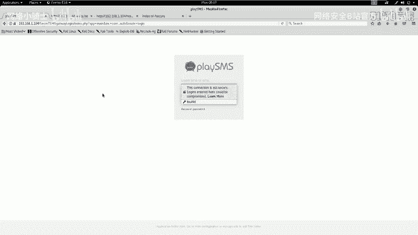

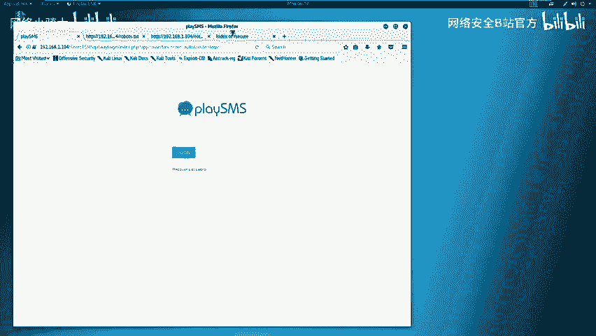

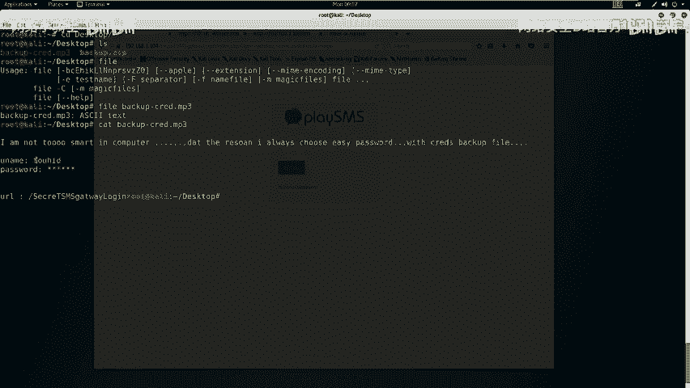

访问`/temp`和`/uploads`目录，未发现有用信息。

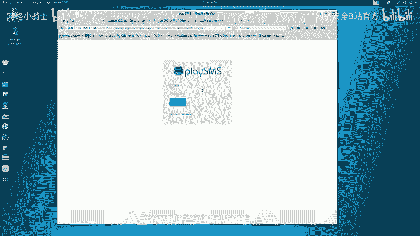

在扫描结果中，还发现一个`/secret`目录。访问该目录，发现一个名为`backup.zip`的文件，这可能是网站源代码的备份文件。下载该文件。

将`backup.zip`复制到桌面并解压，发现需要密码。联想到之前在`/n0c`页面源代码中找到的密码，尝试使用`freedom`解压，成功。

解压后得到一个名为`backup.mp3`的文件。使用`file`命令检查其真实类型：
```bash
file backup.mp3
```
结果显示它是一个ASCII文本文件。使用`cat`命令查看内容：
```bash
cat backup.mp3
```
文件内容提示使用了一个简单密码`V!`进行加密，并包含`username/ID`和`password`字段（密码被隐藏为`*****`）。同时，文件中还包含一个URL。

将URL复制到浏览器中访问，显示一个登录界面。根据文件提示，用户名`ID`为`toor`。密码则尝试之前在`/n0c`页面找到的几个密码：`freedom`、`password`、`hello world!`、`i love root`。

尝试使用`i love root`作为密码，成功登录系统后台。

## 第三步：漏洞查找与利用
登录系统后，需要寻找可利用的漏洞。首先判断该系统是否为已知的、存在公开漏洞的系统。

该系统名为“playSMS”。使用`searchsploit`工具查找其相关漏洞：
```bash
searchsploit playSMS
```
查找结果显示存在相关漏洞文档。查看具体漏洞信息：
```bash
cat /usr/share/exploitdb/exploits/php/webapps/42044.txt
```
漏洞描述指出，这是一个不严格的文件上传漏洞，注册用户可以上传任意文件，因为`sdfromfile.php`文件没有进行合适的验证。攻击者可以通过修改上传文件的文件名来执行任意PHP代码。

根据漏洞提示，访问存在漏洞的页面路径：`/index.php?app=main&inc=core_sdfromfile`。

接下来，按照公开的漏洞利用代码（PoC）进行测试。

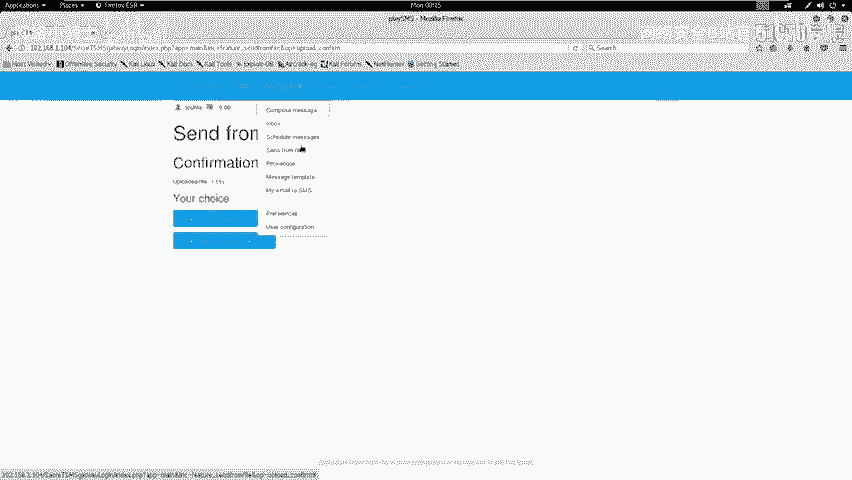

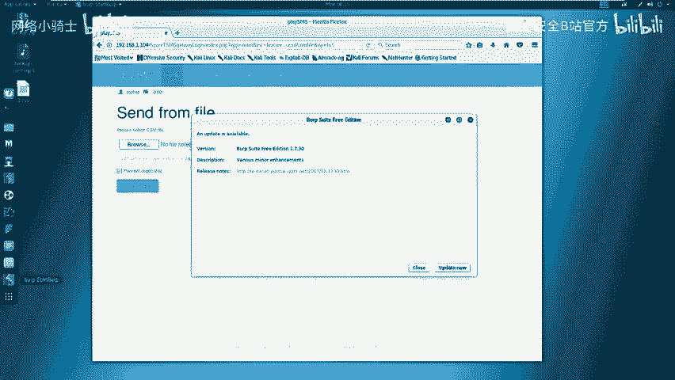

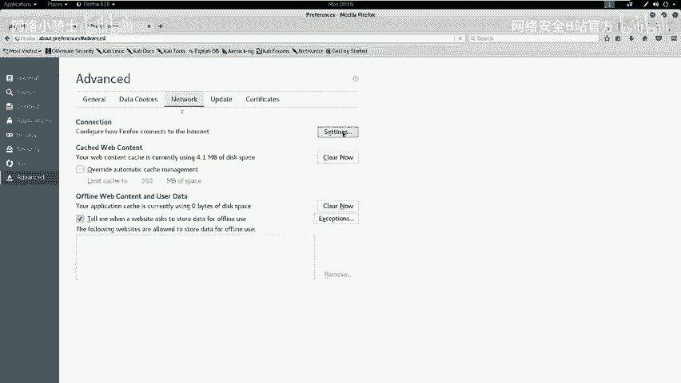

首先，在桌面创建一个CSV文件：
```bash
touch 1.csv
```
在漏洞页面上传该文件。然后，使用Burp Suite工具拦截上传请求。

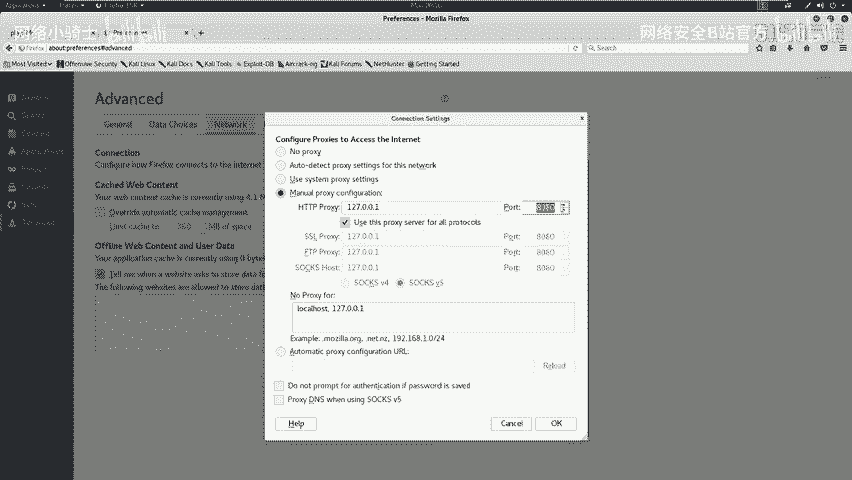

配置浏览器代理为`127.0.0.1:8080`，并启动Burp Suite。

重新上传文件，Burp Suite会拦截到HTTP请求包。将该请求包发送到Repeater模块进行修改。

根据PoC，需要修改`filename`参数，将其值改为包含恶意PHP代码的形式。例如，执行`uname -a`命令：
```
filename="test.php;system(\"uname -a\");.csv"
```
点击“Go”发送修改后的请求。查看响应，在页面底部看到了`uname -a`命令的执行结果，包括Linux内核版本、主机名等信息，证明命令注入成功。

为了执行其他命令（如`id`），需要重新抓取一个新的上传请求包，因为系统在执行一次命令后可能需要重新触发。

重复上传和抓包过程，修改`filename`参数执行`id`命令：
```
filename="test.php;system(\"id\");.csv"
```
发送请求后，在响应中看到了当前用户的UID和GID信息，进一步确认了漏洞可利用性。

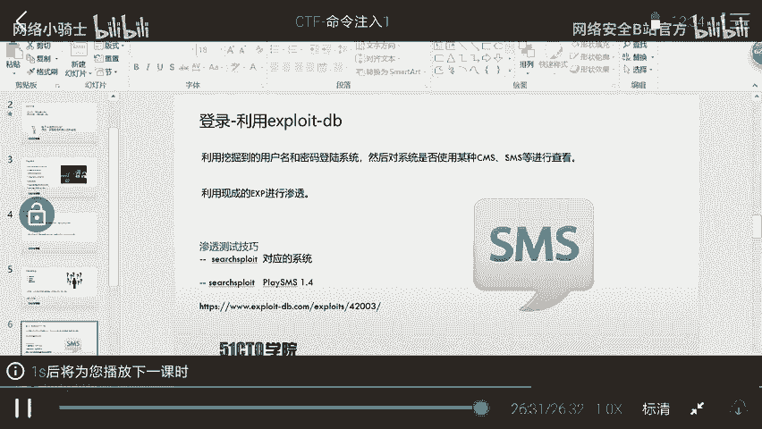

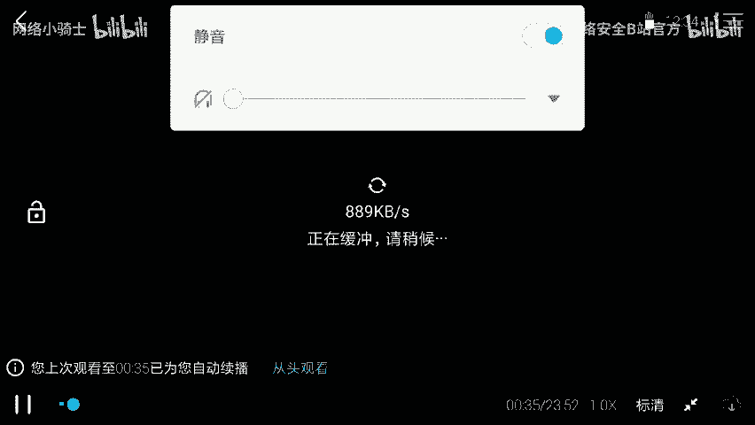

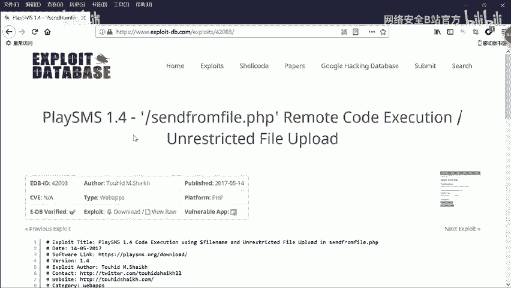

## 总结
本节课我们一起学习了命令注入漏洞的实战利用过程。我们从信息收集开始，使用Nmap、Nikto、Dirb等工具探测目标。然后，通过分析扫描结果和页面源代码，挖掘出关键信息（如密码），并成功登录后台系统。接着，我们利用`searchsploit`查找已知漏洞，并借助Burp Suite工具，通过修改文件上传参数的方式，实现了远程命令执行，验证了漏洞的存在。整个过程体现了在CTF比赛中信息收集、逻辑推理和工具使用的重要性。