# CTF综合测试高难度WEB安全初级入侵：P26：27. 通过Web应用漏洞进行入侵测试

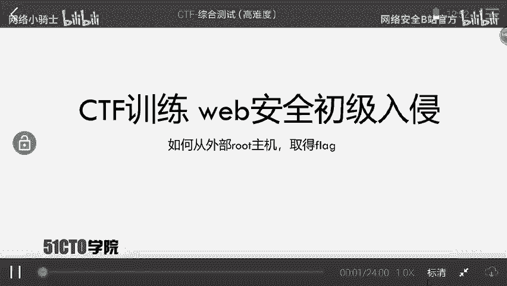


在本节课中，我们将学习如何通过Web应用程序的安全漏洞进行测试，以达到入侵目标主机的效果。最终目标是获取主机的最高权限（root权限）或取得对应的flag值。

## 概述：Web安全背景

随着Web 2.0、社交网络、微博等一系列新型互联网产品的诞生，基于Web环境的互联网应用越来越广泛。在企业信息化过程中，各种应用都架设在Web平台之上。

Web业务的迅速发展也引起了黑客的强烈关注，随之而来的是Web安全风险的凸显。黑客利用网站操作系统的漏洞和Web应用程序的SQL注入漏洞等，获取Web服务器的控制权限。轻则篡改网页内容、挂黑页，重则通过Web漏洞获取企业内部重要的数据信息。更为严重的是在网页中植入恶意代码，例如植入挖矿代码，使网站访问者受到侵害。

## 实验环境介绍

以下是本次实验的环境配置：
*   **攻击机IP地址**：`192.168.253.12`
*   **靶场机器IP地址**：`192.168.253.13`

拿到实验环境后，我们的目标很明确：在渗透测试中，目标是获取靶场机器的root权限；在CTF比赛中，目标是获取靶机上的flag值。

## 第一步：信息探测

在获取目标信息后，可以使用攻击机对靶机进行测试。测试的第一步是对靶场机器进行信息探测，深入了解其信息。我们可以使用Nmap来扫描靶场IP地址所开放的服务及版本信息。

以下是操作步骤。


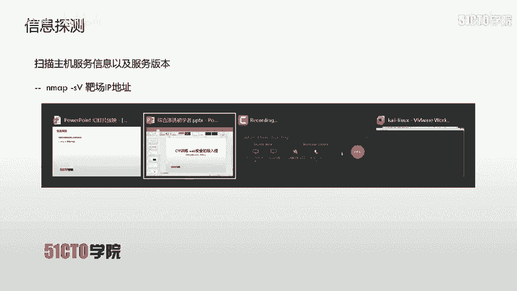

首先使用Nmap，加上参数 `-sV` 和靶场IP地址 `192.168.253.13` 并回车。

```bash
nmap -sV 192.168.253.13
```

执行这条命令后，Nmap会向靶场IP地址发送大量数据包。靶场返回的信息会被Nmap处理并显示到标准输出中。

除了扫描主机的服务及版本信息，还可以使用Nmap的全部功能（`-A`）来扫描靶场，获取更全面的信息。这里使用 `-T4` 参数以最快速度扫描。

```bash
nmap -A -v -T4 192.168.253.13
```


请注意，命令中参数的顺序可以改变。下面点击回车进行扫描。


扫描完成后，Nmap会将结果返回到标准输出中。

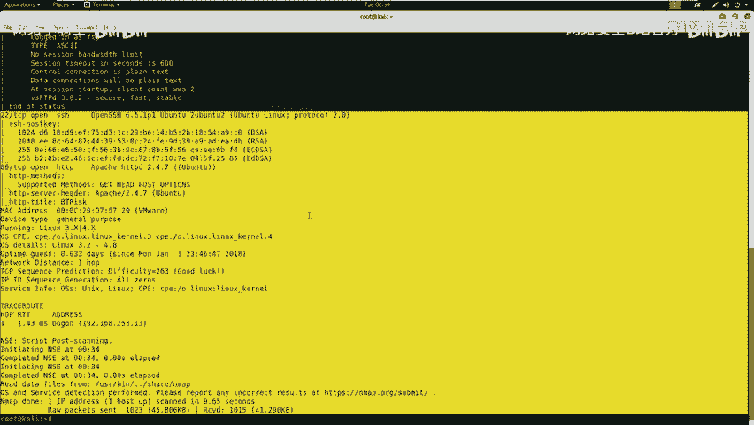

## 第二步：Web服务深度扫描

除了使用Nmap探测主机开放的服务信息，也可以使用其他工具对主机的HTTP服务进行针对性扫描。下面我们使用另外两个工具，对靶场的目录及文件信息进行扫描。

第一个工具使用 `nikto`。

```bash
nikto -h http://192.168.253.13
```

如果端口是默认的80端口，可以省略端口号；如果不是，则必须加上。执行后，`nikto` 会扫描靶场80端口开放的HTTP服务，并返回许多信息，包括一些敏感文件信息。

除了 `nikto`，也可以使用 `dirb` 来探测靶场的目录和文件信息。

```bash
dirb http://192.168.253.13
```

执行后，`dirb` 会探测靶场存在的目录及对应的文件信息。

## 第三步：信息分析与挖掘

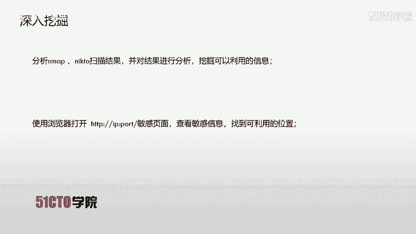

完成信息探测后，我们需要从这些信息中挖掘可利用的线索。下面我们对信息进行深入挖掘。

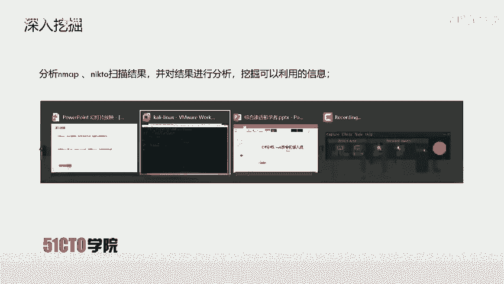

首先分析Nmap、nikto、dirb等工具的扫描结果，并对结果进行深入挖掘，找到可以利用的信息。例如，如果挖掘到某个敏感页面，可以使用浏览器打开查看敏感信息，进而找到可利用的入口。


下面分析一下刚才的扫描结果。

回到Nmap的扫描信息中，可以看到开放了21号端口（FTP服务及版本）、22号端口（SSH服务）和80端口（默认HTTP服务）。Nmap还详细介绍了这些端口的其他信息。

我们今天从Web入手，首先对80端口进行探测。使用 `nikto` 扫描Web服务下的敏感文件和敏感信息。

在结果中，我们看到了一个 `config.php` 文件，这是一个PHP配置文件，可能包含数据库认证的用户名和密码。还看到了一个Apache中间件的默认文件。继续往下看，看到了 `login.php`，这是用户登录界面。

我们截取到三条关键信息。再看 `dirb` 挖掘到的信息，会看到一个资源目录、默认主页、`js` 目录、`server-status` 目录（服务器状态）以及一个比较敏感的上传目录 (`upload`)。

其他信息也有可利用的地方，但并未发现更深入的探测信息。不过，我们在之前的 `nikto` 扫描结果中发现了 `login.php`，那么就来访问一下 `login.php`，看看是否有可利用之处。


首先在浏览器输入对应的IP地址和文件路径：`http://192.168.253.13/login.php` 并回车。


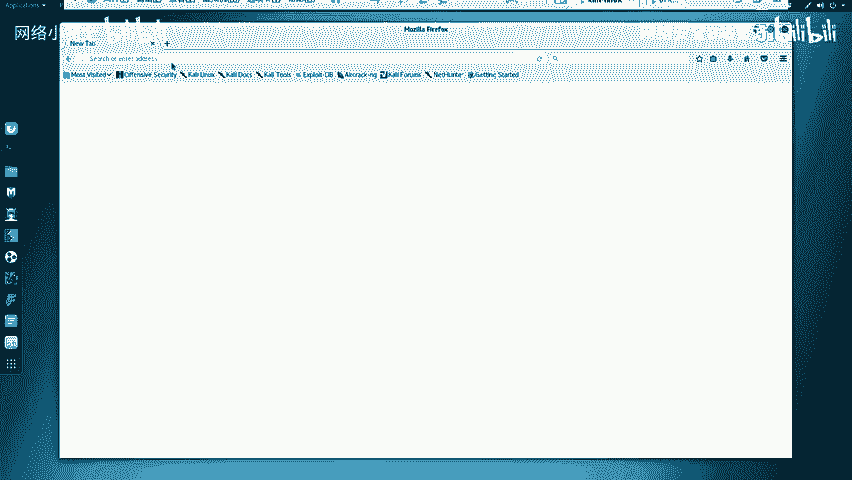

页面正在打开。

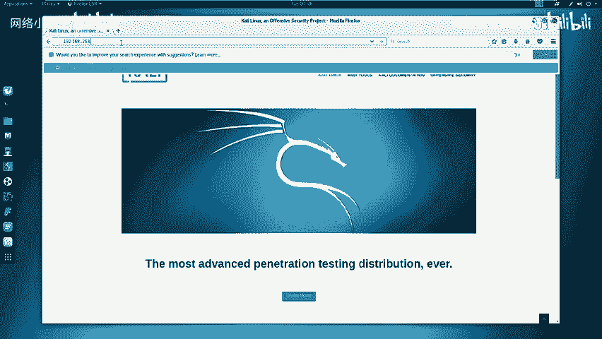

## 第四步：漏洞挖掘思路

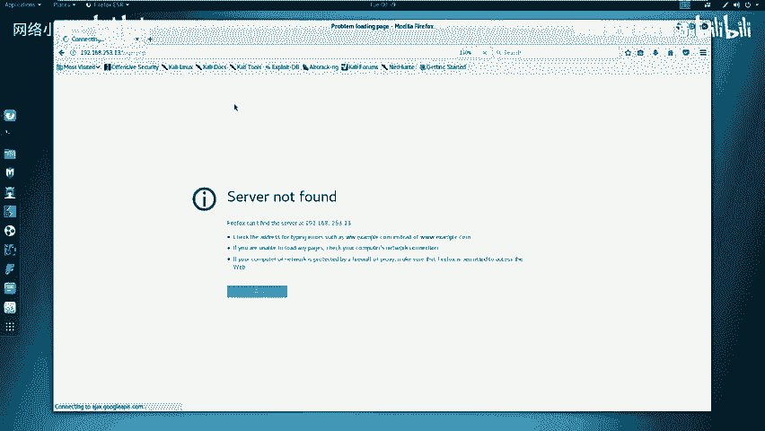

在进行深入分析后，我们挖掘到许多可能被利用的信息。这些可能利用的信息是如何发现的呢？以下是一些思路：

1.  **SQL注入**：检查登录界面是否存在SQL注入，可以直接通过SQL注入进入系统，然后在系统后台中发现更多安全弱点。
2.  **敏感信息泄露**：检查是否有敏感信息泄露，例如刚才看到的 `config.php` 是否可以直接访问并发现敏感信息。
3.  **已知框架漏洞**：查看当前Web站点是否使用了已知的CMS等框架搭建，这些框架是否有已知漏洞可以直接利用以获取Web应用程序的最高权限。
4.  **备份文件**：注意备份文件，备份文件中往往有很多值得利用的地方，例如包含配置文件或其他PHP文件，可通过代码审计分析程序运行状态，从中寻找弱点。

在实际渗透测试及CTF比赛中，一定要对每个文件和目录保持敏锐的观察力，发现内部可利用的信息。尤其是在CTF中，需要具备很大的“脑洞”。


## 第五步：登录界面测试与绕过

下面我们看一下打开的登录界面。打开界面后，就需要对其进行测试。

首先这是一个登录界面，可以尝试是否存在弱口令。尝试登录后发现并不能成功登录。


这时我们就来思考如何绕过它的登录认证机制。

**绕过登录认证机制的步骤：**
1.  查看页面源代码，寻找可能利用的信息。
2.  利用Burp Suite进行Fuzz测试，测试该页面是否可以被绕过。

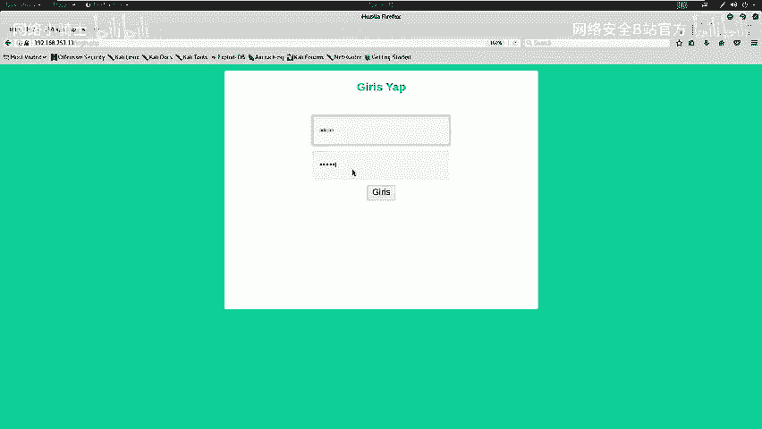

接下来查看一下源代码。


右键查看页面源代码。在源代码中，要特别注意注释部分。向下看，没有注释。在最下方，我们看到了一段JavaScript代码，这也值得注意。

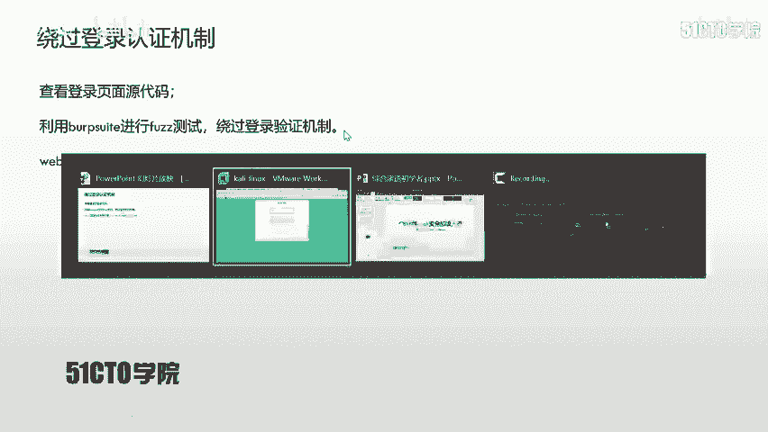

现在分析一下这段JS代码的作用。

1.  它定义了一个函数，并获取了 `user`（用户名）和 `pwd`（密码）表单字段的值。
2.  声明一个字符串变量 `str`，其值为用户名 (`user`) 中最后一个 `@` 符号之后的所有内容（子字符串）。
3.  接下来是一个选择结构：
    *   如果 `pwd` 等于单引号 `‘`，则弹出“黑客攻击”警告。
    *   如果 `pwd` 不是单引号，并且 `str` 不等于 `"btrssk.com"`，则弹出一个对话框。
    *   如果以上条件都不满足，则开始登录。

对于有经验的渗透测试者或CTF学习者会发现：如果密码存在单引号，就弹出“黑客攻击”。这很可能提示密码字段存在SQL注入漏洞。同时，用户名需要以 `"btrssk.com"` 结尾。

那么，我们来测试一下密码是否可以通过SQL注入绕过。这里采用Fuzz测试。

**Fuzz测试** 就是通过不断尝试正确和错误的输入，服务器会返回不同的结果。我们从不同结果中寻找差异（如返回内容的长度不同），并进行分析，从而找到可利用之处。

例如，今天我们将使用Burp Suite的Intruder模块，根据返回长度的不同来区分响应。

可以这样理解：登录一个系统时，登录成功和登录失败返回的页面不同，其字节数也不同。因此，通过这一点可以判断是否登录成功。

下面尝试进行Fuzz测试。


打开Burp Suite程序。


开启代理后，回到浏览器登录界面。


输入我们构造的用户名：`btrssk@btrssk.com`，密码先随意输入，例如 `123456`。


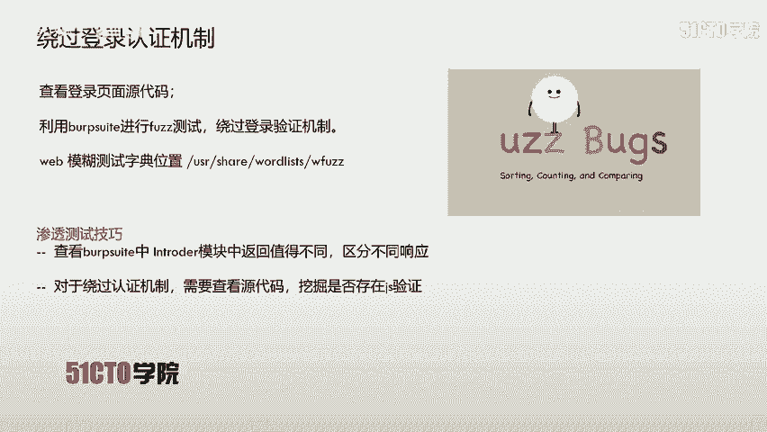

确保Burp Suite代理已开启，然后点击登录。


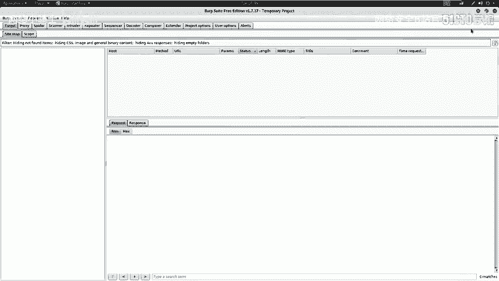

此时，登录请求的数据包会被发送到Burp Suite中。

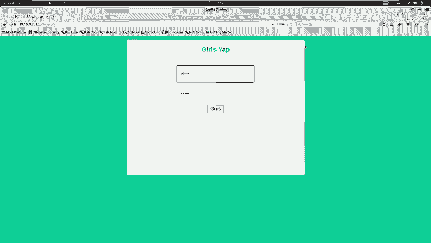


可以看到这个数据包，包含我们输入的用户名和密码。右键点击，选择 `Send to Intruder`。

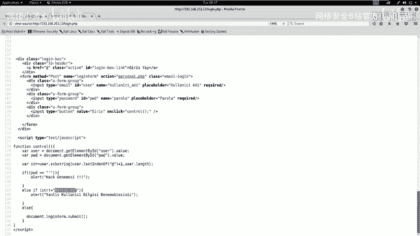


在Intruder模块中，我们将对 `pwd`（密码）参数进行Fuzz测试。清除所有变量，然后双击密码值 `123456`，点击 `Add` 将其设为变量。


接下来需要选择一个Fuzz测试的字典。对于初学者，推荐使用Kali Linux中的测试字典，路径为：`/usr/share/wordlists/`。

```bash
ls /usr/share/wordlists/
```

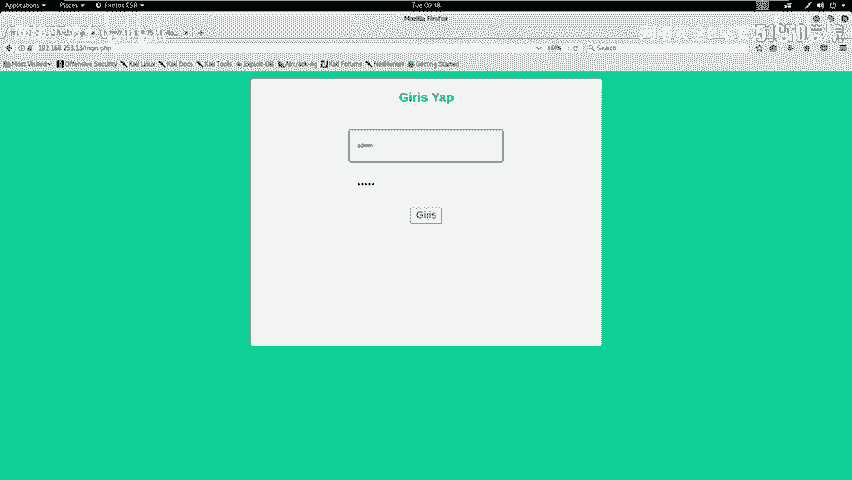

可以看到许多不同类型的测试数据。今天用到的是SQL测试数据。

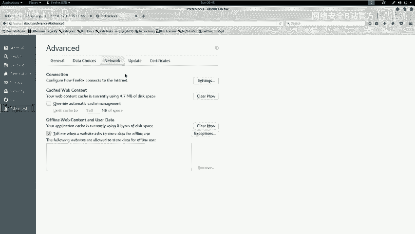

```bash
cp /usr/share/wordlists/sql.txt /root/Desktop/sql.txt
cd /root/Desktop
ls
```

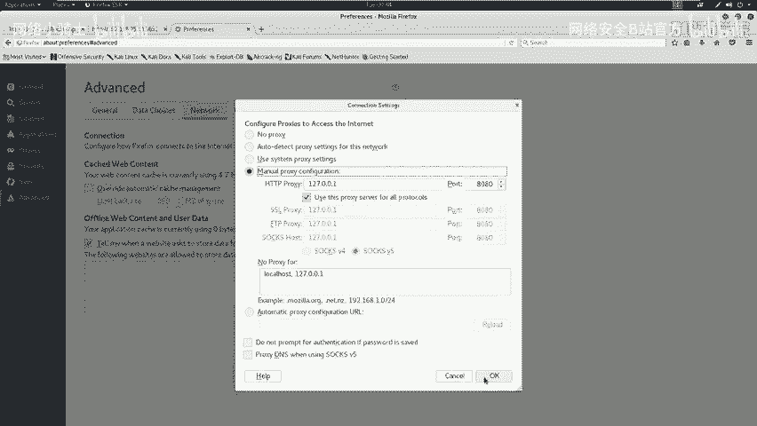

此时桌面就有了 `sql.txt` 文件。

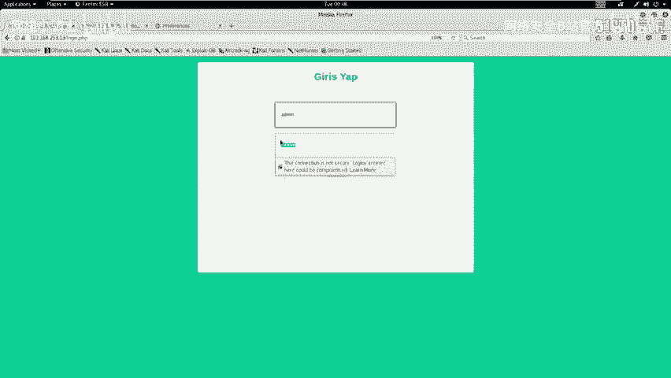

在Burp Intruder的 `Payloads` 标签页，选择 `Payload type` 为 `Runtime file`，然后加载桌面上的 `sql.txt` 文件。


设置完成后，点击顶部的 `Start attack` 开始Fuzz测试。

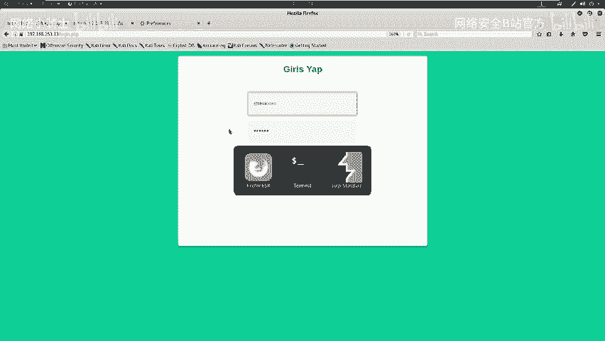

可以看到数据包不断发出和返回。`Length` 列表示返回数据包的长度。这里会看到不同长度的数据包。

第一个数据包（长度2900）是未发送任何密码信息的数据包，显然不能正确登录。接下来，长度为2044和2203的数据包也是不正确的（其中2203对应密码为单引号 `‘` 的情况，触发了“黑客攻击”警告）。

除了这些，还有一个长度为2900的响应，它不同于我们刚才尝试的结果。我们在浏览器中查看一下这个2900长度的响应是否是我们想要的结果。

在Intruder结果窗口中，右键点击该记录，选择 `Request in browser` -> `In original session`。


复制提供的URL，在浏览器中打开。可以看到返回了一个新界面，并且有一个文件上传功能。

## 第六步：文件上传功能测试

这个界面具有上传功能，提示我们选择一个文件。


一般情况下，上传功能允许上传图片或其他文件。但我们更想上传的是PHP文件，以便获取WebShell。

首先在桌面准备两个文件：一个图片文件和一个PHP文件。

先尝试上传图片文件，可以上传成功。


接下来尝试上传PHP文件。

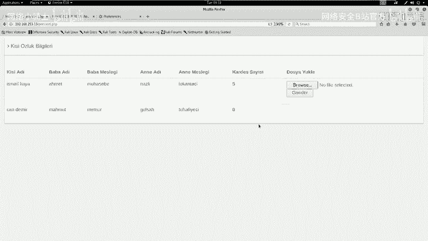


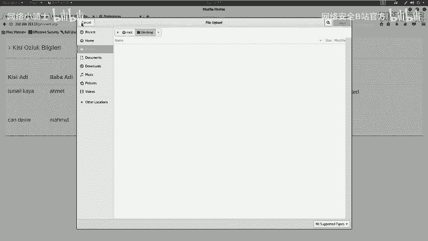

发现无法上传。


这个应用似乎只允许上传JPG等图片文件，不允许上传PHP文件。

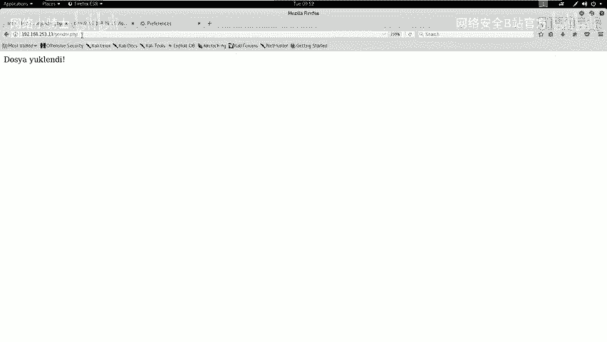

那么，如何绕过这个上传检测机制呢？我们将在下节课中，专门针对这个上传机制进行绕过测试。

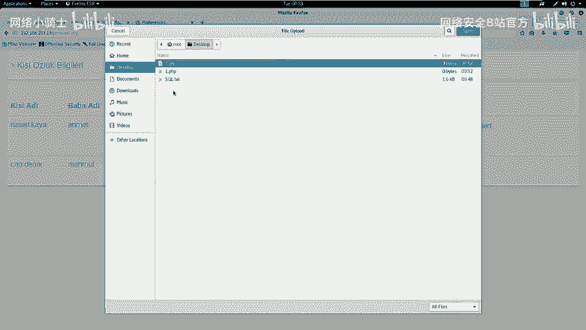


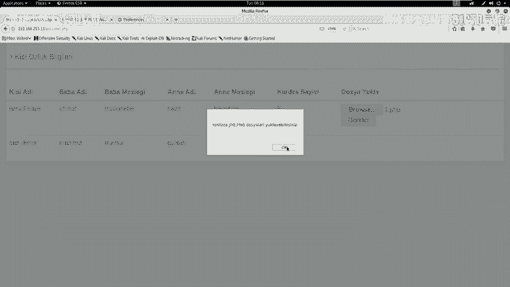

## 总结

本节课中，我们一起学习了通过Web应用漏洞进行初级入侵的完整流程：

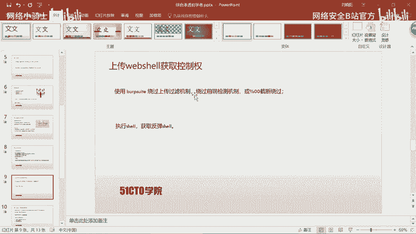

1.  **信息收集**：使用Nmap、nikto、dirb等工具对目标进行端口扫描、服务识别、目录和文件探测。
2.  **信息分析**：深入分析扫描结果，寻找敏感文件（如 `config.php`、`login.php`）、敏感目录（如上传目录）等潜在入口。
3.  **漏洞挖掘与测试**：
    *   对发现的登录界面 (`login.php`) 进行测试。
    *   通过查看页面源代码，分析前端JavaScript验证逻辑，发现可能的SQL注入点和用户名格式要求。
    *   使用Burp Suite的Intruder模块，对密码字段进行Fuzz测试，成功绕过登录认证。
4.  **后续利用**：登录后发现了文件上传功能，并对其进行了初步测试，确认存在上传限制，为下一节课的绕过技术埋下伏笔。

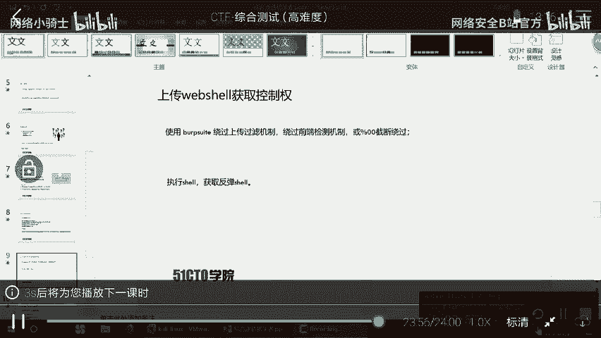

整个过程中，我们强调了渗透测试的思路：从信息收集到深入分析，再到针对性地验证和利用漏洞。在接下来的课程中，我们将学习如何绕过文件上传限制，进一步深入系统。