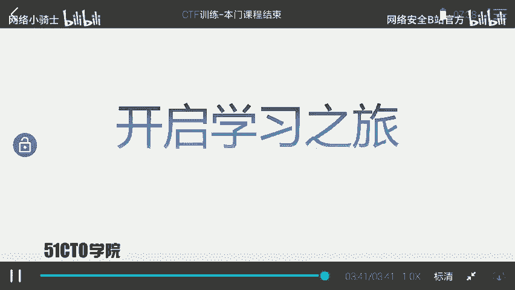
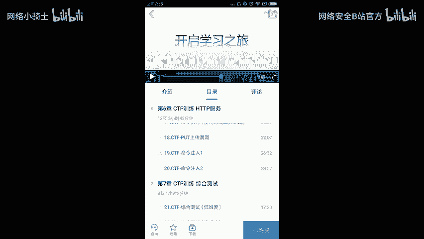

# CTF训练课程：P28：29.课程总结 🏁

在本节课中，我们将对之前所学的CTF知识进行回顾与总结，并展望未来的学习路径。

## 课程回顾

上一节我们完成了具体技能的学习，本节中我们来整体回顾CTF的核心概念与学习历程。

CTF是一种流行的信息安全竞赛形式，其英文名可译为“夺旗赛”，也可意译为“夺旗赛”。其大致流程如下：参赛团队之间通过进行攻防对抗、程序分析等形式，率先从主办方给出的比赛环境中得到一串具有一定格式的字符串或其他内容，并将其提交给主办方，从而夺得分数。为了方便称呼，我们把这样的内容称之为 **`flag`**。

在CTF比赛中涉及的内容比较繁杂，参赛者需要利用所有可以利用的方法获得对应的 **`flag`**。这里强调需要有很大的“脑洞”来挖掘对应的信息。

通过本门课程的学习，大家基本掌握了CTF比赛中的一些基本套路，可以完成一定难度靶场中 **`flag`** 的寻找。但是本门课程并不能确保并指导你成为顶尖高手。大家距离成为高手的路相当远。

## 学习方法与持续进步

在接下来的时间里，大家需要不断学习，不断进步，以缩短与高手的距离。这需要掌握正确的学习方法。

在信息安全或CTF学习当中，需要不断实践与尝试才能更快地进步。同时，学习时需要有一定的方法、对应的课程以及训练环境。

## 后续课程预告

以下是作者计划推出的后续课程，旨在帮助大家继续深入学习：

*   **代码审计课程**：专门教大家挖掘对应的漏洞，并且编写对应的 **`POC（Proof of Concept）`**。
*   **WiFi安全课程**：使用高度集成的工具测试WiFi安全，并涉及最新的测试方法，例如中间人攻击直接修改 **`WPA/WPA2`** 密码。
*   **Metasploit模块编写课程**：教大家如何编写一个 **`Metasploit`** 模块来进行自动化测试。
*   **CTF训练高端课程**：提升课程难度，使大家对CTF有更深入的了解，并提升综合安全能力。

## 总结与共勉

本节课中我们一起学习了CTF竞赛的基本定义、流程与核心目标（获取 **`flag`**），并总结了入门后的学习方法。学习尚未成功，大家仍需努力。让我们保持热情，一起开启接下来的学习之旅。

