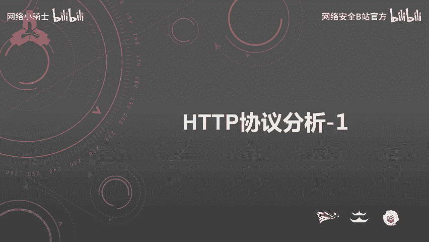
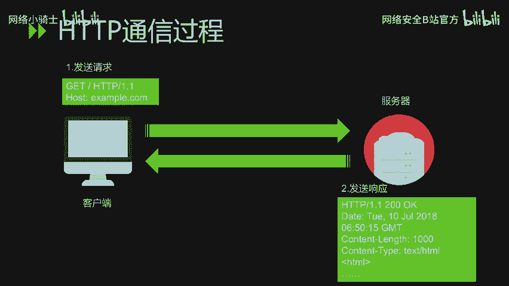
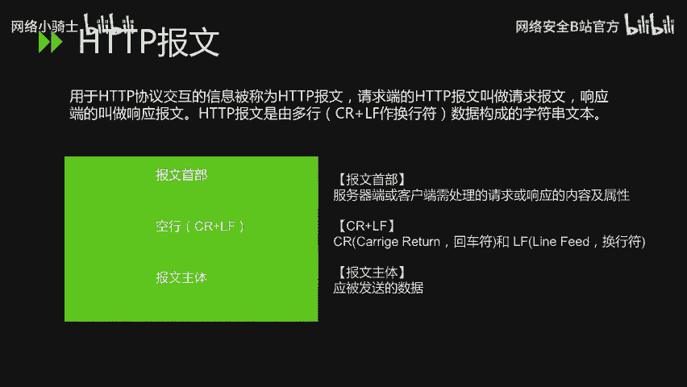
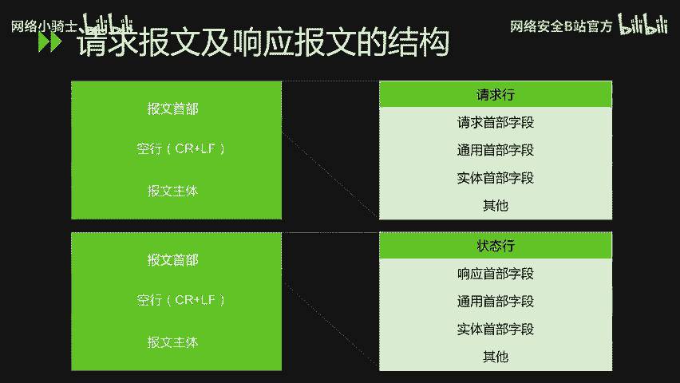
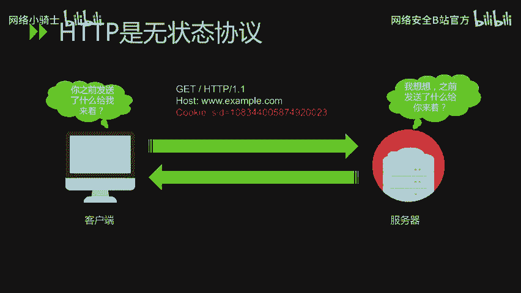
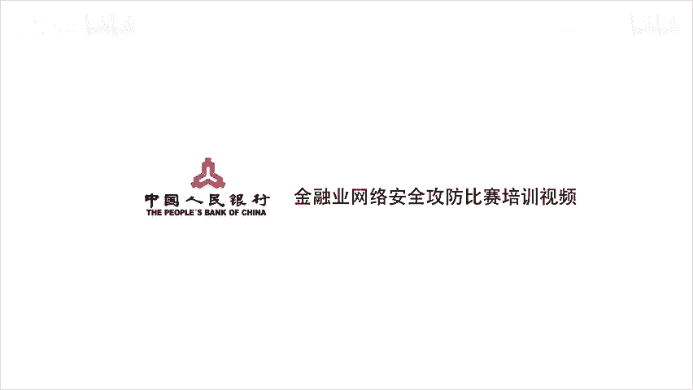

# CTF最强战队蓝莲花内部培训教程：P29：第二节：HTTP协议分析 📡

在本节课中，我们将要学习HTTP协议的基础知识，包括其发展历史、协议结构、请求与响应报文的构成，以及常见的状态码。理解这些内容是进行网络安全分析和CTF挑战的重要基础。

## HTTP协议发展史 📜

上一节我们介绍了课程概述，本节中我们来看看HTTP协议的发展历程。

HTTP是超文本传输协议，它是目前互联网上应用最为广泛的一种网络协议。所有的万维网文件都必须遵守这个标准。

设计HTTP最初的目的是为了提供一种发布和接收HTML页面的方法。HTTP协议和TCP/IP协议组内的其他众多协议相同，用于客户端和服务端之间的通信。HTTP是建立在TCP协议上进行通信的。

以下是HTTP发展的关键时间节点：
*   **1989年**：HTTP诞生。最初的设想是借助多文档之间相互关联形成的超文本，连接成可相互参与的万维网。
*   **1990年**：HTTP/0.9版本问世。
*   **1996年5月**：HTTP正式作为标准被公布，当时是HTTP/1.0版本。
*   **1997年1月**：公布了HTTP/1.1，这是目前主流的HTTP协议版本。

## HTTP协议结构 🏗️

了解了HTTP的由来，接下来我们具体看一下HTTP的协议结构。首先，我们需要理解一次HTTP的通讯过程。

首先是客户端主动向服务端发起请求。服务端在接收到客户端发来的请求之后，会做出一定的响应。HTTP协议规定，先从客户端开始建立通信，服务端在没有接收到请求之前，不会发送响应。

在HTTP通信过程中，我们来了解一个核心概念：**HTTP报文**。

什么是HTTP报文？HTTP报文是用于HTTP协议交互的信息。请求端的HTTP报文叫请求报文，响应端的叫做响应报文。

HTTP报文是由多行数据构成的字符串文本，多行之间使用CRLF作为换行符。HTTP报文大致可分为**报文首部**和**报文主体**两块。

*   **报文首部**：是服务器端或客户端需处理的请求或响应的内容及属性。
*   **空行**：CR（回车）和LF（换行符）的组合，用于分隔首部和主体。
*   **报文主体**：应被发送的数据。

## HTTP请求报文与响应报文 📨

上一节我们介绍了HTTP报文的基本构成，本节中我们来详细看看请求报文和响应报文的具体结构。

### HTTP请求报文

在请求报文中，报文的首部主要包含以下部分：
*   请求行
*   请求首部字段
*   通用首部字段
*   实体首部字段
*   其他内容

请求报文主要是由**请求方法**、**请求URI**、**协议版本**，以及可选的**请求首部字段**和**内容实体**组成。

以下是主要的HTTP请求方法：
*   **`GET`**：请求访问已被URI识别的资源。
*   **`POST`**：用于传输实体的主体。
*   **`PUT`**：用于传输文件。
*   **`HEAD`**：和GET方法一样，只是不返回报文主体部分。用于确认URI的有效性及资源更新的日期时间等。
*   **`DELETE`**：删除文件。
*   **`OPTIONS`**：用于查询针对请求URI指定的资源支持的方法。
*   **`TRACE`**：让Web服务器端将之前的请求通信环回给客户端。
*   **`CONNECT`**：用于隧道通信，通常用于SSL/TLS加密。

虽然用GET方法也可以传输实体的主体，但一般不用GET方法进行传输，通常还是使用POST的方法进行传输。

### HTTP响应报文

响应报文是由**协议版本**、**状态码**、用于解释状态码的**原因短语**、可选的**响应首部字段**以及**实体主体**构成。

其中，**状态码**是表示请求成功或失败的数字代码。我们具体看一下状态码的分类，主要有以下5种：
*   **1xx（信息性状态码）**：接收的请求正在处理。
*   **2xx（成功状态码）**：表明请求正常处理完毕。
*   **3xx（重定向状态码）**：需要进行附加操作以完成请求。
*   **4xx（客户端错误状态码）**：服务器无法处理请求。
*   **5xx（服务器错误状态码）**：说明服务器处理请求出错。

HTTP状态码负责表示客户端HTTP请求的返回结果，标记服务器端的处理是否正常，或通知出现的错误等工作。

在日常上网或工作过程中，常见的状态码主要有以下几种：
*   **`200 OK`**：表示从客户端发来的请求在服务器端被正常处理了。
*   **`301 Moved Permanently`**：永久性重定向。表示请求的资源已被分配了新的URI，以后应使用资源现在所指的URI。
*   **`302 Found`**：临时性重定向。表示请求的资源已被分配了新的URI，希望用户本次能使用新的URI进行访问。
*   **`304 Not Modified`**：客户端发送附带条件的请求时，服务器端允许请求访问资源，但未满足条件的情况。304状态码返回时不包含任何响应的主体部分。这里的附带条件的请求是指采用GET方法的请求报文中包含`If-Match`、`If-Modified-Since`等条件。
*   **`400 Bad Request`**：请求报文中存在语法错误。当错误发生时，需修改请求的内容后，再次发送请求。
*   **`401 Unauthorized`**：该状态码表示发送的请求需要通过HTTP认证（如BASIC认证、DIGEST认证）。若之前已进行过一次请求，则表示用户认证失败。
*   **`403 Forbidden`**：表明对请求资源的访问被服务器拒绝了。
*   **`404 Not Found`**：表明服务器上无法找到请求的资源。
*   **`500 Internal Server Error`**：表明服务端在执行请求时发生了错误，也有可能是Web应用存在的bug或某些临时性的故障。
*   **`503 Service Unavailable`**：表明服务器暂时处于超负载或正在进行停机维护，现在无法处理请求。

## HTTP的无状态性与Cookie 🍪

最后我们来看一下，HTTP是一种**无状态协议**。

无状态协议是什么意思呢？HTTP协议自身不对请求和响应之间的通讯状态进行保存。也就是说，协议对于发送过的请求或响应都不做持久化处理。这是为了更快地处理大量事务，确保协议的可伸缩性。

但是，随着Web的不断发展，因无状态而导致业务处理变得棘手的情况越来越多。为了实现保存状态的功能，引入了**Cookie**技术。有了Cookie技术，再用HTTP协议通信，便可以管理状态。关于Cookie技术的讲解，在下一堂课会进行详细描述。

## 总结 📝

本节课中我们一起学习了HTTP协议的基础知识。我们回顾了HTTP从诞生到成为主流标准的发展历史，剖析了HTTP报文的结构，详细了解了请求报文的方法和响应报文的状态码分类与常见代码，最后探讨了HTTP无状态的特性以及引入Cookie技术的原因。掌握这些内容是理解Web通信原理和进行后续安全分析的关键一步。