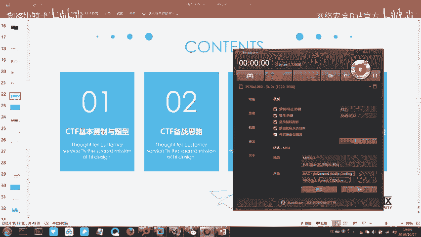
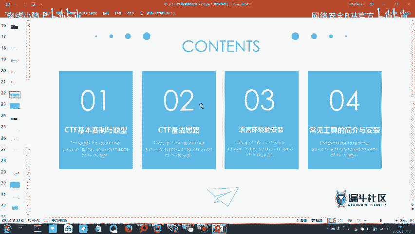
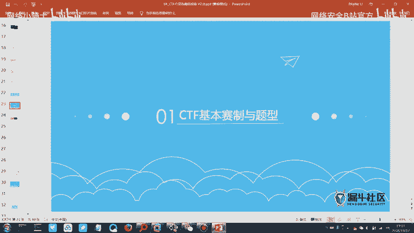
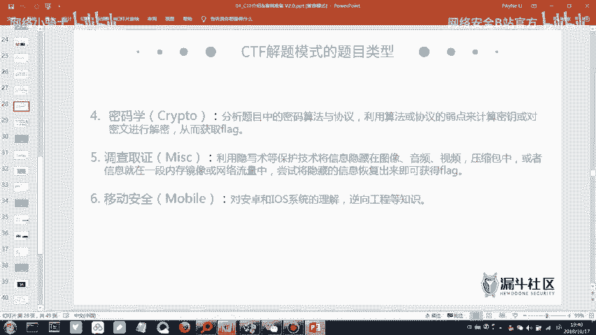
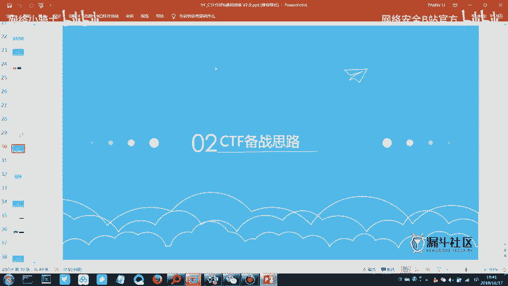

# CTF最强战队蓝莲花内部培训教程：P2：CTF赛制与工具介绍



在本节课中，我们将要学习CTF比赛的基本赛制、常见题型以及备赛所需的核心工具。通过本节课，你将了解CTF是什么、如何比赛以及如何开始准备。

## CTF赛制介绍与题型分析

上一节我们介绍了信息安全的基本概念，本节中我们来看看CTF比赛的具体规则和题目类型。





CTF的全称是**Capture The Flag**，中文译为“夺旗赛”。比赛目标是尽可能多地获取被称为 **`flag`** 的字符串。比赛方会部署题目服务器，选手通过解题获取`flag`并提交，系统根据题目难度和解题速度计算分数，最终排名。

### CTF比赛模式
CTF主要有以下几种比赛模式：

1.  **解题模式（Jeopardy）**：经典模式，选手独立解答各类安全技术题目以获取`flag`。
2.  **攻防模式（Attack-Defense）**：队伍在攻击其他队伍服务的同时，也需要防守自己的服务。分数会因被攻击成功而减少。
3.  **综合渗透模式**：选手攻击由比赛方提供的目标服务器（如网站），挖掘漏洞并获取`flag`，无需相互攻击。本次省级比赛决赛即采用此模式。

初赛通常为线上解题模式，可访问外网；决赛多为线下内网环境，禁止访问互联网。

### CTF题目类型
以下是CTF常见的六种题目类型，按通常的学习难度由易到难排序：

*   **杂项（Misc）**：内容广泛，可能涉及信息隐藏、数据分析、取证、脑洞题等，是较易入门的题型。
*   **密码学（Crypto）**：考察各种编码解码、古典密码和现代密码算法。例如Base64编码、凯撒密码、RSA加密等。
*   **Web安全**：考察网站漏洞利用技术，如SQL注入、跨站脚本（XSS）、文件上传漏洞等。
*   **逆向工程（Reverse Engineering）**：分析程序二进制文件或移动应用（如APK），理解其逻辑，找出`flag`。
*   **二进制漏洞利用（Pwn）**：通过分析程序二进制漏洞，实现远程代码执行或权限提升，是难度最高的题型之一。
*   **移动安全（Mobile）**：通常指Android/iOS应用的逆向分析与漏洞利用，可归入逆向工程范畴。

对于备赛时间有限的初学者，建议将学习重点放在**杂项、密码学和Web安全**这三个题型上。

## 备赛思路与核心技能

了解了CTF的赛制和题型后，本节我们来看看如何制定有效的备赛计划。

我们的备赛思路应遵循**由易到难**的原则。短期内，应集中精力攻克杂项、密码学和Web安全题目。逆向和Pwn题目难度较高，可作为长期学习目标。

无论针对哪种题型，以下核心技能都是必备的：
*   **语言环境**：需要安装Python、Java、PHP等语言的运行环境，用于运行解题脚本或特定工具。
*   **工具熟练度**：掌握常用CTF工具的使用方法，能极大提升解题效率。

## 必备工具与环境安装

上一节我们明确了学习重点和核心技能，本节中我们将动手安装必备的软件和工具。

以下是备赛必须安装的几类工具，我们将逐一介绍其作用。

### 1. 编程语言环境
运行许多CTF工具和脚本需要以下环境：
*   **Python**：用于编写和运行自动化脚本，例如密码爆破、数据处理。
    ```bash
    # 示例：检查Python是否安装成功
    python --version
    ```
*   **Java**：部分工具（如一些反编译软件、漏洞利用框架）基于Java开发。
    ```bash
    # 示例：检查Java环境
    java -version
    ```
*   **PHP**：用于本地搭建Web测试环境或调试PHP相关题目。

### 2. 核心工具软件
*   **虚拟机软件（如VMware/VirtualBox）**：用于搭建隔离的测试环境，避免对宿主机造成影响。
*   **Burp Suite**：Web安全测试的**瑞士军刀**。主要用于拦截、查看和修改浏览器与服务器之间的HTTP/HTTPS流量，是进行Web漏洞测试（如SQL注入、XSS）的必备工具。
*   **Wireshark**：强大的网络协议分析工具（抓包工具），用于分析`*.pcap`数据包文件，是解决网络取证类题目的关键。
*   **CTF工具包**：包含各类编解码、隐写分析、密码破解等小工具的集合。

（具体安装步骤和配置方法需根据实际软件版本和操作系统进行，课上会进行演示。）

## 总结





本节课中我们一起学习了CTF比赛的核心知识。我们首先了解了CTF是一项以获取`flag`为目标的“夺旗赛”，并熟悉了其主要的解题模式、攻防模式和综合渗透模式。接着，我们详细分析了杂项、密码学、Web安全、逆向工程、Pwn和移动安全这六大题型及其难度特点，并制定了以杂项、密码学和Web安全为重点的初期备赛思路。最后，我们明确了备赛需要准备的Python、Java等语言环境以及Burp Suite、Wireshark等核心工具。掌握这些基础，是迈向CTF赛场的第一步。