# CTF最强战队蓝莲花内部培训教程：P30：HTTP协议分析 🔍

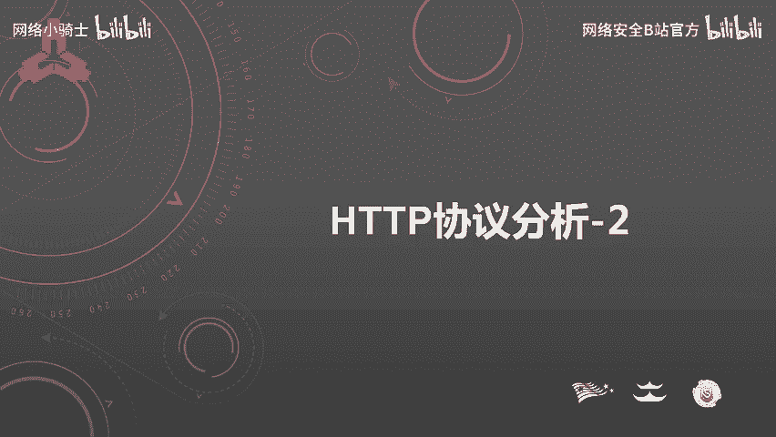

在本节课程中，我们将学习HTTP协议分析的核心内容，重点聚焦于HTTP首部字段的构成、类型、功能，以及如何在实际的CTF题目中应用这些知识来分析和解决问题。

## 概述
HTTP首部字段是构成HTTP报文的关键要素之一。在客户端与服务器之间以HTTP协议进行通信的过程中，无论是请求还是响应，都会使用首部字段来传递额外的重要信息。这些信息包括报文主体的大小、使用的语言、认证信息等。HTTP首部字段由字段名和字段值构成，中间用冒号分隔，并且单个字段可以拥有多个值。

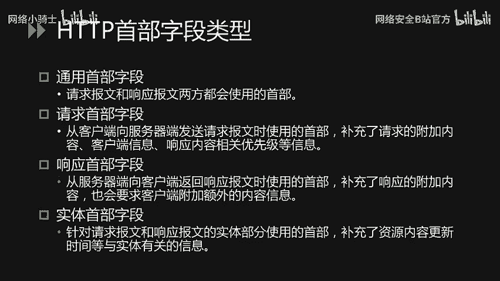

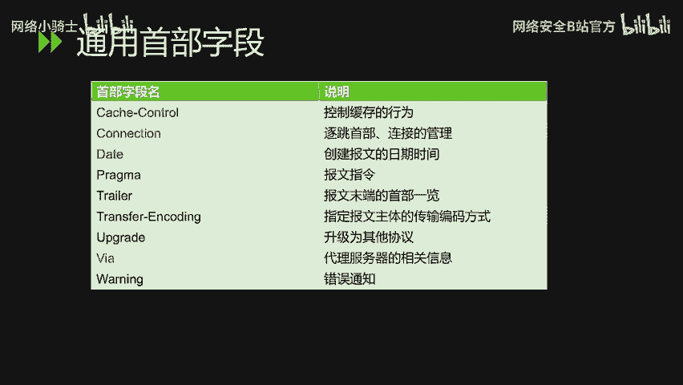

## HTTP首部字段的四种类型
HTTP首部字段主要分为四种类型：通用首部字段、请求首部字段、响应首部字段以及实体首部字段。下面我们将逐一进行详细分析。

### 通用首部字段
通用首部字段是请求报文和响应报文双方都会使用的首部。

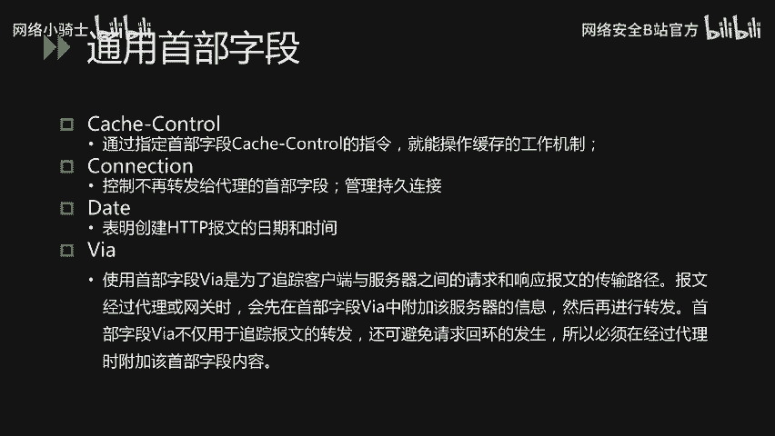

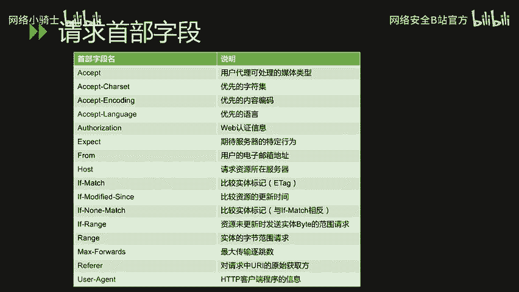

以下是常见的通用首部字段及其作用：
*   **Cache-Control**：通过指定该字段的指令，可以操作缓存的工作机制。
*   **Connection**：该字段有两个主要作用。一是控制不再转发给代理的首部字段，二是管理持久连接。
*   **Date**：表明创建HTTP报文的日期和时间。
*   **Via**：为了追踪客户端与服务器之间的请求和响应报文的传输路径。当报文经过代理或网关时，会先在首部字段`Via`中附加该服务器的信息，然后再进行转发。这不仅用于追踪报文转发，还可避免请求循环的发生，因此经过代理时必须附加此字段。

### 请求首部字段
请求首部字段是从客户端向服务器端发送请求报文时使用的首部，用于补充请求的附加内容、客户端信息、响应内容优先级等。

以下是常见的请求首部字段：
*   **Accept**：通知服务器用户代理能够处理的媒体类型及相对优先级。可使用`type/subtype`形式指定多种类型，例如文本文件`text/html`，图片文件`image/gif`或`image/jpeg`，应用程序`application/octet-stream`。服务器会根据权重值`q`返回优先级最高的类型。
*   **Accept-Language**：告知服务器用户代理能够处理的自然语言集及相对优先级。同样使用`q`值表示权重。例如，客户端会优先请求中文版资源，没有则请求英文版。
*   **Authorization**：告知服务器用户代理的认证信息。其值通常是Base64编码（如Basic认证）。通常在收到401状态码后，客户端会在请求中加入此字段。
*   **Host**：告知服务器请求资源所处的互联网主机名和端口号。**这是HTTP/1.1规范中唯一一个必须被包含在请求内的首部字段**。当同一IP地址部署了多个域名时，必须用此字段明确指出请求的主机名。
*   **Referer**：告知服务器请求的原始资源的URI。客户端通常会发送此字段，但出于安全考虑（如URI中含密码等敏感信息），有时也可不发送。
*   **User-Agent**：将创建请求的浏览器和用户代理名称等信息传达给服务器。

### 响应首部字段
响应首部字段是从服务器端向客户端返回响应报文时使用的首部，用于补充响应的附加内容，或要求客户端附加额外信息。

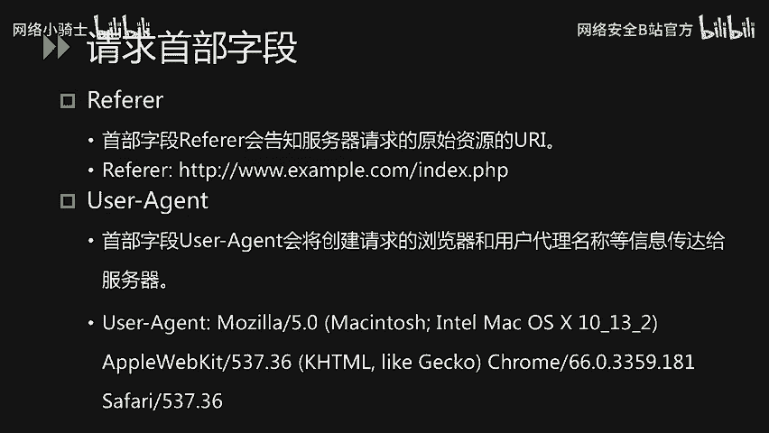

以下是常见的响应首部字段：
*   **Location**：将响应接收方引导至某个与请求URI位置不同的资源。该字段通常配合`3xx`重定向状态码使用，提供重定向的URI。
*   **Server**：告知客户端当前服务器上安装的HTTP服务器应用程序的信息，通常包括软件名称和版本号。

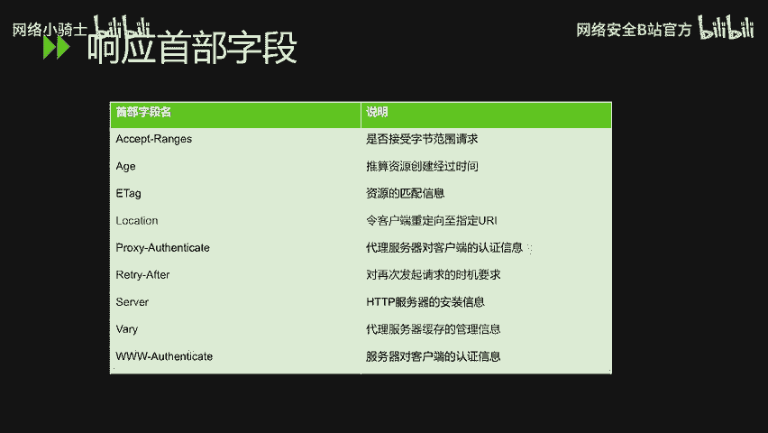

### 实体首部字段
实体首部字段是针对请求报文和响应报文的实体部分使用的首部，补充了与资源实体相关的信息，如更新时间等。

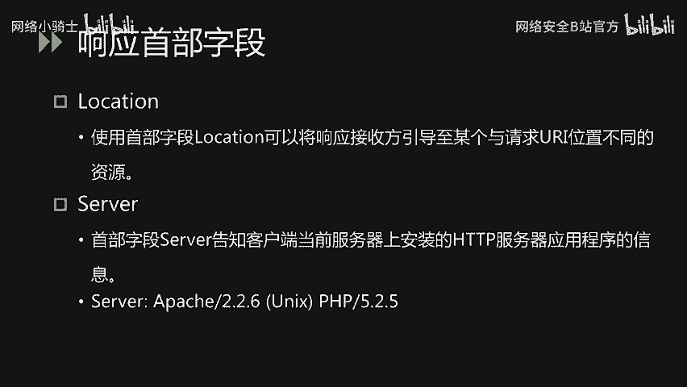

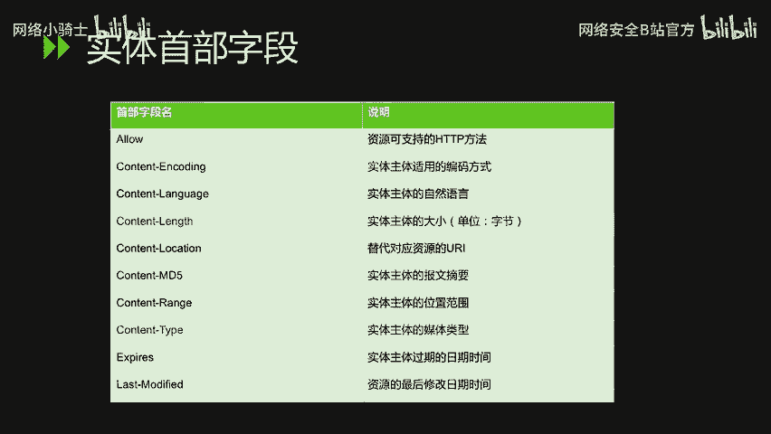

以下是常见的实体首部字段：
*   **Allow**：通知客户端服务器支持的所有HTTP方法（如GET, POST）。当服务器接收到不支持的方法时，会返回状态码`405 Method Not Allowed`。
*   **Content-Length**：指明实体主体部分的大小，单位是字节。
*   **Content-Type**：指明实体主体内对象的媒体类型，使用`type/subtype`形式赋值。

## CTF题目实战讲解
上一节我们介绍了HTTP首部字段的理论知识，本节中我们来看看如何将这些知识应用于CTF题目分析。常见的考察点主要有以下几种：请求方法、User-Agent、Location、Referer、X-Forwarded-For、Accept-Language、Cookie以及自定义首部字段。

以下是针对各个知识点的题目解析：

**1. 请求方法 (Method)**
*   **场景**：GET请求被过滤器或WAF拦截。
*   **解法**：可以尝试将请求方法转换为POST来绕过检测。在Burp Suite中，可以通过右键选择 “Change request method” 来一键切换GET和POST方法。

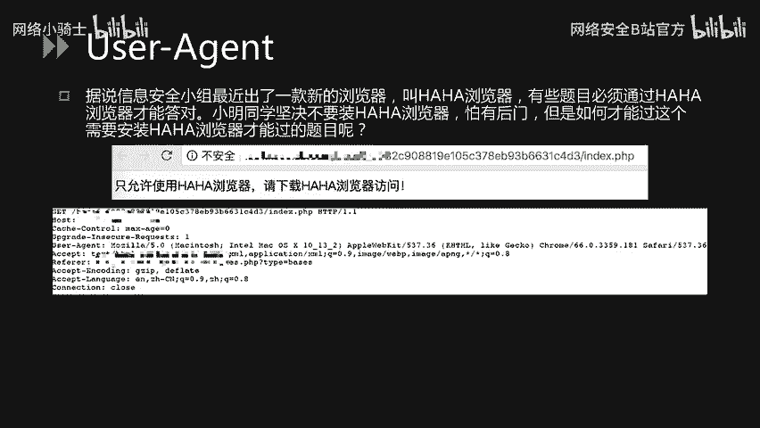

**2. User-Agent**
*   **题目**：页面提示必须使用“哈哈浏览器”访问。
*   **解法**：使用Burp Suite拦截请求包，将`User-Agent`字段的值修改为“哈哈”，即可获得flag。

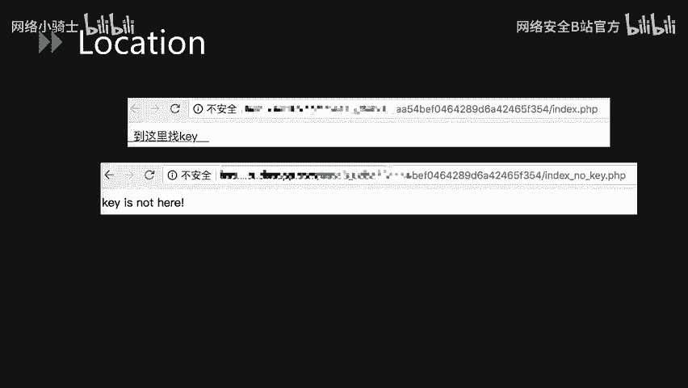

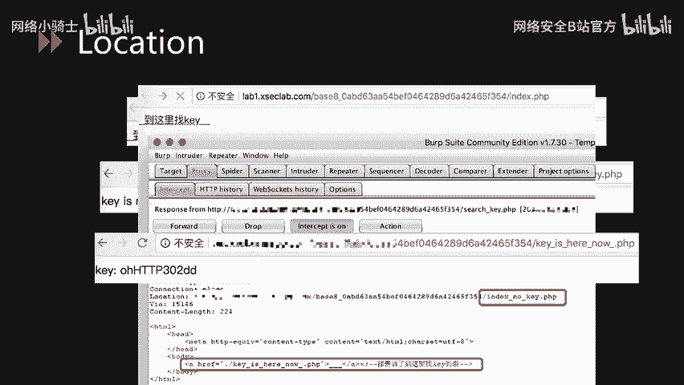

**3. Location**
*   **题目**：点击“到这里找key”超链接后，页面跳转并显示“key is not here”。
*   **解法**：在点击链接时用Burp Suite拦截响应包。通常会收到一个`302`重定向响应，在响应头的`Location`字段或响应实体中可能隐藏了真正的key文件路径，访问该路径即可获取flag。

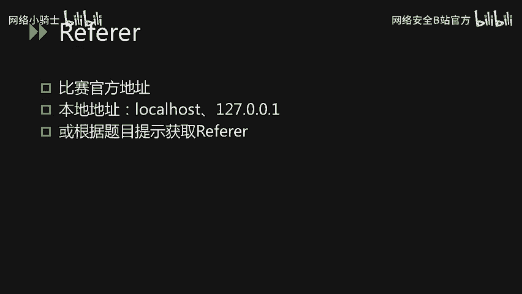

**4. Referer**
*   **题目**：需要从特定来源访问。
*   **解法**：根据题目提示，将请求包中的`Referer`字段值修改为比赛官方地址、本地地址（如`127.0.0.1`）或其他指定地址。

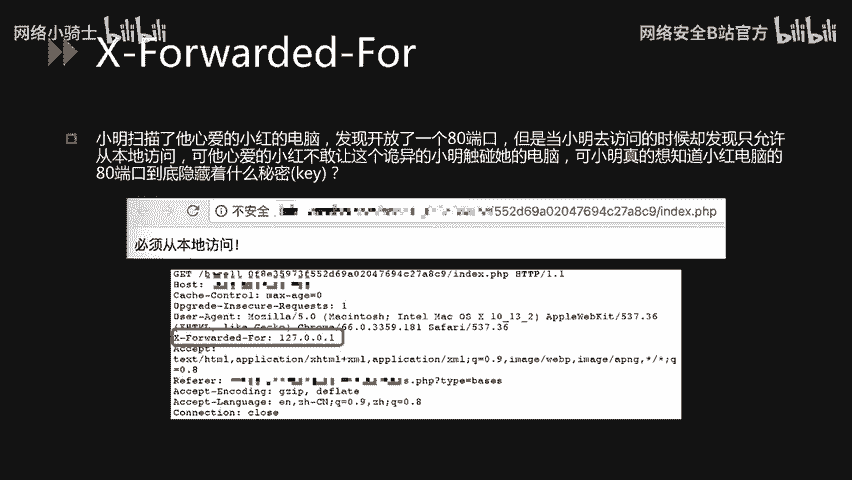

**5. X-Forwarded-For**
*   **题目**：页面显示“必须从本地访问”，但服务只允许本地IP（`127.0.0.1`）访问。
*   **解法**：使用Burp Suite拦截请求，添加`X-Forwarded-For`字段并将其值设置为`127.0.0.1`，以伪造请求来自本地。

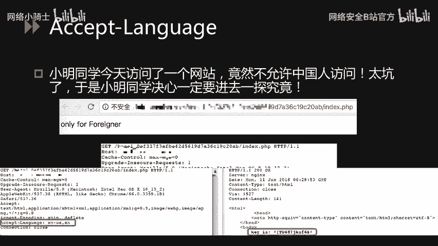

**6. Accept-Language**
*   **题目**：页面显示“only for foreigner”（只允许外国人访问）。
*   **解法**：拦截请求包，将`Accept-Language`字段的值改为`en`（英文）或其他非中文语言，即可获取flag。

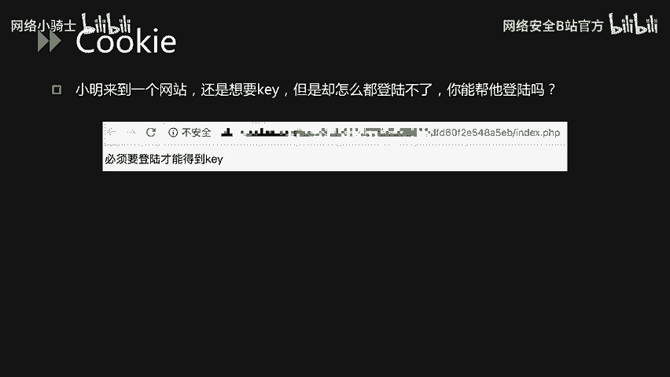

**7. Cookie**
*   **题目**：页面提示“必须要登录才能得到key”，但无法正常登录。
*   **解法**：拦截请求包，发现Cookie值为`login=0`。尝试将其修改为`login=1`或其他可能表示已登录的状态值，通过篡改Cookie来伪造登录状态，从而获取flag。

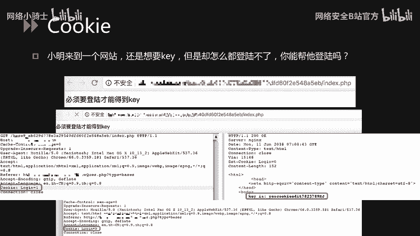

**8. 自定义首部字段**
*   **题目**：页面提示“key就在这里猜在这里是哪里呢？”，暗示key在当前页面或响应中。
*   **解法**：使用Burp Suite拦截服务器的响应报文，仔细检查响应头。可能会发现服务端自定义的首部字段（例如一个名为`Key`或`Flag`的字段），其值就是flag。

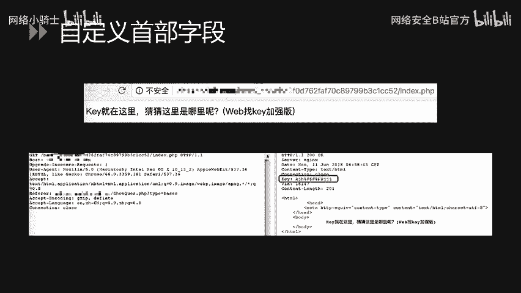

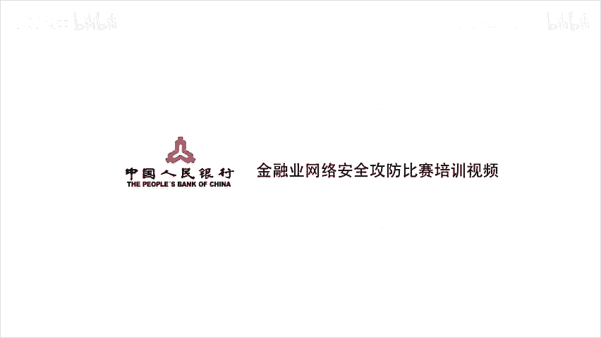

## 总结
本节课中我们一起学习了HTTP协议分析的关键部分——首部字段。我们了解了通用、请求、响应、实体四大类首部字段的功能与常见示例，并通过多个CTF实战题目，掌握了如何通过修改和分析这些首部字段来解题的技巧，包括伪造来源、语言偏好、用户代理、登录状态等。理解并灵活运用HTTP首部字段，是进行Web安全测试和CTF竞赛的重要基础。