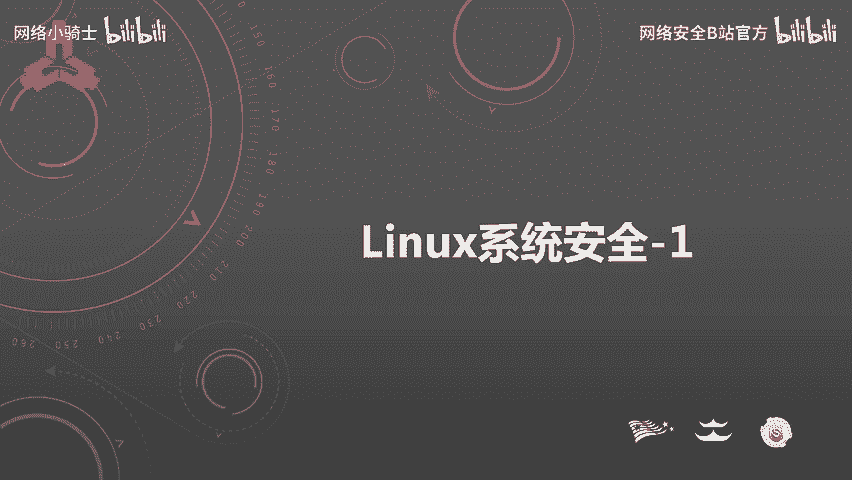
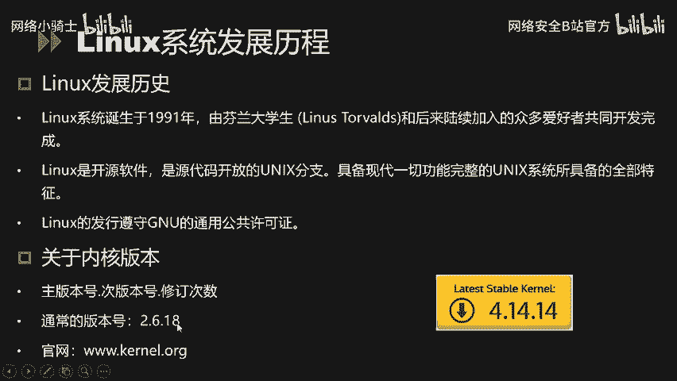
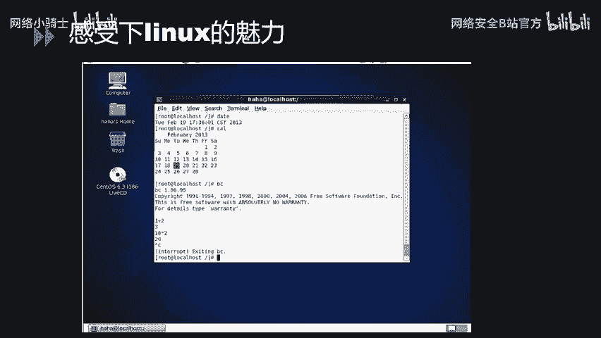
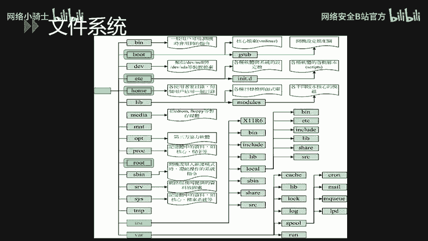
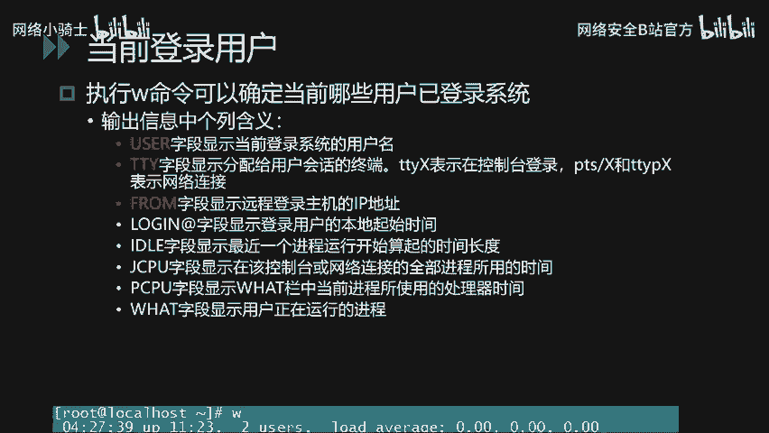
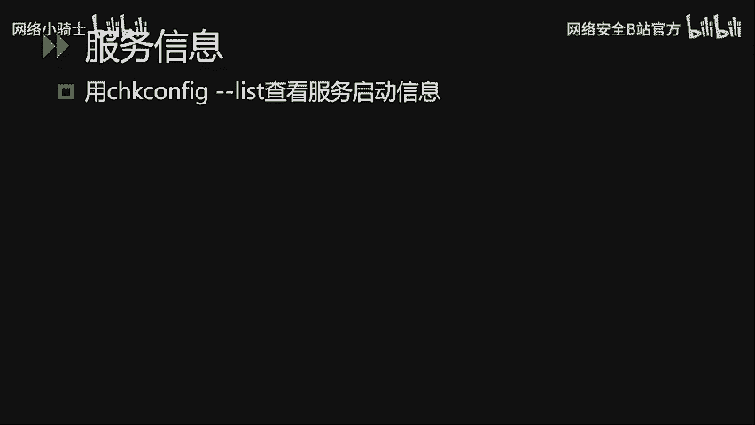

# Linux系统安全：P31：Linux系统安全基础

在本节课中，我们将学习Linux系统安全的基础知识，涵盖Linux简介、文件系统结构以及基本操作三个核心模块。课程内容旨在帮助初学者建立对Linux系统的基本认知，为后续深入学习打下坚实基础。

## 🐧 Linux简介

上一节我们介绍了课程的整体框架，本节中我们来看看Linux操作系统的基本概念。

Linux系统诞生于1991年，由芬兰赫尔辛基大学的学生林纳斯·托瓦兹和后来陆续加入的众多爱好者共同开发完成。1994年，第一个完整的核心版本发布。由于Linux采用开源模式，任何人都能通过网络获取其核心源代码，进行修改后再贡献回社区。这种模式使得Linux被广泛使用，并发展成为一个完整的操作系统。

Linux的标志是一只企鹅，它象征着开源精神。Linux系统可以安装在各种计算机硬件设备中，例如手机、平板电脑、路由器、视频游戏控制台以及大型计算机等。Linux是一个领先的操作系统，世界上运行速度最快的10台超级计算机都运行着Linux操作系统。

严格来说，“Linux”一词本身仅指Linux内核，但人们已习惯用它来统称基于Linux内核的完整操作系统。常见的Linux发行版本包括：
*   **Red Hat**： 1993年创办。
*   **SUSE**： 1994年推出。
*   **Debian**： 1993年创办。
*   **Ubuntu**： 2004年推出。

简单来说，Linux是一个具有Unix系统全部特征的开源操作系统。

了解Linux的发展历程后，这里需要重点强调一下Linux的内核版本。Linux内核版本号主要由三部分组成：**主版本号**、**次版本号**和**修订次数**。常见的版本号格式如 `2.6.18`。目前最新的版本号可能已达到 `4.14.14` 或更高。

对于版本号，需要重点关注第二位**次版本号**：
*   如果次版本号是**偶数**，表示这是一个**稳定版**，适合用于生产环境。
*   如果次版本号是**奇数**，表示这是一个**开发版**，可能包含未修复的Bug，不建议用于生产环境。

因此，像 `2.6.18` 这样的稳定版本常被用于生产环境。

对于初学者，可以通过虚拟机安装的方式来学习Linux。现在许多发行版都带有图形界面（例如CentOS），这使得上手操作变得非常容易。

## 📁 Linux文件系统

讲完Linux的基本概念后，我们现在来深入了解一下Linux的文件系统结构。

理解Linux文件目录结构是掌握系统安全的基础。在Linux系统中，有一个非常重要的哲学：“**一切皆文件**”。系统将所有资源，包括硬件设备，都视为文件（通常称为设备文件）。这样，用户就可以通过读写文件的方式来实现对硬件设备的访问。

Linux系统启动时，首先挂载的是**根文件系统**，即 `/`。整个文件系统呈树状结构展开。以下是Linux常见的核心目录结构及其说明：

从根目录 `/` 开始，主要包含以下目录：`/bin`, `/boot`, `/dev`, `/etc`, `/home`, `/mnt`, `/root`, `/usr` 等。

下面针对每个二级目录做进一步的说明：
*   **/bin**： 存放**在单用户维护模式下仍可操作的基本指令**。该目录下的命令可被root及一般账号使用。
*   **/boot**： 存放**开机启动所需的文件**，包括Linux内核文件以及开机菜单配置文件等。
*   **/dev**： 在Linux系统上，**任何设备都以文件形态存放在此目录中**。
*   **/etc**： 存放**系统主要的配置文件**，例如用户账号密码文件、各种服务的启动脚本等。
*   **/home**： 系统默认的**用户家目录**所在地。
*   **/lib**： 存放**开机时用到的函数库**，以及`/bin`和`/sbin`目录下命令会调用的共享库。
*   **/media**： 用于挂载**可移动设备**，如软盘、光盘、U盘等。
*   **/opt**： 用于给**第三方软件**提供安装目录。
*   **/root**： **系统管理员（root）的家目录**。
*   **/sbin**： 存放**开机、修复和还原系统所需的重要指令**，通常只有root能执行。
*   **/srv**： 可视为“service”的缩写，存放一些**网络服务启动后所需的数据**。
*   **/tmp**： 让**一般用户或正在执行的程序暂时放置文件**的目录。

接下来，我们对部分重要的三级目录进行说明：
*   **/usr/lib**： 存放**各种应用软件的函式库、目标文件及不常用的执行脚本**。
*   **/usr/local**： **系统管理员在本机自行安装软件时，建议的安装目录**。
*   **/var/lib**： 存放**程序本身执行过程中需要使用到的数据文件**。
*   **/var/log**： 这是一个非常重要的目录，用于存放**系统的关键日志记录文件**。
*   **/etc/init.d/**： 存放**系统服务预设的启动脚本**（在采用System V init的系统上）。

## 🔐 系统账户与配置文件

讲完系统的重要目录之后，下面对系统内账户相关的重要配置文件做进一步的讲解。

第一个核心文件是 **`/etc/passwd`**，它存储了用户账户的基本信息。文件中的每一行代表一个用户，各字段由冒号 `:` 分隔。一个样例行如下：
`test:x:1001:1001::/home/test:/bin/bash`

以下是各字段的说明：
1.  **用户名**： 用户登录名，如 `test`。
2.  **密码**： 早期密码直接存储在此字段，现在为了安全，密码已移至 `/etc/shadow` 文件，此处用 `x` 代替。
3.  **用户ID (UID)**： 用户的唯一数字标识。
    *   `0`： 保留给root用户。
    *   `1-499`： 通常分配给系统服务账号。
    *   `500-65535`： 分配给可登录的普通用户。
4.  **组ID (GID)**： 用户所属主组的数字标识。
5.  **描述信息**： 用户的全名或描述（此例为空）。
6.  **家目录**： 用户登录后进入的默认目录，如 `/home/test`。
7.  **登录Shell**： 用户登录后默认使用的Shell程序，如 `/bin/bash`。

系统的默认账号及其UID值通常如下表示：
| 账号 | UID | 说明 |
| :--- | :--- | :--- |
| root | 0 | 系统管理员账户 |
| daemon | 1 | 用于执行系统守护进程 |
| bin, sys, adm | 2,3,4 | 系统任务关联账户 |
| lp | 7 | 打印机守护进程 |
| nobody | 65534 | 特殊账户，通常用于降低进程权限 |

接下来讲解第二个核心文件：**`/etc/shadow`**。此文件专门用于存储加密后的用户密码及相关信息，格式同样以冒号分隔。一个样例行如下：
`test:$6$salt$encrypted_password:18000:0:99999:7:::`

以下是各字段的简要说明：
1.  **用户名**。
2.  **加密密码**： 这是重点字段，由三部分 `$id$salt$encrypted` 组成。
3.  **最后一次修改密码的日期**（距离1970年1月1日的天数）。
4.  **密码不可更改的天数**。
5.  **密码需要更改的天数**。
6.  **密码到期前警告的天数**。

这里重点讲解第二个字段的**密码加密算法**：
*   **ID值**： 指明加密算法。
    *   `$1$`： 使用 **MD5** 加密。
    *   `$5$`： 使用 **SHA-256** 加密。
    *   `$6$`： 使用 **SHA-512** 加密。
*   **盐值 (Salt)**： 一个固定长度的随机字符串，用于防止彩虹表攻击。每次修改密码都会重新生成。
*   **加密后的密文**： 根据指定的算法和盐值，对用户明文密码进行加密后的结果。

公式表示如下：
`加密密码 = $算法ID$盐值$哈希(盐值 + 用户密码)`

## 🖥️ Linux基本操作

Linux系统的文件系统讲解到此结束。下面我们进入实际操作环节，学习Linux的基本命令。

基本操作这一小节主要讲解文件和目录管理、账户管理以及系统状态查看。

### 文件与目录管理

在Linux系统中，定位一个文件或目录有两种方式：
*   **绝对路径**： 从根目录 `/` 开始写起，例如 `/home/test/file.txt`。
*   **相对路径**： 相对于当前工作目录，不是从根开始，例如 `./file.txt` 或 `../other/file.txt`。

以下是目录的基本操作命令：
*   `cd [目录路径]`： 改变当前工作目录。
*   `pwd`： 显示当前工作目录的绝对路径。
*   `mkdir [目录名]`： 创建一个新目录。
*   `rmdir [目录名]`： 删除一个**空**目录。
*   `ls [选项] [文件或目录]`： 列出目录内容或文件信息。

### 文件权限与所有权

Linux文件系统的访问权限分为三类：**文件所有者 (Owner)**、**所属组 (Group)** 和**其他人 (Others)**。可以为每类用户分配不同的权限组合：**读 (r)**、**写 (w)**、**执行 (x)**。

所有文件都归属于一个用户和一个组。可以通过 `ls -l` 命令查看文件或目录的详细权限信息。

相关管理命令如下：
*   `useradd [用户名]`： 创建新用户。
*   `groupadd [组名]`： 创建新组。
*   `chown [用户]:[组] [文件]`： 更改文件的所有者和所属组。
*   `chgrp [组名] [文件]`： 更改文件的所属组。
*   `chmod [权限] [文件]`： 设置文件的权限（可用数字如755或符号如u+x）。
*   `sudo [命令]`： 以超级用户权限执行命令。

### 用户安全管理

*   `useradd [用户名]`： 添加用户。
*   `userdel -r [用户名]`： 删除用户，`-r` 参数表示同时删除其家目录和邮件文件。
*   `passwd -l [用户名]`： 锁定用户账户，禁止登录。
*   `usermod [选项] [用户名]`： 修改用户属性，如有效期、家目录等。
*   `id`： 查看当前用户的UID和GID。

Linux是一个多用户操作系统。执行 `w` 命令可以查看当前登录系统的用户信息。输出信息包含以下字段：
*   `USER`： 登录用户名。
*   `TTY`： 用户使用的终端。`ttyS` 表示控制台登录，`pts/#` 表示网络连接。
*   `FROM`： 远程登录主机的IP地址。
*   `LOGIN@`： 用户登录时间。
*   `WHAT`： 用户正在运行的程序。

### 系统状态查看：端口、进程与服务

**查看端口开放情况**：
1.  使用 `netstat -tulpn` 或 `ss -tulpn` 查看当前监听端口的服务。
2.  使用 `lsof -i :[端口号]` 显示占用特定端口的进程信息。
例如，发现3306端口被PID为1324的进程占用，通过 `lsof -p 1324` 或对照 `netstat` 输出，可以确认该进程是MySQL服务。

**查看进程信息**：
使用 `ps aux` 命令可以查看系统所有进程的详细信息，包括PID、CPU和内存使用率以及命令路径。

**查看服务信息**：
使用 `chkconfig --list`（SysV系统）或 `systemctl list-unit-files`（Systemd系统）可以查看系统服务的启动状态。

Linux系统有**6种运行级别**：
1.  单用户模式（救援模式）。
2.  无网络的多用户模式。
3.  有网络的多用户模式（文本界面）。
4.  保留未使用。
5.  带图形界面的多用户模式。
6.  重启。

通过查看服务配置，可以了解某个服务（如`mysql`）在各级别下是否设置为开机自动启动。如果均为关闭，则需要手动启动该服务。

## 📝 总结

本节课中，我们一起学习了Linux系统安全的基础知识。我们从Linux操作系统的简介和发展历史开始，了解了其开源特性与版本规则。接着，我们深入探讨了Linux“一切皆文件”的哲学，并详细梳理了其树状文件目录结构，特别是与系统配置、日志和安全相关的关键目录。

然后，我们解析了用户认证的核心配置文件 `/etc/passwd` 和 `/etc/shadow`，理解了用户ID、组ID以及密码加密存储的机制。最后，我们掌握了Linux的基本操作命令，包括文件目录管理、权限设置、用户账户管理，以及如何查看系统进程、开放端口和服务状态。这些内容是构建Linux系统安全认知的第一步，为后续学习更深入的安全配置和攻防技术奠定了坚实的基础。