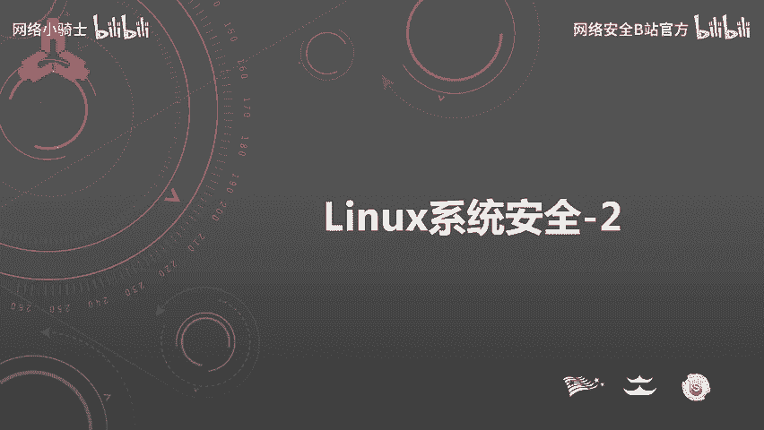
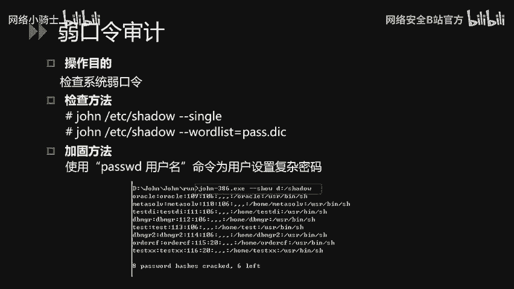
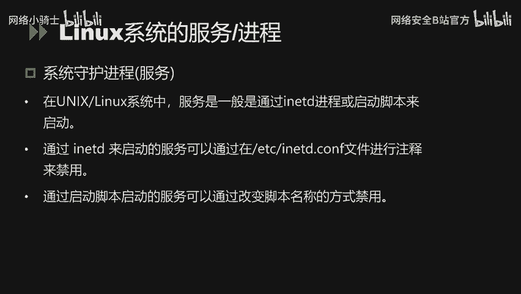
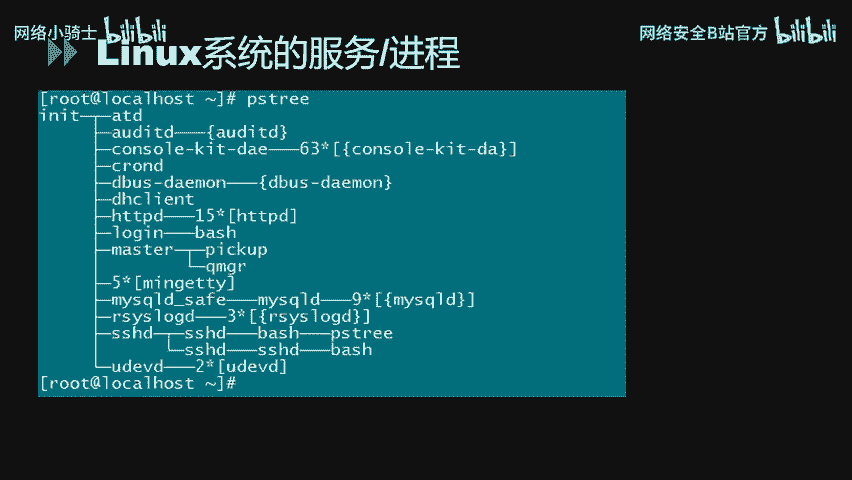
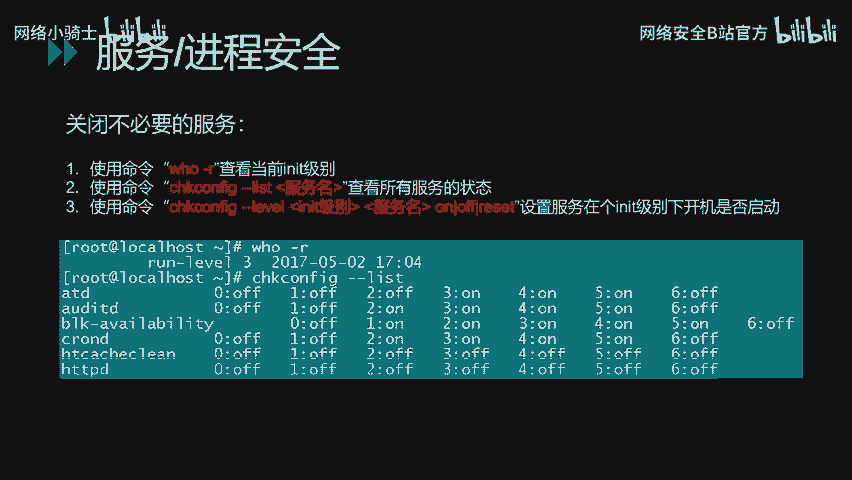
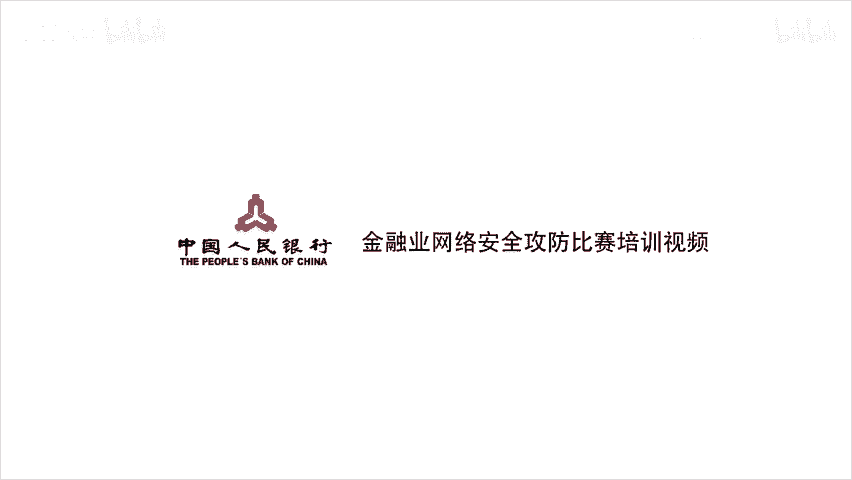

Linux系统安全：P32：33.Linux系统安全配置教程 🔐



在本节课中，我们将学习Linux系统安全配置的核心知识。内容主要分为三个模块：Linux的常规安全配置、账户安全设置以及系统服务与进程的安全配置。我们将从文件权限、账户策略到服务管理，系统地讲解如何加固一个Linux系统。

---

### Linux系统安全：P32：33.1：常规安全配置 ⚙️

上一节我们概述了课程内容，本节中我们来看看Linux的常规安全配置。这部分主要涉及文件目录权限设置、umask值配置、历史命令管理和登录超时等基础安全措施。

针对一些重要的目录和文件，我们需要合理配置其权限以增强安全性。可以使用 `ls -l` 命令查看当前权限设置情况。

对于重要的目录，可以使用 `chmod` 命令进行加固。例如，对 `/etc` 目录进行加固：
```bash
chmod -R 750 /etc
```
此配置完成后，只有root用户对该目录下的文件拥有读、写和执行权限，其他用户均无法访问。

通过 `chmod` 命令可以单独设置权限，但逐个配置非常繁琐。我们可以通过配置umask值，为新建的文件或目录赋予默认权限。

Linux系统默认umask值为022。我们可以通过修改 `/etc/profile` 文件中的umask值来增强安全性。例如，将umask修改为027：
```bash
umask 027
```
这意味着新建的文件属主拥有读写执行权限，同组用户只有读和执行权限，其他用户无任何权限。

Linux系统默认会记录最近输入的命令，并保存在隐藏文件 `~/.bash_history` 中。为提高安全性，避免敏感信息泄露，我们可以限制历史命令的记录总数。

通过修改 `/etc/profile` 文件中的 `HISTFILESIZE` 和 `HISTSIZE` 值来限制记录的命令总数。`HISTFILESIZE` 定义了在历史文件中保存的命令记录总数，`HISTSIZE` 定义了当前会话记住的命令数。例如，将它们都设置为5：
```bash
HISTFILESIZE=5
HISTSIZE=5
```
这样系统只会保留最新执行的5条命令。

在Linux系统中，我们通常通过命令行进行操作。为增加安全性，可以配置连接超时时间。若在规定时间内终端无任何操作，则自动断开连接。

默认方法是修改 `/etc/profile` 文件中的 `TMOUT` 值。例如，设置为180（单位：秒）：
```bash
TMOUT=180
```
这意味着如果3分钟内无任何操作，系统会自动断开会话连接。

下面讲解root用户环境变量PATH的安全设置。PATH环境变量使得我们执行命令时无需输入绝对路径。但有时为了方便，运维人员会将当前目录`.`加入到PATH中，这会带来安全隐患。

例如，当用户在某个目录下执行 `ls` 命令时，如果PATH中包含`.`，且当前目录下存在一个恶意的 `ls` 脚本，那么系统将执行这个恶意脚本而非真正的 `ls` 命令。因此，root用户的PATH环境变量不应包含当前目录`.`。

我们可以使用 `echo $PATH` 命令查看当前值，并通过修改 `/etc/profile` 文件来加固。

常规安全设置的内容如上，主要包括文件目录权限、umask值、历史命令记录和登录超时等配置。

---

### Linux系统安全：P32：33.2：账户安全设置 👤

上一节我们介绍了常规安全配置，本节中我们针对Linux系统的账户安全设置进行讲解。这部分主要涉及账户安全策略、口令策略和远程登录安全策略等。

首先是禁用无用账号，以减少系统风险。系统当前存在的账号可以通过 `cat /etc/passwd` 命令查看。

我们需要与管理员确认哪些账号是不必要的。在不影响业务的情况下，可以通过 `passwd -l` 命令锁定不必要的账号。同时，对于FTP等服务账号，若不需要登录系统，应将其shell设置为 `/sbin/nologin`。

为防止攻击者通过口令爆破的方式攻击，我们可以配置账号锁定策略来降低风险。配置文件为 `/etc/pam.d/system-auth`。

例如，配置连续输错10次密码后，账户锁定5分钟：
```bash
deny=10
unlock_time=300
```
`unlock_time` 的默认单位是秒，因此5分钟设置为300。配置账户锁定策略前，需与管理员确认，确保不影响业务系统登录。

禁用无用账号和配置账号锁定策略后，还需要检查存在的空口令账户和具有root权限的特殊账号。空口令账户是极大的安全隐患，必须整改。具有root权限的账号也必须严格检查。

检查方式如下。检查空口令账户（针对 `/etc/shadow` 文件）：
```bash
awk -F: ‘($2==““) {print $1}’ /etc/shadow
```
检查具有root权限的账户（UID为0，针对 `/etc/passwd` 文件）：
```bash
awk -F: ‘($3==0) {print $1}’ /etc/passwd
```

对于长期不使用或未定期修改密码的账号，可以通过配置口令周期策略来强制用户定期修改密码，否则锁定其账号。配置文件为 `/etc/login.defs`。

该文件有三个关键参数：
*   `PASS_MAX_DAYS`：新建用户密码最长使用天数。
*   `PASS_MIN_DAYS`：新建用户密码最短使用天数。
*   `PASS_WARN_AGE`：新建用户密码到期前提醒天数。

同时，可以针对特定账号设置口令策略。例如，将某用户的密码最长使用天数设为30天，最短为0天，账号在2000年1月1日过期，过期前7天提醒：
```bash
chage -M 30 -m 0 -E 2000-01-01 -W 7 username
```

为避免空口令和弱口令账户的存在，可以通过口令复杂度策略强制用户配置满足强度要求的口令。修改配置文件 `/etc/pam.d/system-auth`。

例如，要求口令至少8位，且包含小写字母、大写字母和数字各一位：
```bash
minlen=8 lcredit=-1 ucredit=-1 dcredit=-1
```

对于root用户，需要限制其不能通过telnet远程登录。首先通过 `/etc/securetty` 文件查看当前配置，然后通过 `console` 参数配置限制root只能在本地登录。

root权限必须严格限制。可以通过PAM认证模块控制哪些用户可以使用 `su` 命令获取root权限。配置方法如下：首先修改 `/etc/pam.d/su` 文件，在开头添加配置，指定只有 `wheel` 组的用户才能使用 `su` 命令，然后通过 `usermod` 命令将授权用户添加到 `wheel` 组。

为防止他人通过物理接触，利用Linux单用户模式重置root密码，可以对系统引导管理器（GRUB）添加密码。需要修改 `/etc/grub.conf` 文件，配置一个 `password` 字段并设置密码。



对于使用SNMP服务的系统，必须修改其默认团体字（community string）。使用只读团体字可能导致信息泄露，使用读写团体字可能导致设备被控制。修改配置文件为 `/etc/snmp/snmpd.conf`。如果不必要，建议禁用SNMP服务。

最后，可以通过第三方工具检查系统中存在的弱口令账户。例如，使用 `john` 工具进行审计。一种检查模式为“single”模式，尝试用用户名的各种变体破解口令。另一种是指定密码字典模式，针对内部常见弱口令进行审计。

Linux系统的账户安全配置大致从账户权限、口令策略、弱口令审计等多方面进行了讲解。

---



### Linux系统安全：P32：33.3：服务与进程安全配置 🛡️



上一节我们探讨了账户安全，下面对Linux系统的服务和进程安全配置进行讲解。主要从进程查看方法、常见服务的安全配置等方面进行说明。

在Linux系统下，每个启动的服务都会有对应的进程。服务就是运行在服务器上监听用户请求的进程，通过不同的监听端口号来区分。例如：
*   FTP服务：21端口
*   SSH服务：22端口
*   Telnet服务：23端口
*   SMTP服务：25端口
*   HTTP服务：80端口
*   MySQL服务：3306端口

在Linux操作系统中，服务一般通过init进程或启动脚本来启动。对于通过init进程启动的服务，可以通过修改 `/etc/inittab` 文件来配置启用或禁用。对于通过启动脚本启动的服务，可以通过修改脚本名称的方式来禁用。

我们可以使用 `pstree` 命令以树状图方式直观显示进程间的派生关系。使用 `ps aux` 命令可以显示每个进程的PID、所属用户、CPU和内存使用情况等信息。

下面针对Linux系统上常见的服务进行安全配置讲解。

首先是SSH服务。其配置文件默认为 `/etc/ssh/sshd_config`。我们可以通过修改该文件内的 `PermitRootLogin` 参数为 `no`，来限制root用户远程登录。建议将SSH协议版本调整为2，因为版本1存在已知漏洞。此外，可以调整 `MaxAuthTries` 的值，以避免攻击者对账户口令进行爆破。调整参数后，需使用 `service sshd restart` 命令重启服务使配置生效。

接下来是TCP Wrappers服务。这是一个工作在传输层的安全工具，可以对特定服务进行安全检测和访问控制。其主要功能是控制谁可以访问哪些程序。常见受控程序有rpcbind、sshd、telnet等。

例如，在 `/etc/hosts.allow` 文件中配置允许访问sshd服务的IP地址，在 `/etc/hosts.deny` 文件中配置拒绝所有其他IP访问sshd服务，这样就可以实现IP白名单控制。

针对NFS文件共享服务，我们可以使用 `exportfs` 命令管理当前共享的文件系统列表，查看并确认不必要的共享目录后，通过修改 `/etc/exports` 文件来删除它们。

syslog是Linux系统的默认日志守护进程，配置文件为 `/etc/syslog.conf`。任何需要生成日志信息的程序都可以向其接口呼叫。我们可以修改配置，将认证相关的信息记录到特定文件（如 `/var/log/secure`）中，以便进行安全审计。同时，也可以根据实际需求配置系统和内核日志。

对于 `Ctrl+Alt+Del` 按键组合（在系统中可用于重启），为避免误操作导致业务中断，可以通过修改 `/etc/inittab` 文件来禁用该功能。在对应行开头添加注释符 `#`，保存后通过 `init q` 命令重新应用配置即可。

对于不必要的服务，应及时关闭。暴露的服务越多，风险越大。首先，可以使用 `runlevel` 命令查看当前运行级别。然后，通过 `chkconfig --list` 命令查看该级别下自动启动的服务。最后，使用 `chkconfig --level` 命令为对应服务在对应级别下设置默认的启动状态（开启或关闭）。

---





本节课中，我们一起学习了Linux系统安全的三个核心方面：常规安全配置、账户安全设置以及服务与进程安全配置。从基础的权限管理、历史命令控制，到复杂的账户口令策略、服务访问控制，我们系统地掌握了加固Linux服务器、提升其防御能力的关键方法和实用命令。