# CTF最强战队蓝莲花内部培训教程：P33：34.Linux系统安全 🛡️


在本节课中，我们将要学习Linux系统安全的核心知识，主要包括网络安全配置、日志审计安全以及系统常见安全工具的使用。通过学习，你将能够掌握如何加固Linux系统、分析安全日志以及使用工具进行安全检测。

## 网络安全配置 🔧

上一节我们介绍了课程概述，本节中我们来看看Linux系统的网络安全配置。这部分内容主要分为网络参数配置和iptables自定义规则设置两大块。

### 网络参数配置

系统中提供了`sysctl`命令，可以查看当前的网络参数。我们可以使用`sysctl -a`查看当前的网络参数配置。然后我们可以通过修改`/etc/sysctl.conf`这个文件内的参数来调整当前系统的网络参数配置。

以下是几个关键的安全配置示例：

*   **忽略ICMP广播**：配置系统忽略ICMP广播，这样就不会对ping请求做出回应。这样外部就无法通过ping来发现该主机。
*   **修改TTL值**：通过修改TTL值可以隐藏当前操作系统的正确类型。因为有些扫描器是通过系统返回的TTL值来判断当前的操作系统类型的。

完成修改配置后，我们可以通过`sysctl -p`命令来使配置生效。

### iptables防火墙

iptables是Linux内核集成的IP信息包过滤系统。如果系统连接到互联网或局域网，使用iptables可以更好地控制IP信息包过滤，实现防火墙功能。

下面讲一下Linux的iptables命令选项的输入顺序。第一个选项是`-t`表明表名，然后是规则链名、规则号、网卡名、协议名、源端口、目的端口，最后是动作，即针对匹配规则后对数据包做出的行为。

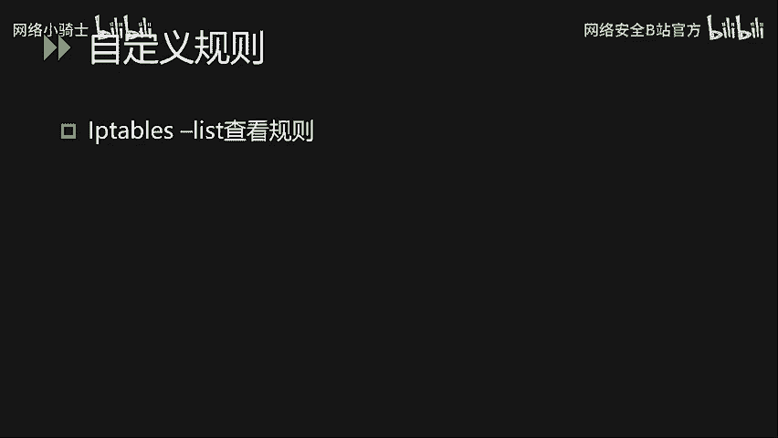

以下是常见的参数选项：

*   `-A`：向规则链中添加条目，即新增一条防火墙规则。
*   `-D`：从规则链中删除条目。
*   `-I`：在防火墙规则链中插入对应的条目。
*   `-L`：查看当前已有的防火墙规则策略。
*   `-p`：用来匹配具体协议的数据包类型。
*   `-s`：匹配数据包的源IP地址。
*   `-j`：指定要跳转的目标。
*   `-i`：指定数据包进入本机的网络接口。
*   `-o`：指定数据包离开本机所使用的网络接口。

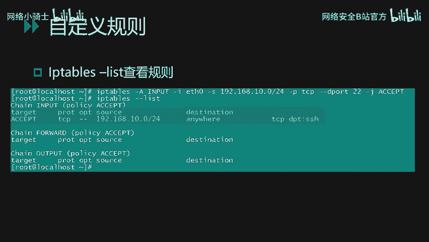

以下是规则链的主要内容：

*   **INPUT链**：处理输入的数据包，即系统接收的数据包。
*   **OUTPUT链**：处理输出的数据包，即本系统向外发送的数据包。
*   **FORWARD链**：处理转发的数据包。

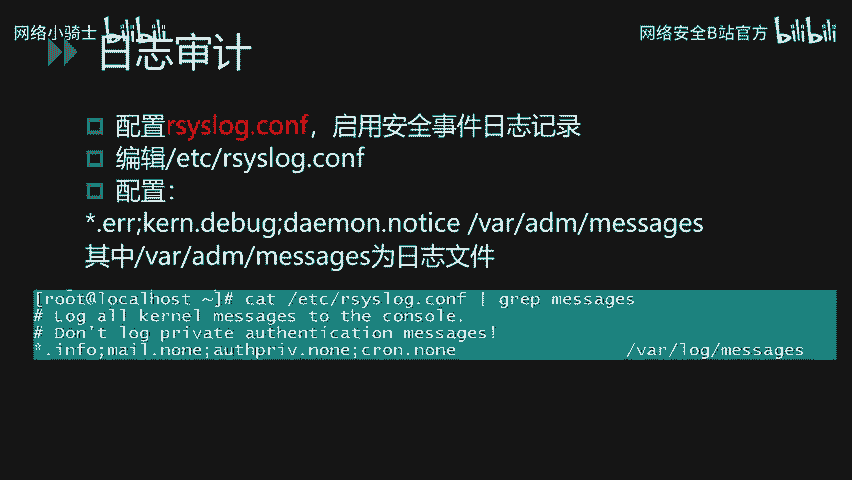

常见的动作有：

*   **ACCEPT**：表示接收该数据包。
*   **DROP**：表示丢弃该数据包。
*   **REDIRECT**：表示将这个数据包转发到另一个指定的地方。

下面我们看几个具体的iptables规则例子。

**示例1：限制SSH访问**
```bash
iptables -A INPUT -s 192.168.0.0/24 -p tcp --dport 22 -j ACCEPT
```
这条规则限制仅从`192.168.0.0/24`网段内的IP地址才能够连接到本机的22端口，即限制访问本机SSH服务的主机只能是该网段内的主机。

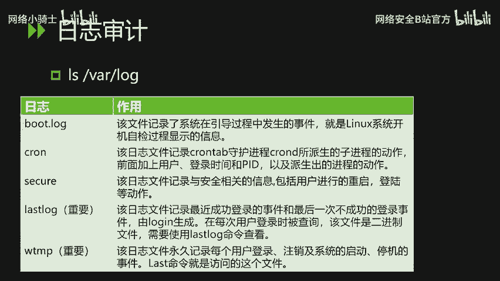

**示例2：限制外发UDP连接**
```bash
iptables -A OUTPUT -o eth0 -p udp -j DROP
```
这条规则限制本机`eth0`网卡无法向外发起UDP连接，即向外的UDP包都会被丢弃。

添加完自定义规则后，我们可以通过`iptables -L`命令来查看当前的所有规则链。规则链通常分为三块：INPUT（进入）、FORWARD（转发）和OUTPUT（外发）。

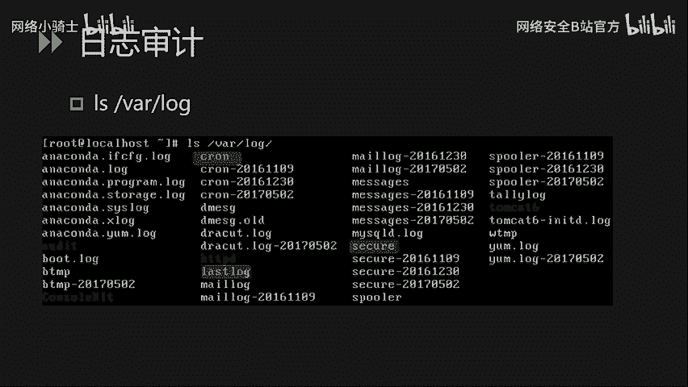

## 日志审计安全 📝

上一节我们介绍了网络安全配置，本节中我们来看看Linux的日志审计安全。日志审计安全主要讲解日志审计功能配置和日志的简单分析。通过日志分析，我们可以发现一些可疑的攻击行为。

首先，我们需要启用Linux系统的安全日志审计功能。通过配置`/etc/rsyslog.conf`文件来启动日志审计功能。系统的错误日志、内核日志、调试日志等都会被记录到`/var/log/messages`这个文件中。

系统的日志默认情况下都保存在`/var/log`目录下。该目录下有一些常见的重要日志文件：

*   **`dmesg`文件**：该日志文件记录了系统在引导过程中发生的事件，即Linux系统开机自检过程显示的相关信息。
*   **`cron`日志**：记录了cron守护进程所派生的子进程的相关动作。
*   **`secure`日志**：记录了与安全相关的信息，包括用户进行的重启、登录等动作内容。
*   **`lastlog`文件**：这是一个比较重要的日志。该文件记录了最近成功登录的事件和最后一次不成功的登录事件。因为该文件是一个二进制文件，所以我们需要使用`lastlog`命令来查看。
*   **`wtmp`日志**：永久记录每个用户的登录、注销及系统启动、停机等事件。我们可以使用`last`命令来访问这个文件。

除了这些系统日志外，第三方服务的日志（如HTTP日志、Tomcat日志）也会保存在该目录中。

开启对应的日志审计功能后，我们就可以通过日志分析来发现恶意的攻击行为或者非法的登录行为。

### 日志分析示例


`messages`日志内容格式一般包括事件的发生时间节点。`cron`日志的内容也包含了时间节点和进程ID。

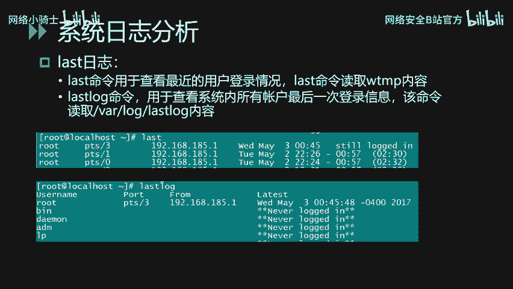

下面针对SSH日志的异常行为进行分析。首先我们可以通过命令查看一下SSH日志的内容。我们通过`cat`命令，然后加上`grep`参数来匹配`sshd`这个服务的相关日志内容。从日志记录中可以看到每个SSH会话的源IP地址。


例如，一条日志显示从`192.168.68.1`的9528端口发起的SSH登录行为，使用的是`root`账号，而且密码被接受成功登录。

下面我们看一下SSH弱口令爆破日志是怎样一个情况。从日志中可以看到有很多的`fail`或者说`invalid`事件。从事件发生的时间节点和频繁的密集度来分析，我们可以初步断定这是一个SSH口令爆破行为。

如果在日常运维中，通过日志分析发现有这样的行为，建议将日志导出，然后做批量分析检查是否有登录成功的情况，再针对情况做口令和账号的定位。

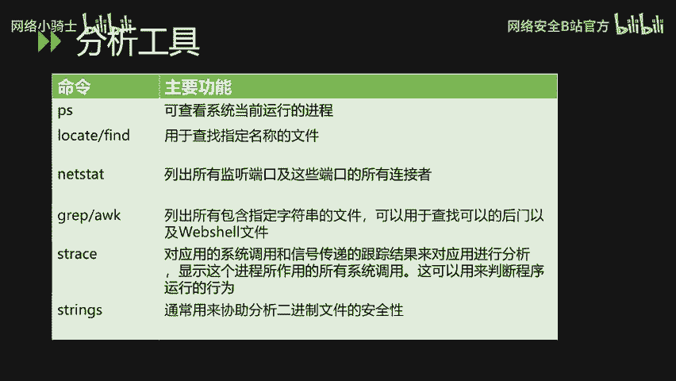

### `last`和`lastlog`命令

`last`命令查看最近用户的登录情况。我们可以看到登录的账号名称、登录的位置（本地还是远程）、登录的源IP地址、登录的时间等。

`lastlog`命令查看的是系统内所有账号的最后一次登录信息。我们可以通过该命令发现异常的登录行为。例如，可以发现`root`账号从某个IP登录，而其他用户（如`demo`， `adm`， `lp`）从未被登录过。

## Linux下的安全工具 🛠️

讲完系统日志分析之后，我们再讲一下Linux下的安全工具。主要包括一些Linux下常见的命令和后门检测工具。

### 系统自带命令

通过系统自带命令，我们可以对可疑的进程进行定位分析，从而定位恶意进程和对应的恶意文件。

以下是常用的系统命令：

*   **`ps`命令**：该命令用于查看当前运行的进程。
*   **`find`或`locate`命令**：用于查找定位指定名称的文件。我们可以通过关键字的方式进行全系统搜索。
*   **`netstat`命令**：列出所有监听的端口和这些端口当前的连接状态。
*   **`grep`和`awk`**：都是文本字符串的处理工具，可以用于帮助查找文件内的关键字。经常用于通过关键字来匹配文件内容，从而定位恶意文件，例如Webshell后门文件。
*   **`lsof`命令**：显示进程所打开的所有系统文件，这个可以用来帮助我们判断程序的运行行为。
*   **`strings`命令**：可以用来协助分析二进制文件的安全性。

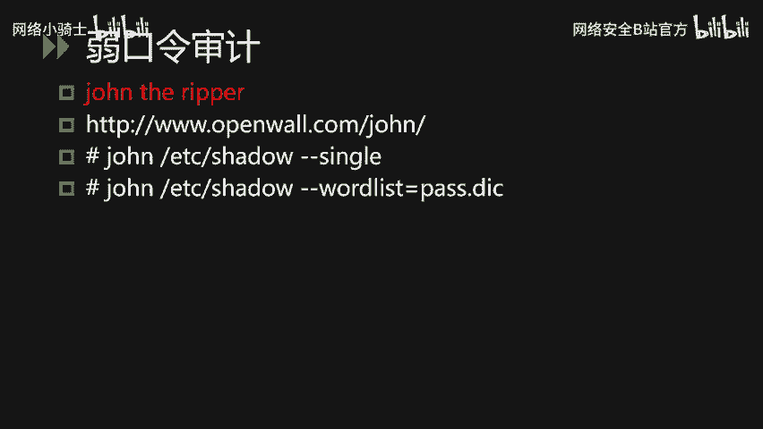

下面讲两个实际使用的例子。

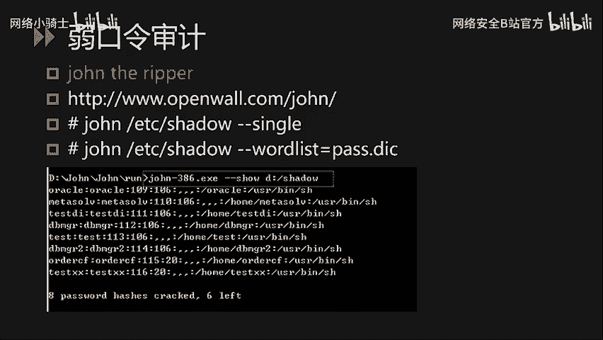

**示例1：使用grep命令查找Webshell**
首先我们可以了解到一句话木马的内容，从中可以提取出关键字`eval`和`post`。然后我们可以使用`grep`命令来对Linux下的Web应用目录进行检查，看是否存在相关的内容。
```bash
grep -r -i "eval.*post" /app/website/
```
其中，`-i`参数表示不区分大小写，`-r`参数表示指定搜索对应的目录及其子目录。通过这种方式，我们就可以手工进行筛查来排查Webshell。

**示例2：使用find命令结合grep**
```bash
find /app/website/ -type f | xargs grep -l "eval.*post"
```
这里使用到了`xargs`参数，将`find`搜索出来的文件名变为后面`grep`参数的输入。通过这种方式，我们也可以手工来排查一遍Webshell。

### 口令审计工具

在日常运维中，弱口令是经常碰到的安全问题。我们会从两个层面介绍两个工具，对Linux系统的口令强度进行审查。

**1. John the Ripper**
`John the Ripper`工具能够对Linux系统的`/etc/shadow`文件进行口令破解审计。使用该工具时，必须有权限获取到目标系统的shadow文件。
该工具除了能够审计Linux系统的弱口令，还能够审计Oracle数据库、AIX系统的弱口令。
这个工具有两种常见的使用方法：
*   **方法一**：`john --single /etc/shadow`。`--single`参数代表提取账户名后，利用账户名的各种格式变化来爆破对应的密码。
*   **方法二**：`john --wordlist=password.lst /etc/shadow`。这种我们可以通过收集内部常见的弱口令，形成一个字典后做针对性的爆破。

**2. Hydra（九头蛇）**
`Hydra`工具与John the Ripper的区别在于它不需要提取对应的口令加密文件，而是通过在线爆破的方式进行口令审计。好处是不用提取密码文件，坏处是可能因为爆破尝试导致账户被锁定。
使用示例：
```bash
hydra -l login -P passlist.txt 192.168.0.1 ftp
```
这条命令使用`login`账户和`passlist.txt`密码字典来爆破`192.168.0.1`上面的FTP服务的`login`账户的密码。

常见的弱口令审计主要是这两大类，一种是在线爆破的方式，一种是提取密码文件的方式，各有优缺点。在实际项目实施时，可根据情况选择对应的工具。

### 后门检测工具

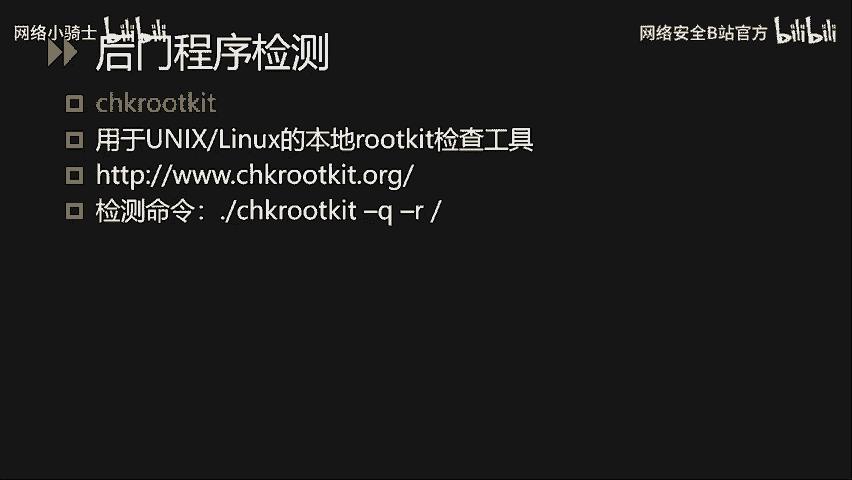

在Linux系统当中，后门一般被称为Rootkit。下面介绍两个检测工具。

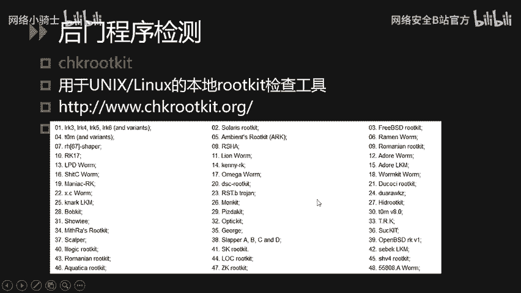

**1. chkrootkit**
它是一个用于Linux本地的Rootkit检测工具。据官方介绍，目前的工具能够进行的Rootkit检查类型可以达到60多种。使用方法比较简单，安装后直接运行`./chkrootkit -q -r /`，就会对当前整个操作系统根目录下的所有文件进行后门程序检测。

**2. rkhunter（Rootkit Hunter）**
使用起来也是比较简单的，安装完工具之后，直接使用`rkhunter --check`命令即可。在检查过程中，程序会随时打印出每一项的检查结果。检查结果会生成一份具体的报告，报告文件放在`/var/log/rkhunter.log`中。

## 总结 📚

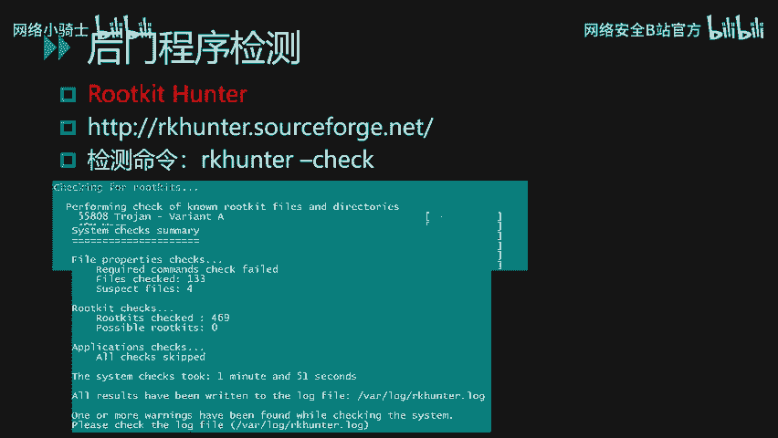


本节课中我们一起学习了Linux系统安全的三大核心内容。
首先，我们学习了**网络安全配置**，包括如何使用`sysctl`调整网络参数以增强隐蔽性，以及如何使用`iptables`配置防火墙规则来控制网络流量。
其次，我们探讨了**日志审计安全**，了解了如何启用日志审计功能，熟悉了关键的系统日志文件（如`secure`， `lastlog`， `wtmp`），并学习了使用`last`， `lastlog`等命令分析日志以发现可疑登录和攻击行为。
最后，我们介绍了一系列**Linux下的安全工具**，包括用于进程和文件分析的系统命令（`ps`， `find`， `grep`等），用于检测弱口令的工具（John the Ripper， Hydra），以及用于检测系统后门的工具（chkrootkit， rkhunter）。
通过掌握这些知识，你将具备基础的Linux系统安全加固、监控和排查能力。