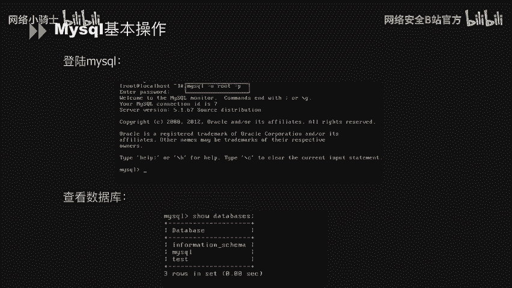
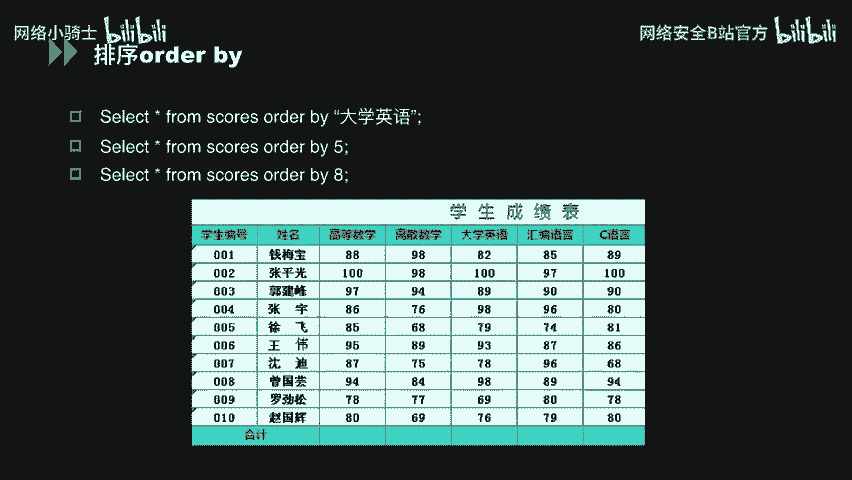
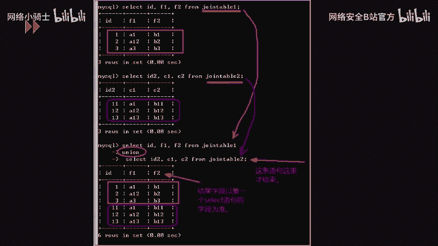
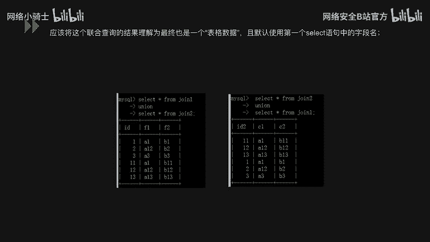

# CTF最强战队蓝莲花内部培训教程：P34：MySQL常用命令 🗄️


在本节课中，我们将学习MySQL数据库的基本操作命令。这些命令是进行数据库管理和后续安全测试的基础。我们将从登录数据库开始，逐步介绍对数据库的增、删、改、查等核心操作。



## 概述
本节内容涵盖MySQL的常用基本命令，包括数据库连接、用户管理、数据表操作以及联合查询等。掌握这些命令是理解数据库工作原理和进行后续安全分析的关键。

## 登录MySQL
首先，我们需要连接到MySQL数据库。登录命令的基本格式如下：
```bash
mysql -u 用户名 -p
```
执行该命令后，控制台会提示输入密码。输入正确的密码后，即可进入MySQL命令行界面。

进入MySQL后，可以使用以下命令查看当前数据库服务器上的所有数据库：
```sql
SHOW DATABASES;
```

## 用户与权限管理
以下是关于MySQL用户和权限管理的几条基本命令。

**新建用户并授权**：在创建用户的同时，可以为其赋予特定权限并设置密码。
```sql
GRANT 权限 ON 数据库.* TO ‘用户名’@‘主机名’ IDENTIFIED BY ‘密码’;
```

**查询、授予与撤销权限**：
*   `SHOW GRANTS FOR ‘用户名’@‘主机名’;`：查看指定用户的权限。
*   `GRANT SELECT, INSERT, DELETE ON 数据库.* TO ‘用户名’@‘主机名’;`：为用户添加`SELECT`、`INSERT`、`DELETE`等操作权限。
*   `REVOKE 权限 ON 数据库.* FROM ‘用户名’@‘主机名’;`：撤销用户的特定权限。

**查看系统信息**：
*   `SELECT VERSION();`：查看当前数据库版本。
*   `SELECT NOW();`：查看当前服务器时间。
*   `SHOW VARIABLES LIKE ‘%log%’;`：查看日志文件相关配置。
*   `SELECT user, host, password FROM mysql.user;`：查看所有用户及其主机和密码信息（注意：密码字段在MySQL 5.7+版本中已变更）。

## 数据库操作：增（INSERT）
上一节我们介绍了如何管理用户，本节中我们来看看如何操作数据。首先是增加数据，主要涉及`CREATE`和`INSERT`命令。

**创建数据表**：使用`CREATE TABLE`命令可以创建一张新表。
```sql
CREATE TABLE scores (id INT, name VARCHAR(50), grade INT);
```
这条命令创建了一个名为`scores`的表，包含`id`、`name`和`grade`三个字段。

**插入数据**：表创建后，使用`INSERT INTO`命令向表中添加数据。
```sql
INSERT INTO students (name, money, sex, phone) VALUES (‘张三’, 100, ‘男’, ‘13800138000’);
```
这条命令向`students`表的指定列插入了数据。如果插入的值与表中所有列的顺序完全匹配，可以省略列名：
```sql
INSERT INTO students VALUES (‘李四’, 200, ‘女’, ‘13900139000’);
```

## 数据库操作：删（DELETE）
接下来，我们学习删除操作，主要使用`DROP`和`DELETE`命令。

**删除数据表**：`DROP TABLE`命令可以快速删除整张表。
```sql
DROP TABLE table_name;
```

**删除数据行**：`DELETE FROM`命令用于删除表中的特定行。
```sql
DELETE FROM table_name WHERE id = 1;
```
这条命令仅删除`table_name`表中`id`等于1的那一行数据。

## 数据库操作：改（UPDATE）
学会了增删，我们再来看看如何修改数据。修改操作主要通过`ALTER`和`UPDATE`命令实现。


**修改表结构**：`ALTER TABLE`命令用于修改数据表的结构，例如添加列、修改列类型或重命名表。
```sql
ALTER TABLE students ADD COLUMN email VARCHAR(100);
```

**修改数据内容**：`UPDATE`命令用于修改表中已有的数据。
```sql
UPDATE students SET money = 100;
```
这条命令会将`students`表中所有行的`money`字段值改为100。通常我们会使用`WHERE`子句来限定修改范围：
```sql
UPDATE students SET money = 200 WHERE name = ‘HK’;
```
这条命令仅将`name`为‘HK’的行的`money`值修改为200。

## 数据库操作：查（SELECT）
最后，也是最重要的操作是查询。以下是几个关键的查询命令。

**查看表结构与列表**：
*   `DESC table_name;`：查看指定表的结构。
*   `SHOW TABLES;`：查看当前数据库中的所有表。



**查询数据**：`SELECT`命令是查询数据的核心。
*   `SELECT * FROM students LIMIT 1, 5;`：从第2条记录开始（`LIMIT`索引从0开始），查询5条数据。
*   `SELECT * FROM students LIMIT 5;`：仅查询前5条数据。
*   `SELECT id, name, sex, money, phone FROM students;`：查询指定字段。
*   `SELECT * FROM students;`：查询表中所有数据。


## 数据排序（ORDER BY）
在查询结果的基础上，我们经常需要对其进行排序。`ORDER BY`子句可以实现这个功能。

假设有一张学生成绩表`scores`，包含“大学英语”等列。
```sql
SELECT * FROM scores ORDER BY 大学英语;
```
这条语句会按“大学英语”这一列的值对结果进行升序排序。

除了使用列名，也可以使用列的序号进行排序：
```sql
SELECT * FROM scores ORDER BY 5;
```
如果“大学英语”是第5列，那么这条语句与上一条效果相同。需要注意的是，如果`ORDER BY`后面的数字超过了表的列数，数据库会报错。这个特性在后续的SQL注入漏洞利用中可能会被用到。



## 联合查询（UNION）
上一节我们介绍了排序，本节中我们来看看如何合并多个查询结果。联合查询`UNION`用于将两个或多个`SELECT`语句的结果集合并为一个结果集。

**定义**：联合查询将两个具有相同字段数量的查询语句的结果，以上下堆叠的方式合并。

**示例**：
假设有两个表`table1`和`table2`。
```sql
-- 查询table1
SELECT id, f1, f2 FROM table1;
-- 查询table2
SELECT id, c1, c2 FROM table2;
-- 联合查询
SELECT id, f1, f2 FROM table1
UNION
SELECT id, c1, c2 FROM table2;
```
最终结果会将两个表的数据纵向合并显示。

**使用限制**：
1.  所有`SELECT`语句的查询结果的列数必须相同。
2.  对应列的数据类型应该兼容（例如，都是字符串或都是数值类型）。

**语法与特性**：
```sql
SELECT 语句1
UNION [ALL | DISTINCT]
SELECT 语句2;
```
*   默认使用`DISTINCT`，会自动去除重复的行。
*   使用`UNION ALL`可以保留所有行，包括重复的。
*   结果集的顺序与`SELECT`语句的顺序有关，交换`UNION`前后语句的位置，最终结果的上下顺序也会改变。




## 总结
本节课中我们一起学习了MySQL数据库的常用基本命令。我们从数据库登录开始，逐步掌握了用户权限管理、数据的增（`INSERT`）、删（`DELETE`）、改（`UPDATE`）、查（`SELECT`）操作，以及数据排序（`ORDER BY`）和联合查询（`UNION`）等高级功能。这些命令是操作和理解数据库的基石，请务必熟练掌握。