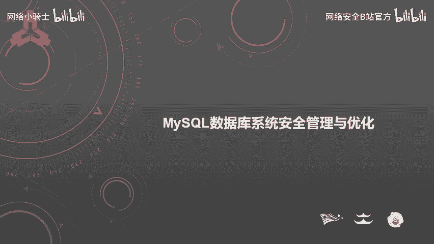
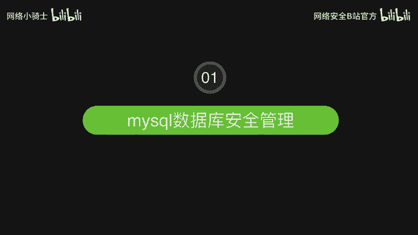
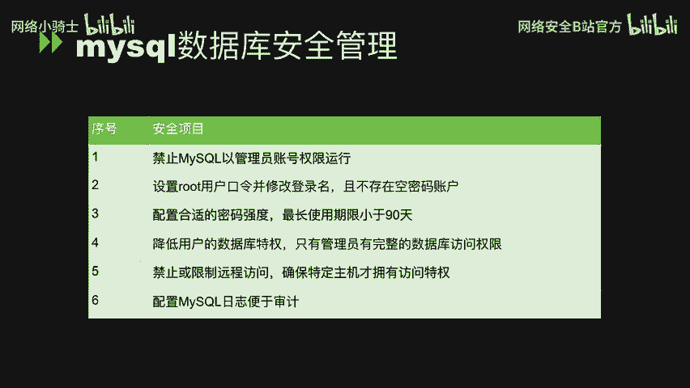
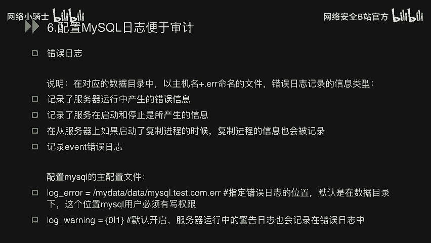
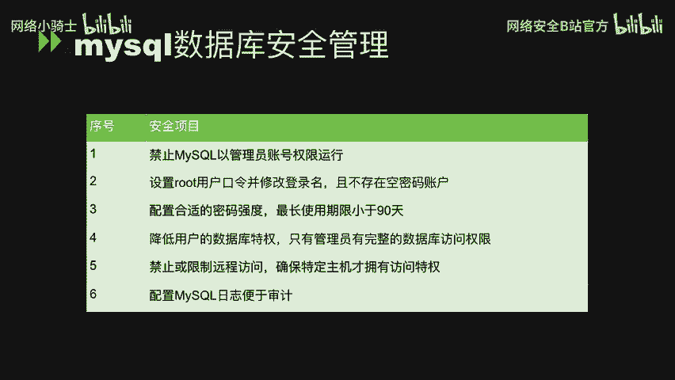
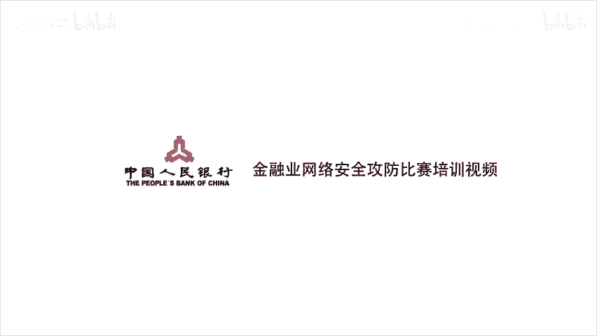

# CTF最强战队蓝莲花内部培训教程：P35：MySQL数据库系统安全管理与优化 🔒



在本节课中，我们将要学习MySQL数据库安全管理的核心知识。课程内容主要分为三个部分：MySQL安全配置规范、常用基本命令操作，以及SQL查询与手工注入执行的原理分析。通过学习，你将掌握如何加固数据库、执行基本操作并理解SQL注入的底层逻辑。



---



## 第一部分：MySQL数据库安全管理 🛡️

上一节我们介绍了课程的整体结构，本节中我们来看看数据库安全管理的具体规范。这一部分共包含6个安全基线配置要点，我们将对每一点进行详细讲解。

### 1. 禁止MySQL以管理员账号权限运行

**说明**：MySQL数据库应使用非管理员账号运行，以普通账户权限启动服务。
**原因**：当数据库出现安全漏洞时，可以将影响范围控制在MySQL用户内，避免危及整个操作系统。
**加固方法**：在MySQL配置文件 `my.cnf` 中添加以下配置，然后重启数据库服务。
```ini
user = mysql
```

### 2. 设置root用户口令，修改登录名，且不存在空密码账户

**说明**：必须为root用户设置强密码，并可考虑修改其用户名，同时确保所有数据库账户均无空密码。
**加固方法**：
*   **修改root密码**：登录数据库后执行。
    ```sql
    SET PASSWORD FOR 'root'@'localhost' = PASSWORD('new_password');
    ```
*   **修改root用户名**（可选）：
    ```sql
    USE mysql;
    UPDATE user SET user='new_username' WHERE user='root';
    FLUSH PRIVILEGES;
    ```
*   **检查空密码账户**：
    ```sql
    SELECT * FROM mysql.user WHERE password='';
    ```
    安全系统中此查询应无返回结果。如有，需立即为相应用户设置密码。

### 3. 配置合理的密码强度与最长使用期限（小于90天）

**说明**：数据库用户密码需具备复杂性（如长度、大小写、特殊字符），且最长使用期限不应超过90天。
**加固方法**：
*   **启用密码复杂度插件并设置策略**（示例）：
    ```sql
    INSTALL PLUGIN validate_password SONAME 'validate_password.so';
    SET GLOBAL validate_password_length = 14;
    SET GLOBAL validate_password_mixed_case_count = 1;
    SET GLOBAL validate_password_number_count = 1;
    SET GLOBAL validate_password_special_char_count = 1;
    ```
*   **设置密码最长使用期限**：
    ```sql
    SET GLOBAL default_password_lifetime = 90;
    ```

### 4. 降低用户的数据库特权，仅管理员拥有完整访问权限

**说明**：`mysql.user` 和 `mysql.db` 表中的高级权限（如下所列）通常只应授予管理员用户。
**关键权限说明**：
*   `FILE_PRIV`：允许读取服务器主机上的本地文件。
*   `PROCESS_PRIV`：允许查看所有用户的进程信息。
*   `SUPER_PRIV`：允许执行设置全局变量、管理员调试等操作。
*   `SHUTDOWN_PRIV`：允许关闭数据库服务器。
*   `CREATE_USER_PRIV`：允许创建或删除其他用户。
*   `GRANT_PRIV`：允许修改其他用户的权限。

以下是检查与回收权限的方法：
*   **检查拥有特定权限的用户**（以`FILE_PRIV`为例）：
    ```sql
    SELECT user, host FROM mysql.user WHERE file_priv = 'Y';
    ```
*   **回收非管理员用户的不必要权限**（示例）：
    ```sql
    REVOKE SHUTDOWN ON *.* FROM 'user'@'host';
    REVOKE CREATE USER ON *.* FROM 'user'@'host';
    REVOKE GRANT OPTION ON *.* FROM 'user'@'host';
    ```
    其中 `'user'@'host'` 需替换为查询到的具体非管理员用户。

### 5. 禁止或限制远程访问，确保特定主机才拥有访问权限

**说明**：从外部网络直接访问生产数据库是危险的。应严格限制访问来源IP。
**加固方法**：
*   **错误示例（完全开放root远程访问，极其危险）**：
    ```sql
    GRANT ALL ON *.* TO 'root'@'%';
    ```
*   **正确示例1（仅允许本地访问）**：
    ```sql
    GRANT ALL ON *.* TO 'root'@'localhost';
    ```
*   **正确示例2（仅允许特定IP的特定用户拥有部分权限）**：
    ```sql
    GRANT SELECT, INSERT ON mydb.* TO 'some_user'@'192.168.1.100';
    ```

### 6. 配置MySQL日志便于审计

**说明**：MySQL应配置相关日志功能，包括错误日志、二进制日志、慢查询日志等，用于故障排查和安全审计。
**加固方法**：在主配置文件 `my.cnf` 中设置。
*   **配置错误日志**：
    ```ini
    log-error = /home/mysql/log/mysql-error.log
    ```
    **错误日志记录内容**：服务器运行错误、启动/停止信息、复制进程信息、事件错误信息。
*   **其他常用日志配置**（可选）：
    ```ini
    log-warnings = 1  # 记录警告信息
    slow-query-log = 1  # 开启慢查询日志
    general-log = 1  # 开启通用查询日志
    ```

---

## 总结 📝



本节课中我们一起学习了MySQL数据库安全管理的六个核心规范。我们从禁止使用管理员权限运行MySQL开始，逐步讲解了设置强密码与修改用户名、配置密码策略、最小化用户权限、限制远程访问以及启用审计日志等重要安全措施。掌握这些基线配置是构建安全数据库环境的第一步。





下一节，我们将进入第二部分，学习MySQL的常用基本命令，为后续理解SQL注入打下操作基础。