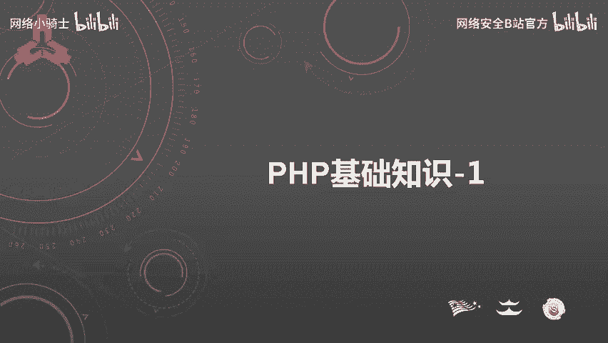
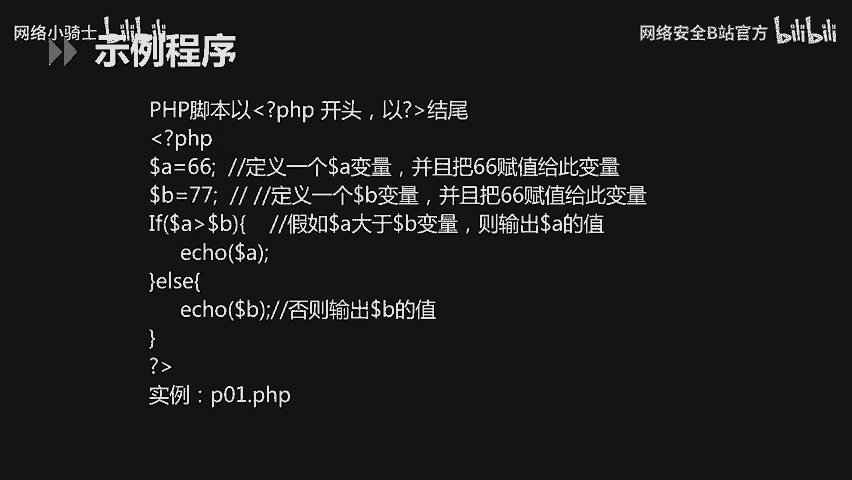
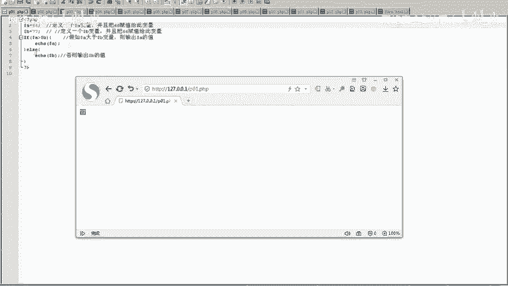
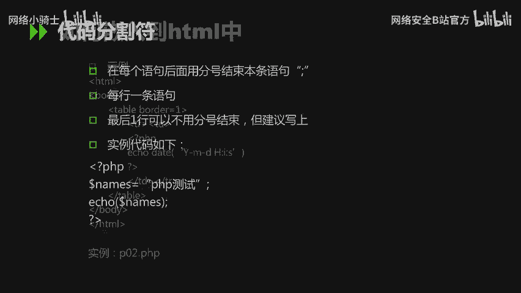
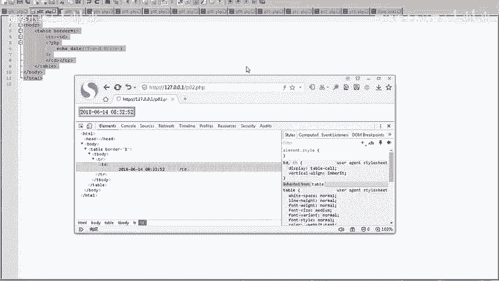
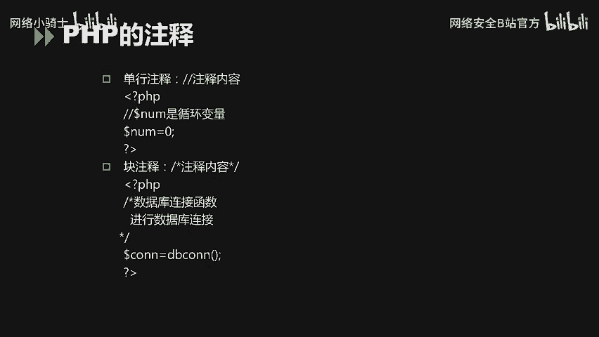
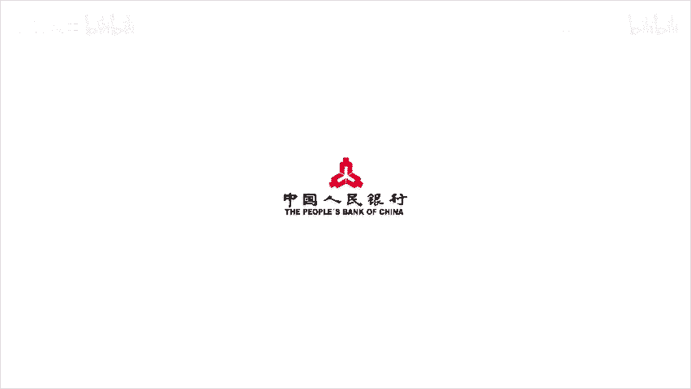

# CTF最强战队蓝莲花内部培训教程：P36：PHP基础知识



在本节课中，我们将要学习PHP的基础知识，包括PHP的基本常识和基本语法。课程内容旨在让初学者能够快速理解PHP的核心概念，为后续的Web安全学习打下基础。

## PHP基本常识

上一节我们介绍了课程的整体结构，本节中我们来看看PHP的基本常识，这部分内容我们只需要了解即可。

### PHP的定义与现状

PHP最初代表“Personal Home Page Tools”。目前，PHP被定义为“超文本预处理器”（Hypertext Preprocessor）的递归缩写。PHP本身是一种被广泛应用的开放源代码的多用途脚本语言。

在2017年12月的编程语言排名中，PHP处于第九位。与前两年相比，其排名有所下降。

### PHP的用途与竞争语言

PHP是服务端的脚本语言，它返回的是HTML代码。与PHP形成竞争关系的主要是三类语言：
*   微软的C#语言。
*   Oracle的Java语言。
*   谷歌的Python语言。

这三类语言与PHP都是当前软件开发领域很流行并被广泛使用的语言。

### PHP的主要应用领域

PHP的开发领域主要应用在服务端脚本，更多是应用于Web开发，特别是中小型网站的Web开发。其他两种应用场景如下：
*   命令行脚本：直接在命令行下执行PHP程序。
*   客户端GUI应用程序开发：但目前应用场景较少。



主流的应用仍然是服务端脚本开发和Web开发。

### PHP的运行环境与支持

在软件开发中，程序开发人员大部分使用Windows操作系统。因此，开发人员需要熟练掌握Windows下的PHP开发运行环境。PHP也可以在其它操作系统上进行开发，包括Linux、Unix和Mac操作系统。

支持PHP运行的服务器包括Apache和Nginx。PHP本身支持多种数据库，主流数据库包括MySQL、SQL Server和Oracle。



## PHP基本语法

了解了PHP的基本常识后，本节中我们将重点学习PHP的基本语法，这是今天需要掌握的核心内容。

### PHP示例程序



首先，我们通过一个简单的例子来认识PHP脚本。PHP脚本以 `<?php` 开头，以 `?>` 结尾。

以下是一个比较两个变量大小并输出较大值的示例代码：
```php
<?php
$a = 88;
$b = 77;
if ($a > $b) {
    echo $a;
} else {
    echo $b;
}
?>
```
我们将这段代码保存为 `p01.php` 文件并在Apache服务器中运行。访问该文件，页面会输出 `88`，因为变量 `$a` 的值大于 `$b`。如果将 `$a` 的值改为 `66`，再次运行，页面则会输出 `77`。



### PHP与HTML的融合

PHP代码可以嵌入到HTML页面中。以下示例展示了如何在HTML表格中插入PHP脚本来输出当前系统时间：
```html
<table>
    <tr>
        <td>当前时间是：</td>
        <td><?php echo date("Y-m-d H:i:s"); ?></td>
    </tr>
</table>
```
将上述代码保存为 `p02.php` 并运行，页面表格中会显示类似“2023-10-27 14:30:00”的当前时间。通过审查网页元素，可以看到PHP输出的日期被直接放在了HTML表格的单元格中。

### 语句分隔与注释

在PHP代码中，每条语句的结尾必须用分号 `;` 表示结束。最后一行代码的结束分号可以省略，但建议写上。

注释对代码编写和维护非常重要。PHP支持两种注释方式：
*   单行注释：使用双斜杠 `//`。
    ```php
    // 这是单行注释
    $name = “PHP测试”; // 为变量赋值
    ```
*   多行注释（块注释）：使用 `/*` 和 `*/` 包裹。
    ```php
    /*
    这是一个多行注释。
    可以跨越多行。
    */
    ```



---



本节课中我们一起学习了PHP的基础知识。我们首先了解了PHP的定义、应用领域和运行环境等基本常识。然后，我们重点学习了PHP的基本语法，包括如何编写简单的PHP程序、如何将PHP与HTML结合，以及语句分隔和注释的写法。这些是进一步学习PHP编程和Web安全知识的基石。