# PHP基础知识：P37：PHP数据类型与变量详解 📚


在本节课中，我们将要学习PHP编程语言的基础知识，核心内容包括PHP支持的八种原始数据类型、变量的定义与使用、常量的概念以及一些常用函数。掌握这些基础知识是进行PHP开发和网络安全学习的重要前提。

上一节我们介绍了课程的整体框架，本节中我们来看看PHP的具体数据类型。

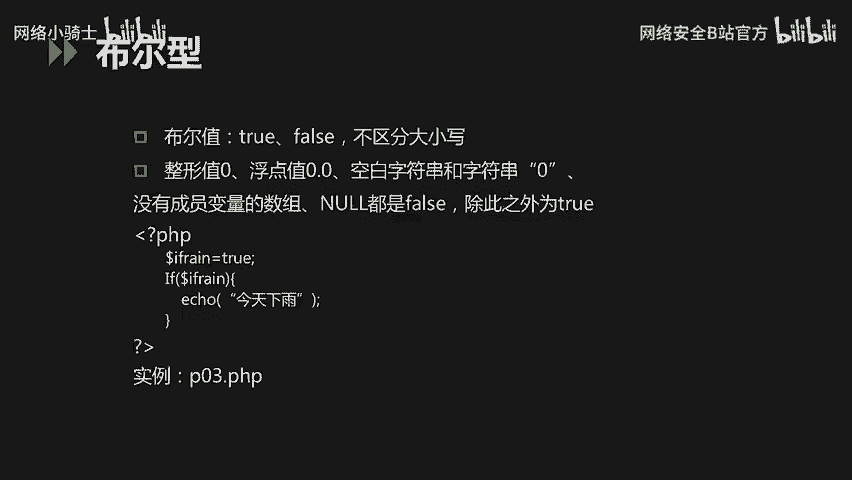

## 🧱 PHP的八种原始数据类型

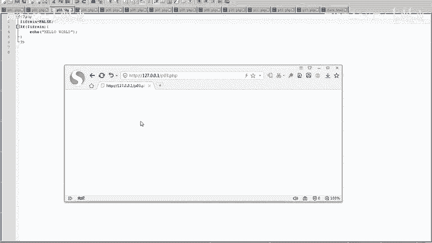

PHP支持八种原始数据类型，它们可以分为三类：四种标量类型、两种复合类型和两种特殊类型。

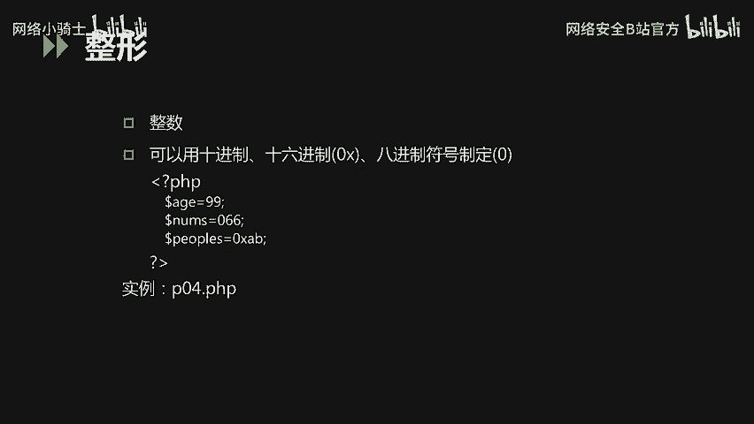

以下是数据类型的分类列表：
*   **标量类型**：布尔型（boolean）、整型（integer）、浮点型（float，也称 double）、字符串型（string）。
*   **复合类型**：数组（array）、对象（object）。
*   **特殊类型**：资源（resource）、空（NULL）。

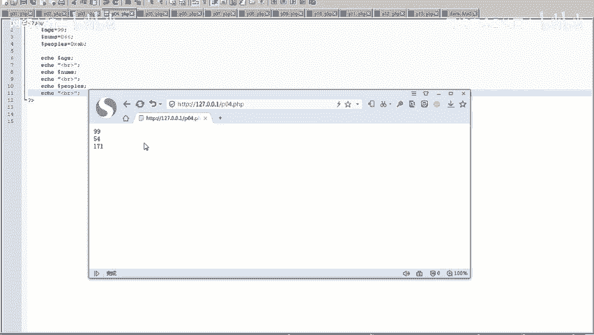

### 🔘 布尔型（Boolean）
布尔型只有两个值：`true`（真）和 `false`（假），不区分大小写。在PHP中，以下值在布尔上下文中被视为 `false`：
*   布尔值 `false` 本身
*   整型值 `0`
*   浮点型值 `0.0`
*   空字符串 `""` 和字符串 `"0"`
*   空数组 `array()`
*   特殊类型 `NULL`

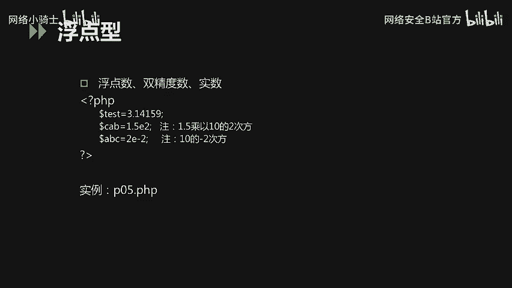

除此之外的所有其他值都被视为 `true`。

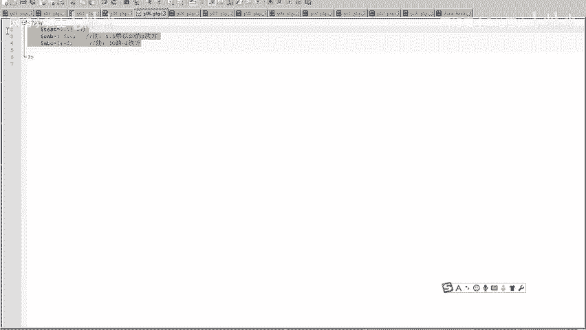

我们来看一个代码示例：
```php
<?php
$is_rain = true;
if ($is_rain) {
    echo "今天下雨";
}
?>
```
在这段代码中，变量 `$is_rain` 被赋值为 `true`，因此 `if` 语句条件成立，会输出“今天下雨”。如果将 `$is_rain` 的值改为 `false`，则不会输出。

### 🔢 整型（Integer）
整型数据可以是十进制、十六进制或八进制数。
*   十进制数：普通数字，如 `99`
*   十六进制数：以 `0x` 为前缀，如 `0xAB`
*   八进制数：以 `0` 为前缀，如 `066`

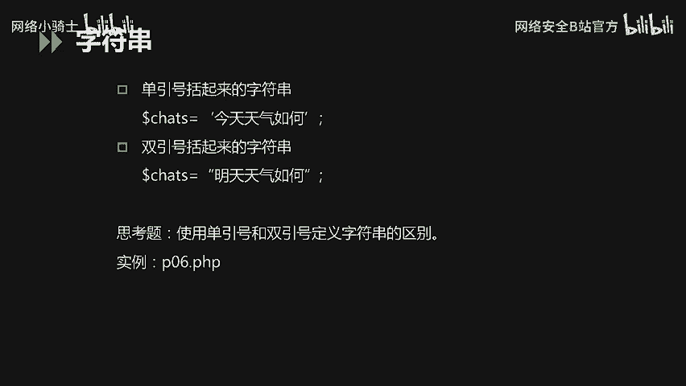

示例代码：
```php
<?php
$age = 99;        // 十进制
$number = 066;    // 八进制，等于十进制54
$peepos = 0xAB;   // 十六进制，等于十进制171
echo $age, $number, $peepos;
?>
```
运行上述代码，三个变量都会以十进制的形式输出。

### ⚖️ 浮点型（Float/Double）
浮点型用于表示小数或科学计数法表示的数字，包括单精度和双精度浮点数。
示例代码：
```php
<?php
$test_float = 3.1415926; // 浮点数
$test_double = 2.5e3;    // 双精度数，等于2500
$test_real = 8E-5;       // 实数，等于0.00008
?>
```

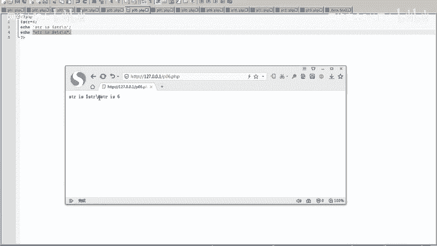

### 📝 字符串型（String）
字符串可以用单引号 `‘ ’` 或双引号 `“ ”` 定义，两者有重要区别：
*   **单引号字符串**：内部的所有内容（包括变量和大多数转义字符）都会作为普通文本直接输出。
*   **双引号字符串**：会解析其中的变量值，并识别转义字符（如 `\n` 换行）。

示例代码：
```php
<?php
$str = 6;
echo ‘$str\n‘; // 输出：$str\n
echo “$str\n“; // 输出：6 （并换行）
?>
```

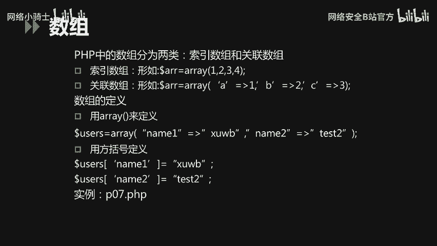

### 🗂️ 数组（Array）
数组是一种复合数据类型，用于存储多个值。PHP中有两种主要的数组：
1.  **索引数组**：下标是数字索引，默认从0开始。
    ```php
    $names = array(“Peter“, “Joy“, “Lily“); // 使用array()函数定义
    // 或
    $names = [“Peter“, “Joy“, “Lily“]; // 使用短数组语法定义
    echo $names[0]; // 输出：Peter
    ```
2.  **关联数组**：下标是自定义的键名（key），形成键值对（key-value）。
    ```php
    $person = array(“name“ => “XuWB“, “age“ => 25);
    // 或
    $person = [“name“ => “XuWB“, “age“ => 25];
    echo $person[“name“]; // 输出：XuWB
    ```

### ⚫ 空类型（NULL）
`NULL` 类型表示一个变量没有值。以下情况变量被认为是 `NULL`：
*   变量被显式赋值为 `NULL`。
*   变量尚未被赋值。
*   变量被 `unset()` 函数销毁。

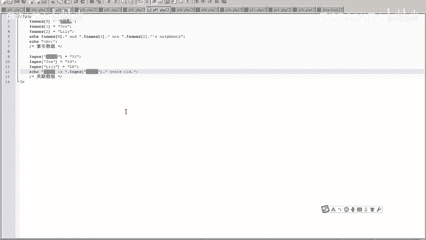

示例代码：
```php
<?php
$var1 = NULL; // 显式赋值为NULL
$var2;        // 未赋值
$var3 = “test“;
unset($var3); // 销毁变量
// 使用 var_dump() 检查，以上三个变量输出均为 NULL
?>
```

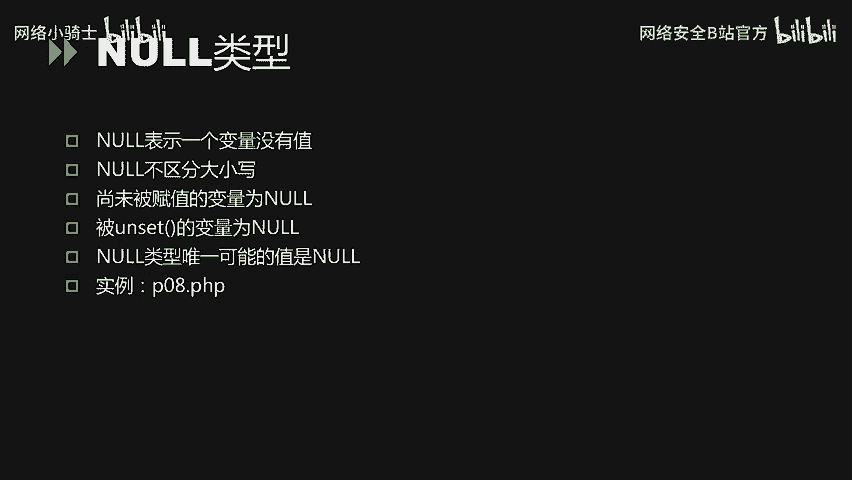

了解了数据类型后，我们来看看如何在PHP中使用它们，这就涉及到变量。

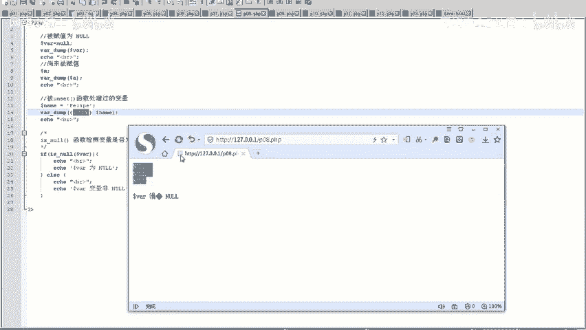

## 🏷️ PHP变量详解

### 变量的命名与定义
PHP变量以美元符号 `$` 开头，后面跟着变量名。
*   变量名是大小写敏感的（例如 `$Num` 和 `$num` 是两个不同的变量）。
*   变量名必须以字母或下划线 `_` 开头，后面可以跟字母、数字或下划线。
*   虽然允许使用中文变量名，但不建议。

### 变量的作用域
变量的作用域指的是变量在代码中可被访问的范围。
*   **全局变量**：在函数外部定义的变量，拥有全局作用域，通常在同一个PHP文件内有效。
*   **局部变量**：在函数内部定义的变量，拥有局部作用域，仅在该函数内部有效。
*   要在函数内部访问全局变量，需要使用 `global` 关键字。
    ```php
    <?php
    $d = 2; // 全局变量
    function myTest() {
        global $d; // 使用 global 关键字引用全局变量 $d
        echo $d; // 现在可以输出 2
    }
    myTest();
    ?>
    ```
*   **静态变量**：在函数内部使用 `static` 关键字声明的变量。当函数执行完毕后，该变量不会丢失其值，下次调用函数时仍能保留。
    ```php
    <?php
    function myTest() {
        static $x = 0;
        echo $x;
        $x++;
    }
    myTest(); // 输出 0
    myTest(); // 输出 1
    myTest(); // 输出 2
    ?>
    ```

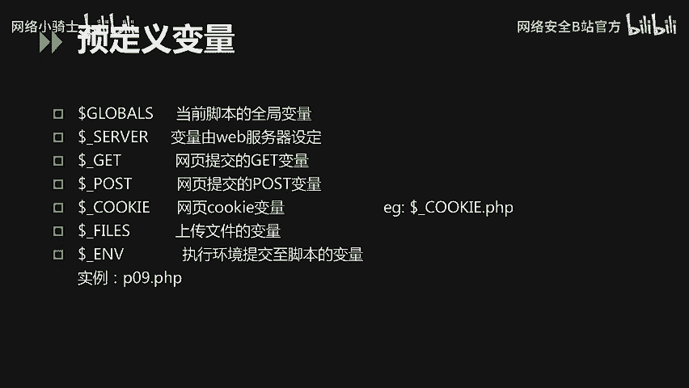

### 预定义变量与外部变量
PHP提供了许多预定义变量，用于获取服务器环境、请求参数等信息，例如 `$_SERVER`、`$_GET`、`$_POST`、`$_COOKIE` 等。这些在Web开发中至关重要。

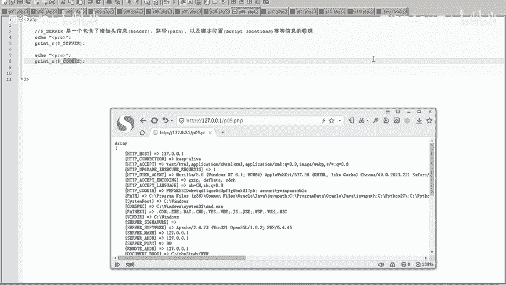

**外部变量**通常指通过HTTP请求（如表单提交）传递到PHP脚本的数据。
*   **`$_GET`**：用于收集来自 `method=“get“` 的表单数据，或URL中的查询字符串参数。
*   **`$_POST`**：用于收集来自 `method=“post“` 的表单数据。

示例：一个简单的表单提交与数据获取。
1.  HTML表单 (`form.html`)：
    ```html
    <form action=“p11.php“ method=“get“>
        姓名：<input type=“text“ name=“fname“>
        年龄：<input type=“text“ name=“age“>
        <input type=“submit“>
    </form>
    ```
2.  PHP处理脚本 (`p11.php`)：
    ```php
    <?php
    echo “你的姓名是：“ . $_GET[‘fname‘];
    echo “你的年龄是：“ . $_GET[‘age‘];
    ?>
    ```

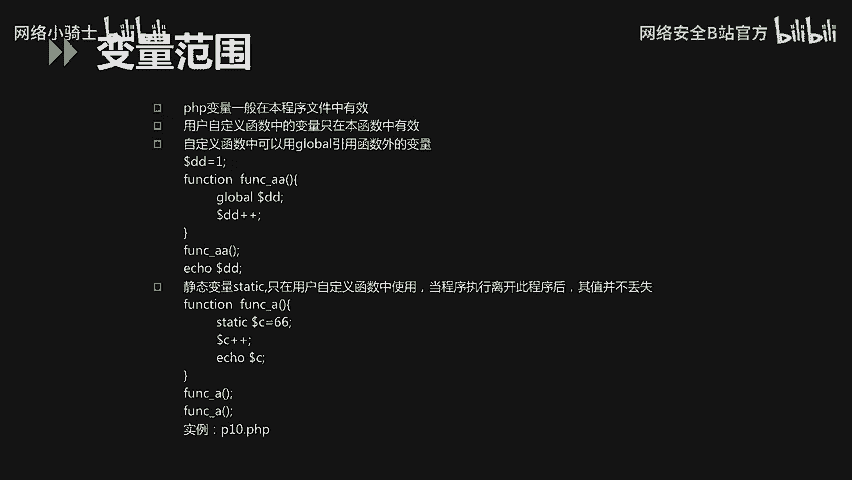

## ⚓ PHP常量

常量是一个简单值的标识符，在脚本执行期间其值不能改变。
*   常量使用 `define()` 函数定义：`define(“CONST_NAME“, “value“);`
*   常量名通常大写，且前面没有 `$` 符号。
*   常量的值只能是标量（布尔、整型、浮点、字符串）。
*   常量一旦定义就不能被重新定义或取消定义。
*   常量在整个脚本中自动全局有效。

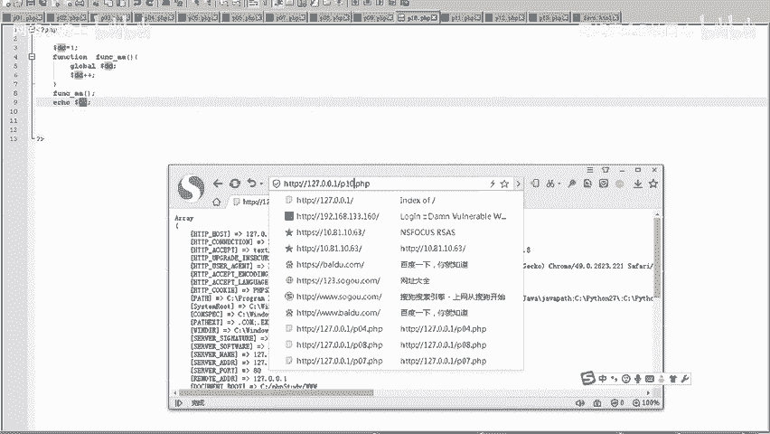

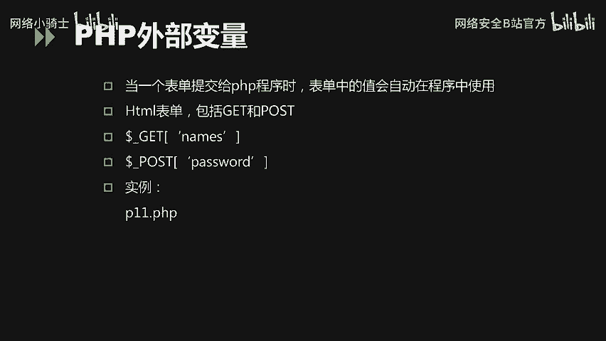

PHP也包含许多预定义常量，如 `PHP_VERSION`（PHP版本）、`__FILE__`（当前文件路径）等。

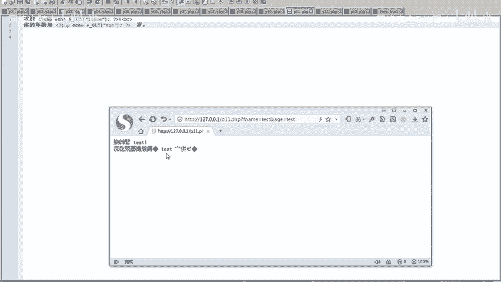

## 🛠️ 常用函数简介

PHP内置了大量函数，这里简要介绍两类：
*   **字符串函数**：用于操作和检查字符串。
    *   `strlen($str)`：返回字符串长度。
    *   `strpos($haystack, $needle)`：在字符串中查找子串首次出现的位置。
*   **输出函数**：用于向浏览器输出内容。
    *   `echo`：可输出一个或多个字符串。
    *   `print`：功能类似 `echo`，但只能输出一个字符串，且返回值为1。
    *   `print_r()` 或 `var_dump()`：用于打印变量的详细信息，常用于调试。

---

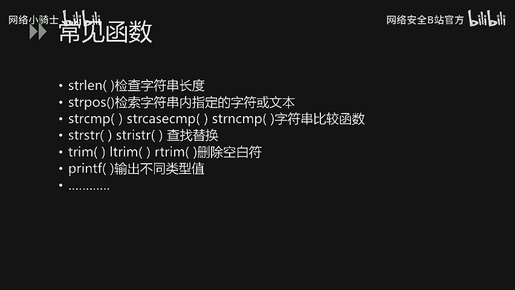


本节课中我们一起学习了PHP的基础知识。我们详细探讨了PHP的八种原始数据类型，包括布尔型、整型、浮点型、字符串、数组和空类型。接着，我们深入了解了变量的定义、命名规则、作用域管理以及如何通过 `$_GET` 和 `$_POST` 获取外部数据。最后，我们介绍了常量的定义和几个常用的内置函数。这些概念是编写任何PHP程序的基石，务必熟练掌握。