# Windows系统安全：P39：Windows系统安全基础

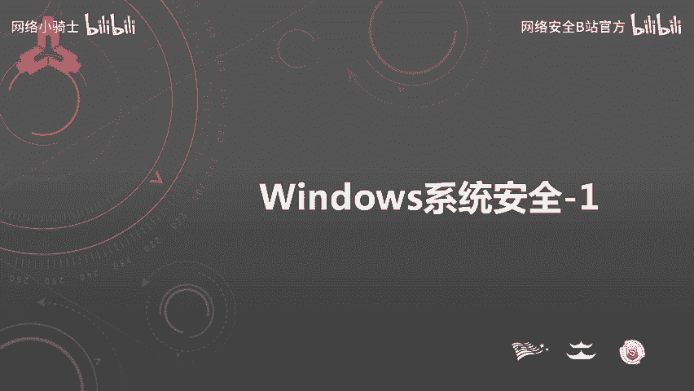

在本节课中，我们将学习Windows系统安全的基础知识。作为最常用的操作系统，了解其安全配置对于安全工作者至关重要。本节内容将分为四个小节：常用命令、账户安全、本地安全策略和口令安全。

## 常用命令 🛠️

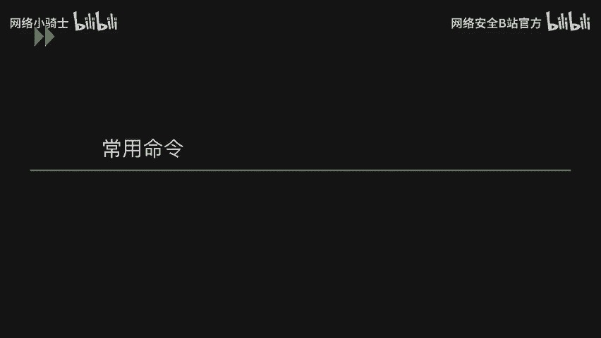

上一节我们介绍了课程概述，本节中我们来看看Windows系统安全的基础操作。掌握常用命令是进行高效系统管理和安全分析的第一步。使用命令可以避免因Windows版本不同导致的界面差异，快速定位到具体配置。

以下是常用Windows命令列表：

*   **查看系统版本**：`ver`
*   **查看主机名**：`hostname`
*   **查看网络配置**：`ipconfig /all`
*   **查看用户**：`net user`
*   **查看开放端口**：`netstat -ano`
*   **打开注册表**：`regedit`
*   **打开事件查看器**：`eventvwr.msc`
*   **打开系统服务**：`services.msc`
*   **打开组策略编辑器**：`gpedit.msc`
*   **打开本地安全策略**：`secpol.msc`
*   **打开本地用户和组**：`lusrmgr.msc`

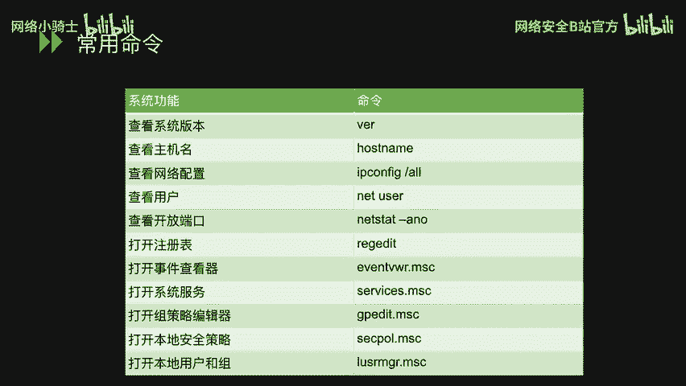

## 账户安全 👤

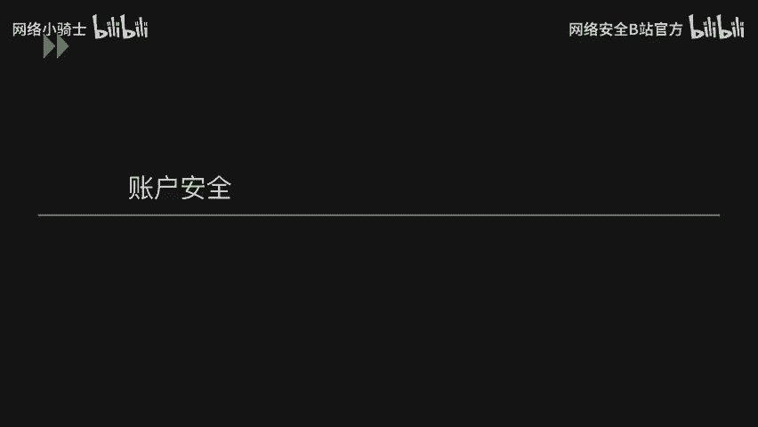

了解了基本命令后，我们来看账户安全。账户是系统访问控制的核心，管理好账户是防止未授权访问的关键。

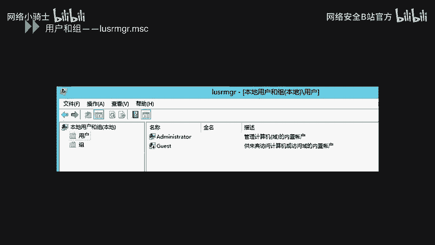

通过命令 `lusrmgr.msc` 可以打开本地用户和组管理器。在管理器中，可以查看、创建、禁用或删除用户账户。用户图标下的向下箭头表示该账户已被禁用。

建议为不同的应用程序或服务创建独立的低权限用户账户。这样，当某个应用出现漏洞时，可以限制其对整个系统的影响。

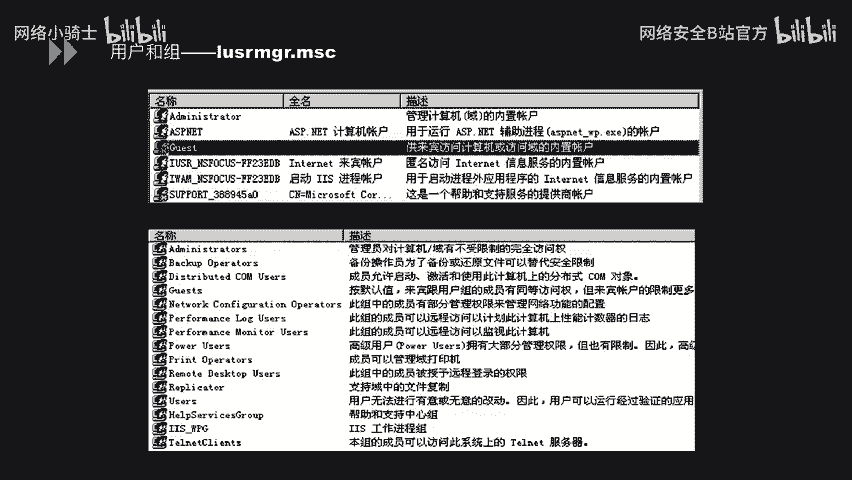

用户可以被添加到不同的组中，通过对组分配权限来批量管理用户权限。

以下是两个与账户相关的常用命令：

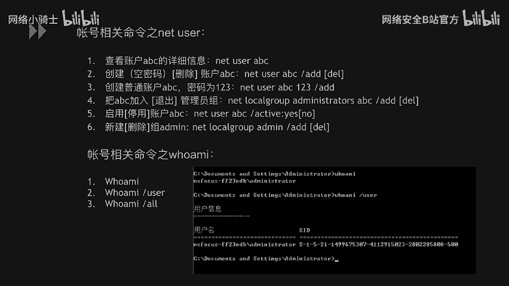

*   **`net user`**：用于查看用户信息、创建用户、设置密码、将用户添加到组、启用/禁用用户以及删除用户。
*   **`whoami`**：查看当前登录用户。
    *   `whoami /user`：查看当前用户的SID（安全标识符）。
    *   `whoami /all`：查看当前用户的所有信息，包括所属的组。

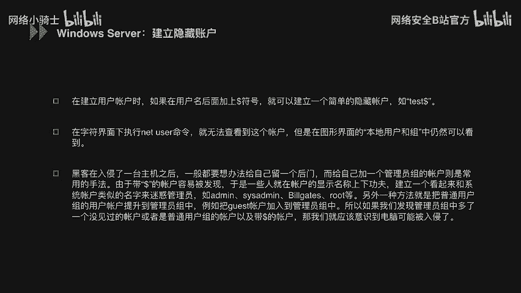

攻击者在获取系统权限后，为了维持长期访问，常会创建隐藏账户。以下是一个创建完全隐藏账户的示例步骤：

1.  **创建隐藏账户并提权**：
    ```cmd
    net user test$ Password123 /add
    net localgroup administrators test$ /add
    ```
    账户名后的 `$` 符号使其在命令行 `net user` 中不可见。

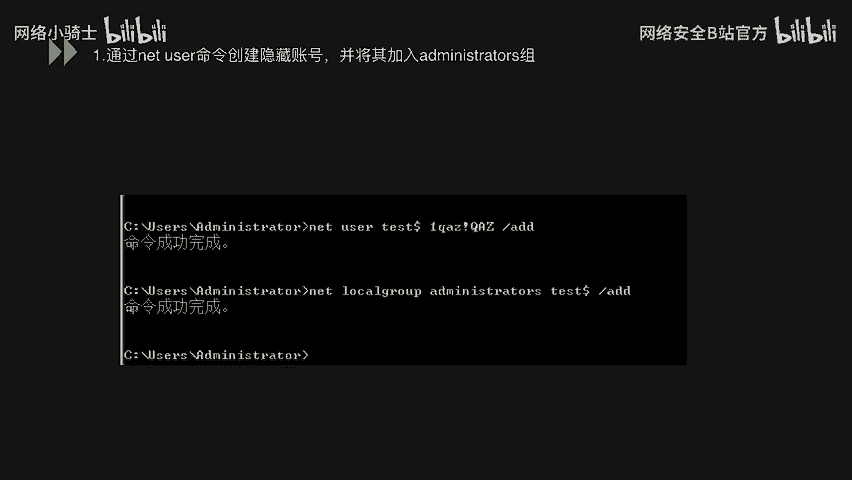

2.  **导出账户注册表信息**：
    *   运行 `regedit` 打开注册表。
    *   定位到 `HKEY_LOCAL_MACHINE\SAM\SAM`，默认无权限查看。
    *   右键 `SAM` 文件夹，赋予 `Administrators` 组“完全控制”权限。
    *   刷新后，在 `SAM\Domains\Account\Users\Names` 下找到 `test$` 项，记下其对应的键值（如 `000003E9`）。
    *   分别导出 `Names\test$` 和 `Users\000003E9` 这两个注册表项。

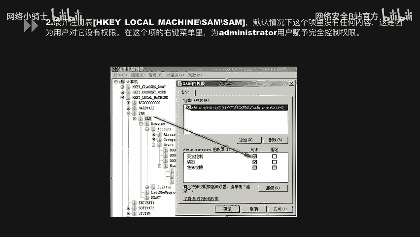

3.  **删除可见账户**：
    ```cmd
    net user test$ /del
    ```
    此时在命令行和用户管理界面中，`test$` 账户已消失。

4.  **导入注册表信息**：
    *   在注册表编辑器中，将步骤2导出的两个 `.reg` 文件重新导入。
    *   此时账户在注册表中恢复，但在常规界面中仍不可见，成为“影子账户”。

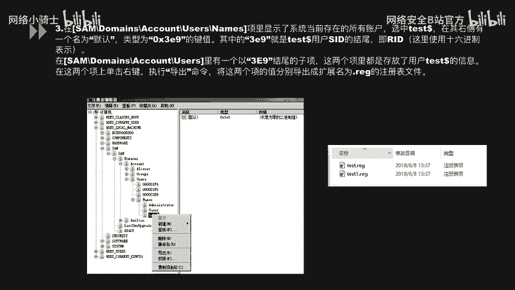

5.  **克隆管理员SID实现完全隐藏**：
    *   在注册表中找到管理员账户（如 `Administrator`）对应的SID键值（位于 `Users` 下，如 `000001F4` 中的 `F` 项）。
    *   将其数据复制，并粘贴到 `test$` 账户对应键（如 `000003E9` 中的 `F` 项）中。
    *   这使得系统将 `test$` 识别为 `Administrator`，共享同一用户配置文件，实现深度隐藏。

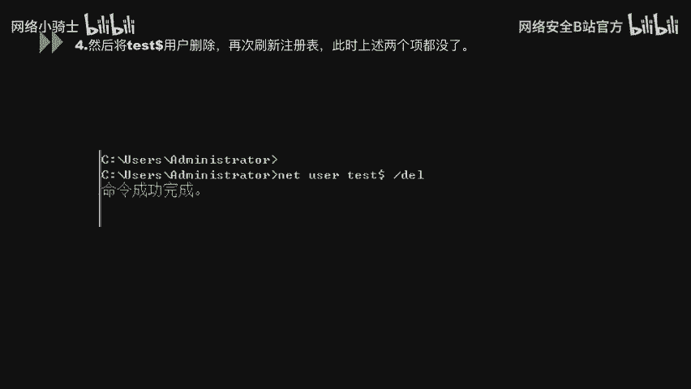

验证时，使用 `net user` 或图形界面均无法看到 `test$` 账户，但可以使用该账户登录系统。

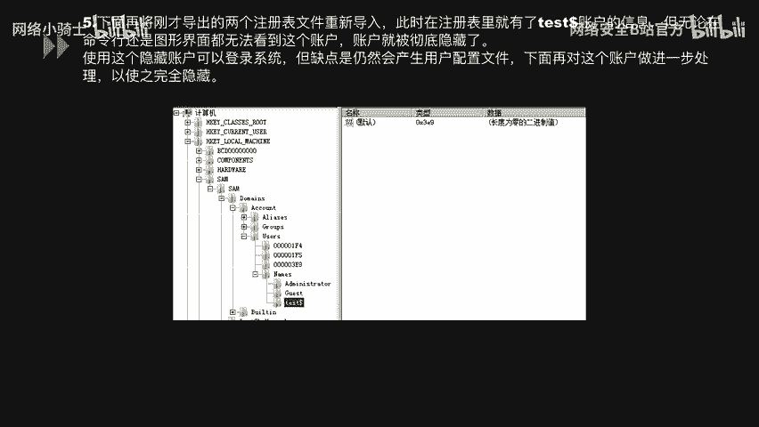

## 本地安全策略 ⚙️

账户管理是基础，而系统的安全策略则提供了更细粒度的控制。本节我们来看看本地安全策略。

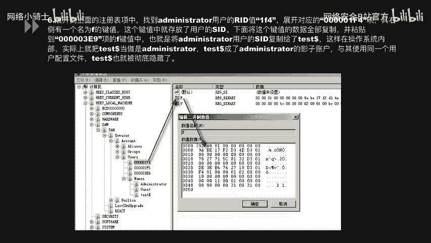

通过命令 `secpol.msc` 可以打开本地安全策略。其中包含账户策略、本地策略、高级安全Windows防火墙等设置。

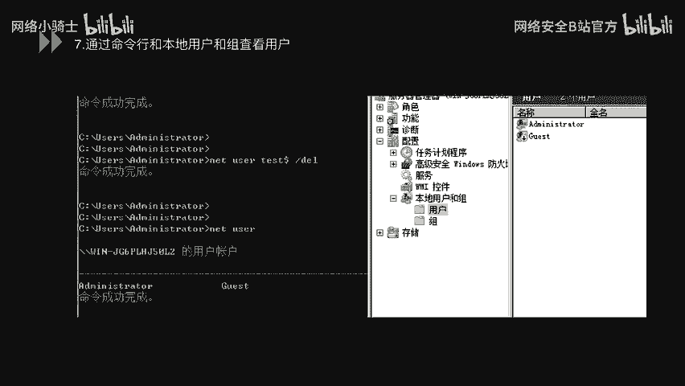

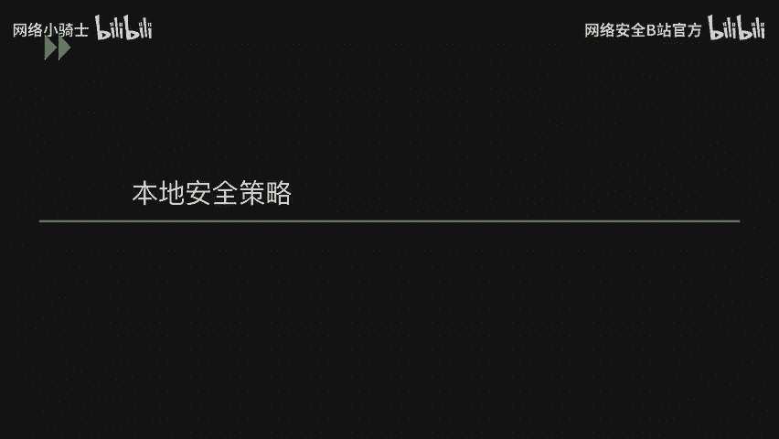

在**账户策略 -> 密码策略**中，可以配置以下核心规则：

*   **密码必须符合复杂性要求**：启用后，密码需包含大小写字母、数字和符号中的三种。
*   **密码长度最小值**：设置密码的最小字符数，例如 **8**。
*   **密码最短使用期限**：设置密码更改后必须使用的最短天数（如 **1** 天），防止频繁改密。
*   **密码最长使用期限**：设置密码的有效期（如 **90** 天），到期必须更改。
*   **强制密码历史**：系统记住的旧密码数量（如 **5** 个），新密码不能与历史密码相同。
*   **用可还原的加密来存储密码**：应**禁用**此策略，以使用更强的不可逆加密存储密码。

在**账户策略 -> 账户锁定策略**中，可以配置防御暴力破解的规则：

*   **账户锁定阈值**：设置允许的无效登录尝试次数（如 **5** 次）。
*   **账户锁定时间**：设置账户被锁定的时长（如 **30** 分钟）。
*   **重置账户锁定计数器**：设置在多少次失败登录尝试后重置计数器（应小于或等于锁定阈值）。

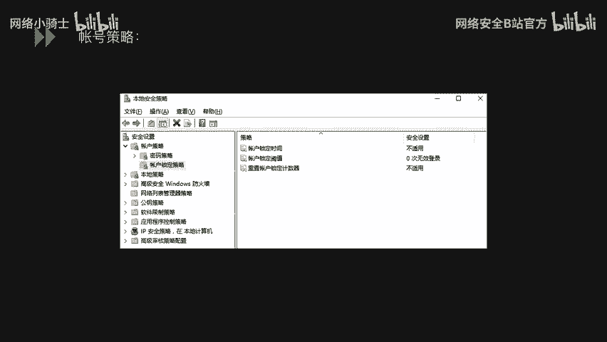

## 口令安全 🔐

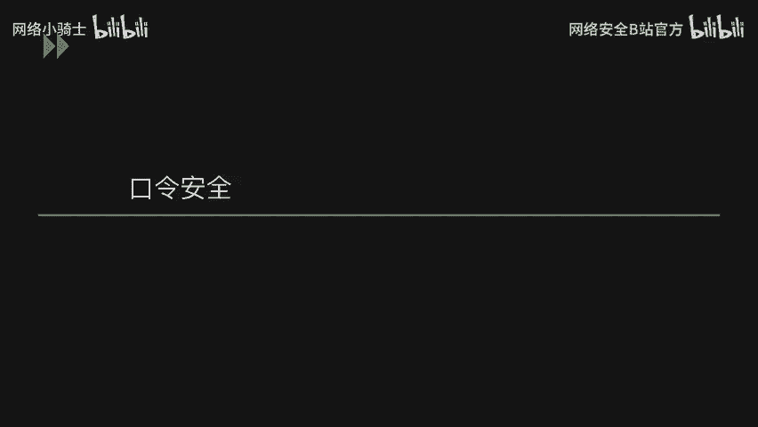

系统策略设定了规则，但弱口令（Weak Password）仍然是最大的安全风险之一。攻击者往往通过弱口令快速获得系统权限。

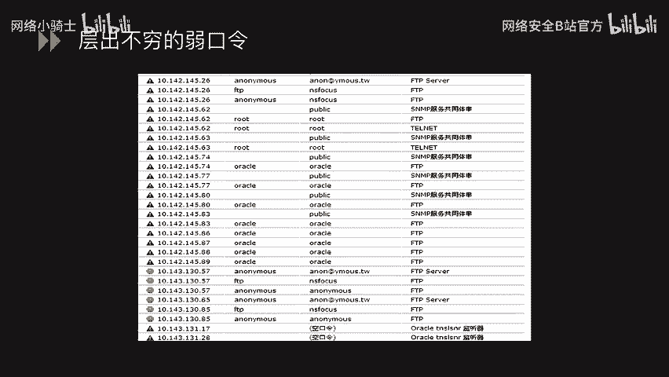

渗透测试中常使用扫描器发现网络中的弱口令，涉及FTP、数据库、SSH等多种服务。

检查系统是否存在弱口令主要有两种方式：

**1. 在线暴力破解**
使用工具如 **Hydra** 对目标服务进行在线密码猜测。例如，针对SMB服务的破解命令如下：
```bash
hydra -l admin -P passlist.txt smb://192.168.1.114
```
*   `-l admin`：指定用户名。
*   `-P passlist.txt`：指定密码字典文件。
*   `smb://192.168.1.114`：指定协议和目标主机。

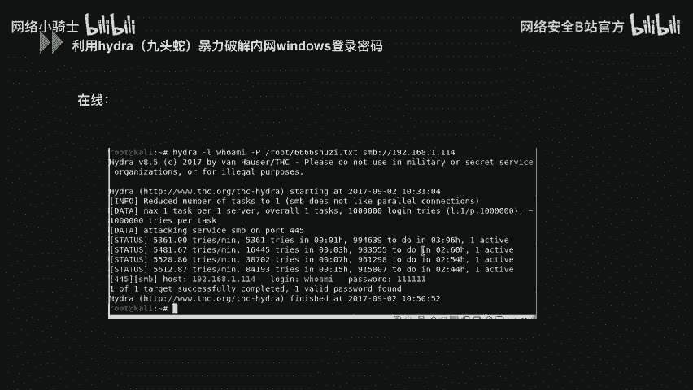

**注意**：在线破解可能触发账户锁定策略，对生产系统造成影响。

**2. 离线哈希破解**
更安全的方式是导出系统的密码哈希值进行离线破解。
*   使用工具如 **pwdump** 或 **mimikatz** 从内存或SAM文件中提取用户密码哈希。
    ```bash
    pwdump > hashes.txt
    ```
*   然后使用 **彩虹表（Rainbow Table）** 或 **Hashcat** 等工具对哈希进行破解。
    ```bash
    hashcat -m 1000 hashes.txt rockyou.txt
    ```
    这种方式不会触发登录失败警报，适合在内网安全检查中使用。

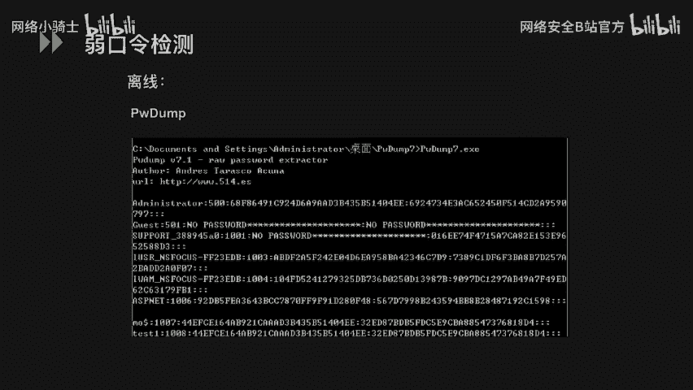

## 总结 📝

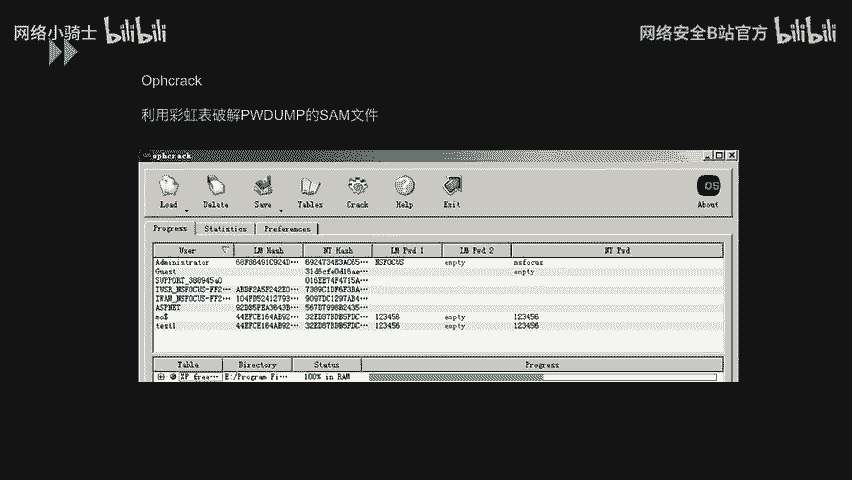

本节课中我们一起学习了Windows系统安全的基础部分。我们首先掌握了一系列常用的系统管理命令，这是安全操作的基石。接着，我们深入探讨了账户安全，包括常规管理和隐藏账户的创建与防范。然后，我们了解了如何通过本地安全策略来强化密码规则和账户锁定机制。最后，我们认识到弱口令的巨大风险，并学习了在线和离线两种检测弱口令的方法。这些知识是构建Windows系统安全防线的重要第一步。


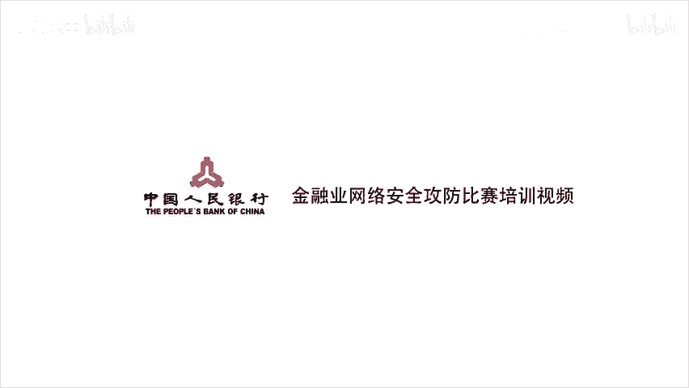

---
*教程内容整理自 CTF最强战队蓝莲花内部培训教程 P39：Windows系统安全*