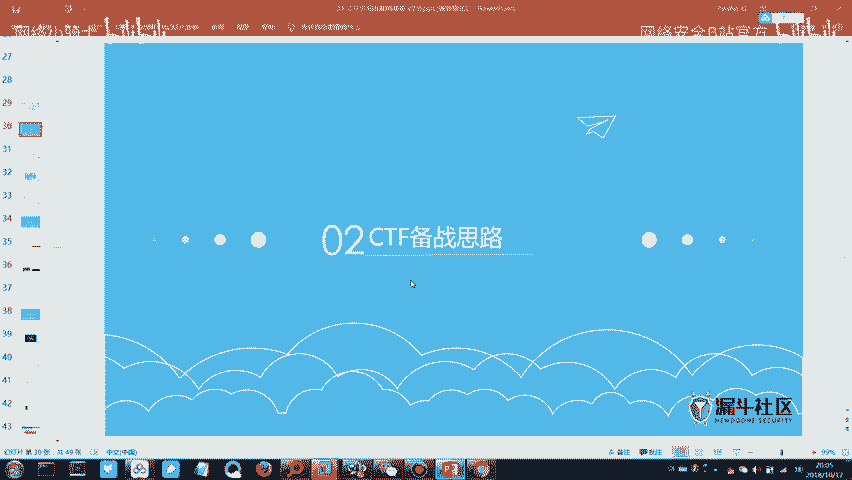
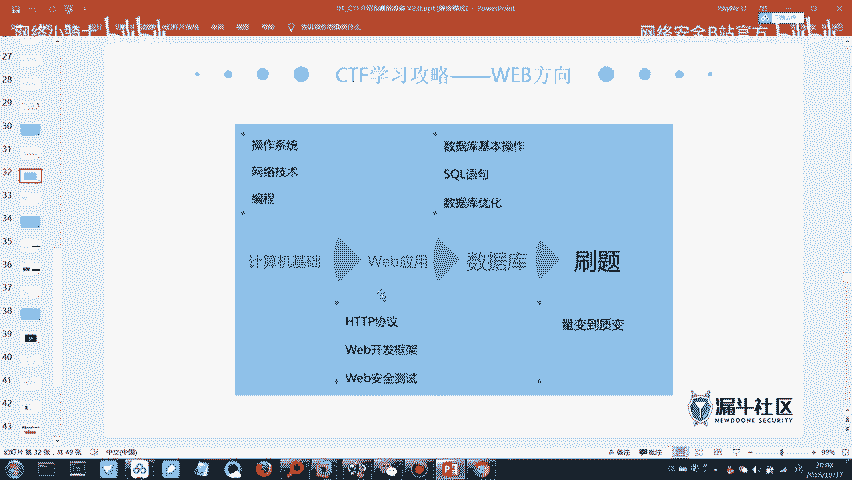
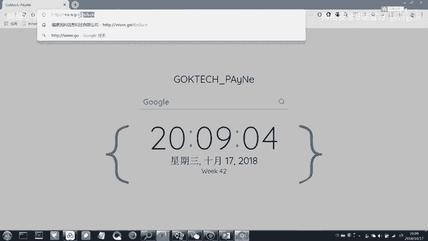
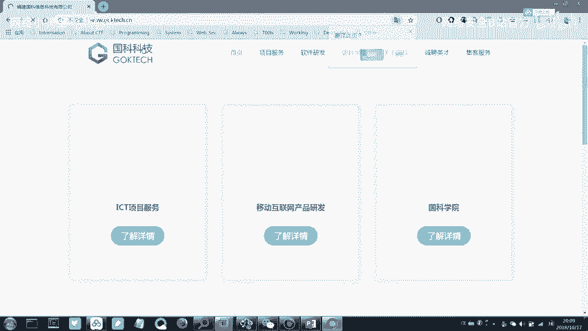
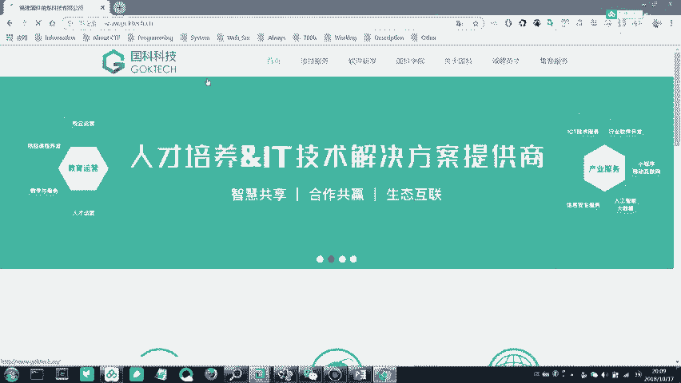
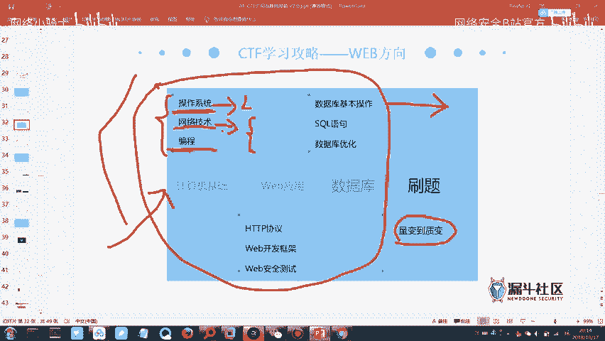
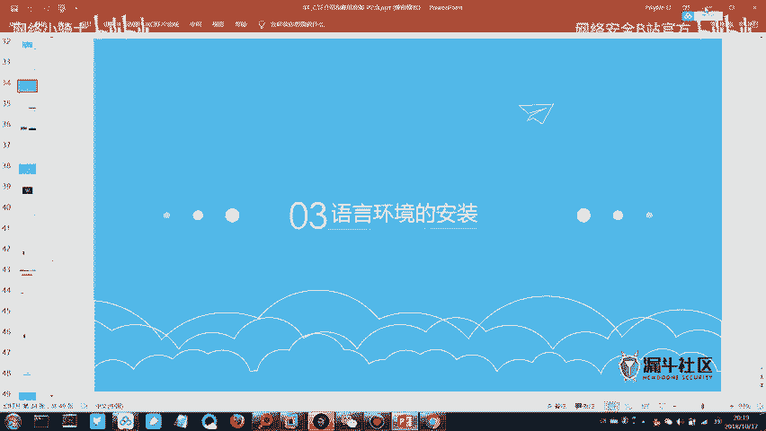
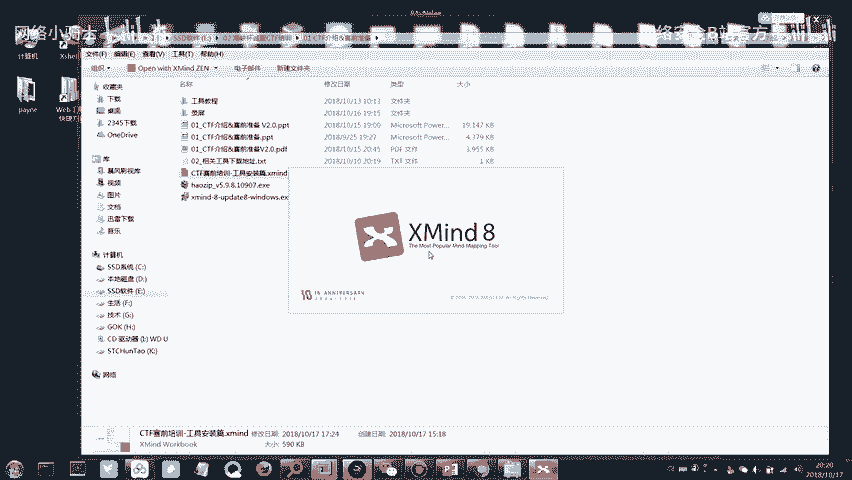
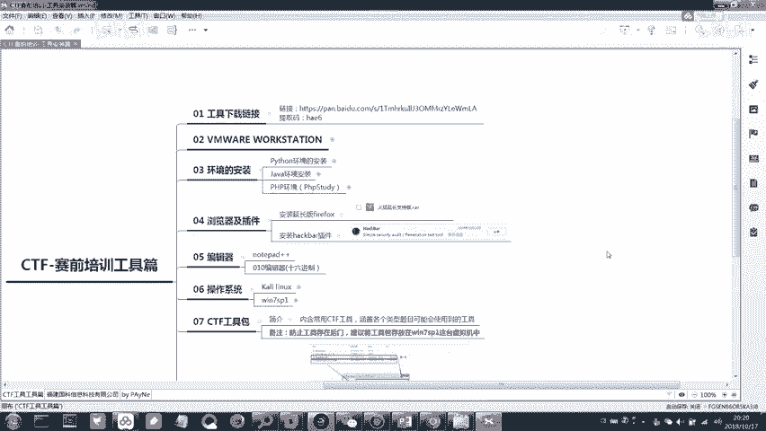

# CTF最强战队蓝莲花内部培训教程：P3：CTF赛制介绍与工具介绍 🛡️



在本节课中，我们将学习CTF比赛的备赛思路、所需掌握的知识体系，并介绍一些实用的练习平台和工具。

## 概述

上一节我们介绍了CTF的基本概念和模式。本节中，我们将梳理一套有效的CTF备赛思路，明确需要掌握的技术知识，并介绍用于练习的在线平台和必备工具。

## CTF备赛思路

想要梳理出适合自己的备赛思路，需要对CTF所需掌握的技术知识有一定理解。CTF比赛所需知识分为两个主要模块：**基础知识**和**专项知识**。

### 基础知识模块







以下是基础知识模块包含的内容：

1.  **Linux系统基本使用**：需要懂一些基本的Linux命令，例如进入目录、查看文件等。无需精通，但必须掌握基础操作。因为常用的安全工具（如Kali Linux）就是基于Linux的操作系统。
2.  **网络协议分析**：涉及网络流量数据包的分析。需要具备类似HCNA或CCNA水平的网络技术基础，理解IP通信等基本过程。
3.  **编程能力（可选但推荐）**：编程能力属于拔高项，并非必须。但如果具备，将更有优势。



### 专项知识模块

专项知识模块分为两个主要方向：

1.  **逆向工程与密码学方向**：这个方向难度相对较高。
2.  **Web安全与杂项方向**：这个方向涉及的技术点相对较少，更注重漏洞原理的利用和信息收集能力。

## 具体技能学习路线

以下是建议的技能学习路线，每个部分只需掌握基础即可。

*   **操作系统**：掌握Linux基本命令，例如 `cd`（进入目录）、`ls`（查看文件）等。
*   **网络技术**：理解TCP/IP等网络通信基础。
*   **Web应用**：**必须掌握HTTP协议**。理解客户端与服务器如何通过HTTP/HTTPS进行通信。例如，一个基本的HTTP请求结构如下：
    ```
    GET /index.html HTTP/1.1
    Host: www.example.com
    ```
    *   **HTTP与HTTPS区别**：HTTPS是在HTTP基础上增加了TLS/SSL加密层，使通信更安全，但需要CA证书（通常收费）。
*   **数据库**：掌握SQL数据库基本的**增删查改**操作。这是理解SQL注入漏洞的基础。一个简单的查询语句示例：
    ```sql
    SELECT * FROM users WHERE username = ‘admin’;
    ```

掌握上述基础知识后，便进入**量变到质变**的过程：**刷题**。通过大量练习积累思路，看到题目便能联想到考察的知识点。

**请注意**：CTF注重知识的**广度**而非单一领域的**深度**。初期每个部分只需入门，然后在刷题中遇到未知知识点时再针对性学习。如果在学习过程中对某个方向产生浓厚兴趣，可以将其作为深入发展的方向。

## 练习平台与资源

以下是推荐的CTF练习平台和资源。

*   **刷题平台**：
    *   **实验吧**：题目相对友好，适合初学者。
    *   **Bugku CTF**：难度适中，适合入门练习。
    *   **i春秋（CTF大本营）**：包含大量历年比赛真题，难度较高，适合进阶挑战。
*   **参考答案（WP）**：上述平台通常提供题目解析（Writeup）。遇到困难时，可以参考他人的解题思路。



**建议**：初期可以从**实验吧**和**Bugku CTF**开始练习，建立信心。后期可挑战**i春秋**上的真题。可以将这些平台网址加入浏览器书签，方便随时练习。

## 工具安装与实践

接下来是实践操作部分，涉及工具的安装与使用。

1.  **安装思维导图工具**：课程提供的思维导图文件需要使用特定软件（如XMind）打开。请在课程群中下载并安装该软件。
2.  **打开课程文件**：安装完成后，使用该软件打开群内分享的思维导图文件，以便跟随课程内容。

## 总结







本节课我们一起学习了CTF的备赛思路，明确了需要掌握的**基础知识**（Linux、网络、Web、数据库）和**专项知识**（逆向/密码学、Web/杂项）两大模块。我们强调了CTF学习**广度优先**的原则，并介绍了**实验吧**、**Bugku CTF**和**i春秋**等重要的练习平台。最后，我们开始了工具安装的实践步骤。下节课我们将利用这些工具和环境，进行更深入的实际操作学习。