# CTF最强战队蓝莲花内部培训教程：P40：Windows系统安全配置规范 🔧

在本节课中，我们将要学习Windows系统安全配置规范。这部分内容将帮助我们理解如何通过配置系统服务、管理进程、设置日志审核以及控制文件权限来增强Windows系统的安全性。我们将分为四个小节进行详细讲解。

## 系统服务 🛠️

上一节我们介绍了Windows系统安全的基础概念，本节中我们来看看如何配置系统服务。系统服务是Windows操作系统中在后台运行的程序，负责执行特定功能。正确管理这些服务对系统安全至关重要。

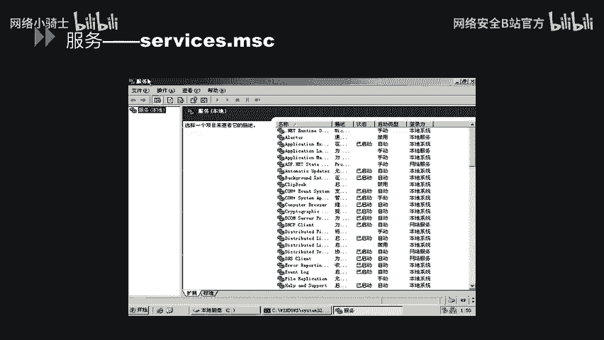

想查看系统中有哪些服务，可以使用`services.msc`命令。在CMD中直接输入此命令，即可打开服务管理界面。该界面会显示当前系统中存在的所有服务，包括其状态（如“已启动”或“已停止”）和启动类型（如“手动”、“禁用”、“自动”或“自动（延迟启动）”）。

接下来，我们以“Apache2.2”服务为例，查看其具体属性。点击该服务的“属性”，在“常规”选项卡中，可以看到服务名称、可执行文件路径以及启动类型。启动类型可以在此处设置为手动、自动或延迟启动。

“登录”选项卡用于设置运行此服务的账户身份。在“本地系统账户”下，可以选择允许哪类账户对此服务进行操作。

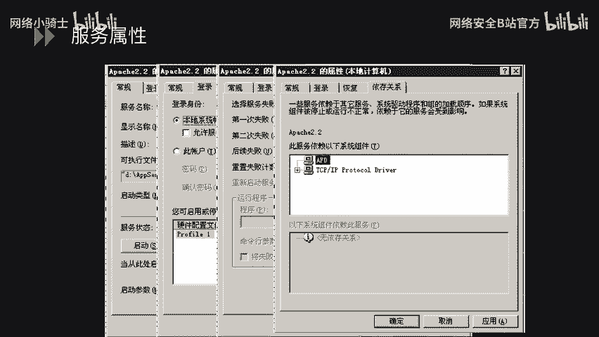

“恢复”选项卡用于配置当服务失败时计算机的响应，例如不执行任何操作、重新启动服务、运行一个程序或重新启动计算机。具体选择应根据业务需求决定。

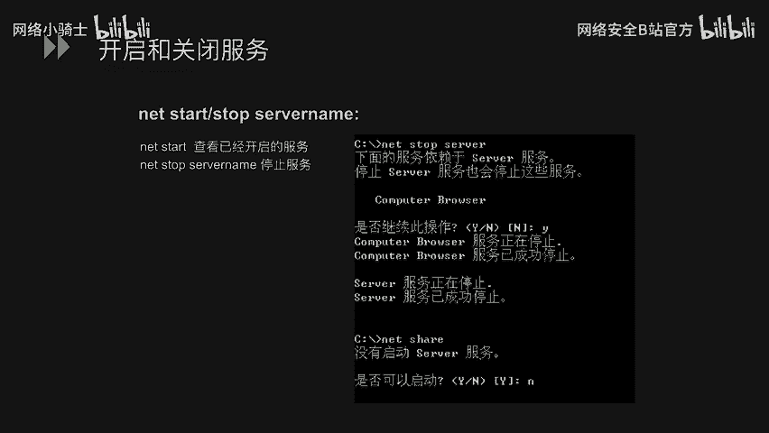

“依存关系”选项卡列出了此服务所依赖的其他服务或系统组件。如果某个被依赖的组件停止或运行不正常，依赖它的服务也会受到影响。

以下是使用系统命令开启和关闭服务的方法：
*   以“serv”服务为例，要停止该服务，在命令行中输入：`net stop serv`。由于该服务可能依赖其他服务，系统会提示确认是否一并停止相关服务。
*   要重新启动该服务，在命令行中输入：`net start serv`。

从安全角度考虑，某些不必要或存在已知漏洞的服务应被禁用。建议将以下服务的启动类型修改为“手动”或“禁用”：
*   **serv服务**：存在MS06-040和MS08-067等缓冲区溢出漏洞，可导致远程代码执行，使攻击者完全控制系统。
*   **Print Spooler服务**：存在MS10-061漏洞，即Windows打印机远程服务代码执行漏洞。

遵循最小化安装原则，停止非必需服务并调整其启动类型，可以有效减少攻击面。

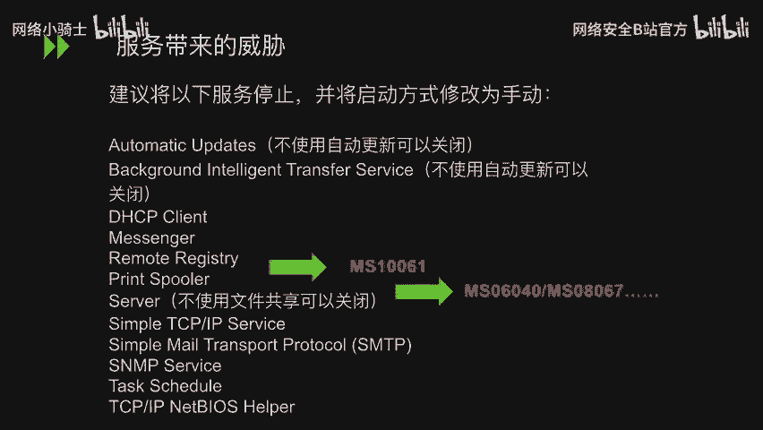

服务配置信息存储在注册表中。使用`regedit`命令可以打开注册表编辑器。服务的启动配置位于以下路径：
`HKEY_LOCAL_MACHINE\SYSTEM\CurrentControlSet\Services`
每个服务项下都有一个`Start`数值，它定义了服务的启动方式（如自动、手动、禁用）。其值对应的含义可通过公式表示：
*   `Start = 2`：自动启动
*   `Start = 3`：手动启动
*   `Start = 4`：禁用

## 服务于进程安全 🔍

上一节我们介绍了系统服务的配置，本节中我们来看看进程安全以及服务与进程的关联。进程是正在运行的程序的实例，了解系统正常进程对于识别恶意活动非常重要。

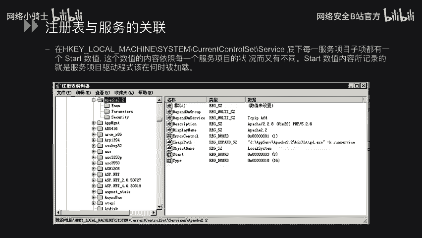

以下是一些Windows系统的基本进程：
*   `System Idle Process`：系统空闲进程
*   `System`：系统进程
*   `smss.exe`：会话管理器
*   `csrss.exe`：客户端/服务器运行时子系统
*   `winlogon.exe`：Windows登录管理器
*   `services.exe`：服务控制管理器
*   `lsass.exe`：本地安全认证子系统服务
*   `svchost.exe`：服务宿主进程（多个）
*   `explorer.exe`：Windows资源管理器
*   `taskmgr.exe`：任务管理器

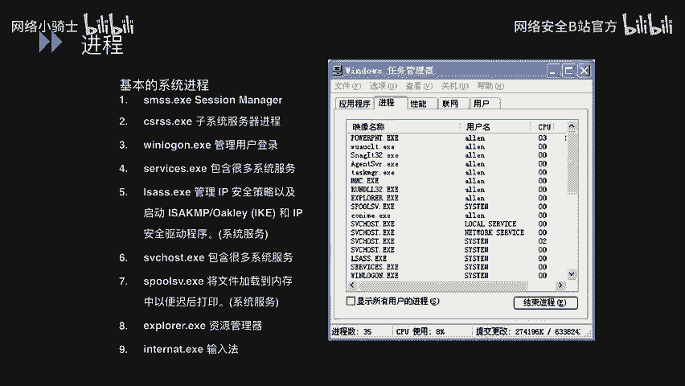

有时我们需要查看是哪个进程占用了特定端口。例如，发现某个端口被占用时，可以按以下步骤排查：
1.  使用命令 `netstat -ano` 查看当前网络连接和监听端口列表。
2.  找到目标端口（例如443端口）及其对应的进程ID（PID）。
3.  打开任务管理器，在“详细信息”或“进程”选项卡中，点击“PID”列进行排序。
4.  找到对应的PID，即可查看占用该端口的进程名称。

## 日志审核 📝

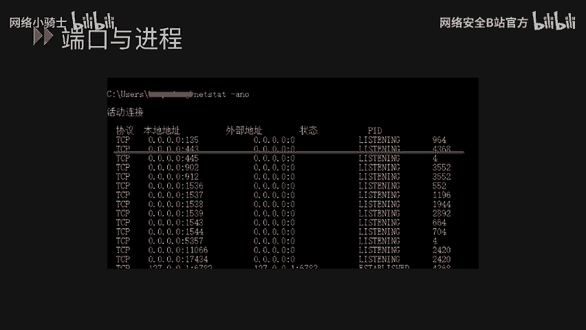

上一节我们探讨了进程管理，本节中我们来看看如何配置日志审核以监控系统活动。Windows日志是事后追溯和分析安全事件的重要依据。

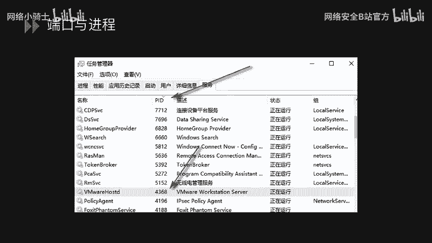

Windows日志主要存放在以下位置：
*   **默认日志**：位于 `%SystemRoot%\System32\Winevt\Logs\`，主要包括：
    *   应用程序日志
    *   安全日志
    *   系统日志
*   **IIS/FTP等日志**：通常位于 `%SystemDrive%\inetpub\logs\LogFiles\`。

可以通过运行 `eventvwr.msc` 命令打开“事件查看器”，在左侧窗格中即可查看上述三类主要日志。

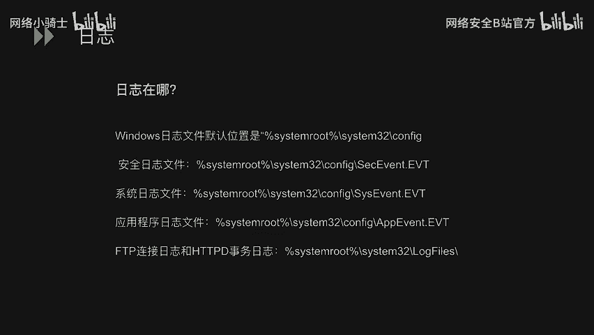

为了有效记录关键事件，需要配置审核策略。运行 `secpol.msc` 打开“本地安全策略”，导航至“本地策略” -> “审核策略”。这里列出了多项可审核的策略，例如：
*   审核账户登录事件
*   审核账户管理
*   审核目录服务访问
*   审核登录事件
*   审核对象访问
*   审核策略更改
*   审核特权使用
*   审核进程跟踪
*   审核系统事件

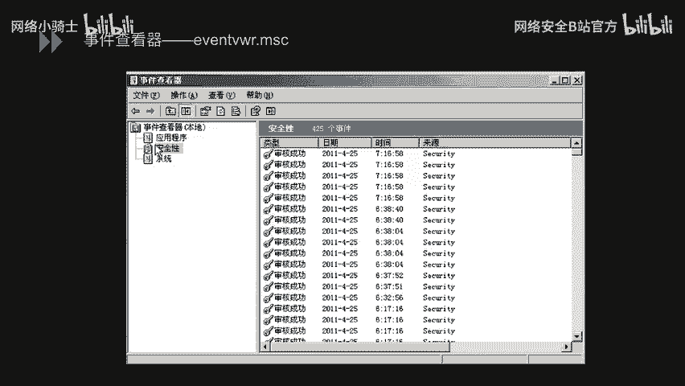

对于每项策略，可以设置为：
*   无审核
*   仅审核成功
*   仅审核失败
*   成功和失败都审核

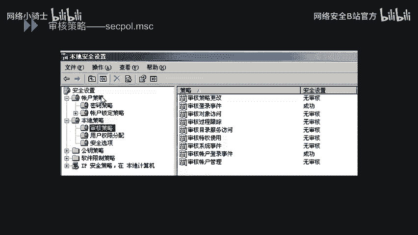

## 文件权限控制 🔐

上一节我们学习了日志审核的配置，本节中我们来看看如何通过文件权限控制来保护数据安全。以下讨论均基于NTFS文件系统。

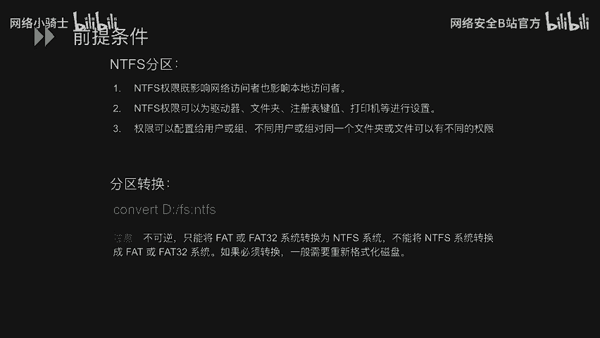

NTFS权限具有以下特点：
1.  影响网络访问者和本地访问者。
2.  可为驱动器、文件夹、文件、注册表键值、打印机等对象设置。
3.  权限可以分配给用户或组，不同用户或组对同一对象可以拥有不同权限。

如果需要将FAT/FAT32分区转换为NTFS分区（此过程不可逆），可以使用命令：
`convert X: /fs:ntfs`
（其中X代表驱动器盘符）

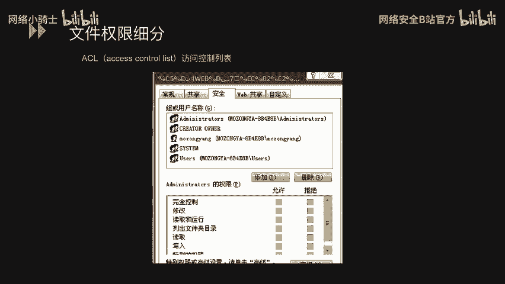

文件权限可以进行细粒度控制。右键点击文件或文件夹，选择“属性” -> “安全”选项卡。在此界面中：
*   “组或用户名”列表显示了对此对象拥有权限的用户和组。
*   选中某个用户或组后，下方的权限列表会显示其具体权限，如“完全控制”、“修改”、“读取和执行”、“列出文件夹内容”、“读取”、“写入”等。
*   每个权限都可以设置为“允许”或“拒绝”。

Windows文件权限遵循特定的优先顺序和继承规则：
*   **权限优先顺序**（从高到低）：
    1.  显式设置的“拒绝”
    2.  显式设置的“允许”
    3.  继承的“拒绝”
    4.  继承的“允许”
*   **移动和复制对权限的影响**：
    1.  在同一NTFS分区内移动：保留原权限。
    2.  在不同NTFS分区之间移动，或任何复制操作：继承目标位置的权限。
    3.  移动或复制到FAT/FAT32分区：所有NTFS权限丢失。

## 总结 📚

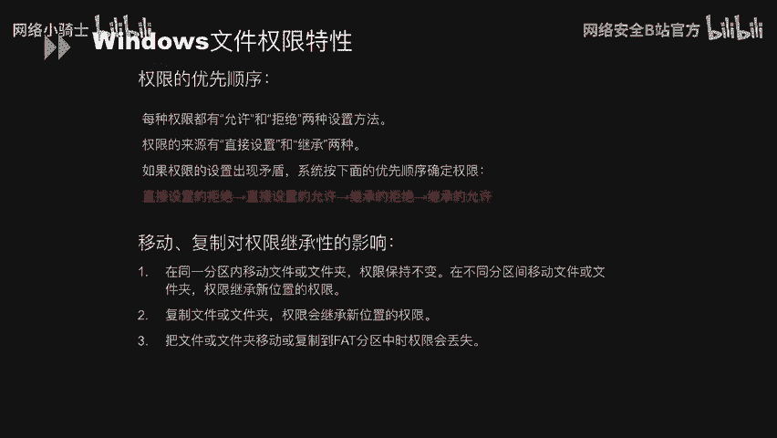

本节课中我们一起学习了Windows系统安全配置规范的四个核心部分：
1.  **系统服务**：学习了如何查看、管理服务，并理解禁用非必要服务以减少安全风险的重要性。
2.  **服务于进程安全**：认识了基本系统进程，并掌握了通过端口查找对应进程的方法。
3.  **日志审核**：了解了Windows日志的存放位置，并学会了如何配置审核策略以记录关键系统事件。
4.  **文件权限控制**：掌握了NTFS文件系统下的权限设置、继承规则以及优先顺序，以有效保护文件和文件夹。

通过合理配置以上方面，可以显著提升Windows操作系统的整体安全性。