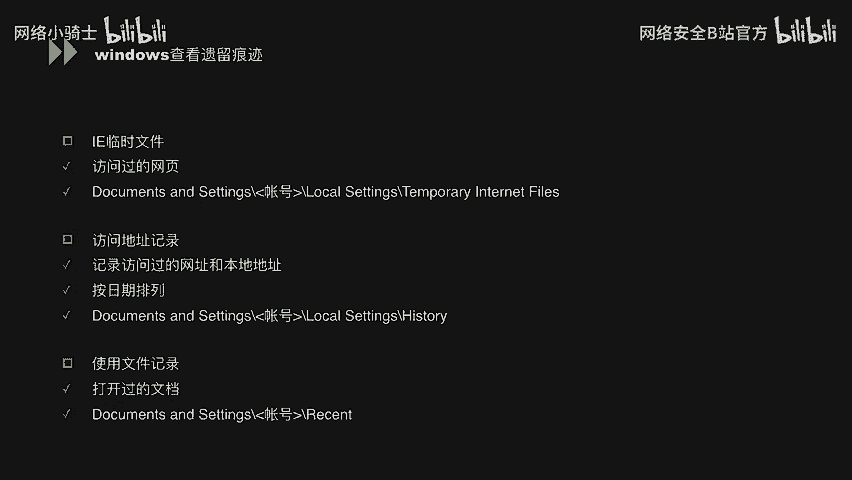
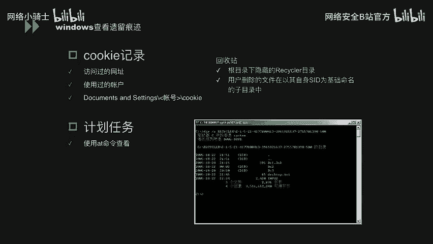
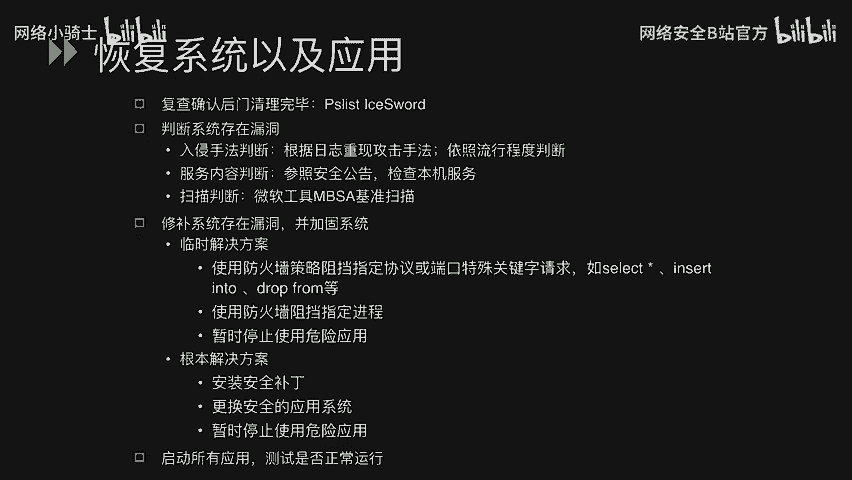

# CTF最强战队蓝莲花内部培训教程：P41：Windows入侵调查 🔍

在本节课中，我们将学习Windows系统安全中至关重要的一个环节：入侵调查。我们将系统地了解如何发现系统异常、如何分析日志以追溯攻击行为，以及如何恢复系统并加固安全。

---

## 及早发现系统异常 🚨

上一节我们介绍了Windows系统安全的基础，本节中我们来看看如何及早发现系统异常。及时发现异常是遏制攻击、减少损失的第一步。

我们可以通过以下几个方面的迹象来察觉系统可能已被入侵：

以下是系统层面的异常迹象：

1.  **系统启动方面**：检查系统日志中记录的运行时间与网络连接时间。例如，通过命令 `systeminfo | findstr /C:"启动时间"` 可以查看系统已运行时长，异常的短时间重启可能意味着被攻击后重启。
2.  **系统资源方面**：观察是否有进程异常占用大量CPU或物理内存。例如，在任务管理器中发现未知进程持续占用高CPU（如 `svchost.exe` 异常变体）。同时，监控磁盘空间是否被未知文件快速占满。
3.  **网络流量异常**：监控是否收到大量异常网络数据包，如SYN洪水攻击包或ICMP攻击包，这可能预示着DDoS攻击。

除了系统本身，还可以通过以下途径发现异常：

1.  **边界安全产品**：部署的IPS（入侵防御系统）、WAF（Web应用防火墙）等设备发出的告警信息。
2.  **其他管理员的报告**：来自其他系统管理员或用户关于功能异常、性能下降的反馈。

发现异常后，应立即着手搜集攻击者可能遗留的痕迹。以下是Windows系统中常见的痕迹位置：

1.  **IE临时文件**：记录用户访问过的网页信息，路径通常为 `%USERPROFILE%\AppData\Local\Microsoft\Windows\Temporary Internet Files\`。
2.  **访问地址记录**：资源管理器地址栏和浏览器历史记录中保存的近期访问过的本地路径和网址。
3.  **使用过的文档记录**：`%USERPROFILE%\Recent\` 目录下记录了最近打开或修改的文档快捷方式。
4.  **Cookie信息**：浏览器Cookie中可能保存了访问网站的会话和账户信息。
5.  **计划任务**：通过 `schtasks` 命令或任务计划程序查看是否有可疑的定时任务被添加。
6.  **回收站**：检查回收站（`$RECYCLE.BIN`）中是否有攻击者未彻底删除的敏感文件。
7.  **注册表**：检查注册表键值，如 `HKEY_LOCAL_MACHINE\SOFTWARE\Microsoft\Windows NT\CurrentVersion\ProfileList` 查看用户配置，或 `HKEY_LOCAL_MACHINE\SOFTWARE` 下查看已安装软件残留信息。
8.  **用户目录检查**：检查 `C:\Users\` 或 `C:\Documents and Settings\` 目录。若存在以某用户名命名的文件夹，但该用户已不在用户列表中，则说明该账户曾被创建后又删除。

---

## 查看日志分析入侵情况 📊

在发现系统异常后，下一步是深入分析日志，以确定入侵的具体时间、方式和路径。日志是调查取证的基石。

分析入侵的基本流程是：首先查看各类审核日志，然后结合上一节提到的攻击痕迹，综合分析入侵原因并定位安全漏洞。

Windows安全日志中记录了详细的登录事件，其中“登录类型”是关键字段。以下是常见的登录类型及其含义：

| 登录类型 | 描述 |
| :--- | :--- |
| 2 | 交互式登录（在控制台登录） |
| 3 | 网络登录（如访问共享文件夹） |
| 4 | 批处理登录（计划任务） |
| 5 | 服务登录（服务启动） |
| 7 | 解锁（解锁带密码保护的屏幕） |
| 10 | 远程交互（通过RDP、远程桌面登录） |

例如，如果发现非管理员在非工作时间通过**类型10（远程交互）** 成功登录，则极有可能是攻击行为。

要有效分析日志，必须确保日志记录完备。以下是两个前提条件：

1.  **开启审核策略**：在“本地安全策略”中启用对账户登录、对象访问等事件的审核。
2.  **保证日志保存能力**：调整Windows事件日志大小，或配置日志服务器进行集中存储，避免日志被覆盖。

接下来，我们具体分析各类日志应关注的重点：

**1. 系统日志**
系统日志记录了驱动、进程、服务的状态变化。应关注以下可能指示攻击的事件：
*   某时刻系统意外重启。
*   某时刻关键系统服务出错或停止。
*   某时刻弹出“终端连接数超过限制”等异常对话框。

**2. 应用程序日志**
应用程序日志记录了用户程序的活动。应关注以下事件：
*   某时刻防火墙或杀毒软件被关闭。
*   某时刻杀毒软件发出病毒警告。
*   某时刻有未知软件被安装或卸载。

**3. 安全性日志**
安全性日志是核心，记录了登录、特权使用等安全事件。应关注：
*   某时刻有用户成功或失败登录（尤其是陌生账户或频繁失败）。
*   某时刻审核策略被更改。

**4. Web日志（以IIS为例）**
Web日志能反映针对Web应用的攻击。主要关注两类信息：
*   **特定请求**：在URL中寻找攻击特征。
    *   文件上传/下载：如包含 `uploadfile.asp`, `download.php` 等。
    *   SQL注入尝试：如包含 `select`, `insert into`, `union select 1,2,3--` 等关键字。
    *   异常参数：如包含单引号(`‘`)、注释符(`--`)、`or 1=1` 等测试语句。
*   **服务器状态码**：HTTP响应码能辅助判断。
    *   `2xx`：请求成功。
    *   `4xx`：客户端错误（如`404`未找到，可能是攻击者在扫描目录）。
    *   `5xx`：服务器端错误（如`500`内部错误，可能是注入攻击导致数据库查询失败）。

---

## 恢复系统以及应用程序 🔧

在通过日志和痕迹分析清楚入侵手法后，我们的最终目标是清除威胁，恢复系统正常运行，并防止再次被入侵。

以下是系统恢复与加固的四个关键步骤：

**1. 清除后门与残留**
确认并删除攻击者安装的后门程序、恶意软件及遗留的痕迹文件。使用专业查杀工具并结合手动检查。

**2. 判断并修补漏洞**
根据入侵手法判断系统存在的漏洞。
*   **服务漏洞判断**：参照微软安全公告（MS Bulletin），检查系统服务（如SMB、RDP）是否存在未修补的漏洞。
*   **扫描判断**：使用微软基准安全分析器（MBSA）等工具进行系统安全扫描。

**3. 实施安全加固**
针对发现的漏洞，采取解决方案。
*   **临时解决方案**：在不影响业务的前提下快速缓解风险。例如，使用防火墙规则阻止攻击源IP、禁用存在漏洞的服务或端口。
*   **根本解决方案**：彻底解决问题。包括安装系统或应用的安全补丁、升级到更安全的应用程序版本、或暂时停止使用存在高危漏洞的组件。

**4. 验证与测试**
在完成修补和加固后，必须进行测试，确保：
*   系统功能正常运行。
*   已知漏洞已被成功修补。
*   新的安全策略（如防火墙规则）未引入新的问题。

---

## 总结 📝

本节课中，我们一起学习了Windows入侵调查的三个核心阶段：
1.  **及早发现系统异常**：通过监控系统资源、网络流量及各类用户痕迹，快速感知潜在威胁。
2.  **查看日志分析入侵情况**：系统性地分析系统日志、安全日志及Web日志，结合登录类型、特定请求等线索，追溯攻击路径与手法。
3.  **恢复系统以及应用程序**：遵循清除后门、判断漏洞、实施加固、验证测试的流程，使系统恢复安全运行状态。

掌握入侵调查技能，不仅能有效应对已发生的安全事件，更能提升对系统潜在风险的洞察力，是构建纵深防御体系的关键一环。