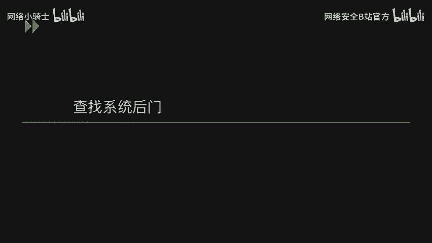
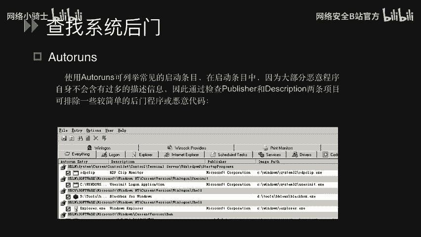
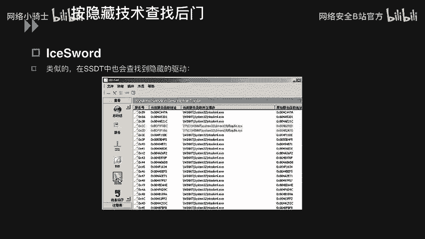
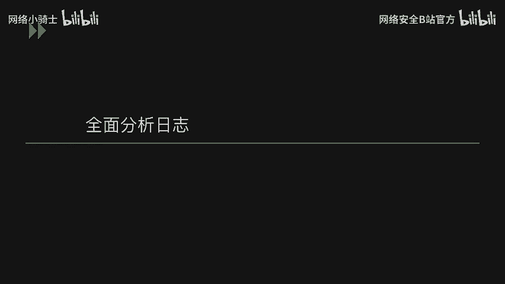
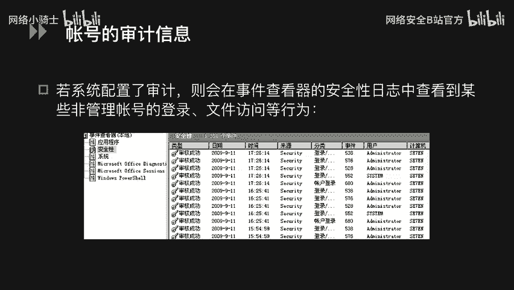
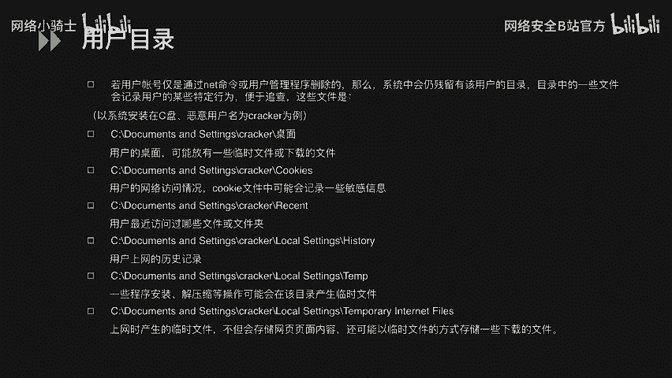
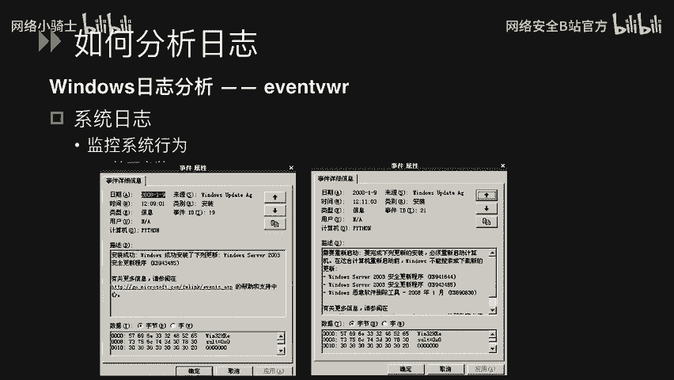
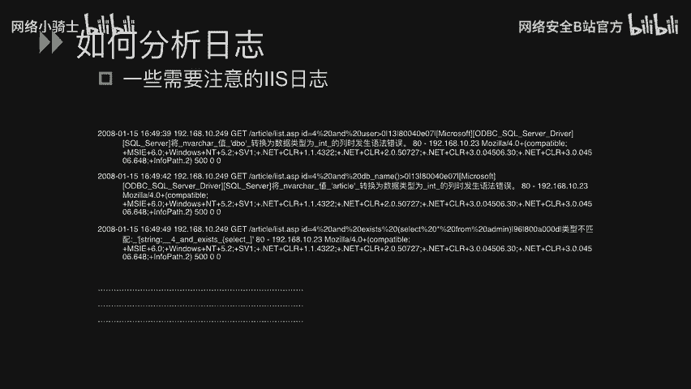
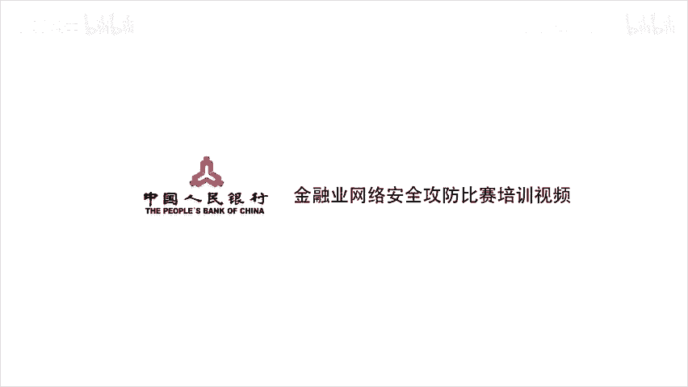

# Windows系统安全：P42：Windows应急响应




在本节课中，我们将学习Windows应急响应的核心内容，主要包括如何查找系统中的后门程序，以及如何全面分析系统日志以定位攻击行为。

## 查找系统后门 🕵️

上一节我们介绍了Windows安全的基础概念，本节中我们来看看如何查找可能隐藏在系统中的后门。攻击者在获取系统权限后，通常会留下后门以便再次访问。以下是几种查找后门的方法和工具。



### 按启动项查找后门

通过检查系统启动时自动加载的程序，可以发现可疑的恶意软件。Windows自带的`msconfig.exe`功能有限，我们可以使用更强大的工具。

以下是推荐的启动项检查工具：
*   **Autoruns**：此工具能检查所有开机自动加载的程序，包括硬件驱动、Windows核心启动程序和应用程序。它能列出比`msconfig`更详细的启动项目，例如`LSA`、`IE`加载的DLL等组件。恶意程序通常缺少描述信息，因此可以通过检查 **`Publisher`** 和 **`Description`** 字段来初步判断程序是否可疑。

### 按行为查找后门

木马程序在运行时，除了访问敏感文件、注册表，还可能创建辅助文件。监控这些异常行为有助于发现后门。





以下是推荐的行为监控工具：
*   **FileMon**：此工具以进程为线索，监控并记录该进程对文件的所有访问操作（如读取、写入）及其结果。可以通过过滤特定进程名（例如 `csrss.exe`）来聚焦监控目标。
*   **RegMon**：此工具专门监控注册表的一切操作（读取、修改、删除），并将记录信息保存下来供用户分析、过滤和查找，为系统维护提供便利。

### 按隐藏技术查找后门



攻击者为了隐蔽，会隐藏其进程或驱动。使用专业工具可以揭露这些隐藏项。



以下是推荐的隐藏项检测工具：
*   **IceSword（冰刃）**：这是一款功能强大的安全检测工具。利用其进程查看功能，可以检测系统中是否存在被隐藏的进程（隐藏进程会被标记为**红色**）。同样，在SSDT（系统服务描述符表）中，隐藏的驱动也会被标记出来。

## 全面分析系统日志 📊

在学习了如何查找后门之后，我们来看看如何通过分析系统日志来追溯攻击者的入侵路径和行为。



### 账号审计与用户目录

如果系统配置了审计策略，可以在“事件查看器”的“安全日志”中查看账号的登录、文件访问等行为记录。记录中包含登录时间、来源IP、使用的用户（如管理员、`SYSTEM`或自定义用户）等信息。

用户登录系统后，会在系统中留下痕迹。分析用户目录有助于发现异常。
以下是用户目录中可能包含的关键信息位置：
*   **桌面**：可能遗留临时下载的文件。
*   **Recent**：记录最近访问的文件和文件夹。
*   **Cookies**：可能包含上网历史记录等敏感信息。
*   其他目录可能包含程序安装、解压等操作的历史记录。

### 安全日志与系统日志分析

日志分析是应急响应的关键。我们来看具体如何分析。

以下是Windows主要日志类型的分析要点：
*   **安全日志**：记录与安全相关的事件。例如，“登录/注销”事件显示了哪个用户何时登录；“对象访问”事件记录了用户对特定目录的操作；“策略更改”事件显示了用户对审核策略的修改。
*   **系统日志**：记录系统组件相关事件。例如，事件日志服务本身的启动/停止记录，或Windows更新的成功安装记录。

### 应用程序日志分析（以IIS日志为例）

对于Web服务器，分析其应用程序日志（如IIS日志）至关重要。IIS日志默认路径为 `%SystemRoot%\system32\LogFiles`，按日期存储。

一条典型的IIS日志格式如下：
```
2017-12-24 15:42:20 192.168.10.67 GET /NSFocus.html 8080 192.168.10.61 Mozilla/5.0 200
```
其含义为：在`2017-12-24 15:42:20`，客户端IP `192.168.10.61` 使用 `GET` 方法访问了服务器 `192.168.10.67:8080` 上的 `/NSFocus.html` 文件，用户代理是 `Mozilla/5.0`，服务器返回状态码 `200`。



通过分析请求内容，可以发现攻击行为。
以下是日志中常见的攻击特征示例：
*   **目录遍历/扫描**：日志中出现大量尝试访问不同目录（如 `/admin/`, `/backup/`, `/data/`）的请求，返回码混合`200`和`404`，这通常是攻击者在进行目录扫描。
*   **SQL注入尝试**：请求URL中包含明显的SQL注入特征字符。
    *   例如：`...id=1‘ AND 1=1 --` 利用 `AND` 和注释符 `--` 进行注入测试。
    *   例如：`...id=1‘ AND (SELECT DB_NAME())>0 --` 尝试获取数据库名。
    *   例如：`...id=1‘ UNION SELECT username, password FROM admin --` 尝试直接查询管理员表。
    如果在日志中发现大量此类语句，说明网站可能面临SQL注入攻击，需立即检查并修复漏洞。
*   其他攻击如XSS（跨站脚本）、文件上传等也会在日志中留下特定字符模式。了解这些攻击手法有助于更准确地从日志中定位安全事件。




本节课中我们一起学习了Windows应急响应的两个核心部分：使用多种工具（如Autoruns, FileMon, IceSword）查找系统后门，以及通过全面分析安全日志、系统日志和应用程序日志（如IIS日志）来追溯攻击行为、定位系统漏洞。掌握这些技能是进行有效安全防御和事件响应的基础。