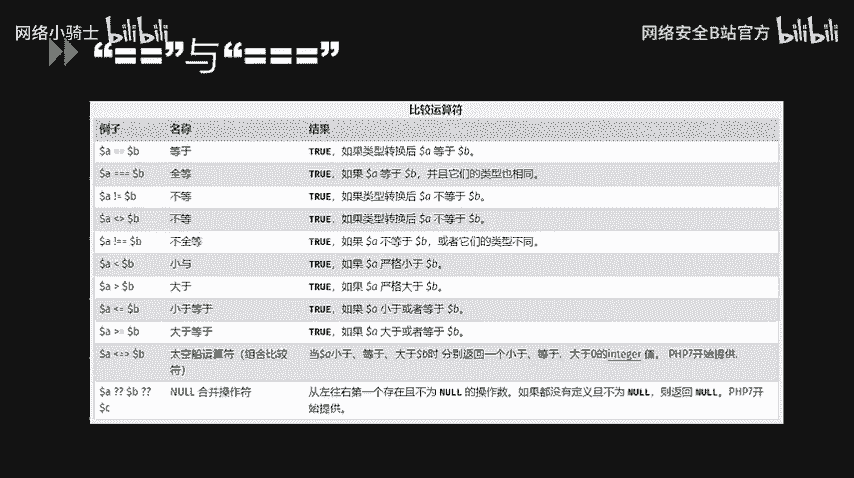
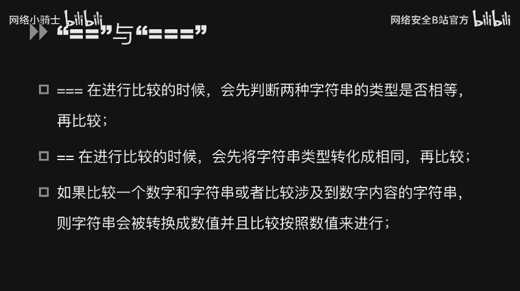
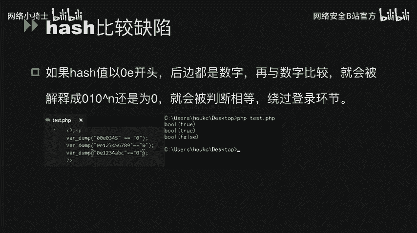
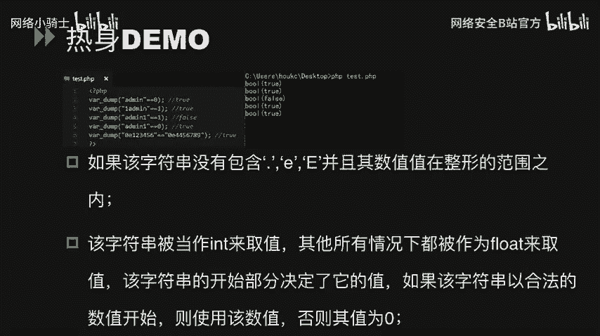
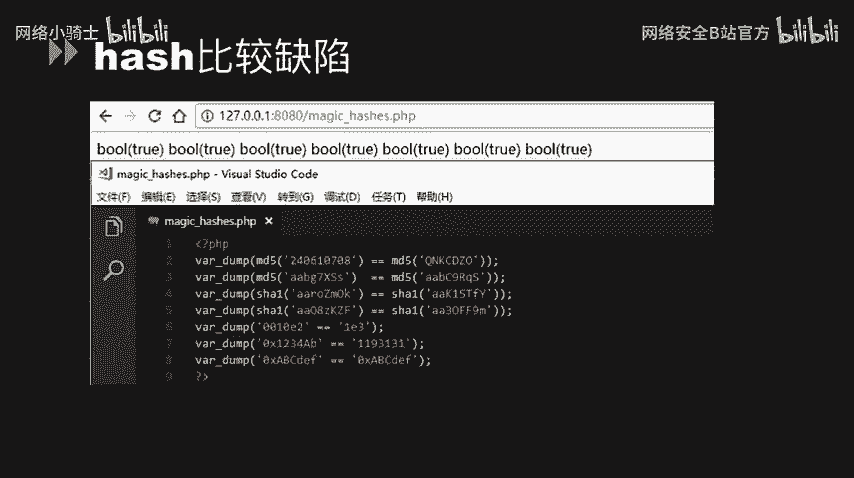
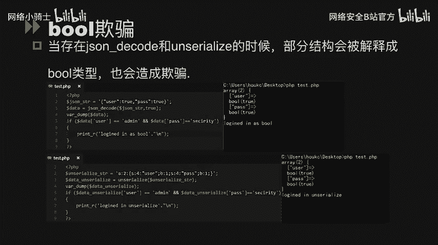

# CTF最强战队蓝莲花内部培训教程：P43：44.代码审计 🔍


在本节课中，我们将要学习CTF比赛中PHP代码审计的核心应用。我们将重点探讨PHP中因类型比较和函数特性而引发的安全漏洞，这些漏洞常被用于绕过条件判断或获取权限。

## 松散比较与严格比较 🔄



上一节我们介绍了代码审计的重要性，本节中我们来看看PHP中两个基础的比较运算符：双等号（`==`）和三个等号（`===`）。它们的核心区别在于类型检查的严格程度。

*   **双等号 `==`**：称为松散比较。在比较前，会尝试将操作数转换为相同类型。
*   **三个等号 `===`**：称为严格比较。要求比较的两个值不仅值相等，**类型也必须相同**。



在PHP官方手册中，存在一些不符合直觉的比较结果。例如，数字 `1` 和字符串 `"1"` 使用 `==` 比较结果为 `true`，而 `0` 和 `"abc"` 比较结果也为 `true`。这是因为 `==` 在比较时，会先将字符串 `"abc"` 强制转换为数字。由于 `"abc"` 不以数字开头，它被转换为 `0`，因此 `0 == 0` 成立。

以下是演示代码：
```php
var_dump(1 == "1"); // 输出: bool(true)
var_dump(0 == "abc"); // 输出: bool(true)
var_dump(1 === "1"); // 输出: bool(false)
```

## 哈希比较缺陷（Magic Hash）⚡️

理解了基础比较后，我们来看一个利用松散比较的经典漏洞：哈希比较缺陷，也称为“魔法哈希”。


这个缺陷源于：当一个字符串经MD5或SHA1等哈希计算后，得到以 **`0e`开头且后面纯数字** 的结果（如 `0e123456`）时，PHP在松散比较中会将其解释为科学计数法的数字 `0`。



以下是关键原理：
*   `"0e123456" == 0` 成立，因为两者都被视为数字 `0`。
*   因此，如果两个不同的字符串，其哈希值都满足 `0e[0-9]*` 的格式，那么它们使用 `==` 比较时结果将为 `true`。



以下是一些著名的“魔法哈希”碰撞对：
*   `240610708` 的MD5：`0e462097431906509019562988736854`
*   `QNKCDZO` 的MD5：`0e830400451993494058024219903391`
*   `aaroZmOk` 的SHA1：`0e66507019969427134894567494305185566735`
*   `aaK1STfY` 的SHA1：`0e76658526655756207688271159624026011393`


攻击者可以利用此缺陷，在只验证哈希值是否相等（使用`==`）的登录环节，使用不同的输入绕过凭证检查。

## 布尔欺骗 🔀

当代码使用 `json_decode()` 或 `unserialize()` 函数处理用户输入，并将结果用于松散比较时，可能引发布尔欺骗。



以下是两个示例：

**示例1：json_decode欺骗**
```php
$json_string = '{"user":true,"pass":true}';
$data = json_decode($json_string, true);

if ($data['user'] == 'admin' && $data['pass'] == 'sec') {
    echo "登录成功！"; // 这行代码会被执行
}
```
解释：`json_decode` 将字符串中的 `true` 解析为布尔值 `true`。在松散比较中，`true == “admin”` 的结果为 `true`。

**示例2：unserialize欺骗**
```php
$serialized_string = 'a:2:{s:4:"user";b:1;s:4:"pass";b:1;}';
$data = unserialize($serialized_string);

if ($data['user'] == 'admin' && $data['pass'] == 'security') {
    echo "验证通过！"; // 这行代码会被执行
}
```
解释：`unserialize` 将序列化数据中的 `b:1` 还原为布尔值 `true`，同样利用松散比较实现欺骗。



## 数字转换欺骗 🔢

数字转换欺骗发生在字符串被强制转换为数值的过程中。

以下是相关示例：

**示例1：intval转换**
```php
echo intval("2"); // 输出: 2
echo intval("3abc"); // 输出: 3 (读取到数字3后停止)
echo intval("abc"); // 输出: 0 (开头非数字)
```

**示例2：科学计数法比较**
```php
var_dump("123456" == "0x1E240"); // 输出: bool(true)
```
解释：字符串 `"0x1E240"` 被识别为十六进制数，转换为十进制后正好是 `123456`。

**示例3：浮点数精度问题**
```php
$userID = 0.99999999999999999999;
if ($userID == 1) {
    echo "进入管理分支"; // 可能因浮点数精度问题而执行
}
```

**示例4：用户输入验证绕过**
```php
$uid = $_GET['uid']; // 用户输入
if ($uid == 1) {
    // 执行敏感操作
}
```
攻击者可以传入 `uid=1abc`，由于松散比较，`"1abc"` 会被转换为数字 `1`，从而绕过检查。

## 危险的松散类型函数 ⚠️

PHP中一些函数在处理非预期类型参数时行为异常，可能被利用。

以下是几个关键函数：

**1. strcmp 函数**
`strcmp($str1, $str2)` 用于比较两个字符串。若 `$str1` 为字符串，`$str2` 为数组，该函数会返回 `NULL`。在松散比较中，`NULL == 0` 成立。
```php
if (strcmp($_GET['password'], $real_password) == 0) {
    // 传入 password[]=xxx 可使条件成立
}
```

**2. md5 函数**
`md5($str)` 计算字符串的MD5哈希值。如果传入一个数组，函数不会报错，但会返回 `NULL`。因此，任意两个数组的MD5值在松散比较中都相等。
```php
$arr1 = array('a');
$arr2 = array('b');
if (md5($arr1) == md5($arr2)) {
    echo "MD5相等！"; // 这行代码会被执行
}
```

## 哈希函数与生日攻击 🎂

最后，我们从理论层面理解哈希函数为何并非绝对安全。这涉及到“生日攻击”的概念。

生日问题指出：在一个23人的班级中，有两人同一天生日的概率超过50%。这个概率远高于直觉判断。将其映射到哈希函数：
*   **哈希空间** 相当于一年的天数（如MD5有2^128个可能值）。
*   **寻找碰撞** 相当于寻找两个具有相同输出（生日）的不同输入（人）。

结论是，**找到哈希碰撞所需的尝试次数远小于遍历整个哈希空间**。这意味着，无论哈希算法多复杂，理论上都存在通过有限次尝试找到两个不同输入产生相同哈希值的可能（碰撞）。因此，不能完全依赖哈希函数本身的安全性，尤其是在使用松散比较（`==`）时。

---


本节课中我们一起学习了PHP代码审计中的关键漏洞点：从**松散比较**与严格比较的区别出发，探讨了**哈希比较缺陷**、**布尔欺骗**、**数字转换欺骗**等利用方式，并分析了 `strcmp`、`md5` 等函数的危险用法。最后，通过**生日攻击**原理，我们理解了哈希函数存在碰撞的必然性。掌握这些知识，对于发现和利用CTF中的Web题目漏洞至关重要。