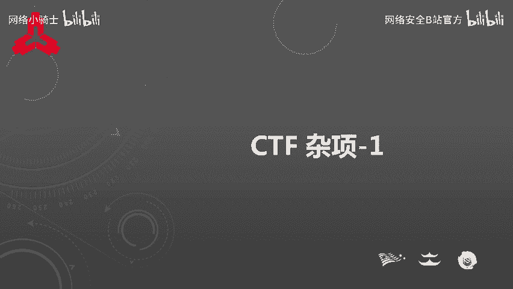
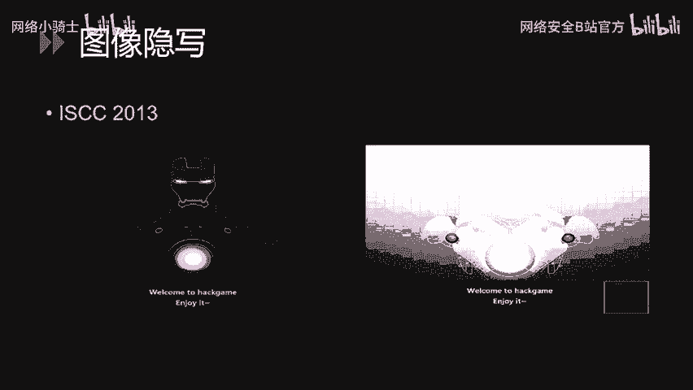
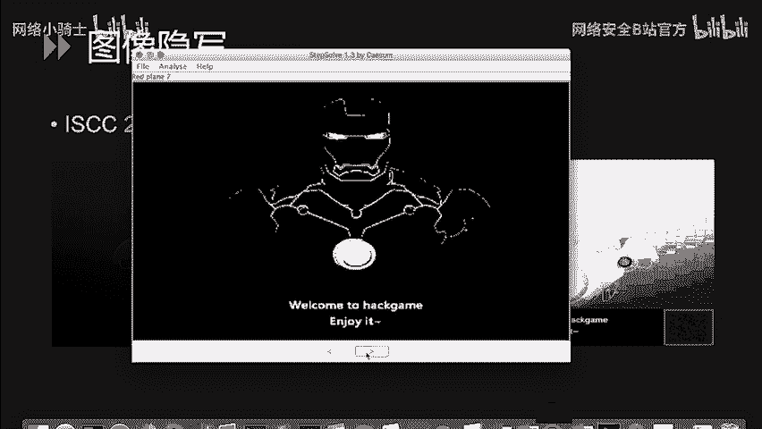
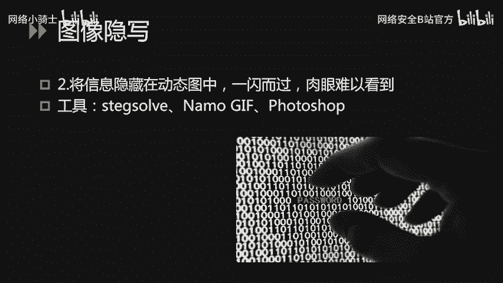
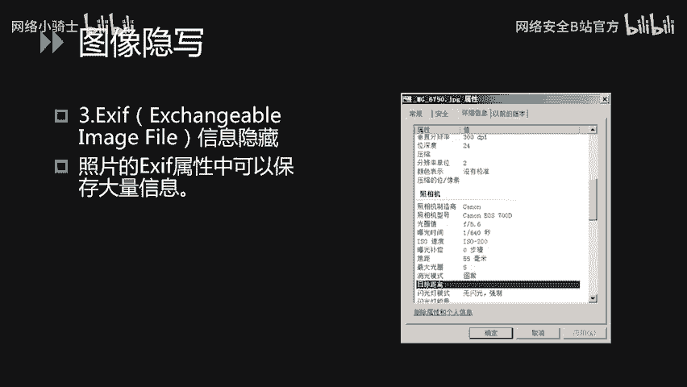
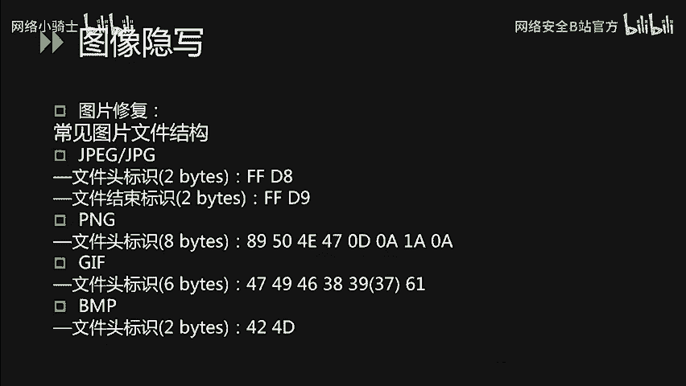
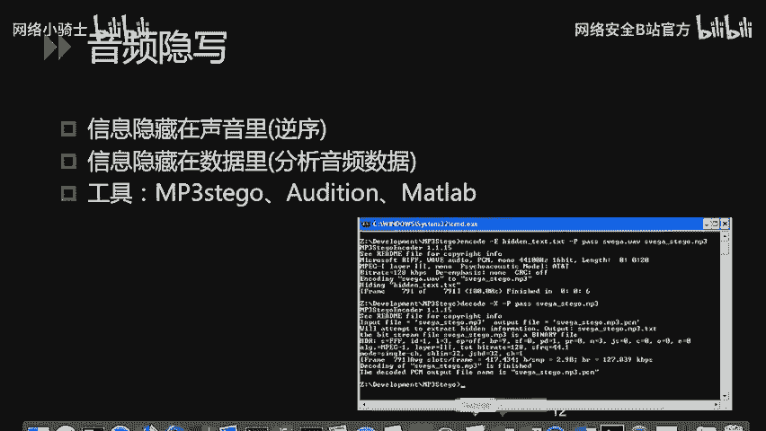
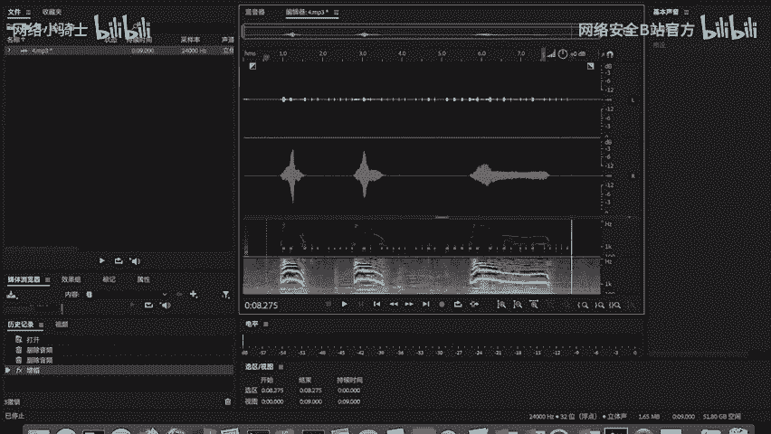
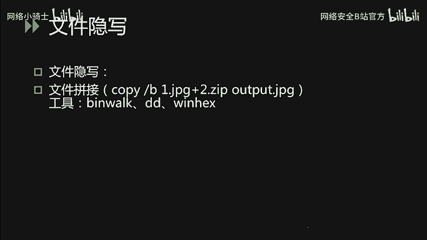
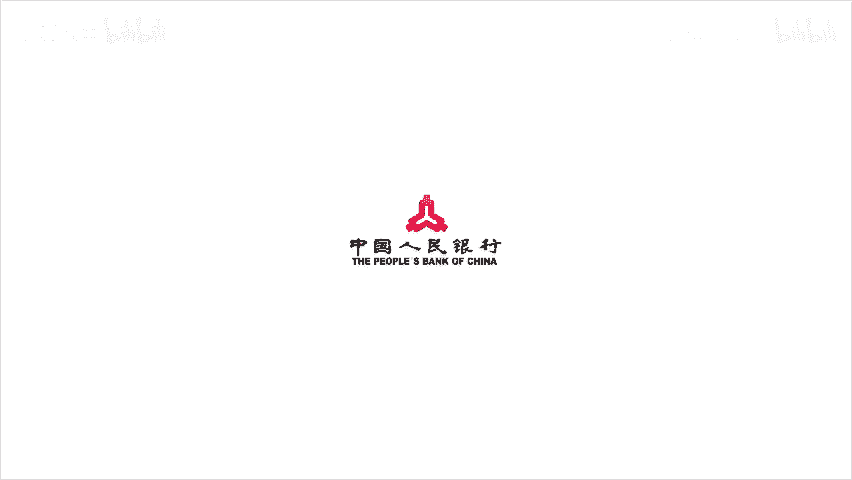

# CTF最强战队蓝莲花内部培训教程：P44：45.ctf杂项

在本节课中，我们将要学习CTF比赛中的隐写术、密码编码和杂项题目的基本概念与解题思路。这些题型在CTF中占有相当大的比重，掌握它们是提升解题能力的关键。

## 课程概述

本次课程主要针对隐写术、密码编码学以及CTF取证技术进行讲解。隐写术题目将Flag隐藏在各种文件中，密码编码题目通过加密算法隐藏Flag，而杂项题目则是以上几类题型的综合性体现。

## 隐写术简介

隐写术是将信息隐藏在其他载体中，不让计划接收者之外的人获取信息的一种技术。古时候，人们将隐写术用于机密信息的传递，例如战争场景。在电影中，我们常看到间谍将密报纸在火上烤或在水中浸泡以显示文字，这是一种基于物理方式的传统隐写术。

在CTF中遇到的隐写术，大部分以多媒体文件为载体，例如图片、音频、视频或压缩包文件。此类题目出题非常灵活，我们无法枚举所有类型，只能介绍常见的解题思路。

## 常见隐写术类型

CTF中隐写术题目以两种类型较为常见：插入法和替换法。

*   **插入法**：将需要隐藏的消息插入文件中的某个空白部位，例如图片的EXIF信息隐写。
*   **替换法**：通过改变原有文件中某部分的文件内容达到隐写效果。

以下是几种典型的图像隐写类型。

### 1. 基于LSB的最低有效位隐写

这种隐写技术利用了像素三原色的原理。显示器上显示的颜色由RGB三种颜色组成。例如，一个纯红色图案的十进制颜色值是255，二进制是`11111111`。如果我们将最后一位的1变成0，肉眼无法看出颜色差距，但最低有效位已经发生了变化。

因此，可以利用像素颜色值的变化来进行图像隐写。我们可以使用图像隐写术解题工具 **Stegsolve** 来解此类题目。

**示例**：
使用Stegsolve打开题目图片，点击下方箭头，查看不同通道、不同色差下的图像。当调整到一定程度时，即可看到右下角隐藏的二维码。通过扫码软件识别二维码，即可得到隐藏的信息。

### 2. GIF多帧隐写

此类题目将Flag值藏在GIF中的某一帧或很多帧中。同样可以使用 **Stegsolve** 一帧一帧地查看，该软件具有帧预览功能。当然，也可以使用图像处理软件如Photoshop进行逐帧查看。

### 3. EXIF信息隐写

照片的EXIF属性可以保存大量信息，如相机厂商、型号、镜头型号等。因此，出题人员也喜欢将Flag值藏到EXIF中。

**解题方法**：在Windows上右键点击图片，打开“属性”->“详细信息”选项卡，即可查看相应内容。

### 4. 图片文件修复

这类题目会提供一个已经破损的图片文件，我们需要根据各种文件头的构造对图片进行修复。首先需要熟悉常见图片类型（如JPEG, PNG, GIF, BMP）的文件头特征。

**解题方法**：使用十六进制编辑器，如 **WinHex** 或 **010 Editor**，对错误的文件头进行修复，然后即可正常打开文件查看。

**注意**：以上几种隐写方式可能被重复利用，即一道题目可能同时需要修复图片，再从修复后的图片中读取有效内容。

## 音频隐写

音频内容的隐写也非常有趣，这时我们可能需要用到音频分析软件对音频内容进行数字分析。

**示例**：
使用音频编辑软件 **Audition** 打开一道CTF题目。可以看到该题目的左右声道信息有所不同，大部分信息藏在左声道的中间部分。我们可以尝试将没有隐藏信息的部分删掉，并增大左声道的功率。此时可以听到，除了猫的叫声，还有一些类似摩斯电码的声音，呈现出长短组合的特征。

这明显是一段摩斯电码。因此，我们可以手动将其转为摩斯电码值，再用摩斯电码表转为英文字母，从而解题。

## 视频隐写

视频隐写和图像的多帧隐写相似。出题人员习惯将Flag值藏在视频的多帧中。因此，可以使用视频编辑软件对隐写的内容进行逐帧提取。

## 文件隐写（文件拼接）

文件隐写在CTF题目中也较为常见。通常简单的题目会直接使用Windows下的 `copy /B` 命令将两个文件拼合。

例如：`copy /B image.jpg + flag.zip output.jpg`
这个命令将一个图片和一个ZIP压缩包合并输出为一张图片（即“图种”）。直接打开该图片看到的仍然是图片信息，但图片的后半部分实际上是一个ZIP压缩包。

**解题方法**：将图片文件重命名为 `.zip` 后缀，然后使用解压软件打开即可。

如果我们遇到类似题目，无法肉眼识别是由哪两种文件进行拼合的，可以使用Linux下的 `binwalk` 命令进行查看。这个命令可以直接将合并后的文件拆分成多个原始文件的组合。我们也可以使用十六进制查看器，查找文件的特征值（文件头），从而进行手动拆分。

## 课程总结

本节课我们一起学习了CTF中隐写术、密码编码和杂项题目的基础。我们介绍了隐写术的基本概念，并详细讲解了基于LSB、GIF多帧、EXIF信息、文件修复等多种图像隐写技术，以及音频、视频和文件拼接隐写的常见解题思路和工具。掌握这些基础方法和工具，是解决CTF杂项题目的第一步。