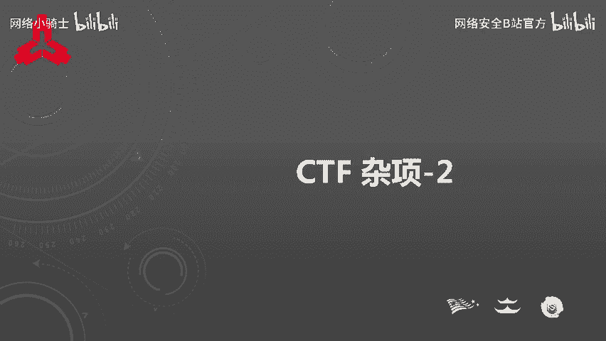
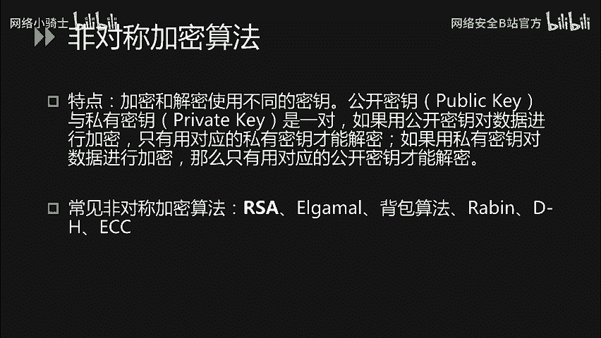
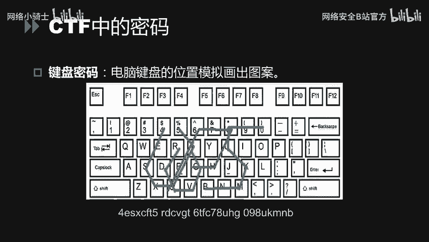
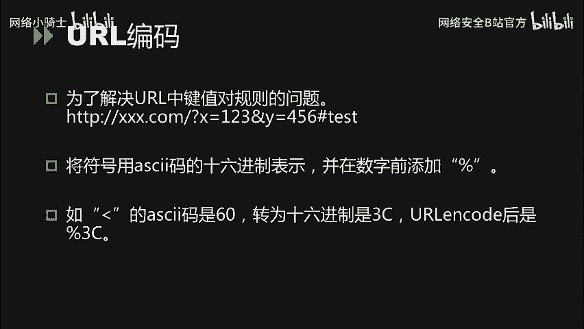
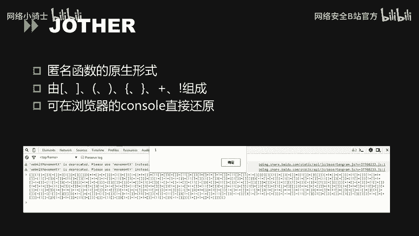
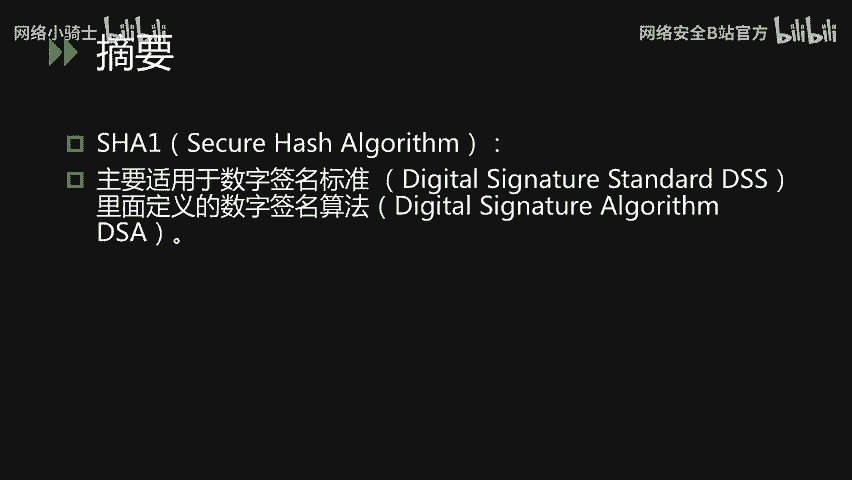
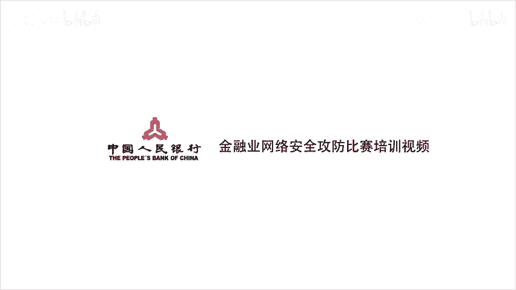

# CTF最强战队蓝莲花内部培训教程：P45：CTF杂项 - 密码、编码与摘要基础 🧩



在本节课中，我们将学习CTF杂项中关于密码学、编码和摘要的基础知识。我们将从基本概念入手，逐步介绍古典密码、现代密码、常见编码格式以及摘要算法，并通过实例帮助初学者理解。

## 概述

密码学、编码和摘要是CTF比赛中的重要组成部分。它们虽然都涉及信息的转换，但目的和原理各不相同。本节课程将清晰地区分这三者，并介绍各自在CTF中的常见题型与解题思路。

---

## 密码学基础

首先，我们需要明确密码学的定义。我们日常登录账号时使用的“密码”，在专业术语中应称为“口令”。而密码学中的“密码”，指的是将**明文**信息通过**加密算法**进行处理后得到的**密文**。其核心特点是，可以通过对应的**解密算法**和**密钥**将密文还原为明文。

这与**编码**和**摘要**有本质区别：
*   **编码**：使用公开、已知的规则（如Base64）对信息进行格式转换，任何人都可以对其进行解码还原。
*   **摘要**（或称哈希）：将任意长度的数据通过算法（如MD5）计算成固定长度的哈希值。这个过程是单向的，无法从哈希值反推出原始数据。

在CTF中，常见的密码学题目主要分为三类：**古典密码**、**现代密码**以及一些**特殊的图形替换密码**。

### 古典密码学

古典密码通常指计算机出现之前使用的加密方法，在CTF中可分为**置换密码**和**替换密码**。

#### 凯撒密码

凯撒密码是一种典型的位移替换密码。其原理是将字母表顺序移动固定的位数（即密钥K）来进行加密。

**公式**：`密文字母 = (明文字母 + K) mod 26`

例如，明文 `hello world` 在密钥 `K=1` 时，加密过程为：H->I, e->f, l->m, l->m, o->p, (空格保留), w->x, o->p, r->s, l->m, d->e。最终得到密文 `ifmmp xpsme`。

其解密非常简单，因为字母只有26个，可以通过暴力枚举所有可能的K值（0-25）来尝试破解。

**代码示例（Python解密思路）**：
```python
ciphertext = "ifmmp xpsme"
for k in range(26):
    plaintext = ''
    for char in ciphertext:
        if char.isalpha():
            shifted = chr((ord(char.lower()) - ord('a') - k) % 26 + ord('a'))
            plaintext += shifted
        else:
            plaintext += char
    print(f"K={k}: {plaintext}")
```
在输出中，可读的英文句子即为正确明文。

**ROT13** 是凯撒密码的一个特例，其位移位数固定为13。由于26个字母的一半是13，所以加密和解密是同一个操作：`ROT13(ROT13(text)) = text`。

#### 栅栏密码

栅栏密码是一种置换密码，其本质是分组重排。加密时，将明文分成若干组（栏），然后按栏依次取字组成密文。

例如，明文 `helloworld`，按2栏加密：
*   第一栏：`h l o o l`
*   第二栏：`e l w r d`
*   取字顺序：先取第一栏第一个`h`，再取第二栏第一个`e`，接着第一栏第二个`l`，第二栏第二个`l`... 最终得到密文：`hlelowlrod`。

解密时，需要知道栏数，将密文按相反顺序重新分组即可还原。

#### 弗吉尼亚密码

弗吉尼亚密码可以看作是使用二维表格（维吉尼亚表）的替换密码，它通过一个密钥词来决定为明文中每个字母使用不同的位移量。

加密过程：例如明文 `hello`，密钥 `key`。
1.  将密钥重复至与明文等长：`keyke`。
2.  查维吉尼亚表，明文字母`h`与密钥字母`k`的交点，即为密文字母。
3.  依次处理，得到最终密文。

这类题目的解密通常需要密钥，或使用在线工具/脚本进行破解。



### 现代密码学

现代密码学主要分为**对称加密**和**非对称加密**。

*   **对称加密**：加密和解密使用**相同的密钥**。常见算法有DES、3DES、AES。CTF中解题的关键在于找到密钥或对密钥进行暴力破解。
*   **非对称加密**：加密和解密使用**一对密钥**（公钥和私钥）。用公钥加密的数据只能用对应的私钥解密，反之亦然。常见算法有RSA、ElGamal。这类题目在CTF中相对较少。

### CTF中的特殊密码

除了标准密码，CTF中还流行一些基于图形或特殊规则的“密码”。

*   **猪圈密码**：使用由点和线构成的简单图形来代表字母。解题需要对照已知的密码表。
*   **培根密码**：使用五位的`A`和`B`序列来替换字母。通常将`A`视为0，`B`视为1，转换为二进制后对应字母序号（A=0, B=1...）。
*   **键盘密码**：利用键盘上字母的布局形状来加密。例如，密文是键盘上相邻的按键，在键盘上按顺序连线可能会画出一个字母的形状，这个字母就是明文的一部分。



---

## 编码与摘要

上一节我们介绍了密码学，本节我们来看看编码和摘要。再次强调，**编码是为了方便传输或存储而进行的格式转换，摘要是为了验证完整性而进行的单向哈希计算**。

### 常见编码格式

以下是CTF中几种常见的编码：

**ASCII码**
美国信息交换标准代码，用7位二进制数（后扩展为8位）表示一个字符。看到一串十进制或十六进制数字时，可以尝试将其转换为ASCII字符。

**Base64编码**
Base64将每3个8位字节转换为4个6位字节，然后在每个6位字节前补两个0，形成新的8位字节。如果原文不是3的倍数，会用0填充并在编码结果末尾添加等号`=`。

**特征**：编码结果通常由`A-Z`，`a-z`，`0-9`，`+`，`/`组成，末尾可能有1或2个`=`。

**URL编码**
在URL中，某些字符（如`?`，`=`，`&`，`#`，空格等）有特殊含义。为了传输这些字符本身，需要对其进行百分号编码（`%XX`，XX为字符ASCII码的十六进制）。

例如，`<`的ASCII码是60，十六进制是`3C`，其URL编码为`%3C`。

**JSFuck与JJEncode**
这两种都是仅使用JavaScript中少量特殊字符来编写完整代码的编码形式。
*   **JSFuck**：仅使用`[`，`]`，`(`，`)`，`!`，`+`六个字符。
*   **JJEncode**：原理类似，使用更多样化的符号组合。

**解题方法**：直接将编码后的字符串复制到浏览器的开发者工具（Console）中执行，即可得到解码结果或执行效果。



**摩斯电码**
用点（`.`）和划（`-`）的不同组合来表示字母、数字和标点。点划之间用空格分隔，字符之间用`/`或更长的空格分隔。

当题目中出现长短两种符号（如`..-./---`）或`ABAB`形式的替换时，可尝试摩斯电码。

**二维码**
即QR Code，一种二维矩阵条形码。使用扫码工具或在线解码网站即可读取其中隐藏的信息。



### 常见摘要算法

摘要算法，又称哈希函数，用于生成数据的“指纹”。

**MD5**
是最常见的哈希算法之一，输出通常为32位十六进制字符串。
其特性包括：
1.  **压缩性**：任意长度输入，输出固定长度。
2.  **易计算性**：计算速度快。
3.  **抗修改性**：原始数据哪怕只改动一位，得到的MD5值也截然不同。
4.  **弱抗碰撞性**：理论上难以找到两个不同的数据具有相同的MD5值（但已被破解，可构造碰撞）。

在CTF中，有时会遇到需要“破解”MD5的题目，通常是指通过彩虹表或在线数据库（如`cmd5.com`）反查已知的哈希值。

**SHA家族**
如SHA-1， SHA-256等，原理与MD5类似，但安全性更高（输出长度更长）。特性与MD5相同，同样用于验证数据完整性。

---

## 总结

本节课我们一起学习了CTF杂项中密码、编码和摘要的基础知识。

我们首先明确了三者的核心区别：**密码**依赖密钥进行可逆的加解密；**编码**是公开规则的可逆格式转换；**摘要**是单向不可逆的哈希计算。



接着，我们介绍了从**古典密码**（如凯撒、栅栏）到**现代密码**（对称/非对称加密）的演变，以及CTF中常见的**特殊密码**（如猪圈、培根密码）。然后，我们探讨了多种**编码格式**（如Base64， URL编码， JSFuck）和**摘要算法**（如MD5， SHA），并提供了识别特征和基本的解题思路。



掌握这些基础知识是解决CTF中相关题目的第一步。在实际比赛中，灵活运用在线工具、编写脚本以及积累常见的密码表/编码模式至关重要。